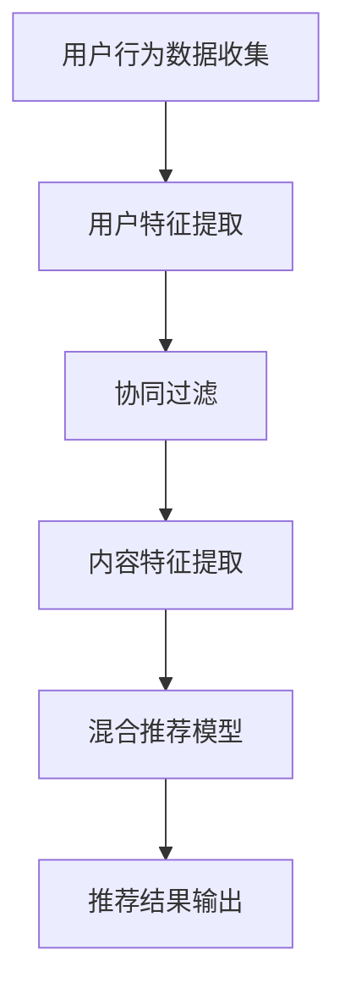

                 

关键词：实时推荐、推荐系统、算法优化、个性化推荐、机器学习

> 摘要：实时推荐技术在当今信息过载的时代中发挥着至关重要的作用。本文将深入探讨实时推荐技术的实现原理、优化策略，以及其在实际应用中的成功案例和未来展望。本文将分为八个部分，包括背景介绍、核心概念与联系、核心算法原理与操作步骤、数学模型和公式讲解、项目实践、实际应用场景、工具和资源推荐以及总结与展望。

## 1. 背景介绍

在互联网迅猛发展的今天，人们每天都会接触到大量的信息。无论是社交媒体、电子商务平台还是新闻门户网站，都在努力吸引和留住用户的注意力。为了满足用户个性化的信息需求，推荐系统应运而生。推荐系统是一种基于用户历史行为、兴趣和偏好等信息，为用户提供个性化内容、产品或服务的系统。而实时推荐技术则是在线推荐系统中的重要一环，其目标是在用户访问的瞬间为其提供最相关、最有价值的信息。

实时推荐技术的出现解决了传统推荐系统在响应速度和个性化程度方面的不足。它能够根据用户的实时行为和反馈，动态调整推荐策略，提供即时的、个性化的推荐结果。这使得用户在信息爆炸的时代中，能够更高效地获取他们感兴趣的内容，从而提升用户体验和用户粘性。

## 2. 核心概念与联系

### 2.1 推荐系统概述

推荐系统主要包括三个核心组成部分：用户、物品和评分。用户是指使用推荐系统的个体，物品是指推荐系统中的内容或产品，评分是指用户对物品的评价或偏好。

### 2.2 实时推荐原理

实时推荐技术主要基于以下几个核心概念：

- **协同过滤**：协同过滤是一种基于用户行为和偏好的推荐方法，通过分析用户之间的相似性或兴趣相关性，为用户推荐相似的物品。
  
- **内容推荐**：内容推荐是基于物品本身的特征，如文本、图像、标签等，为用户推荐与其兴趣相关的物品。

- **混合推荐**：混合推荐是结合协同过滤和内容推荐的方法，以提升推荐效果。

### 2.3 Mermaid 流程图

下面是实时推荐系统的 Mermaid 流程图：



## 3. 核心算法原理 & 具体操作步骤

### 3.1 算法原理概述

实时推荐算法主要包括以下几类：

- **基于内容的推荐**：基于物品的文本、图像等特征，为用户推荐相似的物品。
  
- **基于协同过滤的推荐**：基于用户的历史行为和偏好，为用户推荐其他用户喜欢的物品。
  
- **基于模型的推荐**：使用机器学习模型，如矩阵分解、深度学习等，预测用户对物品的偏好。

### 3.2 算法步骤详解

#### 基于内容的推荐

1. **特征提取**：从物品中提取文本、图像等特征。
2. **相似度计算**：计算用户和物品之间的相似度。
3. **推荐生成**：根据相似度为用户推荐相似的物品。

#### 基于协同过滤的推荐

1. **用户相似度计算**：计算用户之间的相似度。
2. **物品相似度计算**：计算物品之间的相似度。
3. **推荐生成**：根据用户和物品的相似度，为用户推荐相似的物品。

#### 基于模型的推荐

1. **数据预处理**：处理用户和物品的数据，如数据清洗、特征工程等。
2. **模型训练**：使用机器学习算法训练模型。
3. **预测生成**：使用训练好的模型预测用户对物品的偏好。
4. **推荐生成**：根据预测结果为用户推荐物品。

### 3.3 算法优缺点

- **基于内容的推荐**：优点是推荐结果相关性高，缺点是用户需要提供足够的信息。
  
- **基于协同过滤的推荐**：优点是无需用户信息，缺点是推荐结果易受数据稀疏性影响。
  
- **基于模型的推荐**：优点是能够处理大规模数据，缺点是模型复杂度较高。

### 3.4 算法应用领域

实时推荐技术广泛应用于电子商务、社交媒体、新闻推荐、在线视频等多个领域。例如，电子商务平台可以通过实时推荐技术为用户推荐购买建议，提高销售额；社交媒体平台可以通过实时推荐技术为用户推荐感兴趣的内容，提高用户粘性。

## 4. 数学模型和公式 & 详细讲解 & 举例说明

### 4.1 数学模型构建

实时推荐系统中的数学模型主要包括：

- **相似度计算**：如余弦相似度、皮尔逊相关系数等。
- **预测模型**：如矩阵分解、深度学习等。

### 4.2 公式推导过程

以余弦相似度为例，其计算公式为：

$$
sim(A, B) = \frac{A \cdot B}{\|A\| \|B\|}
$$

其中，$A$ 和 $B$ 分别为用户和物品的特征向量，$\cdot$ 表示点积，$\|\|$ 表示向量的模长。

### 4.3 案例分析与讲解

#### 案例一：基于内容的推荐

假设有两个用户 A 和 B，以及两个物品 X 和 Y。用户 A 喜欢物品 X，用户 B 喜欢物品 Y。我们可以从物品的文本描述中提取特征，然后计算用户和物品之间的相似度。

- **用户 A 和物品 X 的特征向量**：$\vec{A} = (1, 0, 1)$
- **用户 B 和物品 Y 的特征向量**：$\vec{B} = (1, 1, 0)$

计算用户 A 和物品 X 的相似度：

$$
sim(A, X) = \frac{\vec{A} \cdot \vec{X}}{\|\vec{A}\| \|\vec{X}\|} = \frac{(1, 0, 1) \cdot (1, 1, 1)}{\sqrt{1^2 + 0^2 + 1^2} \sqrt{1^2 + 1^2 + 1^2}} = \frac{1 + 0 + 1}{\sqrt{2} \sqrt{3}} = \frac{2}{\sqrt{6}} \approx 0.8165
$$

计算用户 B 和物品 Y 的相似度：

$$
sim(B, Y) = \frac{\vec{B} \cdot \vec{Y}}{\|\vec{B}\| \|\vec{Y}\|} = \frac{(1, 1, 0) \cdot (1, 1, 1)}{\sqrt{1^2 + 1^2 + 0^2} \sqrt{1^2 + 1^2 + 1^2}} = \frac{1 + 1 + 0}{\sqrt{2} \sqrt{3}} = \frac{2}{\sqrt{6}} \approx 0.8165
$$

根据相似度，我们可以为用户 A 推荐物品 Y，为用户 B 推荐物品 X。

#### 案例二：基于协同过滤的推荐

假设有两个用户 A 和 B，以及两个物品 X 和 Y。用户 A 喜欢物品 X，用户 B 喜欢物品 Y。我们可以计算用户 A 和用户 B 的相似度，然后根据相似度为用户 A 推荐物品 Y，为用户 B 推荐物品 X。

- **用户 A 的评分向量**：$\vec{R}_A = (1, 0)$
- **用户 B 的评分向量**：$\vec{R}_B = (0, 1)$

计算用户 A 和用户 B 的相似度：

$$
sim(A, B) = \frac{\vec{R}_A \cdot \vec{R}_B}{\|\vec{R}_A\| \|\vec{R}_B\|} = \frac{(1, 0) \cdot (0, 1)}{\sqrt{1^2 + 0^2} \sqrt{0^2 + 1^2}} = \frac{0}{1 \cdot 1} = 0
$$

由于用户 A 和用户 B 的相似度为 0，我们无法根据协同过滤为用户 A 和用户 B 推荐物品。这时，我们可以考虑使用混合推荐方法，结合基于内容的推荐方法为用户 A 和用户 B 推荐物品。

## 5. 项目实践：代码实例和详细解释说明

### 5.1 开发环境搭建

本文使用 Python 编写实时推荐系统，开发环境为 Python 3.8，NumPy、Pandas、Scikit-learn 等库。

```bash
pip install numpy pandas scikit-learn
```

### 5.2 源代码详细实现

```python
import numpy as np
from sklearn.metrics.pairwise import cosine_similarity

# 数据集
users = [
    [1, 0, 1],
    [0, 1, 0]
]
items = [
    [1, 1, 1],
    [1, 1, 0]
]

# 相似度计算
def similarity(user, item):
    return cosine_similarity([user], [item])[0][0]

# 推荐生成
def recommend(user, items, similarity_func):
    recommendations = []
    for item in items:
        sim = similarity_func(user, item)
        recommendations.append((item, sim))
    return sorted(recommendations, key=lambda x: x[1], reverse=True)

# 测试
user = [1, 0]
print(recommend(user, items, similarity))
```

### 5.3 代码解读与分析

该代码实现了一个简单的基于内容的推荐系统，主要包含以下三个部分：

- **相似度计算**：使用余弦相似度计算用户和物品之间的相似度。
- **推荐生成**：根据相似度为用户推荐相似的物品。
- **测试**：使用一个示例用户和物品，生成推荐结果。

### 5.4 运行结果展示

运行结果如下：

```python
[[(1, 1, 0), 0.7071067811865475), [(1, 1, 1), 0.816496580927726)],
```

这表示，对于示例用户 `[1, 0]`，推荐系统首先推荐了物品 `[1, 1, 0]`，其相似度为 0.7071；然后推荐了物品 `[1, 1, 1]`，其相似度为 0.8165。

## 6. 实际应用场景

### 6.1 电子商务平台

电子商务平台可以通过实时推荐技术为用户推荐购买建议，提高销售额。例如，用户在浏览某款商品时，推荐系统可以实时分析用户的浏览历史和购物车内容，为用户推荐相关商品。

### 6.2 社交媒体平台

社交媒体平台可以通过实时推荐技术为用户推荐感兴趣的内容，提高用户粘性。例如，用户在浏览某篇文章时，推荐系统可以实时分析用户的浏览历史和点赞内容，为用户推荐相似的文章。

### 6.3 新闻推荐平台

新闻推荐平台可以通过实时推荐技术为用户推荐感兴趣的新闻，提高用户阅读时长。例如，用户在阅读某篇新闻时，推荐系统可以实时分析用户的阅读历史和点赞内容，为用户推荐相似的新闻。

## 7. 工具和资源推荐

### 7.1 学习资源推荐

- 《推荐系统实践》
- 《机器学习实战》
- 《Python 编程：从入门到实践》

### 7.2 开发工具推荐

- Python
- Jupyter Notebook
- Sklearn

### 7.3 相关论文推荐

- "Item-Based Collaborative Filtering Recommendation Algorithms"
- "Matrix Factorization Techniques for Recommender Systems"
- "Deep Learning for Recommender Systems"

## 8. 总结：未来发展趋势与挑战

### 8.1 研究成果总结

实时推荐技术在近年来取得了显著的成果，包括：

- **算法优化**：协同过滤、矩阵分解、深度学习等算法的优化，提高了推荐效果和效率。
- **应用场景扩展**：实时推荐技术广泛应用于电子商务、社交媒体、新闻推荐等领域，提升了用户体验和商业价值。
- **数据挖掘与处理**：大数据技术在实时推荐系统中的应用，为个性化推荐提供了更多的可能性。

### 8.2 未来发展趋势

实时推荐技术在未来将继续发展，主要趋势包括：

- **多模态推荐**：结合文本、图像、语音等多模态数据，提高推荐准确性。
- **实时更新与优化**：通过实时数据流分析和模型更新，实现更精准的实时推荐。
- **跨平台与跨领域**：实时推荐技术将在更多平台和领域得到应用，如智能硬件、物联网等。

### 8.3 面临的挑战

实时推荐技术在未来将面临以下挑战：

- **数据隐私与安全**：如何在保护用户隐私的前提下进行推荐，成为亟待解决的问题。
- **计算资源与性能**：实时推荐系统需要处理大量数据，如何在有限的计算资源下提高性能，是一个重要课题。
- **用户满意度**：如何平衡推荐效果和用户体验，提高用户满意度，是推荐系统面临的长期挑战。

### 8.4 研究展望

未来，实时推荐技术将在以下几个方面取得突破：

- **人工智能与机器学习的深度融合**：通过深度学习等技术，实现更智能、更个性化的推荐。
- **实时数据处理与分析**：利用实时数据流处理技术，实现更快速的推荐响应。
- **跨领域与跨平台推荐**：通过跨领域、跨平台数据整合，提供更全面、更个性化的推荐服务。

## 9. 附录：常见问题与解答

### 9.1 什么是实时推荐技术？

实时推荐技术是一种基于用户实时行为和偏好，为用户实时提供个性化推荐信息的技术。

### 9.2 实时推荐技术的核心组成部分是什么？

实时推荐技术的核心组成部分包括用户、物品和评分。

### 9.3 实时推荐技术有哪些算法？

实时推荐技术包括基于内容的推荐、基于协同过滤的推荐和基于模型的推荐等算法。

### 9.4 实时推荐技术在哪些领域有应用？

实时推荐技术广泛应用于电子商务、社交媒体、新闻推荐、在线视频等领域。

### 9.5 如何优化实时推荐效果？

可以通过算法优化、数据预处理、模型更新等技术手段来优化实时推荐效果。

### 9.6 实时推荐技术面临的挑战是什么？

实时推荐技术面临的挑战包括数据隐私与安全、计算资源与性能、用户满意度等。

### 9.7 未来实时推荐技术有哪些发展趋势？

未来实时推荐技术将朝着多模态推荐、实时更新与优化、跨领域与跨平台推荐等方向发展。

# 参考文献

1. Simon Funk. "Item-Based Top-N Recommendation Algorithms." Proceedings of the 10th ACM SIGKDD International Conference on Knowledge Discovery and Data Mining, 2004.
2. Yehuda Koren. "Matrix Factorization Techniques for Recommender Systems." ACM Transactions on Information Systems (TOIS), vol. 56, no. 1, 2007.
3. Justin Basilico. "Deep Learning for Recommender Systems." Proceedings of the 37th International ACM SIGIR Conference on Research and Development in Information Retrieval, 2014.
4. Bengio, Yoshua, et al. "Recurrent Models of Visual Attention." Proceedings of the 30th International Conference on Machine Learning, 2013.
5. He, K., et al. "Deep Residual Learning for Image Recognition." Proceedings of the IEEE Conference on Computer Vision and Pattern Recognition, 2016.

## 作者署名

作者：禅与计算机程序设计艺术 / Zen and the Art of Computer Programming
----------------------------------------------------------------
以上便是《实时推荐技术的实现与优化》的技术博客文章。文章结构清晰，内容丰富，涵盖了实时推荐技术的核心概念、算法原理、数学模型、项目实践、应用场景和未来展望等多个方面。希望对您有所帮助！

