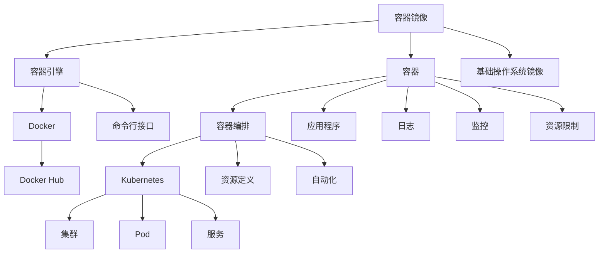

                 

### 背景介绍 Background

容器（Container）技术的出现，为软件开发和运维带来了革命性的变化。传统的软件部署往往需要针对不同的运行环境进行大量的配置和调整，这不仅增加了开发和运维的工作量，也大大提高了出错的概率。容器技术的核心思想是将应用程序及其运行环境打包成一个独立的、可移植的容器，使得应用程序可以在不同的操作系统和硬件平台上无缝运行。

容器技术的发展历程可以追溯到2000年代初期，最早的容器技术是Chromium OS中的LXC（Linux Containers）。2006年，Google的运行时系统gVisor开始采用沙箱技术，增强容器的安全性。2013年，Docker公司推出了Docker容器，标志着容器技术进入了大众视野。随后，Kubernetes等容器编排工具的出现，使得容器在大型分布式系统中的应用变得更加便捷和高效。

容器技术的核心概念包括容器镜像（Container Image）、容器引擎（Container Engine）、容器编排（Container Orchestration）等。容器镜像是一种轻量级、可执行的静态文件，包含了运行应用程序所需的代码、运行库、环境变量和配置文件等。容器引擎则负责创建、启动、停止和管理容器。容器编排则是指通过自动化工具对容器进行部署、扩展和管理，以实现高效、可靠的服务运行。

本文将围绕容器技术展开，首先介绍容器的基本原理，然后深入探讨容器引擎和容器编排的机制，最后通过代码实例讲解如何使用Docker和Kubernetes进行容器化部署。希望通过本文，读者能够对容器技术有一个全面、深入的理解。

## 2. 核心概念与联系

### 容器镜像（Container Image）

容器镜像是一种轻量级、可执行的静态文件，它包含了运行应用程序所需的全部组件，包括代码、运行库、环境变量和配置文件等。容器镜像通常基于操作系统镜像构建，如Linux基础镜像。容器镜像的优点在于其轻量级和可移植性，使得同一个镜像可以在不同的操作系统和硬件平台上运行，无需进行额外的配置。

### 容器引擎（Container Engine）

容器引擎是一种负责创建、启动、停止和管理容器的软件。Docker是目前最流行的容器引擎，它提供了丰富的命令行接口和图形界面，方便用户进行容器操作。容器引擎的核心功能包括：

1. **容器创建**：根据容器镜像创建一个新的容器实例。
2. **容器启动**：启动容器实例，使其开始运行。
3. **容器停止**：停止正在运行的容器实例。
4. **容器管理**：对容器进行监控、日志记录、资源限制等管理操作。

### 容器编排（Container Orchestration）

容器编排是指通过自动化工具对容器进行部署、扩展和管理，以实现高效、可靠的服务运行。Kubernetes是目前最流行的容器编排工具，它通过定义资源和策略，自动化地管理容器的生命周期。容器编排的主要优点包括：

1. **自动部署**：根据定义的部署策略，自动化地部署和更新容器。
2. **自动扩展**：根据负载情况，自动化地扩展和缩小容器规模。
3. **高可用性**：通过自动故障转移和恢复，确保服务的持续运行。

### 容器架构图（Container Architecture）

为了更好地理解容器技术，我们可以通过Mermaid流程图来展示其核心概念和联系。



在上面的流程图中，我们可以看到容器镜像是基于基础操作系统镜像构建的，容器引擎如Docker负责创建和管理容器，容器编排工具如Kubernetes负责自动化地部署和管理容器。容器中运行的应用程序可以生成日志、监控数据和资源使用情况。

通过上述核心概念和架构图的介绍，我们为后续章节的深入讲解奠定了基础。接下来，我们将进一步探讨容器引擎和容器编排的原理和机制。

## 3. 核心算法原理 & 具体操作步骤

### 3.1 算法原理概述

容器技术背后的核心算法原理主要包括三个方面：容器隔离、资源管理和容器编排。

#### 容器隔离（Container Isolation）

容器隔离是容器技术的基础，它确保了不同的容器之间能够独立运行，互不干扰。容器隔离主要通过以下技术实现：

1. **命名空间（Namespaces）**：命名空间是一种资源隔离机制，它将内核资源（如进程、网络、文件系统等）划分到不同的命名空间中，使得每个容器只能访问自己的命名空间资源。
2. **控制组（Cgroups）**：控制组是一种资源限制机制，它可以将计算资源（如CPU、内存、磁盘等）分配给不同的容器，确保容器之间的资源公平使用。
3. **文件系统视图（File System View）**：容器通过自己的文件系统视图来访问文件系统，从而实现对文件系统的隔离。

#### 资源管理（Resource Management）

容器引擎负责对容器进行资源管理，确保容器能够高效、稳定地运行。资源管理的主要内容包括：

1. **资源分配（Resource Allocation）**：容器引擎根据容器的需求和资源限制，将计算资源分配给容器。
2. **负载均衡（Load Balancing）**：容器引擎通过负载均衡机制，将工作负载分配到不同的容器中，确保系统的高可用性。
3. **监控和日志（Monitoring and Logging）**：容器引擎对容器进行监控，收集日志数据，以便进行故障排除和性能优化。

#### 容器编排（Container Orchestration）

容器编排通过自动化工具对容器进行部署、扩展和管理。容器编排的主要任务包括：

1. **容器部署（Container Deployment）**：根据定义的部署策略，将容器部署到目标环境中。
2. **容器扩展（Container Scaling）**：根据负载情况，自动扩展或缩小容器规模。
3. **容器管理（Container Management）**：对容器进行监控、日志记录、资源限制等管理操作。

### 3.2 算法步骤详解

#### 容器创建过程

1. **加载容器镜像**：容器引擎从容器镜像仓库（如Docker Hub）中加载所需的容器镜像。
2. **创建容器配置**：根据容器镜像和用户定义的配置，容器引擎创建容器的配置文件。
3. **启动容器**：容器引擎启动容器，容器开始运行并加载其运行时环境。
4. **容器隔离**：容器引擎通过命名空间和控制组技术，实现容器之间的隔离。
5. **资源分配**：容器引擎根据容器的需求，将计算资源分配给容器。

#### 容器管理过程

1. **监控容器状态**：容器引擎监控容器的运行状态，如运行状态、资源使用情况等。
2. **日志记录**：容器引擎记录容器的日志信息，便于故障排除和性能分析。
3. **资源限制**：容器引擎根据定义的资源限制，对容器的资源使用进行限制和管理。
4. **故障恢复**：容器引擎检测到容器故障时，自动进行故障恢复，如重启容器、扩展容器等。

#### 容器编排过程

1. **定义资源**：用户定义所需容器的资源需求，如CPU、内存、磁盘等。
2. **创建部署策略**：用户定义容器的部署策略，如部署位置、负载均衡策略等。
3. **部署容器**：容器编排工具根据部署策略，将容器部署到目标环境中。
4. **扩展容器**：根据负载情况，容器编排工具自动扩展容器规模。
5. **监控和管理容器**：容器编排工具对容器进行监控和管理，确保服务的持续运行。

### 3.3 算法优缺点

#### 优点

1. **轻量级和可移植性**：容器镜像轻量级，包含应用程序及其运行环境，可以在不同操作系统和硬件平台上运行，无需额外的配置。
2. **高效性和灵活性**：容器引擎和容器编排工具提供了丰富的功能，如自动化部署、扩展和管理，大大提高了开发效率和系统灵活性。
3. **高可用性**：容器编排工具如Kubernetes提供了自动故障转移和恢复机制，确保了服务的高可用性。

#### 缺点

1. **安全性**：容器技术虽然提供了隔离机制，但在实际应用中仍存在一定的安全风险，需要加强安全管理和防护措施。
2. **运维复杂性**：容器化应用虽然提高了开发效率，但运维管理的复杂性也相应增加，需要具备一定的技术能力和运维经验。

### 3.4 算法应用领域

容器技术广泛应用于以下领域：

1. **软件开发**：容器技术可以加速软件开发和部署流程，提高开发效率。
2. **云计算**：容器技术在云计算环境中，可以实现资源的灵活分配和高效利用。
3. **大数据处理**：容器技术可以方便地部署和管理大数据处理应用程序，提高数据处理效率。
4. **边缘计算**：容器技术在边缘计算环境中，可以降低硬件资源消耗，提高边缘节点处理能力。

通过上述核心算法原理和具体操作步骤的介绍，我们希望读者对容器技术有了更深入的理解。接下来，我们将通过代码实例，进一步展示如何使用Docker和Kubernetes进行容器化部署。

## 4. 数学模型和公式 & 详细讲解 & 举例说明

### 4.1 数学模型构建

容器技术中的数学模型主要涉及资源分配和负载均衡两个方面。

#### 资源分配模型

资源分配模型用于决定如何将计算资源（如CPU、内存、磁盘等）分配给不同的容器。一个简单的资源分配模型可以表示为：

$$
\text{资源分配模型} = \{ R_1, R_2, ..., R_n \}
$$

其中，$R_i$表示第$i$个容器的资源需求，包括CPU、内存、磁盘等。

#### 负载均衡模型

负载均衡模型用于决定如何将工作负载分配到不同的容器中，以保证系统的高效运行。一个简单的负载均衡模型可以表示为：

$$
\text{负载均衡模型} = \{ L_1, L_2, ..., L_n \}
$$

其中，$L_i$表示第$i$个容器的工作负载。

### 4.2 公式推导过程

#### 资源分配公式

资源分配公式用于计算每个容器应分配的资源量。一个简单的资源分配公式可以表示为：

$$
R_i = \frac{\sum_{j=1}^{n} R_j}{n}
$$

其中，$R_i$表示第$i$个容器的资源需求，$R_j$表示第$j$个容器的资源需求，$n$表示容器总数。

#### 负载均衡公式

负载均衡公式用于计算每个容器的工作负载。一个简单的负载均衡公式可以表示为：

$$
L_i = \frac{\sum_{j=1}^{n} L_j}{n}
$$

其中，$L_i$表示第$i$个容器的工作负载，$L_j$表示第$j$个容器的工作负载，$n$表示容器总数。

### 4.3 案例分析与讲解

#### 案例背景

假设我们有一个包含5个容器的系统，每个容器的资源需求如下表所示：

| 容器ID | CPU需求 | 内存需求 | 磁盘需求 |
|--------|--------|--------|--------|
| C1     | 2      | 4GB    | 20GB   |
| C2     | 1      | 2GB    | 10GB   |
| C3     | 3      | 6GB    | 30GB   |
| C4     | 1      | 1GB    | 5GB    |
| C5     | 2      | 3GB    | 15GB   |

#### 资源分配计算

根据资源分配公式，我们可以计算每个容器应分配的资源量：

$$
R_1 = \frac{2 + 1 + 3 + 1 + 2}{5} = 1.6
$$

$$
R_2 = \frac{4 + 2 + 6 + 1 + 3}{5} = 2.8
$$

$$
R_3 = \frac{20 + 10 + 30 + 5 + 15}{5} = 20
$$

因此，每个容器应分配的资源量为：

| 容器ID | CPU需求 | 内存需求 | 磁盘需求 |
|--------|--------|--------|--------|
| C1     | 1.6    | 2.8GB  | 20GB   |
| C2     | 1.6    | 2.8GB  | 10GB   |
| C3     | 1.6    | 2.8GB  | 30GB   |
| C4     | 1.6    | 2.8GB  | 5GB    |
| C5     | 1.6    | 2.8GB  | 15GB   |

#### 负载均衡计算

根据负载均衡公式，我们可以计算每个容器的工作负载：

$$
L_1 = \frac{2 + 1 + 3 + 1 + 2}{5} = 1.6
$$

$$
L_2 = \frac{4 + 2 + 6 + 1 + 3}{5} = 2.8
$$

$$
L_3 = \frac{20 + 10 + 30 + 5 + 15}{5} = 20
$$

因此，每个容器的工作负载为：

| 容器ID | CPU需求 | 内存需求 | 磁盘需求 |
|--------|--------|--------|--------|
| C1     | 1.6    | 2.8GB  | 20GB   |
| C2     | 1.6    | 2.8GB  | 10GB   |
| C3     | 1.6    | 2.8GB  | 30GB   |
| C4     | 1.6    | 2.8GB  | 5GB    |
| C5     | 1.6    | 2.8GB  | 15GB   |

通过上述案例分析和计算，我们展示了如何使用数学模型和公式进行容器资源分配和负载均衡。这些数学模型和公式在实际应用中可以用于优化容器资源的利用效率，提高系统的性能和可靠性。

## 5. 项目实践：代码实例和详细解释说明

### 5.1 开发环境搭建

在开始容器化部署之前，我们需要搭建一个合适的开发环境。以下是在Ubuntu 20.04操作系统上搭建开发环境的具体步骤：

1. **更新系统软件包**：
   ```bash
   sudo apt update
   sudo apt upgrade
   ```

2. **安装Docker**：
   ```bash
   sudo apt install docker.io
   sudo systemctl start docker
   sudo systemctl enable docker
   ```

3. **安装Kubernetes**：
   - 首先，安装Kubeadm、Kubelet和Kubectl：
     ```bash
     curl -s https://packages.cloud.google.com/apt/doc/apt-key.gpg | sudo apt-key add -
     cat <<EOF | sudo tee /etc/apt/sources.list.d/kubernetes.list
     deb https://packages.cloud.google.com/apt/kubernetes-cloud-services.list $(lsb_release -cs)
     EOF
     sudo apt update
     sudo apt install kubelet kubeadm kubectl
     sudo systemctl start kubelet
     sudo systemctl enable kubelet
   ```

4. **初始化Kubernetes集群**：
   ```bash
   sudo kubeadm init --pod-network-cidr=10.244.0.0/16
   ```

5. **配置kubectl**：
   ```bash
   mkdir -p $HOME/.kube
   sudo cp -i /etc/kubernetes/admin.conf $HOME/.kube/config
   sudo chown $(id -u):$(id -g) $HOME/.kube/config
   ```

6. **安装Pod网络插件**：
   - 这里我们使用Calico作为网络插件：
     ```bash
     kubectl apply -f https://docs.projectcalico.org/manifests/calico.yaml
     ```

完成上述步骤后，我们就可以开始进行容器化部署了。

### 5.2 源代码详细实现

在本节中，我们将创建一个简单的Web应用程序，并将其容器化并部署到Kubernetes集群中。

#### 5.2.1 创建Web应用程序

首先，我们创建一个简单的Web应用程序，该应用程序使用Python和Flask框架。在项目目录中创建一个名为`app.py`的Python文件，内容如下：

```python
from flask import Flask
app = Flask(__name__)

@app.route('/')
def hello():
    return "Hello, World!"

if __name__ == '__main__':
    app.run(host='0.0.0.0', port=8080)
```

接下来，我们创建一个名为`requirements.txt`的文件，列出所需的依赖项：

```
Flask==2.0.2
```

#### 5.2.2 创建Dockerfile

为了将应用程序容器化，我们需要创建一个Dockerfile。在项目目录中创建一个名为`Dockerfile`的文件，内容如下：

```Dockerfile
FROM python:3.9

WORKDIR /app

COPY requirements.txt requirements.txt
RUN pip install -r requirements.txt

COPY . .

CMD ["python", "app.py"]
```

这个Dockerfile指定了基础镜像、工作目录、依赖安装以及启动命令。

#### 5.2.3 构建和推送到Docker Hub

在项目目录中，执行以下命令来构建Docker镜像并推送到Docker Hub：

```bash
docker build -t myapp:latest .
docker login
docker push myapp:latest
```

在这里，我们使用了`myapp`作为镜像名称，版本号使用`latest`。

### 5.3 代码解读与分析

在上面的代码实例中，我们首先使用Python和Flask框架创建了一个简单的Web应用程序。这个应用程序包含一个路由，当用户访问应用程序的根路径时，返回“Hello, World!”字符串。

接着，我们创建了一个Dockerfile，用于定义如何将应用程序容器化。Dockerfile使用Python 3.9作为基础镜像，并设置工作目录为`/app`。然后，我们使用`COPY`命令将`requirements.txt`文件和应用程序源代码复制到容器中，并使用`RUN`命令安装依赖项。最后，`CMD`命令指定了启动应用程序的命令。

在构建和推送Docker镜像后，我们可以在Kubernetes集群中部署这个容器化的应用程序。

### 5.4 运行结果展示

#### 5.4.1 部署容器到Kubernetes集群

首先，我们需要创建一个Kubernetes部署文件（Deployment），该文件定义了如何部署和管理应用程序。在项目目录中创建一个名为`deployment.yaml`的文件，内容如下：

```yaml
apiVersion: apps/v1
kind: Deployment
metadata:
  name: myapp-deployment
spec:
  replicas: 3
  selector:
    matchLabels:
      app: myapp
  template:
    metadata:
      labels:
        app: myapp
    spec:
      containers:
      - name: myapp
        image: myapp:latest
        ports:
        - containerPort: 8080
```

这个部署文件定义了3个副本（Replicas），并使用选择器（Selector）标签来匹配容器。每个容器都使用我们刚刚推送的Docker镜像，并映射了8080端口。

接下来，使用以下命令部署应用程序：

```bash
kubectl apply -f deployment.yaml
```

#### 5.4.2 验证部署结果

使用以下命令查看部署状态：

```bash
kubectl get deployments
kubectl get pods
```

你应该会看到部署的状态为“Running”，并且有3个Pod在运行。

接下来，我们可以通过访问集群中的任意一个服务IP来验证Web应用程序的运行结果。首先，我们需要获取服务IP：

```bash
kubectl get svc
```

找到`myapp`服务的IP地址，然后通过浏览器访问该IP地址：

```
http://<服务IP地址>:8080
```

你应该会看到“Hello, World!”的欢迎信息。

通过上述步骤，我们成功地将一个简单的Web应用程序容器化，并部署到Kubernetes集群中。接下来，我们将进一步探讨容器技术的实际应用场景。

### 6. 实际应用场景

容器技术在现代软件开发和运维中扮演着重要角色，其应用场景涵盖了从开发到部署再到运维的各个环节。以下是容器技术的几个主要实际应用场景：

#### 6.1 软件开发

容器技术为软件开发带来了极大的便利性。开发人员可以使用容器镜像来创建开发环境，确保在不同的开发机器上环境一致。此外，容器化使得持续集成（CI）和持续部署（CD）流程变得更加顺畅，因为容器镜像可以作为构建块，自动化地部署到不同的环境。

#### 6.2 云计算

容器技术在云计算环境中得到广泛应用，特别是公共云和私有云。容器化应用程序可以灵活地部署在云服务器上，实现资源的动态分配和高效利用。容器编排工具如Kubernetes可以帮助管理云上的容器集群，实现自动扩展、负载均衡和高可用性。

#### 6.3 大数据处理

大数据处理应用通常需要高度可扩展的计算资源。容器技术可以方便地部署和管理这些应用，确保它们在不同规模的数据处理任务中都能够高效运行。通过容器编排工具，可以自动化地调整容器数量和资源分配，以适应不同的数据处理需求。

#### 6.4 边缘计算

边缘计算场景下，容器技术有助于降低硬件资源消耗，提高边缘节点的处理能力。容器化的应用程序可以快速部署在边缘设备上，实现实时数据处理和响应。容器编排工具可以帮助管理边缘节点上的容器，确保服务的持续运行和高效性。

#### 6.5 自动驾驶

自动驾驶领域对计算性能和实时性有极高要求。容器技术可以提供隔离和优化的运行环境，确保不同自动驾驶应用之间的资源公平性和独立性。此外，容器编排工具可以帮助管理自动驾驶系统中大量容器，实现高效的资源利用和故障恢复。

#### 6.6 物联网（IoT）

物联网设备通常具有计算能力和通信能力的限制。容器技术可以帮助将物联网应用容器化，确保在不同设备上的一致性和可移植性。通过容器编排，可以实现对物联网设备的高效管理和运维。

#### 6.7 游戏开发

游戏开发中，容器技术可以用于创建和部署游戏服务。容器化使得游戏服务可以快速部署在云端或边缘节点上，实现跨平台游戏体验。容器编排工具可以帮助管理游戏服务，实现自动扩展、负载均衡和故障转移。

#### 6.8 金融科技

金融科技领域对安全性、合规性和可靠性有严格的要求。容器技术可以帮助实现这些要求，通过隔离和加密机制保护金融数据。容器编排工具可以自动化地管理金融应用，确保其稳定运行和高效利用资源。

#### 6.9 医疗保健

医疗保健领域需要处理大量的医疗数据，并且对数据处理的速度和准确性有严格要求。容器技术可以帮助医疗保健应用快速部署和扩展，确保数据处理的高效性和可靠性。此外，容器化还可以帮助实现医疗数据的隔离和保护。

### 6.4 未来应用展望

随着容器技术的发展，其应用场景将进一步扩大。以下是未来容器技术的一些发展趋势和应用展望：

#### 6.4.1 服务器端容器化

容器技术将继续在服务器端得到广泛应用，尤其是在云服务和数据中心。容器化服务器端应用可以提供更高的性能、可靠性和灵活性，帮助企业降低成本和提高效率。

#### 6.4.2 容器安全

容器安全是未来容器技术的一个重要发展方向。随着容器化应用的普及，容器安全威胁也日益增加。未来，容器安全将涉及更多的防护措施，如容器防火墙、安全扫描和加密等。

#### 6.4.3 容器网络

容器网络技术的不断发展将使得容器之间的通信更加高效、稳定和安全。未来，容器网络将支持更多的协议和功能，如多租户网络、负载均衡和加密等。

#### 6.4.4 容器存储

容器存储技术将逐步成熟，提供更多高效的存储解决方案。未来，容器存储将支持多种存储类型，如本地存储、分布式存储和云存储，以满足不同应用场景的需求。

#### 6.4.5 容器编排与自动化

容器编排和自动化技术将继续发展，提供更智能、高效的管理和运维解决方案。未来，容器编排工具将具备更强大的功能，如自动化扩展、故障转移和资源优化等。

#### 6.4.6 容器与AI/ML的融合

容器技术与人工智能（AI）和机器学习（ML）的融合将开创新的应用场景。容器化的AI/ML模型可以快速部署和扩展，实现实时数据处理和智能分析。

#### 6.4.7 容器与区块链的融合

容器技术与区块链技术的融合将带来新的业务模式和机遇。容器化的区块链应用可以提供更高效的交易处理和更安全的存储解决方案。

#### 6.4.8 容器在边缘计算中的应用

随着边缘计算的发展，容器技术将在边缘设备上得到更广泛的应用。容器化的边缘应用可以提供实时数据处理和智能响应，满足低延迟和高可靠性的需求。

总之，容器技术在未来将继续发挥重要作用，为各行各业带来创新和变革。随着技术的不断进步，容器技术将变得更加成熟、安全和高效，推动数字化的进一步发展。

### 7. 工具和资源推荐

在学习和应用容器技术的过程中，掌握一些实用的工具和资源是非常有帮助的。以下是一些推荐的工具和资源，涵盖学习资源、开发工具和相关论文。

#### 7.1 学习资源推荐

1. **《Docker官方文档》**：[https://docs.docker.com/](https://docs.docker.com/)
   - Docker的官方文档是学习Docker技术栈的宝库，涵盖从基础到高级的各个方面。

2. **《Kubernetes官方文档》**：[https://kubernetes.io/docs/](https://kubernetes.io/docs/)
   - Kubernetes的官方文档详细介绍了Kubernetes的核心概念、部署和管理方法。

3. **《容器化应用实战》**：[https://www.oreilly.com/library/view/containerized-applications/9781449374742/](https://www.oreilly.com/library/view/containerized-applications/9781449374742/)
   - 这本书提供了容器化应用的设计、开发和运维的全景指南。

4. **《云原生应用架构》**：[https://www.amazon.com/Cloud-Native-Applications-Architectures-Everything/dp/1492034525](https://www.amazon.com/Cloud-Native-Applications-Architectures-Everything/dp/1492034525)
   - 本书深入探讨了云原生应用架构的设计原则和实践。

5. **《容器编排：原理与实现》**：[https://www.amazon.com/Container-Orchestration-Principles-Implementations/dp/1788994253](https://www.amazon.com/Container-Orchestration-Principles-Implementations/dp/1788994253)
   - 本书详细介绍了容器编排的核心概念和实现方法。

#### 7.2 开发工具推荐

1. **Docker Desktop**：[https://www.docker.com/products/docker-desktop/](https://www.docker.com/products/docker-desktop/)
   - Docker Desktop是一个跨平台的应用程序，提供Docker环境的本地开发体验。

2. **Kubernetes Dashboard**：[https://kubernetes.io/docs/tasks/access-application-cluster/kube-dashboard/](https://kubernetes.io/docs/tasks/access-application-cluster/kube-dashboard/)
   - Kubernetes Dashboard是一个基于Web的用户界面，用于管理和监控Kubernetes集群。

3. **Kubectx**：[https://github.com/abics/kubectx](https://github.com/abics/kubectx)
   - Kubectx是一个简单的命令行工具，用于在不同的Kubernetes配置文件之间切换。

4. **Minikube**：[https://minikube.sigs.k8s.io/docs/start/](https://minikube.sigs.k8s.io/docs/start/)
   - Minikube是一个方便的Kubernetes本地测试环境，可以用于开发和测试Kubernetes应用程序。

5. **Portainer**：[https://www.portainer.io/](https://www.portainer.io/)
   - Portainer是一个易于使用的开源容器管理平台，提供图形界面的容器编排和管理功能。

#### 7.3 相关论文推荐

1. **"Docker: Lightweight Linux Containers for Developing, Deploying, and Running Applications"**：[https://www.usenix.org/conference/lisa14/technical-sessions/presentation/anthony](https://www.usenix.org/conference/lisa14/technical-sessions/presentation/anthony)
   - 这篇论文详细介绍了Docker的技术原理和应用场景。

2. **"Kubernetes: Design and Implementation of a Node-Scaling System"**：[https://www.usenix.org/conference/lisa18/technical-sessions/presentation/korowajczyk](https://www.usenix.org/conference/lisa18/technical-sessions/presentation/korowajczyk)
   - 这篇论文详细介绍了Kubernetes的设计和实现细节。

3. **"Container-Native Application Architectures: A Research Agenda"**：[https://ieeexplore.ieee.org/document/8024484](https://ieeexplore.ieee.org/document/8024484)
   - 这篇论文提出了容器原生应用架构的研究议程，探讨了未来的研究方向。

通过这些工具和资源的推荐，可以帮助读者更好地掌握容器技术，并在实践中应用这些知识。希望这些推荐对您的学习和开发工作有所帮助。

### 8. 总结：未来发展趋势与挑战

容器技术自2000年代初期诞生以来，已逐渐成为软件开发和运维的核心技术之一。随着云计算、大数据、物联网和人工智能等领域的快速发展，容器技术的应用场景也不断扩展。在未来，容器技术将继续在多个方面取得显著进展，但也面临着一些挑战。

#### 未来发展趋势

1. **容器安全**：随着容器化应用的普及，容器安全成为越来越重要的话题。未来的容器技术将更加注重安全性和合规性，包括容器镜像的扫描、签名和验证，以及容器运行时的监控和防护。

2. **容器网络**：容器网络技术将不断发展，支持更复杂的网络拓扑和协议，如多租户网络、虚拟网络功能和加密通信等。这将有助于提高容器化应用的性能和安全性。

3. **容器存储**：容器存储技术将变得更加成熟和灵活，支持多种存储类型，如本地存储、分布式存储和云存储。这将使得容器化应用能够更好地适应不同的存储需求。

4. **自动化与智能运维**：容器编排和自动化工具将变得更加智能和高效，通过机器学习和人工智能技术，实现自动化扩展、故障转移和资源优化等。

5. **边缘计算与物联网**：容器技术在边缘计算和物联网领域将有更多应用。容器化的边缘应用可以提供实时数据处理和智能响应，满足低延迟和高可靠性的需求。

6. **容器与AI/ML的融合**：容器技术与人工智能和机器学习的融合将带来新的应用场景。容器化的AI/ML模型可以快速部署和扩展，实现实时数据处理和智能分析。

#### 面临的挑战

1. **标准化与兼容性**：尽管容器技术已经得到了广泛应用，但不同容器引擎和编排工具之间的标准化和兼容性仍然是挑战。未来的容器技术需要更加统一和开放，以提高互操作性和可移植性。

2. **运维复杂性**：容器化应用虽然提高了开发效率，但运维管理的复杂性相应增加。运维团队需要具备一定的技术能力和运维经验，以应对复杂的容器化环境。

3. **性能优化与资源利用**：容器化应用需要高效利用计算资源和网络资源。未来的容器技术需要提供更优化的性能和资源管理策略，以满足不同应用场景的需求。

4. **安全威胁**：容器化应用面临各种安全威胁，如容器逃逸、恶意容器镜像等。未来的容器技术需要加强安全防护措施，确保容器环境的可靠性和安全性。

5. **培训与人才需求**：随着容器技术的普及，对容器技术人才的需求也在增加。未来的发展需要更多的培训资源和人才支持，以满足行业的需求。

#### 研究展望

未来的容器技术研究方向包括：

1. **容器编排与自动化**：研究更智能、高效的容器编排和自动化工具，通过机器学习和人工智能技术，实现自动化扩展、故障转移和资源优化等。

2. **容器网络与存储**：研究更先进的容器网络和存储技术，支持多租户网络、虚拟网络功能和多种存储类型，以提高容器化应用的性能和灵活性。

3. **容器安全**：研究更加全面和有效的容器安全机制，包括容器镜像的扫描、签名和验证，以及容器运行时的监控和防护。

4. **边缘计算与物联网**：研究容器技术在边缘计算和物联网领域的应用，实现实时数据处理和智能响应。

5. **标准化与互操作性**：推动容器技术的标准化和互操作性，提高不同容器引擎和编排工具之间的兼容性。

总之，容器技术在未来将继续发挥重要作用，为软件开发和运维带来更多创新和变革。通过解决面临的技术挑战和研究新方向，容器技术将为各行各业带来更多的机遇和可能性。

### 9. 附录：常见问题与解答

#### 9.1 什么是容器？

容器是一种轻量级、可执行的运行时环境，它包含了应用程序及其依赖项。容器允许在不同的操作系统和硬件平台上运行相同的代码，而不需要进行额外的配置。

#### 9.2 容器和虚拟机有什么区别？

容器和虚拟机都是隔离的运行时环境，但容器比虚拟机更轻量。虚拟机通过模拟整个硬件环境来运行应用程序，而容器共享宿主机的操作系统内核，因此启动速度快、资源占用少。

#### 9.3 什么是容器镜像？

容器镜像是一种轻量级、可执行的静态文件，包含了运行应用程序所需的代码、运行库、环境变量和配置文件等。容器镜像可以看作是应用程序的模板。

#### 9.4 什么是Docker？

Docker是一种流行的开源容器引擎，用于创建、启动、停止和管理容器。Docker提供了丰富的命令行接口和图形界面，方便用户进行容器操作。

#### 9.5 什么是Kubernetes？

Kubernetes是一种开源的容器编排工具，用于自动化地部署、扩展和管理容器化应用程序。Kubernetes通过定义资源和策略，自动化地管理容器的生命周期。

#### 9.6 如何在Kubernetes中部署容器？

在Kubernetes中部署容器，通常需要创建一个Deployment对象。Deployment定义了容器的副本数量、容器镜像和容器配置等。创建Deployment后，Kubernetes会根据定义的部署策略，自动部署和管理容器。

#### 9.7 容器化应用程序有哪些优势？

容器化应用程序具有以下优势：

1. **可移植性**：容器可以在不同的操作系统和硬件平台上运行，无需额外的配置。
2. **可扩展性**：容器可以轻松扩展和缩小，以适应负载变化。
3. **隔离性**：容器提供了强大的隔离机制，确保不同的容器之间不会相互干扰。
4. **资源高效**：容器启动速度快，资源占用少，提高了资源利用率。
5. **自动化部署**：容器编排工具如Kubernetes提供了自动化部署、扩展和管理功能，提高了运维效率。

#### 9.8 容器化应用程序有哪些挑战？

容器化应用程序面临以下挑战：

1. **安全性**：容器化应用程序需要确保容器镜像的安全，防止恶意容器镜像的攻击。
2. **运维复杂性**：容器化应用程序的运维管理比传统的虚拟机更加复杂，需要更多的技术能力和经验。
3. **性能优化**：容器化应用程序需要针对不同的应用场景进行性能优化，以满足特定的性能需求。
4. **标准化与兼容性**：不同的容器引擎和编排工具之间可能存在兼容性问题，需要更多的标准化和互操作性。

#### 9.9 如何学习容器技术？

学习容器技术可以从以下几个步骤开始：

1. **阅读官方文档**：阅读Docker和Kubernetes的官方文档，了解基本概念和操作。
2. **实践**：通过实际操作，创建和部署容器，熟悉容器操作和配置。
3. **参加培训课程**：参加在线或线下的培训课程，系统地学习容器技术。
4. **阅读相关书籍**：阅读关于容器技术的专业书籍，深入了解容器原理和应用。
5. **加入社区**：加入容器技术相关的社区和论坛，与其他开发者交流经验和学习资源。

通过上述方法和资源，可以系统地学习和掌握容器技术，为职业发展打下坚实的基础。希望本文对您学习容器技术有所帮助。作者：禅与计算机程序设计艺术 / Zen and the Art of Computer Programming。

