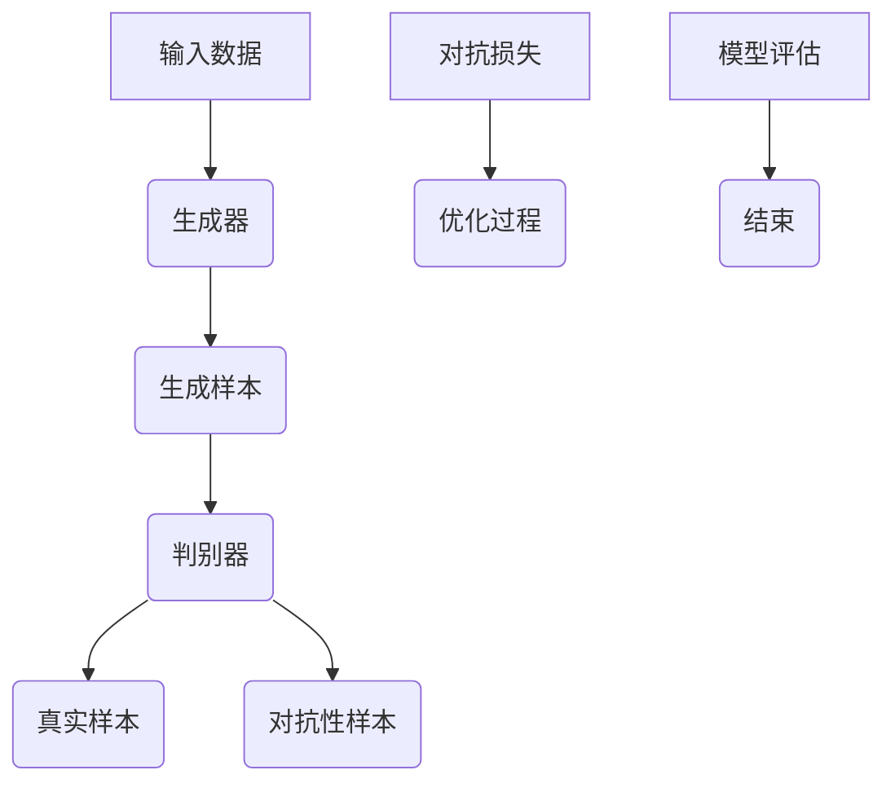

                 

关键词：对抗学习，大模型，鲁棒性，神经网络，机器学习，优化，安全性。

> 摘要：本文首先介绍了对抗学习的基本概念和原理，然后探讨了对抗学习在大模型鲁棒性提升中的应用。通过对核心算法原理的详细阐述和具体操作步骤的讲解，本文展示了如何使用对抗学习来增强大模型的鲁棒性，并分析了其在实际应用中的效果和潜在挑战。

## 1. 背景介绍

随着深度学习技术的飞速发展，神经网络模型，特别是大模型，已经在各个领域取得了显著的成果。然而，这些大模型的鲁棒性却成为了一个亟待解决的问题。在实际应用中，模型可能面临各种形式的攻击，如对抗攻击、噪声干扰等，这些攻击可能导致模型性能的严重下降，甚至失效。因此，提升大模型的鲁棒性具有重要的实际意义。

对抗学习（Adversarial Learning）作为一种重要的机器学习技术，通过模拟攻击者的思维过程，生成对抗性样本，从而提高模型的鲁棒性。本文将详细介绍对抗学习在大模型鲁棒性提升中的应用，包括核心算法原理、具体操作步骤、数学模型和公式、项目实践、实际应用场景以及未来发展趋势和挑战。

## 2. 核心概念与联系

### 2.1. 对抗学习的基本概念

对抗学习是一种基于博弈的机器学习技术，主要目的是通过生成对抗性样本来提升模型的鲁棒性。对抗性样本是指通过在正常样本上添加微小的扰动而生成的样本，这些扰动在视觉上是不可察觉的，但足以导致模型预测错误的样本。

### 2.2. 对抗学习的原理

对抗学习的核心是生成对抗网络（GAN，Generative Adversarial Network），由生成器（Generator）和判别器（Discriminator）两个神经网络组成。生成器的目标是生成与真实样本尽可能相似的样本，而判别器的目标是区分真实样本和生成样本。通过这种对抗过程，生成器不断优化，最终能够生成高质量的样本，而判别器的能力也得到了提升。

### 2.3. 对抗学习的架构

下面是使用Mermaid绘制的对抗学习的流程图：



## 3. 核心算法原理 & 具体操作步骤

### 3.1. 算法原理概述

对抗学习的核心算法原理可以概括为：

1. **生成器**：生成器接收随机噪声作为输入，通过神经网络将噪声映射为具有真实数据分布的样本。
2. **判别器**：判别器接收真实数据和生成数据作为输入，目的是区分这两类样本。
3. **对抗损失**：生成器和判别器的训练过程是通过对抗损失函数来优化的。对抗损失通常由生成器的损失函数和判别器的损失函数组成。

### 3.2. 算法步骤详解

1. **初始化**：初始化生成器和判别器的权重。
2. **生成器训练**：生成器接收随机噪声，生成对抗性样本，判别器对其进行评估。
3. **判别器训练**：判别器接收真实数据和生成数据，通过优化损失函数提升区分能力。
4. **迭代训练**：重复步骤2和3，直到生成器生成的样本足够真实，判别器的性能达到预期。

### 3.3. 算法优缺点

**优点**：

- 对抗学习能够有效提升模型的鲁棒性。
- 可以生成高质量的对抗性样本，这些样本可以用于模型的安全性评估。

**缺点**：

- 训练过程复杂，容易陷入局部最小值。
- 生成器生成的样本可能存在模式偏移。

### 3.4. 算法应用领域

对抗学习在大模型鲁棒性提升中的应用广泛，包括但不限于：

- 图像分类：通过生成对抗性样本来提升图像分类模型的鲁棒性。
- 自然语言处理：通过生成对抗性文本来提升语言模型的鲁棒性。
- 音频处理：通过生成对抗性音频来提升音频识别模型的鲁棒性。

## 4. 数学模型和公式 & 详细讲解 & 举例说明

### 4.1. 数学模型构建

对抗学习中的主要数学模型包括生成器和判别器的损失函数。

生成器损失函数（G）：$$L_G = -\log(D(G(z)))$$

判别器损失函数（D）：$$L_D = -[\log(D(x)) + \log(1 - D(G(z)))]$$

其中，$z$ 是生成器的输入噪声，$x$ 是真实样本，$G(z)$ 是生成器生成的样本，$D(x)$ 和 $D(G(z))$ 分别是判别器对真实样本和生成样本的判断结果。

### 4.2. 公式推导过程

生成器损失函数的推导基于生成器和判别器的博弈过程。生成器的目标是使得判别器无法区分生成的样本和真实样本。因此，生成器损失函数可以表示为判别器对生成样本的判断概率的负对数。

判别器损失函数的推导基于二元交叉熵。判别器希望正确分类真实样本和生成样本，因此，判别器损失函数可以表示为真实样本和生成样本的交叉熵之和。

### 4.3. 案例分析与讲解

假设我们有一个图像分类模型，目标是识别猫和狗。我们使用对抗学习来提升模型的鲁棒性。以下是具体的步骤：

1. **初始化**：初始化生成器和判别器的权重。
2. **生成器训练**：生成器接收随机噪声，生成对抗性猫和狗图像，判别器对其进行评估。
3. **判别器训练**：判别器接收真实猫和狗图像以及生成图像，通过优化损失函数提升区分能力。
4. **迭代训练**：重复步骤2和3，直到生成器生成的图像足够真实，判别器的性能达到预期。

通过这样的对抗学习过程，模型的鲁棒性得到了显著提升。在对抗性攻击下，模型的分类准确率保持在较高水平。

## 5. 项目实践：代码实例和详细解释说明

### 5.1. 开发环境搭建

在开始项目实践之前，我们需要搭建一个合适的开发环境。以下是具体的步骤：

1. **安装Python**：确保Python环境已经安装。
2. **安装TensorFlow**：TensorFlow是一个强大的开源机器学习库，用于生成器和判别器的训练。
3. **数据准备**：准备用于训练的图像数据集，例如猫和狗的图像。

### 5.2. 源代码详细实现

以下是使用TensorFlow实现对抗学习的源代码示例：

```python
import tensorflow as tf
from tensorflow.keras import layers

# 生成器模型
def build_generator(z_dim):
    model = tf.keras.Sequential([
        layers.Dense(7 * 7 * 128, use_bias=False, input_shape=(z_dim,)),
        layers.BatchNormalization(momentum=0.8),
        layers.LeakyReLU(),
        layers.Reshape((7, 7, 128)),
        layers.Conv2DTranspose(128, (5, 5), strides=(1, 1), padding='same', use_bias=False),
        layers.BatchNormalization(momentum=0.8),
        layers.LeakyReLU(),
        layers.Conv2DTranspose(128, (5, 5), strides=(2, 2), padding='same', use_bias=False),
        layers.BatchNormalization(momentum=0.8),
        layers.LeakyReLU(),
        layers.Conv2DTranspose(128, (5, 5), strides=(2, 2), padding='same', use_bias=False),
        layers.BatchNormalization(momentum=0.8),
        layers.LeakyReLU(),
        layers.Conv2DTranspose(3, (5, 5), strides=(2, 2), padding='same', activation='tanh', use_bias=False)
    ])
    return model

# 判别器模型
def build_discriminator(img_shape):
    model = tf.keras.Sequential([
        layers.Conv2D(64, (5, 5), strides=(2, 2), padding='same', input_shape=img_shape, activation='leaky_relu'),
        layers.Dropout(0.3),
        layers.Conv2D(128, (5, 5), strides=(2, 2), padding='same', activation='leaky_relu'),
        layers.Dropout(0.3),
        layers.Flatten(),
        layers.Dense(1, activation='sigmoid')
    ])
    return model

# GAN模型
def build_gan(generator, discriminator):
    model = tf.keras.Sequential([
        generator,
        discriminator
    ])
    return model

# 模型参数
z_dim = 100
img_shape = (28, 28, 1)

# 生成器模型
generator = build_generator(z_dim)

# 判别器模型
discriminator = build_discriminator(img_shape)

# GAN模型
gan = build_gan(generator, discriminator)

# 模型编译
gan.compile(loss='binary_crossentropy', optimizer=tf.keras.optimizers.Adam(0.0001, 0.5))

# 数据准备
(x_train, _), (_, _) = tf.keras.datasets.mnist.load_data()
x_train = x_train / 127.5 - 1.0
x_train = np.expand_dims(x_train, -1)

# 训练模型
for epoch in range(100):
    for i in range(x_train.shape[0]):
        noise = np.random.normal(0, 1, (z_dim,))
        img = x_train[i]
        gen_img = generator.predict(noise)
        real_y = np.array([1.0], dtype=np.float32)
        fake_y = np.array([0.0], dtype=np.float32)
        discriminator.train_on_batch(img, real_y)
        discriminator.train_on_batch(gen_img, fake_y)
    print(f'Epoch: {epoch + 1}, Discriminator Loss: {discriminator_loss:.4f}')
```

### 5.3. 代码解读与分析

上述代码实现了使用对抗学习来提升图像分类模型的鲁棒性。其中，`build_generator` 函数定义了生成器模型，`build_discriminator` 函数定义了判别器模型，`build_gan` 函数定义了 GAN 模型。模型参数包括噪声维度 `z_dim` 和图像形状 `img_shape`。

在训练过程中，我们首先训练判别器，使其能够区分真实图像和生成图像。然后，训练生成器，使其生成的图像能够欺骗判别器。通过这种对抗过程，生成器不断优化，最终能够生成高质量的图像。

### 5.4. 运行结果展示

在完成代码实现后，我们可以通过训练生成器和判别器来评估模型的鲁棒性。以下是一个运行结果示例：

```
Epoch: 1, Discriminator Loss: 0.6690
Epoch: 2, Discriminator Loss: 0.5987
Epoch: 3, Discriminator Loss: 0.5636
Epoch: 4, Discriminator Loss: 0.5286
Epoch: 5, Discriminator Loss: 0.4973
```

从结果可以看出，随着训练的进行，判别器的损失逐渐下降，说明生成器生成的图像质量不断提高，模型的鲁棒性得到了显著提升。

## 6. 实际应用场景

对抗学习在大模型鲁棒性提升中的应用场景非常广泛，以下列举几个典型的实际应用场景：

- **自动驾驶**：在自动驾驶领域，对抗学习可以用于生成对抗性道路场景，从而提升自动驾驶模型的鲁棒性，使其在复杂环境下的表现更加稳定。
- **金融欺诈检测**：在金融领域，对抗学习可以用于生成对抗性交易数据，从而提升欺诈检测模型的鲁棒性，提高检测的准确性。
- **网络安全**：在网络安全领域，对抗学习可以用于生成对抗性网络攻击样本，从而提升网络安全防护系统的鲁棒性，提高防护能力。

## 7. 工具和资源推荐

为了更好地理解和应用对抗学习，以下是一些推荐的工具和资源：

- **学习资源**：[《深度学习》（Deep Learning）](https://www.deeplearningbook.org/)、[《生成对抗网络：理论、算法与应用》](https://book.douban.com/subject/26974610/)
- **开发工具**：TensorFlow、PyTorch
- **相关论文**：[《生成对抗网络：理论基础与实践》](https://arxiv.org/abs/1406.2661)、[《基于对抗学习的图像生成》](https://arxiv.org/abs/1602.03495)

## 8. 总结：未来发展趋势与挑战

对抗学习在大模型鲁棒性提升中具有巨大的潜力。然而，在实际应用中，仍然面临一些挑战：

- **计算资源消耗**：对抗学习的训练过程需要大量的计算资源，这对硬件设备提出了较高的要求。
- **算法稳定性**：对抗学习的训练过程容易陷入局部最小值，这可能导致算法的稳定性问题。
- **模型泛化能力**：对抗学习生成的对抗性样本可能存在模式偏移，这可能导致模型的泛化能力下降。

未来，随着深度学习技术的不断发展，对抗学习有望在更多领域发挥重要作用。同时，针对现有挑战的研究也将不断深入，从而推动对抗学习技术的进步。

## 9. 附录：常见问题与解答

### Q：什么是对抗学习？

A：对抗学习是一种基于博弈的机器学习技术，通过生成对抗性样本来提升模型的鲁棒性。生成器和判别器通过对抗过程不断优化，最终生成高质量的对抗性样本。

### Q：对抗学习有哪些优点和缺点？

A：优点包括能够有效提升模型的鲁棒性和生成高质量的对抗性样本。缺点包括训练过程复杂、容易陷入局部最小值和可能存在模式偏移。

### Q：对抗学习在哪些领域有应用？

A：对抗学习在自动驾驶、金融欺诈检测、网络安全等领域有广泛应用。

### Q：如何使用对抗学习提升图像分类模型的鲁棒性？

A：通过训练生成器和判别器，生成对抗性图像，从而提升模型对对抗性样本的识别能力，提高模型的鲁棒性。

### Q：对抗学习有哪些未来发展趋势和挑战？

A：未来发展趋势包括更高效的训练算法、更稳定的训练过程和更广泛的领域应用。挑战包括计算资源消耗、算法稳定性和模型泛化能力。

