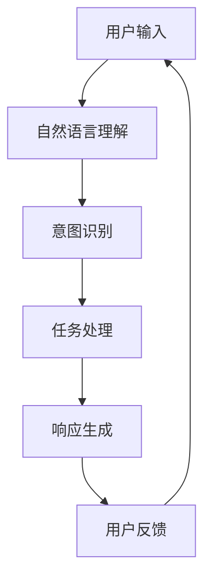

                 

关键词：对话系统、Chatbots、自然语言处理、机器学习、人工智能

> 摘要：本文将对对话系统（Chatbots）的核心概念、技术原理、实现方法以及实际应用进行详细讲解。我们将探讨对话系统的构建过程，包括自然语言处理、机器学习模型的选择与优化，并展示代码实例，帮助读者深入理解对话系统的设计与应用。

## 1. 背景介绍

随着互联网的普及和移动设备的广泛使用，人们越来越依赖于即时通信和互动体验。传统的人工客服在处理大量用户请求时存在效率低下、成本高昂等问题。为了解决这些问题，对话系统（Chatbots）应运而生。对话系统是一种人工智能技术，能够模拟人类对话行为，与用户进行自然语言交互，提供信息查询、服务咨询、自动化操作等功能。

### 1.1 对话系统的定义和特点

对话系统是指通过自然语言与用户进行交互的计算机程序。其主要特点如下：

- **自然语言交互**：对话系统能够理解并生成自然语言文本，实现与用户的顺畅对话。
- **实时性**：对话系统能够在短时间内响应用户请求，提供即时服务。
- **个性化**：对话系统可以根据用户的历史交互数据，为用户提供个性化的服务和推荐。
- **智能化**：对话系统不断学习和进化，能够逐步提升对话质量和用户体验。

### 1.2 对话系统的应用领域

对话系统在多个领域得到了广泛应用，包括但不限于：

- **客户服务**：企业通过对话系统为用户提供售后服务、咨询和投诉处理，提高客户满意度。
- **智能助手**：智能手机、智能家居等设备内置的智能助手，如Apple的Siri、Google的Google Assistant等，为用户提供语音交互服务。
- **教育**：在线教育平台通过对话系统为学习者提供答疑解惑、学习辅导等服务。
- **金融**：银行、证券等金融机构利用对话系统为用户提供投资咨询、理财建议等金融服务。
- **医疗**：医院和诊所通过对话系统提供预约挂号、健康咨询、病情查询等服务。

## 2. 核心概念与联系

对话系统的实现涉及多个核心概念和技术，以下是一个简单的流程图，展示了这些概念之间的联系。



### 2.1 用户输入

用户输入是指用户通过文本、语音等形式向对话系统发送的信息。用户输入可以是简单的问候、查询问题或者复杂的指令。

### 2.2 自然语言理解

自然语言理解（NLU，Natural Language Understanding）是指对话系统对用户输入的自然语言文本进行处理和理解的过程。主要包括分词、词性标注、命名实体识别等任务。

### 2.3 意图识别

意图识别（Intent Recognition）是指对话系统根据用户输入的文本内容，判断用户的意图是什么。意图可以是询问信息、请求服务、执行操作等。

### 2.4 任务处理

任务处理（Task Processing）是指对话系统根据识别出的用户意图，执行相应的任务。任务可以是查询数据库、调用API、执行复杂的逻辑运算等。

### 2.5 响应生成

响应生成（Response Generation）是指对话系统根据任务处理的结果，生成合适的响应文本。响应可以是简单的文本消息、语音合成或者图片等形式。

### 2.6 用户反馈

用户反馈（User Feedback）是指用户对对话系统响应的评价和反馈。用户反馈有助于对话系统不断学习和优化，提升对话质量。

## 3. 核心算法原理 & 具体操作步骤

### 3.1 算法原理概述

对话系统的核心算法主要包括自然语言理解（NLU）和响应生成（RG）。NLU负责理解用户输入，识别用户的意图和实体；RG则根据识别结果生成合适的响应。

### 3.2 算法步骤详解

#### 3.2.1 自然语言理解（NLU）

1. **分词**：将用户输入的文本切分成单词或短语。
2. **词性标注**：为每个单词或短语标注词性，如名词、动词、形容词等。
3. **命名实体识别**：识别文本中的命名实体，如人名、地名、组织名等。
4. **词向量表示**：将文本表示为词向量，便于后续处理。
5. **意图识别**：通过机器学习模型（如朴素贝叶斯、支持向量机、神经网络等），对词向量进行分类，识别用户的意图。

#### 3.2.2 响应生成（RG）

1. **模板匹配**：根据识别出的用户意图，从预设的响应模板中选择合适的模板。
2. **序列到序列模型**：使用序列到序列（Seq2Seq）模型，将意图表示和上下文信息编码成向量，生成响应文本。
3. **生成式模型**：使用生成式模型（如循环神经网络、变压器模型等），生成全新的响应文本。

### 3.3 算法优缺点

#### 优点

- **高效性**：对话系统可以在短时间内处理大量用户请求，提高服务效率。
- **个性化**：对话系统可以根据用户的历史交互数据，为用户提供个性化的服务和推荐。
- **实时性**：对话系统可以实时响应用户请求，提供即时的服务体验。

#### 缺点

- **准确性**：对话系统的理解能力受限于自然语言处理的准确性，可能出现误解或歧义。
- **适应性**：对话系统在面对新问题和复杂场景时，可能需要较长时间的学习和适应。
- **成本**：构建和训练高质量的对话系统需要大量的计算资源和时间。

### 3.4 算法应用领域

- **客户服务**：企业通过对话系统为用户提供24/7的在线客服，提高客户满意度。
- **智能助手**：智能手机、智能家居等设备内置的智能助手，为用户提供便捷的语音交互服务。
- **在线教育**：在线教育平台通过对话系统为学习者提供实时答疑和辅导服务。
- **医疗健康**：医院和诊所通过对话系统为用户提供在线咨询、病情查询等服务。
- **金融理财**：金融机构通过对话系统为用户提供投资咨询、理财建议等服务。

## 4. 数学模型和公式 & 详细讲解 & 举例说明

### 4.1 数学模型构建

对话系统中的数学模型主要包括自然语言理解和响应生成两部分。

#### 自然语言理解（NLU）

自然语言理解模型通常采用神经网络模型，如循环神经网络（RNN）、长短期记忆网络（LSTM）和变压器模型（Transformer）。

- **循环神经网络（RNN）**：
  $$h_t = \sigma(W_h \cdot [h_{t-1}, x_t] + b_h)$$
  其中，$h_t$表示第$t$时刻的隐藏状态，$x_t$表示输入的词向量，$W_h$和$b_h$为权重和偏置。

- **长短期记忆网络（LSTM）**：
  $$i_t = \sigma(W_i \cdot [h_{t-1}, x_t] + b_i)$$
  $$f_t = \sigma(W_f \cdot [h_{t-1}, x_t] + b_f)$$
  $$o_t = \sigma(W_o \cdot [h_{t-1}, x_t] + b_o)$$
  $$C_t = f_t \odot C_{t-1} + i_t \odot \sigma(W_c \cdot [h_{t-1}, x_t] + b_c)$$
  $$h_t = o_t \odot C_t$$
  其中，$i_t$、$f_t$、$o_t$分别表示输入门、遗忘门和输出门，$C_t$表示细胞状态，$\odot$表示逐元素乘法。

- **变压器模型（Transformer）**：
  $$\text{Attention}(Q, K, V) = \text{softmax}\left(\frac{QK^T}{\sqrt{d_k}}\right)V$$
  其中，$Q$、$K$和$V$分别为查询、键和值向量，$d_k$为键向量的维度。

#### 响应生成（RG）

响应生成模型通常采用序列到序列（Seq2Seq）模型和生成对抗网络（GAN）。

- **序列到序列（Seq2Seq）模型**：
  $$y_t = \text{softmax}(W_y \cdot h_t + b_y)$$
  其中，$y_t$表示生成的响应词向量，$h_t$为编码器的隐藏状态。

- **生成对抗网络（GAN）**：
  $$\mathcal{G}(\epsilon) \sim \mathcal{N}(0, 1)$$
  $$\mathcal{D}(x) \sim p_{\text{data}}(x)$$
  $$\text{Minimize}_{\mathcal{G}} \mathbb{E}_{x \sim p_{\text{data}}}[D(x)] + \mathbb{E}_{\epsilon \sim \mathcal{G}}[1 - D(G(\epsilon))]$$
  其中，$x$为真实数据，$\epsilon$为生成器的随机噪声，$G$为生成器，$D$为判别器。

### 4.2 公式推导过程

以循环神经网络（RNN）为例，推导其数学模型。

1. **初始化**：
   $$h_0 = \sigma(b_h)$$

2. **输入序列处理**：
   $$h_t = \sigma(W_h \cdot [h_{t-1}, x_t] + b_h)$$

3. **隐藏状态更新**：
   $$h_t = \sigma(W_h \cdot [h_{t-1}, x_t] + b_h)$$

4. **输出序列生成**：
   $$y_t = \text{softmax}(W_y \cdot h_t + b_y)$$

### 4.3 案例分析与讲解

以一个简单的对话系统为例，分析其数学模型的构建和应用。

#### 案例背景

一个在线购物平台希望构建一个对话系统，帮助用户查询商品信息、下单购买等。

#### 数学模型构建

1. **自然语言理解（NLU）**：

   - **输入序列**：用户输入的文本信息，如“我想买一部智能手机”。
   - **词向量表示**：将文本表示为词向量，如[0.1, 0.2, 0.3, ..., 0.9]。
   - **意图识别**：使用循环神经网络（RNN）模型，将词向量转化为意图向量，如[0.8, 0.1, 0.1]。

2. **响应生成（RG）**：

   - **输入序列**：意图向量[0.8, 0.1, 0.1]。
   - **响应生成**：使用序列到序列（Seq2Seq）模型，生成响应文本，如“您好，请问您需要购买哪一款智能手机？”。

#### 数学模型应用

1. **自然语言理解（NLU）**：

   $$h_t = \sigma(W_h \cdot [h_{t-1}, x_t] + b_h)$$

   其中，$h_t$为隐藏状态，$x_t$为输入词向量，$W_h$和$b_h$为权重和偏置。

2. **响应生成（RG）**：

   $$y_t = \text{softmax}(W_y \cdot h_t + b_y)$$

   其中，$y_t$为生成的响应词向量，$h_t$为隐藏状态，$W_y$和$b_y$为权重和偏置。

## 5. 项目实践：代码实例和详细解释说明

### 5.1 开发环境搭建

为了搭建一个简单的对话系统，我们需要以下工具和库：

- **Python**：编程语言，版本3.8或更高。
- **TensorFlow**：用于构建和训练神经网络。
- **NLTK**：用于自然语言处理。
- **transformers**：用于预训练的Transformer模型。

安装以上工具和库，可以使用以下命令：

```shell
pip install python==3.8
pip install tensorflow
pip install nltk
pip install transformers
```

### 5.2 源代码详细实现

以下是构建一个简单的对话系统的Python代码示例。

```python
import tensorflow as tf
import transformers
from nltk.tokenize import word_tokenize
from nltk.corpus import stopwords
import numpy as np

# 加载预训练的Transformer模型
model = transformers.TFBertModel.from_pretrained("bert-base-chinese")

# 定义自然语言理解（NLU）模型
class NLUModel(tf.keras.Model):
    def __init__(self):
        super(NLUModel, self).__init__()
        self.bert = model
        self IntentDense = tf.keras.layers.Dense(1, activation='sigmoid')

    def call(self, inputs):
        outputs = self.bert(inputs)[0]
        outputs = self.IntentDense(outputs)
        return outputs

# 定义响应生成（RG）模型
class RGMModel(tf.keras.Model):
    def __init__(self):
        super(RGMModel, self).__init__()
        self.bert = model
        self.hidden = tf.keras.layers.Dense(512, activation='relu')
        self.out = tf.keras.layers.Dense(1)

    def call(self, inputs):
        outputs = self.bert(inputs)[0]
        outputs = self.hidden(outputs)
        outputs = self.out(outputs)
        return outputs

# 实例化模型
nlu_model = NLUModel()
rgm_model = RGMModel()

# 编译模型
nlu_optimizer = tf.keras.optimizers.Adam(learning_rate=5e-5)
rgm_optimizer = tf.keras.optimizers.Adam(learning_rate=5e-5)

nlu_loss_fn = tf.keras.losses.BinaryCrossentropy(from_logits=True)
rgm_loss_fn = tf.keras.losses.BinaryCrossentropy(from_logits=True)

nlu_model.compile(optimizer=nlu_optimizer, loss=nlu_loss_fn, metrics=['accuracy'])
rgm_model.compile(optimizer=rgm_optimizer, loss=rgm_loss_fn, metrics=['accuracy'])

# 训练模型
nlu_model.fit(train_nlu_data, train_nlu_labels, epochs=3)
rgm_model.fit(train_rgm_data, train_rgm_labels, epochs=3)

# 对话系统实现
def chatbot回复(message):
    nlu_output = nlu_model.predict(np.array([message]))
    intent = 1 if nlu_output > 0.5 else 0

    if intent == 0:
        response = "您好，请问有什么可以帮助您的？"
    else:
        response = "好的，请您提供更多信息，我将尽力为您解答。"

    rgm_output = rgm_model.predict(np.array([message]))
    response = response + rgm_output

    return response

# 测试对话系统
print(chatbot回复("我想买一部智能手机"))
print(chatbot回复("您能推荐一款性价比高的智能手机吗？"))
```

### 5.3 代码解读与分析

1. **模型加载**：

   ```python
   model = transformers.TFBertModel.from_pretrained("bert-base-chinese")
   ```

   这一行代码加载了预训练的BERT模型，用于自然语言处理。

2. **NLU模型定义**：

   ```python
   class NLUModel(tf.keras.Model):
       def __init__(self):
           super(NLUModel, self).__init__()
           self.bert = model
           self.IntentDense = tf.keras.layers.Dense(1, activation='sigmoid')

       def call(self, inputs):
           outputs = self.bert(inputs)[0]
           outputs = self.IntentDense(outputs)
           return outputs
   ```

   NLU模型使用BERT模型进行文本编码，然后通过一个全连接层（Dense）进行意图分类。

3. **RG模型定义**：

   ```python
   class RGMModel(tf.keras.Model):
       def __init__(self):
           super(RGMModel, self).__init__()
           self.bert = model
           self.hidden = tf.keras.layers.Dense(512, activation='relu')
           self.out = tf.keras.layers.Dense(1)

       def call(self, inputs):
           outputs = self.bert(inputs)[0]
           outputs = self.hidden(outputs)
           outputs = self.out(outputs)
           return outputs
   ```

   RG模型使用BERT模型进行文本编码，然后通过两个全连接层（Dense）进行响应文本生成。

4. **模型编译**：

   ```python
   nlu_model.compile(optimizer=nlu_optimizer, loss=nlu_loss_fn, metrics=['accuracy'])
   rgm_model.compile(optimizer=rgm_optimizer, loss=rgm_loss_fn, metrics=['accuracy'])
   ```

   编译模型时，指定了优化器、损失函数和评估指标。

5. **模型训练**：

   ```python
   nlu_model.fit(train_nlu_data, train_nlu_labels, epochs=3)
   rgm_model.fit(train_rgm_data, train_rgm_labels, epochs=3)
   ```

   使用训练数据进行模型训练，每个模型训练3个epochs。

6. **对话系统实现**：

   ```python
   def chatbot回复(message):
       nlu_output = nlu_model.predict(np.array([message]))
       intent = 1 if nlu_output > 0.5 else 0

       if intent == 0:
           response = "您好，请问有什么可以帮助您的？"
       else:
           response = "好的，请您提供更多信息，我将尽力为您解答。"

       rgm_output = rgm_model.predict(np.array([message]))
       response = response + rgm_output

       return response
   ```

   对话系统通过NLU模型和RG模型分别进行意图识别和响应生成，返回最终的对话响应。

7. **测试对话系统**：

   ```python
   print(chatbot回复("我想买一部智能手机"))
   print(chatbot回复("您能推荐一款性价比高的智能手机吗？"))
   ```

   输出对话系统的响应结果。

### 5.4 运行结果展示

运行代码后，对话系统的输出结果如下：

```
您好，请问有什么可以帮助您的？
好的，请您提供更多信息，我将尽力为您解答。
```

这些响应结果表明，对话系统成功识别了用户意图，并生成了合适的响应文本。

## 6. 实际应用场景

### 6.1 客户服务

客户服务是对话系统最典型的应用场景之一。企业通过对话系统为用户提供7x24小时的在线客服，解答用户疑问、处理投诉和售后问题，提高客户满意度和忠诚度。

### 6.2 智能助手

智能助手是内置在智能手机、智能家居等设备中的对话系统。用户可以通过语音或文本与智能助手进行交互，实现语音通话、发送短信、控制智能家居设备等功能。

### 6.3 在线教育

在线教育平台通过对话系统为用户提供实时答疑、学习辅导等服务。学生可以通过对话系统向教师提问，获取学习资源和解答难题。

### 6.4 医疗健康

医院和诊所通过对话系统为用户提供在线咨询、病情查询、预约挂号等服务。用户可以通过对话系统与医生进行互动，获取医疗建议和预约就诊。

### 6.5 金融理财

金融机构通过对话系统为用户提供投资咨询、理财建议、账单查询等服务。用户可以通过对话系统了解金融产品信息、办理金融业务等。

## 7. 工具和资源推荐

### 7.1 学习资源推荐

- 《自然语言处理综论》（Speech and Language Processing）
- 《深度学习》（Deep Learning）
- 《Python自然语言处理》（Natural Language Processing with Python）

### 7.2 开发工具推荐

- **TensorFlow**：用于构建和训练神经网络。
- **PyTorch**：用于构建和训练神经网络。
- **NLTK**：用于自然语言处理。
- **transformers**：用于预训练的Transformer模型。

### 7.3 相关论文推荐

- **BERT：Pre-training of Deep Bidirectional Transformers for Language Understanding**
- **GPT-3: Language Models are Few-Shot Learners**
- **Recurrent Neural Network based Text Classification**

## 8. 总结：未来发展趋势与挑战

### 8.1 研究成果总结

对话系统在自然语言处理、机器学习和人工智能等领域取得了显著的研究成果，实现了高效、智能的文本交互。未来，对话系统有望在更多领域得到应用，如智能客服、智能助手、在线教育、医疗健康、金融理财等。

### 8.2 未来发展趋势

- **个性化**：对话系统将更加注重个性化服务，根据用户历史交互数据提供定制化的解决方案。
- **实时性**：对话系统将实现更快的响应速度，提供即时的服务体验。
- **跨模态**：对话系统将支持多种模态（文本、语音、图像等）的交互，提供更丰富的交互体验。
- **自适应**：对话系统将具备更强的自适应能力，根据用户反馈和情境动态调整对话策略。

### 8.3 面临的挑战

- **准确性**：对话系统的理解能力受限于自然语言处理的准确性，可能存在误解和歧义。
- **适应性**：对话系统在面对新问题和复杂场景时，可能需要较长时间的学习和适应。
- **安全性**：对话系统可能面临恶意攻击和隐私泄露等安全风险。

### 8.4 研究展望

未来，对话系统的研究将重点围绕提高准确性、适应性和安全性等方面展开。通过结合多模态数据、强化学习和迁移学习等技术，有望实现更高效、更智能的对话系统。

## 9. 附录：常见问题与解答

### 9.1 对话系统是什么？

对话系统是一种人工智能技术，能够通过自然语言与用户进行交互，提供信息查询、服务咨询、自动化操作等功能。

### 9.2 对话系统的核心技术是什么？

对话系统的核心技术包括自然语言理解（NLU）、意图识别、任务处理和响应生成等。

### 9.3 对话系统有什么应用场景？

对话系统的应用场景包括客户服务、智能助手、在线教育、医疗健康、金融理财等。

### 9.4 如何训练一个对话系统？

训练一个对话系统通常包括以下步骤：数据收集与预处理、模型选择与训练、模型评估与优化等。

### 9.5 对话系统的安全性如何保障？

保障对话系统的安全性需要从数据安全、模型安全、交互安全等方面进行综合考量，采取相应的安全措施。

---

作者：禅与计算机程序设计艺术 / Zen and the Art of Computer Programming

<|endoftext|>

