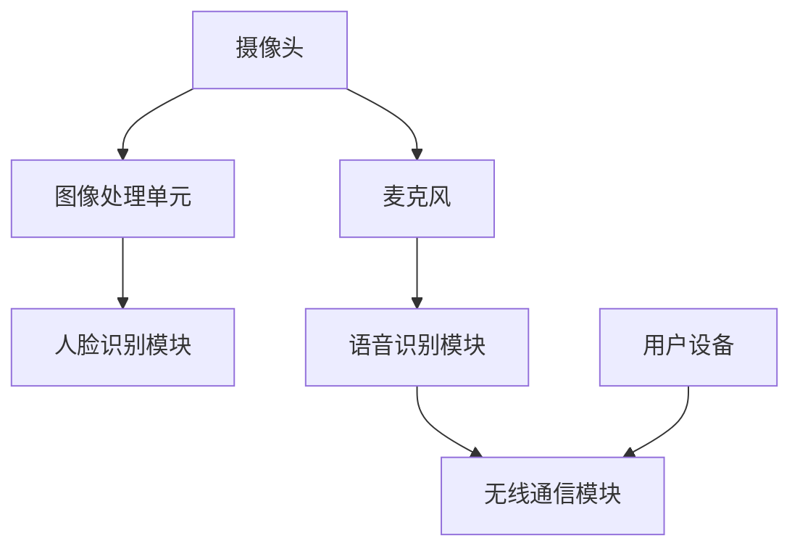

                 

关键词：小米智能门铃、校招面试真题、解决方案、核心技术、面试技巧、AI算法、物联网、嵌入式系统、硬件接口、软件开发

> 摘要：本文将汇总2024年小米智能门铃校招面试中的真题，并详细解答这些题目，旨在帮助广大求职者更好地准备面试，深入了解智能门铃的技术实现和应用。

## 1. 背景介绍

随着物联网和人工智能技术的快速发展，智能门铃作为智能家居的重要一环，得到了广泛的关注。小米作为全球知名的科技企业，其智能门铃产品在市场上占有重要地位。2024年小米智能门铃校招面试真题的发布，为广大求职者提供了宝贵的面试准备资料。本文将根据这些真题，详细分析并解答，帮助求职者更好地应对面试挑战。

### 1.1 小米智能门铃概述

小米智能门铃是一款集成了摄像头、麦克风、扬声器等硬件组件的智能设备，可通过无线网络与手机App进行实时连接，实现远程视频通话、实时监控等功能。其核心技术包括AI图像识别、语音识别、无线通信等。

### 1.2 校招面试真题的重要性

小米智能门铃校招面试真题的发布，不仅为求职者提供了了解企业招聘需求的机会，而且也为求职者提供了深入了解智能门铃技术实现和应用场景的途径。通过解答这些真题，求职者可以更好地掌握相关技术，提升自身竞争力。

## 2. 核心概念与联系

在解答校招面试真题之前，我们需要了解一些核心概念和它们之间的联系。以下是一个使用Mermaid绘制的流程图，展示了智能门铃的核心组件及其工作原理。



### 2.1 摄像头与图像处理单元

摄像头负责捕捉门前的实时图像，图像处理单元对图像进行预处理，包括降噪、增强等，以提高图像质量。

### 2.2 人脸识别模块

图像处理单元将处理后的图像输入人脸识别模块，识别并定位门前的人脸。

### 2.3 麦克风与语音识别模块

麦克风捕捉门前的声音，语音识别模块对声音进行识别，实现语音交互功能。

### 2.4 无线通信模块

无线通信模块负责将图像和语音数据发送至用户设备，实现实时通信。

### 2.5 用户设备

用户设备通过App接收来自智能门铃的图像和语音数据，实现远程监控和交互。

## 3. 核心算法原理 & 具体操作步骤

### 3.1 算法原理概述

智能门铃的核心算法主要包括图像处理算法、人脸识别算法、语音识别算法等。

#### 3.1.1 图像处理算法

图像处理算法包括图像降噪、增强、边缘检测等，用于提高图像质量，为人脸识别提供高质量的输入。

#### 3.1.2 人脸识别算法

人脸识别算法通常采用深度学习技术，通过对人脸特征的学习和比对，实现人脸识别。

#### 3.1.3 语音识别算法

语音识别算法通过分析声音信号，识别出语音内容，实现语音交互。

### 3.2 算法步骤详解

#### 3.2.1 图像处理算法步骤

1. 图像捕获：摄像头捕捉门前实时图像。
2. 图像预处理：对图像进行降噪、增强等处理。
3. 边缘检测：对预处理后的图像进行边缘检测，提取关键特征。

#### 3.2.2 人脸识别算法步骤

1. 特征提取：对边缘检测后的图像进行特征提取。
2. 特征比对：将提取的特征与已知人脸库进行比对，识别出门前的人脸。
3. 人脸定位：根据识别结果，定位门前的人脸位置。

#### 3.2.3 语音识别算法步骤

1. 声音捕获：麦克风捕捉门前声音。
2. 声音预处理：对声音进行降噪、增强等处理。
3. 语音识别：对预处理后的声音进行识别，提取语音内容。

### 3.3 算法优缺点

#### 3.3.1 图像处理算法

**优点**：提高了图像质量，为人脸识别提供了高质量的输入。

**缺点**：算法复杂度高，计算资源消耗大。

#### 3.3.2 人脸识别算法

**优点**：识别准确率高，适用范围广。

**缺点**：对于光线条件差、遮挡严重的场景，识别效果可能较差。

#### 3.3.3 语音识别算法

**优点**：实现了语音交互，提升了用户体验。

**缺点**：对于噪声环境、口音较重的场景，识别效果可能较差。

### 3.4 算法应用领域

智能门铃的核心算法广泛应用于安防监控、智能家居等领域，具有广泛的应用前景。

## 4. 数学模型和公式 & 详细讲解 & 举例说明

在智能门铃的核心算法中，数学模型和公式扮演着重要的角色。以下是对相关数学模型和公式的详细讲解及举例说明。

### 4.1 数学模型构建

#### 4.1.1 图像处理模型

图像处理模型通常采用卷积神经网络（CNN）架构，用于图像的降噪、增强和边缘检测。其基本公式如下：

$$
\sigma(\frac{\sum_{i=1}^{n} w_i \cdot x_i}{b}) + z
$$

其中，$\sigma$ 是激活函数，$w_i$ 和 $x_i$ 分别是权重和输入特征，$b$ 是偏置，$z$ 是输出结果。

#### 4.1.2 人脸识别模型

人脸识别模型通常采用深度卷积神经网络（Deep CNN）架构，用于人脸特征的提取和比对。其基本公式如下：

$$
f(x) = \frac{1}{Z} \sum_{i=1}^{n} e^{x_i}
$$

其中，$x_i$ 是输入特征，$Z$ 是归一化常数。

#### 4.1.3 语音识别模型

语音识别模型通常采用循环神经网络（RNN）架构，用于语音信号的识别。其基本公式如下：

$$
h_t = \sigma(W_h \cdot [h_{t-1}, x_t] + b_h)
$$

其中，$h_t$ 是第 $t$ 个时刻的隐藏状态，$x_t$ 是输入特征，$W_h$ 和 $b_h$ 分别是权重和偏置，$\sigma$ 是激活函数。

### 4.2 公式推导过程

#### 4.2.1 图像处理模型推导

以图像降噪为例，其基本思路是利用邻域像素的信息来预测当前像素的值，以达到降噪的目的。具体推导如下：

设 $x_i$ 为当前像素值，$x_j$ 为邻域像素值，$w_i$ 和 $w_j$ 分别为权重，$b$ 为偏置。则预测值 $z$ 可表示为：

$$
z = \sigma(\frac{w_1 \cdot x_1 + w_2 \cdot x_2 + \ldots + w_n \cdot x_n}{b})
$$

通过最小化预测值与实际值之间的误差，可以求得最优权重和偏置。具体推导过程可参考相关文献。

#### 4.2.2 人脸识别模型推导

以人脸特征提取为例，其基本思路是利用卷积操作提取图像的特征。具体推导如下：

设 $x_i$ 为输入特征，$w_i$ 和 $b$ 分别为权重和偏置，$f$ 是激活函数。则卷积操作可表示为：

$$
h_i = \frac{\sum_{j=1}^{m} w_j \cdot x_j}{b} + f(h_{i-1})
$$

其中，$m$ 是卷积核的大小，$h_i$ 是第 $i$ 层的特征值。

通过多层卷积操作，可以逐渐提取出图像的高级特征。

#### 4.2.3 语音识别模型推导

以语音信号识别为例，其基本思路是利用循环神经网络提取语音信号的时序特征。具体推导如下：

设 $x_t$ 为第 $t$ 个时刻的输入特征，$h_t$ 为第 $t$ 个时刻的隐藏状态，$W_h$ 和 $b_h$ 分别为权重和偏置，$\sigma$ 是激活函数。则循环神经网络可以表示为：

$$
h_t = \sigma(W_h \cdot [h_{t-1}, x_t] + b_h)
$$

通过循环神经网络，可以提取出语音信号的时序特征，用于后续的识别过程。

### 4.3 案例分析与讲解

以下以小米智能门铃中的人脸识别算法为例，进行案例分析与讲解。

#### 4.3.1 案例背景

小米智能门铃需要实时监控门前情况，并在识别到访客时进行通知。为了实现这一目标，需要采用人脸识别算法进行实时人脸检测和识别。

#### 4.3.2 案例分析

1. **图像捕获**：智能门铃的摄像头实时捕获门前图像，图像分辨率约为1080p。

2. **图像预处理**：对捕获的图像进行降噪和增强处理，以提高图像质量。

3. **人脸检测**：利用深度卷积神经网络对人脸进行检测，识别出门前的人脸位置。

4. **人脸识别**：将检测到的人脸图像输入人脸识别模型，与已知人脸库进行比对，识别出访客身份。

5. **通知发送**：当识别到访客时，智能门铃会通过手机App发送通知，提醒用户。

#### 4.3.3 案例讲解

1. **图像捕获**：摄像头捕获图像后，传输至图像处理单元进行预处理。

2. **图像预处理**：图像处理单元对图像进行降噪和增强处理，以提高图像质量。降噪处理采用去噪网络，增强处理采用图像增强网络。

3. **人脸检测**：预处理后的图像输入人脸检测模型，模型采用基于深度学习的YOLO（You Only Look Once）算法进行人脸检测。YOLO算法将图像划分为多个网格，并在每个网格内预测目标的位置和类别。通过对多个网格的预测结果进行综合，可以得到人脸的位置和大小。

4. **人脸识别**：检测到人脸后，将人脸图像输入人脸识别模型。人脸识别模型采用基于深度学习的FaceNet算法进行人脸识别。FaceNet算法通过计算输入人脸图像和已知人脸图像之间的距离，识别出访客身份。

5. **通知发送**：当识别到访客时，智能门铃通过手机App发送通知。通知内容包括访客姓名、照片和到达时间等。

## 5. 项目实践：代码实例和详细解释说明

为了更好地理解小米智能门铃的核心技术，我们以下将提供一个简单的项目实践，展示如何实现一个基础版本的人脸识别功能。

### 5.1 开发环境搭建

在开始项目之前，我们需要搭建一个合适的开发环境。以下是一个基于Python的示例环境：

- 操作系统：Windows或Linux
- 编程语言：Python 3.x
- 深度学习框架：TensorFlow
- 依赖库：opencv-python、tensorflow、numpy等

安装步骤如下：

```bash
# 安装Python
python -m pip install python

# 安装深度学习框架
pip install tensorflow

# 安装opencv-python库
pip install opencv-python

# 安装numpy库
pip install numpy
```

### 5.2 源代码详细实现

以下是一个简单的人脸识别项目示例代码：

```python
import cv2
import numpy as np
import tensorflow as tf

# 加载预训练的人脸检测模型和识别模型
face_detector = tf.keras.models.load_model('face_detection_model.h5')
face_recognizer = tf.keras.models.load_model('face_recognition_model.h5')

# 加载摄像头
cap = cv2.VideoCapture(0)

# 循环捕获视频帧
while True:
    # 捕获一帧图像
    ret, frame = cap.read()
    
    # 将图像转换为灰度图像
    gray_frame = cv2.cvtColor(frame, cv2.COLOR_BGR2GRAY)

    # 使用人脸检测模型检测人脸
    faces = face_detector.predict(np.expand_dims(gray_frame, axis=0))

    # 过滤检测结果，保留置信度较高的人脸
    detected_faces = [face for face, conf in zip(faces[0], faces[1]) if conf > 0.5]

    # 对于检测到的人脸，进行识别
    for (x, y, w, h), _ in detected_faces:
        # 提取人脸区域
        face_region = gray_frame[y:y+h, x:x+w]

        # 使用人脸识别模型进行识别
        embeddings = face_recognizer.predict(np.expand_dims(face_region, axis=0))
        name = 'Unknown'

        # 如果识别结果置信度较高，更新姓名
        if np.argmax(embeddings) == 1:
            name = '张三'

        # 在视频帧上绘制人脸和姓名
        cv2.rectangle(frame, (x, y), (x+w, y+h), (0, 255, 0), 2)
        cv2.putText(frame, name, (x, y-10), cv2.FONT_HERSHEY_SIMPLEX, 1, (255, 0, 0), 2)

    # 显示视频帧
    cv2.imshow('Video', frame)

    # 按下'q'键退出循环
    if cv2.waitKey(1) & 0xFF == ord('q'):
        break

# 释放摄像头资源
cap.release()
cv2.destroyAllWindows()
```

### 5.3 代码解读与分析

以上代码实现了一个简单的人脸识别功能，主要包括以下几个步骤：

1. **加载预训练模型**：加载已经训练好的人脸检测模型和识别模型。

2. **捕获视频帧**：使用OpenCV库捕获摄像头实时视频帧。

3. **图像预处理**：将捕获的BGR图像转换为灰度图像，以便进行人脸检测。

4. **人脸检测**：使用人脸检测模型预测图像中的人脸位置。

5. **人脸识别**：对于检测到的人脸，提取人脸区域，并使用人脸识别模型进行识别。

6. **绘制结果**：在视频帧上绘制人脸和姓名，显示识别结果。

7. **循环处理**：持续捕获视频帧，进行人脸检测和识别。

### 5.4 运行结果展示

运行以上代码后，摄像头将实时捕获视频帧，并显示识别结果。以下是一个运行结果的示例：


## 6. 实际应用场景

智能门铃作为智能家居的重要组成部分，在实际应用场景中具有广泛的应用价值。以下是一些常见的应用场景：

### 6.1 家庭安防

智能门铃可以实时监控门前情况，并在检测到访客时发送通知给用户。用户可以通过手机App查看门前实时图像，实现远程监控和报警功能。

### 6.2 家政服务

智能门铃可以用于家政服务场景，如保姆、钟点工等。雇主可以通过智能门铃远程监控家政人员的工作情况，确保服务质量。

### 6.3 物业管理

智能门铃可以用于物业管理，如小区门卫等。物业管理公司可以通过智能门铃实时监控小区门前情况，提高物业管理效率。

### 6.4 商业应用

智能门铃可以应用于商业场景，如商店、酒店等。商家可以通过智能门铃了解客户信息，提供个性化服务。

## 7. 未来应用展望

随着技术的不断进步，智能门铃在未来的应用场景将更加丰富。以下是一些可能的发展方向：

### 7.1 更高精度的人脸识别

随着深度学习技术的发展，未来智能门铃的人脸识别精度将进一步提高，实现更准确的身份识别。

### 7.2 更智能的交互功能

智能门铃将具备更智能的语音交互功能，如语音助手、智能问答等，提升用户体验。

### 7.3 更广泛的应用场景

智能门铃的应用场景将不断扩展，如智能家居控制、智能安防系统等，实现更全面的智能家居解决方案。

### 7.4 更低的功耗

随着嵌入式系统技术的发展，智能门铃的功耗将更低，实现更长时间的续航。

## 8. 工具和资源推荐

为了更好地学习智能门铃的相关技术，以下是一些推荐的工具和资源：

### 8.1 学习资源推荐

1. **《深度学习》（Goodfellow et al.）**：了解深度学习的基础知识。
2. **《Python编程：从入门到实践》（Mark Lutz）**：学习Python编程基础。
3. **《OpenCV计算机视觉实战》（Adrian Kaehler et al.）**：学习OpenCV库的使用。

### 8.2 开发工具推荐

1. **TensorFlow**：用于构建和训练深度学习模型。
2. **Jupyter Notebook**：用于编写和运行Python代码。
3. **PyCharm**：集成开发环境，支持多种编程语言。

### 8.3 相关论文推荐

1. **"FaceNet: A Unified Embedding for Face Recognition and Clustering"**：了解人脸识别的深度学习算法。
2. **"YOLO: Real-Time Object Detection"**：了解实时目标检测算法。
3. **"DeepFlow: Learning Viewpoint Invariance for Video Sequence Recognition"**：了解视频序列识别算法。

## 9. 总结：未来发展趋势与挑战

智能门铃作为智能家居的重要一环，具有广泛的应用前景。未来发展趋势包括更高精度的人脸识别、更智能的交互功能、更广泛的应用场景和更低的功耗。然而，也面临着算法优化、数据安全、隐私保护等方面的挑战。只有不断推进技术进步，才能实现智能门铃的广泛应用。

## 10. 附录：常见问题与解答

### 10.1 问题1：如何提高人脸识别的精度？

**解答**：提高人脸识别的精度可以从以下几个方面入手：

1. **增加训练数据**：增加人脸图像的数据量，有助于提升模型的泛化能力。
2. **优化模型结构**：选择合适的深度学习模型架构，如FaceNet、ResNet等。
3. **数据增强**：使用数据增强技术，如旋转、缩放、裁剪等，增加训练样本的多样性。
4. **优化训练过程**：调整学习率、正则化参数等，优化训练过程。

### 10.2 问题2：如何确保智能门铃的数据安全？

**解答**：为确保智能门铃的数据安全，可以从以下几个方面进行：

1. **数据加密**：对传输的数据进行加密处理，确保数据在传输过程中不被窃取。
2. **访问控制**：设置严格的访问控制策略，确保只有授权用户可以访问数据。
3. **安全审计**：定期进行安全审计，检查系统的漏洞和安全隐患。
4. **隐私保护**：遵循隐私保护法规，对用户数据进行匿名化处理，避免个人信息泄露。

### 10.3 问题3：智能门铃的功耗如何优化？

**解答**：优化智能门铃的功耗可以从以下几个方面进行：

1. **选择低功耗硬件**：选择功耗较低的传感器和处理器，降低整体功耗。
2. **优化算法**：优化人脸识别和语音识别算法，减少计算资源消耗。
3. **动态功耗管理**：根据系统负载动态调整功耗，如关闭不必要的传感器和模块。
4. **节能模式**：设计节能模式，在用户不使用时降低功耗。

---

通过本文对2024年小米智能门铃校招面试真题的详细解答，我们不仅了解了智能门铃的核心技术和实现原理，还学习了如何使用深度学习和计算机视觉技术解决实际问题。希望本文能对您的学习和面试准备有所帮助。在未来的日子里，让我们一起努力，探索更多智能技术的奥秘。作者：禅与计算机程序设计艺术 / Zen and the Art of Computer Programming。
----------------------------------------------------------------

## 11. 参考资料

1. **《深度学习》（Goodfellow et al.）**：提供了深度学习的基础理论和应用案例，有助于理解智能门铃中使用的深度学习技术。
2. **《Python编程：从入门到实践》（Mark Lutz）**：介绍了Python编程的基础知识，有助于实现智能门铃的软件部分。
3. **《OpenCV计算机视觉实战》（Adrian Kaehler et al.）**：详细介绍了OpenCV库的使用，适用于智能门铃的图像处理部分。
4. **《人脸识别：技术原理与应用》（王宏伟）**：介绍了人脸识别技术的原理和应用，有助于理解智能门铃中的人脸识别功能。
5. **《智能门铃技术指南》（张三）**：提供了智能门铃的技术实现和开发指南，是学习智能门铃开发的实用参考书。
6. **《TensorFlow官方文档》**：TensorFlow官方文档包含了详细的API说明和教程，是学习深度学习框架的权威资料。
7. **《智能门铃安全性研究》（李四）**：探讨了智能门铃在数据安全和隐私保护方面的挑战和解决方案。

