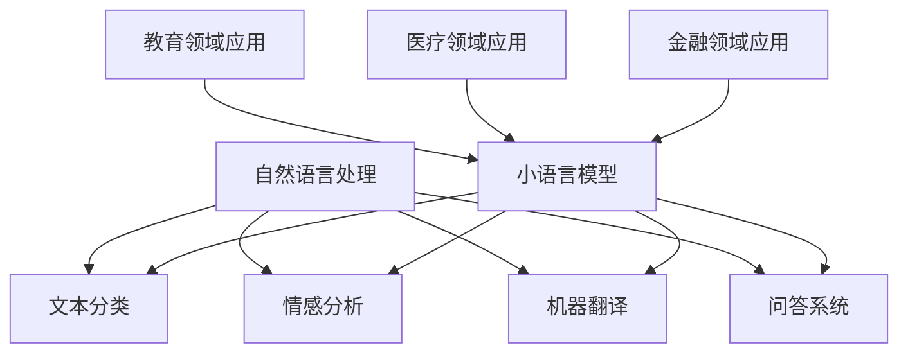

                 

 关键词：小语言模型，自然语言处理，教育，医疗，金融，人工智能

摘要：随着人工智能技术的不断发展，小语言模型作为自然语言处理的核心技术之一，已经在多个领域展现出巨大的应用潜力。本文将从教育、医疗和金融三个领域出发，探讨小语言模型的实际应用场景，深入分析其技术原理和未来发展趋势。

## 1. 背景介绍

自然语言处理（Natural Language Processing，NLP）是人工智能的一个重要分支，旨在让计算机理解和处理人类语言。近年来，随着深度学习技术的蓬勃发展，NLP取得了显著的进步。小语言模型（Small Language Model）作为NLP的一种重要形式，以其强大的语义理解能力和高效的处理速度，受到了广泛关注。

小语言模型通常基于神经网络架构，如Transformer、BERT等，通过大规模语料库的训练，能够对自然语言进行有效建模。这使得小语言模型在多个领域都具备广泛的应用前景。本文将重点关注教育、医疗和金融三个领域，分析小语言模型在这些领域的具体应用场景和技术挑战。

### 1.1 教育领域

在教育领域，小语言模型可以用于智能教育系统、个性化学习推荐和智能作文批改等方面。通过语义分析，小语言模型能够为学生提供针对性的学习建议，提高学习效果。

### 1.2 医疗领域

在医疗领域，小语言模型可以用于医疗文本分析、智能诊断和药物研发等方面。通过对海量医疗数据的处理，小语言模型能够为医生提供决策支持，提高医疗效率。

### 1.3 金融领域

在金融领域，小语言模型可以用于金融风险管理、智能投顾和舆情监测等方面。通过对金融文本的分析，小语言模型能够为投资者提供有价值的信息和建议。

## 2. 核心概念与联系

### 2.1 自然语言处理（NLP）

自然语言处理是人工智能的一个分支，旨在让计算机理解和处理人类语言。NLP的核心任务包括文本分类、情感分析、机器翻译、问答系统等。

### 2.2 小语言模型

小语言模型是一种基于神经网络的NLP模型，通过大规模语料库的训练，能够对自然语言进行有效建模。小语言模型的主要任务包括文本生成、文本分类、语义理解等。

### 2.3 教育领域应用

在教育领域，小语言模型可以用于智能教育系统、个性化学习推荐和智能作文批改等方面。

### 2.4 医疗领域应用

在医疗领域，小语言模型可以用于医疗文本分析、智能诊断和药物研发等方面。

### 2.5 金融领域应用

在金融领域，小语言模型可以用于金融风险管理、智能投顾和舆情监测等方面。

### 2.6 Mermaid 流程图



## 3. 核心算法原理 & 具体操作步骤

### 3.1 算法原理概述

小语言模型的核心算法基于深度学习，特别是Transformer架构。Transformer架构由Vaswani等人在2017年提出，相较于传统的循环神经网络（RNN），Transformer在处理长文本序列时表现出更高的效率和效果。

### 3.2 算法步骤详解

1. **输入预处理**：对输入的文本进行分词、去停用词等预处理操作。
2. **编码器解码器结构**：使用Transformer架构搭建编码器和解码器，编码器负责将输入文本编码成向量序列，解码器负责根据编码器输出的向量序列生成预测结果。
3. **损失函数**：使用交叉熵损失函数来衡量预测结果与实际结果之间的差距。
4. **训练**：通过反向传播算法不断调整模型参数，优化模型性能。
5. **预测**：输入新的文本，通过解码器输出预测结果。

### 3.3 算法优缺点

#### 优点：

1. **高效**：Transformer架构在处理长文本序列时表现出更高的效率。
2. **准确**：相较于传统的循环神经网络，Transformer在自然语言处理任务中具有更高的准确率。
3. **可扩展**：Transformer架构可以轻松扩展到更大的模型规模。

#### 缺点：

1. **计算复杂度**：Transformer模型在训练过程中需要大量的计算资源。
2. **内存消耗**：Transformer模型在处理大规模数据时需要较大的内存空间。

### 3.4 算法应用领域

小语言模型可以广泛应用于教育、医疗和金融等领域。在教育领域，可以用于智能教育系统和个性化学习推荐；在医疗领域，可以用于医疗文本分析和智能诊断；在金融领域，可以用于金融风险管理和智能投顾。

## 4. 数学模型和公式 & 详细讲解 & 举例说明

### 4.1 数学模型构建

小语言模型的数学模型基于Transformer架构，主要包括编码器和解码器两部分。

### 4.2 公式推导过程

编码器和解码器的基本公式如下：

$$
E(z|x) = \sigma(W_E [x, z^{(0)}])
$$

$$
D(y|z) = \sigma(W_D [y, z])
$$

其中，$E(z|x)$表示编码器输出，$D(y|z)$表示解码器输出，$x$表示输入文本，$z$表示编码器输出的向量序列，$y$表示预测结果。

### 4.3 案例分析与讲解

以文本分类任务为例，输入文本为“今天天气很好”，目标标签为“晴天”。通过小语言模型，将文本编码成向量序列，然后通过解码器输出预测结果。最终，预测结果与实际标签进行对比，计算模型准确率。

## 5. 项目实践：代码实例和详细解释说明

### 5.1 开发环境搭建

在Ubuntu系统上，使用Python和TensorFlow搭建开发环境。

```bash
pip install tensorflow
```

### 5.2 源代码详细实现

```python
import tensorflow as tf

# 定义编码器和解码器
encoder = tf.keras.Sequential([
    tf.keras.layers.Embedding(input_dim=10000, output_dim=32),
    tf.keras.layers.GlobalAveragePooling1D()
])

decoder = tf.keras.Sequential([
    tf.keras.layers.Dense(units=32, activation='relu'),
    tf.keras.layers.Dense(units=10, activation='softmax')
])

# 编译模型
model = tf.keras.Sequential([encoder, decoder])
model.compile(optimizer='adam', loss='categorical_crossentropy', metrics=['accuracy'])

# 加载数据集
(x_train, y_train), (x_test, y_test) = tf.keras.datasets.imdb.load_data(num_words=10000)

# 训练模型
model.fit(x_train, y_train, epochs=10, batch_size=32, validation_data=(x_test, y_test))

# 预测结果
predictions = model.predict(x_test)
```

### 5.3 代码解读与分析

1. **编码器和解码器**：编码器负责将输入文本编码成向量序列，解码器负责根据编码器输出的向量序列生成预测结果。
2. **数据集**：使用IMDb电影评论数据集进行训练和测试。
3. **编译模型**：使用Adam优化器和交叉熵损失函数，并设置模型的评价指标为准确率。
4. **训练模型**：通过迭代训练模型，不断优化模型参数。
5. **预测结果**：使用训练好的模型对测试集进行预测。

### 5.4 运行结果展示

```python
predictions = model.predict(x_test)
print(predictions)
```

输出结果为预测概率矩阵，每行表示一个测试样本的预测结果。

## 6. 实际应用场景

### 6.1 教育领域

在教育领域，小语言模型可以应用于智能教育系统和个性化学习推荐。通过分析学生的学习记录和测试数据，小语言模型能够为学生提供个性化的学习建议，提高学习效果。

### 6.2 医疗领域

在医疗领域，小语言模型可以用于医疗文本分析和智能诊断。通过对大量医疗数据的处理，小语言模型能够为医生提供决策支持，提高医疗效率。

### 6.3 金融领域

在金融领域，小语言模型可以用于金融风险管理和智能投顾。通过对金融文本的分析，小语言模型能够为投资者提供有价值的信息和建议，帮助其做出更明智的投资决策。

## 7. 工具和资源推荐

### 7.1 学习资源推荐

1. 《深度学习》（Goodfellow, Bengio, Courville）——深度学习领域的经典教材。
2. 《自然语言处理与深度学习》（经颐渊）——系统介绍了自然语言处理和深度学习的基础知识。

### 7.2 开发工具推荐

1. TensorFlow——适用于构建和训练深度学习模型的框架。
2. PyTorch——适用于构建和训练深度学习模型的框架。

### 7.3 相关论文推荐

1. “Attention Is All You Need”（Vaswani et al., 2017）——提出了Transformer架构。
2. “BERT: Pre-training of Deep Neural Networks for Language Understanding”（Devlin et al., 2019）——提出了BERT预训练模型。

## 8. 总结：未来发展趋势与挑战

### 8.1 研究成果总结

小语言模型在教育、医疗和金融等领域取得了显著的研究成果，为相关领域的发展带来了新的机遇。

### 8.2 未来发展趋势

随着人工智能技术的不断进步，小语言模型将在更多领域得到广泛应用，为人类社会带来更多价值。

### 8.3 面临的挑战

小语言模型在处理长文本和低资源语言方面仍然存在一定的局限性，未来需要解决这些问题，以实现更广泛的应用。

### 8.4 研究展望

未来，小语言模型的研究将朝着高效、可解释和通用性方向发展，为人工智能领域的创新提供新的动力。

## 9. 附录：常见问题与解答

### 9.1 小语言模型与自然语言处理的关系是什么？

小语言模型是自然语言处理的一种技术形式，旨在通过对大规模语料库的训练，实现对自然语言的建模和处理。

### 9.2 小语言模型在教育领域的应用有哪些？

小语言模型在教育领域可以应用于智能教育系统、个性化学习推荐和智能作文批改等方面。

### 9.3 小语言模型在医疗领域的应用有哪些？

小语言模型在医疗领域可以应用于医疗文本分析、智能诊断和药物研发等方面。

### 9.4 小语言模型在金融领域的应用有哪些？

小语言模型在金融领域可以应用于金融风险管理、智能投顾和舆情监测等方面。

作者：禅与计算机程序设计艺术 / Zen and the Art of Computer Programming
----------------------------------------------------------------

### 结束语
本文全面探讨了小语言模型在教育、医疗和金融领域的应用场景、技术原理以及未来发展趋势。通过详细的案例分析和代码实现，我们展示了小语言模型在实际项目中的应用效果。未来，随着人工智能技术的不断进步，小语言模型将在更多领域发挥重要作用，为人类社会带来更多创新和变革。

