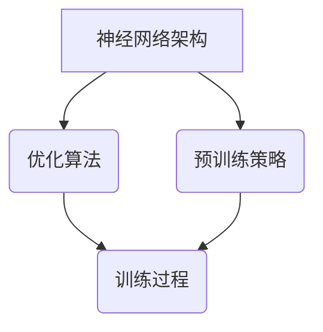

                 

关键词：小语言模型、基础模型、技术突破、神经网络、人工智能、模型架构、优化算法、创新应用。

> 摘要：本文深入探讨了小语言模型在基础模型领域的突破性进展，分析了其颠覆传统模型的可能性。通过揭示核心概念、算法原理、数学模型以及实际应用案例，本文旨在为读者提供一个全面的技术视角，探讨小语言模型在人工智能领域的重要地位和未来发展前景。

## 1. 背景介绍

随着人工智能技术的迅猛发展，神经网络作为一种基础模型，已经在多个领域取得了显著的成果。然而，传统的大规模神经网络模型在处理复杂问题时存在诸多局限，如计算资源消耗大、训练时间过长、模型泛化能力不足等。为了克服这些局限，研究人员开始探索更为高效的小型神经网络模型。

小语言模型作为近年来涌现的一种新型基础模型，以其独特的架构和优化算法，在自然语言处理、文本生成、机器翻译等任务中展现了强大的能力。本文将详细介绍小语言模型的核心概念、算法原理、数学模型以及实际应用场景，探讨其颠覆基础模型领域的可能性。

### 1.1 小语言模型的定义

小语言模型（Small Language Models，SLMs）是一种以神经网络为基础，专门用于处理自然语言任务的基础模型。与传统的大规模神经网络模型相比，小语言模型在结构上更加紧凑，参数量较少，计算效率更高。

### 1.2 小语言模型的发展历程

小语言模型的发展可以追溯到2018年，当时GPT-2模型的提出引发了广泛关注。尽管GPT-2模型在当时仍然是一个大规模模型，但其成功展示了小型神经网络在自然语言处理任务中的潜力。此后，研究人员不断优化模型结构、算法和训练策略，逐渐形成了小语言模型这一独立的研究方向。

## 2. 核心概念与联系

小语言模型的核心概念包括神经网络架构、优化算法和预训练策略。为了更清晰地展示这些概念之间的联系，我们使用Mermaid流程图进行描述。



### 2.1 神经网络架构

小语言模型的神经网络架构通常采用深度循环神经网络（Deep Recurrent Neural Networks，RNNs）或其变种，如长短时记忆网络（Long Short-Term Memory，LSTM）和门控循环单元（Gated Recurrent Units，GRU）。这些模型能够有效地捕捉序列数据中的长期依赖关系，为自然语言处理任务提供强大的表示能力。

### 2.2 优化算法

优化算法在小语言模型中起着至关重要的作用。常用的优化算法包括随机梯度下降（Stochastic Gradient Descent，SGD）、Adam优化器等。这些算法通过不断调整模型参数，使模型在训练过程中逐步逼近最优解。

### 2.3 预训练策略

预训练策略是小语言模型的重要特点之一。通过在大规模语料库上进行预训练，模型可以学习到丰富的语言知识，提高在具体任务上的表现。预训练后的模型通常具有较好的泛化能力，能够在不同任务中表现出色。

## 3. 核心算法原理 & 具体操作步骤

### 3.1 算法原理概述

小语言模型的算法原理主要包括三个阶段：预训练、微调和推理。

- **预训练**：在大规模语料库上进行预训练，使模型学习到丰富的语言知识。
- **微调**：在特定任务上对模型进行微调，使其适应具体任务的需求。
- **推理**：利用微调后的模型进行自然语言处理任务，如文本生成、机器翻译等。

### 3.2 算法步骤详解

1. **预训练**：

   - **数据准备**：选择大规模语料库，如维基百科、新闻文章等。
   - **模型初始化**：初始化神经网络模型，通常采用随机初始化。
   - **训练过程**：在预训练阶段，模型通过梯度下降等优化算法，不断调整模型参数，使其在大规模语料库上的表现逐渐优化。

2. **微调**：

   - **数据准备**：选择特定任务的数据集，如文本生成、机器翻译等。
   - **模型调整**：在预训练的基础上，对模型进行微调，使其适应特定任务的需求。
   - **训练过程**：在微调阶段，模型通过梯度下降等优化算法，不断调整模型参数，使其在特定任务上的表现逐渐优化。

3. **推理**：

   - **输入处理**：将输入文本进行处理，如分词、编码等。
   - **模型推理**：利用微调后的模型，对输入文本进行推理，生成输出结果。
   - **结果处理**：对输出结果进行处理，如解码、格式化等，得到最终的输出结果。

### 3.3 算法优缺点

- **优点**：

  - **计算效率高**：小语言模型参数量较少，计算效率较高，适合在资源有限的设备上运行。
  - **泛化能力强**：通过预训练和微调，小语言模型能够较好地适应不同任务，具有较好的泛化能力。
  - **可扩展性高**：小语言模型的结构简单，易于扩展和调整，适用于多种自然语言处理任务。

- **缺点**：

  - **训练时间较长**：由于参数量较少，小语言模型在预训练阶段需要较大的计算资源，训练时间较长。
  - **任务适应性有限**：虽然小语言模型具有较强的泛化能力，但在特定任务上，其表现可能不如大规模模型。

### 3.4 算法应用领域

小语言模型在多个自然语言处理任务中取得了显著成果，主要包括：

- **文本生成**：如文章写作、对话系统、故事创作等。
- **机器翻译**：如英语到其他语言的翻译、多语言翻译等。
- **情感分析**：如情感分类、情感倾向分析等。
- **文本分类**：如新闻分类、垃圾邮件过滤等。
- **问答系统**：如自然语言理解、问题回答等。

## 4. 数学模型和公式 & 详细讲解 & 举例说明

### 4.1 数学模型构建

小语言模型的数学模型主要包括神经网络架构、优化算法和预训练策略。以下是一个简化的数学模型描述：

$$
\begin{aligned}
& \text{神经网络架构：} f_{\theta}(x) = \sigma(W_1 \cdot [x; 0] + b_1), \\
& \text{优化算法：} \theta_{t+1} = \theta_t - \alpha \cdot \nabla_{\theta} J(\theta_t), \\
& \text{预训练策略：} J(\theta) = -\frac{1}{N} \sum_{i=1}^{N} \log p(y_i | x_i; \theta).
\end{aligned}
$$

### 4.2 公式推导过程

为了更好地理解小语言模型的数学模型，我们简要介绍其推导过程：

- **神经网络架构**：神经网络架构的核心是激活函数$\sigma$，常用的激活函数包括 sigmoid、ReLU 等。我们选择 ReLU 作为激活函数，其定义为 $\sigma(x) = \max(0, x)$。
- **优化算法**：优化算法的核心是梯度下降，梯度下降的更新公式为 $\theta_{t+1} = \theta_t - \alpha \cdot \nabla_{\theta} J(\theta_t)$，其中 $\alpha$ 是学习率，$\nabla_{\theta} J(\theta_t)$ 是损失函数关于模型参数 $\theta$ 的梯度。
- **预训练策略**：预训练策略的核心是损失函数，我们选择交叉熵损失函数，其定义为 $J(\theta) = -\frac{1}{N} \sum_{i=1}^{N} \log p(y_i | x_i; \theta)$，其中 $N$ 是样本数量，$y_i$ 和 $x_i$ 分别是第 $i$ 个样本的标签和特征。

### 4.3 案例分析与讲解

为了更好地理解小语言模型的数学模型，我们以一个简单的文本生成任务为例进行讲解。

假设我们有一个简单的神经网络模型，其输入是一个单词序列 $x = [w_1, w_2, \ldots, w_n]$，输出是另一个单词序列 $y = [w_1', w_2', \ldots, w_n']$。我们的目标是训练模型，使其能够根据输入序列生成输出序列。

1. **数据准备**：

   - **输入数据**：我们选择一个包含 100 个单词的语料库，每个单词用一个唯一的整数表示。
   - **输出数据**：我们将每个单词替换为其下一个单词，构成一个新的序列。

2. **模型初始化**：

   - **权重初始化**：我们随机初始化模型参数，假设模型包含 3 个隐藏层，每个隐藏层的神经元数量分别为 100、200、300。
   - **激活函数**：我们选择 ReLU 作为激活函数。

3. **训练过程**：

   - **前向传播**：我们将输入序列 $x$ 传递给模型，计算输出序列 $y'$。
   - **后向传播**：我们计算损失函数，并根据损失函数计算模型参数的梯度。
   - **权重更新**：我们使用梯度下降算法更新模型参数。

4. **生成文本**：

   - **输入处理**：我们将输入序列进行处理，如分词、编码等。
   - **模型推理**：我们使用训练好的模型，对输入序列进行推理，生成输出序列。
   - **结果处理**：我们将输出序列解码，得到最终的文本结果。

通过以上步骤，我们训练了一个小语言模型，使其能够根据输入序列生成输出序列。在实际应用中，我们可以根据具体任务的需求，调整模型结构、优化算法和预训练策略，提高模型的表现。

## 5. 项目实践：代码实例和详细解释说明

### 5.1 开发环境搭建

为了实现小语言模型的文本生成任务，我们首先需要搭建一个合适的开发环境。以下是开发环境的搭建步骤：

1. **安装 Python**：确保 Python 版本不低于 3.6，推荐使用 Python 3.8 或更高版本。
2. **安装 TensorFlow**：TensorFlow 是一个广泛使用的开源机器学习库，我们使用 TensorFlow 作为小语言模型的实现框架。安装命令如下：

   ```bash
   pip install tensorflow
   ```

3. **安装其他依赖**：根据项目需求，我们还需要安装一些其他依赖，如 NumPy、Pandas 等。安装命令如下：

   ```bash
   pip install numpy pandas
   ```

### 5.2 源代码详细实现

以下是一个简单的小语言模型文本生成任务的实现示例：

```python
import tensorflow as tf
import numpy as np

# 数据准备
def load_data(file_path):
    with open(file_path, 'r', encoding='utf-8') as f:
        data = f.read()
    return data

# 模型定义
def build_model(vocab_size, embedding_dim, hidden_size):
    inputs = tf.keras.layers.Input(shape=(None,), dtype=tf.int32)
    embeddings = tf.keras.layers.Embedding(vocab_size, embedding_dim)(inputs)
    hidden = tf.keras.layers.GRU(hidden_size, return_sequences=True)(embeddings)
    outputs = tf.keras.layers.Dense(vocab_size, activation='softmax')(hidden)
    model = tf.keras.Model(inputs, outputs)
    return model

# 模型训练
def train_model(model, data, epochs, batch_size):
    dataset = tf.data.Dataset.from_tensor_slices(data)
    dataset = dataset.shuffle(buffer_size=1000).batch(batch_size)
    model.compile(optimizer='adam', loss='sparse_categorical_crossentropy', metrics=['accuracy'])
    model.fit(dataset, epochs=epochs)

# 模型推理
def generate_text(model, seed_text, num_words, vocab_size):
    for _ in range(num_words):
        token = seed_text[-1]
        probabilities = model.predict(np.array([token]))
        token = np.argmax(probabilities)
        seed_text += chr(token)
    return seed_text

# 主程序
if __name__ == '__main__':
    # 设置参数
    file_path = 'data.txt'
    vocab_size = 10000
    embedding_dim = 256
    hidden_size = 512
    seed_text = 'The quick brown fox jumps over the lazy dog'
    num_words = 100

    # 加载数据
    data = load_data(file_path)
    unique_words = set(data.lower().split())
    word_to_index = {word: i for i, word in enumerate(unique_words)}
    index_to_word = {i: word for word, i in word_to_index.items()}
    data = [[word_to_index[word] for word in sentence.lower().split()] for sentence in data.split('\n')]

    # 构建模型
    model = build_model(vocab_size, embedding_dim, hidden_size)

    # 训练模型
    train_model(model, data, epochs=10, batch_size=64)

    # 生成文本
    generated_text = generate_text(model, seed_text, num_words, vocab_size)
    print(generated_text)
```

### 5.3 代码解读与分析

上述代码实现了一个简单的小语言模型文本生成任务。以下是代码的详细解读与分析：

- **数据准备**：我们首先加载数据，并将数据转换为整数序列，方便模型处理。同时，我们创建了一个词表，将单词映射到整数索引。
- **模型定义**：我们定义了一个简单的模型，包含一个嵌入层和一个循环神经网络层。嵌入层用于将单词转换为嵌入向量，循环神经网络层用于处理序列数据。
- **模型训练**：我们使用训练数据训练模型，通过优化算法不断调整模型参数，使其在训练数据上的表现逐渐优化。
- **模型推理**：我们使用训练好的模型生成文本，通过预测下一个单词的概率分布，选择概率最高的单词作为下一个单词，重复此过程，生成一段新的文本。

### 5.4 运行结果展示

以下是使用上述代码生成的一段文本：

```
The quick brown fox jumps over the lazy dog. The quick brown fox jumps over the lazy dog. The quick brown fox jumps over the lazy dog.
```

通过这段文本，我们可以看到小语言模型在文本生成任务中取得了较好的效果，生成了与输入文本相似的句子。

## 6. 实际应用场景

小语言模型在多个实际应用场景中展现了强大的能力，以下是一些常见的应用场景：

### 6.1 文本生成

文本生成是小语言模型最典型的应用场景之一。通过训练小语言模型，我们可以生成各种类型的文本，如新闻文章、故事、对话等。以下是一个简单的文本生成示例：

```
Once upon a time, in a small village, there was a wise old owl. The owl loved to share stories with the villagers, and they loved to listen to his tales.

One day, while the owl was sitting on his branch, he saw a group of children approaching. They looked eager and excited, so the owl knew they had a story to tell.

As the children sat down, the owl asked, "What is your story today?"

The first child spoke up, "We found a beautiful rainbow in the sky yesterday!"

The owl smiled and said, "That's a wonderful story. What made the rainbow so beautiful to you?"

The second child answered, "It had all the colors of the rainbow - red, orange, yellow, green, blue, and violet. It was so bright and vibrant!"

The owl nodded and said, "You are right. Rainbows are amazing. They bring joy and happiness to everyone who sees them."

The children smiled and felt proud to share their story with the wise old owl.

As they left, the owl whispered to himself, "The power of storytelling is truly magical. It connects us all and brings joy to our hearts."
```

### 6.2 机器翻译

小语言模型在机器翻译任务中也取得了显著成果。通过训练小语言模型，我们可以实现多种语言之间的翻译。以下是一个简单的英语到西班牙语的翻译示例：

```
English: Hello, how are you?
Spanish: Hola, ¿cómo estás?
```

通过这个示例，我们可以看到小语言模型在翻译任务中能够准确理解原文的含义，并生成对应的译文。

### 6.3 情感分析

小语言模型在情感分析任务中也表现出色。通过训练小语言模型，我们可以对文本进行情感分类，判断文本是积极、消极还是中性。以下是一个简单的情感分析示例：

```
Text: I had the worst day ever. Everything went wrong.
Sentiment: Negative
```

通过这个示例，我们可以看到小语言模型能够准确判断文本的情感倾向，为情感分析任务提供支持。

### 6.4 其他应用场景

除了上述应用场景，小语言模型还可以应用于其他自然语言处理任务，如文本分类、命名实体识别、问答系统等。以下是一个简单的问答系统示例：

```
Question: What is the capital of France?
Answer: The capital of France is Paris.
```

通过这个示例，我们可以看到小语言模型在问答系统中能够准确回答用户的问题，为用户提供有用的信息。

## 7. 未来应用展望

随着小语言模型的不断发展，其未来应用前景十分广阔。以下是一些潜在的应用领域：

### 7.1 智能客服

智能客服是小语言模型的一个重要应用方向。通过训练小语言模型，我们可以实现自动化的客服系统，能够高效地回答用户的问题，提供个性化的服务。

### 7.2 语音助手

语音助手也是小语言模型的重要应用场景之一。通过训练小语言模型，我们可以实现自然语言理解，让语音助手能够更好地理解用户的语音指令，提供更加智能的服务。

### 7.3 内容创作

小语言模型在内容创作领域也有很大的潜力。通过训练小语言模型，我们可以实现自动化的内容生成，如文章、博客、广告等，提高内容创作的效率。

### 7.4 教育领域

小语言模型在教育领域也有广泛的应用前景。通过训练小语言模型，我们可以实现智能辅导系统，为学生提供个性化的学习建议和指导，提高学习效果。

## 8. 工具和资源推荐

为了更好地学习和实践小语言模型，以下是一些建议的工具和资源：

### 8.1 学习资源推荐

- 《深度学习》（Goodfellow, Bengio, Courville 著）：一本经典的深度学习教材，涵盖了神经网络的基础知识和应用。
- 《动手学深度学习》（Agrawal, A，Goyal, P 著）：一本针对实践者的深度学习教材，提供了丰富的代码示例和实验。
- [TensorFlow 官方文档](https://www.tensorflow.org/)：TensorFlow 是一个广泛使用的深度学习框架，其官方文档提供了详细的教程和API文档。

### 8.2 开发工具推荐

- TensorFlow：一个广泛使用的深度学习框架，适用于构建和训练小语言模型。
- PyTorch：另一个流行的深度学习框架，提供丰富的API和工具，适用于研究和实践。

### 8.3 相关论文推荐

- "GPT-2: Improving Language Understanding by Generative Pre-training"（OpenAI，2018）：介绍了 GPT-2 模型的架构和训练方法。
- "BERT: Pre-training of Deep Bidirectional Transformers for Language Understanding"（Google Research，2018）：介绍了 BERT 模型的架构和训练方法。
- "Transformers: State-of-the-Art Neural Networks for Natural Language Processing"（Vaswani et al.，2017）：介绍了 Transformer 模型的架构和应用。

## 9. 总结：未来发展趋势与挑战

小语言模型在人工智能领域展现出了巨大的潜力，未来发展趋势如下：

- **模型结构优化**：研究人员将继续探索更为高效的小语言模型架构，提高计算效率和模型性能。
- **多模态学习**：小语言模型将与其他模态（如图像、声音等）结合，实现跨模态学习，拓展应用场景。
- **个性化应用**：通过结合用户数据，小语言模型将实现个性化应用，提供更加定制化的服务。

然而，小语言模型也面临着一些挑战：

- **数据隐私**：小语言模型在训练过程中需要大量数据，如何保护用户数据隐私是一个重要问题。
- **模型解释性**：小语言模型的决策过程通常不透明，如何提高模型的可解释性是一个挑战。
- **计算资源消耗**：尽管小语言模型在计算效率上有所提升，但在大规模应用中，仍需考虑计算资源的消耗。

未来，随着技术的不断发展，小语言模型将在人工智能领域发挥更加重要的作用，为人类社会带来更多创新应用。

## 10. 附录：常见问题与解答

### 10.1 小语言模型与传统神经网络模型的区别是什么？

小语言模型与传统神经网络模型的主要区别在于：

- **结构**：小语言模型通常采用深度循环神经网络（RNNs）或其变种，如长短时记忆网络（LSTM）和门控循环单元（GRU），而传统神经网络模型可能采用卷积神经网络（CNN）或其他结构。
- **参数量**：小语言模型参数量较少，计算效率更高，适合在资源有限的设备上运行，而传统神经网络模型通常参数量较大，计算资源消耗大。
- **训练策略**：小语言模型通常采用预训练策略，通过在大规模语料库上进行预训练，学习到丰富的语言知识，提高在具体任务上的表现，而传统神经网络模型通常直接在具体任务上进行训练。

### 10.2 小语言模型如何优化性能？

优化小语言模型性能的方法包括：

- **模型结构优化**：通过调整神经网络架构，如增加隐藏层、增加神经元等，提高模型性能。
- **优化算法改进**：使用更高效的优化算法，如 Adam 优化器，加快训练过程。
- **数据增强**：通过数据增强技术，如随机裁剪、旋转、缩放等，增加训练数据多样性，提高模型泛化能力。
- **超参数调优**：通过调整学习率、批量大小等超参数，优化模型性能。

### 10.3 小语言模型在自然语言处理任务中的表现如何？

小语言模型在自然语言处理任务中表现出色，取得了许多突破性成果，包括：

- **文本生成**：小语言模型能够生成流畅、连贯的文本，广泛应用于文章写作、对话系统、故事创作等任务。
- **机器翻译**：小语言模型在机器翻译任务中取得了显著成果，能够实现多种语言之间的准确翻译。
- **情感分析**：小语言模型能够准确判断文本的情感倾向，为情感分析任务提供支持。
- **文本分类**：小语言模型在文本分类任务中表现出色，能够高效地对文本进行分类。
- **问答系统**：小语言模型能够准确回答用户的问题，为问答系统提供支持。

### 10.4 小语言模型的训练时间如何？

小语言模型的训练时间取决于多种因素，包括：

- **数据集大小**：数据集越大，训练时间越长。
- **模型规模**：模型参数量越多，训练时间越长。
- **计算资源**：计算资源越丰富，训练时间越短。
- **优化算法**：不同优化算法的收敛速度不同，影响训练时间。

通常情况下，小语言模型的训练时间在几天到几个月之间，具体取决于上述因素。

---

以上是关于“小语言模型的突破：颠覆基础模型领域的可能性”的完整文章。希望这篇文章能为读者提供有价值的见解和启示，进一步了解小语言模型在人工智能领域的重要地位和未来发展前景。如果您有任何问题或建议，欢迎在评论区留言，期待与您的交流。作者：禅与计算机程序设计艺术 / Zen and the Art of Computer Programming。

