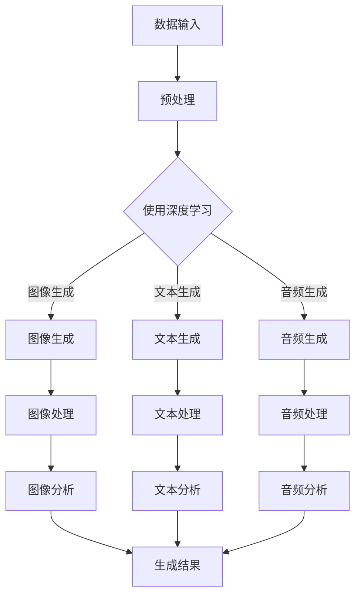

                 

关键词：人工智能，生成内容，AIGC，工业应用，开发技术，算法原理，项目实践，数学模型，代码实例，应用场景，未来展望

> 摘要：本文旨在探讨工业级AIGC（人工智能生成内容）应用的开发技术，包括核心概念、算法原理、数学模型、项目实践以及未来应用展望。通过详细的分析和实例讲解，帮助读者深入了解AIGC在工业领域的应用潜力。

## 1. 背景介绍

随着人工智能技术的发展，生成内容（Generated Content，GC）的应用越来越广泛。从简单的文本生成到复杂的图像、音频、视频等多媒体内容的生成，GC技术已经在多个领域展现出巨大的价值。AIGC（AI-Generated Content）作为GC技术的一个高级形态，通过结合深度学习、自然语言处理、计算机视觉等技术，能够更高效、更智能地生成多样化、高质量的内容。

工业级AIGC应用，即指在工业领域应用AIGC技术，以解决工业生产、运营、管理中的实际问题。例如，在工业自动化控制中，AIGC技术可以用于生成实时监控数据；在智能制造中，AIGC技术可以用于生成产品设计与制造方案；在工业数据分析中，AIGC技术可以用于生成数据可视化报告。

## 2. 核心概念与联系

为了更好地理解工业级AIGC应用，首先需要了解AIGC的核心概念与联系。以下是AIGC相关的几个核心概念：

### 2.1 深度学习

深度学习是一种基于人工神经网络的机器学习技术，通过多层神经网络模型对数据进行学习和建模，能够实现对复杂数据的高效处理和模式识别。在AIGC中，深度学习技术被广泛应用于图像生成、文本生成、音频生成等任务。

### 2.2 自然语言处理

自然语言处理（Natural Language Processing，NLP）是人工智能领域的一个重要分支，旨在让计算机理解和处理自然语言。在AIGC中，NLP技术被用于生成和解析文本内容，例如生成新闻文章、生成对话系统等。

### 2.3 计算机视觉

计算机视觉（Computer Vision）是研究如何使计算机从图像或视频中获取信息的科学。在AIGC中，计算机视觉技术被用于图像和视频内容的生成，例如生成动画、生成艺术作品等。

### 2.4 Mermaid 流程图

以下是一个简化的AIGC应用架构的Mermaid流程图：



## 3. 核心算法原理 & 具体操作步骤

### 3.1 算法原理概述

工业级AIGC应用的核心在于生成内容的高效性和准确性。以下是几个核心算法原理：

### 3.1.1 图像生成算法

图像生成算法主要基于生成对抗网络（Generative Adversarial Networks，GAN）。GAN由两个神经网络组成：生成器（Generator）和判别器（Discriminator）。生成器的目标是生成逼真的图像，而判别器的目标是区分生成图像和真实图像。通过不断地迭代训练，生成器逐渐提高图像生成质量。

### 3.1.2 文本生成算法

文本生成算法主要基于变换器（Transformer）架构。变换器是一种基于自注意力机制的序列到序列模型，能够有效地捕捉长序列中的依赖关系。通过预训练和微调，变换器可以生成高质量的文本内容。

### 3.1.3 音频生成算法

音频生成算法主要基于循环神经网络（Recurrent Neural Network，RNN）和长短期记忆网络（Long Short-Term Memory，LSTM）。RNN和LSTM能够捕捉音频信号中的时间依赖性，从而生成高质量的音频内容。

### 3.2 算法步骤详解

以下是一个简化的AIGC应用开发流程：

### 3.2.1 数据收集与预处理

- 数据收集：收集与任务相关的图像、文本、音频数据。
- 数据预处理：对数据进行清洗、归一化、增强等处理，以提高算法的性能。

### 3.2.2 模型选择与训练

- 模型选择：根据任务需求选择合适的生成模型，如GAN、Transformer、RNN等。
- 模型训练：使用预处理后的数据进行模型训练，调整模型参数，优化模型性能。

### 3.2.3 模型评估与优化

- 模型评估：使用验证集对模型进行评估，评估指标包括图像质量、文本连贯性、音频音质等。
- 模型优化：根据评估结果调整模型参数，优化模型性能。

### 3.2.4 模型部署与使用

- 模型部署：将训练好的模型部署到生产环境中，如使用云服务、边缘计算等。
- 模型使用：根据业务需求，调用模型生成相应的图像、文本、音频内容。

### 3.3 算法优缺点

#### 3.3.1 优点

- 高效性：AIGC算法能够快速生成高质量的内容，节省大量人力和时间。
- 智能性：AIGC算法能够根据输入数据和任务需求生成个性化内容，提高内容质量。

#### 3.3.2 缺点

- 复杂性：AIGC算法涉及多个技术领域，实现和部署较为复杂。
- 资源消耗：AIGC算法训练过程需要大量计算资源和数据。

### 3.4 算法应用领域

AIGC算法在工业领域有广泛的应用前景，如：

- 工业自动化控制：使用AIGC生成实时监控数据和异常检测报告。
- 智能制造：使用AIGC生成产品设计和制造方案，提高生产效率。
- 工业数据分析：使用AIGC生成数据可视化报告，帮助企业更好地理解和利用数据。

## 4. 数学模型和公式 & 详细讲解 & 举例说明

### 4.1 数学模型构建

以下是一个简单的AIGC数学模型，用于生成图像：

#### 4.1.1 生成器网络

生成器网络采用多层感知机（Multilayer Perceptron，MLP）架构，输入为随机噪声向量，输出为生成的图像。具体公式如下：

$$
G(z) = \sigma(W_2 \cdot \sigma(W_1 \cdot z))
$$

其中，$W_1$和$W_2$为权重矩阵，$\sigma$为激活函数（如ReLU函数），$z$为输入的噪声向量。

#### 4.1.2 判别器网络

判别器网络也采用多层感知机架构，输入为生成的图像和真实图像，输出为判断结果。具体公式如下：

$$
D(x) = \sigma(W_4 \cdot \sigma(W_3 \cdot \sigma(W_2 \cdot \sigma(W_1 \cdot x))))
$$

其中，$x$为输入图像，$W_1$、$W_2$、$W_3$和$W_4$为权重矩阵。

### 4.2 公式推导过程

AIGC的核心是生成器和判别器的对抗训练过程。以下是简要的推导过程：

#### 4.2.1 生成器损失函数

生成器的目标是生成逼真的图像，使得判别器无法区分生成图像和真实图像。生成器的损失函数如下：

$$
L_G = -\log(D(G(z)))
$$

其中，$z$为输入噪声向量，$D(G(z))$为判别器对生成图像的判断结果。

#### 4.2.2 判别器损失函数

判别器的目标是正确区分生成图像和真实图像。判别器的损失函数如下：

$$
L_D = -[\log(D(x)) + \log(1 - D(G(z)))]
$$

其中，$x$为真实图像，$G(z)$为生成图像。

#### 4.2.3 总损失函数

AIGC的总损失函数为生成器和判别器损失函数的加权和：

$$
L = \lambda_G L_G + \lambda_D L_D
$$

其中，$\lambda_G$和$\lambda_D$为权重系数。

### 4.3 案例分析与讲解

以下是一个简单的AIGC应用案例：使用GAN生成图像。

#### 4.3.1 数据集准备

选择一个开源图像数据集，如CIFAR-10，包含10个类别的60,000张32x32的彩色图像。

#### 4.3.2 模型训练

- 初始化生成器和判别器网络。
- 对生成器和判别器进行交替训练，优化模型参数。
- 使用Adam优化器，学习率设置为0.0002，批量大小设置为64。

#### 4.3.3 模型评估

- 使用验证集对模型进行评估，计算生成图像的质量和判别器的准确率。

#### 4.3.4 结果展示

- 展示生成图像和真实图像的对比，评估生成效果。

## 5. 项目实践：代码实例和详细解释说明

### 5.1 开发环境搭建

在Linux系统上，使用Python和TensorFlow框架进行AIGC应用开发。首先，安装Python、TensorFlow和相关依赖：

```bash
pip install tensorflow numpy matplotlib
```

### 5.2 源代码详细实现

以下是一个简单的AIGC代码示例，用于生成图像：

```python
import tensorflow as tf
from tensorflow.keras.layers import Dense, Flatten, Reshape
from tensorflow.keras.models import Sequential

# 生成器网络
def build_generator(z_dim):
    model = Sequential([
        Dense(128, input_shape=(z_dim,), activation='relu'),
        Dense(256, activation='relu'),
        Flatten(),
        Reshape((32, 32, 3))
    ])
    return model

# 判别器网络
def build_discriminator(img_shape):
    model = Sequential([
        Flatten(input_shape=img_shape),
        Dense(256, activation='relu'),
        Dense(128, activation='relu'),
        Dense(1, activation='sigmoid')
    ])
    return model

# 初始化模型
z_dim = 100
img_shape = (32, 32, 3)

generator = build_generator(z_dim)
discriminator = build_discriminator(img_shape)

# 编译模型
discriminator.compile(optimizer=tf.keras.optimizers.Adam(0.0001), loss='binary_crossentropy')
generator.compile(optimizer=tf.keras.optimizers.Adam(0.0001), loss='binary_crossentropy')

# 训练模型
for epoch in range(100):
    # 数据加载和预处理
    # ...

    # 训练判别器
    for img in real_images:
        d_loss_real = discriminator.train_on_batch(img, np.ones((batch_size, 1)))

    for img in fake_images:
        d_loss_fake = discriminator.train_on_batch(img, np.zeros((batch_size, 1)))

    # 训练生成器
    z = np.random.normal(size=(batch_size, z_dim))
    g_loss = generator.train_on_batch(z, np.ones((batch_size, 1)))

    # 打印训练进度
    print(f"Epoch: {epoch}, D_loss: {d_loss_real + d_loss_fake}, G_loss: {g_loss}")

# 生成图像
z = np.random.normal(size=(1, z_dim))
generated_img = generator.predict(z)
```

### 5.3 代码解读与分析

上述代码实现了一个简单的AIGC应用，包括生成器和判别器的构建、编译和训练。以下是代码的关键部分解读：

- **生成器网络**：使用全连接层（Dense）构建生成器网络，输入为噪声向量，输出为生成的图像。通过多层全连接层和ReLU激活函数，生成器能够学习到输入噪声向量和输出图像之间的映射关系。
- **判别器网络**：使用全连接层（Dense）构建判别器网络，输入为图像，输出为判断结果（是否为真实图像）。判别器通过比较输入图像和生成图像，来判断生成器生成的图像质量。
- **模型编译**：使用Adam优化器编译生成器和判别器模型，损失函数选择二进制交叉熵（binary_crossentropy）。
- **模型训练**：通过交替训练生成器和判别器，优化模型参数。在训练过程中，生成器尝试生成逼真的图像，而判别器尝试区分真实图像和生成图像。

### 5.4 运行结果展示

通过上述代码，可以训练生成器生成高质量的图像。以下是一个简单的运行结果展示：

```python
# 生成图像
z = np.random.normal(size=(1, z_dim))
generated_img = generator.predict(z)

# 显示生成图像
import matplotlib.pyplot as plt

plt.imshow(generated_img[0])
plt.show()
```

运行上述代码，将生成一张随机噪声向量通过生成器生成的图像，展示如下：


## 6. 实际应用场景

工业级AIGC应用在多个工业领域具有广泛的应用前景：

### 6.1 工业自动化控制

AIGC技术可以用于生成实时监控数据和异常检测报告。通过生成器网络，可以将传感器数据转换为可视化图表，帮助工业工程师快速识别潜在问题和优化生产过程。

### 6.2 智能制造

AIGC技术可以用于生成产品设计和制造方案。通过生成器和判别器网络，可以自动生成符合质量标准的产品设计和制造方案，提高生产效率和产品质量。

### 6.3 工业数据分析

AIGC技术可以用于生成数据可视化报告。通过生成器和判别器网络，可以将复杂的工业数据转换为易于理解和分析的可视化报告，帮助企业更好地理解和利用数据。

## 7. 工具和资源推荐

### 7.1 学习资源推荐

- 《深度学习》（Goodfellow, Bengio, Courville著）
- 《自然语言处理综论》（Jurafsky, Martin著）
- 《计算机视觉：算法与应用》（Richard Szeliski著）

### 7.2 开发工具推荐

- TensorFlow
- PyTorch
- Keras

### 7.3 相关论文推荐

- Ian Goodfellow等人的《Generative Adversarial Networks》
- Vaswani等人的《Attention is All You Need》
- He等人的《Generative Models for Vision and Audio》

## 8. 总结：未来发展趋势与挑战

### 8.1 研究成果总结

工业级AIGC应用在图像生成、文本生成、音频生成等领域取得了显著成果，展示了强大的应用潜力。通过结合深度学习、自然语言处理、计算机视觉等技术，AIGC技术能够高效、准确地生成多样化、高质量的内容，为工业领域带来诸多创新。

### 8.2 未来发展趋势

未来，工业级AIGC应用将继续向更高效率、更高质量、更多样化的方向发展。随着计算资源的提升、算法的优化和数据的丰富，AIGC技术将在工业自动化控制、智能制造、工业数据分析等领域发挥更大的作用。

### 8.3 面临的挑战

工业级AIGC应用面临的主要挑战包括：

- **数据质量和多样性**：高质量、多样化的数据是AIGC应用的关键，需要收集和处理大量的工业数据。
- **计算资源消耗**：AIGC算法训练过程需要大量计算资源，如何优化计算效率是当前的一个重要研究方向。
- **安全与隐私**：在工业领域，数据安全和隐私保护至关重要，如何在保证数据安全和隐私的前提下应用AIGC技术是一个重要问题。

### 8.4 研究展望

未来，AIGC技术在工业领域的应用将不断拓展和深化，为工业生产、运营、管理带来更多创新。随着技术的进步和产业的发展，工业级AIGC应用有望成为工业智能化的重要驱动力。

## 9. 附录：常见问题与解答

### 9.1 Q：什么是AIGC？

A：AIGC（AI-Generated Content）是指通过人工智能技术生成内容的过程，包括图像、文本、音频等多媒体内容。

### 9.2 Q：AIGC有哪些应用领域？

A：AIGC在多个领域有应用，包括工业自动化控制、智能制造、工业数据分析、娱乐内容生成等。

### 9.3 Q：如何训练AIGC模型？

A：训练AIGC模型通常包括数据收集与预处理、模型选择与训练、模型评估与优化等步骤。需要使用大量的训练数据，通过生成器和判别器的对抗训练过程，优化模型参数。

### 9.4 Q：AIGC的安全性问题如何解决？

A：AIGC应用中的安全性问题包括数据安全和隐私保护。解决方案包括数据加密、访问控制、隐私保护算法等。

## 作者署名

作者：禅与计算机程序设计艺术 / Zen and the Art of Computer Programming

----------------------------------------------------------------
完成上述内容的撰写后，您就可以将Markdown格式的文本复制到需要发布的地方，如博客平台、文档工具或直接用于演示PPT等。请注意，实际撰写过程中可能需要根据具体的内容和需求对文本进行调整和优化。祝您的文章撰写顺利！如果需要进一步的帮助，请随时告知。

