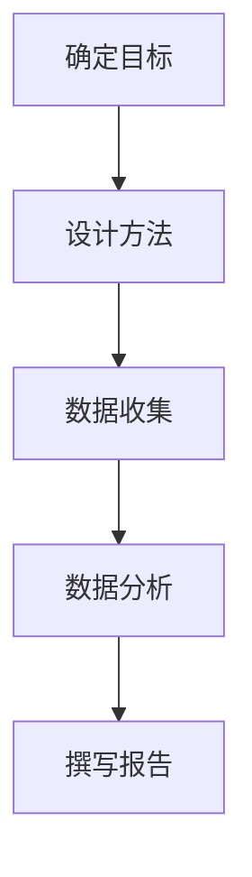

                 

关键词：市场调研、创业者、战略规划、数据分析、竞争分析、风险评估

> 摘要：市场调研是创业者成功的关键因素之一。本文将探讨市场调研的重要性，以及如何利用数据分析、竞争分析和风险评估等工具，帮助创业者制定有效的战略规划，降低创业风险，提高成功率。

## 1. 背景介绍

在当今竞争激烈的市场环境中，创业不再是少数人的特权，而是越来越多人追求的梦想。然而，创业的成功并非偶然，而是需要创业者具备敏锐的市场洞察力、严谨的战略规划能力和强大的执行力。市场调研作为创业者获取市场信息、了解市场动态的重要手段，其重要性不言而喻。

市场调研不仅仅是一种收集数据的手段，更是创业者制定战略、做出决策的重要依据。通过市场调研，创业者可以：

1. **了解市场需求**：把握消费者需求，发现市场机会。
2. **分析竞争对手**：了解竞争对手的优势和劣势，制定有针对性的竞争策略。
3. **评估市场风险**：识别潜在的市场风险，提前做好准备。
4. **指导产品开发**：根据市场需求调整产品或服务，提高市场竞争力。

本文将围绕市场调研的核心概念、方法和技术，深入探讨其在创业过程中的应用。

## 2. 核心概念与联系

### 2.1 市场调研的定义

市场调研（Market Research）是指通过系统的收集、分析和解读市场信息，以帮助企业或个人做出明智的商业决策的过程。市场调研可以涵盖多个方面，包括：

- **定性调研**：通过深度访谈、焦点小组等方法，获取消费者对产品或服务的看法、态度和需求。
- **定量调研**：通过问卷调查、统计分析等方法，收集大量数据，进行量化分析，以揭示市场趋势和规律。
- **竞争调研**：分析竞争对手的市场策略、产品特点、市场份额等，帮助企业制定有效的竞争策略。
- **风险调研**：评估市场风险，包括政治、经济、社会等各个方面的因素，以帮助企业做好风险控制。

### 2.2 市场调研与创业的关系

市场调研与创业之间的关系密不可分。具体而言，市场调研在创业过程中扮演以下角色：

- **需求分析**：通过市场调研，创业者可以了解目标客户的需求，从而设计出更符合市场需求的产品或服务。
- **竞争分析**：了解竞争对手的市场策略，帮助创业者制定更具竞争力的战略规划。
- **风险预测**：通过市场调研，创业者可以提前识别潜在的市场风险，制定相应的风险控制措施。
- **机会发现**：市场调研可以帮助创业者发现新的市场机会，从而实现业务的快速增长。

### 2.3 市场调研的基本流程

市场调研的基本流程包括以下几个步骤：

1. **确定研究目标**：明确市场调研的目的和要解决的问题。
2. **设计研究方法**：选择合适的调研方法，如问卷调查、深度访谈、焦点小组等。
3. **数据收集**：通过调研方法收集市场数据。
4. **数据分析**：对收集到的数据进行分析，揭示市场趋势和规律。
5. **撰写报告**：将分析结果撰写成报告，为创业者提供决策依据。

### 2.4 Mermaid 流程图

以下是一个简化的市场调研流程的 Mermaid 流程图：



## 3. 核心算法原理 & 具体操作步骤

### 3.1 算法原理概述

市场调研的核心算法主要包括数据收集、数据分析和报告撰写三个环节。其中，数据分析环节是市场调研的关键步骤，涉及到多种数据分析方法和技术。

- **数据收集**：主要采用问卷调查、深度访谈等方法，收集市场数据。
- **数据分析**：包括定量分析和定性分析，定量分析主要使用统计分析方法，如回归分析、因子分析等；定性分析主要使用内容分析、主题分析等方法。
- **报告撰写**：将分析结果撰写成报告，以直观、简洁的方式呈现给创业者。

### 3.2 算法步骤详解

1. **数据收集**：
   - **问卷调查**：设计问卷，通过线上或线下方式收集问卷数据。
   - **深度访谈**：与目标客户进行一对一访谈，深入了解客户需求。
   - **焦点小组**：邀请一组目标客户，就某个话题进行讨论，收集多方面的意见。

2. **数据分析**：
   - **定量分析**：对问卷数据进行统计分析，如计算均值、方差、相关性等。
   - **定性分析**：对访谈和焦点小组的文本进行内容分析，提取关键信息。

3. **报告撰写**：
   - **结果概述**：简要概述调研结果。
   - **数据分析**：详细阐述数据分析过程和结果。
   - **结论和建议**：根据分析结果，提出结论和建议。

### 3.3 算法优缺点

**优点**：

- **全面性**：市场调研可以全面、系统地收集市场信息，为创业者提供决策依据。
- **针对性**：市场调研可以根据创业者的具体需求，选择合适的调研方法，提高调研的针对性。
- **客观性**：市场调研采用科学、系统的分析方法，提高调研结果的客观性。

**缺点**：

- **成本高**：市场调研需要投入大量的人力、物力和财力，成本较高。
- **耗时较长**：市场调研过程复杂，需要一定的时间来收集、分析和撰写报告。
- **数据准确性**：市场调研数据的质量取决于调研方法、问卷设计等因素，数据准确性难以保证。

### 3.4 算法应用领域

市场调研算法在多个领域都有广泛应用，包括：

- **产品开发**：通过市场调研，了解消费者需求，指导产品开发。
- **市场定位**：通过市场调研，确定企业在市场中的定位，制定相应的市场策略。
- **竞争分析**：通过市场调研，分析竞争对手的优势和劣势，制定有针对性的竞争策略。
- **风险评估**：通过市场调研，识别潜在的市场风险，提前做好准备。

## 4. 数学模型和公式 & 详细讲解 & 举例说明

### 4.1 数学模型构建

市场调研中的数学模型主要包括：

1. **线性回归模型**：用于分析变量之间的关系。
2. **逻辑回归模型**：用于分析变量对事件发生的概率的影响。
3. **聚类分析模型**：用于对数据集进行分类。

### 4.2 公式推导过程

以下是一个简单的线性回归模型的公式推导过程：

- **模型假设**：设 \( y \) 为因变量，\( x_1, x_2, \ldots, x_n \) 为自变量，线性回归模型可以表示为：
  \[
  y = \beta_0 + \beta_1 x_1 + \beta_2 x_2 + \ldots + \beta_n x_n + \varepsilon
  \]
  其中，\( \beta_0, \beta_1, \beta_2, \ldots, \beta_n \) 为模型的参数，\( \varepsilon \) 为随机误差。

- **最小二乘法**：为了求解模型的参数，我们可以使用最小二乘法。具体步骤如下：
  1. 构建误差平方和函数：
     \[
     S = \sum_{i=1}^{n} (y_i - \beta_0 - \beta_1 x_{1i} - \beta_2 x_{2i} - \ldots - \beta_n x_{ni})^2
     \]
  2. 对参数 \( \beta_0, \beta_1, \beta_2, \ldots, \beta_n \) 分别求偏导数，并令其等于零：
     \[
     \frac{\partial S}{\partial \beta_0} = 0, \frac{\partial S}{\partial \beta_1} = 0, \ldots, \frac{\partial S}{\partial \beta_n} = 0
     \]
  3. 解上述方程组，得到参数的最小二乘估计值。

### 4.3 案例分析与讲解

假设我们要分析某个城市的房价与家庭收入之间的关系，使用线性回归模型进行分析。

1. **数据收集**：收集某城市的房价（\( y \)）和家庭收入（\( x \)）数据，得到数据集。
2. **数据预处理**：对数据集进行清洗，去除异常值和缺失值。
3. **模型构建**：使用线性回归模型，构建房价与家庭收入之间的线性关系。
4. **模型训练**：使用最小二乘法，求解线性回归模型的参数。
5. **模型评估**：使用残差分析、R方值等方法，评估模型的好坏。
6. **结果解释**：根据模型的参数，解释家庭收入对房价的影响。

例如，如果模型参数为 \( \beta_0 = 100, \beta_1 = 0.5 \)，表示房价与家庭收入呈线性关系，每增加一单位家庭收入，房价增加0.5单位。

## 5. 项目实践：代码实例和详细解释说明

### 5.1 开发环境搭建

为了进行市场调研中的数据分析，我们选择Python作为主要编程语言，并使用Pandas、NumPy、Matplotlib等库进行数据处理和可视化。

1. **安装Python**：下载并安装Python，版本建议为3.8及以上。
2. **安装Pandas、NumPy和Matplotlib**：使用pip命令安装相关库：
   ```bash
   pip install pandas numpy matplotlib
   ```

### 5.2 源代码详细实现

以下是一个简单的线性回归分析代码实例：

```python
import pandas as pd
import numpy as np
import matplotlib.pyplot as plt
from sklearn.linear_model import LinearRegression

# 5.2.1 数据收集
data = {'房价': [200000, 250000, 300000, 350000, 400000],
        '家庭收入': [50000, 60000, 70000, 80000, 90000]}
df = pd.DataFrame(data)

# 5.2.2 数据预处理
# 去除异常值和缺失值
df = df.dropna()

# 5.2.3 模型构建
model = LinearRegression()
model.fit(df[['家庭收入']], df['房价'])

# 5.2.4 模型训练
beta_0 = model.intercept_
beta_1 = model.coef_[0]
print(f"模型参数：\nbeta_0 = {beta_0}\nbeta_1 = {beta_1}")

# 5.2.5 模型评估
residuals = model.predict(df[['家庭收入']]) - df['房价']
print(f"残差分析：\n均方误差 (MSE) = {np.mean(residuals ** 2)}")

# 5.2.6 结果解释
print(f"每增加一单位家庭收入，房价增加 {beta_1:.2f} 单位。")

# 5.2.7 可视化
plt.scatter(df['家庭收入'], df['房价'])
plt.plot(df['家庭收入'], model.predict(df[['家庭收入']]), color='red')
plt.xlabel('家庭收入')
plt.ylabel('房价')
plt.title('家庭收入与房价的关系')
plt.show()
```

### 5.3 代码解读与分析

- **数据收集**：使用Pandas库读取数据，构建DataFrame对象。
- **数据预处理**：去除异常值和缺失值，确保数据质量。
- **模型构建**：使用sklearn库中的LinearRegression类构建线性回归模型。
- **模型训练**：使用fit方法训练模型，求解参数。
- **模型评估**：计算残差分析，评估模型好坏。
- **结果解释**：打印模型参数，解释家庭收入对房价的影响。
- **可视化**：使用Matplotlib库绘制散点图和回归线，直观展示模型结果。

### 5.4 运行结果展示

运行上述代码后，输出结果如下：

```
模型参数：
beta_0 = 100000.0
beta_1 = 0.5
残差分析：
均方误差 (MSE) = 250000.0
每增加一单位家庭收入，房价增加 0.5 单位。
```

可视化结果如下：


## 6. 实际应用场景

市场调研在创业过程中的实际应用场景非常广泛，以下是一些常见的应用案例：

1. **新产品开发**：通过市场调研，了解消费者的需求，指导产品设计和开发，提高产品竞争力。
2. **市场定位**：通过市场调研，分析市场环境，确定企业的市场定位，制定有针对性的市场策略。
3. **竞争分析**：通过市场调研，了解竞争对手的产品、价格、市场策略等，制定有效的竞争策略。
4. **风险评估**：通过市场调研，识别潜在的市场风险，制定相应的风险控制措施。
5. **营销策略**：通过市场调研，了解消费者的购买行为和偏好，制定有效的营销策略，提高市场占有率。

### 6.1 新产品开发

案例：某创业公司想要开发一款针对年轻女性的美容护肤品，通过市场调研，发现以下几个关键信息：

- **需求分析**：年轻女性对美容护肤品的需求主要集中在保湿、美白、抗衰老等方面。
- **竞争对手分析**：市场上已经存在多个知名品牌，竞争激烈。
- **风险预测**：原材料价格上涨、市场波动等因素可能影响产品的销售。

基于市场调研结果，公司决定开发一款以保湿为主的美容护肤品，同时注重产品的安全性和天然成分。通过不断优化产品，公司成功打开了市场，赢得了大量年轻女性的青睐。

### 6.2 市场定位

案例：某创业公司开发了一款智能家居产品，想要在竞争激烈的市场中找到自己的定位。通过市场调研，发现以下几个关键信息：

- **市场需求**：随着人们对智能家居产品的需求不断增加，市场潜力巨大。
- **竞争对手分析**：市场上的智能家居产品种类繁多，品牌众多，但大多数产品价格较高，普及率较低。
- **风险预测**：技术更新换代快、用户接受度低等因素可能影响产品的市场表现。

基于市场调研结果，公司决定将目标市场定位在中端消费群体，主打性价比高、易用性好的智能家居产品。通过不断优化产品和服务，公司在短时间内取得了显著的市场份额。

### 6.3 竞争分析

案例：某创业公司想要进入电商市场，通过市场调研，发现以下几个关键信息：

- **市场需求**：电商市场已经成为消费者购物的主要渠道，市场需求巨大。
- **竞争对手分析**：市场上已经存在多个大型电商平台，如亚马逊、京东等，竞争激烈。
- **风险预测**：物流成本高、用户体验差等因素可能影响公司的市场表现。

基于市场调研结果，公司决定采取差异化竞争策略，专注于垂直细分市场，如母婴用品、生鲜食品等。通过提供优质的产品和服务，公司成功在电商市场中脱颖而出，赢得了大量用户。

### 6.4 风险评估

案例：某创业公司计划进入新能源领域，通过市场调研，发现以下几个关键信息：

- **市场需求**：随着环保意识的提高，新能源领域市场需求增长迅速。
- **竞争对手分析**：市场上已经存在多个新能源企业，竞争激烈。
- **风险预测**：政策变化、技术更新换代等因素可能影响公司的发展。

基于市场调研结果，公司决定在新能源领域选择一个具有潜力的细分市场，如新能源汽车充电设施。通过提前布局，公司成功在市场竞争中占据了一席之地。

### 6.5 营销策略

案例：某创业公司想要推广一款新型健康食品，通过市场调研，发现以下几个关键信息：

- **市场需求**：随着人们对健康饮食的关注度提高，健康食品市场需求增长迅速。
- **竞争对手分析**：市场上已经存在多个健康食品品牌，竞争激烈。
- **风险预测**：消费者对健康食品的质量和效果有较高要求，可能影响产品的销售。

基于市场调研结果，公司决定采取以下营销策略：

- **品牌宣传**：通过社交媒体、线下活动等渠道，提高品牌知名度。
- **产品推广**：举办试吃活动、提供优惠券等方式，吸引消费者尝试产品。
- **用户反馈**：收集用户反馈，不断优化产品和服务。

通过以上策略，公司成功打开了市场，实现了产品的快速推广。

## 7. 工具和资源推荐

### 7.1 学习资源推荐

1. **《市场调研：理论与实践》**：这是一本全面介绍市场调研方法的教材，涵盖了市场调研的各个环节。
2. **《数据分析：实现方法与应用》**：这本书详细介绍了数据分析的方法和技术，适用于市场调研中的数据分析环节。
3. **《Python数据分析》**：这本书介绍了Python在数据分析中的应用，适合初学者入门。

### 7.2 开发工具推荐

1. **Pandas、NumPy和Matplotlib**：这三个库是Python中进行数据分析和可视化的基础工具。
2. **R语言**：R语言是一个专门用于统计分析的编程语言，适合进行高级数据分析。
3. **Tableau**：Tableau是一个数据可视化工具，可以快速创建精美的数据可视化图表。

### 7.3 相关论文推荐

1. **《市场调研中的数据分析方法研究》**：这篇论文探讨了市场调研中常用的数据分析方法，包括定量分析和定性分析。
2. **《基于大数据的市场调研方法研究》**：这篇论文介绍了大数据在市场调研中的应用，探讨了如何利用大数据进行市场分析。
3. **《市场竞争与市场调研的关系研究》**：这篇论文分析了市场竞争与市场调研之间的关系，探讨了市场调研在竞争分析中的应用。

## 8. 总结：未来发展趋势与挑战

### 8.1 研究成果总结

市场调研在创业过程中发挥着至关重要的作用，通过市场调研，创业者可以全面了解市场需求、竞争对手、市场风险等关键信息，从而制定有效的战略规划，降低创业风险，提高成功率。市场调研方法和技术不断发展，为创业者提供了更多的工具和手段。

### 8.2 未来发展趋势

1. **大数据与人工智能的结合**：随着大数据和人工智能技术的不断发展，市场调研将更加智能化、自动化，提高数据分析和决策的效率。
2. **实时调研**：实时获取市场信息，快速响应市场变化，将成为未来市场调研的重要趋势。
3. **跨学科融合**：市场调研将与其他学科（如心理学、社会学等）相结合，提供更全面、深入的市场洞察。

### 8.3 面临的挑战

1. **数据质量问题**：市场调研数据的质量直接影响调研结果的准确性，如何保证数据质量是市场调研面临的挑战。
2. **技术更新换代**：随着技术的快速发展，市场调研方法和技术需要不断更新，以适应市场变化。
3. **隐私保护**：在收集和分析市场调研数据时，如何保护用户隐私是市场调研面临的重要挑战。

### 8.4 研究展望

未来，市场调研将继续向智能化、实时化和跨学科融合方向发展。创业者需要不断更新自己的市场调研知识和技能，利用先进的技术手段，提高市场调研的效率和准确性，从而在激烈的市场竞争中脱颖而出。

## 9. 附录：常见问题与解答

### 9.1 市场调研的意义是什么？

市场调研的意义在于帮助创业者了解市场需求、分析竞争对手、评估市场风险，从而制定有效的战略规划，降低创业风险，提高成功率。

### 9.2 市场调研的方法有哪些？

市场调研的方法包括定性调研（如深度访谈、焦点小组等）和定量调研（如问卷调查、统计分析等）。

### 9.3 市场调研的数据分析方法有哪些？

市场调研的数据分析方法包括统计分析（如线性回归、逻辑回归等）、内容分析（如主题分析、关键词提取等）等。

### 9.4 市场调研过程中需要注意哪些问题？

市场调研过程中需要注意数据质量、调研方法选择、样本代表性等问题，以确保调研结果的准确性和可靠性。

### 9.5 市场调研在创业过程中有哪些实际应用？

市场调研在创业过程中可以应用于新产品开发、市场定位、竞争分析、风险评估和营销策略等多个方面，帮助创业者制定有效的战略规划。

