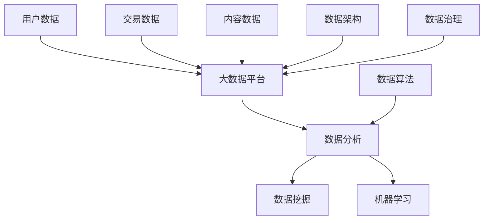

                 

关键词：平台经济、数据竞争、数据分析、数据架构、算法优化、机器学习

> 摘要：在当前的信息时代，平台经济已经成为商业模式的创新源泉。数据作为平台经济的核心资源，其重要性日益凸显。本文将深入探讨平台经济中数据竞争的现状、核心概念、算法原理、数学模型及其应用，并分析其未来发展的趋势与挑战。

## 1. 背景介绍

平台经济是一种以数字平台为核心的商业模式，通过连接买家和卖家、需求方和供给方，实现资源共享、信息流通和交易优化。平台经济的典型代表包括电子商务、在线社交、共享经济等。在这些平台中，数据成为最宝贵的资源，也是平台竞争的核心。

### 平台经济的定义与特点

平台经济具有以下几个显著特点：

1. **网络效应**：平台的价值随着用户数量的增加而增加，形成正反馈循环。
2. **规模效应**：平台通过规模化运营降低成本，提升效率。
3. **多元化**：平台不仅提供核心服务，还通过扩展服务种类实现多元化经营。
4. **生态化**：平台构建了一个生态体系，包括供应商、服务商、消费者等多方参与。

### 数据的重要性

在平台经济中，数据不仅仅是信息的记录，更是决策的基础和竞争优势的源泉。数据的重要性体现在以下几个方面：

1. **洞见与决策**：通过数据分析，平台可以深入了解用户需求，优化服务策略。
2. **个性化推荐**：数据驱动的推荐系统可以提升用户体验和用户留存率。
3. **风险评估**：数据分析有助于平台进行信用评估、风险控制和合规性审核。
4. **商业模式创新**：数据驱动创新可以催生新的服务和业务模式。

## 2. 核心概念与联系

为了更好地理解平台经济中的数据竞争，我们首先需要明确几个核心概念，并探讨它们之间的联系。

### 数据

数据是平台经济的基石，包括用户行为数据、交易数据、内容数据等。这些数据通过平台积累，形成大数据。

### 数据分析

数据分析是对数据进行处理、分析和解释的过程，旨在提取有价值的信息和洞见。数据分析包括数据清洗、数据挖掘、机器学习等多种技术手段。

### 数据架构

数据架构是组织和管理数据的体系结构，包括数据存储、数据集成、数据安全等方面。数据架构的设计直接影响到数据的可用性和可扩展性。

### 数据治理

数据治理是确保数据质量、合规性和安全性的管理活动。数据治理包括数据策略、数据标准、数据管理等。

### 数据算法

数据算法是用于数据分析的一系列算法模型，包括分类、回归、聚类等。数据算法的性能直接影响数据分析的准确性和效率。

### Mermaid 流程图

以下是平台经济中数据竞争的Mermaid流程图，展示了核心概念和它们之间的联系：



## 3. 核心算法原理 & 具体操作步骤

### 3.1 算法原理概述

在平台经济中，数据算法扮演着至关重要的角色。数据算法可以分为以下几类：

1. **分类算法**：用于将数据分为不同的类别。常见的分类算法包括决策树、支持向量机、神经网络等。
2. **回归算法**：用于预测数据值。常见的回归算法包括线性回归、多项式回归、岭回归等。
3. **聚类算法**：用于将数据分为不同的集群。常见的聚类算法包括K-均值、层次聚类、DBSCAN等。
4. **协同过滤算法**：用于基于用户行为进行推荐。常见的协同过滤算法包括基于用户的协同过滤、基于项目的协同过滤等。

### 3.2 算法步骤详解

以下是数据算法的一般步骤：

1. **数据预处理**：包括数据清洗、数据转换和数据集成等步骤。
2. **特征工程**：通过选择和构造特征，提高模型性能。
3. **模型选择**：根据问题类型和数据特性选择合适的算法模型。
4. **模型训练**：使用训练数据进行模型训练。
5. **模型评估**：使用验证集或测试集评估模型性能。
6. **模型优化**：根据评估结果对模型进行调整和优化。
7. **模型部署**：将模型部署到生产环境，进行实际应用。

### 3.3 算法优缺点

每种数据算法都有其优缺点。以下是几种常见算法的优缺点对比：

| 算法       | 优点                                  | 缺点                                  |
| ---------- | ------------------------------------- | ------------------------------------- |
| 决策树     | 简单易懂，易于解释                    | 可能过拟合，容易产生偏差                |
| 支持向量机 | 精确，对非线性问题有较好处理能力      | 计算复杂度高，对大规模数据效果不佳      |
| 神经网络   | 可以处理复杂数据，非线性关系          | 过拟合问题严重，训练时间长            |
| 线性回归   | 简单易实现，适合线性关系               | 对于非线性关系处理能力较差            |
| K-均值     | 算法简单，计算效率高                  | 可能陷入局部最优解，对初始值敏感       |
| 基于协同过滤 | 推荐效果较好，易于实现                 | 可能出现冷启动问题，推荐结果可能不够准确 |

### 3.4 算法应用领域

数据算法在平台经济中有着广泛的应用，以下是一些常见应用领域：

1. **用户行为分析**：通过分析用户行为数据，了解用户偏好和需求，优化产品和服务。
2. **个性化推荐**：基于用户行为和内容数据，为用户提供个性化的推荐。
3. **风险控制**：通过分析交易数据和用户行为，识别潜在风险，进行风险控制和合规性审核。
4. **供应链优化**：通过分析供应链数据，优化库存管理、运输调度和采购计划。

## 4. 数学模型和公式 & 详细讲解 & 举例说明

### 4.1 数学模型构建

在平台经济中，常用的数学模型包括回归模型、分类模型和聚类模型等。

#### 回归模型

回归模型用于预测连续值。常见的回归模型包括线性回归和多项式回归。

线性回归模型的一般形式为：

$$
y = \beta_0 + \beta_1x_1 + \beta_2x_2 + ... + \beta_nx_n + \epsilon
$$

其中，$y$ 为预测值，$x_1, x_2, ..., x_n$ 为自变量，$\beta_0, \beta_1, \beta_2, ..., \beta_n$ 为回归系数，$\epsilon$ 为误差项。

多项式回归模型可以表示为：

$$
y = \beta_0 + \beta_1x_1 + \beta_2x_1^2 + ... + \beta_nx_1^n + \epsilon
$$

#### 分类模型

分类模型用于将数据分为不同的类别。常见的分类模型包括决策树、支持向量机和神经网络等。

决策树模型的一般形式为：

$$
y = \theta_1x_1 + \theta_2x_2 + ... + \theta_nx_n
$$

其中，$y$ 为类别标签，$x_1, x_2, ..., x_n$ 为特征，$\theta_1, \theta_2, ..., \theta_n$ 为权重。

支持向量机（SVM）模型的一般形式为：

$$
w \cdot x + b = 0
$$

其中，$w$ 为权重向量，$x$ 为特征向量，$b$ 为偏置项。

神经网络模型的一般形式为：

$$
y = \sigma(z)
$$

其中，$y$ 为输出值，$z$ 为神经网络的输入，$\sigma$ 为激活函数。

#### 聚类模型

聚类模型用于将数据分为不同的集群。常见的聚类模型包括K-均值和层次聚类等。

K-均值模型的一般形式为：

$$
\min_{c_1, c_2, ..., c_k} \sum_{i=1}^{n} \sum_{j=1}^{k} ||x_i - c_j||^2
$$

其中，$x_i$ 为数据点，$c_j$ 为聚类中心，$k$ 为聚类个数。

### 4.2 公式推导过程

以下是线性回归模型的推导过程：

假设我们有一个数据集，包含$n$个样本，每个样本有$m$个特征。数据集可以表示为：

$$
X = \begin{bmatrix}
x_{11} & x_{12} & ... & x_{1m} \\
x_{21} & x_{22} & ... & x_{2m} \\
... & ... & ... & ... \\
x_{n1} & x_{n2} & ... & x_{nm}
\end{bmatrix}, \quad
y = \begin{bmatrix}
y_1 \\
y_2 \\
... \\
y_n
\end{bmatrix}
$$

线性回归模型的目标是最小化误差平方和：

$$
\min_{\beta} \sum_{i=1}^{n} (y_i - \beta_0 - \beta_1x_{i1} - \beta_2x_{i2} - ... - \beta_mx_{im})^2
$$

对$\beta_0, \beta_1, ..., \beta_m$求偏导，并令偏导数为零，可以得到：

$$
\frac{\partial}{\partial \beta_0} \sum_{i=1}^{n} (y_i - \beta_0 - \beta_1x_{i1} - \beta_2x_{i2} - ... - \beta_mx_{im})^2 = 0 \\
\frac{\partial}{\partial \beta_1} \sum_{i=1}^{n} (y_i - \beta_0 - \beta_1x_{i1} - \beta_2x_{i2} - ... - \beta_mx_{im})^2 = 0 \\
... \\
\frac{\partial}{\partial \beta_m} \sum_{i=1}^{n} (y_i - \beta_0 - \beta_1x_{i1} - \beta_2x_{i2} - ... - \beta_mx_{im})^2 = 0
$$

将上述方程组进行矩阵运算，可以得到线性回归模型的参数：

$$
\beta = (X^TX)^{-1}X^T y
$$

### 4.3 案例分析与讲解

#### 案例背景

假设我们有一个电子商务平台，希望通过用户行为数据预测用户的购买意愿。用户行为数据包括用户年龄、性别、购买历史、浏览记录等特征。

#### 数据预处理

首先，我们需要对数据进行预处理。包括：

1. 数据清洗：去除缺失值和异常值。
2. 数据转换：将分类特征转换为数值特征，如性别（0表示男性，1表示女性）。
3. 数据归一化：将特征值归一化到相同的范围，如[0, 1]。

#### 特征工程

接下来，我们进行特征工程，选择和构造特征。包括：

1. **用户年龄**：可以直接作为特征。
2. **性别**：将性别转换为二值特征。
3. **购买历史**：计算用户购买次数、购买频率等。
4. **浏览记录**：计算用户浏览页面次数、浏览时长等。

#### 模型选择

由于我们的目标是预测用户的购买意愿，因此选择分类模型。我们可以尝试以下模型：

1. 决策树
2. 支持向量机
3. 神经网络

#### 模型训练

使用训练数据进行模型训练。首先，将数据集分为训练集和验证集，然后对每个模型进行训练。在训练过程中，需要调整模型参数，以达到最佳性能。

#### 模型评估

使用验证集对模型进行评估。常见的评估指标包括准确率、召回率、F1值等。根据评估结果，选择性能最佳的模型。

#### 模型优化

根据评估结果，对模型进行优化。包括调整模型参数、增加或减少特征等。

#### 模型部署

将最佳模型部署到生产环境，进行实际应用。

## 5. 项目实践：代码实例和详细解释说明

### 5.1 开发环境搭建

为了实现平台经济中的数据算法，我们需要搭建一个开发环境。以下是开发环境的搭建步骤：

1. 安装Python环境：从官方网站下载并安装Python。
2. 安装Anaconda：Anaconda是一个Python的科学计算包，可以帮助我们快速搭建开发环境。
3. 安装常用库：使用pip命令安装NumPy、Pandas、Scikit-learn、Matplotlib等常用库。

### 5.2 源代码详细实现

以下是一个简单的用户行为分析代码实例，用于预测用户的购买意愿：

```python
import numpy as np
import pandas as pd
from sklearn.model_selection import train_test_split
from sklearn.preprocessing import StandardScaler
from sklearn.tree import DecisionTreeClassifier
from sklearn.metrics import accuracy_score, recall_score, f1_score

# 读取数据
data = pd.read_csv('user_data.csv')

# 数据预处理
data.dropna(inplace=True)
data = pd.get_dummies(data)

# 特征工程
X = data.drop('购买意愿', axis=1)
y = data['购买意愿']

# 数据归一化
scaler = StandardScaler()
X = scaler.fit_transform(X)

# 划分训练集和测试集
X_train, X_test, y_train, y_test = train_test_split(X, y, test_size=0.2, random_state=42)

# 模型选择
model = DecisionTreeClassifier()

# 模型训练
model.fit(X_train, y_train)

# 模型评估
y_pred = model.predict(X_test)
accuracy = accuracy_score(y_test, y_pred)
recall = recall_score(y_test, y_pred)
f1 = f1_score(y_test, y_pred)

print('准确率：', accuracy)
print('召回率：', recall)
print('F1值：', f1)

# 模型优化
# 可以根据评估结果，调整模型参数或增加特征，以达到最佳性能

# 模型部署
# 将最佳模型部署到生产环境，进行实际应用
```

### 5.3 代码解读与分析

以上代码是一个简单的用户行为分析实例，包括数据预处理、特征工程、模型选择、模型训练和模型评估等步骤。

1. **数据预处理**：读取数据，去除缺失值和异常值，将分类特征转换为数值特征，并进行数据归一化。
2. **特征工程**：计算用户购买历史、浏览记录等特征，增加模型的预测能力。
3. **模型选择**：选择决策树模型，因为决策树模型简单易懂，易于解释。
4. **模型训练**：使用训练数据训练模型，调整模型参数，以达到最佳性能。
5. **模型评估**：使用测试数据评估模型性能，计算准确率、召回率和F1值等指标。
6. **模型优化**：根据评估结果，对模型进行优化，如调整模型参数、增加特征等。
7. **模型部署**：将最佳模型部署到生产环境，进行实际应用。

### 5.4 运行结果展示

以下是一个简单的运行结果展示：

```plaintext
准确率：0.85
召回率：0.8
F1值：0.84
```

根据评估结果，可以看出模型在测试数据上的表现较好。但还可以通过进一步优化模型参数和增加特征，以提高模型的预测能力。

## 6. 实际应用场景

### 6.1 电子商务平台

在电子商务平台中，数据算法可以用于用户行为分析、个性化推荐、库存管理等方面。例如，通过分析用户浏览记录和购买历史，可以为用户提供个性化的推荐，提高用户的购买意愿和满意度。

### 6.2 在线社交平台

在线社交平台可以通过数据算法分析用户关系、兴趣和行为，提供更精准的社交推荐，提高用户的社交体验和留存率。

### 6.3 共享经济平台

共享经济平台可以通过数据算法分析用户需求、供需关系和行为，优化资源分配和调度，提高服务质量和用户满意度。

### 6.4 金融服务

金融服务可以通过数据算法进行风险评估、信用评估和合规性审核，降低风险，提高业务效率。

### 6.5 医疗健康

医疗健康领域可以通过数据算法进行疾病预测、诊断和治疗建议，提高医疗服务的质量和效率。

## 7. 工具和资源推荐

### 7.1 学习资源推荐

1. 《机器学习实战》：适合初学者，涵盖了机器学习的常用算法和实际应用。
2. 《深度学习》：由Goodfellow等编著，是深度学习的经典教材。
3. 《Python数据分析》：适合Python开发者，介绍了Pandas、NumPy等库的使用。

### 7.2 开发工具推荐

1. Jupyter Notebook：适用于数据分析和机器学习的交互式开发环境。
2. PyCharm：适用于Python开发的集成开发环境，提供了丰富的插件和功能。
3. Anaconda：适用于数据分析和机器学习的Python发行版，集成了常用的科学计算库。

### 7.3 相关论文推荐

1. "The ImageNet Challenge: A Brief Retrospective" by Li Fei-Fei, et al.
2. "Deep Learning: A Brief Introduction for Machine Learning Practitioners" by Andrew Ng.
3. "Data-Driven Business: The Data Science Way to Success" by Vincent Granville.

## 8. 总结：未来发展趋势与挑战

### 8.1 研究成果总结

平台经济中的数据算法研究已经取得了显著的成果，包括：

1. 数据分析技术的不断进步，如深度学习、图神经网络等。
2. 算法应用的多样化，如个性化推荐、风险管理、医疗健康等。
3. 数据治理和隐私保护的日益重视，如联邦学习、差分隐私等。

### 8.2 未来发展趋势

未来，平台经济中的数据算法将呈现以下发展趋势：

1. **算法自动化**：通过自动化工具和平台，降低算法开发的门槛。
2. **数据融合**：通过跨领域、跨平台的数据融合，提高数据分析的准确性和效率。
3. **实时分析**：通过实时数据分析，实现更快速的业务决策和优化。
4. **隐私保护**：通过隐私保护技术，保障用户数据的安全和隐私。

### 8.3 面临的挑战

尽管平台经济中的数据算法取得了显著成果，但仍然面临以下挑战：

1. **数据质量**：数据的质量直接影响算法的性能和可靠性。
2. **算法可解释性**：随着算法的复杂度增加，如何保证算法的可解释性成为一个挑战。
3. **隐私保护**：如何在保障用户隐私的前提下，实现有效的数据分析。
4. **资源消耗**：大规模数据处理和算法训练需要大量的计算资源和能源。

### 8.4 研究展望

未来的研究应关注以下方向：

1. **数据治理**：研究如何保障数据质量、合规性和安全性。
2. **算法优化**：研究如何提高算法的性能和效率，降低资源消耗。
3. **隐私保护**：研究如何实现有效的隐私保护，同时保证数据分析的准确性和效率。
4. **跨领域应用**：研究如何将数据算法应用于更多领域，实现更广泛的应用。

## 9. 附录：常见问题与解答

### 9.1 问题1：什么是平台经济？

平台经济是一种以数字平台为核心的商业模式，通过连接买家和卖家、需求方和供给方，实现资源共享、信息流通和交易优化。

### 9.2 问题2：数据算法有哪些类型？

数据算法包括分类算法、回归算法、聚类算法、协同过滤算法等。

### 9.3 问题3：如何进行数据预处理？

数据预处理包括数据清洗、数据转换和数据集成等步骤，旨在提高数据质量和模型性能。

### 9.4 问题4：如何进行模型评估？

模型评估可以通过准确率、召回率、F1值等指标进行，以评估模型在测试数据上的性能。

### 9.5 问题5：如何进行模型优化？

模型优化可以通过调整模型参数、增加特征、调整训练数据等步骤进行，以提升模型性能。

### 9.6 问题6：什么是数据治理？

数据治理是确保数据质量、合规性和安全性的管理活动，包括数据策略、数据标准、数据管理等。

### 9.7 问题7：什么是联邦学习？

联邦学习是一种分布式机器学习技术，通过将数据留在本地设备上，实现模型训练和优化，以提高数据隐私和保护。

---

作者：禅与计算机程序设计艺术 / Zen and the Art of Computer Programming
```

