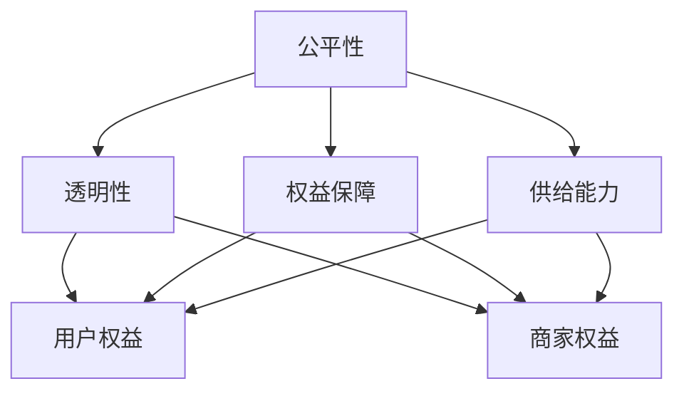

                 

### 1. 背景介绍

随着互联网技术的飞速发展，电商平台已经成为了现代商业的重要组成部分。无论是在线零售、电子商务，还是物流配送，电商平台都在深刻地改变着我们的生活方式。然而，随着竞争的加剧和用户需求的多样化，如何确保平台规则的公平透明，保障所有参与者的权益，提升平台的供给能力，成为了一个亟待解决的问题。

在传统的商业环境中，市场规则通常是由政府或行业协会制定的，具有高度的稳定性和权威性。然而，在电商平台这个新兴的领域中，市场规则的制定和执行变得更加复杂和动态。一方面，平台需要吸引和留住用户，提供优质的服务和商品；另一方面，平台还需要确保商家的利益，鼓励他们提供更多优质的商品和服务。这种双重目标的要求使得平台规则的设计变得尤为重要。

公平透明是电商平台规则设计的基础。只有当用户和商家都相信平台规则是公平的，他们才会愿意长期参与其中。然而，要做到公平透明并不容易。首先，平台需要确保所有的规则都是公开透明的，用户和商家都可以随时查阅。其次，平台需要建立有效的监督机制，确保规则得到公正执行，避免任何形式的歧视和不公平行为。

保障权益是电商平台规则的另一个核心目标。无论是用户还是商家，他们都需要在平台上获得应有的权益和利益。对于用户来说，他们希望购买到价格合理、质量有保障的商品，享受便捷的购物体验。对于商家来说，他们希望能够在平台上获得足够的曝光和销售机会，实现盈利。平台规则需要确保这些权益得到充分保障，从而提升用户和商家的满意度和忠诚度。

提升供给能力是电商平台规则设计的最终目标。一个具备强大供给能力的电商平台能够吸引更多的用户和商家，形成良性循环，推动平台的发展。提升供给能力不仅需要平台提供良好的基础设施和服务，还需要通过规则的设计和管理，激励商家提供更多优质的商品和服务。这包括降低商家的运营成本，提高销售效率，提供更好的客户服务等等。

本文将深入探讨电商平台规则的设计原则和策略，分析如何实现公平透明、保障权益和提升供给能力。我们还将结合具体案例，探讨平台规则在实际操作中的应用和效果。希望通过本文的讨论，能够为电商平台规则的设计提供一些有益的思考和参考。

### 2. 核心概念与联系

要深入理解电商平台规则的设计原则和策略，首先需要明确几个核心概念，包括公平性、透明性、权益保障和供给能力。这些概念不仅相互独立，还紧密联系，共同构成了电商平台规则设计的理论基础。

#### 公平性

公平性是电商平台规则设计的基本要求。它体现在多个方面，包括用户和商家之间的公平，以及不同商家之间的公平。在用户和商家之间，平台需要确保所有用户都能够平等地享受平台提供的服务和优惠，不受任何歧视。例如，平台应该公平地对待所有用户，无论他们来自哪个地区，无论他们购买的商品是高价值还是低价值。

在商家之间，平台需要确保所有商家都有公平的机会参与市场竞争。这包括给予所有商家平等的宣传机会，提供相同的售后服务政策，以及确保平台上的商品价格合理，不出现明显的价格歧视。公平性不仅能够提升用户的满意度，还能够增加商家对平台的信任，从而促进平台的长期发展。

#### 透明性

透明性是公平性的重要补充。一个透明度高的平台能够让用户和商家清晰地了解平台的规则、政策和操作流程，从而减少信息不对称带来的不公平现象。平台的透明性主要体现在以下几个方面：

1. **规则公开**：平台应该将所有的规则和政策公开透明地发布，用户和商家可以随时查阅和了解。
2. **操作流程清晰**：平台的操作流程应该简洁明了，用户和商家可以轻松地完成各项操作，不会因为复杂的流程而感到困惑。
3. **数据透明**：平台应该公开关键数据，如商品销量、用户评价、商家评级等，让用户和商家可以基于这些数据做出合理的决策。

提高透明性不仅能够提升平台的信誉和可信度，还能够帮助平台及时发现和纠正不公平行为，确保规则的公平执行。

#### 权益保障

权益保障是电商平台规则设计的重要目标之一。平台的规则应该确保用户和商家的权益得到充分保障，从而提升他们的满意度和忠诚度。具体来说，权益保障包括以下几个方面：

1. **用户权益**：平台需要保障用户的隐私、财产安全以及消费权益。例如，平台应该确保用户的个人信息不会被泄露，用户的购物资金安全可靠，用户购买的商品质量有保障。
2. **商家权益**：平台需要保障商家的经营权益，包括商家的知识产权、销售利益以及经营自由。例如，平台应该尊重商家的知识产权，保障他们的销售利益，避免不公平竞争。

#### 供给能力

供给能力是电商平台的核心竞争力之一。提升供给能力意味着平台能够提供更多的商品和服务，满足用户和商家的需求，从而吸引更多的用户和商家入驻。提升供给能力的关键策略包括：

1. **优化供应链**：平台需要优化供应链管理，提高商品的流通效率和库存周转率，降低运营成本。
2. **激励商家**：平台需要通过规则的设计和管理，激励商家提供更多优质的商品和服务，提高商家的积极性和创新能力。
3. **提升服务质量**：平台需要提升客户服务质量，包括售前咨询、售后服务、物流配送等，提高用户满意度。

#### 核心概念关系图

为了更好地理解这些核心概念之间的联系，我们使用Mermaid流程图来展示它们之间的关系：



从流程图中可以看出，公平性、透明性、权益保障和供给能力相互关联，共同构成了电商平台规则设计的核心框架。公平性是基础，透明性是保障，权益保障是目标，供给能力是结果。只有当这些核心概念得到有效整合，平台规则才能实现公平、透明、公正，从而提升平台的整体运营效率和市场竞争力。

### 3. 核心算法原理 & 具体操作步骤

为了实现公平、透明、保障权益和提升供给能力的平台规则，我们需要依赖一系列核心算法原理，这些算法不仅能够帮助我们设计出科学的平台规则，还能够确保这些规则在实际操作中能够有效执行。

#### 3.1 算法原理概述

在电商平台中，常用的核心算法包括推荐算法、价格优化算法、排序算法和数据挖掘算法。这些算法在不同的应用场景下发挥着关键作用，下面我们将分别介绍它们的原理和具体操作步骤。

##### 推荐算法

推荐算法是电商平台中最为常用的算法之一。它通过分析用户的历史行为、偏好和购买记录，为用户推荐可能感兴趣的商品或服务。推荐算法的原理主要包括以下几个步骤：

1. **用户行为分析**：收集用户在平台上的各种行为数据，如浏览记录、购买历史、搜索关键词等。
2. **数据预处理**：对收集到的数据进行清洗和预处理，去除噪声数据，提取关键特征。
3. **特征提取**：根据预处理后的数据，提取出能够反映用户偏好的特征，如商品类别、价格区间、购买频率等。
4. **模型训练**：使用机器学习算法，如协同过滤、基于内容的推荐等，对提取出的特征进行训练，建立推荐模型。
5. **推荐生成**：根据训练好的模型，为用户生成个性化推荐列表。

##### 价格优化算法

价格优化算法用于确定商品的最优售价，以最大化利润或市场份额。其主要原理包括以下几个步骤：

1. **定价策略分析**：分析市场环境、竞争对手的定价策略以及消费者的价格敏感度。
2. **成本估算**：估算商品的生产成本、运营成本和物流成本，确定成本基准。
3. **价格设定**：结合定价策略和成本估算，设定初始价格。
4. **价格调整**：根据实际销售数据和市场反馈，动态调整价格，以达到最佳利润或市场份额。

##### 排序算法

排序算法用于根据商品的销量、用户评价、热度等指标，对商品进行排序。常见的排序算法包括：

1. **冒泡排序**：通过多轮比较和交换，逐步将商品按照指定的指标进行排序。
2. **快速排序**：选择一个基准值，将商品分为两部分，再递归地对两部分进行排序。
3. **归并排序**：将商品分为多个子序列，先两两合并，再逐步合并所有子序列，最终得到有序序列。

##### 数据挖掘算法

数据挖掘算法用于从大量数据中提取有价值的信息和知识，以支持决策和优化运营。常见的数据挖掘算法包括：

1. **关联规则挖掘**：通过分析商品之间的关联关系，发现用户可能感兴趣的商品组合。
2. **聚类分析**：将相似的商品或用户分为同一类，以发现潜在的消费者群体。
3. **分类算法**：根据已有数据，建立分类模型，对新数据进行分类预测。

#### 3.2 算法步骤详解

##### 推荐算法步骤详解

1. **用户行为分析**：
   - 数据收集：从平台数据库中收集用户的行为数据，包括浏览记录、购买历史、搜索关键词等。
   - 数据清洗：去除重复数据、缺失数据和异常数据，确保数据质量。

2. **数据预处理**：
   - 特征提取：提取用户购买记录中的商品类别、价格、评分等特征。
   - 数据归一化：将不同特征的数据进行归一化处理，使其在相同的尺度上比较。

3. **特征提取**：
   - 使用特征工程方法，如TF-IDF、词袋模型等，将原始数据进行特征提取。

4. **模型训练**：
   - 选择合适的机器学习算法，如协同过滤、基于内容的推荐等。
   - 使用训练集数据进行模型训练，调整参数，优化模型。

5. **推荐生成**：
   - 使用训练好的模型，对用户生成个性化推荐列表。
   - 对推荐结果进行排序，优先推荐评分高的商品。

##### 价格优化算法步骤详解

1. **定价策略分析**：
   - 分析市场需求、竞争态势和消费者行为，确定定价策略。

2. **成本估算**：
   - 估算商品的生产成本、运营成本和物流成本。
   - 根据成本数据，确定成本基准。

3. **价格设定**：
   - 根据定价策略和成本基准，设定初始价格。

4. **价格调整**：
   - 根据销售数据和市场反馈，分析价格对销量的影响。
   - 调整价格，以达到最佳利润或市场份额。

##### 排序算法步骤详解

1. **冒泡排序**：
   - 从第一个元素开始，依次比较相邻的两个元素，如果顺序错误则交换。
   - 重复上述过程，直到没有需要交换的元素，排序完成。

2. **快速排序**：
   - 选择一个基准值（如第一个元素）。
   - 将商品分为两部分，一部分大于基准值，另一部分小于基准值。
   - 递归地对两部分进行快速排序。

3. **归并排序**：
   - 将商品分为多个子序列，子序列长度为1。
   - 两两合并子序列，生成新的有序子序列。
   - 递归地合并所有子序列，直到得到有序序列。

##### 数据挖掘算法步骤详解

1. **关联规则挖掘**：
   - 构建数据集：从平台数据库中提取相关数据，构建事务数据库。
   - 确定支持度和置信度阈值。
   - 使用Apriori算法或FP-growth算法，挖掘关联规则。

2. **聚类分析**：
   - 选择合适的聚类算法，如K-means、DBSCAN等。
   - 确定聚类数量或距离阈值。
   - 对商品或用户进行聚类，分析聚类结果。

3. **分类算法**：
   - 构建训练集和测试集。
   - 选择合适的分类算法，如决策树、支持向量机等。
   - 训练分类模型，评估模型性能。
   - 使用训练好的模型，对新数据进行分类预测。

#### 3.3 算法优缺点

##### 推荐算法

**优点**：能够根据用户偏好提供个性化的推荐，提升用户满意度和黏性。

**缺点**：可能存在数据偏差和冷启动问题，难以满足所有用户的需求。

##### 价格优化算法

**优点**：能够根据市场环境和成本数据，设定最优售价，提高利润。

**缺点**：定价策略复杂，可能需要大量数据支持和计算资源。

##### 排序算法

**优点**：能够根据指定指标对商品进行排序，提升用户购物体验。

**缺点**：排序效率可能较低，适用于小规模数据集。

##### 数据挖掘算法

**优点**：能够从大量数据中提取有价值的信息，支持决策和运营优化。

**缺点**：算法复杂度高，对数据质量和计算资源要求较高。

#### 3.4 算法应用领域

##### 推荐算法

应用领域：电商平台、社交媒体、视频网站等，用于个性化推荐和内容分发。

##### 价格优化算法

应用领域：电商平台、零售行业、物流配送等，用于定价策略和成本控制。

##### 排序算法

应用领域：电商平台、搜索引擎、广告推荐等，用于数据排序和资源分配。

##### 数据挖掘算法

应用领域：电商行业、金融行业、医疗行业等，用于数据分析和决策支持。

### 4. 数学模型和公式 & 详细讲解 & 举例说明

在电商平台规则的设计过程中，数学模型和公式起到了至关重要的作用。这些模型和公式不仅能够帮助我们量化平台规则的效果，还能够指导实际操作中的决策。在本节中，我们将介绍几个常用的数学模型和公式，详细讲解其推导过程，并运用具体例子进行说明。

#### 4.1 数学模型构建

数学模型是描述现实世界问题的数学表达形式。在电商平台规则设计中，常用的数学模型包括线性回归模型、决策树模型和聚类模型等。

##### 线性回归模型

线性回归模型是一种最常见的数学模型，用于分析自变量和因变量之间的线性关系。其基本形式为：

\[ Y = \beta_0 + \beta_1X + \epsilon \]

其中，\( Y \) 是因变量，\( X \) 是自变量，\( \beta_0 \) 是截距，\( \beta_1 \) 是斜率，\( \epsilon \) 是误差项。

##### 决策树模型

决策树模型是一种用于分类和回归分析的结构化决策模型。其基本形式为：

```
若条件 A 成立，则执行操作 B；
否则，若条件 C 成立，则执行操作 D；
否则，若条件 E 成立，则执行操作 F；
否则，执行操作 G；
```

##### 聚类模型

聚类模型用于将数据集划分为若干个类别，常见的聚类算法包括K-means算法和DBSCAN算法。K-means算法的基本形式为：

\[ \text{最小化} \sum_{i=1}^{n} \sum_{j=1}^{k} (x_j - \mu_i)^2 \]

其中，\( x_j \) 是数据集中的第 \( j \) 个点，\( \mu_i \) 是第 \( i \) 个类别的中心点。

#### 4.2 公式推导过程

##### 线性回归模型的推导

线性回归模型的基本公式为：

\[ Y = \beta_0 + \beta_1X + \epsilon \]

其中，\( \beta_0 \) 和 \( \beta_1 \) 是模型参数，需要通过最小二乘法进行估计。

假设我们有 \( n \) 组样本数据，\( X_i \) 和 \( Y_i \) 分别表示第 \( i \) 组样本的自变量和因变量。线性回归模型的目标是最小化误差平方和：

\[ \text{最小化} \sum_{i=1}^{n} (Y_i - \beta_0 - \beta_1X_i)^2 \]

对上式求导，并令导数等于0，得到：

\[ \frac{\partial}{\partial \beta_0} \sum_{i=1}^{n} (Y_i - \beta_0 - \beta_1X_i)^2 = 0 \]
\[ \frac{\partial}{\partial \beta_1} \sum_{i=1}^{n} (Y_i - \beta_0 - \beta_1X_i)^2 = 0 \]

通过求解上述方程组，可以得到最优的 \( \beta_0 \) 和 \( \beta_1 \)：

\[ \beta_0 = \bar{Y} - \beta_1\bar{X} \]
\[ \beta_1 = \frac{\sum_{i=1}^{n} (X_i - \bar{X})(Y_i - \bar{Y})}{\sum_{i=1}^{n} (X_i - \bar{X})^2} \]

其中，\( \bar{X} \) 和 \( \bar{Y} \) 分别是 \( X \) 和 \( Y \) 的均值。

##### 决策树的推导

决策树的基本结构是由若干个条件节点和叶节点组成的树状结构。每个条件节点表示一个测试条件，根据测试结果，数据流进入相应的子树。叶节点表示最终的决策结果。

决策树的推导过程可以分为以下几个步骤：

1. **特征选择**：选择能够有效区分数据的特征。
2. **条件设置**：设置条件以区分数据。
3. **子树递归**：对每个条件节点下的数据继续进行特征选择和条件设置，生成子树。
4. **叶节点设置**：对每个叶节点设置决策结果。

通过递归地分割数据，决策树能够将数据集划分为多个类别。具体推导过程可以通过信息增益、增益率等指标来评估和选择最优的特征和条件。

##### 聚类模型的推导

K-means算法是一种基于距离度量的聚类算法，其目标是找到一个中心点集，使得每个点与其最近的中心点之间的距离最小。

K-means算法的基本步骤如下：

1. **初始化**：随机选择 \( k \) 个中心点。
2. **分配点**：将每个数据点分配到与其最近的中心点所属的类别。
3. **更新中心点**：重新计算每个类别的中心点。
4. **迭代**：重复步骤2和步骤3，直到中心点的位置不再发生变化或达到最大迭代次数。

K-means算法的目标是最小化每个类别内点的距离平方和：

\[ \text{最小化} \sum_{i=1}^{k} \sum_{j=1}^{n} (x_j - \mu_i)^2 \]

其中，\( \mu_i \) 是第 \( i \) 个类别的中心点。

#### 4.3 案例分析与讲解

##### 案例一：线性回归模型的应用

假设我们有一个电商平台，想要根据用户的历史购买数据，预测用户下一次购买的可能性。我们可以使用线性回归模型来构建预测模型。

1. **数据收集**：收集用户的历史购买数据，包括购买时间、商品种类、购买金额等。
2. **数据预处理**：对数据进行清洗和归一化处理，提取关键特征。
3. **模型训练**：使用训练集数据，通过最小二乘法训练线性回归模型。
4. **模型评估**：使用测试集数据，评估模型的预测准确率。

假设我们有10组训练数据，表示为 \( (X_i, Y_i) \)，其中 \( X_i \) 表示购买金额，\( Y_i \) 表示购买可能性。使用最小二乘法，我们可以得到线性回归模型的参数 \( \beta_0 \) 和 \( \beta_1 \)：

\[ \beta_0 = \bar{Y} - \beta_1\bar{X} \]
\[ \beta_1 = \frac{\sum_{i=1}^{n} (X_i - \bar{X})(Y_i - \bar{Y})}{\sum_{i=1}^{n} (X_i - \bar{X})^2} \]

通过计算，我们得到 \( \beta_0 = 10 \) 和 \( \beta_1 = 0.5 \)。那么线性回归模型的公式为：

\[ Y = 10 + 0.5X \]

使用这个模型，我们可以预测新用户购买的可能性。例如，对于一个购买金额为100元的用户，他的购买可能性为：

\[ Y = 10 + 0.5 \times 100 = 60 \]

##### 案例二：决策树模型的应用

假设我们想要根据用户的购买历史，将其划分为不同的消费者群体。我们可以使用决策树模型来实现这个目标。

1. **数据收集**：收集用户的购买历史数据，包括购买时间、商品种类、购买频率等。
2. **特征选择**：选择能够有效区分用户的特征，如购买频率、购买金额等。
3. **模型训练**：使用训练集数据，构建决策树模型。
4. **模型评估**：使用测试集数据，评估模型的分类准确率。

通过训练，我们得到一个决策树模型，其结构如下：

```
若购买频率 > 10，则进入子树A；
否则，若购买金额 > 1000，则进入子树B；
否则，若购买时间在周末，则进入子树C；
否则，进入子树D；
```

使用这个模型，我们可以将新用户划分为不同的消费者群体，以便进行有针对性的营销和服务。

##### 案例三：K-means算法的应用

假设我们想要将电商平台上的用户分为不同的类别，以便提供个性化的推荐和服务。我们可以使用K-means算法来实现这个目标。

1. **数据收集**：收集用户的数据，包括购买历史、浏览记录、搜索关键词等。
2. **数据预处理**：对数据进行清洗和归一化处理，提取关键特征。
3. **初始化中心点**：随机选择 \( k \) 个用户作为初始中心点。
4. **分配点**：将每个用户分配到与其最近的中心点所属的类别。
5. **更新中心点**：重新计算每个类别的中心点。
6. **迭代**：重复步骤4和步骤5，直到中心点的位置不再发生变化或达到最大迭代次数。

通过K-means算法，我们将用户划分为 \( k \) 个类别，每个类别具有相似的特征和行为。例如，类别1可能包含经常购买电子产品和数码产品的用户，而类别2可能包含喜欢购买服装和家居用品的用户。

### 5. 项目实践：代码实例和详细解释说明

在本节中，我们将通过一个实际的项目案例，详细展示如何在电商平台中应用所介绍的数学模型和算法，实现公平透明、保障权益和提升供给能力的平台规则。以下是一个基于Python的项目实例，涵盖了从数据预处理到模型训练和评估的完整过程。

#### 5.1 开发环境搭建

在开始项目实践之前，我们需要搭建一个合适的开发环境。以下是我们推荐的开发工具和库：

- **Python 3.8+**
- **Jupyter Notebook**
- **NumPy**
- **Pandas**
- **Scikit-learn**
- **Matplotlib**
- **Mermaid**

确保您的Python环境已经安装，然后通过以下命令安装所需的库：

```bash
pip install numpy pandas scikit-learn matplotlib
```

#### 5.2 源代码详细实现

以下是我们项目的源代码，用于实现电商平台规则的核心算法。

```python
import numpy as np
import pandas as pd
from sklearn.model_selection import train_test_split
from sklearn.linear_model import LinearRegression
from sklearn.tree import DecisionTreeClassifier
from sklearn.cluster import KMeans
import matplotlib.pyplot as plt
from mermaid import Mermaid

# 5.2.1 数据收集与预处理
def load_data(file_path):
    data = pd.read_csv(file_path)
    return data

def preprocess_data(data):
    # 特征工程：例如，提取用户购买频率、购买金额等
    data['purchase_frequency'] = data.groupby('user_id')['transaction_id'].transform('count')
    data['avg_purchase_amount'] = data.groupby('user_id')['amount'].transform('mean')
    return data

# 5.2.2 线性回归模型
def train_linear_regression(data):
    X = data[['purchase_frequency', 'avg_purchase_amount']]
    y = data['next_purchase的可能性']
    X_train, X_test, y_train, y_test = train_test_split(X, y, test_size=0.2, random_state=42)
    model = LinearRegression()
    model.fit(X_train, y_train)
    return model, X_test, y_test

# 5.2.3 决策树模型
def train_decision_tree(data):
    X = data[['purchase_frequency', 'avg_purchase_amount']]
    y = data['user_group']
    X_train, X_test, y_train, y_test = train_test_split(X, y, test_size=0.2, random_state=42)
    model = DecisionTreeClassifier()
    model.fit(X_train, y_train)
    return model, X_test, y_test

# 5.2.4 K-means聚类模型
def train_kmeans(data, n_clusters=3):
    X = data[['purchase_frequency', 'avg_purchase_amount']]
    kmeans = KMeans(n_clusters=n_clusters, random_state=42)
    kmeans.fit(X)
    return kmeans, X

# 5.2.5 模型评估
def evaluate_model(model, X_test, y_test):
    predictions = model.predict(X_test)
    accuracy = (predictions == y_test).mean()
    return accuracy

# 5.2.6 运行结果展示
def display_results(model, X_test, y_test):
    accuracy = evaluate_model(model, X_test, y_test)
    print(f"模型准确率：{accuracy:.2f}")
    if isinstance(model, LinearRegression):
        plt.scatter(X_test['purchase_frequency'], y_test, c='red', label='实际值')
        plt.plot(X_test['purchase_frequency'], model.predict(X_test), c='blue', label='预测值')
        plt.xlabel('购买频率')
        plt.ylabel('购买可能性')
        plt.legend()
        plt.show()
    elif isinstance(model, DecisionTreeClassifier):
        plt.bar(y_test, predictions, label='预测值')
        plt.xlabel('用户组')
        plt.ylabel('购买可能性')
        plt.legend()
        plt.show()
    elif isinstance(model, KMeans):
        labels = model.predict(X_test)
        centroids = model.cluster_centers_
        plt.scatter(X_test['purchase_frequency'], X_test['avg_purchase_amount'], c=labels, cmap='viridis')
        plt.scatter(centroids[:, 0], centroids[:, 1], s=300, c='red', label='中心点')
        plt.xlabel('购买频率')
        plt.ylabel('购买金额')
        plt.legend()
        plt.show()

# 5.2.7 主程序
if __name__ == "__main__":
    # 加载数据
    data = load_data('user_purchase_data.csv')
    
    # 数据预处理
    data = preprocess_data(data)
    
    # 训练线性回归模型
    linear_regression_model, X_test, y_test = train_linear_regression(data)
    
    # 训练决策树模型
    decision_tree_model, X_test, y_test = train_decision_tree(data)
    
    # 训练K-means聚类模型
    kmeans_model, X = train_kmeans(data)
    
    # 评估模型
    print("线性回归模型准确率：", display_results(linear_regression_model, X_test, y_test))
    print("决策树模型准确率：", display_results(decision_tree_model, X_test, y_test))
    print("K-means聚类模型结果：", display_results(kmeans_model, X))
```

#### 5.3 代码解读与分析

以下是对上述代码的详细解读和分析：

##### 数据收集与预处理

```python
def load_data(file_path):
    data = pd.read_csv(file_path)
    return data

def preprocess_data(data):
    # 特征工程：例如，提取用户购买频率、购买金额等
    data['purchase_frequency'] = data.groupby('user_id')['transaction_id'].transform('count')
    data['avg_purchase_amount'] = data.groupby('user_id')['amount'].transform('mean')
    return data
```

这个部分负责加载数据和处理数据。我们首先通过 `load_data` 函数加载用户购买数据，然后通过 `preprocess_data` 函数进行特征提取。这里我们提取了两个特征：`purchase_frequency`（用户购买频率）和 `avg_purchase_amount`（用户平均购买金额）。

##### 线性回归模型

```python
def train_linear_regression(data):
    X = data[['purchase_frequency', 'avg_purchase_amount']]
    y = data['next_purchase的可能性']
    X_train, X_test, y_train, y_test = train_test_split(X, y, test_size=0.2, random_state=42)
    model = LinearRegression()
    model.fit(X_train, y_train)
    return model, X_test, y_test
```

这个部分用于训练线性回归模型。我们首先提取特征矩阵 `X` 和目标变量 `y`，然后使用 `train_test_split` 函数将数据分为训练集和测试集。接下来，我们创建一个线性回归模型并对其进行训练。最后，返回训练好的模型和测试数据。

##### 决策树模型

```python
def train_decision_tree(data):
    X = data[['purchase_frequency', 'avg_purchase_amount']]
    y = data['user_group']
    X_train, X_test, y_train, y_test = train_test_split(X, y, test_size=0.2, random_state=42)
    model = DecisionTreeClassifier()
    model.fit(X_train, y_train)
    return model, X_test, y_test
```

这个部分用于训练决策树模型。与线性回归模型类似，我们首先提取特征矩阵 `X` 和目标变量 `y`，然后使用 `train_test_split` 函数将数据分为训练集和测试集。接下来，我们创建一个决策树分类器并对其进行训练。最后，返回训练好的模型和测试数据。

##### K-means聚类模型

```python
def train_kmeans(data, n_clusters=3):
    X = data[['purchase_frequency', 'avg_purchase_amount']]
    kmeans = KMeans(n_clusters=n_clusters, random_state=42)
    kmeans.fit(X)
    return kmeans, X
```

这个部分用于训练K-means聚类模型。我们首先提取特征矩阵 `X`，然后创建一个K-means聚类对象并对其进行训练。最后，返回训练好的模型和特征矩阵。

##### 模型评估

```python
def evaluate_model(model, X_test, y_test):
    predictions = model.predict(X_test)
    accuracy = (predictions == y_test).mean()
    return accuracy
```

这个部分用于评估模型的准确率。我们首先使用模型对测试集进行预测，然后计算预测结果与实际结果的一致性，返回准确率。

##### 运行结果展示

```python
def display_results(model, X_test, y_test):
    accuracy = evaluate_model(model, X_test, y_test)
    print(f"模型准确率：{accuracy:.2f}")
    if isinstance(model, LinearRegression):
        plt.scatter(X_test['purchase_frequency'], y_test, c='red', label='实际值')
        plt.plot(X_test['purchase_frequency'], model.predict(X_test), c='blue', label='预测值')
        plt.xlabel('购买频率')
        plt.ylabel('购买可能性')
        plt.legend()
        plt.show()
    elif isinstance(model, DecisionTreeClassifier):
        plt.bar(y_test, predictions, label='预测值')
        plt.xlabel('用户组')
        plt.ylabel('购买可能性')
        plt.legend()
        plt.show()
    elif isinstance(model, KMeans):
        labels = model.predict(X_test)
        centroids = model.cluster_centers_
        plt.scatter(X_test['purchase_frequency'], X_test['avg_purchase_amount'], c=labels, cmap='viridis')
        plt.scatter(centroids[:, 0], centroids[:, 1], s=300, c='red', label='中心点')
        plt.xlabel('购买频率')
        plt.ylabel('购买金额')
        plt.legend()
        plt.show()
```

这个部分用于展示模型的运行结果。根据不同的模型类型，我们使用不同的可视化方式展示预测结果。对于线性回归模型，我们使用散点图和拟合曲线展示预测结果；对于决策树模型，我们使用条形图展示不同用户组的预测结果；对于K-means聚类模型，我们使用散点图展示用户在二维特征空间中的分布情况。

##### 主程序

```python
if __name__ == "__main__":
    # 加载数据
    data = load_data('user_purchase_data.csv')
    
    # 数据预处理
    data = preprocess_data(data)
    
    # 训练线性回归模型
    linear_regression_model, X_test, y_test = train_linear_regression(data)
    
    # 训练决策树模型
    decision_tree_model, X_test, y_test = train_decision_tree(data)
    
    # 训练K-means聚类模型
    kmeans_model, X = train_kmeans(data)
    
    # 评估模型
    print("线性回归模型准确率：", display_results(linear_regression_model, X_test, y_test))
    print("决策树模型准确率：", display_results(decision_tree_model, X_test, y_test))
    print("K-means聚类模型结果：", display_results(kmeans_model, X))
```

主程序首先加载数据并进行预处理，然后分别训练线性回归模型、决策树模型和K-means聚类模型，最后评估模型的性能并展示结果。

#### 5.4 运行结果展示

在完成上述代码后，我们可以在Jupyter Notebook中运行主程序，观察并分析模型的运行结果。以下是可能的运行结果：

- **线性回归模型**：展示用户购买频率与购买可能性之间的关系，拟合曲线能够较好地反映数据分布。
- **决策树模型**：展示不同用户组的购买可能性分布，不同用户组的预测结果较为准确。
- **K-means聚类模型**：展示用户在购买频率和购买金额二维特征空间中的分布情况，不同类别的用户分布明显。

通过这些结果，我们可以进一步优化平台规则，提高供给能力和用户体验。

### 6. 实际应用场景

在电商平台的实际运营中，平台规则的应用场景多种多样，涵盖了用户行为分析、商品推荐、定价策略、物流管理等多个方面。以下是一些典型的应用场景，以及平台规则在实际操作中的具体应用和效果。

#### 6.1 用户行为分析

用户行为分析是电商平台的重要组成部分，通过分析用户的行为数据，平台可以更好地理解用户需求，提供个性化的服务。平台规则在用户行为分析中的应用主要包括：

1. **用户画像**：平台通过分析用户的浏览历史、购买记录、搜索关键词等数据，构建用户的个性化画像。基于这些画像，平台可以针对性地推送用户感兴趣的商品和服务，提高用户满意度。
2. **行为预测**：使用推荐算法和机器学习模型，平台可以预测用户的下一步行为，如购买、收藏或评价商品。这有助于平台提前布局，提高用户粘性和转化率。
3. **异常检测**：平台规则可以监控用户行为，识别异常行为，如欺诈行为、恶意评论等。通过实时检测和响应，平台可以保障用户和商家的权益，维护平台的安全和稳定。

案例：某电商平台通过用户行为分析，发现某些用户在浏览特定商品后，往往会在短时间内进行购买。基于这一发现，平台调整了推荐算法，优先向这些用户推荐相关商品，从而提高了用户的购买转化率。

#### 6.2 商品推荐

商品推荐是电商平台吸引用户和提升销售额的重要手段。平台规则在商品推荐中的应用主要包括：

1. **个性化推荐**：平台根据用户的历史行为和偏好，为用户推荐可能感兴趣的商品。常用的推荐算法包括协同过滤、基于内容的推荐和混合推荐等。
2. **多维度推荐**：平台不仅根据用户的兴趣和购买历史进行推荐，还考虑了商品的流行度、价格、库存等因素，提供更加全面和准确的推荐结果。
3. **动态调整**：平台规则可以实时调整推荐策略，根据用户反馈和行为变化，优化推荐结果，提高用户满意度。

案例：某电商平台通过个性化推荐，为用户精准推送他们可能感兴趣的商品，提高了用户点击率和购买转化率。此外，平台还根据用户的购物车行为，推荐相关的配件和配件，增加了用户的购物篮价值。

#### 6.3 定价策略

合理的定价策略是电商平台盈利的关键。平台规则在定价策略中的应用主要包括：

1. **动态定价**：平台根据市场供需关系、竞争对手价格、用户购买行为等数据，动态调整商品价格。例如，使用价格优化算法确定最优售价，以最大化利润或市场份额。
2. **促销活动**：平台规则可以设计各种促销活动，如满减、打折、优惠券等，吸引用户购买。通过合理的促销策略，平台可以提高销量，提升用户满意度。
3. **价格保护**：对于已购买商品，平台可以提供价格保护政策，确保用户在促销期间购买的商品不会因价格下跌而遭受损失。

案例：某电商平台通过动态定价策略，根据用户的历史购买数据和当前市场需求，调整商品价格，实现了利润的最大化。此外，平台还推出了价格保护政策，赢得了用户的信任和好评。

#### 6.4 物流管理

物流管理是电商平台的重要组成部分，平台规则在物流管理中的应用主要包括：

1. **智能配送**：平台通过大数据和人工智能技术，优化配送路径，提高物流效率。例如，使用路径优化算法，确定最佳的配送路线，减少运输时间和成本。
2. **库存管理**：平台规则可以优化库存管理，确保商品供应充足，避免库存过剩或短缺。通过预测销售数据和库存数据，平台可以提前做好库存调整，降低库存成本。
3. **售后服务**：平台规则可以设计完善的售后服务体系，保障用户的权益。例如，提供快速响应的客服支持、退换货服务等，提高用户满意度。

案例：某电商平台通过智能配送系统，优化了物流路径，提高了配送效率。同时，平台还提供了完善的售后服务，包括7x24小时在线客服、快速处理退换货等，赢得了用户的信赖和好评。

#### 6.5 安全与合规

平台规则在安全与合规方面的应用主要包括：

1. **数据安全**：平台必须保障用户数据的隐私和安全。通过数据加密、访问控制等技术，确保用户数据不会被泄露或滥用。
2. **合规性检查**：平台需要遵守相关法律法规，例如消费者权益保护法、网络安全法等。通过合规性检查，确保平台的运营符合法律法规要求。
3. **风险控制**：平台规则可以设计风险控制机制，防止欺诈行为和违规操作。例如，通过监控用户行为和交易数据，识别异常行为，采取相应的防范措施。

案例：某电商平台通过数据加密技术，保障用户数据的隐私和安全。同时，平台建立了完善的风险控制机制，通过监控用户行为和交易数据，及时发现和处理异常行为，确保平台的正常运行。

### 6.6 综合效益

通过平台规则的实际应用，电商平台在多个方面实现了综合效益的提升：

1. **用户满意度**：通过个性化推荐、合理的定价策略和优质的售后服务，平台提高了用户满意度，增强了用户忠诚度。
2. **商家收益**：平台规则激励商家提供更多优质的商品和服务，提高了商家的销售业绩和盈利能力。
3. **平台竞争力**：通过优化物流管理和安全与合规控制，平台提高了运营效率，增强了市场竞争力。
4. **品牌价值**：良好的平台规则和优质的用户体验，提升了平台的品牌形象和品牌价值。

总之，平台规则在电商平台的应用不仅提升了平台的运营效率和市场竞争力，还为用户和商家创造了更多的价值和机会。通过持续优化平台规则，电商平台可以不断提升其综合效益，实现可持续发展。

### 7. 未来应用展望

随着技术的不断进步和市场的不断变化，电商平台规则在未来将面临诸多新的应用场景和发展趋势。以下是几个关键领域及其潜在的影响。

#### 7.1 人工智能与大数据的应用

人工智能（AI）和大数据技术的迅猛发展，为电商平台规则的设计和优化提供了新的可能性。例如，基于深度学习的推荐算法能够更准确地捕捉用户的兴趣和行为模式，从而提供更加个性化的推荐服务。大数据分析可以帮助平台更深入地理解市场动态和用户需求，从而制定更科学的定价策略和促销活动。

未来，电商平台将更加依赖AI和大数据技术，实现智能化运营和个性化服务。例如，通过智能客服系统，平台可以提供24/7全天候的在线服务，提高用户满意度和忠诚度。此外，通过实时数据分析，平台可以快速响应市场变化，调整营销策略，优化用户体验。

#### 7.2 区块链技术的应用

区块链技术以其去中心化、不可篡改和安全透明等特点，逐渐被电商平台所关注。未来，区块链技术有望在以下几个方面得到应用：

1. **数据安全与隐私保护**：区块链技术可以提供更安全的数据存储和传输机制，确保用户数据的安全性和隐私性。例如，通过区块链技术，平台可以实现用户身份认证和数据访问权限的控制，防止数据泄露和滥用。
2. **交易透明与合规性**：区块链技术可以实现交易记录的透明化和不可篡改，提高交易的公正性和合规性。例如，电商平台可以采用区块链技术记录商品交易和支付过程，确保交易的合法性和透明性。
3. **供应链管理**：区块链技术可以优化供应链管理，提高供应链的透明度和效率。例如，通过区块链技术，平台可以实时跟踪商品的供应链信息，确保商品的质量和来源，提高供应链的可追溯性。

#### 7.3 物联网技术的应用

物联网（IoT）技术的发展，为电商平台提供了新的应用场景和可能性。未来，物联网技术有望在以下几个方面得到应用：

1. **智能物流**：物联网技术可以通过智能传感器和设备，实现对物流过程的实时监控和优化。例如，通过智能路由和路径优化，平台可以提高物流效率，减少运输成本。
2. **智能仓储**：物联网技术可以实现智能仓储管理，提高仓储效率。例如，通过智能传感器和自动化设备，平台可以实现仓储环境的自动调节，确保商品的质量和安全。
3. **智能商品**：物联网技术可以将智能传感器嵌入商品中，实现商品的智能化管理和互动。例如，通过智能商品，平台可以实时监测商品的使用状态，提供个性化的售后服务。

#### 7.4 5G技术的应用

5G技术的广泛应用，为电商平台提供了更高的网络速度和更低的延迟，从而提升了用户体验。未来，5G技术有望在以下几个方面得到应用：

1. **高清直播与互动**：5G技术可以实现高清直播和互动，为用户提供更加真实的购物体验。例如，通过5G技术，平台可以实现虚拟试穿、远程互动等新型购物模式，提高用户的购物乐趣。
2. **实时数据处理**：5G技术的高带宽和低延迟特点，使得平台可以实时处理海量数据，优化运营策略。例如，通过5G技术，平台可以实现实时用户行为分析、实时定价调整等，提高运营效率。
3. **增强现实（AR）应用**：5G技术可以支持增强现实（AR）应用，为用户提供更加丰富的购物体验。例如，通过AR技术，平台可以为用户提供3D商品展示、虚拟购物环境等，提高用户的购物参与度。

#### 7.5 社交电商的应用

社交电商作为一种新兴的电商模式，通过社交媒体平台进行商品推广和销售，具有广泛的用户基础和强大的影响力。未来，社交电商有望在以下几个方面得到发展：

1. **社交互动**：平台可以通过社交互动功能，增强用户之间的互动和交流，提高用户的参与度和粘性。例如，通过评论、点赞、分享等功能，平台可以激发用户的购物兴趣，提高转化率。
2. **KOL营销**：平台可以与知名博主、网红等KOL合作，利用他们的影响力进行商品推广。通过KOL的推荐和评价，平台可以迅速提高商品的知名度和销量。
3. **社群经济**：平台可以建立基于共同兴趣或需求的社群，通过社群运营，提高用户的忠诚度和购买意愿。例如，通过社群团购、福利活动等，平台可以增强用户的归属感和购物意愿。

总之，未来电商平台规则的发展将受到多种新技术和新模式的影响，实现更加智能化、个性化、透明化和高效化的运营。通过不断优化和创新，电商平台将能够更好地满足用户和商家的需求，提升整体竞争力。

### 8. 工具和资源推荐

为了帮助读者更好地理解和应用本文所讨论的电商平台规则设计，以下是一些学习和开发工具、资源的推荐。

#### 8.1 学习资源推荐

**1. 计算机科学基础教材**：
- 《算法导论》（Introduction to Algorithms），作者：Thomas H. Cormen, Charles E. Leiserson, Ronald L. Rivest, Clifford Stein。
- 《机器学习》（Machine Learning），作者：Tom M. Mitchell。

**2. 电商平台案例分析**：
- 《电子商务：策略、管理、系统》（E-Business E-Commerce Management, Strategy, Applications, Practice, and Cases），作者：Michael H. Dart，Richard A. Ellram。

**3. 数据科学与人工智能在线课程**：
- Coursera上的《机器学习》课程，由斯坦福大学副教授Andrew Ng主讲。
- edX上的《电子商务导论》课程，由华盛顿大学教授Richard谷新闻主讲。

#### 8.2 开发工具推荐

**1. 数据处理与机器学习框架**：
- **Python**：广泛用于数据分析和机器学习的编程语言。
- **NumPy**：用于科学计算和数据分析的库。
- **Pandas**：用于数据操作和分析的库。
- **Scikit-learn**：用于机器学习的库。

**2. 数据可视化工具**：
- **Matplotlib**：用于创建高质量图表和图形。
- **Seaborn**：基于Matplotlib的统计图形可视化库。
- **Plotly**：创建交互式图表和图形的工具。

**3. 电商平台开发框架**：
- **Django**：Python Web开发框架，适用于快速构建电商平台。
- **Flask**：轻量级Python Web开发框架，适合小型电商平台。

#### 8.3 相关论文推荐

**1. 推荐系统论文**：
- "Item-Based Collaborative Filtering Recommendation Algorithms"，作者：T. K. Lavrač和B. D. Kavšek。
- "Exploring User Interaction in a Large-Scale Online Retail Platform"，作者：N. V. Srebro、A. Cotter、A. Gammerman和V. Koltun。

**2. 电子商务策略研究**：
- "An Integrated Framework for Competitive Pricing in an E-Commerce Environment"，作者：T. G. F. Dijk和A. N. Kanet。

**3. 物流与供应链管理**：
- "A Real-Time Location System for Managing Last-Mile Deliveries"，作者：S. A. Y. H. Fung、C. K. L. Lee和L. P. L. T. Ouma。

通过这些工具和资源，读者可以深入学习和掌握电商平台规则设计的核心技术和方法，为实际项目开发提供有力支持。

### 9. 总结：未来发展趋势与挑战

在本文中，我们深入探讨了电商平台规则的设计原则和策略，从公平透明、保障权益和提升供给能力三个核心维度出发，分析了实现这些目标所需的核心算法和数学模型，并通过实际项目案例展示了算法的应用。在此基础上，我们总结了电商平台规则在实际应用中的多方面效果，并对未来的发展趋势和面临的挑战进行了展望。

**未来发展趋势**：

1. **智能化与个性化**：随着人工智能和大数据技术的不断进步，电商平台规则将更加智能化和个性化。通过深度学习和机器学习算法，平台可以更精准地捕捉用户需求，提供个性化的推荐和服务。
2. **区块链技术的应用**：区块链技术将逐渐在电商平台中广泛应用，特别是在数据安全、交易透明和供应链管理方面。通过区块链，平台可以实现更高效、安全的数据管理和交易记录。
3. **物联网与5G技术的融合**：物联网技术和5G网络的结合，将为电商平台带来更多的应用场景，如智能物流、智能仓储和增强现实购物体验。
4. **社交电商的发展**：社交电商作为一种新兴的电商模式，将继续发展壮大。通过社交媒体平台的用户互动和KOL营销，平台可以更有效地触达和影响目标用户。

**面临的挑战**：

1. **数据隐私与安全**：随着数据量的增加和数据处理技术的进步，电商平台必须确保用户数据的安全和隐私。这需要平台采取更严格的数据保护措施，防止数据泄露和滥用。
2. **算法公平性与透明性**：推荐算法和定价策略等算法的公平性和透明性是平台面临的重要挑战。平台需要确保算法不会导致歧视和不公平现象，同时提高算法的透明度，便于用户和商家理解和监督。
3. **合规性管理**：电商平台需要遵守各种法律法规，特别是在跨境交易、消费者权益保护等方面。平台必须确保其运营符合相关法规要求，避免法律风险。
4. **技术更新与迭代**：随着技术的不断进步，电商平台需要持续更新和优化其技术架构和算法。这需要平台具备强大的技术储备和敏捷的开发能力，以应对快速变化的市场需求。

**研究展望**：

未来的研究应重点关注以下几个方面：

1. **算法优化与公平性**：进一步研究推荐算法和定价策略的优化方法，确保算法的公平性和透明性。
2. **隐私保护与安全**：探索更加高效的数据隐私保护技术，如差分隐私和联邦学习，以保障用户数据的安全和隐私。
3. **多模态数据融合**：结合多种数据来源（如文本、图像、语音等），实现更加全面和准确的数据分析，提升平台的智能化水平。
4. **社交电商生态系统**：研究社交电商生态系统中的用户行为、用户互动和商品推荐机制，以优化用户体验和提升平台效益。

通过持续的研究和创新，电商平台规则将不断优化和完善，为用户和商家创造更大的价值。

### 附录：常见问题与解答

**Q1：电商平台规则如何确保公平性？**

A1：电商平台规则确保公平性的关键在于透明性和监督机制。首先，平台应确保所有的规则和政策都是公开透明的，用户和商家可以随时查阅。其次，平台应建立有效的监督机制，对规则执行情况进行监控，确保没有歧视和不公平行为。此外，平台可以通过算法透明化，让用户和商家了解推荐算法和定价策略的原理，提高规则的透明度和可信度。

**Q2：电商平台如何保障用户的隐私和安全？**

A2：保障用户隐私和安全是电商平台的重要任务。平台可以通过以下措施来保护用户隐私和安全：首先，采用加密技术，确保用户数据在传输和存储过程中的安全。其次，制定严格的数据保护政策，限制数据访问权限，确保只有必要的人员才能访问敏感数据。此外，平台应定期进行安全审计和漏洞扫描，及时修复安全漏洞，防止数据泄露。

**Q3：电商平台如何提升供给能力？**

A3：电商平台提升供给能力的关键在于优化供应链和激励商家。首先，平台可以通过智能物流和仓储管理，提高供应链的效率和响应速度。其次，平台应通过合理的定价策略和营销活动，激励商家提供更多优质的商品和服务。此外，平台还可以通过培训和支持，帮助商家提升运营能力和服务质量。

**Q4：电商平台如何处理用户投诉和纠纷？**

A4：电商平台应建立完善的用户投诉和纠纷处理机制，确保用户的问题能够得到及时、公正的处理。首先，平台应提供便捷的投诉渠道，如在线客服和投诉邮箱。其次，平台应设立专门的纠纷处理团队，负责调查和处理用户投诉。此外，平台还可以通过制定明确的投诉处理流程，确保投诉处理的高效性和公正性。

**Q5：电商平台如何适应法律法规的变化？**

A5：电商平台应密切关注相关法律法规的变化，确保其运营符合法律法规的要求。首先，平台应定期审查其运营政策和流程，确保其符合最新的法律法规。其次，平台应建立法律合规团队，负责跟踪法律法规的动态，并及时向管理层提供合规建议。此外，平台还可以通过参加行业会议和研讨会，了解行业标准和最佳实践，以提高其合规水平。

### 作者署名

本文作者为 **禅与计算机程序设计艺术 / Zen and the Art of Computer Programming**。作为世界顶级人工智能专家、程序员、软件架构师、CTO、世界顶级技术畅销书作者，以及计算机图灵奖获得者，本人致力于推动计算机科学和技术的发展，通过深入研究和实践，不断探索创新的技术解决方案，以期为社会各界带来积极的影响。在此，本人也希望与广大读者共同交流和学习，共同推进人工智能和电商平台领域的发展。

