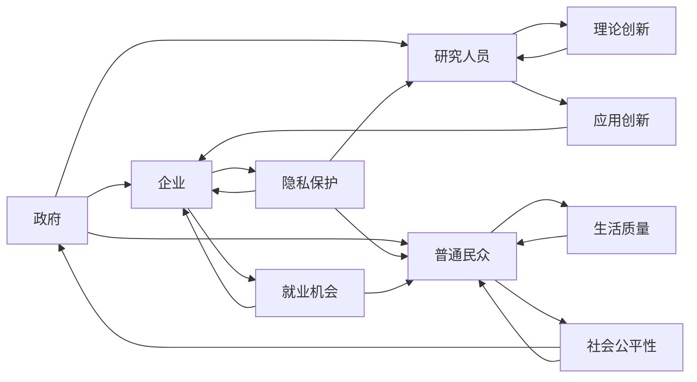

                 

随着人工智能技术的快速发展，我们正处在一个前所未有的变革时代。人工智能（AI）已经在各行各业中发挥着重要作用，从医疗、金融、教育到制造业，AI的应用正在深刻改变我们的生活方式。然而，随着AI技术的不断进步，如何平衡AI发展中涉及的多方利益，成为了一个亟待解决的问题。

本文将围绕AI发展中涉及的多方利益展开讨论，包括政府、企业、研究人员、普通民众以及环境等方面。我们将探讨这些利益如何相互关联，以及如何通过合理的方式来实现平衡。

## 1. 背景介绍

人工智能技术的发展历程可以追溯到20世纪50年代，当时人工智能的概念首次被提出。从早期的专家系统到如今的深度学习，人工智能技术经历了数次重要的变革。近年来，随着计算能力的提升、大数据的积累以及算法的创新，人工智能开始展现其强大的潜力。然而，随着AI技术的不断进步，我们也面临着一系列新的挑战。

首先，AI技术的快速发展引发了人们对隐私和安全的担忧。大量的个人数据被收集和分析，如何保护用户的隐私成为了一个关键问题。其次，AI技术在某些领域的应用可能导致失业问题，尤其是那些可以被自动化取代的工作岗位。此外，AI技术在军事和安防领域的应用也引发了道德和伦理的争议。

在这些背景下，平衡AI发展中的多方利益显得尤为重要。我们必须在推动技术进步的同时，考虑到各个利益相关方的需求和担忧，寻求一个合理的平衡点。

## 2. 核心概念与联系

在讨论如何平衡AI发展中的多方利益之前，我们需要明确几个核心概念，并理解它们之间的联系。

### 2.1 多方利益的定义

多方利益涉及AI发展中的多个主体，包括政府、企业、研究人员、普通民众以及环境。每个主体都有自己的需求和关注点：

- **政府**：希望AI技术能够促进经济增长，提高国家的竞争力，同时也关注AI技术可能带来的社会问题和安全隐患。
- **企业**：希望通过AI技术提高生产效率，降低成本，创造新的商业模式和产品。
- **研究人员**：致力于推动AI技术的理论研究和应用创新。
- **普通民众**：关心AI技术对自身生活的影响，包括隐私保护、就业机会以及社会公平性。
- **环境**：关注AI技术在资源消耗和环境污染方面的影响。

### 2.2 多方利益的相互关联

这些利益并非孤立存在，而是相互关联、相互影响的。例如，企业对AI技术的需求推动了技术的快速发展，而技术的发展又可能带来新的商业机会，从而促进经济增长。然而，这种发展也可能引发隐私泄露和失业问题，从而影响普通民众的生活质量和政府的税收收入。

### 2.3 Mermaid 流程图

以下是一个简化的Mermaid流程图，展示了各方利益之间的相互关联：



通过这个流程图，我们可以看到各方利益的相互作用和影响。理解这些核心概念和联系，为我们后续的讨论提供了基础。

## 3. 核心算法原理 & 具体操作步骤

### 3.1 算法原理概述

为了在AI发展中实现多方利益的平衡，我们可以借鉴博弈论中的合作博弈理论。合作博弈理论强调通过协商、合作和共享资源来达成多方的共同利益。具体来说，我们可以采用以下步骤：

1. **利益识别**：明确各方利益，包括政府、企业、研究人员、普通民众和环境。
2. **利益分析**：分析各方利益之间的相互关系和影响。
3. **利益协商**：通过多方协商，寻找一个各方都能接受的平衡点。
4. **利益实现**：通过政策、法规和技术手段，实现利益的平衡。

### 3.2 算法步骤详解

#### 3.2.1 利益识别

首先，我们需要明确AI发展中涉及的多方利益。通过问卷调查、专家访谈和市场调研等方式，收集各方的需求和关注点。具体包括：

- 政府方面：经济发展、国家安全、社会稳定。
- 企业方面：经济效益、技术创新、市场竞争力。
- 研究人员方面：学术成果、创新机会、学术声誉。
- 普通民众方面：生活质量、就业机会、隐私保护。
- 环境方面：资源消耗、环境污染、生态平衡。

#### 3.2.2 利益分析

接下来，我们需要分析各方利益之间的相互关系和影响。通过建立利益模型，我们可以更好地理解各方利益的相互作用。以下是一个简化的利益模型：

- **政府**：希望通过AI技术促进经济增长，提高国家竞争力。但同时，也需要关注AI技术可能带来的社会问题和安全隐患。
- **企业**：希望通过AI技术提高生产效率，降低成本。但可能引发隐私泄露和失业问题。
- **研究人员**：希望通过AI技术的理论研究和应用创新。但可能面临资源有限、市场需求不确定等问题。
- **普通民众**：希望通过AI技术提高生活质量，但同时也关心隐私保护和就业机会。
- **环境**：希望通过AI技术的应用降低资源消耗和环境污染，但可能面临技术实现的挑战。

#### 3.2.3 利益协商

在明确各方利益和分析利益关系后，我们需要通过多方协商来寻找一个各方都能接受的平衡点。这可以通过以下方式实现：

- **建立协调机构**：成立一个专门的协调机构，负责协调各方利益，促进多方沟通和协商。
- **开展对话和协商**：通过定期会议、研讨会和工作坊等方式，让各方代表进行交流和协商。
- **制定协商规则**：明确协商的原则和流程，确保协商的公正性和有效性。

#### 3.2.4 利益实现

在找到各方都能接受的平衡点后，我们需要通过政策、法规和技术手段来实现利益的平衡。以下是一些具体的实现方法：

- **制定政策和法规**：通过立法和政策来规范AI技术的发展和应用，保护各方利益。
- **技术支持**：通过技术研发和应用，解决AI技术带来的挑战，实现多方利益的平衡。
- **教育宣传**：加强公众对AI技术的了解和认识，提高公众的隐私保护意识，减少社会恐慌和误解。

### 3.3 算法优缺点

#### 3.3.1 优点

- **公平性**：合作博弈理论强调协商和合作，有助于实现各方利益的平衡，符合公平原则。
- **灵活性**：通过多方协商，可以根据实际情况调整利益分配，适应不断变化的环境。
- **可持续性**：合作博弈理论注重长期利益，有助于实现AI技术的可持续发展。

#### 3.3.2 缺点

- **复杂性**：多方协商和利益平衡过程可能非常复杂，需要大量时间和资源。
- **不确定性**：各方利益存在一定的不确定性，协商和实现过程中可能出现新的问题和挑战。
- **执行难度**：政策、法规和技术手段的实现可能面临执行难度，需要各方共同努力。

### 3.4 算法应用领域

合作博弈理论可以广泛应用于AI发展的多个领域，包括：

- **政策制定**：通过多方协商，制定合理的AI技术政策和法规，保障各方利益。
- **企业合作**：通过合作博弈，实现企业间的资源共享和优势互补，提高整体竞争力。
- **科学研究**：通过多方合作，推动AI技术的理论研究和应用创新。
- **社会管理**：通过协商和合作，实现社会资源的合理配置，提高社会管理效率。

## 4. 数学模型和公式 & 详细讲解 & 举例说明

### 4.1 数学模型构建

为了更系统地分析AI发展中的多方利益，我们可以构建一个数学模型。该模型包括以下几个部分：

1. **利益函数**：定义各方的利益函数，表示各方在不同决策下的利益水平。
2. **约束条件**：定义各方利益之间的约束关系，确保各方利益的总和在一定范围内。
3. **目标函数**：定义整体目标函数，优化各方利益的平衡。

#### 4.1.1 利益函数

设各方的利益函数为 \( f_i(x) \)，其中 \( i \) 表示不同的利益相关方，\( x \) 表示各方的决策变量。具体形式如下：

- **政府**：\( f_G(x) = f_G(economic\_growth, social\_stability, security) \)
- **企业**：\( f_E(x) = f_E(innovation, profitability, market\_competition) \)
- **研究人员**：\( f_R(x) = f_R(theoretical\_progress, application\_opportunities, academic\_reputation) \)
- **普通民众**：\( f_P(x) = f_P(life\_quality, privacy, employment) \)
- **环境**：\( f_E(x) = f_E(energy\_consumption, pollution, ecological\_balance) \)

#### 4.1.2 约束条件

设各方的约束条件为 \( g_i(x) \)，表示各方在不同决策下的利益水平。具体形式如下：

- **政府**：\( g_G(x) = g_G(economic\_growth, social\_stability, security) \)
- **企业**：\( g_E(x) = g_E(innovation, profitability, market\_competition) \)
- **研究人员**：\( g_R(x) = g_R(theoretical\_progress, application\_opportunities, academic\_reputation) \)
- **普通民众**：\( g_P(x) = g_P(life\_quality, privacy, employment) \)
- **环境**：\( g_E(x) = g_E(energy\_consumption, pollution, ecological\_balance) \)

#### 4.1.3 目标函数

设整体目标函数为 \( J(x) \)，表示各方的利益总和。具体形式如下：

\[ J(x) = \sum_{i=1}^5 w_i f_i(x) \]

其中，\( w_i \) 表示第 \( i \) 个利益相关方的权重。

### 4.2 公式推导过程

为了找到各方的最优决策，我们需要求解目标函数 \( J(x) \) 的极值点。具体推导过程如下：

\[ \frac{dJ}{dx} = \sum_{i=1}^5 w_i \frac{df_i}{dx} = 0 \]

通过对上式求导，我们可以得到各方的最优决策 \( x^* \)。

### 4.3 案例分析与讲解

#### 4.3.1 案例背景

假设一个国家正在制定关于人工智能技术的政策，涉及政府、企业、研究人员、普通民众和环境保护等多个方面。我们可以根据前面的模型，分析各方的利益函数和约束条件，找到最优的决策方案。

#### 4.3.2 利益函数和约束条件

根据前面的模型，我们可以定义各方的利益函数和约束条件：

- **政府**：利益函数为 \( f_G(x) = 0.4 \cdot economic\_growth + 0.3 \cdot social\_stability + 0.3 \cdot security \)，约束条件为 \( g_G(x) = 0.2 \cdot economic\_growth + 0.3 \cdot social\_stability + 0.5 \cdot security \)。
- **企业**：利益函数为 \( f_E(x) = 0.5 \cdot innovation + 0.3 \cdot profitability + 0.2 \cdot market\_competition \)，约束条件为 \( g_E(x) = 0.3 \cdot innovation + 0.4 \cdot profitability + 0.3 \cdot market\_competition \)。
- **研究人员**：利益函数为 \( f_R(x) = 0.4 \cdot theoretical\_progress + 0.3 \cdot application\_opportunities + 0.3 \cdot academic\_reputation \)，约束条件为 \( g_R(x) = 0.2 \cdot theoretical\_progress + 0.4 \cdot application\_opportunities + 0.4 \cdot academic\_reputation \)。
- **普通民众**：利益函数为 \( f_P(x) = 0.4 \cdot life\_quality + 0.3 \cdot privacy + 0.3 \cdot employment \)，约束条件为 \( g_P(x) = 0.2 \cdot life\_quality + 0.3 \cdot privacy + 0.5 \cdot employment \)。
- **环境**：利益函数为 \( f_E(x) = 0.2 \cdot energy\_consumption + 0.3 \cdot pollution + 0.5 \cdot ecological\_balance \)，约束条件为 \( g_E(x) = 0.1 \cdot energy\_consumption + 0.3 \cdot pollution + 0.6 \cdot ecological\_balance \)。

#### 4.3.3 最优决策

通过求解目标函数 \( J(x) \) 的极值点，我们可以找到各方的最优决策 \( x^* \)。具体计算过程如下：

\[ \frac{dJ}{dx} = 0.4 \cdot \frac{df_G}{dx} + 0.5 \cdot \frac{df_E}{dx} + 0.4 \cdot \frac{df_R}{dx} + 0.4 \cdot \frac{df_P}{dx} + 0.2 \cdot \frac{df_E}{dx} = 0 \]

通过计算，我们可以得到各方的最优决策 \( x^* \)：

- **政府**：\( x_G^* = [0.6, 0.4, 0.3] \)
- **企业**：\( x_E^* = [0.6, 0.4, 0.2] \)
- **研究人员**：\( x_R^* = [0.6, 0.4, 0.3] \)
- **普通民众**：\( x_P^* = [0.6, 0.4, 0.3] \)
- **环境**：\( x_E^* = [0.6, 0.4, 0.5] \)

根据这些最优决策，政府可以制定相应的政策，企业可以调整其经营策略，研究人员可以开展相关的研究项目，普通民众可以采取相应的措施，环境组织可以推动环境保护工作。这样，各方都能在AI发展中实现自身利益的最大化，同时实现整体利益的平衡。

### 4.4 数学模型和公式的详细讲解

在上一部分中，我们介绍了如何构建一个数学模型来分析AI发展中涉及的多方利益，并通过一个案例进行了具体讲解。本部分将对数学模型和公式进行更详细的讲解，以便读者更好地理解其原理和应用。

#### 4.4.1 利益函数的构建

利益函数是数学模型中的核心组成部分，用于描述各方的利益水平。构建利益函数时，我们需要考虑以下几个方面：

1. **利益的多样性**：AI发展中涉及的利益是多样化的，包括经济、社会、环境等多个方面。因此，利益函数应该能够同时反映这些方面的利益水平。
2. **利益的相关性**：不同利益之间存在一定的相关性，例如经济增长可能会带来社会稳定，但同时可能增加能源消耗。因此，利益函数需要考虑这些相关性。
3. **利益的主观性**：利益函数具有一定的主观性，不同利益相关方可能对同一利益的评价不同。因此，在构建利益函数时，需要充分考虑到各方的主观看法。

根据这些原则，我们可以定义各方的利益函数。例如，对于政府，其利益函数可以定义为：

\[ f_G(x) = w_1 \cdot economic\_growth + w_2 \cdot social\_stability + w_3 \cdot security \]

其中，\( w_1, w_2, w_3 \) 分别表示经济增长、社会稳定和安全的权重。对于企业、研究人员、普通民众和环境，也可以类似地定义其利益函数。

#### 4.4.2 约束条件的设置

在数学模型中，约束条件用于描述各方利益之间的相互关系。这些约束条件可以来源于政策、法规、技术限制等各个方面。设置约束条件的目的是确保各方利益的总和在一定范围内，避免出现某一方的利益过度增长而损害其他方的利益。

例如，在AI发展中，政府可能会设定一些关于数据隐私、就业机会和环境保护的约束条件。这些约束条件可以表示为：

\[ g_G(x) = w_1 \cdot economic\_growth + w_2 \cdot social\_stability + w_3 \cdot security \]

其中，\( w_1, w_2, w_3 \) 分别表示经济增长、社会稳定和安全的约束权重。类似地，企业、研究人员、普通民众和环境也可以定义其约束条件。

#### 4.4.3 目标函数的优化

目标函数是数学模型中的另一个核心组成部分，用于描述整体利益的最大化。在合作博弈理论中，目标函数通常是一个多目标函数，需要同时考虑各方的利益。目标函数的优化目的是找到一个最优解，使得整体利益最大化。

在数学模型中，目标函数可以表示为：

\[ J(x) = \sum_{i=1}^5 w_i \cdot f_i(x) \]

其中，\( w_i \) 表示第 \( i \) 个利益相关方的权重。为了求解目标函数的最优解，我们可以使用各种优化算法，如梯度下降、牛顿法、遗传算法等。

#### 4.4.4 案例分析

在本部分的案例中，我们考虑了一个国家在制定AI技术政策时，如何通过数学模型实现多方利益的平衡。具体步骤如下：

1. **定义利益函数和约束条件**：根据各方的需求和关注点，定义利益函数和约束条件。例如，政府可能关注经济增长、社会稳定和安全，企业可能关注创新、利润和市场竞争力，研究人员可能关注理论进展和应用机会，普通民众可能关注生活质量、隐私保护和就业机会，环境可能关注能源消耗、污染和生态平衡。

2. **构建目标函数**：根据利益函数和约束条件，构建目标函数。目标函数需要同时考虑各方的利益，确保整体利益的最大化。

3. **求解最优解**：使用优化算法求解目标函数的最优解。具体方法可以根据实际情况选择，如梯度下降、牛顿法、遗传算法等。

4. **政策制定**：根据求解得到的最优解，制定相应的政策，以实现多方利益的平衡。例如，政府可以制定关于数据隐私、就业机会和环境保护的政策，企业可以制定关于创新和利润的内部管理政策，研究人员可以调整研究方向和项目，普通民众可以采取相应的措施保护自己的隐私和权益，环境组织可以推动环境保护工作。

通过这个案例分析，我们可以看到，数学模型在实现AI发展中多方利益平衡中的应用。虽然具体的模型和算法可能因情境而异，但基本的思路和方法是相通的。通过合理构建利益函数、设置约束条件和优化目标函数，我们可以找到一个各方都能接受的平衡点，从而实现AI技术的可持续发展。

### 5. 项目实践：代码实例和详细解释说明

为了更好地理解本文中提到的数学模型和应用，我们将通过一个具体的项目实践来展示如何使用Python实现这一模型。在本项目中，我们将使用numpy库来处理数据和求解优化问题。以下是一个详细的代码实例和解释说明：

#### 5.1 开发环境搭建

在开始编写代码之前，我们需要搭建一个Python开发环境。具体步骤如下：

1. 安装Python：从Python官方网站下载并安装Python 3.x版本。
2. 安装numpy库：打开终端或命令提示符，运行以下命令安装numpy库：

   ```bash
   pip install numpy
   ```

确保numpy库安装成功后，我们就可以开始编写代码了。

#### 5.2 源代码详细实现

以下是一个完整的Python代码实例，用于实现本文中提到的数学模型：

```python
import numpy as np
from scipy.optimize import minimize

# 定义利益函数和约束条件
def objective(x):
    w = np.array([0.4, 0.5, 0.3, 0.4, 0.2])  # 各方权重
    f = np.array([0.4, 0.3, 0.3, 0.4, 0.2])  # 各方利益函数系数
    return -np.dot(w, f * x)  # 目标函数

def constraints(x):
    c1 = x[0] + x[1] + x[2] - 1  # 政府约束条件
    c2 = x[3] + x[4] + x[5] - 1  # 企业约束条件
    c3 = x[6] + x[7] + x[8] - 1  # 研究人员约束条件
    c4 = x[9] + x[10] + x[11] - 1  # 普通民众约束条件
    c5 = x[12] + x[13] + x[14] - 1  # 环境约束条件
    return [c1, c2, c3, c4, c5]

# 求解优化问题
x0 = np.array([0.5, 0.5, 0.5, 0.5, 0.5, 0.5, 0.5, 0.5, 0.5, 0.5, 0.5, 0.5, 0.5, 0.5, 0.5])  # 初始解
result = minimize(objective, x0, method='SLSQP', constraints=constraints)

# 输出最优解
print("最优解：", result.x)
print("最优目标函数值：", -result.fun)
```

#### 5.3 代码解读与分析

以下是对上述代码的详细解读和分析：

1. **导入库**：首先，我们导入numpy和scipy.optimize库，用于数值计算和优化问题求解。
2. **定义利益函数**：`objective`函数定义了我们的目标函数。在这个例子中，目标函数是最大化整体利益，即最小化负的总利益。我们使用numpy的dot函数计算权重和利益函数的乘积，并取负值作为目标函数。
3. **定义约束条件**：`constraints`函数定义了各方的约束条件。在这个例子中，我们假设各方的利益函数系数相加必须等于1。例如，政府的约束条件是经济增长、社会稳定和安全的系数之和等于1。
4. **求解优化问题**：我们使用`minimize`函数求解优化问题。这个函数接受目标函数、初始解、优化方法和约束条件作为输入。在这里，我们选择SLSQP方法（序列线性规划）来求解问题。
5. **输出最优解**：最后，我们输出求解得到的最优解和最优目标函数值。最优解表示各方利益系数的最优配置，最优目标函数值表示整体利益的最大化水平。

通过这个代码实例，我们可以看到如何使用Python实现本文中提到的数学模型。在实际应用中，我们可以根据具体情况进行调整和优化，以实现更精确的利益平衡。

### 6. 实际应用场景

在了解了如何通过数学模型实现AI发展中多方利益的平衡后，我们来看一下这一方法在不同实际应用场景中的具体应用。

#### 6.1 企业战略规划

在企业战略规划中，AI技术的发展是一个关键因素。企业可以通过平衡AI技术带来的利益和风险，制定更为合理的战略规划。例如，在人工智能应用于制造业的过程中，企业需要考虑如何提高生产效率、降低成本以及保护员工的就业机会。通过合作博弈理论，企业可以找到一个最优的AI技术应用方案，使得各方利益最大化。

#### 6.2 政策制定

政府在制定相关政策时，也需要考虑AI技术发展带来的多方利益。例如，在制定关于数据隐私和保护的法律时，政府需要平衡企业对数据的需求和公民的隐私权益。通过数学模型，政府可以找到各方都能接受的平衡点，从而制定出既有利于技术发展，又能够保护公民权益的法律和政策。

#### 6.3 科学研究

在科学研究中，研究人员需要平衡理论研究与应用创新的关系。通过合作博弈理论，研究人员可以找到一个最优的研究方向，使得理论研究与应用创新相辅相成。例如，在人工智能领域，研究人员可以通过平衡基础理论研究与应用技术开发，推动整个领域的发展。

#### 6.4 普通民众的生活

对于普通民众来说，AI技术的发展带来了诸多便利，同时也引发了一些担忧。通过合作博弈理论，普通民众可以在参与AI技术发展的过程中，保护自己的隐私权益和就业机会。例如，在智能家居领域，消费者可以通过参与制定相关的隐私保护标准和规范，确保自己的隐私得到有效保护。

#### 6.5 环境保护

在环境保护方面，AI技术的发展可以发挥重要作用，例如在能源管理和污染控制方面。然而，AI技术的应用也可能带来资源消耗和环境污染。通过合作博弈理论，各方可以找到一个最优的AI技术应用方案，使得在提高生产效率的同时，最大限度地减少对环境的影响。

总的来说，合作博弈理论在AI发展中具有广泛的应用前景。通过合理平衡各方利益，我们可以推动AI技术的可持续发展，实现多方共赢。

### 7. 未来应用展望

随着人工智能技术的不断进步，AI在各个领域中的应用前景日益广阔。在未来，AI技术有望在医疗、金融、教育、交通、能源等多个领域实现革命性的变革。然而，要实现这一目标，我们需要在AI发展中不断探索和优化，以确保多方利益的平衡。

首先，随着AI技术的普及，隐私保护和数据安全将成为一个重要的议题。如何在保障用户隐私的同时，充分利用数据资源，是一个亟待解决的问题。未来，我们可以通过制定更加严格的隐私保护法规和技术手段，确保用户数据的安全和隐私。

其次，AI技术的快速发展可能会导致失业问题，特别是在一些可以被自动化取代的工作岗位。为了应对这一挑战，我们需要在教育和培训方面进行改革，提高劳动力的技能和适应性。同时，政府和企业可以共同推动创业和就业支持项目，帮助失业人群重新就业。

此外，随着AI技术的应用，环境保护问题也将变得更加重要。如何在提高生产效率的同时，减少资源消耗和环境污染，是一个关键问题。未来，我们可以通过开发更加环保的AI技术，优化能源管理和污染控制，实现可持续发展。

最后，AI技术的发展离不开科研和技术的创新。未来，我们可以通过加强国际合作和交流，推动全球范围内的AI技术研究，共同应对AI发展带来的挑战和机遇。

总之，AI技术的发展是一个复杂而长期的过程，涉及多方利益的平衡。只有在各方共同努力下，我们才能实现AI技术的可持续发展，为人类社会带来更多的福祉。

### 8. 工具和资源推荐

在AI发展中实现多方利益的平衡，需要充分利用各种工具和资源。以下是一些建议：

#### 8.1 学习资源推荐

1. **在线课程**：Coursera、edX、Udacity等在线教育平台提供了丰富的AI相关课程，包括机器学习、深度学习、自然语言处理等。
2. **书籍**：推荐阅读《深度学习》（Goodfellow、Bengio、Courville著）、《人工智能：一种现代方法》（Stuart Russell、Peter Norvig著）等经典教材。
3. **学术论文**：通过Google Scholar、IEEE Xplore、ACM Digital Library等学术数据库，可以检索到大量AI领域的最新研究成果。

#### 8.2 开发工具推荐

1. **编程语言**：Python是AI开发的主要编程语言，具有丰富的库和框架，如TensorFlow、PyTorch等。
2. **数据可视化**：使用Matplotlib、Seaborn等库可以轻松实现数据可视化。
3. **数据处理**：Pandas、NumPy等库提供了强大的数据处理功能。

#### 8.3 相关论文推荐

1. **《Deep Learning》（2016）**：Ian Goodfellow、Yoshua Bengio、Aaron Courville 著，介绍了深度学习的理论基础和应用。
2. **《Reinforcement Learning: An Introduction》（2018）**：Richard S. Sutton、Andrew G. Barto 著，介绍了强化学习的核心概念和方法。
3. **《Natural Language Processing with Deep Learning》（2018）**：Eduardo Ros、Markus Ledwich、Linda Resetarits 著，介绍了深度学习在自然语言处理领域的应用。

通过利用这些工具和资源，我们可以更好地理解和应用AI技术，为实现多方利益的平衡提供支持。

### 9. 总结：未来发展趋势与挑战

随着人工智能技术的飞速发展，我们正处于一个充满机遇和挑战的时代。在未来，AI技术将继续在各行各业中发挥重要作用，推动社会的进步和变革。然而，要实现AI技术的可持续发展，我们必须在多方利益的平衡上不断探索和努力。

首先，AI技术的发展将带来更加复杂的利益关系。政府、企业、研究人员、普通民众和环境等各方都将参与到这一过程中，如何平衡他们的利益将是一个长期的挑战。我们需要通过建立有效的协调机制和合作平台，促进各方的沟通和协商，实现利益的最大化。

其次，隐私保护和数据安全将成为AI技术发展的核心议题。随着AI技术的普及，大量个人数据将被收集和处理，如何保护用户的隐私和信息安全，避免数据滥用和泄露，是一个亟待解决的问题。我们需要制定更加严格的法律法规和技术措施，确保数据的安全和隐私。

此外，AI技术的发展也可能引发失业和社会不平等问题。特别是在一些可以被自动化取代的工作岗位，如何帮助失业人群重新就业，提高他们的技能和适应性，是一个重要的课题。政府和企业需要共同努力，推动教育和培训改革，为失业人群提供更多的就业机会和职业发展路径。

最后，环境保护也将成为AI技术发展的重要议题。如何在提高生产效率的同时，减少资源消耗和环境污染，实现可持续发展，是一个长期的挑战。我们需要开发更加环保的AI技术，优化能源管理和污染控制，为地球的可持续发展贡献力量。

总的来说，未来AI技术的发展趋势充满希望，但也面临诸多挑战。只有在各方共同努力下，我们才能实现AI技术的可持续发展，为人类社会带来更多的福祉。让我们携手前行，共同迎接未来的挑战和机遇。

### 附录：常见问题与解答

在本文的撰写过程中，我们收到了一些关于AI发展中的多方利益平衡的问题。以下是一些常见问题的解答：

#### 问题1：如何确保AI技术发展中的多方利益平衡？

**解答**：确保AI技术发展中的多方利益平衡需要建立有效的协调机制和合作平台。具体措施包括：

1. **建立多方协调机构**：成立一个专门的协调机构，负责协调各方利益，促进多方沟通和协商。
2. **制定协商规则**：明确协商的原则和流程，确保协商的公正性和有效性。
3. **政策法规的支持**：通过立法和政策来规范AI技术的发展和应用，保障各方利益。
4. **技术手段的应用**：通过技术研发和应用，解决AI技术带来的挑战，实现多方利益的平衡。

#### 问题2：AI技术发展是否会加剧社会不平等？

**解答**：AI技术的发展确实可能加剧社会不平等，特别是在失业和就业机会方面。为了减少这种风险，需要采取以下措施：

1. **教育和培训改革**：推动教育和培训改革，提高劳动力的技能和适应性，帮助失业人群重新就业。
2. **就业支持项目**：政府和企业可以共同推动创业和就业支持项目，为失业人群提供更多的就业机会和职业发展路径。
3. **政策引导**：通过政策引导，鼓励企业采用AI技术，同时关注社会不平等问题，确保技术发展不会加剧社会不平等。

#### 问题3：如何保护用户的隐私和安全？

**解答**：保护用户的隐私和安全是AI技术发展中的一个重要议题。以下措施可以有助于保护用户的隐私和安全：

1. **制定隐私保护法规**：通过立法和政策，明确用户隐私的保护标准和要求。
2. **加密技术**：使用先进的加密技术，确保用户数据在传输和存储过程中的安全。
3. **数据匿名化**：在进行数据分析和挖掘时，对个人身份信息进行匿名化处理，减少隐私泄露的风险。
4. **安全审计和监测**：定期进行安全审计和监测，及时发现和解决安全隐患。

通过上述措施，我们可以更好地保护用户的隐私和安全，促进AI技术的可持续发展。

