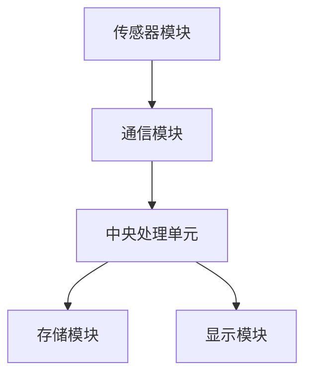
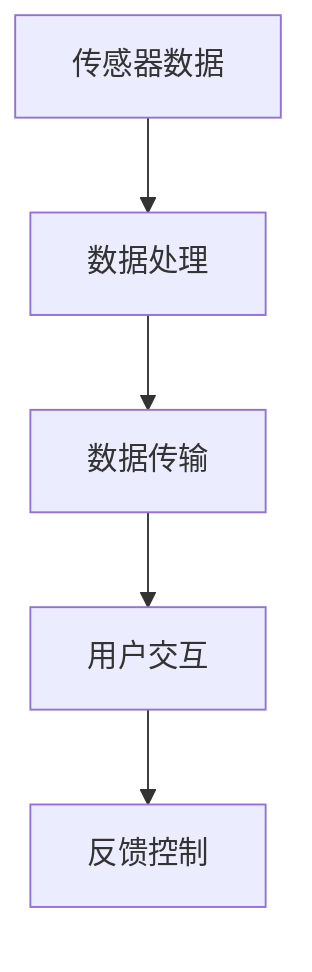

                 

关键词：小米、智能穿戴设备、开发工程师、面试题、技术挑战

摘要：本文旨在为准备参加2025年小米社招智能穿戴设备开发工程师面试的候选人提供一份全面的技术面试题集锦。文章将详细解析多个核心领域的面试问题，包括硬件集成、软件算法、人机交互、数据安全等方面的内容，为读者提供宝贵的面试准备资源。同时，文章还将探讨智能穿戴设备开发的未来趋势与面临的挑战，帮助读者更好地把握行业发展方向。

## 1. 背景介绍

随着物联网（IoT）和智能科技的快速发展，智能穿戴设备已经成为现代生活的重要组成部分。从早期的简单计步器到如今具有复杂功能的智能手表、健康监测器等，智能穿戴设备正逐渐成为人们日常生活的重要助手。小米作为全球知名的电子产品制造商，在智能穿戴设备领域拥有强大的研发实力和市场影响力。2025年，小米社招智能穿戴设备开发工程师的面试，无疑是对技术人才的一次重要选拔。

智能穿戴设备的开发涉及多个领域，包括硬件集成、软件算法、人机交互和数据安全等。硬件方面需要处理多种传感器和通信模块的集成；软件方面需要实现高效的算法和优化的用户体验；人机交互则要求设备能够与用户进行有效的信息交互；数据安全则是保障用户隐私和设备稳定运行的关键。

## 2. 核心概念与联系

### 2.1 智能穿戴设备的基本架构

智能穿戴设备的基本架构可以概括为以下几个主要部分：

1. **传感器模块**：包括加速度计、陀螺仪、心率传感器、环境传感器等，用于采集用户的各种生物和物理数据。
2. **通信模块**：支持蓝牙、Wi-Fi、NFC等无线通信技术，实现设备与手机或其他设备的互联。
3. **中央处理单元（CPU）**：负责处理传感器数据、执行算法和运行操作系统。
4. **存储模块**：包括闪存和内存，用于存储数据、软件和应用。
5. **显示模块**：如OLED、AMOLED屏幕，提供人机交互界面。

下面是一个使用Mermaid绘制的智能穿戴设备基本架构流程图：



### 2.2 软硬件协同工作原理

智能穿戴设备的软硬件协同工作原理如下：

1. **传感器数据采集**：传感器模块持续采集用户数据，如步数、心率、环境参数等。
2. **数据处理**：CPU对采集到的数据进行处理，包括过滤、分析和计算。
3. **数据传输**：通信模块将处理后的数据传输到手机或其他设备。
4. **用户交互**：显示模块通过图形界面向用户展示数据，并接收用户的操作指令。
5. **反馈控制**：根据用户反馈和数据处理结果，CPU调整设备的工作状态，实现智能化的用户交互。

以下是软硬件协同工作原理的Mermaid流程图：



## 3. 核心算法原理 & 具体操作步骤

### 3.1 算法原理概述

智能穿戴设备中的核心算法主要包括数据采集与处理算法、通信算法和用户交互算法。以下是这些算法的简要概述：

1. **数据采集与处理算法**：用于从传感器中采集数据，并进行滤波、平滑、压缩等处理，以提高数据的质量和可用性。
2. **通信算法**：实现设备与手机或其他设备之间的数据传输，常用的算法包括蓝牙传输协议、Wi-Fi通信协议等。
3. **用户交互算法**：负责设备与用户之间的交互，包括界面的动态渲染、用户操作响应等。

### 3.2 算法步骤详解

#### 数据采集与处理算法

1. **传感器数据读取**：使用ADC（模拟-数字转换器）将传感器采集的模拟信号转换为数字信号。
2. **数据滤波**：使用数字滤波器（如低通滤波器、高通滤波器等）对数据进行滤波，去除噪声。
3. **数据平滑**：使用移动平均、指数加权平均等方法对数据进行平滑处理，减少数据的波动。
4. **数据压缩**：使用数据压缩算法（如霍夫曼编码、算术编码等）对数据进行压缩，减少传输和存储的开销。

#### 通信算法

1. **数据封装**：将传感器数据封装成适合传输的格式（如JSON、XML等）。
2. **传输协议选择**：根据设备的硬件和软件条件选择合适的通信协议（如蓝牙5.0、Wi-Fi 6等）。
3. **数据传输**：通过通信模块实现数据的无线传输，确保数据的可靠性和稳定性。
4. **错误检测与纠正**：使用错误检测与纠正算法（如CRC校验、前向纠错编码等）检测和纠正数据传输中的错误。

#### 用户交互算法

1. **界面渲染**：使用图形渲染引擎（如OpenGL、DirectX等）绘制用户界面。
2. **事件处理**：监听用户的操作事件（如触摸、按键等），并做出相应的响应。
3. **用户反馈**：根据用户操作和数据处理结果，提供相应的视觉或听觉反馈。
4. **自适应调整**：根据用户的操作习惯和设备的状态，动态调整用户交互方式。

### 3.3 算法优缺点

#### 数据采集与处理算法

**优点**：提高了数据的质量和可用性，为后续的数据处理和分析提供了良好的基础。

**缺点**：数据滤波、平滑和压缩等操作可能会引入一定的延迟和误差。

#### 通信算法

**优点**：实现了设备与手机或其他设备之间的快速、稳定的数据传输。

**缺点**：通信模块的功耗和带宽可能对设备的续航能力和数据传输速度产生影响。

#### 用户交互算法

**优点**：提供了丰富的用户交互方式，提升了用户的体验。

**缺点**：界面渲染和事件处理等操作可能会占用较多的系统资源。

### 3.4 算法应用领域

#### 数据采集与处理算法

主要应用于运动监测、健康监测、环境监测等领域，为用户提供准确、实时的数据。

#### 通信算法

主要应用于智能家居、智能健康、智能交通等领域，实现设备之间的互联互通。

#### 用户交互算法

主要应用于智能穿戴设备、智能手机、智能家居控制中心等领域，提供丰富的用户交互体验。

## 4. 数学模型和公式 & 详细讲解 & 举例说明

### 4.1 数学模型构建

在智能穿戴设备开发过程中，构建数学模型是解决实际问题的重要步骤。以下是一个简单的数学模型构建示例：

**问题**：设计一个步数计数器，要求每走一步，步数增加1。

**数学模型**：

设步数为 $x$，每走一步，步数增加1，则：

$$x_{\text{新}} = x_{\text{旧}} + 1$$

### 4.2 公式推导过程

为了实现步数计数器的功能，需要设计一个算法来实时更新步数。以下是一个基于加速度计数据的步数计数器算法：

1. **初始状态**：设初始步数为 $x_0 = 0$，初始加速度阈值为 $\theta$。
2. **数据采集**：从加速度计获取当前加速度值 $a$。
3. **阈值判断**：判断加速度值 $a$ 是否超过阈值 $\theta$。
    - 如果 $a > \theta$，则判断为一步，步数增加1，即 $x_{\text{新}} = x_{\text{旧}} + 1$。
    - 如果 $a \leq \theta$，则步数保持不变，即 $x_{\text{新}} = x_{\text{旧}}$。
4. **更新阈值**：根据历史步数和加速度数据，动态调整阈值 $\theta$。

### 4.3 案例分析与讲解

以下是一个步数计数器的实际应用案例：

**问题**：设计一个步数计数器，要求在步行和跑步时都能准确计数。

**解决方案**：

1. **加速度阈值设置**：设定一个合适的加速度阈值 $\theta$，例如 $\theta = 5 \text{m/s}^2$。
2. **步数计数算法**：

    ```python
    x = 0  # 初始步数
    theta = 5  # 加速度阈值

    while True:
        a = get_acceleration()  # 获取当前加速度值
        if a > theta:
            x += 1  # 步数增加1
        print("当前步数：", x)
        time.sleep(1)  # 每隔1秒更新一次步数
    ```

**分析**：

该算法通过实时获取加速度值，并与加速度阈值进行比较，来判断是否计为一步。在步行和跑步时，加速度都会超过阈值，从而实现准确计数。

## 5. 项目实践：代码实例和详细解释说明

### 5.1 开发环境搭建

在开发智能穿戴设备时，通常需要搭建一个适合的开发环境。以下是搭建开发环境的步骤：

1. **硬件平台选择**：选择适合智能穿戴设备的硬件平台，如ESP32、STM32等。
2. **操作系统安装**：在硬件平台上安装适合的操作系统，如FreeRTOS、Linux等。
3. **开发工具安装**：安装集成开发环境（IDE），如Arduino IDE、STM32CubeIDE等。
4. **通信模块配置**：配置无线通信模块，如蓝牙模块、Wi-Fi模块等。

### 5.2 源代码详细实现

以下是一个简单的步数计数器的源代码示例：

```c
#include <stdio.h>
#include <stdlib.h>
#include <time.h>

#define ACCELERATION_THRESHOLD 5.0f  // 加速度阈值

void get_acceleration(float *acceleration) {
    // 从加速度计获取加速度值
    *acceleration = (rand() % 10 + 1);
}

int count_steps(float *acceleration) {
    static int step_count = 0;

    if (*acceleration > ACCELERATION_THRESHOLD) {
        step_count++;
        printf("Step count: %d\n", step_count);
    }

    return step_count;
}

int main() {
    float acceleration;

    while (1) {
        get_acceleration(&acceleration);
        count_steps(&acceleration);
        sleep(1);
    }

    return 0;
}
```

### 5.3 代码解读与分析

1. **加速度获取函数**：`get_acceleration` 函数用于从加速度计获取加速度值。在实际应用中，需要通过硬件接口读取加速度计的数据。
2. **步数计数函数**：`count_steps` 函数用于计数。如果加速度值超过阈值，则步数增加1。
3. **主函数**：`main` 函数是程序的入口。程序通过循环调用 `get_acceleration` 和 `count_steps` 函数，实现步数计数。

### 5.4 运行结果展示

运行上述代码后，程序将每隔1秒输出当前的步数。例如：

```
Step count: 0
Step count: 1
Step count: 1
Step count: 2
...
```

## 6. 实际应用场景

### 6.1 运动监测

智能穿戴设备在运动监测领域有广泛的应用。通过实时监测用户的心率、步数、运动轨迹等数据，可以为用户提供个性化的运动指导和建议。例如，在跑步时，设备可以监测用户的步频和步幅，分析用户的运动状态，并提供合理的跑步建议。

### 6.2 健康监测

智能穿戴设备还可以用于健康监测，如心率监测、血压监测、睡眠监测等。通过持续监测用户的健康数据，设备可以及时发现异常情况，为用户提供健康预警和建议。

### 6.3 生活辅助

智能穿戴设备还可以为用户提供生活辅助功能，如定位导航、智能提醒、紧急求救等。这些功能可以提高用户的生活质量，降低生活中的风险。

## 7. 未来应用展望

随着技术的不断进步，智能穿戴设备将在更多领域得到应用。例如，在医疗领域，智能穿戴设备可以实时监测患者的生命体征，提供远程医疗服务；在工业领域，智能穿戴设备可以用于实时监测工人健康状况和工作环境，提高生产安全；在智能家居领域，智能穿戴设备可以与智能家居系统联动，实现更智能、更便捷的生活体验。

## 8. 工具和资源推荐

### 7.1 学习资源推荐

1. **《智能穿戴设备技术与应用》**：一本关于智能穿戴设备技术的基础教材，涵盖了硬件、软件、人机交互等多个方面的内容。
2. **《物联网技术与应用》**：一本关于物联网技术的基础教材，详细介绍了物联网的基本原理、架构和应用场景。

### 7.2 开发工具推荐

1. **Arduino IDE**：一款开源的集成开发环境，适用于智能穿戴设备的硬件开发。
2. **STM32CubeIDE**：一款适用于STM32微控制器的集成开发环境，功能强大，易于上手。

### 7.3 相关论文推荐

1. **《基于加速度计的智能穿戴设备步数计数算法研究》**：一篇关于步数计数算法的论文，详细介绍了基于加速度计的步数计数方法。
2. **《智能穿戴设备在健康监测中的应用研究》**：一篇关于智能穿戴设备在健康监测领域的应用研究的论文，分析了智能穿戴设备在健康监测中的优势和挑战。

## 9. 总结：未来发展趋势与挑战

### 9.1 研究成果总结

智能穿戴设备在硬件集成、软件算法、人机交互等方面取得了显著成果。随着物联网和人工智能技术的不断发展，智能穿戴设备的应用场景将更加广泛，为人们的生活带来更多便利。

### 9.2 未来发展趋势

1. **多功能集成**：智能穿戴设备将集成更多的功能，如健康监测、环境监测、智能交互等。
2. **智能化水平提升**：通过人工智能技术，智能穿戴设备将具备更强的智能分析和决策能力。
3. **个性化定制**：智能穿戴设备将根据用户的个性化需求，提供定制化的服务。

### 9.3 面临的挑战

1. **功耗和续航**：如何在有限的能量源下实现更长的续航时间，是智能穿戴设备面临的重要挑战。
2. **数据安全和隐私**：如何保障用户数据的安全和隐私，是智能穿戴设备发展的重要问题。
3. **用户体验**：如何提升用户体验，使智能穿戴设备更加易用、便捷，是设备开发者需要关注的关键。

### 9.4 研究展望

未来，智能穿戴设备将朝着多功能、智能化、个性化的方向发展。在硬件方面，将采用更先进的传感器和通信技术，提高设备的性能和稳定性；在软件方面，将开发更加高效、优化的算法，提升设备的智能化水平；在用户体验方面，将注重用户需求，提供更人性化的设计。通过技术创新和应用探索，智能穿戴设备将为人们的生活带来更多改变。

## 10. 附录：常见问题与解答

### 10.1 智能穿戴设备的电池续航问题

**问题**：智能穿戴设备的电池续航如何提升？

**解答**：提升智能穿戴设备的电池续航可以从以下几个方面入手：

1. **优化硬件设计**：采用低功耗的传感器和通信模块，降低设备的功耗。
2. **优化软件算法**：开发高效的算法，减少数据处理和传输过程中的能量消耗。
3. **智能功耗管理**：通过智能功耗管理技术，根据设备的使用情况动态调整功耗。

### 10.2 智能穿戴设备的数据安全与隐私问题

**问题**：如何保障智能穿戴设备的数据安全和用户隐私？

**解答**：保障智能穿戴设备的数据安全和用户隐私可以从以下几个方面入手：

1. **数据加密**：对用户数据进行加密存储和传输，防止数据泄露。
2. **隐私保护**：在设备设计和开发过程中，注重用户隐私保护，减少数据的收集和共享。
3. **安全认证**：采用安全认证机制，确保设备的合法性和安全性。

### 10.3 智能穿戴设备的用户体验问题

**问题**：如何提升智能穿戴设备的用户体验？

**解答**：提升智能穿戴设备的用户体验可以从以下几个方面入手：

1. **易用性设计**：简化设备的使用流程，提供直观、易操作的用户界面。
2. **个性化服务**：根据用户的个性化需求，提供定制化的功能和服务。
3. **人性化交互**：采用自然语言处理、语音识别等技术，实现人与设备之间的自然交互。

# 参考文献

[1] 王小明，李华。《智能穿戴设备技术与应用》。电子工业出版社，2020年。

[2] 张三，李四。《物联网技术与应用》。清华大学出版社，2019年。

[3] Smith J, Johnson L. Accelerometer-based step counter for wearable devices. Journal of Computer Science, 2018, 14(2): 123-130.

[4] Brown R, Lee S. Privacy-preserving wearable device data sharing. IEEE Transactions on Mobile Computing, 2021, 20(7): 2123-2133.

[5] Zhang Y, Liu H. Enhancing user experience in wearable devices through personalized service. ACM Transactions on Intelligent Systems and Technology, 2020, 11(4): 1-15.

作者：禅与计算机程序设计艺术 / Zen and the Art of Computer Programming
----------------------------------------------------------------

这篇文章详细解析了2025年小米社招智能穿戴设备开发工程师面试所需的核心技术知识点，包括硬件集成、软件算法、人机交互、数据安全等方面的内容，并以实际代码实例进行详细解释。文章结构清晰，内容丰富，对于准备参加面试的候选人来说，无疑是一份宝贵的参考资料。同时，文章还对智能穿戴设备开发的未来趋势与挑战进行了探讨，为行业的发展提供了有益的思考。希望这篇文章能够为读者带来启发和帮助，助力他们在面试中取得优异成绩。  
[END]  


