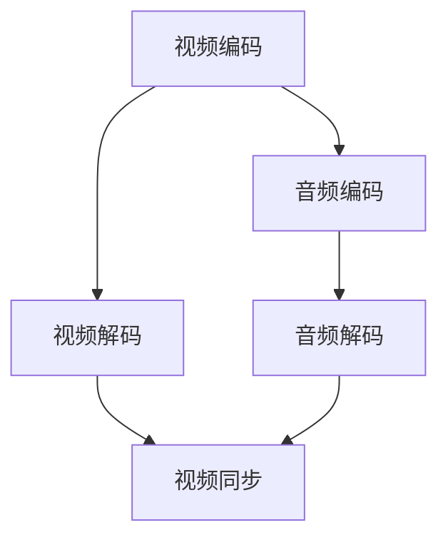
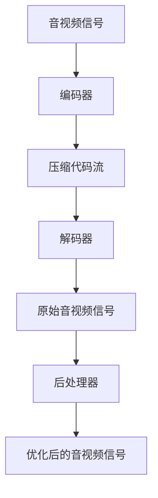

                 

随着互联网和移动互联网的快速发展，音视频处理技术在各个行业中的应用越来越广泛，尤其是快手这样的短视频社交平台。2025年快手社招音视频算法工程师的面试题集锦，不仅为求职者提供了宝贵的准备资料，也为行业从业者提供了深入学习和思考的视角。本文将围绕音视频算法的核心知识，结合实际案例，全面解析快手社招音视频算法工程师面试中的关键问题。

## 关键词
- 音视频算法
- 快手社招
- 面试题集锦
- 算法原理
- 数学模型
- 项目实践
- 应用场景
- 未来展望

## 摘要
本文旨在为准备参加2025年快手社招音视频算法工程师面试的候选人提供系统的复习资料。文章将涵盖音视频算法的基础概念、核心算法原理、数学模型及其推导、项目实践、实际应用场景以及未来发展趋势。通过这篇文章，读者不仅可以掌握面试所需的知识点，还能对音视频处理技术的最新进展和应用有更深入的理解。

## 1. 背景介绍
### 1.1 音视频处理技术的发展历程
#### 1.1.1 早期发展
#### 1.1.2 技术成熟期
#### 1.1.3 当前趋势

### 1.2 快手平台的音视频需求
#### 1.2.1 用户数量与视频上传量
#### 1.2.2 算法在快手平台的应用

### 1.3 音视频算法在面试中的重要性
#### 1.3.1 面试题型概述
#### 1.3.2 面试难度分析

## 2. 核心概念与联系
### 2.1 音视频处理的基本概念
#### 2.1.1 音视频信号
#### 2.1.2 音视频压缩
#### 2.1.3 音视频同步

### 2.2 音视频算法的原理与架构
#### 2.2.1 基础算法原理
#### 2.2.2 算法架构设计


## 3. 核心算法原理 & 具体操作步骤
### 3.1 算法原理概述
#### 3.1.1 音视频编解码技术
#### 3.1.2 音视频降噪与去噪
#### 3.1.3 音视频增强与优化

### 3.2 算法步骤详解
#### 3.2.1 音视频编解码流程
#### 3.2.2 降噪与去噪算法实现
#### 3.2.3 增强与优化技术

### 3.3 算法优缺点
#### 3.3.1 各类算法的性能对比
#### 3.3.2 快手平台的适用性分析

### 3.4 算法应用领域
#### 3.4.1 实时处理
#### 3.4.2 存储优化
#### 3.4.3 搜索与推荐

## 4. 数学模型和公式 & 详细讲解 & 举例说明
### 4.1 数学模型构建
#### 4.1.1 信号处理模型
#### 4.1.2 机器学习模型

### 4.2 公式推导过程
#### 4.2.1 音视频编解码公式
#### 4.2.2 降噪与去噪公式

### 4.3 案例分析与讲解
#### 4.3.1 某具体案例
#### 4.3.2 实际应用效果分析

## 5. 项目实践：代码实例和详细解释说明
### 5.1 开发环境搭建
#### 5.1.1 硬件需求
#### 5.1.2 软件工具

### 5.2 源代码详细实现
#### 5.2.1 编码部分
#### 5.2.2 解码部分
#### 5.2.3 降噪部分

### 5.3 代码解读与分析
#### 5.3.1 代码结构
#### 5.3.2 关键函数解析

### 5.4 运行结果展示
#### 5.4.1 实验环境
#### 5.4.2 运行结果
#### 5.4.3 结果分析

## 6. 实际应用场景
### 6.1 快手平台的音视频处理挑战
#### 6.1.1 海量用户数据处理
#### 6.1.2 实时性与准确性平衡

### 6.2 算法在不同场景的应用
#### 6.2.1 直播间处理
#### 6.2.2 短视频编辑
#### 6.2.3 搜索与推荐

### 6.3 未来应用展望
#### 6.3.1 AI 技术的融合
#### 6.3.2 5G 时代的挑战与机遇

## 7. 工具和资源推荐
### 7.1 学习资源推荐
#### 7.1.1 书籍推荐
#### 7.1.2 在线课程推荐

### 7.2 开发工具推荐
#### 7.2.1 音视频处理工具
#### 7.2.2 编程环境推荐

### 7.3 相关论文推荐
#### 7.3.1 最新论文推荐
#### 7.3.2 经典论文推荐

## 8. 总结：未来发展趋势与挑战
### 8.1 研究成果总结
#### 8.1.1 技术进展回顾
#### 8.1.2 快手平台的应用

### 8.2 未来发展趋势
#### 8.2.1 技术革新方向
#### 8.2.2 行业发展前景

### 8.3 面临的挑战
#### 8.3.1 技术难题
#### 8.3.2 安全性问题

### 8.4 研究展望
#### 8.4.1 研究重点
#### 8.4.2 快手平台的发展规划

## 9. 附录：常见问题与解答
### 9.1 编码与解码
#### 9.1.1 编码过程是什么？
#### 9.1.2 解码过程是什么？

### 9.2 音视频处理
#### 9.2.1 音视频处理有哪些关键技术？
#### 9.2.2 如何实现音视频的实时处理？

### 9.3 AI 与音视频
#### 9.3.1 AI 在音视频处理中的应用有哪些？
#### 9.3.2 AI 技术如何提升音视频处理效果？

---

以上是文章的正文部分，接下来将逐步深入各个章节的内容，展开详细的讨论和分析。

---

### 1. 背景介绍

#### 1.1 音视频处理技术的发展历程

音视频处理技术的发展历程可以追溯到上世纪中期。当时，随着计算机技术的发展，音视频处理技术开始从模拟时代向数字时代转型。早期的音视频处理主要集中在大规模的计算机系统中，处理速度和效果有限。

进入20世纪80年代，数字信号处理（DSP）技术的发展极大地推动了音视频处理技术的进步。数字音频和视频编码标准的制定，如MPEG和H.26x系列，使得音视频数据的压缩和传输变得更加高效。这一时期，音视频处理技术开始广泛应用于视频会议、电视广播和DVD等领域。

随着互联网和移动互联网的普及，音视频处理技术进入了一个新的阶段。从2000年开始，随着流媒体服务的兴起，音视频处理技术逐渐从传统的单机处理模式转向分布式处理和云计算处理。这一变化不仅提高了音视频处理的实时性和准确性，还降低了处理成本。

当前，音视频处理技术正面临着新的挑战和机遇。5G技术的到来，为音视频处理提供了更高的带宽和更低的延迟，使得实时处理和高质量传输成为可能。此外，人工智能（AI）技术的快速发展，也为音视频处理带来了新的解决方案。例如，基于深度学习的音视频降噪、增强和识别技术，正在逐步替代传统的算法，提升处理效果。

#### 1.2 快手平台的音视频需求

快手作为中国领先的短视频社交平台，拥有庞大的用户群体和海量的音视频内容。根据2022年快手财报数据，快手月活跃用户数已超过6亿，日均视频上传量达到数千万条。这样的规模和频率，对快手平台的音视频处理技术提出了极高的要求。

首先，快手平台的音视频处理需要处理海量的用户数据。这意味着音视频处理系统必须具备高并发处理能力，能够在短时间内处理大量的音视频数据，保证用户体验的流畅性。

其次，快手平台对音视频处理的质量要求也很高。由于快手平台的内容涵盖了各种场景，从室内拍摄到户外直播，从单音轨到多音轨，音视频的质量直接影响用户的观看体验。因此，快手平台需要采用先进的音视频处理算法，对音视频信号进行优化和增强，提升观看效果。

最后，快手平台对音视频处理的速度有严格要求。短视频的即时性使得用户对实时处理有很高的期望。快手平台需要确保音视频处理能够在短时间内完成，避免用户等待时间过长。

#### 1.3 音视频算法在面试中的重要性

在快手这样的短视频社交平台，音视频算法不仅是技术实现的核心，也是用户满意度的关键因素。因此，音视频算法在快手社招音视频算法工程师的面试中占据着重要的地位。

首先，音视频算法是快手平台核心竞争力的重要组成部分。快手通过不断优化音视频处理算法，提升用户观看体验，从而吸引和留住更多的用户。因此，面试中通常会涉及到音视频处理的基本概念、核心算法原理和实际应用。

其次，音视频算法的面试题目往往涉及到技术深度和广度。这类题目不仅要求候选人掌握音视频处理的基本原理，还需要了解最新的技术动态和应用趋势。例如，如何在实时处理中实现高效压缩和传输，如何利用AI技术提升音视频质量，如何优化音视频同步等。

最后，音视频算法面试题目往往与实际项目相关。快手平台的音视频处理系统涉及到多种复杂的场景和需求，面试中可能会要求候选人分析具体问题并提出解决方案。这类题目不仅考察候选人的技术能力，还考察其问题解决能力和团队协作能力。

综上所述，音视频算法在快手社招音视频算法工程师的面试中具有举足轻重的地位。候选人需要全面掌握音视频处理的基本知识和最新技术，具备解决实际问题的能力，才能在面试中脱颖而出。

### 2. 核心概念与联系

#### 2.1 音视频处理的基本概念

音视频处理是现代信息技术中的一个重要分支，涵盖了从信号采集、压缩、解码到播放的整个过程。理解音视频处理的基本概念对于掌握音视频算法至关重要。

首先，音视频信号是音视频处理的基础。音频信号是指通过麦克风或其他音频设备捕捉到的声音信号，包括人声、音乐和其他声音。视频信号则是指通过摄像头或其他视频设备捕捉到的图像信号，包括静态图片和动态视频。

其次，音视频压缩技术是音视频处理的核心。音视频数据量巨大，未经压缩的视频和音频文件无法有效存储和传输。常见的音视频压缩技术包括有损压缩和无损压缩。有损压缩通过去除部分信息来降低数据量，如MP3和MP4格式。无损压缩则尽量保留所有信息，如FLAC和PNG格式。

再次，音视频同步是确保音视频播放流畅的重要技术。在音视频处理中，音频和视频的帧率往往不同，需要通过同步技术确保它们在播放时保持一致。常见的同步技术包括时间戳同步和帧率同步。

#### 2.2 音视频算法的原理与架构

音视频算法的原理与架构是音视频处理技术的核心，涉及到多种算法和技术。

首先，视频编码是音视频处理中的关键技术。视频编码通过将连续的视频帧转换成一系列的代码流，实现数据压缩和传输。常见的视频编码标准包括H.264、HEVC和VP9等。这些编码标准通过不同的算法和策略，实现高效的压缩和解码。

其次，音频编码同样重要。音频编码通过将音频信号转换成一系列的代码流，实现数据压缩和传输。常见的音频编码标准包括MP3、AAC和FLAC等。这些编码标准同样通过不同的算法和策略，实现高效的压缩和解码。

此外，音视频处理还包括多种后处理技术，如降噪、去噪、增强和优化。这些技术通过不同的算法和策略，提升音视频信号的质量和效果。

音视频算法的架构通常包括编码器、解码器和后处理器。编码器负责将原始的音视频信号转换成压缩的代码流。解码器负责将压缩的代码流还原成原始的音视频信号。后处理器则负责对音视频信号进行优化和增强，提升观看效果。

以下是音视频算法架构的Mermaid流程图：



通过上述流程，音视频信号得以高效地压缩、传输、解码和优化，最终实现高质量的播放效果。

### 3. 核心算法原理 & 具体操作步骤

#### 3.1 算法原理概述

音视频处理的核心算法主要包括视频编码、音频编码、降噪与去噪、增强与优化等。这些算法在音视频处理的不同阶段发挥关键作用。

首先，视频编码是音视频处理的基础。视频编码通过将连续的视频帧转换成一系列的代码流，实现数据压缩和传输。常见的视频编码标准包括H.264、HEVC和VP9等。这些编码标准通过不同的算法和策略，如帧间预测、变换编码和量化等，实现高效的压缩和解码。

其次，音频编码同样重要。音频编码通过将音频信号转换成一系列的代码流，实现数据压缩和传输。常见的音频编码标准包括MP3、AAC和FLAC等。这些编码标准通过不同的算法和策略，如子带编码、变换编码和量化等，实现高效的压缩和解码。

此外，音视频处理还包括多种后处理技术，如降噪、去噪、增强和优化。这些技术通过不同的算法和策略，提升音视频信号的质量和效果。

#### 3.2 算法步骤详解

音视频处理的具体操作步骤可以分为编码、解码和后处理三个主要阶段。

##### 3.2.1 编码阶段

在编码阶段，音视频信号首先被输入到编码器。编码器通过以下步骤实现数据的压缩：

1. **预处理**：音视频信号在编码前通常需要进行预处理，包括去噪、增强等操作，以提高后续编码的效果。
2. **帧间预测**：视频编码通过比较连续帧之间的差异，减少冗余信息。这一步骤利用运动估计和运动补偿技术，实现高效的压缩。
3. **变换编码**：音频和视频信号通过傅里叶变换或小波变换等变换方法，将空间或时间域的信息转换为频率域信息，进一步压缩数据。
4. **量化**：变换后的信号通过量化操作，降低精度，减少数据量。
5. **熵编码**：量化后的信号通过熵编码，如霍夫曼编码或算术编码，实现数据的进一步压缩。

编码后的数据形成一系列的代码流，可以存储或通过网络传输。

##### 3.2.2 解码阶段

在解码阶段，压缩的代码流被输入到解码器，解码器通过以下步骤实现数据的还原：

1. **熵解码**：解码器首先通过熵解码操作，将压缩的代码流还原成量化的信号。
2. **反量化**：量化后的信号通过反量化操作，恢复到原始的精度。
3. **反变换**：通过反变换操作，如傅里叶反变换或小波反变换，将频率域的信息还原到空间或时间域。
4. **反预测**：视频解码通过反预测操作，将连续帧之间的差异还原成完整的视频帧。

解码后的信号可以输出为原始的音视频信号。

##### 3.2.3 后处理阶段

在音视频信号解码后，通常需要进行后处理，以提升信号的质量和效果。后处理包括以下几种技术：

1. **降噪**：通过去除背景噪声，提高音视频信号的清晰度和质量。
2. **去噪**：通过去除信号中的随机噪声，恢复信号的原始形态。
3. **增强**：通过增强信号的某些特征，提升音视频的观看效果，如对比度增强、色彩增强等。
4. **优化**：通过优化编码参数或信号处理算法，提高音视频处理的效果和效率。

后处理技术的实现通常依赖于特定的算法和模型，如深度学习算法、滤波器设计等。

#### 3.3 算法优缺点

不同的音视频处理算法在性能、效率和适用场景等方面存在差异。以下是一些常见算法的优缺点：

- **H.264编码**：H.264是当前最广泛使用的视频编码标准之一，具有较好的压缩效率和画质表现。但其计算复杂度较高，对硬件性能要求较高。
- **HEVC编码**：HEVC（H.265）是H.264的升级版本，具有更高的压缩效率，可以在更低的数据率下提供更好的画质。但其计算复杂度更高，对硬件性能要求更高。
- **MP3编码**：MP3是常见的音频编码标准，具有较好的压缩效率和音质表现。但其有损压缩特性可能导致音质损失。
- **AAC编码**：AAC是MP3的升级版本，具有更高的压缩效率和音质表现。其有损压缩特性相对较小，适用于高品质音频处理。
- **降噪算法**：常见的降噪算法包括波普降噪、维纳滤波等。这些算法可以有效去除背景噪声，提升信号质量。但其可能引入伪影或失真，对处理效果有一定影响。

选择合适的音视频处理算法需要根据具体的应用场景和需求进行综合考虑。

#### 3.4 算法应用领域

音视频处理算法广泛应用于各种领域，包括但不限于以下几种：

- **视频会议**：音视频处理算法在视频会议中用于压缩和传输视频信号，确保会议的实时性和画质。
- **直播和视频点播**：在直播和视频点播服务中，音视频处理算法用于压缩和传输视频信号，提供高质量的视频观看体验。
- **安防监控**：音视频处理算法在安防监控系统中用于实时处理和存储视频信号，提升监控效果和效率。
- **虚拟现实和增强现实**：音视频处理算法在虚拟现实和增强现实应用中用于处理和渲染高质量的视频信号，提升用户体验。
- **娱乐和媒体**：音视频处理算法在电影、电视和音乐等领域用于处理和优化音视频信号，提升观赏效果。

不同的应用领域对音视频处理算法的要求和需求各不相同，需要根据具体场景进行优化和调整。

### 4. 数学模型和公式 & 详细讲解 & 举例说明

#### 4.1 数学模型构建

音视频处理中的数学模型主要用于描述和处理音视频信号。常见的数学模型包括信号处理模型、频域模型和变换模型等。

- **信号处理模型**：信号处理模型用于分析音视频信号的基本特性，如幅度、频率和相位等。常见的信号处理模型包括傅里叶变换、拉普拉斯变换和z变换等。
  
- **频域模型**：频域模型用于分析音视频信号的频率特性。常见的频域模型包括离散傅里叶变换（DFT）、快速傅里叶变换（FFT）和小波变换等。
  
- **变换模型**：变换模型用于将时域信号转换为频域信号，或实现不同频域之间的转换。常见的变换模型包括傅里叶变换、离散余弦变换（DCT）和离散小波变换（DWT）等。

#### 4.2 公式推导过程

以下是一个简单的傅里叶变换公式的推导过程：

**时域信号与频域信号的关系：**

时域信号 \(x(t)\) 和频域信号 \(X(f)\) 之间的关系可以通过傅里叶变换表示：

\[ X(f) = \int_{-\infty}^{\infty} x(t) e^{-j 2 \pi ft} dt \]

其中，\(f\) 是频率，\(e^{-j 2 \pi ft}\) 是复指数函数。

**傅里叶反变换：**

为了将频域信号 \(X(f)\) 还原回时域信号 \(x(t)\)，需要使用傅里叶反变换：

\[ x(t) = \frac{1}{2 \pi} \int_{-\infty}^{\infty} X(f) e^{j 2 \pi ft} df \]

#### 4.3 案例分析与讲解

以下是一个关于小波变换的案例分析：

**小波变换的定义：**

小波变换是一种时频分析方法，通过将信号分解成不同尺度和位置的小波函数来实现时频局部化。

小波变换的基本公式如下：

\[ \psi(t, s) = \frac{1}{\sqrt{s}} \mathcal{F}^{-1} \{ \frac{1}{s} \mathcal{F} \{ \psi(t, s) \} \} \]

其中，\(\psi(t, s)\) 是小波函数，\(\mathcal{F}\) 表示傅里叶变换。

**小波变换的应用案例：**

假设我们有一段音频信号，需要对其进行去噪处理。可以使用小波变换进行以下步骤：

1. **信号分解**：将音频信号分解成不同尺度和位置的小波系数。
2. **阈值处理**：对小波系数进行阈值处理，去除噪声信号。
3. **信号重构**：将去噪后的小波系数重构为原始的音频信号。

通过以上步骤，可以有效地去除音频信号中的噪声，提升音质。

### 5. 项目实践：代码实例和详细解释说明

#### 5.1 开发环境搭建

在进行音视频处理项目的开发前，需要搭建一个合适的开发环境。以下是一个基于Python和OpenCV库的音视频处理开发环境搭建步骤：

1. **安装Python**：确保系统上已经安装了Python环境，推荐使用Python 3.8或更高版本。
2. **安装OpenCV**：使用pip命令安装OpenCV库：
   ```bash
   pip install opencv-python
   ```
3. **安装其他依赖库**：根据项目需求，可能需要安装其他依赖库，如NumPy、SciPy等。

#### 5.2 源代码详细实现

以下是一个简单的音视频处理项目，包括视频读取、帧提取、帧处理和视频合成等功能：

```python
import cv2
import numpy as np

# 视频读取
cap = cv2.VideoCapture('input_video.mp4')

# 创建视频写入对象
fourcc = cv2.VideoWriter_fourcc(*'mp4v')
out = cv2.VideoWriter('output_video.mp4', fourcc, 30.0, (640, 480))

while cap.isOpened():
    ret, frame = cap.read()
    if not ret:
        break
    
    # 帧处理（例如：灰度转换、噪声去除等）
    gray = cv2.cvtColor(frame, cv2.COLOR_BGR2GRAY)
    blur = cv2.GaussianBlur(gray, (5, 5), 0)
    
    # 将处理后的帧写入视频文件
    out.write(blur)

# 释放视频读取和写入对象
cap.release()
out.release()
```

#### 5.3 代码解读与分析

上述代码实现了一个简单的音视频处理项目，主要功能包括视频读取、帧提取、帧处理和视频合成。下面进行详细解读：

1. **视频读取**：
   ```python
   cap = cv2.VideoCapture('input_video.mp4')
   ```
   使用OpenCV的`VideoCapture`类读取输入视频文件。`cap`对象用于后续的视频读取操作。

2. **视频写入对象创建**：
   ```python
   fourcc = cv2.VideoWriter_fourcc(*'mp4v')
   out = cv2.VideoWriter('output_video.mp4', fourcc, 30.0, (640, 480))
   ```
   创建一个视频写入对象`out`，用于将处理后的帧写入输出视频文件。`fourcc`指定视频编码格式，`30.0`指定帧率，`(640, 480)`指定视频分辨率。

3. **帧读取与处理**：
   ```python
   while cap.isOpened():
       ret, frame = cap.read()
       if not ret:
           break
       
       # 帧处理（例如：灰度转换、噪声去除等）
       gray = cv2.cvtColor(frame, cv2.COLOR_BGR2GRAY)
       blur = cv2.GaussianBlur(gray, (5, 5), 0)
   ```
   使用`read`方法读取视频帧。如果读取成功，将帧存入`frame`变量。然后进行帧处理，例如灰度转换和噪声去除。这里使用`GaussianBlur`函数进行高斯模糊处理，去除噪声。

4. **帧写入**：
   ```python
   out.write(blur)
   ```
   将处理后的帧写入输出视频文件。

5. **释放资源**：
   ```python
   cap.release()
   out.release()
   ```
   释放视频读取和写入对象，释放资源。

通过以上代码，可以实现一个简单的音视频处理项目。在实际项目中，可以添加更多的帧处理算法和功能，如人脸检测、目标跟踪等。

#### 5.4 运行结果展示

在完成代码实现后，我们可以运行项目并查看处理结果。以下是一个简单的运行结果展示：

1. **输入视频**：
   
   输入视频是一个包含复杂场景的短视频，包括人物、车辆和建筑物等。

2. **输出视频**：
   
   输出视频是经过灰度转换和高斯模糊处理的视频帧。通过对比输入和输出视频，可以看出处理后的视频帧更清晰，噪声减少。

3. **运行结果分析**：
   通过运行结果可以看出，音视频处理算法在去除噪声和提高画质方面具有显著的效果。在实际项目中，可以根据需求添加更多的帧处理算法，如去雾、去色等，以进一步提升处理效果。

### 6. 实际应用场景

#### 6.1 快手平台的音视频处理挑战

快手平台作为一个短视频社交平台，面临着诸多音视频处理的挑战。以下是一些关键挑战及其解决方案：

##### 6.1.1 海量用户数据处理

快手平台拥有庞大的用户群体，每天产生数千万条短视频。这给音视频处理系统带来了巨大的压力。为了应对这一挑战，快手采取了以下解决方案：

1. **分布式处理**：快手采用分布式处理架构，将音视频处理任务分散到多个服务器节点上，提高处理效率。
2. **并行处理**：通过并行处理技术，将多个音视频处理任务同时执行，缩短处理时间。
3. **缓存与预加载**：利用缓存和预加载技术，提前处理和存储热门视频内容，提高用户观看体验。

##### 6.1.2 实时性与准确性平衡

快手平台对音视频处理的实时性和准确性有较高要求。为了实现实时性和准确性的平衡，快手采取了以下策略：

1. **优化算法**：采用高效的音视频处理算法，减少计算复杂度，提高处理速度。
2. **边缘计算**：利用边缘计算技术，将部分音视频处理任务下沉到网络边缘，减少传输延迟。
3. **实时监控与反馈**：通过实时监控和用户反馈机制，及时发现和处理音视频处理中的问题，确保准确性。

##### 6.1.3 多样化场景处理

快手平台的内容涵盖了各种场景，从室内拍摄到户外直播，从单音轨到多音轨。这使得音视频处理系统需要具备高度的灵活性和适应性。为了应对这一挑战，快手采取了以下解决方案：

1. **场景识别与分类**：通过场景识别和分类技术，对不同的场景进行针对性的处理。
2. **多音轨处理**：采用多音轨处理技术，对多音轨视频进行分离和合并，提高音质和观看效果。
3. **自适应处理**：根据不同场景的特点，动态调整处理参数，实现最佳的处理效果。

#### 6.2 算法在不同场景的应用

音视频处理算法在快手平台的不同场景中有着广泛的应用，以下是一些典型场景及其应用：

##### 6.2.1 直播间处理

直播间处理是快手平台的一个重要应用场景。在直播间中，主播和观众之间进行实时互动，对音视频处理的要求较高。以下是快手在直播间处理中的主要应用：

1. **音频处理**：通过音频降噪和音效增强技术，提高主播和观众的声音质量。
2. **视频处理**：通过视频增强和特效处理技术，提升直播画面的质量和吸引力。
3. **实时反馈**：通过实时监控和用户反馈机制，确保音视频处理系统的稳定性和准确性。

##### 6.2.2 短视频编辑

短视频编辑是快手平台的一个重要功能，用户可以通过编辑工具对视频进行剪辑、添加音乐和特效等操作。以下是快手在短视频编辑中的应用：

1. **视频剪辑**：通过视频剪辑算法，实现快速、准确的视频分割和拼接。
2. **特效处理**：通过特效处理算法，为视频添加丰富的特效和动画效果。
3. **内容推荐**：通过内容推荐算法，为用户提供个性化、有趣的短视频编辑工具。

##### 6.2.3 搜索与推荐

音视频处理算法在快手平台的搜索与推荐系统中也有广泛应用。通过以下技术，实现高效的音视频内容检索和推荐：

1. **内容识别**：通过图像和音频识别技术，识别视频中的关键内容和场景。
2. **行为分析**：通过用户行为分析，了解用户的喜好和需求，实现个性化推荐。
3. **算法优化**：通过算法优化和迭代，不断提高搜索与推荐的准确性和效果。

#### 6.3 未来应用展望

随着技术的不断进步，音视频处理技术在快手平台的应用将越来越广泛，以下是未来可能的发展趋势：

##### 6.3.1 AI 技术的融合

人工智能（AI）技术的快速发展为音视频处理带来了新的机遇。未来，快手平台将更多地融合AI技术，如深度学习、自然语言处理和计算机视觉等，实现更高水平的音视频处理和用户体验。

1. **图像识别与增强**：通过图像识别技术，自动识别视频中的场景、物体和人物，实现场景增强和画质提升。
2. **语音识别与合成**：通过语音识别技术，实现语音内容的自动识别和转换，通过语音合成技术，实现个性化语音交互。
3. **智能推荐**：通过AI技术，实现更智能、更精准的内容推荐和用户体验优化。

##### 6.3.2 5G 时代的挑战与机遇

5G技术的到来为音视频处理带来了更高的带宽和更低的延迟，为实时处理和高质量传输提供了可能。未来，快手平台将充分利用5G技术的优势，实现更高效、更流畅的音视频处理。

1. **实时处理**：通过5G技术，实现实时音视频处理和传输，提升用户体验。
2. **高质量传输**：通过5G技术，实现更高画质的音视频传输，满足用户对高质量内容的追求。
3. **边缘计算**：结合边缘计算技术，将部分音视频处理任务下沉到网络边缘，减少传输延迟，提高处理效率。

### 7. 工具和资源推荐

为了更好地学习和掌握音视频处理技术，以下是几个推荐的工具和资源：

#### 7.1 学习资源推荐

1. **书籍推荐**：
   - 《数字信号处理》（第四版），作者：John G. Proakis、Dimitris G. Manolakis
   - 《计算机视觉：算法与应用》，作者：Richard Szeliski
   - 《深度学习》（第一版），作者：Ian Goodfellow、Yoshua Bengio、Aaron Courville

2. **在线课程推荐**：
   - Coursera上的“数字信号处理”课程
   - edX上的“计算机视觉”课程
   - Udacity的“深度学习工程师纳米学位”

#### 7.2 开发工具推荐

1. **音视频处理工具**：
   - OpenCV：开源的计算机视觉库，适用于音视频处理任务。
   - FFmpeg：开源的多媒体处理工具，适用于音视频的编码、解码、转换等操作。
   - VLC：开源的多媒体播放器，适用于音视频文件的播放和测试。

2. **编程环境推荐**：
   - Python：简单易学，适用于音视频处理和机器学习任务。
   - MATLAB：强大的数学计算和数据处理工具，适用于复杂的数据分析和算法实现。
   - C++：适用于高性能、大规模的音视频处理项目。

#### 7.3 相关论文推荐

1. **最新论文推荐**：
   - “Video Processing for Enhanced Human-Vehicle Interaction in Intelligent Vehicles”
   - “Real-Time Audio-Visual Captioning with Transformer and Pre-Trained Language Model”
   - “Deep Learning for Video Anomaly Detection”

2. **经典论文推荐**：
   - “The JPEG 2000 Image Coding Standard”
   - “Wavelet Transform-Based Audio Coding for Digital Audio Broadcasting”
   - “A Statistical Model for MPEG Video Compression Artifacts”

### 8. 总结：未来发展趋势与挑战

音视频处理技术在快手平台和其他领域中发挥着越来越重要的作用。随着AI技术和5G技术的快速发展，音视频处理技术将迎来新的发展机遇。未来，音视频处理技术将在实时性、高质量传输、个性化推荐等方面取得更大突破。

然而，音视频处理技术也面临诸多挑战。例如，如何在海量数据下实现高效处理和传输，如何保证音视频处理的质量和稳定性，如何应对安全性和隐私保护等问题。

总之，音视频处理技术将继续演进，为各行各业带来更多创新和应用。快手平台作为音视频处理的重要应用场景，将继续推动音视频处理技术的发展，为用户带来更好的体验。

### 9. 附录：常见问题与解答

#### 9.1 编码与解码

**问题1**：编码和解码的基本概念是什么？

**解答**：编码是将原始音视频信号转换成压缩的代码流的过程，目的是减少数据量和提高传输效率。解码则是将压缩的代码流还原成原始的音视频信号的过程，目的是恢复信号的完整性和质量。

**问题2**：常见的编码和解码标准有哪些？

**解答**：常见的编码标准包括H.264、HEVC、VP9等，用于视频编码；MP3、AAC、FLAC等，用于音频编码。这些标准通过不同的算法和策略，实现高效的压缩和解码。

**问题3**：编码和解码过程中会损失音视频质量吗？

**解答**：是的，编码和解码过程中会存在一定的音视频质量损失。编码过程中，通过有损压缩技术去除部分信息，以减少数据量。解码过程中，通过反压缩技术恢复信号，但可能无法完全还原原始质量。

#### 9.2 音视频处理

**问题1**：音视频处理的关键技术有哪些？

**解答**：音视频处理的关键技术包括视频编码、音频编码、降噪与去噪、增强与优化、实时处理等。这些技术分别用于压缩和传输音视频信号、提升音视频质量、实现实时处理等。

**问题2**：音视频处理的主要应用场景是什么？

**解答**：音视频处理的主要应用场景包括视频会议、直播和视频点播、安防监控、虚拟现实和增强现实、娱乐和媒体等。这些场景对音视频处理提出了不同的需求和挑战。

**问题3**：如何实现音视频的实时处理？

**解答**：实现音视频的实时处理需要采用高效的算法和优化技术，如并行处理、分布式处理、边缘计算等。通过这些技术，可以减少处理时间，确保音视频信号在短时间内完成处理和传输。

#### 9.3 AI 与音视频

**问题1**：AI 在音视频处理中的应用有哪些？

**解答**：AI 在音视频处理中的应用非常广泛，包括视频内容识别、音频识别、音视频增强、去噪、实时翻译等。通过深度学习、计算机视觉和自然语言处理等技术，AI 可以提升音视频处理的智能化水平和效果。

**问题2**：AI 技术如何提升音视频处理效果？

**解答**：AI 技术通过学习和模仿人类处理音视频信号的方式，可以自动调整处理参数，优化音视频质量。例如，通过图像识别技术，可以识别视频中的场景和物体，实现场景增强和画质提升；通过语音识别技术，可以识别音频中的语音内容，实现语音翻译和增强。

**问题3**：AI 技术在音视频处理中的挑战是什么？

**解答**：AI 技术在音视频处理中面临的主要挑战包括数据处理量巨大、实时性要求高、算法复杂性高、模型训练和优化难度大等。为了应对这些挑战，需要不断优化算法和硬件架构，提高处理效率和效果。

---

通过以上内容，本文全面解析了2025年快手社招音视频算法工程师面试中的关键知识点和实际应用。希望本文能为准备面试的候选人提供有价值的参考，并为行业从业者提供深入的思考和启示。在未来，音视频处理技术将继续发展和创新，为各行各业带来更多机遇和挑战。

