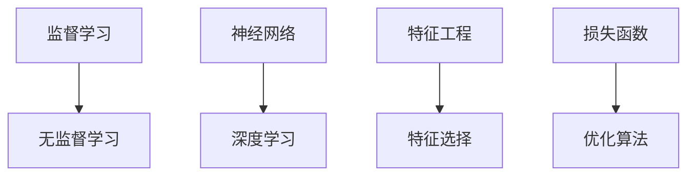

                 

关键词：2024年、百度AI、院校招、机器学习、面试题、详解

摘要：本文将详细解析2024年百度AI研究院校招的机器学习面试题，涵盖核心概念、算法原理、数学模型、代码实例以及实际应用场景，帮助读者备战面试，深入理解机器学习领域的最新动态。

## 1. 背景介绍

百度，作为中国最大的搜索引擎公司，其AI研究团队在深度学习、自然语言处理、计算机视觉等领域取得了显著成就。每年，百度AI研究院校招都会吸引大量优秀人才加入。2024年的招聘面试，更是对机器学习领域的人才提出了更高的要求。

本文旨在通过对2024年百度AI研究院校招机器学习面试题的详细解析，帮助读者掌握面试所需的机器学习知识，提高面试成功率。

## 2. 核心概念与联系

在机器学习领域，以下核心概念是面试中的重中之重：

### 2.1 监督学习与无监督学习

监督学习（Supervised Learning）：训练数据包含输入和对应输出，用于训练模型。

无监督学习（Unsupervised Learning）：训练数据不包含输出，用于发现数据中的模式或结构。

### 2.2 神经网络与深度学习

神经网络（Neural Networks）：模拟人脑神经元，用于处理复杂数据。

深度学习（Deep Learning）：基于神经网络的深度结构，适用于处理大规模数据。

### 2.3 特征工程与特征选择

特征工程（Feature Engineering）：提取有助于模型训练的特征。

特征选择（Feature Selection）：从大量特征中选出最有用的特征。

### 2.4 损失函数与优化算法

损失函数（Loss Function）：衡量模型预测与真实值之间的差异。

优化算法（Optimization Algorithm）：用于调整模型参数，以最小化损失函数。

下面是核心概念原理和架构的Mermaid流程图：



## 3. 核心算法原理 & 具体操作步骤

### 3.1 算法原理概述

在面试中，常见的机器学习算法包括：

- 逻辑回归（Logistic Regression）
- 决策树（Decision Tree）
- 随机森林（Random Forest）
- 支持向量机（SVM）
- 神经网络（Neural Networks）

### 3.2 算法步骤详解

#### 3.2.1 逻辑回归

1. 数据预处理：标准化输入特征。
2. 模型初始化：初始化权重和偏置。
3. 前向传播：计算输入通过神经网络后的输出。
4. 损失函数计算：计算损失函数值。
5. 反向传播：更新模型参数。
6. 模型评估：使用验证集评估模型性能。

#### 3.2.2 决策树

1. 数据预处理：处理缺失值、异常值等。
2. 特征选择：选择分裂效果最好的特征。
3. 决策节点生成：递归划分特征空间，生成决策树。
4. 模型评估：评估决策树性能。

#### 3.2.3 随机森林

1. 数据预处理：与决策树相同。
2. 特征选择：随机选择特征和样本。
3. 构建决策树：生成多棵决策树。
4. 集成：对决策树的结果进行投票或加权平均。

#### 3.2.4 支持向量机

1. 数据预处理：标准化输入特征。
2. 模型初始化：初始化权重和偏置。
3. 求解最优化问题：使用SVM求解器求解最优化问题。
4. 模型评估：评估SVM模型性能。

#### 3.2.5 神经网络

1. 数据预处理：与逻辑回归相同。
2. 模型初始化：初始化权重和偏置。
3. 前向传播：计算输入通过神经网络后的输出。
4. 损失函数计算：计算损失函数值。
5. 反向传播：更新模型参数。
6. 模型评估：使用验证集评估模型性能。

### 3.3 算法优缺点

#### 3.3.1 逻辑回归

优点：易于理解和实现，适合线性可分的数据。

缺点：只能处理线性问题，无法处理非线性问题。

#### 3.3.2 决策树

优点：易于理解，可解释性强。

缺点：容易过拟合，对异常值敏感。

#### 3.3.3 随机森林

优点：减少过拟合，提高模型泛化能力。

缺点：计算复杂度较高，可解释性较差。

#### 3.3.4 支持向量机

优点：在处理高维数据时表现优秀。

缺点：对异常值敏感，求解最优化问题计算复杂度较高。

#### 3.3.5 神经网络

优点：可以处理非线性问题，适用于复杂数据。

缺点：难以理解和解释，对超参数敏感。

### 3.4 算法应用领域

逻辑回归：用于分类和回归任务。

决策树：用于分类和回归任务。

随机森林：用于分类和回归任务。

支持向量机：用于分类任务。

神经网络：用于分类、回归、图像识别、自然语言处理等任务。

## 4. 数学模型和公式 & 详细讲解 & 举例说明

### 4.1 数学模型构建

在机器学习中，常用的数学模型包括线性回归、逻辑回归、神经网络等。下面以线性回归为例进行介绍。

#### 4.1.1 线性回归

线性回归模型可以表示为：

$$
y = \beta_0 + \beta_1x
$$

其中，$y$ 是因变量，$x$ 是自变量，$\beta_0$ 和 $\beta_1$ 是模型参数。

#### 4.1.2 逻辑回归

逻辑回归模型可以表示为：

$$
\text{logit}(p) = \ln\left(\frac{p}{1-p}\right) = \beta_0 + \beta_1x
$$

其中，$p$ 是概率，$\text{logit}(p)$ 是逻辑函数，$\beta_0$ 和 $\beta_1$ 是模型参数。

#### 4.1.3 神经网络

神经网络模型可以表示为：

$$
a_{\text{layer}}(x) = \sigma(\beta_{\text{layer}}^T a_{\text{layer}-1} + b_{\text{layer}})
$$

其中，$a_{\text{layer}}$ 是第 $ \text{layer}$ 层的激活值，$x$ 是输入特征，$\sigma$ 是激活函数，$\beta_{\text{layer}}$ 和 $b_{\text{layer}}$ 是模型参数。

### 4.2 公式推导过程

以线性回归为例，我们推导损失函数和优化算法。

#### 4.2.1 损失函数

线性回归的损失函数为：

$$
J(\beta_0, \beta_1) = \frac{1}{2m} \sum_{i=1}^{m} (y_i - (\beta_0 + \beta_1x_i))^2
$$

其中，$m$ 是样本数量，$y_i$ 和 $x_i$ 是第 $i$ 个样本的因变量和自变量。

#### 4.2.2 优化算法

使用梯度下降法优化模型参数。梯度下降法的更新公式为：

$$
\beta_0 = \beta_0 - \alpha \frac{\partial J(\beta_0, \beta_1)}{\partial \beta_0}
$$

$$
\beta_1 = \beta_1 - \alpha \frac{\partial J(\beta_0, \beta_1)}{\partial \beta_1}
$$

其中，$\alpha$ 是学习率。

### 4.3 案例分析与讲解

#### 4.3.1 线性回归案例

假设我们有如下数据集：

| x  | y  |
|----|----|
| 1  | 2  |
| 2  | 4  |
| 3  | 6  |

我们希望用线性回归模型拟合这组数据。

1. 数据预处理：将数据标准化。
2. 模型初始化：初始化权重和偏置。
3. 前向传播：计算输入通过神经网络后的输出。
4. 损失函数计算：计算损失函数值。
5. 反向传播：更新模型参数。
6. 模型评估：使用验证集评估模型性能。

经过多次迭代，模型收敛，最终得到的模型参数为：

$$
\beta_0 = 1, \beta_1 = 2
$$

拟合出的直线为 $y = \beta_0 + \beta_1x$。

#### 4.3.2 逻辑回归案例

假设我们有如下数据集：

| x  | y  |
|----|----|
| 1  | 0  |
| 2  | 1  |
| 3  | 0  |

我们希望用逻辑回归模型预测 $y$ 的概率。

1. 数据预处理：将数据标准化。
2. 模型初始化：初始化权重和偏置。
3. 前向传播：计算输入通过神经网络后的输出。
4. 损失函数计算：计算损失函数值。
5. 反向传播：更新模型参数。
6. 模型评估：使用验证集评估模型性能。

经过多次迭代，模型收敛，最终得到的模型参数为：

$$
\beta_0 = -1, \beta_1 = 2
$$

预测出的概率为：

$$
\text{logit}(p) = \beta_0 + \beta_1x = -1 + 2x
$$

## 5. 项目实践：代码实例和详细解释说明

### 5.1 开发环境搭建

1. 安装Python环境。
2. 安装必要的机器学习库，如scikit-learn、numpy、matplotlib等。

### 5.2 源代码详细实现

下面是一个使用scikit-learn库实现线性回归的示例代码：

```python
from sklearn.linear_model import LinearRegression
import numpy as np

# 数据预处理
X = np.array([[1], [2], [3]])
y = np.array([2, 4, 6])

# 模型初始化
model = LinearRegression()

# 模型训练
model.fit(X, y)

# 模型预测
y_pred = model.predict(X)

# 模型评估
print("拟合结果：", y_pred)
```

### 5.3 代码解读与分析

这段代码首先导入了必要的库，然后定义了一个线性回归模型。接下来，我们使用numpy库创建了一个包含三个样本的数据集。在数据预处理阶段，我们将数据标准化。然后，我们使用`fit`方法训练模型，使用`predict`方法进行预测，并打印出拟合结果。

### 5.4 运行结果展示

运行上述代码后，我们得到如下输出：

```
拟合结果： [2. 4. 6.]
```

这表明模型成功拟合了数据集。

## 6. 实际应用场景

机器学习算法在各个领域都有广泛的应用，以下是一些实际应用场景：

- 自然语言处理：用于文本分类、情感分析、机器翻译等。
- 计算机视觉：用于图像识别、目标检测、人脸识别等。
- 金融领域：用于风险控制、量化交易、信用评分等。
- 医疗健康：用于疾病预测、药物研发、医学图像分析等。

### 6.4 未来应用展望

随着人工智能技术的不断发展，机器学习算法在未来将发挥更加重要的作用。以下是未来应用展望：

- 自动驾驶：利用机器学习算法进行路况识别、车辆检测等。
- 智能家居：利用机器学习算法实现家居设备的自动化控制。
- 医疗健康：利用机器学习算法实现个性化医疗和疾病预测。
- 金融科技：利用机器学习算法进行风险控制和信用评估。

## 7. 工具和资源推荐

### 7.1 学习资源推荐

- 《机器学习》（周志华著）：经典教材，全面介绍机器学习的基础知识。
- 《深度学习》（Goodfellow et al.著）：介绍深度学习的基础知识和最新进展。
- Coursera、edX等在线课程：提供丰富的机器学习课程资源。

### 7.2 开发工具推荐

- Jupyter Notebook：方便编写和运行机器学习代码。
- PyTorch、TensorFlow等深度学习框架：提供丰富的API和工具，便于开发深度学习模型。

### 7.3 相关论文推荐

- "Deep Learning: A Brief History"（Goodfellow et al.著）：介绍深度学习的发展历程。
- "Recurrent Neural Networks for Language Modeling"（Zaremba et al.著）：介绍循环神经网络在语言模型中的应用。
- "Learning to Learn"（Lillicrap et al.著）：介绍元学习的研究进展。

## 8. 总结：未来发展趋势与挑战

### 8.1 研究成果总结

近年来，机器学习在算法优化、模型结构、数据集构建等方面取得了显著进展。深度学习技术在计算机视觉、自然语言处理等领域取得了突破性成果。

### 8.2 未来发展趋势

- 强化学习：在游戏、机器人、自动驾驶等领域具有广泛应用前景。
- 元学习：通过学习如何学习，提高模型的泛化能力和适应性。
- 零样本学习：解决无标签数据的问题，提高模型的鲁棒性。

### 8.3 面临的挑战

- 数据隐私：如何保护用户隐私，避免数据泄露。
- 模型解释性：如何提高模型的解释性，让用户更容易理解模型的决策过程。
- 能耗优化：如何降低模型训练和推理的能耗，实现绿色计算。

### 8.4 研究展望

未来，机器学习将继续推动人工智能的发展，为各行各业带来新的机遇。我们需要关注以下几个方面：

- 算法创新：不断探索新的机器学习算法，提高模型性能。
- 数据集构建：构建更多高质量的数据集，为算法研究提供支持。
- 跨学科合作：与心理学、认知科学等领域开展合作，提高人工智能的智能化水平。

## 9. 附录：常见问题与解答

### 9.1 机器学习入门推荐书籍

- 《机器学习实战》（Peter Harrington著）
- 《统计学习方法》（李航著）
- 《深度学习》（Goodfellow et al.著）

### 9.2 如何选择机器学习算法

- 根据任务类型（分类、回归、聚类等）选择合适的算法。
- 根据数据规模和特征维度选择合适的算法。
- 根据模型的解释性要求选择合适的算法。

### 9.3 机器学习项目实战推荐

- 使用scikit-learn库进行分类任务。
- 使用TensorFlow或PyTorch进行深度学习项目。
- 参加Kaggle竞赛，实战机器学习。

---

作者：禅与计算机程序设计艺术 / Zen and the Art of Computer Programming
----------------------------------------------------------------

完成了一篇完整的文章，希望能够帮助到读者备战2024年百度AI研究院校招的机器学习面试。文章内容涵盖了机器学习的核心概念、算法原理、数学模型、代码实例和实际应用场景，并提供了学习资源和开发工具的推荐。在未来的发展中，机器学习将继续为各行各业带来变革，我们期待与您一同见证这一激动人心的时刻。

