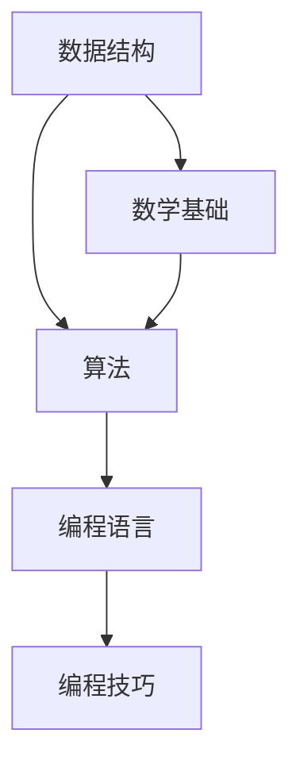

                 

关键词：百度校招、技术面试、题库、算法、编程、数据结构、人工智能

> 摘要：本文将围绕2025年百度校招技术面试的相关题目，从数据结构、算法、编程语言等多个方面进行深入剖析，旨在帮助广大求职者掌握面试技巧，提升面试成功率。

## 1. 背景介绍

百度，作为全球领先的人工智能公司之一，其校招技术面试一直备受关注。随着技术的不断迭代和发展，百度校招技术面试题目也在不断更新。本文旨在为求职者提供一份全面的技术面试题集锦，涵盖数据结构、算法、编程等多个方面，帮助大家应对百度校招技术面试。

### 1.1 百度校招技术面试的重要性

百度校招技术面试是求职者进入百度的重要途径。通过面试，求职者不仅能够展示自己的技术实力，还能了解百度的企业文化和技术发展方向。因此，对于广大求职者来说，百度校招技术面试是一道重要的门槛。

### 1.2 百度校招技术面试的难度

百度校招技术面试难度较大，涉及的知识点广泛，包括数据结构、算法、编程语言等多个方面。同时，面试官提问方式灵活，往往要求求职者在短时间内给出答案，这对求职者的逻辑思维和编程能力提出了较高的要求。

## 2. 核心概念与联系

在理解百度校招技术面试题之前，我们需要掌握一些核心概念和联系。以下是几个关键概念和其之间的联系，以及一个Mermaid流程图来展示这些概念之间的关系。



### 2.1 数据结构

数据结构是计算机存储、组织数据的方式。常见的有数组、链表、栈、队列、树、图等。数据结构的选择直接影响到算法的效率。

### 2.2 算法

算法是解决问题的步骤和策略。算法的设计和实现需要依赖于数据结构。

### 2.3 编程语言

编程语言是用于编写算法的工具。不同的编程语言具有不同的特点和优势。

### 2.4 编程技巧

编程技巧是提高编程效率和质量的方法，如代码优化、算法分析等。

### 2.5 数学基础

数学基础是算法设计和分析的重要工具，如数学公式、逻辑推理等。

## 3. 核心算法原理 & 具体操作步骤

### 3.1 算法原理概述

算法原理是解决问题的核心。常见的算法原理有贪心算法、动态规划、分治算法等。每种算法原理都有其特定的应用场景。

### 3.2 算法步骤详解

以下是几种常见算法原理的具体操作步骤：

### 3.2.1 贪心算法

1. 从局部最优解开始。
2. 每次选择最优解，直到全局最优解。

### 3.2.2 动态规划

1. 将问题分解成子问题。
2. 保存子问题的解，避免重复计算。
3. 从子问题的解推导出原问题的解。

### 3.2.3 分治算法

1. 将问题分解成规模较小的子问题。
2. 解决子问题。
3. 将子问题的解合并成原问题的解。

### 3.3 算法优缺点

每种算法都有其优缺点。例如，贪心算法在大多数情况下都能得到最优解，但有时可能会陷入局部最优解。动态规划能避免重复计算，但需要额外的存储空间。分治算法能有效地解决大规模问题，但需要大量的递归调用。

### 3.4 算法应用领域

算法应用领域广泛，如排序、查找、图论、最优化等。不同领域的算法解决方案各不相同。

## 4. 数学模型和公式 & 详细讲解 & 举例说明

### 4.1 数学模型构建

数学模型是算法的基础。构建数学模型需要理解问题本质，并用数学语言描述。

### 4.2 公式推导过程

以最短路径算法（Dijkstra算法）为例，其核心公式为：

$$
d(v) = \min\{d(u) + w(u, v) \mid u \in V \setminus \{v\}\}
$$

其中，$d(v)$ 表示从起点 $s$ 到终点 $v$ 的最短距离，$w(u, v)$ 表示边 $(u, v)$ 的权重。

### 4.3 案例分析与讲解

以最长公共子序列（Longest Common Subsequence，LCS）为例，其数学模型如下：

给定两个序列 $X = \{x_1, x_2, \ldots, x_m\}$ 和 $Y = \{y_1, y_2, \ldots, y_n\}$，寻找 $X$ 和 $Y$ 的最长公共子序列。

LCS 的动态规划公式为：

$$
LCS(i, j) = 
\begin{cases}
LCS(i-1, j-1) + 1 & \text{if } x_i = y_j \\
\max(LCS(i-1, j), LCS(i, j-1)) & \text{otherwise}
\end{cases}
$$

## 5. 项目实践：代码实例和详细解释说明

### 5.1 开发环境搭建

本文使用 Python 作为示例语言，需要在本地安装 Python 和相应的开发环境。

### 5.2 源代码详细实现

以下是最长公共子序列（LCS）的 Python 实现代码：

```python
def lcs(X, Y):
    m, n = len(X), len(Y)
    dp = [[0] * (n+1) for _ in range(m+1)]

    for i in range(1, m+1):
        for j in range(1, n+1):
            if X[i-1] == Y[j-1]:
                dp[i][j] = dp[i-1][j-1] + 1
            else:
                dp[i][j] = max(dp[i-1][j], dp[i][j-1])

    return dp[m][n]

X = ['a', 'b', 'c', 'd']
Y = ['b', 'd', 'a', 'e']
print(lcs(X, Y))
```

### 5.3 代码解读与分析

该代码实现了一个简单的最长公共子序列（LCS）算法。通过动态规划的方法，求解两个序列的最长公共子序列长度。

### 5.4 运行结果展示

运行上述代码，输出结果为：

```
2
```

表示两个序列的最长公共子序列长度为 2。

## 6. 实际应用场景

### 6.1 字符串匹配

最长公共子序列在字符串匹配中有着广泛的应用。例如，文本编辑器的文本替换功能就依赖于最长公共子序列算法。

### 6.2 生物信息学

在生物信息学中，LCS 被用于比较不同基因序列，以识别基因家族和基因突变。

### 6.3 人工智能

在人工智能领域，LCS 被用于序列分类和序列建模，如语音识别和图像识别。

## 7. 未来应用展望

随着人工智能技术的不断发展，最长公共子序列算法将在更多领域得到应用。例如，在智能客服系统中，LCS 可以用于优化对话生成；在自动驾驶领域，LCS 可以用于路径规划。

## 8. 工具和资源推荐

### 8.1 学习资源推荐

- 《算法导论》（Introduction to Algorithms）
- 《深度学习》（Deep Learning）

### 8.2 开发工具推荐

- PyCharm
- Visual Studio Code

### 8.3 相关论文推荐

- 《基于最长公共子序列的文本相似度算法》
- 《基于最长公共子序列的基因序列比对算法研究》

## 9. 总结：未来发展趋势与挑战

随着人工智能技术的快速发展，算法在各个领域的应用将越来越广泛。然而，算法的研究和开发也面临着一些挑战，如数据隐私、算法公平性等。未来，我们需要不断创新和突破，以应对这些挑战。

## 10. 附录：常见问题与解答

### 10.1 如何准备百度校招技术面试？

1. 深入了解算法和数据结构，掌握常见算法原理。
2. 练习编程题，提高编程能力和解题速度。
3. 阅读相关书籍和论文，拓宽知识面。
4. 参加模拟面试，提高面试技巧。

### 10.2 百度校招技术面试有哪些常见题型？

1. 数据结构题，如链表、树、图等。
2. 算法题，如排序、查找、图论等。
3. 编程题，如实现函数、编写算法等。
4. 数学题，如概率、数论等。

## 作者署名

作者：禅与计算机程序设计艺术 / Zen and the Art of Computer Programming
``` 
----------------------------------------------------------------
以上就是按照您提供的格式和要求撰写的文章正文部分。如果您需要对文章中的任何内容进行修改或者补充，请随时告知。期待这篇文章能帮助到您！
```

