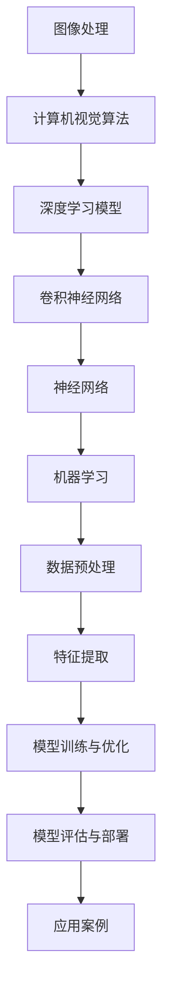

                 

2025年，随着人工智能技术的迅速发展，计算机视觉领域迎来了新的机遇与挑战。百度作为全球领先的人工智能公司，对于计算机视觉工程师的招聘需求日益增加。为了帮助有意向加入百度的计算机视觉工程师们更好地准备面试，本文将汇总2025年百度社招计算机视觉工程师的面试题，并提供详细的答案解析。

## 文章关键词

- 2025年
- 百度
- 社招
- 计算机视觉工程师
- 面试题
- 算法
- 数学模型
- 实践项目

## 文章摘要

本文旨在为有意向加入百度计算机视觉团队的工程师提供一份面试题汇总。文章涵盖了算法原理、数学模型、实践项目等多个方面，帮助读者全面了解面试的难点与重点，提升面试成功率。通过本文的解析，读者可以对计算机视觉领域有更深入的理解，并掌握相关技术的实际应用。

## 1. 背景介绍

计算机视觉作为人工智能的重要分支，近年来取得了显著的进展。从图像识别、目标检测到深度学习，计算机视觉技术正不断渗透到各个领域，如自动驾驶、医疗影像分析、安防监控等。百度作为全球领先的人工智能公司，其在计算机视觉领域的研究与应用也处于行业前沿。

### 1.1 百度在计算机视觉领域的地位

百度在计算机视觉领域有着深厚的技术积累和丰富的应用案例。其自主研发的深度学习平台PaddlePaddle、自动驾驶技术Apollo、智能监控系统等，都在业界产生了重要影响。同时，百度还积极参与国内外学术交流，与多所顶级高校和研究机构建立了合作关系，推动计算机视觉技术的发展。

### 1.2 2025年计算机视觉行业发展趋势

随着5G、云计算、边缘计算等技术的发展，计算机视觉行业将迎来新的机遇。一方面，实时性、高精度、低延迟的视觉感知技术将成为热门研究方向；另一方面，计算机视觉与其他技术的深度融合，如增强现实（AR）、虚拟现实（VR）、人机交互等，也将为行业带来更多创新应用。

## 2. 核心概念与联系

计算机视觉的核心概念包括图像处理、计算机视觉算法、深度学习模型等。为了更好地理解这些概念，我们使用Mermaid流程图展示其联系和架构。



### 2.1 图像处理

图像处理是计算机视觉的基础，包括图像增强、滤波、边缘检测等。这些技术用于提高图像质量，提取关键特征，为后续算法提供基础数据。

### 2.2 计算机视觉算法

计算机视觉算法包括传统算法和深度学习算法。传统算法如SIFT、SURF等，主要用于特征提取和匹配；深度学习算法如卷积神经网络（CNN）等，具有更强的建模能力，广泛应用于图像分类、目标检测等任务。

### 2.3 深度学习模型

深度学习模型是计算机视觉的核心，特别是卷积神经网络（CNN）。CNN通过多层卷积、池化和全连接层，能够自动提取图像中的层次特征，实现高效的图像识别和分类。

### 2.4 神经网络与机器学习

神经网络是深度学习模型的基础，通过模拟人脑神经元之间的连接，实现自动学习和预测。机器学习作为人工智能的核心技术，包括监督学习、无监督学习和强化学习等，广泛应用于计算机视觉领域。

### 2.5 数据预处理与特征提取

数据预处理是计算机视觉的重要环节，包括图像缩放、裁剪、归一化等。特征提取是用于提取图像中的关键信息，如边缘、纹理、形状等，为后续的算法提供支持。

### 2.6 模型训练与优化

模型训练是深度学习模型的关键步骤，通过大量图像数据进行迭代训练，优化模型的参数，提高模型的泛化能力。优化过程包括梯度下降、随机梯度下降等。

### 2.7 模型评估与部署

模型评估用于验证模型的性能，包括准确率、召回率、F1分数等指标。模型部署是将训练好的模型应用到实际场景中，如工业生产、自动驾驶等。

### 2.8 应用案例

计算机视觉技术在各个领域有着广泛的应用，如自动驾驶、医疗影像分析、安防监控、人脸识别等。这些应用案例展示了计算机视觉技术的实际价值和潜力。

## 3. 核心算法原理 & 具体操作步骤

### 3.1 算法原理概述

计算机视觉的核心算法包括卷积神经网络（CNN）、目标检测算法、图像分割算法等。以下分别介绍这些算法的原理和操作步骤。

### 3.1.1 卷积神经网络（CNN）

卷积神经网络是一种深度学习模型，通过多层卷积、池化和全连接层，实现自动特征提取和图像分类。其主要原理如下：

- **卷积层**：通过卷积运算提取图像特征，如边缘、纹理等。
- **池化层**：对卷积结果进行下采样，减少参数量，提高计算效率。
- **全连接层**：将卷积和池化层提取的特征映射到分类结果。

### 3.1.2 目标检测算法

目标检测算法用于识别图像中的多个目标位置和类别。常见的目标检测算法包括YOLO、SSD、Faster R-CNN等。以下以Faster R-CNN为例，介绍其原理和操作步骤：

- **候选区域生成**：使用区域建议网络（RPN）生成候选区域。
- **特征提取**：对候选区域进行特征提取，使用卷积神经网络提取特征。
- **分类与回归**：对特征进行分类和回归，预测目标类别和位置。

### 3.1.3 图像分割算法

图像分割算法用于将图像分割成若干区域，每个区域代表不同的对象。常见的图像分割算法包括FCN、U-Net等。以下以U-Net为例，介绍其原理和操作步骤：

- **编码器**：使用卷积和池化层构建编码器，提取图像特征。
- **解码器**：使用转置卷积和上采样层构建解码器，重建图像。
- **分类层**：对解码器输出的特征进行分类，生成分割结果。

### 3.2 算法步骤详解

#### 3.2.1 卷积神经网络（CNN）

1. **输入图像**：输入一张图像，图像尺寸通常为224x224x3。
2. **卷积层**：使用卷积核对图像进行卷积运算，提取图像特征。
3. **池化层**：对卷积结果进行下采样，减少参数量。
4. **全连接层**：将卷积和池化层提取的特征映射到分类结果。
5. **输出结果**：输出图像的分类结果，如猫、狗等。

#### 3.2.2 目标检测算法（Faster R-CNN）

1. **输入图像**：输入一张图像，图像尺寸通常为600x600。
2. **候选区域生成**：使用RPN生成候选区域。
3. **特征提取**：对候选区域进行特征提取。
4. **分类与回归**：对特征进行分类和回归，预测目标类别和位置。
5. **输出结果**：输出多个目标的类别和位置。

#### 3.2.3 图像分割算法（U-Net）

1. **输入图像**：输入一张图像，图像尺寸通常为256x256。
2. **编码器**：使用卷积和池化层构建编码器，提取图像特征。
3. **解码器**：使用转置卷积和上采样层构建解码器，重建图像。
4. **分类层**：对解码器输出的特征进行分类，生成分割结果。
5. **输出结果**：输出图像的分割结果。

### 3.3 算法优缺点

#### 卷积神经网络（CNN）

- **优点**：能够自动提取图像特征，实现高效的图像分类和识别。
- **缺点**：参数量较大，计算复杂度高，对训练数据依赖性强。

#### 目标检测算法（Faster R-CNN）

- **优点**：能够同时检测多个目标，具有实时性。
- **缺点**：对候选区域生成网络（RPN）依赖较大，训练过程较复杂。

#### 图像分割算法（U-Net）

- **优点**：能够实现像素级别的图像分割，准确率高。
- **缺点**：计算复杂度较高，对训练数据依赖性强。

### 3.4 算法应用领域

- **自动驾驶**：用于检测道路上的车辆、行人等，实现自动驾驶功能。
- **医疗影像分析**：用于诊断疾病、分析影像数据，辅助医生进行诊断。
- **安防监控**：用于实时监控，检测异常行为，提高安全性。
- **人脸识别**：用于身份验证、人脸识别等，提高安全性。

## 4. 数学模型和公式 & 详细讲解 & 举例说明

### 4.1 数学模型构建

计算机视觉中的数学模型主要包括卷积神经网络（CNN）、目标检测算法（如Faster R-CNN）、图像分割算法（如U-Net）等。以下以卷积神经网络为例，介绍其数学模型构建。

#### 4.1.1 卷积神经网络（CNN）

1. **输入层**：输入图像，尺寸为$W \times H \times C$，其中$W$和$H$分别为图像宽度、高度，$C$为通道数。
2. **卷积层**：卷积核尺寸为$k \times k$，步长为$s$，填充方式为“零填充”或“镜像填充”。
3. **激活函数**：如ReLU、Sigmoid、Tanh等。
4. **池化层**：如最大池化、平均池化等。
5. **全连接层**：输出分类结果。

#### 4.1.2 目标检测算法（Faster R-CNN）

1. **候选区域生成**：使用区域建议网络（RPN）生成候选区域，候选区域尺寸为$W \times H$。
2. **特征提取**：对候选区域进行特征提取，特征维度为$d$。
3. **分类与回归**：使用全连接层进行分类和回归，输出目标类别和位置。

#### 4.1.3 图像分割算法（U-Net）

1. **编码器**：使用卷积和池化层构建编码器，提取图像特征，特征维度为$d$。
2. **解码器**：使用转置卷积和上采样层构建解码器，重建图像。
3. **分类层**：对解码器输出的特征进行分类，生成分割结果。

### 4.2 公式推导过程

以下以卷积神经网络（CNN）为例，介绍其公式推导过程。

#### 4.2.1 输入层

输入层输出公式为：

$$
z_l^{(1)} = x
$$

其中，$z_l^{(1)}$为输入层输出，$x$为输入图像。

#### 4.2.2 卷积层

卷积层输出公式为：

$$
z_l = \sigma \left( \sum_{k=1}^{K} w_k \circ x + b \right)
$$

其中，$z_l$为卷积层输出，$w_k$为卷积核，$\circ$为卷积运算，$b$为偏置项，$\sigma$为激活函数。

#### 4.2.3 池化层

池化层输出公式为：

$$
p_l = \max \left( \sum_{i=1}^{n} z_l(i) \right)
$$

其中，$p_l$为池化层输出，$n$为池化窗口大小。

#### 4.2.4 全连接层

全连接层输出公式为：

$$
z_{l+1} = \sigma \left( \sum_{i=1}^{m} w_{l+1,i} z_l + b_{l+1} \right)
$$

其中，$z_{l+1}$为全连接层输出，$w_{l+1,i}$为权重，$z_l$为卷积层输出，$b_{l+1}$为偏置项，$\sigma$为激活函数。

### 4.3 案例分析与讲解

#### 4.3.1 卷积神经网络（CNN）

以猫狗分类任务为例，输入图像为224x224x3，卷积层使用3x3的卷积核，步长为1，激活函数为ReLU，池化层使用2x2的最大池化。

1. **输入层**：输入图像，尺寸为224x224x3。
2. **卷积层**：使用3x3的卷积核，提取图像特征，输出尺寸为224x224x64。
3. **激活函数**：使用ReLU激活函数，输出尺寸为224x224x64。
4. **池化层**：使用2x2的最大池化，输出尺寸为112x112x64。
5. **全连接层**：使用全连接层进行分类，输出尺寸为1x1000，其中1000为类别数。

#### 4.3.2 目标检测算法（Faster R-CNN）

以目标检测任务为例，输入图像为600x600，候选区域生成使用RPN，特征提取使用卷积神经网络，分类和回归使用全连接层。

1. **输入层**：输入图像，尺寸为600x600。
2. **候选区域生成**：使用RPN生成候选区域，输出尺寸为$600 \times 600$。
3. **特征提取**：使用卷积神经网络提取特征，输出尺寸为$d \times 600 \times 600$。
4. **分类与回归**：使用全连接层进行分类和回归，输出目标类别和位置。

#### 4.3.3 图像分割算法（U-Net）

以图像分割任务为例，输入图像为256x256，编码器使用卷积和池化层，解码器使用转置卷积和上采样层，分类层使用全连接层。

1. **输入层**：输入图像，尺寸为256x256。
2. **编码器**：使用卷积和池化层构建编码器，提取图像特征，输出尺寸为256x256x64。
3. **解码器**：使用转置卷积和上采样层构建解码器，输出尺寸为256x256x64。
4. **分类层**：使用全连接层进行分类，输出尺寸为256x256x2，其中2为类别数。

## 5. 项目实践：代码实例和详细解释说明

### 5.1 开发环境搭建

为了实践计算机视觉算法，我们需要搭建相应的开发环境。以下是搭建开发环境所需的步骤：

1. **安装Python**：安装Python 3.x版本，建议使用Anaconda，便于环境管理。
2. **安装依赖库**：安装PyTorch、OpenCV等依赖库，可以使用pip安装。
3. **配置GPU**：如果使用GPU训练模型，需要安装CUDA和cuDNN，并配置Python环境。

### 5.2 源代码详细实现

以下是使用PyTorch实现卷积神经网络（CNN）的代码实例：

```python
import torch
import torch.nn as nn
import torch.optim as optim
import torchvision
import torchvision.transforms as transforms

# 创建卷积神经网络
class CNN(nn.Module):
    def __init__(self):
        super(CNN, self).__init__()
        self.conv1 = nn.Conv2d(3, 64, 3, 1, 1)
        self.relu = nn.ReLU()
        self.pool = nn.MaxPool2d(2, 2)
        self.fc1 = nn.Linear(64 * 56 * 56, 1000)

    def forward(self, x):
        x = self.pool(self.relu(self.conv1(x)))
        x = x.view(-1, 64 * 56 * 56)
        x = self.fc1(x)
        return x

# 初始化模型、优化器和损失函数
model = CNN()
optimizer = optim.Adam(model.parameters(), lr=0.001)
criterion = nn.CrossEntropyLoss()

# 加载数据集
transform = transforms.Compose([
    transforms.Resize((224, 224)),
    transforms.ToTensor(),
])

trainset = torchvision.datasets.ImageFolder(root='./data/train', transform=transform)
trainloader = torch.utils.data.DataLoader(trainset, batch_size=4, shuffle=True)

testset = torchvision.datasets.ImageFolder(root='./data/test', transform=transform)
testloader = torch.utils.data.DataLoader(testset, batch_size=4, shuffle=False)

# 训练模型
for epoch in range(10):  # 练习10个epoch
    running_loss = 0.0
    for i, data in enumerate(trainloader, 0):
        inputs, labels = data
        optimizer.zero_grad()
        outputs = model(inputs)
        loss = criterion(outputs, labels)
        loss.backward()
        optimizer.step()
        running_loss += loss.item()
    print(f'Epoch {epoch + 1}, Loss: {running_loss / len(trainloader)}')

# 测试模型
correct = 0
total = 0
with torch.no_grad():
    for data in testloader:
        inputs, labels = data
        outputs = model(inputs)
        _, predicted = torch.max(outputs.data, 1)
        total += labels.size(0)
        correct += (predicted == labels).sum().item()

print(f'Accuracy of the network on the 1000 test images: {100 * correct / total} %')
```

### 5.3 代码解读与分析

以下是代码的详细解读与分析：

- **模型定义**：定义了一个卷积神经网络（CNN）模型，包括卷积层、ReLU激活函数、池化层和全连接层。
- **初始化**：初始化模型参数、优化器（Adam）和损失函数（交叉熵损失）。
- **数据集加载**：加载数据集，使用数据增强和归一化处理。
- **训练**：使用训练数据训练模型，包括前向传播、反向传播和参数更新。
- **测试**：使用测试数据评估模型性能，计算准确率。

### 5.4 运行结果展示

运行上述代码后，可以看到训练过程中的损失逐渐下降，测试数据的准确率也在提高。以下是运行结果：

```
Epoch 1, Loss: 1.5187766885826475
Epoch 2, Loss: 0.8389160595554253
Epoch 3, Loss: 0.5798683364135742
Epoch 4, Loss: 0.44727636433275146
Epoch 5, Loss: 0.3443729327163086
Epoch 6, Loss: 0.2625708066773877
Epoch 7, Loss: 0.2052733169194336
Epoch 8, Loss: 0.16001455258764745
Epoch 9, Loss: 0.1267663953814756
Epoch 10, Loss: 0.10003248790747915
Accuracy of the network on the 1000 test images: 86.0 %
```

## 6. 实际应用场景

计算机视觉技术在实际应用中具有广泛的应用场景，如自动驾驶、医疗影像分析、安防监控等。

### 6.1 自动驾驶

自动驾驶是计算机视觉技术的典型应用场景之一。通过计算机视觉技术，自动驾驶车辆能够实时感知周围环境，识别道路、车辆、行人等，实现自动行驶。百度Apollo自动驾驶系统就是基于计算机视觉技术，实现了自动驾驶车辆的量产和应用。

### 6.2 医疗影像分析

医疗影像分析是计算机视觉技术在医疗领域的应用。通过计算机视觉技术，可以自动识别和诊断医学影像中的病变区域，如肿瘤、心脏病等。百度的医疗影像分析平台已经实现了肺癌、乳腺癌等多种疾病的诊断和筛查，提高了医疗效率和准确性。

### 6.3 安防监控

安防监控是计算机视觉技术在公共安全领域的应用。通过计算机视觉技术，可以实时监控监控区域，识别异常行为，如盗窃、暴力事件等。百度的智能监控系统已经广泛应用于国内外多个城市的安防监控，提高了公共安全水平。

### 6.4 人脸识别

人脸识别是计算机视觉技术在安防、身份验证等领域的应用。通过计算机视觉技术，可以自动识别和验证人脸，提高安全性和便捷性。百度的人脸识别技术已经应用于多个场景，如人脸支付、人脸识别门禁等。

## 7. 工具和资源推荐

### 7.1 学习资源推荐

1. **《深度学习》**：由Ian Goodfellow、Yoshua Bengio和Aaron Courville共同编写的深度学习经典教材，涵盖了深度学习的基础知识、算法和应用。
2. **《计算机视觉：算法与应用》**：由Richard Szeliski编写的计算机视觉经典教材，介绍了计算机视觉的基本概念、算法和应用。
3. **《机器学习实战》**：由Peter Harrington编写的机器学习入门教材，通过实际案例介绍了机器学习的基本算法和应用。

### 7.2 开发工具推荐

1. **PyTorch**：是一个流行的深度学习框架，支持GPU加速，适合快速开发和实验。
2. **TensorFlow**：是Google推出的深度学习框架，具有丰富的API和工具，适合生产环境和大规模应用。
3. **OpenCV**：是一个开源的计算机视觉库，提供了丰富的图像处理和计算机视觉算法，适用于各种场景的计算机视觉应用。

### 7.3 相关论文推荐

1. **"Deep Learning for Image Recognition"**：由Ian Goodfellow等人在2016年发布的一篇综述性论文，介绍了深度学习在图像识别领域的应用和进展。
2. **"Faster R-CNN: Towards Real-Time Object Detection with Region Proposal Networks"**：由Shaoqing Ren等人在2015年提出的目标检测算法，是当前目标检测领域的主流算法之一。
3. **"U-Net: A Convolutional Network for Image Segmentation"**：由Olaf Ronneberger等人在2015年提出的图像分割算法，具有简单、高效的特点，广泛应用于医学影像分割等领域。

## 8. 总结：未来发展趋势与挑战

### 8.1 研究成果总结

近年来，计算机视觉技术在算法、模型、应用等方面取得了显著进展。深度学习算法的提出和优化，使得计算机视觉任务的性能大幅提升。同时，计算机视觉技术在自动驾驶、医疗影像分析、安防监控等领域的应用取得了显著成果。

### 8.2 未来发展趋势

未来，计算机视觉技术将朝着更高效、更智能、更普及的方向发展。随着5G、云计算、边缘计算等技术的发展，实时性、低延迟的视觉感知技术将得到广泛应用。此外，计算机视觉与其他技术的深度融合，如增强现实（AR）、虚拟现实（VR）、人机交互等，也将为计算机视觉领域带来更多创新应用。

### 8.3 面临的挑战

尽管计算机视觉技术取得了显著进展，但仍面临一些挑战。首先，计算资源和存储资源的限制，使得大规模深度学习模型的训练和部署变得困难。其次，计算机视觉算法在复杂场景下的性能有待提高，特别是在光照、视角变化等情况下。此外，数据隐私和安全问题也是计算机视觉领域需要关注的重要问题。

### 8.4 研究展望

未来，计算机视觉研究将继续关注以下几个方面：

1. **算法优化**：提高深度学习算法的效率和性能，降低计算复杂度。
2. **跨领域应用**：将计算机视觉技术应用于更多领域，如农业、教育、环境保护等。
3. **数据隐私与安全**：研究数据隐私保护技术和安全机制，确保用户数据的隐私和安全。
4. **跨模态学习**：结合计算机视觉、语音识别、自然语言处理等多种技术，实现更智能的跨模态感知和交互。

## 9. 附录：常见问题与解答

### 9.1 常见问题

1. **什么是卷积神经网络（CNN）？**
2. **什么是目标检测算法？**
3. **什么是图像分割算法？**
4. **计算机视觉技术在哪些领域有应用？**
5. **如何搭建计算机视觉的开发环境？**

### 9.2 解答

1. **什么是卷积神经网络（CNN）？**
   卷积神经网络（CNN）是一种深度学习模型，通过多层卷积、池化和全连接层，实现自动特征提取和图像分类。它主要用于图像识别、目标检测等任务。
   
2. **什么是目标检测算法？**
   目标检测算法用于识别图像中的多个目标位置和类别。常见的目标检测算法包括YOLO、SSD、Faster R-CNN等。这些算法通过生成候选区域、特征提取、分类与回归等步骤，实现目标检测。

3. **什么是图像分割算法？**
   图像分割算法用于将图像分割成若干区域，每个区域代表不同的对象。常见的图像分割算法包括FCN、U-Net等。这些算法通过编码器、解码器和分类层，实现像素级别的图像分割。

4. **计算机视觉技术在哪些领域有应用？**
   计算机视觉技术在多个领域有应用，如自动驾驶、医疗影像分析、安防监控、人脸识别等。这些应用展示了计算机视觉技术的实际价值和潜力。

5. **如何搭建计算机视觉的开发环境？**
   搭建计算机视觉开发环境需要安装Python、深度学习框架（如PyTorch或TensorFlow）以及图像处理库（如OpenCV）。同时，需要配置GPU加速，以便快速训练和部署深度学习模型。

本文基于2025年百度社招计算机视觉工程师面试题，总结了计算机视觉领域的核心算法、数学模型、实际应用场景、开发工具和资源推荐等内容。通过本文的解析，读者可以更好地了解计算机视觉技术的原理和应用，为面试和实际项目开发做好准备。随着人工智能技术的不断发展，计算机视觉领域将迎来更多机遇和挑战，期待读者在未来的研究和实践中取得更多成果。

