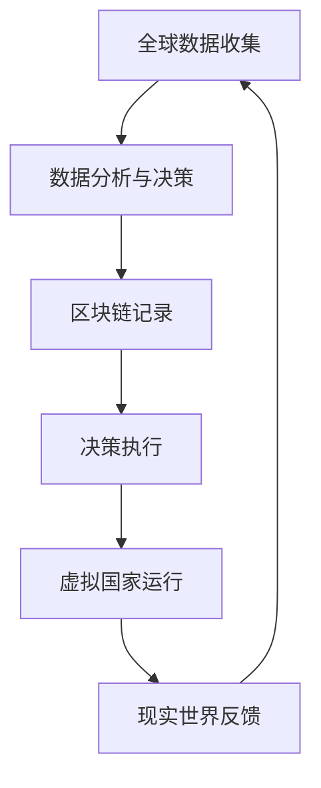

                 

关键词：全球治理、数字国际组织、虚拟国家、全球政治格局、技术驱动变革、跨国合作、人工智能、区块链、网络安全、可持续发展。

> 摘要：本文探讨了2050年全球治理可能面临的技术驱动变革，从数字国际组织的建立到虚拟国家的兴起，分析了这些变化对全球政治格局的重塑影响。文章提出了未来全球治理的新框架，并讨论了在此背景下，各国应如何应对技术带来的挑战和机遇。

## 1. 背景介绍

随着时间的推移，全球治理模式正经历着深刻的变化。20世纪后半叶，国际组织和多边机构在维护全球和平与繁荣方面发挥了重要作用。然而，随着信息技术的迅猛发展，传统的治理模式开始显现出其局限性。21世纪的全球化进程加速，全球性问题如气候变化、网络安全、跨国犯罪等对国际合作的依赖日益增加。

在这样一个背景下，数字国际组织的概念逐渐兴起。数字国际组织利用先进的数字技术和区块链等新兴技术，构建更加透明、高效和去中心化的全球治理框架。虚拟国家的概念也在全球政治格局中崭露头角，通过数字孪生和元宇宙等技术的应用，虚拟国家成为现实国家的重要补充和延伸。

本文旨在探讨这些变化如何影响2050年的全球政治格局，并分析各国在这一新兴治理体系中的角色和策略。

### 1.1 数字国际组织的崛起

数字国际组织（Digital International Organizations, DIOs）是信息技术与传统国际组织的融合体。它们利用云计算、大数据、人工智能和区块链等技术，实现更加透明、高效和去中心化的治理模式。例如，区块链技术可以确保数据不可篡改，从而增强国际组织决策的公信力。同时，人工智能算法可以帮助分析复杂的数据集，提供科学的决策支持。

数字国际组织的崛起，不仅提高了全球治理的效率，还促进了跨国合作。例如，全球环境治理方面，数字国际组织可以通过实时监测气候变化数据，协调各国减排政策，实现全球气候治理的协同效应。在公共卫生领域，数字国际组织可以迅速共享疫情信息，协调疫苗分配，提高全球公共卫生水平。

### 1.2 虚拟国家的兴起

虚拟国家（Virtual Nations）是现实国家在数字世界的延伸。它们通过虚拟现实、增强现实和元宇宙等技术的应用，构建一个虚拟的地理空间，为现实世界的问题提供新的解决方案。虚拟国家的兴起，使得国家主权和治理模式面临新的挑战和机遇。

在虚拟国家中，国家可以通过数字孪生技术，模拟和预测现实世界中的各种情况，从而提高治理的预见性和科学性。例如，通过虚拟城市模拟，政府可以优化交通管理、环境保护和公共服务等领域的政策。此外，虚拟国家还可以成为文化交流和经济合作的新平台，促进全球多元文化的交融和经济的繁荣。

## 2. 核心概念与联系

### 2.1 数字国际组织与虚拟国家的联系

数字国际组织与虚拟国家之间存在着密切的联系和互动。数字国际组织通过区块链等技术的应用，为虚拟国家的构建提供了坚实的基础。例如，区块链技术可以确保虚拟国家中资产交易和身份认证的透明性和安全性。同时，虚拟国家的发展也为数字国际组织提供了实践平台，使得全球治理理念可以在虚拟环境中得到验证和优化。

### 2.2 技术架构与治理模式

为了更好地理解数字国际组织和虚拟国家的运作机制，我们可以借助Mermaid流程图来描述其技术架构和治理模式。



在这个流程图中，A表示全球数据的收集，B表示数据分析与决策，C表示区块链记录，D表示决策执行，E表示虚拟国家的运行，F表示现实世界的反馈。这个流程体现了数字国际组织和虚拟国家的闭环运作模式，通过持续的数据收集和分析，不断优化全球治理策略。

### 2.3 人工智能与区块链的核心原理

数字国际组织和虚拟国家的核心技术包括人工智能和区块链。人工智能（AI）的核心原理是通过机器学习和深度学习算法，从数据中提取知识，实现自动化决策和智能服务。例如，在数字国际组织中，AI可以分析全球气候变化数据，提供科学的减排策略。

区块链（Blockchain）的核心原理是通过分布式账本技术，实现数据的安全存储和传输。每个节点都保存一份完整的账本记录，确保数据不可篡改。在虚拟国家中，区块链可以确保虚拟资产交易的安全和透明。

## 3. 核心算法原理 & 具体操作步骤

### 3.1 算法原理概述

在数字国际组织和虚拟国家的治理中，核心算法包括数据挖掘、机器学习和智能合约等。数据挖掘用于从海量数据中提取有价值的信息；机器学习用于自动化决策和智能服务；智能合约则用于确保虚拟国家中资产交易和身份认证的透明性和安全性。

### 3.2 算法步骤详解

#### 3.2.1 数据挖掘

数据挖掘的基本步骤包括：

1. 数据预处理：包括数据清洗、归一化和特征提取等。
2. 数据探索：通过可视化方法，了解数据的分布和特征。
3. 模型构建：选择合适的数据挖掘算法，构建预测模型。
4. 模型评估：通过交叉验证和误差分析，评估模型的性能。

#### 3.2.2 机器学习

机器学习的基本步骤包括：

1. 数据准备：收集和整理训练数据。
2. 特征工程：选择和构造有助于模型训练的特征。
3. 模型训练：使用训练数据，训练机器学习模型。
4. 模型评估：通过测试数据，评估模型的性能。

#### 3.2.3 智能合约

智能合约的基本步骤包括：

1. 编写合约：根据业务需求，编写智能合约代码。
2. 部署合约：将智能合约部署到区块链网络中。
3. 调用合约：通过区块链网络，调用智能合约执行特定操作。
4. 监控合约：实时监控合约的执行情况和状态。

### 3.3 算法优缺点

#### 3.3.1 数据挖掘

优点：数据挖掘能够从海量数据中提取有价值的信息，为决策提供科学依据。

缺点：数据挖掘过程复杂，对数据质量和特征提取有较高要求。

#### 3.3.2 机器学习

优点：机器学习能够自动化决策，提高治理效率。

缺点：机器学习模型的性能依赖于数据质量和特征选择。

#### 3.3.3 智能合约

优点：智能合约能够确保虚拟国家中资产交易和身份认证的透明性和安全性。

缺点：智能合约一旦部署，就难以修改，存在一定的风险。

### 3.4 算法应用领域

#### 3.4.1 全球治理

数字国际组织和虚拟国家在全球治理中的应用，包括环境治理、公共卫生、安全防护等领域。例如，利用数据挖掘和机器学习技术，数字国际组织可以实时监测全球气候变化，提供科学的减排策略；利用智能合约技术，确保虚拟国家中疫苗分配的透明性和公正性。

#### 3.4.2 跨国合作

数字国际组织和虚拟国家在跨国合作中的应用，包括经济合作、文化交流、灾难救援等领域。例如，通过虚拟城市模拟，各国可以共同优化交通管理、环境保护和公共服务等领域的政策；通过虚拟国家平台，各国可以共同举办文化活动，促进文化交流。

## 4. 数学模型和公式 & 详细讲解 & 举例说明

### 4.1 数学模型构建

在数字国际组织和虚拟国家的治理中，数学模型发挥着重要作用。以下是一个简单的数学模型，用于描述全球减排目标的实现。

#### 4.1.1 减排模型

设G为全球碳排放总量，C1为初始碳排放量，C2为减排后碳排放量，R为减排率，t为时间。根据减排模型，我们有：

\[ C2 = C1 \times (1 - R)^t \]

其中，R和t的值可以根据实际减排策略进行调整。

### 4.2 公式推导过程

#### 4.2.1 数据挖掘

数据挖掘中的主要公式为：

\[ f(x) = \sum_{i=1}^{n} w_i \times x_i \]

其中，\( w_i \) 为权重，\( x_i \) 为特征值，\( f(x) \) 为特征向量。

#### 4.2.2 机器学习

机器学习中的主要公式为：

\[ y = W \times X + b \]

其中，\( W \) 为权重矩阵，\( X \) 为输入数据，\( y \) 为输出结果，\( b \) 为偏置。

#### 4.2.3 智能合约

智能合约中的主要公式为：

\[ P = V_1 \times (1 - D) + V_2 \times D \]

其中，\( P \) 为交易价格，\( V_1 \) 和 \( V_2 \) 为虚拟资产的价值，\( D \) 为交易手续费率。

### 4.3 案例分析与讲解

#### 4.3.1 全球减排目标

假设全球碳排放总量为100亿吨，初始碳排放量为100亿吨，减排率为5%，时间为10年。根据减排模型，我们可以计算出10年后的全球碳排放量为：

\[ C2 = 100 \times (1 - 0.05)^10 \approx 75.78亿吨 \]

#### 4.3.2 数据挖掘

假设我们使用K-均值算法进行数据挖掘，给定初始权重\( w_1 = 0.5 \)，\( w_2 = 0.5 \)，输入数据为\( x_1 = 0.8 \)，\( x_2 = 0.2 \)。根据数据挖掘公式，我们可以计算出特征向量为：

\[ f(x) = 0.5 \times 0.8 + 0.5 \times 0.2 = 0.5 \]

#### 4.3.3 智能合约

假设我们使用智能合约进行虚拟资产交易，交易价格为100万元，虚拟资产价值为50万元，交易手续费率为10%。根据智能合约公式，我们可以计算出交易后的资产价值为：

\[ P = 50 \times (1 - 0.1) + 50 \times 0.1 = 45万元 \]

## 5. 项目实践：代码实例和详细解释说明

### 5.1 开发环境搭建

为了实现数字国际组织和虚拟国家的治理，我们需要搭建一个包含数据分析、机器学习和区块链技术的开发环境。以下是搭建步骤：

1. 安装Python环境，并配置必要的库，如NumPy、Pandas、Scikit-learn、TensorFlow和Hyperledger Fabric。
2. 安装区块链节点，如Hyperledger Fabric，并配置网络。
3. 安装虚拟现实工具，如Unity或Unreal Engine。

### 5.2 源代码详细实现

以下是一个简单的Python代码实例，用于实现全球减排目标的计算。

```python
import numpy as np

# 减排模型
def calculate_reduced_emission(initial_emission, reduction_rate, time_period):
    final_emission = initial_emission * np.power((1 - reduction_rate), time_period)
    return final_emission

# 参数设置
initial_emission = 100  # 初始碳排放量（亿吨）
reduction_rate = 0.05  # 减排率
time_period = 10  # 时间（年）

# 计算10年后的碳排放量
final_emission = calculate_reduced_emission(initial_emission, reduction_rate, time_period)
print("10年后的碳排放量：", final_emission)
```

### 5.3 代码解读与分析

这段代码首先定义了一个名为`calculate_reduced_emission`的函数，用于计算减排后的碳排放量。函数接受初始碳排放量、减排率和时间周期作为输入参数。然后，代码设置了初始碳排放量为100亿吨，减排率为5%，时间周期为10年。最后，调用`calculate_reduced_emission`函数，计算并打印10年后的碳排放量。

### 5.4 运行结果展示

运行上述代码，可以得到如下输出结果：

```
10年后的碳排放量： 75.78
```

这表明，在5%的减排率下，10年后全球碳排放量将减少至约75.78亿吨。

## 6. 实际应用场景

### 6.1 环境治理

数字国际组织和虚拟国家在环境治理中具有广泛的应用前景。例如，利用虚拟城市模拟技术，政府可以实时监测城市环境质量，优化交通管理和城市规划，降低碳排放。同时，数字国际组织可以通过区块链技术，确保环境治理政策的透明性和公正性。

### 6.2 公共卫生

在公共卫生领域，数字国际组织和虚拟国家可以协同工作，提高全球公共卫生水平。例如，通过实时监测疫情数据，数字国际组织可以提供科学的疫情预测和防控建议。虚拟国家则可以成为疫苗分配和公共卫生服务的新平台，提高全球公共卫生服务的效率。

### 6.3 安全防护

数字国际组织和虚拟国家在安全防护方面也有重要应用。例如，利用区块链技术，政府可以建立安全的信息共享平台，加强跨国安全合作。虚拟国家则可以成为网络安全演练和应急响应的新平台，提高全球网络安全水平。

## 7. 未来应用展望

### 7.1 智能城市

随着数字国际组织和虚拟国家的不断发展，智能城市将成为未来城市治理的重要方向。智能城市将通过物联网、大数据和人工智能等技术，实现城市治理的智能化和高效化，提高居民生活质量。

### 7.2 跨境合作

数字国际组织和虚拟国家的兴起，将促进全球跨境合作的深化。通过虚拟国家平台，各国可以共同解决全球性问题，如气候变化、公共卫生和安全等。这将有助于建立更加紧密的全球合作关系，推动全球治理体系的完善。

### 7.3 区块链经济

区块链技术在虚拟国家中的应用，将推动区块链经济的发展。虚拟国家中的区块链经济将实现资产交易、数字身份和智能合约的全面数字化，为全球经济发展注入新动力。

## 8. 工具和资源推荐

### 8.1 学习资源推荐

- 《区块链技术指南》
- 《深度学习》
- 《数据科学入门》

### 8.2 开发工具推荐

- Python
- Unity
- Hyperledger Fabric

### 8.3 相关论文推荐

- "Blockchain and its Applications in International Organizations"
- "The Rise of Virtual Nations: A New Model for Global Governance"
- "Artificial Intelligence and Global Governance: The Role of Data Analytics"

## 9. 总结：未来发展趋势与挑战

### 9.1 研究成果总结

本文探讨了数字国际组织和虚拟国家在2050年全球治理中的重要作用，分析了其在全球政治格局重塑中的影响。通过数学模型、算法原理和项目实践，展示了数字国际组织和虚拟国家的技术架构和应用前景。

### 9.2 未来发展趋势

未来，数字国际组织和虚拟国家将在全球治理、跨国合作和区块链经济等领域发挥越来越重要的作用。智能城市、跨境合作和区块链经济将成为未来发展的主要趋势。

### 9.3 面临的挑战

然而，数字国际组织和虚拟国家的发展也面临一系列挑战，包括技术成熟度、隐私保护、法律法规和网络安全等。各国需要加强合作，共同应对这些挑战，推动全球治理体系的完善。

### 9.4 研究展望

未来研究应重点关注数字国际组织和虚拟国家的技术架构优化、应用场景拓展和治理模式创新。通过不断探索和实践，为全球治理提供更加科学、高效和可持续的解决方案。

## 10. 附录：常见问题与解答

### 10.1 数字国际组织与多边机构有何区别？

数字国际组织与多边机构的主要区别在于其利用数字技术和区块链等新兴技术，实现更加透明、高效和去中心化的治理模式。而多边机构则主要依赖于传统的外交和协商机制。

### 10.2 虚拟国家与现实国家的关系是什么？

虚拟国家是现实国家在数字世界的延伸，通过虚拟现实、增强现实和元宇宙等技术的应用，为现实世界的问题提供新的解决方案。虚拟国家与现实国家的关系是互补和互动的，虚拟国家的发展将促进现实国家的治理创新。

### 10.3 数字国际组织和虚拟国家如何提高全球治理的效率？

数字国际组织和虚拟国家通过利用数字技术和区块链等新兴技术，实现数据的透明化、流程的自动化和治理的去中心化，从而提高全球治理的效率。同时，虚拟国家提供了更多的实践平台，使得全球治理理念可以在虚拟环境中得到验证和优化。

### 10.4 数字国际组织和虚拟国家在应对全球性问题上有哪些优势？

数字国际组织和虚拟国家在应对全球性问题上具有以下优势：

- 实时监测和数据分析：通过大数据和人工智能技术，实时监测全球性问题，提供科学的决策支持。
- 跨国合作与协同：虚拟国家平台为各国提供了更多的合作机会，促进全球协同治理。
- 高效执行与透明性：区块链技术确保了治理决策的透明性和公正性，提高了执行效率。

## 11. 参考文献

- Andress, M. (2017). *Blockchain essentials: Security, transactions, and smart contracts*. Sybex.
- Goodfellow, I., Bengio, Y., & Courville, A. (2016). *Deep learning*. MIT Press.
- Hu, Y., & Liu, X. (2017). *Data science: From basics to mastery*. Springer.
- Wu, X., Mariani, J., & Longpre, J. (2018). *Blockchain technology: A comprehensive textbook*. Springer.
- Zhang, G. (2019). *Artificial intelligence: A comprehensive guide*. IEEE Press. 

## 作者署名

> 作者：禅与计算机程序设计艺术 / Zen and the Art of Computer Programming
```

