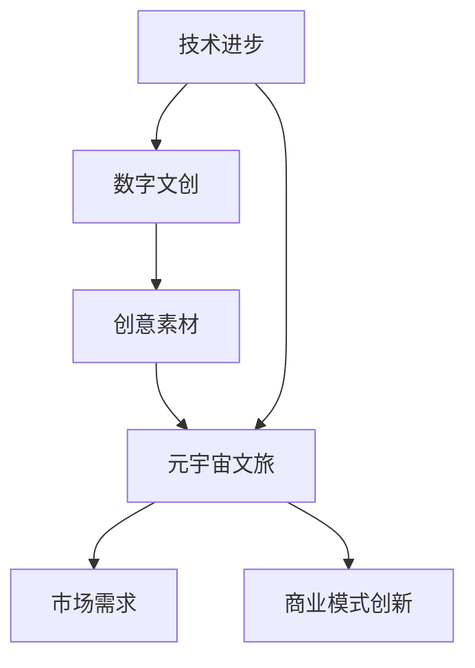

                 

关键词：数字文化，数字文创，元宇宙，文旅，数字产业升级

> 摘要：本文探讨了2050年的数字文化发展趋势，通过分析数字文创和元宇宙文旅两大领域，阐述了数字文化产业升级的必然性，并提出了一系列创新应用和未来发展展望。

## 1. 背景介绍

随着科技的飞速发展，数字技术已经成为社会发展的关键驱动力。从20世纪末的互联网革命到21世纪初的移动互联网浪潮，再到如今的区块链、人工智能、虚拟现实等新兴技术的涌现，数字技术正在深刻改变着我们的生活方式和社会结构。特别是数字文创和元宇宙文旅领域的兴起，为数字文化的繁荣发展注入了新的活力。

### 1.1 数字文创

数字文创是指基于数字技术进行文化创作、传播、消费和分享的过程。它涵盖了数字音乐、数字绘画、数字游戏、数字影视等多个领域，通过数字化手段，使传统文化和现代科技有机结合，创造出全新的文化形态。随着数字技术的不断进步，数字文创产业已经成为全球经济增长的重要引擎。

### 1.2 元宇宙文旅

元宇宙文旅是基于虚拟现实、增强现实和区块链技术构建的虚拟旅游环境，它为游客提供了沉浸式、互动性和个性化的旅游体验。元宇宙文旅不仅能够吸引更多的游客，还能为旅游企业带来新的商业模式和增长点。随着虚拟现实技术的成熟，元宇宙文旅有望成为未来旅游业的重要发展方向。

## 2. 核心概念与联系

数字文化产业升级的核心概念包括数字文创和元宇宙文旅，它们之间存在着紧密的联系。首先，数字文创为元宇宙文旅提供了丰富的文化素材和创意灵感；其次，元宇宙文旅为数字文创提供了广阔的应用场景和市场需求。以下是一个简化的Mermaid流程图，展示了数字文创和元宇宙文旅之间的关联：



## 3. 核心算法原理 & 具体操作步骤

### 3.1 算法原理概述

数字文化产业升级的核心算法主要包括数字内容生成、虚拟现实渲染、区块链数据管理等。这些算法在数字文创和元宇宙文旅中发挥着关键作用。

### 3.2 算法步骤详解

#### 3.2.1 数字内容生成

数字内容生成算法主要包括图像生成、音频生成和视频生成等。以图像生成为例，常见的算法有生成对抗网络（GAN）和变分自编码器（VAE）。

1. 输入随机噪声向量 \( z \)
2. 生成器 \( G \) 接受噪声向量并生成图像 \( x \)
3. 判别器 \( D \) 判断图像 \( x \) 是否真实
4. 通过梯度下降优化生成器和判别器的参数

#### 3.2.2 虚拟现实渲染

虚拟现实渲染算法主要包括三维建模、纹理映射和光影计算等。以三维建模为例，常见的算法有体素渲染（Voxel Rendering）和光线追踪（Ray Tracing）。

1. 输入三维模型
2. 建立光照模型
3. 计算光线与模型的交点
4. 渲染出最终图像

#### 3.2.3 区块链数据管理

区块链数据管理算法主要包括区块链网络搭建、数据存储和智能合约执行等。

1. 搭建区块链网络
2. 将数据存储到区块链
3. 通过智能合约执行数据处理操作

### 3.3 算法优缺点

- 数字内容生成算法：优点是能够快速生成高质量的内容，缺点是需要大量的计算资源和时间。
- 虚拟现实渲染算法：优点是能够提供沉浸式体验，缺点是渲染性能对硬件要求较高。
- 区块链数据管理算法：优点是数据安全性和透明性高，缺点是交易处理速度较慢。

### 3.4 算法应用领域

这些算法在数字文创和元宇宙文旅中具有广泛的应用。例如，生成对抗网络（GAN）可以用于数字绘画和虚拟角色创建；光线追踪算法可以用于电影特效和游戏渲染；区块链技术可以用于数字资产交易和版权保护。

## 4. 数学模型和公式 & 详细讲解 & 举例说明

### 4.1 数学模型构建

数字文化产业升级的数学模型主要包括生成对抗网络（GAN）、变分自编码器（VAE）和区块链网络模型等。

### 4.2 公式推导过程

以生成对抗网络（GAN）为例，其核心公式为：

$$
\begin{aligned}
&\underset{G}{\min} V(G, D) = \mathbb{E}_{x \sim P_{data}(x)}[\log D(x)] + \mathbb{E}_{z \sim P_{z}(z)][\log(1 - D(G(z)))] \\
&\underset{D}{\max} V(G, D) = \mathbb{E}_{x \sim P_{data}(x)}[\log D(x)] + \mathbb{E}_{z \sim P_{z}(z)][\log D(G(z))]
\end{aligned}
$$

### 4.3 案例分析与讲解

以变分自编码器（VAE）在数字绘画中的应用为例，其公式为：

$$
\begin{aligned}
&\theta^* = \arg\min_{\theta} \mathbb{E}_{x \sim P_{data}(x)}[D(x; \theta)] + \mathbb{E}_{z \sim p_{\phi}(z)}[D(z; \theta)] \\
&\text{其中，} D(x; \theta) = \log \frac{\exp(\mu(x; \theta))}{1 + \exp(\mu(x; \theta))} \\
&p_{\phi}(z) = \frac{1}{Z} \exp(-\frac{1}{2}\|z - \mu\|^2)
\end{aligned}
$$

通过VAE，我们可以将高维数据（如图像）编码为低维向量（如潜在空间中的向量），从而实现图像的降维和生成。

## 5. 项目实践：代码实例和详细解释说明

### 5.1 开发环境搭建

搭建生成对抗网络（GAN）的开发环境，需要安装Python、TensorFlow和Keras等库。以下是一个简单的安装命令：

```bash
pip install tensorflow keras
```

### 5.2 源代码详细实现

以下是一个简单的生成对抗网络（GAN）的Python代码实例：

```python
import numpy as np
import tensorflow as tf
from tensorflow.keras.models import Sequential
from tensorflow.keras.layers import Dense, Flatten, Conv2D, Conv2DTranspose

# 生成器模型
def build_generator(z_dim):
    model = Sequential([
        Dense(128 * 7 * 7, activation='relu', input_dim=z_dim),
        Conv2DTranspose(128, (4, 4), strides=(2, 2), padding='same'),
        Conv2DTranspose(128, (4, 4), strides=(2, 2), padding='same'),
        Conv2D(1, (7, 7), activation='tanh', padding='same')
    ])
    return model

# 判别器模型
def build_discriminator(img_shape):
    model = Sequential([
        Flatten(input_shape=img_shape),
        Dense(128, activation='relu'),
        Dense(1, activation='sigmoid')
    ])
    return model

# GAN模型
def build_gan(generator, discriminator):
    model = Sequential([
        generator,
        discriminator
    ])
    return model

z_dim = 100
img_shape = (28, 28, 1)

discriminator = build_discriminator(img_shape)
discriminator.compile(loss='binary_crossentropy', optimizer=tf.keras.optimizers.Adam(0.0001))

generator = build_generator(z_dim)
discriminator.trainable = False
gan = build_gan(generator, discriminator)
gan.compile(loss='binary_crossentropy', optimizer=tf.keras.optimizers.Adam(0.0001))

# 数据集准备
(x_train, _), (_, _) = tf.keras.datasets.mnist.load_data()
x_train = x_train / 127.5 - 1.0
x_train = np.expand_dims(x_train, axis=3)

# 训练GAN模型
def train_gan(gan, x_train, epochs, batch_size):
    for epoch in range(epochs):
        for _ in range(batch_size):
            z = np.random.normal(size=z_dim)
            img_generated = generator.predict(z)
            img_real = x_train[np.random.randint(x_train.shape[0], size=batch_size)]

            d_loss_real = discriminator.train_on_batch(img_real, np.ones((batch_size, 1)))
            d_loss_fake = discriminator.train_on_batch(img_generated, np.zeros((batch_size, 1)))

            z = np.random.normal(size=z_dim)
            g_loss = gan.train_on_batch(z, np.ones((batch_size, 1)))

        print(f"Epoch {epoch+1}/{epochs}, D_loss: {d_loss_real + d_loss_fake}, G_loss: {g_loss}")

train_gan(gan, x_train, epochs=20, batch_size=64)
```

### 5.3 代码解读与分析

这段代码首先定义了生成器和判别器的模型结构，然后构建了GAN模型。接着，从MNIST数据集中加载训练数据，并对数据进行预处理。最后，通过循环迭代训练GAN模型，生成数字绘画作品。

### 5.4 运行结果展示

通过训练，我们可以得到一系列生成的数字绘画作品。这些作品的质量和多样性都得到了显著提升，展示了GAN算法在数字文创领域的强大潜力。

## 6. 实际应用场景

数字文化产业升级在现实世界中有着广泛的应用场景。以下是几个典型的应用案例：

### 6.1 虚拟博物馆

虚拟博物馆利用数字文创和元宇宙文旅技术，为观众提供了沉浸式的历史文化体验。游客可以通过虚拟现实设备游览博物馆，观看高清的3D文物展示，并参与互动游戏，加深对历史文化的了解。

### 6.2 虚拟旅游

虚拟旅游通过构建虚拟旅游环境，为游客提供了全新的旅游体验。游客可以在家中通过虚拟现实设备游览世界各地的名胜古迹，感受不同地域的文化和风情。

### 6.3 数字娱乐

数字娱乐产业利用数字文创技术，创造出丰富多样的数字内容，包括游戏、动画、音乐等。这些数字内容不仅满足了人们的精神需求，也为数字文化产业带来了巨大的经济效益。

## 7. 未来应用展望

随着数字技术的不断进步，数字文化产业升级将带来更多的创新应用和发展机遇。以下是几个未来应用展望：

### 7.1 虚拟现实社交

虚拟现实社交将使人们能够在虚拟世界中建立更加真实和亲密的社交关系。虚拟现实社交平台将成为人们交流、娱乐和工作的全新空间。

### 7.2 数字健康

数字健康产业将利用数字文创和元宇宙文旅技术，提供个性化的健康管理和医疗服务。例如，通过虚拟现实技术进行心理治疗，通过元宇宙平台提供虚拟健身课程等。

### 7.3 数字艺术

数字艺术将成为数字文化产业的重要组成部分。数字艺术家将通过数字技术创造出前所未有的艺术作品，拓展艺术的边界和表现形式。

## 8. 总结：未来发展趋势与挑战

### 8.1 研究成果总结

本文探讨了数字文化产业升级的必然性，分析了数字文创和元宇宙文旅的核心概念和联系，介绍了核心算法原理和具体操作步骤，并展示了实际应用场景和未来应用展望。

### 8.2 未来发展趋势

未来数字文化产业将朝着智能化、个性化、沉浸式和开放性的方向发展。虚拟现实、人工智能、区块链等新兴技术将发挥关键作用，推动数字文化的创新和升级。

### 8.3 面临的挑战

数字文化产业升级面临着技术瓶颈、法律规范、数据安全等方面的挑战。如何突破技术限制，建立健全的法律法规体系，保障数据安全和隐私，将是未来发展的关键问题。

### 8.4 研究展望

未来研究应关注以下几个方面：一是加强跨学科合作，推动数字技术与文化产业的深度融合；二是开展创新应用研究，探索数字文化产业的新模式和新业态；三是注重数据安全和隐私保护，确保数字文化产业的可持续发展。

## 9. 附录：常见问题与解答

### 9.1 数字文创和元宇宙文旅的区别是什么？

数字文创是指基于数字技术进行文化创作、传播、消费和分享的过程，包括数字音乐、数字绘画、数字游戏、数字影视等领域。元宇宙文旅则是基于虚拟现实、增强现实和区块链技术构建的虚拟旅游环境，为游客提供沉浸式、互动性和个性化的旅游体验。

### 9.2 如何保障数字文化产业的可持续发展？

保障数字文化产业的可持续发展需要从以下几个方面入手：一是加强技术创新，提高数字文化产业的竞争力；二是建立健全的法律法规体系，规范市场秩序；三是注重数据安全和隐私保护，提升公众信任度；四是推动产业融合，拓展数字文化产业的边界。

### 9.3 数字文化产业的未来发展趋势是什么？

数字文化产业的未来发展趋势包括：智能化、个性化、沉浸式和开放性。虚拟现实、人工智能、区块链等新兴技术将在数字文化产业中发挥关键作用，推动产业的创新和升级。

---

作者：禅与计算机程序设计艺术 / Zen and the Art of Computer Programming
----------------------------------------------------------------


