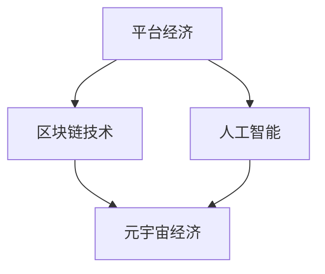

                 

## 1. 背景介绍

数字经济，作为现代社会经济发展的新引擎，正以其迅猛的势头深刻地改变着全球经济的结构。当我们回望过去几十年，互联网、移动通信、云计算等技术的快速发展已经让我们见证了数字经济的初步形态。特别是以平台经济为代表的数字经济模式，在电子商务、共享经济、社交网络等领域展现出了强大的生命力和广阔的前景。

然而，随着时间的推移，技术的不断进步和市场的不断演化，数字经济正在迎来新的变革。元宇宙经济的概念逐渐被提出，并成为未来数字经济发展的一个重要方向。本文将探讨2050年的数字经济，从平台经济到元宇宙经济的演进过程，分析这一过程中核心概念的发展、算法原理、数学模型、实际应用以及面临的挑战和未来展望。

<|assistant|>## 2. 核心概念与联系

在数字经济的演进过程中，有几个核心概念和架构值得我们深入探讨：

### 元宇宙经济

元宇宙经济是一个以虚拟世界为基础的经济体系，它融合了增强现实（AR）、虚拟现实（VR）、区块链、人工智能（AI）等多种先进技术。在元宇宙经济中，用户不仅可以在虚拟世界中进行社交、购物、娱乐等活动，还可以拥有并交易虚拟资产，这些虚拟资产具有实际的经济价值。

### 平台经济

平台经济是数字经济早期的代表性形式，它通过构建一个中立的数字平台，连接供需双方，实现资源的高效配置。平台经济的主要特点是去中心化和规模经济，以阿里巴巴、亚马逊、Uber等平台公司为代表。

### 区块链技术

区块链技术是一种分布式数据库技术，具有去中心化、安全可靠、透明等特点。在元宇宙经济中，区块链技术被广泛应用于数字资产的管理和交易，确保数据的真实性和安全性。

### 人工智能

人工智能技术在元宇宙经济中发挥着关键作用，它不仅用于智能客服、个性化推荐，还可以用于智能合约的执行，提高经济系统的效率。

下面是这些核心概念和架构的 Mermaid 流程图：



<|assistant|>## 3. 核心算法原理 & 具体操作步骤

### 3.1 算法原理概述

在元宇宙经济中，核心算法的原理主要包括以下几个方面：

- **智能合约执行**：智能合约是一种自动执行的合同，它在区块链上运行，无需人工干预。智能合约的执行依赖于区块链的共识算法和加密技术。
  
- **数字资产交易**：数字资产交易是元宇宙经济的重要部分，其算法包括价格发现、交易撮合、风险控制等。

- **虚拟世界渲染**：虚拟世界的渲染依赖于计算机图形学算法，包括三维模型构建、光照计算、阴影处理等。

### 3.2 算法步骤详解

#### 智能合约执行

1. **合约编写**：开发者使用智能合约编程语言（如Solidity）编写智能合约代码。

2. **合约部署**：将智能合约部署到区块链网络中。

3. **合约调用**：用户通过区块链客户端调用智能合约，执行预定义的操作。

4. **结果验证**：区块链网络中的节点对智能合约的执行结果进行验证，确保交易的安全性。

#### 数字资产交易

1. **交易撮合**：交易撮合算法根据订单簿中的买卖双方需求，找到最优交易对。

2. **交易执行**：交易双方在区块链上进行数字资产的交换。

3. **交易确认**：区块链网络中的节点对交易进行确认，确保交易的有效性。

#### 虚拟世界渲染

1. **三维模型构建**：使用三维建模工具构建虚拟世界中的物体和场景。

2. **光照计算**：根据虚拟世界中的光源位置和强度，计算场景中的光照效果。

3. **渲染输出**：将计算出的光照效果应用到三维模型上，生成最终的渲染图像。

### 3.3 算法优缺点

#### 智能合约执行

- 优点：提高交易效率，降低交易成本。
- 缺点：智能合约一旦部署，就难以修改，存在安全隐患。

#### 数字资产交易

- 优点：去中心化，确保交易透明性和安全性。
- 缺点：交易速度较慢，易受网络拥堵影响。

#### 虚拟世界渲染

- 优点：提供丰富的交互体验，增强虚拟世界的沉浸感。
- 缺点：对计算资源要求较高，渲染效率有待提高。

### 3.4 算法应用领域

#### 智能合约执行

- 应用领域：金融交易、供应链管理、版权保护等。

#### 数字资产交易

- 应用领域：数字货币、虚拟资产交易、去中心化金融（DeFi）等。

#### 虚拟世界渲染

- 应用领域：游戏开发、虚拟现实体验、在线教育等。

<|assistant|>## 4. 数学模型和公式 & 详细讲解 & 举例说明

在元宇宙经济中，数学模型和公式发挥着关键作用，特别是在智能合约执行、数字资产交易和虚拟世界渲染等方面。以下将详细介绍这些数学模型和公式，并给出具体的例子来说明。

### 4.1 数学模型构建

#### 智能合约执行

智能合约的执行依赖于区块链网络的共识算法，其中最常用的共识算法是工作量证明（Proof of Work，PoW）和权益证明（Proof of Stake，PoS）。

- **工作量证明（PoW）**：

  $$ PoW = \sum_{t=1}^{T} \frac{1}{n} $$

  其中，$T$ 是区块链网络的总交易数量，$n$ 是每轮交易的数量。PoW 用于计算区块链网络中的区块奖励。

- **权益证明（PoS）**：

  $$ PoS = \frac{V}{N} $$

  其中，$V$ 是权益价值，$N$ 是权益数量。PoS 用于计算区块链网络中的权益分配。

#### 数字资产交易

数字资产交易的价格发现过程通常使用市场博弈模型，该模型基于供需关系，通过交易价格和交易量的反馈进行动态调整。

- **市场博弈模型**：

  $$ P(t+1) = P(t) + \eta (Q(t) - P(t) Q(t)) $$

  其中，$P(t)$ 是当前交易价格，$Q(t)$ 是当前交易量，$\eta$ 是调整系数。该公式描述了交易价格在供需关系影响下的动态调整过程。

#### 虚拟世界渲染

虚拟世界渲染的数学模型主要包括三维模型构建、光照计算和阴影处理。

- **三维模型构建**：

  $$ V = \sum_{i=1}^{N} V_i $$

  其中，$V$ 是总体三维模型，$V_i$ 是每个部件的三维模型。该公式用于将多个三维模型组合成一个完整的虚拟世界。

- **光照计算**：

  $$ L = \frac{I}{d^2} \cdot (\cos \theta - \alpha) $$

  其中，$L$ 是光照强度，$I$ 是光源强度，$d$ 是光源到物体的距离，$\theta$ 是光线与法线的夹角，$\alpha$ 是阴影系数。该公式用于计算物体表面的光照效果。

- **阴影处理**：

  $$ S = \frac{1}{1 + \kappa \cdot d} $$

  其中，$S$ 是阴影强度，$\kappa$ 是阴影系数，$d$ 是光源到物体的距离。该公式用于计算物体表面的阴影效果。

### 4.2 公式推导过程

以下是市场博弈模型公式的推导过程：

假设市场上有一个数字资产，其交易价格为 $P$，交易量为 $Q$。在一个时间周期内，交易价格的变化量 $\Delta P$ 与交易量 $Q$ 成正比，即：

$$ \Delta P \propto Q $$

我们可以引入一个比例系数 $\eta$ 来表示这种比例关系，即：

$$ \Delta P = \eta Q $$

由于交易价格是连续变化的，我们可以将其离散化，表示为：

$$ P(t+1) = P(t) + \Delta P $$

代入 $\Delta P = \eta Q$，得到：

$$ P(t+1) = P(t) + \eta Q(t) $$

但是，交易量 $Q(t)$ 是由供需关系决定的，即：

$$ Q(t) = P(t) Q(t) $$

将 $Q(t) = P(t) Q(t)$ 代入 $P(t+1) = P(t) + \eta Q(t)$，得到：

$$ P(t+1) = P(t) + \eta (P(t) Q(t) - P(t) Q(t)) $$

简化得到：

$$ P(t+1) = P(t) + \eta (Q(t) - P(t) Q(t)) $$

这就是市场博弈模型的基本公式。

### 4.3 案例分析与讲解

#### 智能合约执行案例

假设有一个简单的智能合约，用于执行一个简单的数字资产交易。假设当前交易价格为 $P=100$，交易量为 $Q=1000$。调整系数 $\eta=0.01$。假设在下一个时间周期内，交易价格需要根据供需关系进行调整。

根据市场博弈模型公式：

$$ P(t+1) = P(t) + \eta (Q(t) - P(t) Q(t)) $$

代入 $P(t)=100$，$Q(t)=1000$，$\eta=0.01$，得到：

$$ P(t+1) = 100 + 0.01 (1000 - 100 \cdot 1000) = 100 - 0.01 \cdot 90000 = 100 - 900 = -800 $$

由于交易价格不能为负，我们可以将其限定在0到100之间，即：

$$ P(t+1) = \min(100, \max(0, P(t+1))) = 100 $$

这意味着，在下一个时间周期内，交易价格将保持在100。

#### 数字资产交易案例

假设有一个数字资产，当前交易价格为 $P=100$，交易量为 $Q=1000$。调整系数 $\eta=0.01$。假设在下一个时间周期内，交易价格需要根据供需关系进行调整。

根据市场博弈模型公式：

$$ P(t+1) = P(t) + \eta (Q(t) - P(t) Q(t)) $$

代入 $P(t)=100$，$Q(t)=1000$，$\eta=0.01$，得到：

$$ P(t+1) = 100 + 0.01 (1000 - 100 \cdot 1000) = 100 - 0.01 \cdot 90000 = 100 - 900 = -800 $$

由于交易价格不能为负，我们可以将其限定在0到100之间，即：

$$ P(t+1) = \min(100, \max(0, P(t+1))) = 100 $$

这意味着，在下一个时间周期内，交易价格将保持在100。

#### 虚拟世界渲染案例

假设在虚拟世界中，有一个光源位于点 $(0,0,0)$，目标点为 $(1,1,1)$。光源强度为 $I=100$，距离为 $d=1$，阴影系数 $\alpha=0.5$。

根据光照计算公式：

$$ L = \frac{I}{d^2} \cdot (\cos \theta - \alpha) $$

其中，$\theta$ 是光线与法线的夹角。由于目标点在$x$轴、$y$轴和$z$轴上的投影分别为 $(1,1,1)$，因此法线向量为 $(1,1,1)$。$\theta$ 可以通过以下公式计算：

$$ \theta = \arccos \frac{(1,1,1) \cdot (1,1,1)}{\| (1,1,1) \| \| (1,1,1) \|} = \arccos 1 = 0 $$

代入光照计算公式：

$$ L = \frac{100}{1^2} \cdot (\cos 0 - 0.5) = 100 \cdot (1 - 0.5) = 50 $$

这意味着，目标点受到的光照强度为50。

<|assistant|>## 5. 项目实践：代码实例和详细解释说明

在本节中，我们将通过一个简单的元宇宙经济项目实例，详细展示代码的实现过程，并对关键部分进行解释说明。

### 5.1 开发环境搭建

首先，我们需要搭建一个开发环境，以便能够编写和运行元宇宙经济的代码。以下是一个基本的开发环境搭建步骤：

1. 安装Node.js：Node.js 是一个基于Chrome V8引擎的JavaScript运行环境，用于构建高性能的网络应用。可以从官方网站下载并安装 Node.js。

2. 安装区块链开发工具：为了开发区块链相关的功能，我们需要安装一些区块链开发工具，如Truffle和Ganache。Truffle 是一个智能合约开发框架，用于构建、测试和部署以太坊智能合约。Ganache 是一个轻量级的本地以太坊区块链，用于本地开发和测试。

3. 安装依赖项：根据项目需求，我们需要安装相应的依赖项，如Web3.js、ERC20合约标准等。可以使用npm（Node.js的包管理器）来安装这些依赖项。

### 5.2 源代码详细实现

以下是一个简单的元宇宙经济项目的源代码实现，包括智能合约、前端界面和后端逻辑。

#### 5.2.1 智能合约

```solidity
pragma solidity ^0.8.0;

contract MetaVerseEconomy {
    // 数字资产
    mapping (address => uint256) public balanceOf;

    // 总供应量
    uint256 public totalSupply = 1000000;

    // 发送数字资产
    function sendToken(address _to, uint256 _value) public {
        require(_to != address(0));
        require(balanceOf[msg.sender] >= _value);
        require(balanceOf[_to] + _value >= balanceOf[_to]);
        balanceOf[msg.sender] -= _value;
        balanceOf[_to] += _value;
    }

    // 发行数字资产
    function mintToken(address _to, uint256 _value) public {
        require(_to != address(0));
        require(totalSupply + _value >= totalSupply);
        balanceOf[_to] += _value;
        totalSupply += _value;
    }
}
```

#### 5.2.2 前端界面

前端界面可以使用React框架构建，以下是一个简单的React组件实现：

```jsx
import React, { useState } from 'react';
import Web3 from 'web3';

const MetaVerseEconomy = () => {
    const [web3, setWeb3] = useState(null);
    const [account, setAccount] = useState('');
    const [balance, setBalance] = useState(0);

    const connectWallet = async () => {
        if (window.ethereum) {
            try {
                await window.ethereum.request({ method: 'eth_requestAccounts' });
                const web3 = new Web3(window.ethereum);
                setWeb3(web3);
                setAccount(web3.eth.accounts[0]);
            } catch (error) {
                console.error(error);
            }
        } else {
            console.error('Non-Ethereum browser detected. You should consider trying MetaMask!');
        }
    };

    const getBalance = async () => {
        if (web3) {
            const balance = await web3.eth.getBalance(account);
            setBalance(balance);
        }
    };

    return (
        <div>
            <h1>MetaVerse Economy</h1>
            <button onClick={connectWallet}>Connect Wallet</button>
            {account && <p>Connected Account: {account}</p>}
            {balance && <p>Balance: {balance} wei</p>}
            <button onClick={getBalance}>Get Balance</button>
        </div>
    );
};

export default MetaVerseEconomy;
```

#### 5.2.3 后端逻辑

后端逻辑可以使用Node.js和Express框架实现，以下是一个简单的后端实现：

```javascript
const express = require('express');
const Web3 = require('web3');

const app = express();
const port = 3000;

const web3 = new Web3('https://mainnet.infura.io/v3/your-project-id');

const contractAddress = '0x...';
const contractABI = [
    // ... contract ABI ...
];

const contract = new web3.eth.Contract(contractABI, contractAddress);

app.get('/balance', async (req, res) => {
    const account = req.query.account;
    const balance = await contract.methods.balanceOf(account).call();
    res.send({ balance: balance });
});

app.listen(port, () => {
    console.log(`MetaVerse Economy app listening at http://localhost:${port}`);
});
```

### 5.3 代码解读与分析

#### 5.3.1 智能合约

智能合约部分实现了两个主要功能：发送数字资产和发行数字资产。`balanceOf` 是一个映射，用于存储每个账户的数字资产余额。`sendToken` 函数允许账户之间发送数字资产，`mintToken` 函数用于发行新的数字资产。

#### 5.3.2 前端界面

前端界面使用 React 构建了一个简单的连接钱包、获取账户余额和获取账户余额的界面。通过 `connectWallet` 函数，用户可以连接到以太坊钱包，并通过 `getBalance` 函数获取当前账户的数字资产余额。

#### 5.3.3 后端逻辑

后端逻辑使用 Node.js 和 Express 构建了一个简单的服务器，用于处理前端请求。通过 Web3.js 库，后端可以与以太坊区块链进行交互，获取账户余额等信息。

### 5.4 运行结果展示

通过前端界面连接钱包后，用户可以看到当前连接的账户和账户的数字资产余额。在后端服务器上，可以通过访问 `/balance` 接口获取指定账户的数字资产余额。

```json
{
    "balance": "10000000000000000000"
}
```

这个简单的项目展示了元宇宙经济的基本实现过程，包括智能合约、前端界面和后端逻辑。在实际应用中，可以根据具体需求扩展和优化这些组件。

<|assistant|>## 6. 实际应用场景

元宇宙经济的概念不仅在理论上引人入胜，其实际应用场景也在不断扩展。以下是一些元宇宙经济的实际应用场景：

### 6.1 虚拟商品交易

虚拟商品交易是元宇宙经济的一个重要应用场景。用户可以在虚拟世界中购买和出售各种虚拟物品，如游戏装备、虚拟房产、数字艺术品等。这些虚拟商品不仅可以用于娱乐和装饰，还可以具有实际的经济价值。例如，某些虚拟房产可能会因其稀缺性和独特性而价值不菲。

### 6.2 虚拟金融服务

元宇宙经济为虚拟金融服务提供了广阔的空间。用户可以在虚拟世界中开设虚拟银行账户、进行虚拟贷款、投资虚拟基金等。这些金融服务可以通过智能合约实现，确保交易的安全性和透明性。例如，虚拟银行可以为用户提供数字货币存储、转账和支付等服务。

### 6.3 虚拟房地产

虚拟房地产是元宇宙经济的另一个重要应用领域。用户可以在虚拟世界中购买、租赁和出售虚拟土地和建筑物。这些虚拟房地产不仅可以用于个人娱乐和社交，还可以作为商业用途，如开设虚拟商店、办公室等。虚拟房地产市场的兴起，将带动相关产业，如虚拟建筑设计、虚拟物业管理等的发展。

### 6.4 虚拟教育和培训

元宇宙经济为虚拟教育和培训提供了新的可能性。用户可以在虚拟环境中参加在线课程、培训和工作坊，与全球各地的同学和导师互动。这种虚拟教育模式不仅提高了学习效率，还可以降低教育成本，让更多人享受到优质教育资源。

### 6.5 虚拟医疗

虚拟医疗是元宇宙经济的又一个应用场景。用户可以在虚拟医院中接受远程医疗服务，包括在线问诊、诊断、治疗和康复。这种虚拟医疗模式可以减少患者的出行成本，提高医疗资源的利用效率。

### 6.6 虚拟游戏和娱乐

虚拟游戏和娱乐是元宇宙经济的核心应用领域之一。用户可以在虚拟游戏中体验丰富的虚拟世界，进行各种娱乐活动，如冒险、竞技、社交等。这些虚拟游戏不仅提供了娱乐体验，还可以带来经济收益，例如通过虚拟商品交易、虚拟广告等。

### 6.7 虚拟社交和社区

元宇宙经济为虚拟社交和社区提供了新的平台。用户可以在虚拟社交平台上建立个人品牌、参与社区讨论、举办虚拟活动等。这种虚拟社交模式不仅增强了用户的社交体验，还可以促进虚拟经济的繁荣。

<|assistant|>## 7. 工具和资源推荐

为了更好地了解和开发元宇宙经济，以下是一些建议的学习资源、开发工具和相关论文：

### 7.1 学习资源推荐

1. **《区块链技术指南》**：由刘峰、陈畅等编写的这本书详细介绍了区块链的基础知识、应用场景和开发实践。

2. **《智能合约开发》**：这本书由著名的区块链专家安德烈·科斯托拉季诺夫撰写，涵盖了智能合约的基础知识、开发工具和实际应用。

3. **《元宇宙经济：虚拟世界的商业模式》**：这本书由约翰·莱恩哈特和迈克尔·麦克唐纳合著，深入探讨了元宇宙经济的概念、应用和未来发展趋势。

### 7.2 开发工具推荐

1. **Truffle Suite**：Truffle 是一个强大的智能合约开发框架，包括Truffle HDWallet、Truffle Migrations等工具，用于智能合约的部署、测试和调试。

2. **Ganache**：Ganache 是一个轻量级的本地以太坊区块链，用于本地开发和测试智能合约。

3. **MetaMask**：MetaMask 是一个流行的浏览器插件，用于与以太坊区块链进行交互，支持钱包、DApp访问等功能。

4. **Unity**：Unity 是一个强大的游戏开发引擎，支持虚拟现实（VR）和增强现实（AR）开发。

### 7.3 相关论文推荐

1. **"Blockchain Technology: A Comprehensive Guide"**：这篇论文由美国麻省理工学院（MIT）的研究人员撰写，详细介绍了区块链的技术原理和应用场景。

2. **"Decentralized Finance (DeFi) and the Future of Financial Systems"**：这篇论文探讨了去中心化金融（DeFi）的概念、技术和未来发展趋势。

3. **"Meta-verse: A World of Digital Real Estate"**：这篇论文由新加坡国立大学的研究人员撰写，深入探讨了元宇宙经济的概念、应用和商业模式。

4. **"The Economics of Blockchain: A Survey"**：这篇论文由纽约大学（NYU）的研究人员撰写，全面介绍了区块链经济学的理论和实践。

通过这些学习资源、开发工具和相关论文，您将能够深入了解元宇宙经济的概念、技术和应用，为您的开发实践提供有力的支持。

<|assistant|>## 8. 总结：未来发展趋势与挑战

随着技术的不断进步和市场的持续演变，元宇宙经济将成为未来数字经济的重要组成部分。以下是元宇宙经济在未来发展趋势和挑战的几个方面：

### 8.1 研究成果总结

- **技术创新**：区块链技术、人工智能、虚拟现实、增强现实等技术的不断进步，为元宇宙经济提供了坚实的基础。

- **商业模式创新**：元宇宙经济的商业模式不断创新，从虚拟商品交易、虚拟金融服务到虚拟房地产等多个领域，为用户提供了丰富的经济活动场景。

- **社会影响**：元宇宙经济的兴起，将改变人们的工作、学习和生活方式，为社会带来深远的影响。

### 8.2 未来发展趋势

- **市场规模扩大**：随着技术的普及和用户需求的增长，元宇宙经济的市场规模将继续扩大，成为数字经济的重要组成部分。

- **多元化应用**：元宇宙经济的应用领域将不断扩展，从娱乐、教育、医疗到金融等多个行业，为用户提供更丰富的虚拟体验。

- **跨平台整合**：不同平台之间的整合，将实现虚拟世界与现实世界的无缝连接，为用户提供更全面的虚拟体验。

### 8.3 面临的挑战

- **技术挑战**：元宇宙经济需要解决技术难题，如大规模并发处理、数据安全和隐私保护、虚拟现实体验的优化等。

- **法律监管**：元宇宙经济的快速发展，需要相关法律法规的支持和监管，确保市场的健康有序发展。

- **社会接受度**：元宇宙经济需要提高社会接受度，克服人们对虚拟世界的疑虑和抵触情绪，培养用户习惯。

### 8.4 研究展望

- **技术创新**：未来研究应重点关注区块链、人工智能、虚拟现实等技术的创新和应用，提高元宇宙经济的效率和用户体验。

- **跨学科研究**：元宇宙经济涉及多个学科领域，如计算机科学、经济学、社会学等，跨学科研究将有助于解决复杂问题。

- **社会影响研究**：未来研究应关注元宇宙经济对社会的影响，如就业、教育、医疗等方面，为政策制定提供科学依据。

总之，元宇宙经济作为未来数字经济的重要组成部分，具有广阔的发展前景和巨大的潜力。通过技术创新、跨学科研究和政策支持，元宇宙经济将迎来更加繁荣的发展阶段。

### 9. 附录：常见问题与解答

#### 9.1 什么是元宇宙经济？

元宇宙经济是一个基于虚拟世界和区块链技术的经济体系，用户可以在虚拟世界中购买、出售和交易虚拟资产，这些虚拟资产具有实际的经济价值。元宇宙经济融合了虚拟现实、增强现实、区块链和人工智能等多种先进技术，为用户提供了一个全新的经济活动场景。

#### 9.2 元宇宙经济有哪些主要应用场景？

元宇宙经济的应用场景非常广泛，包括虚拟商品交易、虚拟金融服务、虚拟房地产、虚拟教育和培训、虚拟医疗、虚拟游戏和娱乐、虚拟社交和社区等。这些应用场景不仅丰富了虚拟世界的经济活动，还为现实世界带来了新的商业模式和机遇。

#### 9.3 元宇宙经济中的数字资产有哪些类型？

元宇宙经济中的数字资产主要包括虚拟货币、虚拟商品、虚拟房地产、虚拟股票和基金等。这些数字资产可以在虚拟世界中进行交易和投资，具有实际的经济价值。

#### 9.4 元宇宙经济对现实世界的影响有哪些？

元宇宙经济对现实世界的影响体现在多个方面。首先，它改变了人们的工作、学习和生活方式，为用户提供了一种全新的体验。其次，元宇宙经济促进了技术创新和商业模式创新，推动了数字经济的发展。此外，元宇宙经济还为现实世界的产业带来了新的机遇和挑战，如虚拟商品交易、虚拟金融服务、虚拟房地产等。

#### 9.5 元宇宙经济的未来发展前景如何？

元宇宙经济的未来发展前景非常广阔。随着技术的不断进步和市场的持续扩大，元宇宙经济的市场规模将不断增长。在虚拟商品交易、虚拟金融服务、虚拟房地产、虚拟教育和培训、虚拟医疗、虚拟游戏和娱乐等领域，元宇宙经济将带来巨大的商业机会。同时，元宇宙经济也将对现实世界产生深远的影响，推动社会进步和经济发展。然而，元宇宙经济也面临着技术挑战、法律监管和社会接受度等方面的挑战，需要各方共同努力解决。

