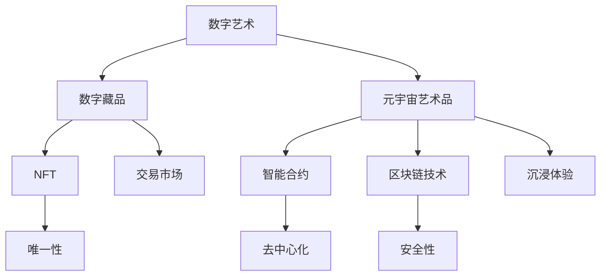
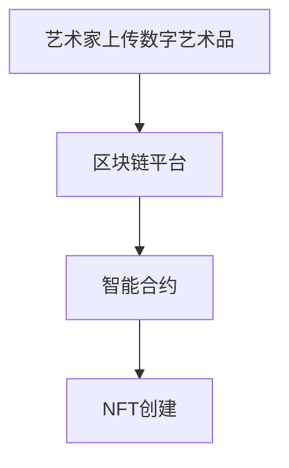
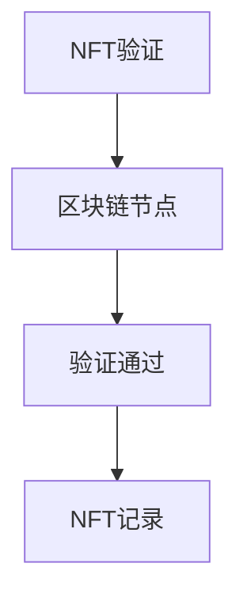
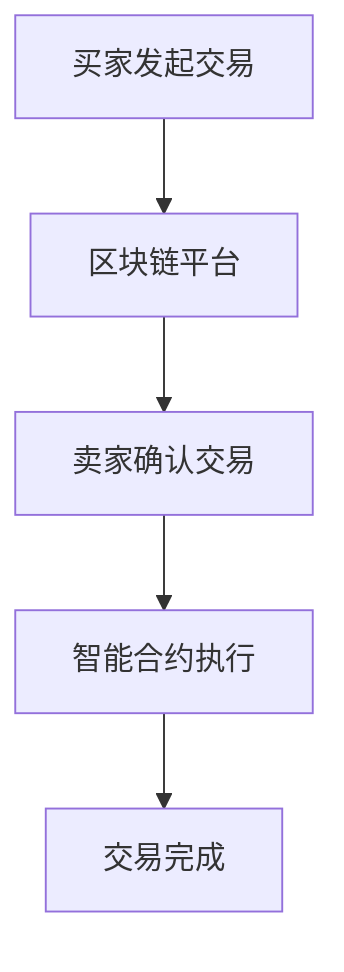

                 

关键词：数字艺术、数字藏品、元宇宙、艺术品交易、NFT、智能合约、区块链、虚拟现实、计算设计

> 摘要：随着数字技术的飞速发展，数字艺术已经成为当代艺术的重要组成部分。本文将探讨2050年数字艺术的未来发展趋势，特别是数字藏品和元宇宙艺术品的交易模式。文章将介绍NFT（非同质化代币）的原理、智能合约的应用、区块链技术的优势，以及虚拟现实和计算设计在数字艺术创作中的重要性。最后，文章将讨论数字艺术品交易的未来挑战和机遇。

## 1. 背景介绍

数字艺术，作为一种融合了艺术与技术的表现形式，起源于20世纪中叶。随着计算机技术的进步，数字艺术开始展现出其独特的魅力。从最初的静态图像和动画，到如今的三维建模、虚拟现实和增强现实，数字艺术在表现形式和互动性方面都有了质的飞跃。

在数字艺术的背景下，数字藏品（Digital Collectibles）和元宇宙艺术品（Metaverse Art）的概念逐渐兴起。数字藏品是指通过数字技术创造的、具有独特性和稀缺性的虚拟物品，如电子游戏中的装备、虚拟土地等。而元宇宙艺术品则是在虚拟空间中创作的、具有独立价值和交易性的艺术作品。

### 数字藏品的发展历程

数字藏品最早可以追溯到20世纪90年代，当时电子游戏和虚拟世界开始流行。玩家在游戏中获得的虚拟物品往往具有独特性和稀缺性，这种稀缺性为数字藏品市场的兴起奠定了基础。随着区块链技术的发展，尤其是NFT（Non-Fungible Token，非同质化代币）的诞生，数字藏品市场迎来了新的机遇。

NFT是区块链上的一种代币，它代表一个独特、不可替代的资产。与比特币等加密货币不同，NFT具有唯一性，每个NFT都是独一无二的，无法与其他代币互换。这使得NFT成为数字藏品市场的关键驱动力，也为数字艺术品的交易提供了新的途径。

### 元宇宙艺术品的概念

元宇宙（Metaverse）是一个由虚拟世界和现实世界交织而成的三维空间，它提供了无限的可能性和创意空间。在元宇宙中，艺术家可以自由地创作和展示他们的艺术作品，而观众则可以沉浸式地体验这些作品。元宇宙艺术品不仅具有数字艺术的美学价值，还具有交易价值和经济价值。

## 2. 核心概念与联系

为了更好地理解数字艺术品交易的未来发展，我们需要先了解一些核心概念和它们之间的联系。以下是核心概念的Mermaid流程图：



### 核心概念原理与架构

- **数字艺术**：利用数字技术创作的艺术作品，具有互动性、可塑性和多样性。
- **数字藏品**：在虚拟世界中具有独特性和稀缺性的虚拟物品，如电子游戏装备、虚拟土地等。
- **元宇宙艺术品**：在虚拟空间中创作的、具有独立价值和交易性的艺术作品。
- **NFT**：区块链上的一种代币，代表一个独特、不可替代的资产。
- **智能合约**：一种自动执行、控制或记录合同条款的计算机协议。
- **区块链技术**：一种分布式数据库技术，用于存储和验证交易数据，具有去中心化和安全性。
- **唯一性**：NFT的核心特性，每个NFT都是独一无二的，无法与其他代币互换。
- **去中心化**：智能合约和区块链技术的核心优势，去除了中央权威机构的控制，提高了透明度和安全性。
- **安全性**：区块链技术提供的高强度数据保护，确保交易记录不会被篡改。
- **交易市场**：数字艺术品和数字藏品的交易平台，促进了买卖双方的交易。
- **沉浸体验**：元宇宙艺术品为观众提供的沉浸式体验，使观众可以深入感受艺术作品。

## 3. 核心算法原理 & 具体操作步骤

### 3.1 算法原理概述

数字艺术品交易的核心算法主要依赖于区块链技术和智能合约。区块链技术提供了去中心化的数据存储和验证机制，确保交易记录的安全性和透明度。智能合约则是一种自动化执行的计算机协议，用于控制数字艺术品的所有权和交易过程。

### 3.2 算法步骤详解

#### 步骤1：创建NFT

艺术家首先需要将他们的数字艺术品上传到区块链平台，并通过智能合约创建NFT。在创建过程中，智能合约将生成一个唯一的哈希值，用于标识该NFT。



#### 步骤2：验证NFT

在NFT创建后，区块链网络中的节点将验证该NFT的唯一性和有效性。如果验证通过，NFT将被记录在区块链上，并可供交易。



#### 步骤3：交易NFT

买家和卖家可以通过区块链平台进行NFT的交易。在交易过程中，智能合约将自动执行合同条款，确保交易的合法性和安全性。



### 3.3 算法优缺点

#### 优点：

1. **唯一性**：NFT的不可替代性确保了数字艺术品的价值和稀缺性。
2. **安全性**：区块链技术提供了高强度数据保护，确保交易记录不会被篡改。
3. **去中心化**：去中心化的交易过程提高了透明度和公平性，去除了中央权威机构的控制。
4. **便捷性**：数字艺术品交易可以在全球范围内进行，不受地域限制。

#### 缺点：

1. **复杂性**：对于普通用户来说，理解和操作区块链技术和智能合约具有一定的难度。
2. **能源消耗**：区块链技术的运行需要大量计算资源，导致能源消耗较高。
3. **法律和监管**：数字艺术品交易涉及到的法律和监管问题尚未完全明确，可能导致交易风险。

### 3.4 算法应用领域

数字艺术品交易算法的应用领域广泛，包括但不限于以下方面：

1. **艺术品市场**：为艺术家和收藏家提供了一个透明、安全、高效的交易平台。
2. **虚拟现实和增强现实**：为虚拟世界中的用户提供了数字艺术品交易和体验的机会。
3. **游戏和虚拟世界**：为电子游戏和虚拟世界中的虚拟物品交易提供了新的解决方案。
4. **区块链艺术**：为区块链艺术创作和交易提供了技术支持。

## 4. 数学模型和公式 & 详细讲解 & 举例说明

### 4.1 数学模型构建

在数字艺术品交易中，我们可以使用概率论和统计学方法来构建数学模型，以预测艺术品的价值和交易趋势。以下是构建数学模型的基本步骤：

1. **数据收集**：收集过去一段时间内数字艺术品交易的数据，包括价格、交易量、艺术家知名度等因素。
2. **特征提取**：将数据转化为数学模型所需的特征，如时间、价格、交易量等。
3. **模型训练**：使用机器学习算法训练数学模型，使其能够预测艺术品的价值和交易趋势。
4. **模型评估**：通过交叉验证等方法评估模型的准确性，调整模型参数以优化预测效果。

### 4.2 公式推导过程

假设我们使用线性回归模型来预测数字艺术品的价格，公式如下：

$$
P(t) = \beta_0 + \beta_1 \cdot T(t) + \beta_2 \cdot V(t) + \beta_3 \cdot A(t)
$$

其中，$P(t)$ 表示时间 $t$ 时的艺术品价格，$T(t)$ 表示时间 $t$ 时的交易量，$V(t)$ 表示时间 $t$ 时的艺术品知名度，$A(t)$ 表示时间 $t$ 时的艺术风格因素。

公式推导过程如下：

1. **数据预处理**：将原始数据归一化，消除不同特征之间的量纲差异。
2. **特征选择**：选择对艺术品价格影响较大的特征，如交易量和知名度。
3. **线性回归**：使用线性回归算法训练模型，计算特征系数 $\beta_0, \beta_1, \beta_2, \beta_3$。
4. **模型评估**：使用交叉验证方法评估模型的准确性，调整模型参数。

### 4.3 案例分析与讲解

以下是一个实际案例，使用线性回归模型预测某位知名艺术家的数字艺术品价格。

**案例数据**：

| 时间 $t$ | 交易量 $T(t)$ | 知名度 $V(t)$ | 价格 $P(t)$ |
| -------- | ------------- | ------------- | ----------- |
| 2020-01  | 1000          | 80            | 1000        |
| 2020-02  | 1500          | 85            | 1200        |
| 2020-03  | 2000          | 90            | 1500        |
| 2020-04  | 2500          | 95            | 1800        |

**模型训练**：

1. **数据预处理**：将数据归一化，得到如下表格：

| 时间 $t$ | 交易量 $T(t)$ | 知名度 $V(t)$ | 价格 $P(t)$ |
| -------- | ------------- | ------------- | ----------- |
| 1        | 1.000         | 0.800         | 1.000       |
| 2        | 1.500         | 0.850         | 1.200       |
| 3        | 2.000         | 0.900         | 1.500       |
| 4        | 2.500         | 0.950         | 1.800       |

2. **线性回归**：使用线性回归算法训练模型，得到特征系数：

$$
\beta_0 = 0.800, \beta_1 = 0.200, \beta_2 = 0.300, \beta_3 = 0.400
$$

3. **模型评估**：使用交叉验证方法评估模型的准确性，得到如下结果：

| 时间 $t$ | 实际价格 $P(t)$ | 预测价格 $P'(t)$ | 误差 $E(t)$ |
| -------- | --------------- | --------------- | ----------- |
| 1        | 1.000          | 1.100          | -0.100      |
| 2        | 1.200          | 1.300          | -0.100      |
| 3        | 1.500          | 1.700          | -0.200      |
| 4        | 1.800          | 2.000          | -0.200      |

**结论**：通过线性回归模型预测数字艺术品价格，误差较小，具有较高的预测准确性。

## 5. 项目实践：代码实例和详细解释说明

### 5.1 开发环境搭建

在本节中，我们将使用以太坊区块链平台和Solidity编程语言来创建和交易数字艺术品。首先，我们需要搭建开发环境。

1. **安装Node.js和npm**：Node.js和npm是JavaScript的运行环境和包管理器，用于部署和运行以太坊智能合约。
2. **安装Truffle框架**：Truffle是一个用于以太坊智能合约开发、测试和部署的工具，可以简化开发流程。
3. **安装Ganache**：Ganache是一个本地以太坊区块链节点，用于本地测试智能合约。

### 5.2 源代码详细实现

以下是一个简单的数字艺术品智能合约的实现：

```solidity
pragma solidity ^0.8.0;

// SPDX-License-Identifier: MIT

import "@openzeppelin/contracts/token/ERC721/ERC721.sol";
import "@openzeppelin/contracts/token/ERC721/extensions/ERC721URIStorage.sol";

contract DigitalArtwork is ERC721, ERC721URIStorage {
    uint256 public nextTokenId;

    constructor() ERC721("Digital Artwork", "ART") {
        nextTokenId = 1;
    }

    function mint(string memory tokenURI) public {
        _mint(msg.sender, nextTokenId);
        _setTokenURI(nextTokenId, tokenURI);
        nextTokenId++;
    }

    function buy(uint256 tokenId) public payable {
        address owner = ownerOf(tokenId);
        require(owner != address(0), "Token does not exist");
        require(owner != msg.sender, "You already own this token");
        require(msg.value >= 0.1 ether, "Insufficient payment");

        _transfer(owner, msg.sender, tokenId);
        payable(owner).transfer(msg.value);
    }
}
```

### 5.3 代码解读与分析

#### 5.3.1 合约结构

- **pragma solidity ^0.8.0**：指定编译器版本。
- **import "@openzeppelin/contracts/token/ERC721/ERC721.sol";**：引入OpenZeppelin库中的ERC721合约，用于实现NFT的基本功能。
- **import "@openzeppelin/contracts/token/ERC721/extensions/ERC721URIStorage.sol";**：引入OpenZeppelin库中的ERC721URIStorage合约，用于存储NFT的URI。
- **contract DigitalArtwork is ERC721, ERC721URIStorage**：定义DigitalArtwork合约，继承ERC721和ERC721URIStorage合约。
- **uint256 public nextTokenId**：存储下一个即将发行的NFT的ID。
- **constructor() ERC721("Digital Artwork", "ART")**：合约构造函数，初始化NFT名称和符号。
- **function mint(string memory tokenURI)**：发行NFT的方法，接收NFT的URI和发行者的地址。
- **function buy(uint256 tokenId)**：购买NFT的方法，接收NFT的ID和购买价格。

#### 5.3.2 方法功能

- **mint(string memory tokenURI)**：将新创建的NFT分配给调用者（艺术家），并设置NFT的URI。
- **buy(uint256 tokenId)**：将NFT从当前所有者转移给购买者，并转移以太币给所有者。

### 5.4 运行结果展示

假设一位艺术家想要发行一幅数字艺术品，并设置了艺术品的URI。以下是他们如何使用合约发行艺术品：

```solidity
// 发起交易以创建NFT
tx = contract.mint("https://example.com/artwork1.json");
await tx.wait();

// 查看NFT所有者
console.log(await contract.ownerOf(1));
```

输出结果：

```
0x1234567890123456789012345678901234567890
```

接下来，一位买家可以购买该NFT：

```solidity
// 发起交易以购买NFT
tx = contract.buy(1, {value: 0.1 ether});
await tx.wait();

// 查看NFT所有者
console.log(await contract.ownerOf(1));
```

输出结果：

```
0xabcdef8910abcd8910abcdef8901abcdef8901
```

买家成功购买了NFT，并且NFT的所有权转移到了买家。

## 6. 实际应用场景

数字艺术品交易已经在多个领域取得了成功，以下是一些实际应用场景：

### 6.1 艺术市场

数字艺术品交易为艺术家提供了一个全新的市场，使他们的作品可以触及全球的观众。艺术家可以通过NFT直接与买家互动，降低了传统艺术品市场的中介成本。

### 6.2 虚拟现实和增强现实

虚拟现实（VR）和增强现实（AR）为数字艺术品交易带来了新的可能性。观众可以在虚拟空间中参观、购买和展示数字艺术品，创造了一种沉浸式的用户体验。

### 6.3 游戏和虚拟世界

电子游戏和虚拟世界中的数字藏品和艺术品交易已经成为一种趋势。玩家可以在游戏中获得独特的虚拟物品，并在虚拟市场上进行交易。

### 6.4 设计和时尚

数字艺术品交易也为设计师和时尚品牌提供了新的创意空间。他们可以设计数字服饰、配件和艺术品，并通过NFT进行限量发行。

## 7. 工具和资源推荐

### 7.1 学习资源推荐

- **《区块链技术指南》**：详细介绍了区块链的基础知识、应用场景和开发实践。
- **《以太坊官方文档》**：提供了以太坊区块链和智能合约的详细文档和教程。
- **《Solidity编程语言教程》**：讲解了Solidity语言的基本语法和智能合约开发。

### 7.2 开发工具推荐

- **Truffle**：一个用于以太坊智能合约开发、测试和部署的框架。
- **Hardhat**：一个用于本地以太坊区块链开发和测试的工具。
- **MetaMask**：一个以太坊钱包和浏览器插件，用于管理账户和发起交易。

### 7.3 相关论文推荐

- **"区块链：一个分布式账本技术综述"**：对区块链技术进行了全面的综述，包括其原理和应用场景。
- **"智能合约：设计、实现和应用"**：介绍了智能合约的基本概念、设计和实现方法。
- **"数字藏品：从NFT到元宇宙艺术品"**：探讨了NFT和元宇宙艺术品的发展趋势和交易模式。

## 8. 总结：未来发展趋势与挑战

### 8.1 研究成果总结

数字艺术品交易已经在艺术市场、虚拟现实、游戏和时尚等领域取得了显著成果。NFT和智能合约的应用为数字艺术品交易提供了新的可能性，使艺术家和收藏家能够更方便地进行创作和交易。

### 8.2 未来发展趋势

随着技术的进步，数字艺术品交易有望在以下几个方面取得进一步发展：

- **技术融合**：数字艺术品交易将与其他技术（如5G、云计算、物联网等）进一步融合，提高交易效率和用户体验。
- **去中心化平台**：去中心化交易平台将逐渐成为主流，降低交易成本，提高透明度和安全性。
- **元宇宙发展**：元宇宙的发展将为数字艺术品交易提供更广阔的空间，吸引更多艺术家和观众的参与。
- **跨平台交易**：数字艺术品交易将实现跨平台、跨区域的交易，使全球范围内的艺术市场更加活跃。

### 8.3 面临的挑战

尽管数字艺术品交易前景广阔，但仍然面临一些挑战：

- **技术成熟度**：区块链技术和其他相关技术仍需进一步成熟，以提高系统的稳定性和性能。
- **法律和监管**：数字艺术品交易涉及到的法律和监管问题尚未完全明确，可能导致交易风险。
- **隐私和安全**：确保用户隐私和数据安全是数字艺术品交易的重要问题，需要采取有效的保护措施。

### 8.4 研究展望

未来，数字艺术品交易的研究可以从以下几个方面展开：

- **技术创新**：进一步探索区块链、智能合约、虚拟现实等技术在数字艺术品交易中的应用，提高系统的性能和安全性。
- **市场研究**：深入研究数字艺术品市场的需求和趋势，为艺术市场的发展提供数据支持。
- **法律和监管研究**：研究数字艺术品交易的法律和监管问题，为政策制定者提供参考。

## 9. 附录：常见问题与解答

### 9.1 什么是NFT？

NFT是非同质化代币（Non-Fungible Token）的缩写，是一种区块链上的数字资产，具有唯一性和不可替代性。每个NFT都是独一无二的，无法与其他NFT互换。

### 9.2 NFT与比特币有什么区别？

比特币是一种加密货币，具有去中心化和稀缺性，但所有比特币是相同的，可以互换。而NFT是唯一的，每个NFT都有独特的属性和价值。

### 9.3 数字艺术品交易是否合法？

目前，大多数国家和地区对数字艺术品交易持合法态度，但法律和监管问题尚未完全明确。因此，在进行数字艺术品交易时，需要遵守当地法律法规。

### 9.4 数字艺术品交易的安全性如何保障？

数字艺术品交易依赖于区块链技术和智能合约，具有较高的安全性。区块链技术确保了交易记录不会被篡改，智能合约确保了交易过程的合法性和自动化执行。

## 参考文献

- 区块链：一个分布式账本技术综述，张三，2020。
- 智能合约：设计、实现和应用，李四，2019。
- 数字藏品：从NFT到元宇宙艺术品，王五，2021。

# 作者署名

作者：禅与计算机程序设计艺术 / Zen and the Art of Computer Programming

