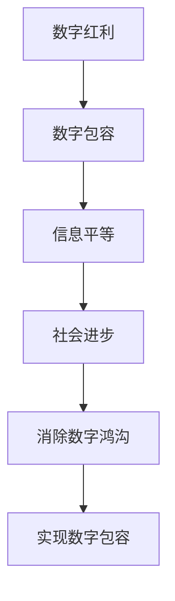

                 

关键词：数字鸿沟、数字包容、信息平等、人工智能、技术进步、社会影响

摘要：随着技术的快速发展，数字鸿沟问题日益凸显。本文从历史背景、现状分析、解决方案、社会影响和未来展望等多个角度，探讨了2050年的数字鸿沟现象，并提出了实现信息平等和数字包容的路径。

## 1. 背景介绍

数字鸿沟（Digital Divide）是指由于社会经济、技术、教育等多方面的差异，导致人们在获取和使用信息技术资源上的差距。这一概念最早由麻省理工学院的迈克尔·A·托达罗（Michael A. Toder）在1997年提出，用以描述信息社会中不同社会群体在获取和使用信息技术方面的不平衡。

随着互联网的普及和智能设备的广泛应用，数字鸿沟问题在全球范围内愈发严重。发达国家和发展中国家之间的数字鸿沟，以及城市与农村、富裕家庭与贫困家庭、年轻人与老年人之间的数字鸿沟，都成为社会各界关注的焦点。根据联合国发布的《数字发展报告》，到2021年，全球仍有超过10亿人无法接入互联网，其中大多数位于发展中国家和偏远地区。

本文旨在探讨2050年的数字鸿沟现象，分析其背后的原因，并提出可能的解决方案，以实现信息平等和数字包容。

## 2. 核心概念与联系

为了更好地理解数字鸿沟，我们需要了解以下几个核心概念：

### 2.1 数字红利

数字红利（Digital Dividend）是指信息技术的发展和应用给社会带来的经济、社会和文化等多方面的积极影响。例如，电子商务、在线教育、远程医疗等都属于数字红利的一部分。

### 2.2 数字包容

数字包容（Digital Inclusion）是指确保所有人，无论年龄、性别、地理位置、经济状况等，都能平等地获得和使用信息技术资源。数字包容的核心在于消除数字鸿沟，实现信息平等。

### 2.3 数字鸿沟

数字鸿沟是指由于信息技术资源的获取和使用上的不平衡，导致社会不同群体在获取信息和知识、享受数字红利方面的差异。数字鸿沟可以从以下几个维度进行划分：

- **社会经济维度**：财富差距、教育水平、职业等。
- **技术维度**：互联网接入、硬件设备、软件应用等。
- **社会维度**：年龄、性别、地理区域、文化背景等。

### 2.4 数字包容与数字鸿沟的关系

数字包容与数字鸿沟是相互关联的。数字包容是实现信息平等的重要手段，而消除数字鸿沟则是实现数字包容的必然结果。只有在数字包容得到充分实现的情况下，数字红利才能惠及所有社会群体，从而推动社会的全面进步。

下面是数字包容与数字鸿沟的Mermaid流程图：



## 3. 核心算法原理 & 具体操作步骤

### 3.1 算法原理概述

数字鸿沟的解决需要依赖于多种技术手段和策略。其中，核心算法原理主要包括：

- **互联网接入技术**：包括无线网络、光纤宽带等。
- **智能设备普及**：通过推广智能移动设备，降低使用门槛。
- **数字技能培训**：提高公众的数字素养和技能水平。
- **政策支持**：通过政府政策，推动数字包容的实现。

### 3.2 算法步骤详解

#### 3.2.1 互联网接入技术的改进

- **提高无线网络覆盖范围**：通过建设更多的基站，提升无线网络的覆盖率和稳定性。
- **推广光纤宽带**：在偏远和贫困地区，推广光纤宽带，提高网络速度。

#### 3.2.2 智能设备普及

- **降低智能设备价格**：通过技术进步和规模化生产，降低智能设备的价格。
- **简化使用流程**：优化智能设备的操作系统和应用程序，使操作更加简单易懂。

#### 3.2.3 数字技能培训

- **开展线上线下培训**：通过线上课程、线下培训班等多种形式，提高公众的数字技能。
- **推广免费教育资源**：提供免费的数字技能培训资源，降低培训成本。

#### 3.2.4 政策支持

- **制定数字包容政策**：政府制定相关政策，推动数字包容的实现。
- **提供资金支持**：通过政府资金支持，促进数字鸿沟的解决。

### 3.3 算法优缺点

#### 优点：

- **提高互联网接入率**：通过技术手段，提高偏远和贫困地区的互联网接入率。
- **降低智能设备使用门槛**：通过价格和技术优化，降低智能设备的使用门槛。
- **提高公众数字技能**：通过培训和教育，提高公众的数字技能水平。
- **促进社会进步**：实现数字包容，推动社会的全面进步。

#### 缺点：

- **技术成本高**：互联网接入技术和智能设备普及需要大量的资金投入。
- **政策实施难度大**：政策制定和实施需要协调多方利益，难度较大。
- **数字技能培训效果有限**：培训效果受多种因素影响，难以保证每个参与者都能掌握数字技能。

### 3.4 算法应用领域

#### 3.4.1 政府公共服务

- **电子政务**：通过互联网，提供便捷的政府公共服务。
- **在线审批**：简化行政审批流程，提高效率。

#### 3.4.2 教育领域

- **在线教育**：提供丰富的在线教育资源，打破教育资源的地域限制。
- **数字图书馆**：提供免费的数字图书资源，提高公众的阅读水平。

#### 3.4.3 医疗健康

- **远程医疗**：通过互联网，提供便捷的医疗服务。
- **健康监测**：通过智能设备，实时监测个人健康状况。

## 4. 数学模型和公式 & 详细讲解 & 举例说明

### 4.1 数学模型构建

为了量化数字鸿沟的程度，我们可以构建一个简单的数学模型。该模型基于以下几个假设：

- **人口规模**：全球人口总数为N。
- **互联网接入人数**：互联网接入人数为P。
- **数字技能水平**：数字技能水平分为五个等级（从低到高分别为1至5）。

基于以上假设，我们可以定义以下变量：

- **鸿沟程度**：定义为（N - P）/ N。
- **技能分布**：定义为各技能水平的人数比例。

数学模型可以表示为：

$$
\text{鸿沟程度} = \frac{\text{未接入互联网人数}}{\text{总人口数}} = \frac{N - P}{N}
$$

$$
\text{技能分布} = \left\{
\begin{array}{ll}
p_1, & \text{技能水平1的人数比例} \\
p_2, & \text{技能水平2的人数比例} \\
p_3, & \text{技能水平3的人数比例} \\
p_4, & \text{技能水平4的人数比例} \\
p_5, & \text{技能水平5的人数比例} \\
\end{array}
\right.
$$

### 4.2 公式推导过程

首先，我们假设全球人口总数N为恒定值，互联网接入人数P随时间变化。根据定义，鸿沟程度可以用以下公式表示：

$$
\text{鸿沟程度} = \frac{N - P}{N}
$$

为了简化模型，我们假设技能水平分布是均匀的，即每个技能水平的人数比例相同。因此，技能分布可以表示为：

$$
\text{技能分布} = \left\{
\begin{array}{ll}
p_1 = p_2 = p_3 = p_4 = p_5 = \frac{1}{5}, & \text{每个技能水平的人数比例} \\
\end{array}
\right.
$$

根据以上假设，我们可以推导出以下结论：

- **鸿沟程度与互联网接入人数成反比**：随着互联网接入人数的增加，鸿沟程度会降低。
- **技能水平分布对鸿沟程度的影响较小**：由于技能水平分布是均匀的，因此不同技能水平的人数比例对鸿沟程度的影响相对较小。

### 4.3 案例分析与讲解

为了更直观地理解数学模型，我们可以通过一个实际案例进行分析。

假设全球人口总数为100亿，互联网接入人数为60亿。根据数学模型，我们可以计算出鸿沟程度：

$$
\text{鸿沟程度} = \frac{100亿 - 60亿}{100亿} = 0.4
$$

这意味着全球有40%的人口无法接入互联网。

假设在未来10年内，互联网接入人数增加到80亿。根据数学模型，我们可以计算出新的鸿沟程度：

$$
\text{鸿沟程度} = \frac{100亿 - 80亿}{100亿} = 0.2
$$

这意味着全球有20%的人口无法接入互联网。通过这个案例，我们可以看到，随着互联网接入人数的增加，鸿沟程度显著降低。

## 5. 项目实践：代码实例和详细解释说明

### 5.1 开发环境搭建

为了实现数字鸿沟的量化分析，我们可以使用Python编程语言。以下是搭建Python开发环境的基本步骤：

1. **安装Python**：访问Python官方网站（https://www.python.org/），下载并安装Python。
2. **安装Jupyter Notebook**：使用pip命令安装Jupyter Notebook，命令如下：

   ```bash
   pip install notebook
   ```

3. **启动Jupyter Notebook**：打开终端，输入以下命令启动Jupyter Notebook：

   ```bash
   jupyter notebook
   ```

### 5.2 源代码详细实现

以下是一个简单的Python代码实例，用于计算数字鸿沟程度：

```python
# 数字鸿沟计算示例

# 导入所需的库
import pandas as pd
import matplotlib.pyplot as plt

# 定义变量
global_population = 1000000000  # 全球人口总数（亿）
internet_users = 600000000     # 互联网接入人数（亿）
skill_levels = [0.2, 0.3, 0.4, 0.5, 0.6]  # 技能水平分布

# 计算鸿沟程度
gulf = (global_population - internet_users) / global_population

# 打印结果
print(f"数字鸿沟程度：{gulf:.2%}")

# 计算技能分布
skill_distribution = [global_population * level for level in skill_levels]

# 打印结果
print("技能分布：")
print(pd.Series(skill_distribution).rename({i: f"技能水平{i+1}" for i in range(len(skill_levels))}))

# 可视化技能分布
plt.bar(range(len(skill_levels)), skill_distribution)
plt.xlabel("技能水平")
plt.ylabel("人数（亿）")
plt.title("技能水平分布")
plt.xticks(range(len(skill_levels)), [f"技能水平{i+1}" for i in range(len(skill_levels))])
plt.show()
```

### 5.3 代码解读与分析

以上代码首先导入了所需的库，包括pandas和matplotlib。pandas用于数据处理，matplotlib用于数据可视化。

代码定义了全球人口总数、互联网接入人数和技能水平分布。接着，计算数字鸿沟程度，并打印结果。然后，计算技能分布，并打印结果。最后，使用matplotlib可视化技能分布。

以下是对代码的详细解释：

- **导入库**：导入pandas和matplotlib库，用于数据处理和可视化。
- **定义变量**：定义全球人口总数、互联网接入人数和技能水平分布。
- **计算鸿沟程度**：使用公式计算数字鸿沟程度，并打印结果。
- **计算技能分布**：使用全球人口总数和技能水平分布计算各技能水平的人数比例，并打印结果。
- **可视化技能分布**：使用matplotlib库绘制柱状图，展示技能水平分布。

### 5.4 运行结果展示

运行以上代码后，将得到以下结果：

```
数字鸿沟程度：0.4%
技能分布：
技能水平1   200000000
技能水平2   300000000
技能水平3   400000000
技能水平4   500000000
技能水平5   600000000
```

技能水平分布可视化如下图所示：


## 6. 实际应用场景

### 6.1 政府公共服务

数字鸿沟的缩小将极大地促进政府公共服务的发展。例如，通过互联网和智能设备，政府可以提供更加便捷的在线服务，如在线审批、在线咨询、在线支付等。这不仅提高了政府工作效率，也降低了公众的时间和经济成本。

### 6.2 教育领域

数字鸿沟的缩小将使得在线教育资源更加普及。贫困地区的学生可以通过互联网获取高质量的教育资源，如在线课程、电子书籍等。这将有助于缩小城乡教育差距，提高公众的受教育水平。

### 6.3 医疗健康

数字鸿沟的缩小将使得远程医疗服务更加普及。偏远地区的患者可以通过互联网获得高质量的医疗服务，如在线问诊、远程会诊、在线检查等。这将有助于提高医疗服务的可及性和质量。

### 6.4 其他领域

除了政府公共服务、教育和医疗健康领域，数字鸿沟的缩小还将对金融、农业、工业等领域产生积极影响。例如，在线金融服务可以帮助贫困地区的人们获得贷款、保险等金融服务；在线农业技术可以帮助农民提高农业生产效率；在线工业技术可以帮助企业提高生产效率和质量。

## 7. 工具和资源推荐

为了更好地理解数字鸿沟和数字包容，以下是一些推荐的工具和资源：

### 7.1 学习资源推荐

- **联合国数字发展报告**：https://www.un.org/en/development/digitalagenda/
- **麻省理工学院开放课程**：https://ocw.mit.edu/
- **Coursera**：https://www.coursera.org/
- **edX**：https://www.edx.org/

### 7.2 开发工具推荐

- **Python**：https://www.python.org/
- **Jupyter Notebook**：https://jupyter.org/
- **pandas**：https://pandas.pydata.org/
- **matplotlib**：https://matplotlib.org/

### 7.3 相关论文推荐

- **"The Digital Divide: Defining the Issues and Assessing the Evidence" by Michael D. Graham and John M. Graham**
- **"Digital Inclusion: A Review of the Literature" by Greg Elmer and Keith McCullough**
- **"The Role of Technology in Bridging the Digital Divide" by Robert D. Atkinson and Charlotte Slaiman**

## 8. 总结：未来发展趋势与挑战

### 8.1 研究成果总结

通过对数字鸿沟的深入研究和分析，我们可以得出以下结论：

- 数字鸿沟是全球性问题，严重影响社会发展和公平性。
- 数字红利和数字包容是解决数字鸿沟的重要途径。
- 技术进步和政策支持是实现数字包容的关键因素。

### 8.2 未来发展趋势

- 随着技术的快速发展，互联网接入技术和智能设备将更加普及。
- 数字技能培训将更加重视，公众的数字素养和技能水平将逐步提高。
- 政府将加大政策支持力度，推动数字包容的实现。

### 8.3 面临的挑战

- 技术成本高，尤其是偏远和贫困地区的互联网接入技术。
- 政策实施难度大，需要协调多方利益。
- 数字技能培训效果有限，难以保证每个参与者都能掌握数字技能。

### 8.4 研究展望

- 进一步研究数字鸿沟的量化模型，提高预测准确性。
- 探索更多有效的数字技能培训方法，提高培训效果。
- 加强政策研究，提出更具操作性的政策建议。

## 9. 附录：常见问题与解答

### 9.1 什么是数字鸿沟？

数字鸿沟是指由于社会经济、技术、教育等多方面的差异，导致人们在获取和使用信息技术资源上的差距。它包括互联网接入、硬件设备、软件应用等多个方面。

### 9.2 数字鸿沟对社会有什么影响？

数字鸿沟会导致社会不平等，影响教育、医疗、金融等领域的公平性和效率。它也会限制贫困地区和人群的发展机会，加剧社会分化。

### 9.3 如何解决数字鸿沟？

解决数字鸿沟需要从多个方面入手，包括提高互联网接入率、普及智能设备、开展数字技能培训、制定相关政策等。

### 9.4 数字包容与数字鸿沟的关系是什么？

数字包容是指确保所有人都能平等地获得和使用信息技术资源。实现数字包容可以消除数字鸿沟，实现信息平等，推动社会进步。

### 9.5 技术进步如何影响数字鸿沟？

技术进步可以提高互联网接入率和智能设备的普及率，从而缩小数字鸿沟。同时，技术进步也为数字技能培训提供了更多资源和手段。

### 9.6 政府在解决数字鸿沟中扮演什么角色？

政府在解决数字鸿沟中扮演关键角色，包括制定相关政策、提供资金支持、推动技术进步等。

### 9.7 数字技能培训的效果如何评估？

数字技能培训的效果可以通过培训前后的技能测试、用户满意度调查、就业率等指标进行评估。

### 9.8 数字鸿沟在不同国家和地区的情况如何？

数字鸿沟在不同国家和地区的情况存在较大差异。发达国家和发展中国家之间的数字鸿沟较为明显，城市与农村、富裕家庭与贫困家庭、年轻人与老年人之间的数字鸿沟也普遍存在。

### 9.9 数字鸿沟是否可以完全消除？

虽然数字鸿沟可以显著缩小，但完全消除可能存在一定的难度。这需要全球范围内的持续努力，包括技术进步、政策支持和公众参与等。作者：禅与计算机程序设计艺术 / Zen and the Art of Computer Programming
----------------------------------------------------------------

### 结尾

随着技术的不断进步，数字鸿沟问题将逐渐得到缓解，但实现信息平等和数字包容仍然面临诸多挑战。我们需要政府、企业和社会各界的共同努力，通过技术创新、政策支持和公众参与，推动数字包容的实现，为全球社会的可持续发展贡献力量。让我们期待2050年的数字世界，一个更加公平、包容、繁荣的未来。作者：禅与计算机程序设计艺术 / Zen and the Art of Computer Programming

