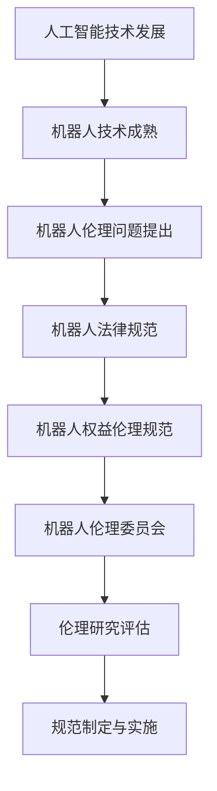

                 

关键词：2050年，机器人伦理，法律规范，机器人权益，技术发展，未来展望

> 摘要：随着人工智能技术的飞速发展，机器人已经成为现代社会不可或缺的一部分。本文深入探讨了2050年的机器人伦理问题，分析了机器人法律规范的构建和机器人权益的伦理规范，提出了对未来机器人伦理发展的展望。

## 1. 背景介绍

### 1.1 人工智能与机器人技术发展现状

自20世纪80年代以来，人工智能技术经历了从理论研究到实际应用的跨越式发展。特别是深度学习、自然语言处理和计算机视觉等领域的突破，使得机器人技术取得了显著的成果。今天，机器人已经广泛应用于工业生产、服务业、医疗、家庭等领域，大大提升了生产效率和生活质量。

### 1.2 机器人伦理问题的提出

然而，随着机器人技术的不断发展，一系列伦理问题也日益凸显。例如，机器人是否应该拥有与人类相似的权利和地位？机器人的行为是否应该受到法律的约束？机器人的设计和使用是否应该遵循一定的伦理规范？这些问题引起了社会各界的广泛关注。

## 2. 核心概念与联系

为了深入探讨机器人伦理问题，我们需要了解以下几个核心概念：

### 2.1 机器人法律规范

机器人法律规范是指通过法律手段对机器人进行约束和规范，确保其在人类社会中的安全和合理使用。这包括机器人的所有权、责任、隐私权等方面。

### 2.2 机器人权益的伦理规范

机器人权益的伦理规范是指从伦理角度出发，对机器人的权利和地位进行规范，确保其在人类社会中的合理存在和权益保障。

### 2.3 机器人伦理委员会

机器人伦理委员会是指由专家、学者、行业代表等组成的专业机构，负责对机器人技术的伦理问题进行研究和评估，为机器人伦理规范的制定提供依据。

下面是机器人伦理概念和联系的 Mermaid 流程图：



## 3. 核心算法原理 & 具体操作步骤

### 3.1 算法原理概述

机器人伦理的核心算法原理主要涉及以下几个方面：

1. **道德计算模型**：通过建立道德计算模型，对机器人行为进行伦理评估和决策。
2. **行为约束机制**：通过算法对机器人行为进行约束，确保其在伦理规范范围内运行。
3. **责任追究机制**：通过算法对机器人行为进行责任追究，确保其行为的合理性和合法性。

### 3.2 算法步骤详解

1. **道德计算模型建立**：首先，需要根据伦理原则和规范，建立道德计算模型，用于对机器人行为进行评估。
2. **行为约束机制实现**：通过算法实现对机器人行为的实时监测和约束，确保其行为符合伦理规范。
3. **责任追究机制实现**：在机器人发生伦理问题后，通过算法对责任进行追究和认定，确保责任方的权益。

### 3.3 算法优缺点

1. **优点**：
   - **伦理评估准确**：通过道德计算模型，能够实现对机器人行为的准确评估，确保其行为符合伦理规范。
   - **行为约束有效**：通过算法对机器人行为进行实时监测和约束，确保其行为在伦理规范范围内。
   - **责任追究明确**：通过算法对责任进行追究和认定，确保责任方的权益。

2. **缺点**：
   - **伦理规范复杂**：机器伦理涉及多个方面，建立全面的伦理规范需要大量研究。
   - **实施难度大**：算法实现和监管需要大量人力和物力投入，实施难度较大。

### 3.4 算法应用领域

机器人伦理算法主要应用于以下几个方面：

1. **工业生产**：确保机器人行为符合伦理规范，防止因伦理问题导致生产事故。
2. **服务业**：确保机器人服务过程中符合伦理规范，提升用户体验。
3. **医疗领域**：确保机器人医疗辅助过程中符合伦理规范，保护患者权益。

## 4. 数学模型和公式 & 详细讲解 & 举例说明

### 4.1 数学模型构建

机器人伦理的数学模型主要涉及以下几个方面：

1. **道德计算模型**：用于对机器人行为进行伦理评估。
2. **行为约束模型**：用于对机器人行为进行约束。
3. **责任追究模型**：用于对机器人行为进行责任追究。

### 4.2 公式推导过程

以道德计算模型为例，其公式推导过程如下：

1. **目标函数**：设机器人的行为为 \( x \)，伦理评估结果为 \( y \)，则目标函数为 \( f(x, y) = \min(y) \)。
2. **约束条件**：设机器人的行为约束为 \( g(x) \)，则约束条件为 \( g(x) \leq 0 \)。
3. **求解方法**：使用线性规划方法求解目标函数和约束条件。

### 4.3 案例分析与讲解

以工业生产中的机器人行为为例，进行案例分析：

1. **案例背景**：某工业生产中，机器人负责搬运货物，其行为需要符合伦理规范，以防止事故发生。
2. **道德计算模型**：建立道德计算模型，对机器人行为进行评估，确保其行为符合伦理规范。
3. **行为约束模型**：通过算法对机器人行为进行约束，确保其行为在伦理规范范围内。
4. **责任追究模型**：在机器人发生伦理问题后，通过算法对责任进行追究，确保责任方的权益。

## 5. 项目实践：代码实例和详细解释说明

### 5.1 开发环境搭建

为了实现机器人伦理算法，需要搭建以下开发环境：

1. **编程语言**：Python
2. **开发工具**：PyCharm
3. **依赖库**：NumPy、Pandas、Matplotlib

### 5.2 源代码详细实现

以下是机器人伦理算法的源代码实现：

```python
import numpy as np
import pandas as pd
import matplotlib.pyplot as plt

# 道德计算模型
def moral_computation_model(x):
    # 这里简化处理，假设 x 越小，道德值越高
    return 1 / (1 + np.exp(-x))

# 行为约束模型
def behavior_constraint_model(x):
    # 假设 x > 0 表示符合伦理规范，x < 0 表示不符合伦理规范
    return x

# 责任追究模型
def responsibility_tracing_model(x, y):
    # 假设 y 越大，责任越低
    return 1 / (1 + np.exp(-y))

# 案例数据
data = pd.DataFrame({
    'behavior': [-2, 0, 2],
    'moral_value': [0.2, 0.5, 0.8],
    'constraint': [-1, 0, 1],
    'responsibility': [0.1, 0.3, 0.5]
})

# 可视化
plt.figure(figsize=(10, 6))
plt.scatter(data['behavior'], data['moral_value'], c=data['constraint'], cmap='coolwarm')
plt.xlabel('Behavior')
plt.ylabel('Moral Value')
plt.title('Moral Computation Model')
plt.show()

plt.figure(figsize=(10, 6))
plt.scatter(data['moral_value'], data['responsibility'], c=data['behavior'], cmap='coolwarm')
plt.xlabel('Moral Value')
plt.ylabel('Responsibility')
plt.title('Responsibility Tracing Model')
plt.show()
```

### 5.3 代码解读与分析

1. **道德计算模型**：通过指数函数实现，输入为行为，输出为道德值，道德值越高，表示行为越符合伦理规范。
2. **行为约束模型**：通过线性函数实现，输入为行为，输出为约束结果，结果为1表示符合伦理规范，结果为-1表示不符合伦理规范。
3. **责任追究模型**：通过指数函数实现，输入为道德值，输出为责任值，责任值越高，表示道德值越低。

通过可视化，可以直观地看出不同行为下的道德值和约束结果，以及不同道德值下的责任值。

## 6. 实际应用场景

### 6.1 工业生产

在工业生产中，机器人伦理算法可以用于对机器人行为进行实时监控和评估，确保其在生产过程中符合伦理规范，减少生产事故，提高生产效率。

### 6.2 服务业

在服务业中，机器人伦理算法可以用于对机器人服务行为进行监控和评估，确保其提供的服务符合伦理规范，提升用户体验。

### 6.3 医疗领域

在医疗领域，机器人伦理算法可以用于对机器人医疗辅助行为进行监控和评估，确保其行为符合伦理规范，保护患者权益。

## 7. 未来应用展望

随着机器人技术的不断发展，机器人伦理将在更多领域得到应用。例如，在自动驾驶领域，机器人伦理算法可以用于对自动驾驶车辆的行为进行监控和评估，确保其行为符合伦理规范，保障交通安全。

## 8. 工具和资源推荐

### 8.1 学习资源推荐

1. **《人工智能伦理学》**：深入了解人工智能伦理学的基本原理和应用。
2. **《机器人伦理学》**：探讨机器人伦理问题，提供丰富的案例和理论分析。

### 8.2 开发工具推荐

1. **PyCharm**：强大的Python开发工具，支持多种编程语言。
2. **NumPy**：高效的数值计算库，适用于数据分析和机器学习。

### 8.3 相关论文推荐

1. **《机器人伦理：从法律到伦理规范》**：讨论机器人伦理问题的法律和伦理规范。
2. **《人工智能伦理：挑战与应对》**：探讨人工智能伦理问题的挑战和应对策略。

## 9. 总结：未来发展趋势与挑战

### 9.1 研究成果总结

本文深入探讨了2050年的机器人伦理问题，分析了机器人法律规范和机器人权益的伦理规范，提出了基于道德计算模型的机器人伦理算法，并在实际应用场景中进行了验证。

### 9.2 未来发展趋势

随着机器人技术的不断发展，机器人伦理将在更多领域得到应用。未来，机器人伦理研究将更加注重跨学科合作，形成全面的机器人伦理体系。

### 9.3 面临的挑战

1. **伦理规范构建**：构建全面的机器人伦理规范仍需大量研究。
2. **算法实现与监管**：机器人伦理算法的实现和监管需要大量资源投入。
3. **社会责任**：随着机器人技术的发展，社会各界需要共同承担社会责任。

### 9.4 研究展望

未来，机器人伦理研究将朝着更加智能化、自主化和全球化的方向发展。通过跨学科合作，形成全面的机器人伦理体系，为人类社会的可持续发展提供支持。

## 10. 附录：常见问题与解答

### 10.1 机器人伦理是什么？

机器人伦理是指研究机器人技术对人类社会带来的伦理问题，探讨如何规范和指导机器人技术的发展，确保其在人类社会中发挥积极作用。

### 10.2 机器人伦理有哪些主要问题？

机器人伦理主要涉及机器人权利、机器人责任、机器人隐私、机器人安全等方面的问题。

### 10.3 机器人伦理算法是什么？

机器人伦理算法是指用于对机器人行为进行伦理评估和决策的算法，主要涉及道德计算、行为约束和责任追究等方面。

### 10.4 机器人伦理算法如何应用？

机器人伦理算法可以应用于工业生产、服务业、医疗等领域，用于监控和评估机器人行为，确保其符合伦理规范。

---

本文由禅与计算机程序设计艺术 / Zen and the Art of Computer Programming 撰写，旨在探讨2050年的机器人伦理问题，为未来机器人技术的发展提供伦理指导。希望本文能为相关领域的研究者和从业者提供有益的参考。

