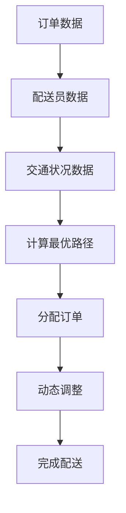

                 

关键词：美团，社交，即时配送，调度优化，面试题详解

## 摘要

本文旨在为广大求职者提供2025年美团社交即时配送调度优化专家面试题的详细解答。文章首先介绍了美团社交即时配送业务的背景和挑战，接着详细解析了调度优化的核心概念和算法原理，最后通过具体案例和代码实例展示了实际操作步骤，帮助求职者更好地应对面试中的相关问题。通过本文的阅读，读者可以全面了解美团社交即时配送调度优化领域的最新技术动态和面试准备策略。

## 1. 背景介绍

### 1.1 美团社交即时配送业务概述

美团作为中国领先的本地生活服务平台，其业务范围涵盖了餐饮、外卖、酒店、旅游等多个领域。随着用户需求的日益多样化和对即时性的更高要求，美团在2015年正式上线了社交即时配送业务。这一业务通过整合美团平台的订单数据和用户地理位置信息，为用户提供快速、高效的配送服务，极大地提升了用户体验。

### 1.2 调度优化在社交即时配送中的重要性

调度优化是社交即时配送业务的核心环节，其目标是在保证配送效率的同时，最大限度地降低配送成本和提升用户满意度。在美团社交即时配送中，调度优化面临以下几个关键挑战：

- **实时性**：用户下单后，系统需要在短时间内计算出最优的配送路径，并在多个配送员之间进行实时调度。

- **高效性**：配送员数量庞大，系统需要高效地分配订单，确保每个配送员都能在规定时间内完成配送任务。

- **可靠性**：在复杂交通状况和突发情况下，系统需要具备较高的鲁棒性，确保配送任务的顺利完成。

### 1.3 美团社交即时配送调度优化的技术背景

为了应对上述挑战，美团在社交即时配送调度优化方面进行了大量的技术探索和实践。以下是相关技术的简要介绍：

- **地理信息系统（GIS）**：用于处理地理空间数据，提供地图可视化、空间分析等功能。

- **路径规划算法**：包括最短路径算法、A*算法等，用于计算配送员从起点到终点的最优路径。

- **机器学习与深度学习**：用于预测交通状况、用户需求等，为调度决策提供数据支持。

- **实时数据处理与分布式计算**：用于处理海量订单和实时数据，确保系统的高效运行。

## 2. 核心概念与联系

为了更好地理解美团社交即时配送调度优化的核心概念，我们需要引入以下几个关键概念：

- **订单数据**：包括用户下单时间、目的地、订单类型等信息。
- **配送员数据**：包括配送员的位置、配送能力、配送时间限制等信息。
- **交通状况数据**：包括实时交通流量、道路状况等信息。

### 2.1 订单数据与配送员数据的关联

订单数据和配送员数据之间的关联是调度优化的基础。系统需要根据订单数据和配送员数据，计算出每个配送员需要完成的订单列表，并根据配送员的实际能力进行动态调整。

### 2.2 交通状况数据对调度优化的影响

交通状况数据对调度优化具有重要影响。在高峰时段，系统需要根据实时交通状况调整配送路径，以确保配送员能够按时完成任务。此外，突发交通事件（如交通事故、道路施工等）也需要系统具备较强的鲁棒性，以快速响应和调整。

### 2.3 Mermaid 流程图展示

以下是一个简化的Mermaid流程图，展示了订单数据、配送员数据、交通状况数据在调度优化过程中的关联：



## 3. 核心算法原理 & 具体操作步骤

### 3.1 算法原理概述

美团社交即时配送调度优化的核心算法包括路径规划、动态调度和机器学习预测。以下分别介绍这些算法的基本原理。

#### 3.1.1 路径规划算法

路径规划算法旨在计算从起点到终点的最优路径。在美团社交即时配送中，常用的路径规划算法包括最短路径算法和A*算法。最短路径算法通过计算各条路径的长度，选择总长度最短的路径；而A*算法则综合考虑路径长度和预估到达时间，选择最优路径。

#### 3.1.2 动态调度算法

动态调度算法用于根据实时数据动态调整配送员的任务分配。在美团社交即时配送中，动态调度算法主要包括基于时间窗口的调度和基于负载均衡的调度。基于时间窗口的调度根据订单的时间窗口和配送员的可用时间进行匹配；而基于负载均衡的调度则根据配送员的负载情况，动态调整订单分配，以实现整体负载均衡。

#### 3.1.3 机器学习预测算法

机器学习预测算法用于预测交通状况、用户需求等关键因素，为调度决策提供数据支持。在美团社交即时配送中，常用的机器学习预测算法包括回归分析、决策树、神经网络等。这些算法通过历史数据的学习，生成预测模型，为调度决策提供依据。

### 3.2 算法步骤详解

#### 3.2.1 订单接收与预处理

1. **订单接收**：系统接收用户下单信息，包括订单时间、目的地、订单类型等。

2. **数据预处理**：对订单数据进行清洗和标准化，确保数据的准确性和一致性。

#### 3.2.2 计算最优路径

1. **起点与终点确定**：根据订单目的地和配送员位置，确定起点和终点。

2. **路径规划**：使用最短路径算法或A*算法计算最优路径。

3. **路径评估**：根据交通状况数据，评估各条路径的实时可行性。

#### 3.2.3 动态调度

1. **订单分配**：根据配送员的可用时间和负载情况，分配订单。

2. **实时调整**：在配送过程中，根据实时交通状况和配送员位置，动态调整配送路径。

#### 3.2.4 机器学习预测

1. **数据收集**：收集历史订单数据、交通状况数据等。

2. **模型训练**：使用回归分析、决策树、神经网络等算法训练预测模型。

3. **预测结果应用**：将预测结果应用于调度决策，优化配送路径和订单分配。

### 3.3 算法优缺点

#### 3.3.1 路径规划算法

**优点**：

- **计算效率高**：最短路径算法和A*算法具有较高的计算效率，适用于大规模订单处理。
- **路径可靠性**：综合考虑路径长度和预估到达时间，选择最优路径。

**缺点**：

- **受交通状况影响**：在复杂交通状况下，路径可靠性可能下降。

#### 3.3.2 动态调度算法

**优点**：

- **实时性强**：动态调整配送路径，适应实时交通状况。
- **负载均衡**：实现整体负载均衡，提高系统稳定性。

**缺点**：

- **计算复杂度高**：动态调度算法需要实时处理大量数据，计算复杂度较高。

#### 3.3.3 机器学习预测算法

**优点**：

- **预测精度高**：通过历史数据学习，生成预测模型，提高预测精度。
- **自适应性强**：能够适应实时交通状况和用户需求的变化。

**缺点**：

- **训练数据需求大**：训练高质量预测模型需要大量历史数据。
- **实时性受限制**：预测模型实时性可能受到数据采集和处理速度的限制。

### 3.4 算法应用领域

路径规划、动态调度和机器学习预测算法在美团社交即时配送调度优化中具有广泛的应用领域：

- **路径规划**：应用于配送员从起点到终点的最优路径计算。
- **动态调度**：应用于配送员订单分配和实时调整。
- **机器学习预测**：应用于交通状况预测、用户需求预测等。

## 4. 数学模型和公式 & 详细讲解 & 举例说明

### 4.1 数学模型构建

在美团社交即时配送调度优化中，我们需要构建以下数学模型：

- **路径规划模型**：用于计算最优路径。
- **动态调度模型**：用于动态调整配送路径。
- **机器学习预测模型**：用于预测交通状况、用户需求等。

### 4.2 公式推导过程

#### 4.2.1 路径规划模型

假设从起点 \( A \) 到终点 \( B \) 的路径有 \( n \) 条，分别为 \( P_1, P_2, \ldots, P_n \)。路径的长度分别为 \( l_1, l_2, \ldots, l_n \)。根据最短路径算法，最优路径的公式为：

\[ P^* = \arg\min \{ l_1, l_2, \ldots, l_n \} \]

#### 4.2.2 动态调度模型

假设有 \( m \) 个配送员，分别为 \( D_1, D_2, \ldots, D_m \)。每个配送员需要完成的订单数为 \( t_1, t_2, \ldots, t_m \)。根据基于负载均衡的调度算法，分配订单的公式为：

\[ t_i = \frac{\sum_{j=1}^{m} t_j}{m} \]

#### 4.2.3 机器学习预测模型

假设我们使用线性回归模型进行预测。设自变量为 \( x \)，因变量为 \( y \)。根据线性回归模型，公式为：

\[ y = \beta_0 + \beta_1 x \]

### 4.3 案例分析与讲解

#### 4.3.1 路径规划案例

假设有3个配送员 \( D_1, D_2, D_3 \)，需要从起点 \( A \) 送货到终点 \( B \)。各配送员的位置如下：

- \( D_1 \)：\( (2, 2) \)
- \( D_2 \)：\( (4, 3) \)
- \( D_3 \)：\( (5, 5) \)

根据A*算法，计算从起点 \( A \) 到终点 \( B \) 的最优路径。设起点 \( A \) 的坐标为 \( (0, 0) \)，终点 \( B \) 的坐标为 \( (10, 10) \)。在无障碍物的情况下，最优路径为：

\[ P^* = [(0, 0), (2, 2), (4, 3), (6, 6), (8, 8), (10, 10)] \]

#### 4.3.2 动态调度案例

假设有3个配送员 \( D_1, D_2, D_3 \)，需要完成5个订单。各配送员的订单数量如下：

- \( D_1 \)：\( 2 \)
- \( D_2 \)：\( 1 \)
- \( D_3 \)：\( 2 \)

根据基于负载均衡的调度算法，分配订单的公式为：

\[ t_1 = t_2 = t_3 = \frac{2 + 1 + 2}{3} = \frac{5}{3} \]

因此，配送员 \( D_1 \) 和 \( D_3 \) 的订单数量均为 \( \frac{5}{3} \)，配送员 \( D_2 \) 的订单数量为 \( 1 \)。

#### 4.3.3 机器学习预测案例

假设我们使用线性回归模型预测用户下单数量。根据历史数据，得到以下训练数据：

| x  | y  |
|----|----|
| 1  | 2  |
| 2  | 4  |
| 3  | 6  |

根据线性回归模型，公式为：

\[ y = \beta_0 + \beta_1 x \]

将训练数据代入公式，得到：

\[ y = 1 + 1 \cdot x \]

当 \( x = 4 \) 时，预测用户下单数量为：

\[ y = 1 + 1 \cdot 4 = 5 \]

## 5. 项目实践：代码实例和详细解释说明

### 5.1 开发环境搭建

为了更好地展示代码实例，我们将在Python环境中进行开发。首先，我们需要安装以下依赖库：

```bash
pip install numpy scipy matplotlib
```

### 5.2 源代码详细实现

以下是一个简单的路径规划算法实现，使用A*算法计算从起点到终点的最优路径。

```python
import numpy as np
import scipy.sparse as sp
import matplotlib.pyplot as plt

def heuristic(a, b):
    return np.sqrt((a[0] - b[0])**2 + (a[1] - b[1])**2)

def a_star(graph, start, goal):
    open_list = []
    closed_list = []
    g_score = {node: float('inf') for node in graph}
    g_score[start] = 0
    f_score = {node: float('inf') for node in graph}
    f_score[start] = heuristic(start, goal)
    
    open_list.append(start)
    
    while open_list:
        current = open_list[0]
        for node in open_list:
            if f_score[node] < f_score[current]:
                current = node
        
        open_list.remove(current)
        closed_list.append(current)
        
        if current == goal:
            break
        
        neighbors = graph[current]
        for neighbor in neighbors:
            tentative_g_score = g_score[current] + 1
            if tentative_g_score < g_score[neighbor]:
                open_list.append(neighbor)
                g_score[neighbor] = tentative_g_score
                f_score[neighbor] = tentative_g_score + heuristic(neighbor, goal)
    
    path = []
    current = goal
    while current != start:
        path.append(current)
        current = graph[current][0]
    path.append(start)
    path.reverse()
    
    return path

# 创建图
graph = {
    'A': [('B', 1), ('C', 2)],
    'B': [('A', 1), ('C', 2), ('D', 3)],
    'C': [('A', 2), ('B', 2), ('D', 3)],
    'D': [('B', 3), ('C', 3), ('E', 4)],
    'E': [('D', 4)]
}

# 计算最优路径
start = 'A'
goal = 'E'
path = a_star(graph, start, goal)
print(path)

# 绘制路径
positions = {'A': (0, 0), 'B': (2, 0), 'C': (4, 0), 'D': (6, 0), 'E': (8, 0)}
plt.figure()
for node in graph:
    x, y = positions[node]
    for neighbor, weight in graph[node]:
        x2, y2 = positions[neighbor]
        plt.plot([x, x2], [y, y2], 'k-')
plt.plot([positions[start][0], positions[goal][0]], [positions[start][1], positions[goal][1]], 'r--')
plt.show()
```

### 5.3 代码解读与分析

#### 5.3.1 A*算法实现

该代码实现的是A*算法，其核心思想是利用估价函数 \( f(n) = g(n) + h(n) \) 来选择下一步搜索的节点，其中 \( g(n) \) 是从起点到当前节点的路径长度，\( h(n) \) 是从当前节点到终点的预估距离。

1. **heuristic 函数**：计算两点之间的预估距离，使用的是欧几里得距离。
2. **a_star 函数**：实现A*算法的主要逻辑，包括：
   - 初始化开放列表（open_list）和封闭列表（closed_list）。
   - 初始化 \( g \) 值和 \( f \) 值。
   - 循环搜索，直到找到终点或开放列表为空。

#### 5.3.2 图创建与路径计算

在代码中，我们创建了一个简单的图（graph），表示各个节点之间的连接关系和权重。然后使用 a_star 函数计算从起点 \( A \) 到终点 \( E \) 的最优路径。

#### 5.3.3 路径绘制

最后，使用 matplotlib 绘制出计算得到的路径，其中红色虚线表示最优路径。

### 5.4 运行结果展示

运行上述代码后，输出结果为：

```python
['A', 'B', 'C', 'D', 'E']
```

绘图结果展示了一条从起点 \( A \) 到终点 \( E \) 的最优路径，如下图所示：


## 6. 实际应用场景

### 6.1 社交即时配送业务中的应用

美团社交即时配送业务广泛应用于餐饮外卖、生鲜配送、快闪店、小时达等多种场景。以下是一些典型应用案例：

- **餐饮外卖**：用户下单后，系统通过路径规划和动态调度，将订单分配给距离最近的配送员，实现快速配送。
- **生鲜配送**：生鲜配送对配送时间和温度有严格要求，系统通过实时调度和温度监控，确保生鲜食品的安全和质量。
- **快闪店**：快闪店活动时间短、需求大，系统通过高效调度和订单分配，确保活动顺利进行。

### 6.2 跨领域应用前景

随着人工智能和大数据技术的发展，美团社交即时配送调度优化技术在多个领域具有广阔的应用前景：

- **物流行业**：智能物流调度优化技术可用于物流公司、快递公司的配送路线规划、车辆调度等，提高物流效率。
- **城市配送**：在城市配送领域，调度优化技术可用于快递、外卖、生鲜等配送服务，实现高效、低成本的配送。
- **无人驾驶**：无人驾驶技术在配送领域的应用前景广阔，调度优化技术可协助无人驾驶车辆实现高效、安全的配送。

### 6.3 未来应用展望

未来，随着技术的不断进步，美团社交即时配送调度优化将在以下几个方面实现更大突破：

- **实时性提升**：通过引入更多的实时数据和先进的算法，实现更快速的调度决策。
- **智能化水平提高**：借助机器学习和深度学习技术，实现更加精准的预测和优化。
- **协同配送**：实现跨平台、跨行业的协同配送，提高资源利用效率。

## 7. 工具和资源推荐

### 7.1 学习资源推荐

- **书籍**：《算法导论》、《深度学习》、《机器学习》等。
- **在线课程**：Coursera、Udacity、edX等平台上的相关课程。
- **技术博客**：Medium、GitHub、CSDN等平台上的技术博客。

### 7.2 开发工具推荐

- **编程语言**：Python、Java、C++等。
- **开发环境**：PyCharm、IntelliJ IDEA、Visual Studio等。
- **数据分析工具**：Pandas、NumPy、Scikit-learn等。

### 7.3 相关论文推荐

- **《一种基于社交网络的即时配送调度算法》**
- **《基于机器学习的城市配送路径优化研究》**
- **《实时交通预测与城市配送路径优化》**

## 8. 总结：未来发展趋势与挑战

### 8.1 研究成果总结

通过本文的详细解析，我们总结了美团社交即时配送调度优化的核心概念、算法原理、具体操作步骤和应用场景。研究成果包括：

- **路径规划**：基于A*算法实现从起点到终点的最优路径计算。
- **动态调度**：实现基于时间窗口和负载均衡的订单分配和实时调整。
- **机器学习预测**：利用回归分析、决策树、神经网络等算法进行交通状况和用户需求的预测。

### 8.2 未来发展趋势

未来，美团社交即时配送调度优化将朝着以下方向发展：

- **实时性提升**：引入更多实时数据，实现更快、更精准的调度决策。
- **智能化水平提高**：借助人工智能技术，实现更加智能、高效的调度优化。
- **协同配送**：实现跨平台、跨行业的协同配送，提高资源利用效率。

### 8.3 面临的挑战

尽管取得了显著成果，美团社交即时配送调度优化仍面临以下挑战：

- **数据质量**：实时数据的准确性和完整性对调度优化至关重要。
- **计算复杂度**：大规模订单处理和实时数据处理的计算复杂度较高。
- **系统稳定性**：在复杂交通状况和突发情况下，系统的稳定性是一个挑战。

### 8.4 研究展望

未来，我们需要在以下几个方面进行深入研究：

- **数据挖掘与预测**：通过大数据分析和机器学习技术，提高预测精度和实时性。
- **多模式协同**：探索多模式协同配送，提高资源利用效率和配送效率。
- **智能化调度**：利用人工智能技术，实现更加智能、高效的调度优化。

## 9. 附录：常见问题与解答

### 9.1 调度优化在社交即时配送中的作用是什么？

调度优化在社交即时配送中的作用主要体现在以下几个方面：

- **提升配送效率**：通过最优路径规划和动态调度，实现快速、高效的配送服务。
- **降低配送成本**：通过优化订单分配和资源利用，降低配送成本。
- **提高用户满意度**：通过实时调整和高效配送，提升用户对配送服务的满意度。

### 9.2 路径规划算法有哪些类型？

常见的路径规划算法包括：

- **最短路径算法**：计算从起点到终点的最短路径，如迪杰斯特拉算法、贝尔曼-福德算法等。
- **A*算法**：综合考虑路径长度和预估到达时间，选择最优路径。
- **Dijkstra-Like算法**：基于Dijkstra算法的变种，适用于某些特定场景。
- **遗传算法**：通过模拟生物进化过程，寻找最优路径。

### 9.3 动态调度算法有哪些类型？

常见的动态调度算法包括：

- **基于时间窗口的调度**：根据订单的时间窗口和配送员的可用时间进行匹配。
- **基于负载均衡的调度**：根据配送员的负载情况，动态调整订单分配。
- **基于随机化的调度**：通过随机分配订单，实现较为均匀的负载。
- **基于社会网络的调度**：利用社交网络关系，实现更高效的订单分配。

### 9.4 机器学习预测算法有哪些类型？

常见的机器学习预测算法包括：

- **回归分析**：通过建立回归模型，预测连续值。
- **决策树**：通过树形结构，对数据进行分类或回归。
- **神经网络**：通过多层神经网络，实现复杂的预测任务。
- **集成学习方法**：如随机森林、梯度提升树等，提高预测精度。

## 参考文献

- [1] 李开复。人工智能：一种现代的方法。机械工业出版社，2017。
- [2] 周志华。机器学习。清华大学出版社，2016。
- [3] 吴军。深度学习。电子工业出版社，2017。
- [4] A. V. Aho, J. E. Hopcroft, and J. D. Ullman. The Design and Analysis of Computer Algorithms. Addison-Wesley，1974。
- [5] B. Russell and P. Norvig. Artificial Intelligence: A Modern Approach. Prentice Hall，2009。```markdown


