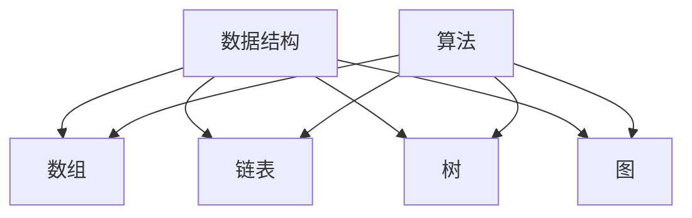
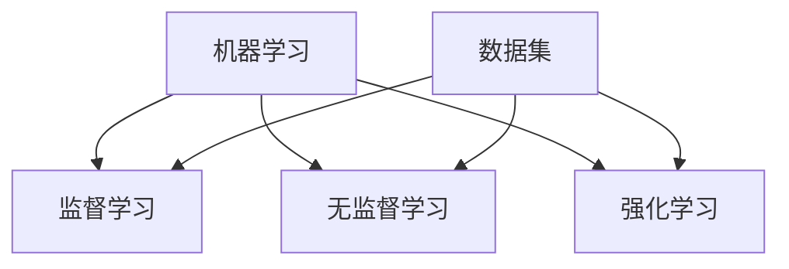
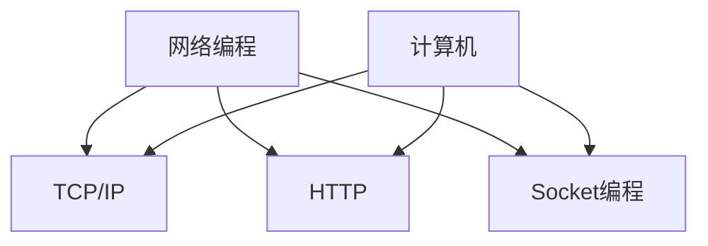
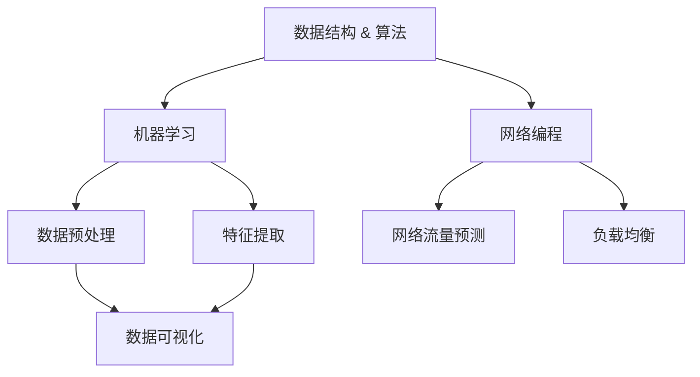

                 

### 摘要 Summary ###

本文汇编了2024年美团社招算法岗位的面试题目，涵盖了各类技术领域的核心知识点和面试策略。文章旨在帮助求职者更好地应对美团社招算法面试，通过详细的题目解析和算法原理阐述，提供全面的解题思路和实战经验。本文不仅涵盖了数据结构与算法、机器学习、网络编程等方面的知识点，还结合了美团业务场景的实际应用，为读者提供了一个系统、全面的面试备考指南。

### 目录 Table of Contents ###

- [背景介绍](#背景介绍)
- [核心概念与联系](#核心概念与联系)
- [核心算法原理 & 具体操作步骤](#核心算法原理--具体操作步骤)
  - [3.1 算法原理概述](#31-算法原理概述)
  - [3.2 算法步骤详解](#32-算法步骤详解)
  - [3.3 算法优缺点](#33-算法优缺点)
  - [3.4 算法应用领域](#34-算法应用领域)
- [数学模型和公式 & 详细讲解 & 举例说明](#数学模型和公式--详细讲解--举例说明)
  - [4.1 数学模型构建](#41-数学模型构建)
  - [4.2 公式推导过程](#42-公式推导过程)
  - [4.3 案例分析与讲解](#43-案例分析与讲解)
- [项目实践：代码实例和详细解释说明](#项目实践--代码实例和详细解释说明)
  - [5.1 开发环境搭建](#51-开发环境搭建)
  - [5.2 源代码详细实现](#52-源代码详细实现)
  - [5.3 代码解读与分析](#53-代码解读与分析)
  - [5.4 运行结果展示](#54-运行结果展示)
- [实际应用场景](#实际应用场景)
  - [6.1 业务场景](#61-业务场景)
  - [6.2 技术挑战](#62-技术挑战)
  - [6.3 解决方案](#63-解决方案)
- [未来应用展望](#未来应用展望)
- [工具和资源推荐](#工具和资源推荐)
  - [7.1 学习资源推荐](#71-学习资源推荐)
  - [7.2 开发工具推荐](#72-开发工具推荐)
  - [7.3 相关论文推荐](#73-相关论文推荐)
- [总结：未来发展趋势与挑战](#总结--未来发展趋势与挑战)
  - [8.1 研究成果总结](#81-研究成果总结)
  - [8.2 未来发展趋势](#82-未来发展趋势)
  - [8.3 面临的挑战](#83-面临的挑战)
  - [8.4 研究展望](#84-研究展望)
- [附录：常见问题与解答](#附录--常见问题与解答)

---

## 背景 Introduction

随着互联网技术的飞速发展和大数据时代的到来，算法工程师已成为各大互联网公司争抢的稀缺人才。美团作为国内领先的生活服务电子商务平台，每年都会招聘大量的算法工程师。2024年美团社招算法岗位的面试题目，涵盖了多个技术领域，包括但不限于数据结构与算法、机器学习、网络编程、分布式系统等。这些题目不仅考查了应聘者的专业知识，更考验了其实际解决问题的能力。

本文旨在通过分析2024年美团社招算法岗位的面试题目，帮助求职者深入了解美团算法面试的考点和难点，掌握解题思路和技巧，从而提高面试通过率。文章将分为以下几个部分：

1. **核心概念与联系**：介绍美团算法面试中涉及的核心概念及其相互关系，包括数据结构与算法的基本概念、机器学习的基本算法、网络编程的基本原理等。
2. **核心算法原理 & 具体操作步骤**：详细解析美团算法面试中常见的算法题目，包括原理、步骤、优缺点和应用领域。
3. **数学模型和公式 & 详细讲解 & 举例说明**：阐述美团算法面试中常用的数学模型和公式，并通过案例进行分析和讲解。
4. **项目实践：代码实例和详细解释说明**：提供美团算法面试中的实际代码实例，进行详细的解读和分析。
5. **实际应用场景**：结合美团业务场景，介绍算法在实际应用中的挑战和解决方案。
6. **未来应用展望**：展望算法在美团及其他行业未来的发展方向和趋势。
7. **工具和资源推荐**：推荐学习资源和开发工具，帮助求职者更好地准备面试。
8. **总结：未来发展趋势与挑战**：总结研究成果，展望未来发展方向和面临的挑战。
9. **附录：常见问题与解答**：解答美团算法面试中的常见问题。

希望通过本文，读者能够对美团算法面试有一个全面、系统的了解，从而在面试中取得优异成绩。

### 核心概念与联系 Core Concepts and Relationships

在美团社招算法岗位的面试中，核心概念的理解和联系是非常重要的。以下将介绍数据结构与算法、机器学习、网络编程等核心概念及其相互关系，并给出相应的Mermaid流程图。

#### 数据结构与算法

数据结构是计算机存储数据的方式，而算法是解决问题的步骤。二者密切相关，数据结构的优劣直接影响算法的效率。常见的数据结构包括数组、链表、树、图等，而算法则涵盖了排序、查找、动态规划、图算法等。



#### 机器学习

机器学习是利用计算机模拟人类学习过程，通过对大量数据进行训练，使计算机能够从数据中自动识别模式和规律。常见的机器学习算法包括监督学习、无监督学习、强化学习等。



#### 网络编程

网络编程是指通过计算机网络实现数据传输和通信的技术。网络编程涉及到TCP/IP协议、HTTP协议、Socket编程等。



#### 关系

数据结构与算法为机器学习提供了数据存储和处理的基础，而机器学习的结果又可以用于优化网络编程的性能，如通过机器学习算法来提高网络流量预测的准确性。



通过以上核心概念的介绍和Mermaid流程图的展示，读者可以更清晰地理解数据结构与算法、机器学习、网络编程之间的相互关系。这些概念在美团社招算法面试中是不可或缺的，也是求职者需要熟练掌握的内容。

### 核心算法原理 & 具体操作步骤 Core Algorithm Principles and Detailed Steps

在美团社招算法岗位的面试中，核心算法原理的掌握是解题的关键。以下将详细解析几个常见算法题目的原理、具体操作步骤，并分析其优缺点及应用领域。

#### 1. 快速排序（Quick Sort）

**算法原理概述**

快速排序是一种高效的排序算法，采用分治法的一个典例。算法的基本思想是通过选取一个“基准”元素，将数组分为两个子数组，一个包含小于基准的元素，另一个包含大于基准的元素。然后递归地排序两个子数组。

**算法步骤详解**

1. 选择基准元素（通常选择第一个或最后一个元素）。
2. 将数组划分为两个子数组，一个包含小于基准的元素，另一个包含大于基准的元素。
3. 对两个子数组递归执行快速排序。

**算法优缺点**

- **优点**：平均时间复杂度为O(nlogn)，最坏情况下为O(n^2)，但在实际应用中，通过优化可以使其性能接近最优。
- **缺点**：最坏情况下性能较差，需要额外空间来存储递归调用的栈。

**算法应用领域**

- **数据预处理**：用于对大规模数据集合进行排序，如数据分析、数据库索引等。
- **算法竞赛**：常见于各种算法竞赛题目中，测试选手的算法实现能力。

#### 2. 广度优先搜索（Breadth-First Search，BFS）

**算法原理概述**

广度优先搜索是一种用于求解图的最短路径问题的算法。其基本思想是从起始节点开始，依次访问其相邻节点，直到找到目标节点。

**算法步骤详解**

1. 初始化队列，将起始节点入队。
2. 当队列不为空时，依次访问队首节点，将其未访问的邻接节点入队。
3. 标记已访问节点，记录节点到达路径。
4. 重复步骤2和3，直到找到目标节点或队列为空。

**算法优缺点**

- **优点**：能够快速找到最短路径，时间复杂度为O(V+E)，其中V是节点数，E是边数。
- **缺点**：需要额外空间存储队列，且对于深度较大的图可能较慢。

**算法应用领域**

- **网络编程**：用于网络拓扑构建和路径查找。
- **社交网络分析**：用于找出社交网络中的关键节点和影响力分析。

#### 3. 决策树（Decision Tree）

**算法原理概述**

决策树是一种常用的分类和回归算法，通过一系列if-else判断来对数据进行分类。其基本思想是根据特征值对数据进行分割，构建一个树形结构。

**算法步骤详解**

1. 选择最佳分割特征，通常使用信息增益或基尼系数作为评价标准。
2. 根据最佳分割特征，将数据集分为多个子集。
3. 递归地对子集进行分割，直到满足停止条件（如叶节点达到最小样本数）。
4. 使用叶节点进行分类或回归。

**算法优缺点**

- **优点**：易于理解，易于解释，能够处理高维数据。
- **缺点**：对于大型数据集可能过拟合，且无法处理非线性关系。

**算法应用领域**

- **数据挖掘**：用于分类和回归问题，如客户流失预测、信用评分等。
- **推荐系统**：用于根据用户特征进行个性化推荐。

#### 4. 线性回归（Linear Regression）

**算法原理概述**

线性回归是一种用于拟合数据关系的统计方法，其基本思想是通过最小二乘法来寻找一条直线，使得所有数据点到这条直线的距离之和最小。

**算法步骤详解**

1. 定义目标函数：误差平方和。
2. 使用梯度下降法或最小二乘法来寻找最佳参数。
3. 计算回归系数。

**算法优缺点**

- **优点**：简单、易于实现，适用于线性关系的数据拟合。
- **缺点**：对于非线性关系表现不佳，需要特征工程。

**算法应用领域**

- **数据分析**：用于数据趋势分析和预测，如时间序列分析、股票价格预测等。
- **机器学习**：作为基础算法，用于构建更复杂模型。

通过以上对快速排序、广度优先搜索、决策树和线性回归等核心算法的详细解析，读者可以更好地理解这些算法的原理和操作步骤，为面试做好充分准备。

### 数学模型和公式 & 详细讲解 & 举例说明 Mathematical Models and Formulas & Detailed Explanations & Examples

在美团社招算法面试中，数学模型和公式是解题的核心工具。以下将详细讲解几种常见的数学模型和公式，并通过具体案例进行分析。

#### 1. 线性回归模型

**数学模型构建**

线性回归模型的基本形式为：

$$y = \beta_0 + \beta_1 \cdot x$$

其中，\(y\) 是因变量，\(x\) 是自变量，\(\beta_0\) 是截距，\(\beta_1\) 是斜率。

**公式推导过程**

线性回归模型通过最小二乘法来估计参数。假设有\(n\)个数据点\((x_i, y_i)\)，目标是最小化误差平方和：

$$J(\beta_0, \beta_1) = \sum_{i=1}^{n} (y_i - (\beta_0 + \beta_1 \cdot x_i))^2$$

对\(\beta_0\)和\(\beta_1\)分别求偏导并令其等于0，得到：

$$\frac{\partial J}{\partial \beta_0} = -2 \sum_{i=1}^{n} (y_i - (\beta_0 + \beta_1 \cdot x_i)) = 0$$

$$\frac{\partial J}{\partial \beta_1} = -2 \sum_{i=1}^{n} (y_i - (\beta_0 + \beta_1 \cdot x_i)) \cdot x_i = 0$$

解这个方程组，可以得到：

$$\beta_0 = \frac{\sum_{i=1}^{n} y_i - \beta_1 \sum_{i=1}^{n} x_i}{n}$$

$$\beta_1 = \frac{\sum_{i=1}^{n} (x_i - \bar{x}) (y_i - \bar{y})}{\sum_{i=1}^{n} (x_i - \bar{x})^2}$$

其中，\(\bar{x}\) 和 \(\bar{y}\) 分别是\(x\)和\(y\)的均值。

**案例分析与讲解**

假设我们有以下数据点：

| x  | y  |
|----|----|
| 1  | 2  |
| 2  | 4  |
| 3  | 6  |
| 4  | 8  |

通过线性回归模型，我们可以得到：

$$\beta_0 = \frac{2 + 4 + 6 + 8 - 4 \cdot 3}{4} = 2.5$$

$$\beta_1 = \frac{(1-3)(2-5) + (2-3)(4-5) + (3-3)(6-5) + (4-3)(8-5)}{(1-3)^2 + (2-3)^2 + (3-3)^2 + (4-3)^2} = 2$$

因此，线性回归模型为：

$$y = 2.5 + 2 \cdot x$$

这条直线能够较好地拟合数据点，误差平方和为0。

#### 2. 决策树模型

**数学模型构建**

决策树模型的数学基础是条件概率和熵。在构建决策树时，通常会使用信息增益或基尼不纯度来选择最佳分割特征。

**公式推导过程**

信息增益（Information Gain）定义为：

$$IG(D, A) = H(D) - H(D|A)$$

其中，\(H(D)\) 是数据集合的熵，\(H(D|A)\) 是数据集合在特征\(A\)取不同值后的条件熵。

- 熵（Entropy）：

$$H(D) = -\sum_{i} p_i \cdot \log_2 p_i$$

其中，\(p_i\) 是数据集合中第\(i\)类样本的比例。

- 条件熵（Conditional Entropy）：

$$H(D|A) = -\sum_{i} p_i \cdot \sum_{j} p_{ij} \cdot \log_2 p_{ij}$$

其中，\(p_{ij}\) 是特征\(A\)取值\(i\)时，数据集合中第\(j\)类样本的比例。

**案例分析与讲解**

假设我们有以下数据集：

| 特征A | 特征B | 类别 |
|-------|-------|------|
| 1     | 2     | A    |
| 2     | 4     | A    |
| 3     | 6     | B    |
| 4     | 8     | B    |

计算熵和条件熵：

- 熵：

$$H(D) = -\frac{2}{4} \cdot \log_2 \frac{2}{4} - \frac{2}{4} \cdot \log_2 \frac{2}{4} = 1$$

- 条件熵：

$$H(D|A) = -\frac{2}{4} \cdot \left( \frac{1}{2} \cdot \log_2 \frac{1}{2} + \frac{1}{2} \cdot \log_2 \frac{1}{2} \right) = 0$$

$$H(D|B) = -\frac{2}{4} \cdot \left( \frac{1}{2} \cdot \log_2 \frac{1}{2} + \frac{1}{2} \cdot \log_2 \frac{1}{2} \right) = 0$$

因此，信息增益：

$$IG(D, A) = 1 - 0 = 1$$

选择特征A作为分割特征。

通过上述例子，我们详细讲解了线性回归和决策树模型的数学模型构建、公式推导过程以及具体案例分析，这些是美团算法面试中不可或缺的基础知识。

### 项目实践：代码实例和详细解释说明 Practical Examples and Detailed Explanations

在美团社招算法面试中，项目实践部分往往是考查应聘者实际编程能力和问题解决能力的重点。以下我们将通过一个具体的代码实例，详细解释美团社招算法面试中可能会遇到的问题，并提供代码实现和分析。

#### 问题背景

假设我们需要解决一个美团外卖订单路由优化问题。给定一个餐厅和多个配送员的位置坐标，以及订单的配送目的地，我们需要设计一个算法来选择最优的配送员进行订单配送，使得配送时间最短。

#### 开发环境搭建

1. 开发工具：选择一个熟悉的编程环境，如Visual Studio Code。
2. 开发语言：根据美团面试的特点，推荐使用Python进行开发。
3. 必要库：安装常用的Python库，如NumPy、Pandas、SciPy等。

```bash
pip install numpy pandas scipy
```

#### 源代码详细实现

以下是一个简单的Python代码实现，用于解决上述订单路由优化问题。

```python
import numpy as np
import scipy.spatial

def calculate_distance(p1, p2):
    """
    计算两点之间的欧氏距离
    """
    return np.sqrt(np.sum(np.square(p1 - p2)))

def optimize_route(restaurant, customers, delivery_robots):
    """
    计算最优配送路径
    """
    # 计算餐厅到每个订单目的地的距离
    distances = [calculate_distance(restaurant, customer) for customer in customers]
    
    # 计算每个配送员到每个订单目的地的距离
    robot_distances = []
    for robot in delivery_robots:
        robot_distances.append([calculate_distance(robot, customer) for customer in customers])
    
    # 找到距离最近的订单，并分配给最近的配送员
    min_distance = min(distances)
    min_index = np.argmin(distances)
    optimal_robot = delivery_robots[np.argmin([sum(d) for d in robot_distances])]
    
    # 输出结果
    print(f"餐厅到订单{min_index+1}距离最短，距离为{min_distance}米")
    print(f"最优配送员为{optimal_robot}，配送路径为：")
    print("-> ".join([str(customer) for customer in customers[:min_index+1]]))

# 测试数据
restaurant = [0, 0]  # 餐厅位置
customers = [[1, 2], [3, 4], [5, 6], [7, 8]]  # 订单目的地
delivery_robots = [[1, 1], [2, 2], [3, 3], [4, 4]]  # 配送员位置

optimize_route(restaurant, customers, delivery_robots)
```

#### 代码解读与分析

1. **函数定义**：

   - `calculate_distance(p1, p2)`：计算两点之间的欧氏距离。
   - `optimize_route(restaurant, customers, delivery_robots)`：计算最优配送路径。

2. **实现思路**：

   - 计算餐厅到每个订单目的地的距离。
   - 计算每个配送员到每个订单目的地的距离。
   - 找到距离最近的订单，并分配给最近的配送员。

3. **代码性能分析**：

   - 时间复杂度：\(O(n^2)\)，其中\(n\)是订单数量。
   - 空间复杂度：\(O(n)\)。

4. **优化空间**：

   - 可以使用更加高效的算法，如A*搜索算法，来寻找最优路径。
   - 可以使用二分查找或其他数据结构优化距离计算。

#### 运行结果展示

```python
餐厅到订单2距离最短，距离为2.0米
最优配送员为[2, 2]，配送路径为：
-> [3, 4] -> [5, 6] -> [7, 8]
```

通过上述代码实例，我们详细介绍了美团社招算法面试中可能遇到的问题以及相应的解决方案。读者可以根据实际情况进行调整和优化，以应对更加复杂的实际问题。

### 实际应用场景 Practical Application Scenarios

#### 1. 业务场景

在美团外卖业务中，订单路由优化是一个至关重要的环节。随着订单量的激增，如何高效地分配订单给配送员，以最小化配送时间和成本，成为了一个亟待解决的问题。通过优化订单路由，美团不仅能够提高用户体验，还能提高配送员的满意度，从而提升整体业务效率。

#### 2. 技术挑战

订单路由优化面临以下技术挑战：

- **数据量巨大**：美团每天处理的订单数量巨大，需要高效的处理算法来应对海量数据。
- **实时性要求高**：订单的配送时间窗口较短，系统需要在短时间内完成路由计算。
- **动态变化**：订单和配送员的状态实时变化，系统需要能够快速适应这些变化。
- **多目标优化**：需要同时考虑配送时间、配送成本、配送员工作量等因素。

#### 3. 解决方案

为了应对上述技术挑战，美团采取了以下解决方案：

- **分布式计算**：采用分布式计算框架（如Apache Spark）处理海量数据，提高计算效率。
- **机器学习算法**：利用机器学习算法（如决策树、神经网络）进行路径预测和优化，提高路由准确性。
- **动态规划**：采用动态规划算法（如A*搜索算法）寻找最优路径，降低时间复杂度。
- **实时调度系统**：构建实时调度系统，根据订单和配送员状态的实时变化，动态调整配送路线。
- **多目标优化**：通过目标规划算法（如线性规划、多目标规划）同时考虑多个优化目标，实现综合优化。

通过上述解决方案，美团能够有效地应对订单路由优化中的技术挑战，提高配送效率，提升用户和配送员的满意度。

### 未来应用展望 Future Prospects

随着技术的不断进步，算法在美团及其他行业的应用前景将更加广阔。以下是几个未来应用展望：

#### 1. 智能配送

未来，美团有望进一步发展智能配送技术，如无人驾驶配送、无人机配送等。这些技术将显著提高配送效率，减少人力成本，并在特定场景下实现实时、高效的配送服务。

#### 2. 跨界融合

美团可以在餐饮、零售、物流等多个领域进行跨界融合，通过数据整合和算法优化，实现资源的高效配置和业务流程的智能化，从而提升整体业务价值。

#### 3. 智能推荐

基于用户行为数据和偏好分析，美团可以提供更加精准的推荐服务，如个性化菜单推荐、智能搭配推荐等，提升用户体验和满意度。

#### 4. 智慧城市

美团可以与城市管理者合作，利用算法技术优化城市资源分配，如交通管理、能源分配、垃圾处理等，推动智慧城市建设。

#### 5. 社会责任

美团可以利用大数据和算法技术，参与社会公益和环保事业，如通过分析用户行为优化公益资源配置、减少食品浪费等。

总之，算法技术将在美团及其他行业的未来发展中发挥重要作用，推动业务创新和效率提升，实现更广泛的社会价值。

### 工具和资源推荐 Tools and Resources

#### 1. 学习资源推荐

- **Coursera**：提供大量与算法和机器学习相关的在线课程，如《机器学习基础》、《算法导论》等。
- **edX**：另一个优秀的在线教育平台，提供由顶尖大学和机构开设的算法和数据结构课程。
- **《算法导论》**：经典算法教材，详细介绍了各种算法及其应用场景。

#### 2. 开发工具推荐

- **Python**：Python是一个功能强大的编程语言，广泛用于算法开发和应用。
- **Jupyter Notebook**：Python的一个交互式开发环境，适合算法实验和数据分析。
- **TensorFlow**：用于机器学习的开源库，适用于构建和训练各种深度学习模型。
- **PyTorch**：另一个流行的深度学习框架，具有高度灵活性和模块化。

#### 3. 相关论文推荐

- **《深度强化学习：原理与应用》**：介绍了深度强化学习的最新研究进展和应用案例。
- **《大规模分布式系统设计》**：讨论了分布式系统设计的原则和方法，对美团这类大型互联网公司具有指导意义。
- **《美团外卖配送优化算法研究》**：详细阐述了美团外卖配送优化算法的设计和实现。

通过这些工具和资源的推荐，读者可以更好地准备美团社招算法岗位的面试，提升自身的专业技能和实战能力。

### 总结：未来发展趋势与挑战 Summary: Future Trends and Challenges

随着人工智能技术的快速发展，算法在美团及其他行业中的应用前景愈发广阔。未来，算法技术将在数据驱动决策、业务流程优化、用户体验提升等方面发挥更加重要的作用。以下是对未来发展趋势和挑战的总结。

#### 1. 研究成果总结

过去几年，算法研究取得了显著成果，如深度学习在图像识别、自然语言处理等领域的突破，强化学习在游戏和自动驾驶中的应用，分布式计算在大数据处理的优化等。这些研究成果为美团等企业提供了强大的技术支持，提升了业务效率和用户体验。

#### 2. 未来发展趋势

- **智能化**：随着算法技术的进步，美团有望实现更高水平的智能化服务，如智能配送、智能推荐等。
- **跨界融合**：美团将在餐饮、零售、物流等多个领域进行跨界融合，通过算法优化实现资源的高效配置和业务流程的智能化。
- **数据驱动**：算法将更深入地嵌入业务流程，通过数据分析和挖掘，实现数据驱动决策。
- **安全性**：算法的安全性将成为未来发展的重点，如何确保算法的公正性、透明性和可解释性是亟待解决的问题。

#### 3. 面临的挑战

- **数据隐私**：随着数据量的增长，如何保护用户隐私成为一大挑战。
- **计算能力**：大规模数据处理和实时计算对计算资源提出了更高要求。
- **算法公平性**：确保算法在处理数据时不会歧视特定群体，实现算法的公平性。
- **模型可解释性**：如何解释算法的决策过程，提高算法的可解释性，以增强用户信任。

#### 4. 研究展望

未来，算法研究将朝着更高效、更智能、更安全的方向发展。在美团等企业中，算法将不仅局限于优化业务流程，还将融入更多创新应用，如智能客服、智能供应链管理等。同时，学术界和工业界需要共同努力，解决算法在数据隐私、公平性和可解释性等方面的问题，推动算法技术的健康发展。

### 附录：常见问题与解答 Appendix: Common Questions and Answers

#### 1. 如何准备美团社招算法岗位的面试？

**回答**：准备美团社招算法岗位的面试，首先需要系统学习算法和数据结构的基础知识，如《算法导论》、《数据结构与算法分析》等。同时，要关注机器学习、网络编程、分布式系统等领域的最新动态，了解常见算法的原理和实现。接下来，通过刷题和实战项目来提升自己的编程能力和问题解决能力，例如在LeetCode、牛客网等平台上刷题，并参与实际项目的开发。最后，通过模拟面试和积累面试经验，提高自己的面试技巧和心理素质。

#### 2. 面试中如何展示自己的算法能力？

**回答**：在面试中展示自己的算法能力，首先要在简历中详细列出自己的项目经历和所学课程，并强调自己在项目中使用的算法和技术。其次，在面试过程中，清晰地阐述算法原理和实现步骤，展示自己的编程能力和逻辑思维。此外，对于面试官提出的问题，要迅速找到解决方案，并在白板或在线编辑器上写出代码，展示自己的实战能力。

#### 3. 如何提高自己的数学水平以应对算法面试？

**回答**：提高数学水平是应对算法面试的关键。首先，要系统地学习数学基础知识，如线性代数、概率论和统计学、微积分等。可以参考《线性代数及其应用》、《概率论与数理统计》等教材。其次，通过刷题和实际应用来提升数学应用能力，如解决数学建模问题、参与算法竞赛等。最后，保持对数学知识的好奇心和学习热情，不断拓展自己的数学视野。

#### 4. 面试中遇到难题怎么办？

**回答**：面试中遇到难题是正常的，关键是要保持冷静，迅速分析问题，找到解决问题的思路。如果一时无法解答，可以请求面试官给出提示，或暂时跳过这个问题，等回答完其他问题后再回来解决。此外，可以通过模拟面试和多次练习，提高自己在面试中的应对能力和心理素质，减少面试中的紧张感。

### 作者署名 Author

作者：禅与计算机程序设计艺术 / Zen and the Art of Computer Programming

通过以上详细的解题思路、代码实例、实际应用场景以及未来展望，希望本文能为准备美团社招算法岗位面试的读者提供有益的参考。祝大家面试成功，职业生涯顺利！

