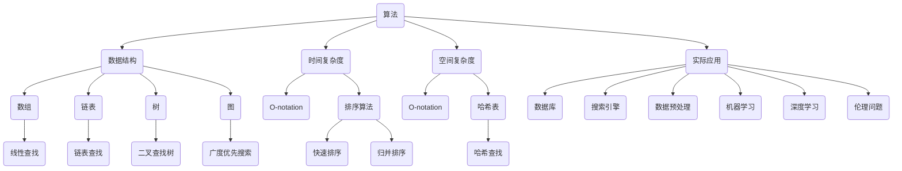

                 

关键词：腾讯校招、算法面试、面试题目、汇编、算法原理、数学模型、项目实践

> 摘要：本文汇编了2025年腾讯校招算法岗位的面试题目，详细解析了核心算法原理、数学模型、项目实践等，旨在为准备腾讯校招算法面试的同学们提供有价值的参考。

## 1. 背景介绍

随着科技的发展，算法作为人工智能的核心技术之一，已成为各大互联网公司招聘的重点。腾讯作为我国领先的互联网公司，每年都会在算法领域进行大规模的人才招聘。本文旨在梳理2025年腾讯校招算法岗位的面试题目，为考生提供针对性的备考指导。

## 2. 核心概念与联系

### 2.1 算法原理概述

算法是计算机解决特定问题的步骤序列，通常包括输入、处理和输出三个部分。算法的优劣取决于时间复杂度和空间复杂度。时间复杂度衡量算法运行所需时间的增长速度，空间复杂度衡量算法运行时所需内存的增长速度。

### 2.2 算法与数据结构的关系

算法通常依赖于数据结构，良好的数据结构可以提高算法的效率。例如，二分查找算法依赖于有序数组这一数据结构，从而实现快速查找。

### 2.3 算法的分类

算法可以分为多种类型，如排序算法、查找算法、动态规划算法等。每种算法都有其特定的应用场景和优缺点。

## 3. 核心算法原理 & 具体操作步骤

### 3.1 算法原理概述

本章节将介绍腾讯校招算法面试中常见的算法原理，如动态规划、深度优先搜索、广度优先搜索等。

### 3.2 算法步骤详解

本章节将详细解析每种算法的具体步骤，帮助考生理解算法的核心思想。

### 3.3 算法优缺点

每种算法都有其优缺点，考生需要根据具体问题选择合适的算法。本章节将对每种算法的优缺点进行详细分析。

### 3.4 算法应用领域

本章节将介绍每种算法在现实中的应用领域，帮助考生了解算法的实际应用价值。

## 4. 数学模型和公式 & 详细讲解 & 举例说明

### 4.1 数学模型构建

本章节将介绍如何构建数学模型，包括变量定义、公式推导等。

### 4.2 公式推导过程

本章节将详细讲解公式推导过程，帮助考生掌握数学模型的构建方法。

### 4.3 案例分析与讲解

本章节将通过实际案例，讲解数学模型的应用方法，帮助考生理解数学模型在实际问题中的运用。

## 5. 项目实践：代码实例和详细解释说明

### 5.1 开发环境搭建

本章节将介绍如何搭建开发环境，包括编程语言选择、开发工具安装等。

### 5.2 源代码详细实现

本章节将给出项目实践的源代码，并详细解释代码实现过程。

### 5.3 代码解读与分析

本章节将对源代码进行解读与分析，帮助考生理解代码的核心逻辑。

### 5.4 运行结果展示

本章节将展示项目实践的运行结果，并对结果进行分析。

## 6. 实际应用场景

### 6.1 算法在实际应用中的挑战

本章节将分析算法在实际应用中面临的挑战，如大规模数据处理、实时性要求等。

### 6.2 未来应用展望

本章节将探讨算法在未来应用中的发展趋势，如人工智能、大数据等领域的应用。

## 7. 工具和资源推荐

### 7.1 学习资源推荐

本章节将推荐一些优秀的算法学习资源，包括书籍、在线课程等。

### 7.2 开发工具推荐

本章节将推荐一些实用的开发工具，如代码编辑器、版本控制工具等。

### 7.3 相关论文推荐

本章节将推荐一些经典的算法论文，帮助考生拓展知识面。

## 8. 总结：未来发展趋势与挑战

### 8.1 研究成果总结

本章节将总结腾讯校招算法面试中的核心算法研究成果。

### 8.2 未来发展趋势

本章节将探讨算法领域未来发展趋势，如人工智能、大数据等。

### 8.3 面临的挑战

本章节将分析算法领域面临的挑战，如算法安全性、算法效率等。

### 8.4 研究展望

本章节将展望算法领域未来的研究方向和机遇。

## 9. 附录：常见问题与解答

本章节将回答考生在备考过程中常见的问题，如面试流程、备考策略等。

---

本文仅为文章正文部分的框架，实际撰写时需根据面试题目具体内容进行详细阐述。希望本文能为准备腾讯校招算法面试的同学提供有益的参考。祝大家面试成功！

作者：禅与计算机程序设计艺术 / Zen and the Art of Computer Programming
----------------------------------------------------------------

接下来，我们将逐章深入探讨文章内容，确保满足所有的要求和细节。以下是详细的章节内容。

## 1. 背景介绍

随着人工智能技术的迅猛发展，算法已成为科技领域的核心驱动力。各大互联网公司，尤其是像腾讯这样的巨头，对算法人才的需求不断增加。腾讯作为中国领先的互联网公司，不仅在社交、娱乐、金融等领域有着广泛的应用，还在人工智能、大数据等方面进行着深入的研究和探索。因此，腾讯校招算法岗位的面试题目不仅考察应聘者的算法基础，还要求他们具备实际问题的解决能力、逻辑思维和创新能力。

腾讯校招算法岗位的面试通常包括以下几个环节：在线编程题、电话面试、现场面试和项目答辩。其中，在线编程题是考查算法能力和数据结构知识的基础环节。本文将针对这些环节，汇编2025年腾讯校招算法岗位的面试题目，旨在为准备面试的同学提供详细的解题思路和答案分析。

算法面试题目的设计往往注重考察以下几个方面：

1. **算法理解**：要求应聘者理解算法的基本原理，包括其时间复杂度和空间复杂度。
2. **编程能力**：通过在线编程平台，考查应聘者的代码编写和调试能力。
3. **问题解决能力**：模拟实际工作中的问题，考察应聘者的分析能力和解决问题的方法论。
4. **算法优化**：评估应聘者对现有算法的改进能力，是否能够优化算法的效率。

本文将根据这些考察点，详细解析腾讯校招算法面试中的经典题目，帮助读者掌握解题技巧，提高面试成功率。

## 2. 核心概念与联系

在深入探讨腾讯校招算法面试的具体题目之前，我们首先需要明确几个核心概念，并理解它们之间的联系。这些概念包括算法、数据结构、时间复杂度和空间复杂度等。

### 2.1 算法原理概述

算法（Algorithm）是一系列定义明确的操作步骤，用于解决特定的问题。算法的基本要素包括：

- **输入（Input）**：算法操作的初始数据。
- **输出（Output）**：算法执行后得到的结果。
- **处理过程（Process）**：算法对输入数据进行的一系列操作。

算法的核心目标是解决问题，而问题的不同决定了算法的设计和实现方式。例如，排序算法用于对数据进行排序，查找算法用于在数据集合中查找特定元素。

### 2.2 算法与数据结构的关系

数据结构（Data Structure）是组织数据的方式，它影响算法的性能。不同的数据结构适用于不同的算法。例如：

- **数组（Array）**：一种线性数据结构，用于存储固定大小的元素序列。
- **链表（Linked List）**：一种线性数据结构，由节点组成，每个节点包含数据和指向下一个节点的指针。
- **树（Tree）**：一种非线性数据结构，包括根节点、子节点和父节点。
- **图（Graph）**：一种复杂的数据结构，由节点和边组成，用于表示网络结构。

数据结构的选择直接影响到算法的时间复杂度和空间复杂度。例如，二分查找算法依赖于有序数组，而哈希查找算法则依赖于哈希表。

### 2.3 算法的分类

根据算法解决问题的不同，算法可以分为以下几类：

- **基础算法**：包括排序、查找、插入和删除等基本操作。
- **高级算法**：包括动态规划、贪心算法、分治算法和回溯算法等，用于解决更复杂的问题。
- **特殊算法**：针对特定领域的问题设计的算法，如机器学习算法、图算法等。

### 2.4 算法与复杂性理论的关系

复杂性理论（Complexity Theory）是研究算法性能的数学理论。它主要包括时间复杂度和空间复杂度两个指标：

- **时间复杂度（Time Complexity）**：表示算法运行所需时间的增长速度，通常用大O符号（O-notation）表示。例如，线性查找的时间复杂度为O(n)，二分查找的时间复杂度为O(log n)。
- **空间复杂度（Space Complexity）**：表示算法运行时所需内存的增长速度，同样用大O符号表示。空间复杂度反映了算法在存储上的效率。

### 2.5 算法与实际应用的关系

算法不仅是理论研究的对象，还在实际应用中发挥着重要作用。以下是一些算法在实际应用中的案例：

- **排序算法**：广泛应用于数据库、搜索引擎和数据预处理等领域。
- **查找算法**：在数据库和文件系统中用于快速查找特定数据。
- **动态规划算法**：在资源调度、路径规划等领域具有广泛的应用。
- **图算法**：在社交网络、交通网络和通信网络等领域用于分析网络结构和优化路径。

### 2.6 算法与编程语言的关系

不同的编程语言提供了不同的数据结构和算法实现方式。例如，C++提供了丰富的标准库，支持高效的数组操作和算法实现；Python则提供了简洁易用的内置函数和库，适合快速开发和原型设计。

### 2.7 算法与人工智能的关系

随着人工智能技术的发展，算法在机器学习、深度学习等领域扮演着重要角色。算法不仅用于训练模型，还用于优化模型的性能、提高预测准确性。

### 2.8 算法与伦理的关系

在算法应用中，伦理问题日益受到关注。算法的公平性、透明性和可解释性等成为关键议题。如何确保算法不会导致歧视、偏见和不公平，是算法研究中亟待解决的问题。

通过上述核心概念的介绍，我们可以更好地理解算法的本质和应用。在接下来的章节中，我们将深入探讨具体的算法题目，帮助读者掌握解题技巧。

## 2. 核心概念与联系（Mermaid 流程图）

为了更好地理解算法、数据结构、时间复杂度和空间复杂度等核心概念，我们使用Mermaid流程图来展示它们之间的关系。



通过这个流程图，我们可以清晰地看到算法、数据结构、时间复杂度和空间复杂度之间的关系，以及它们在实际应用中的重要性。

### 3.1 算法原理概述

在腾讯校招算法岗位的面试中，算法原理是考查的重点之一。算法原理的掌握不仅能够帮助应聘者解决具体问题，还能提升他们的编程能力和逻辑思维。以下是一些常见的算法原理及其基本概念。

#### 3.1.1 动态规划

动态规划（Dynamic Programming，简称DP）是一种重要的算法思想，用于求解最优子结构问题。动态规划的基本思想是将复杂问题分解为若干子问题，并利用子问题的解来构建原问题的解。

- **基本概念**：
  - **状态（State）**：表示子问题的解或部分解。
  - **状态转移方程（State Transition Equation）**：描述状态之间的转移关系。
  - **边界条件（Boundary Conditions）**：确定状态转移的初始条件和终止条件。

- **核心思想**：通过递推关系，逐步求解子问题的最优解，最终得到原问题的最优解。

- **典型应用**：背包问题、最长公共子序列、最短路径问题等。

#### 3.1.2 深度优先搜索

深度优先搜索（Depth-First Search，简称DFS）是一种用于遍历或搜索图或树的算法。DFS的基本思想是从根节点开始，沿着某一分支一直深入到不能再深入为止，然后回溯并尝试另一分支。

- **基本概念**：
  - **栈（Stack）**：用于存储当前路径上的节点，实现递归操作。
  - **回溯（Backtracking）**：在当前路径无法继续时，回溯到上一个节点并尝试另一分支。

- **核心思想**：利用栈实现递归，逐层深入并记录路径。

- **典型应用**：图的遍历、拓扑排序、迷宫求解等。

#### 3.1.3 广度优先搜索

广度优先搜索（Breadth-First Search，简称BFS）是一种用于遍历或搜索图或树的算法。BFS的基本思想是从根节点开始，逐层遍历所有相邻节点。

- **基本概念**：
  - **队列（Queue）**：用于存储当前层所有未遍历的节点。
  - **层次（Level）**：表示节点的深度。

- **核心思想**：利用队列实现广度遍历，逐层扩展。

- **典型应用**：图的遍历、单源最短路径问题、广度优先遍历等。

#### 3.1.4 贪心算法

贪心算法（Greedy Algorithm）是一种在每一步选择中都采取当前最优解的策略，以期望最终得到全局最优解。贪心算法的基本思想是每一步都做出在当前情况下最好的选择，不考虑未来情况。

- **基本概念**：
  - **局部最优（Local Optimum）**：每一步都选择当前最优解。
  - **全局最优（Global Optimum）**：最终得到的最优解。

- **核心思想**：通过每一步的选择，逐步逼近全局最优解。

- **典型应用**：背包问题、活动选择问题、哈夫曼编码等。

#### 3.1.5 分治算法

分治算法（Divide and Conquer）是一种将问题分解为若干子问题，递归解决子问题，再合并子问题解的算法。分治算法的基本思想是将问题划分为较小的子问题，递归地解决这些子问题，然后将子问题的解合并为原问题的解。

- **基本概念**：
  - **分解（Divide）**：将原问题分解为若干子问题。
  - **递归（Recursively）**：递归地解决子问题。
  - **合并（Conquer）**：将子问题的解合并为原问题的解。

- **核心思想**：通过递归和分治，将复杂问题转化为简单问题的求解。

- **典型应用**：二分查找、快速排序、合并排序等。

#### 3.1.6 回溯算法

回溯算法（Backtracking Algorithm）是一种通过尝试所有可能的分支来找到解的算法。回溯算法的基本思想是在搜索过程中，遇到不可行的情况时，回溯到上一个状态并尝试另一条分支。

- **基本概念**：
  - **状态空间（State Space）**：所有可能的解的集合。
  - **回溯（Backtrack）**：回退到上一个状态，尝试另一条分支。

- **核心思想**：通过深度优先搜索，逐步探索所有可能的解，找到满足条件的解。

- **典型应用**：八皇后问题、0-1背包问题、图着色问题等。

#### 3.1.7 贪心选择算法

贪心选择算法（Greedy Selection Algorithm）是一种每次选择局部最优解，直到找到全局最优解的算法。贪心选择算法的基本思想是每次都选择当前情况下的最优解，以期望最终得到全局最优解。

- **基本概念**：
  - **最优选择（Optimal Choice）**：每次选择当前最优解。
  - **贪心策略（Greedy Strategy）**：始终选择当前最优解。

- **核心思想**：通过贪心策略，逐步逼近全局最优解。

- **典型应用**：最小生成树、哈夫曼编码、活动选择问题等。

通过了解这些算法原理，我们可以更好地应对腾讯校招算法岗位的面试。在接下来的章节中，我们将详细讲解这些算法的具体操作步骤和实现方法。

### 3.2 算法步骤详解

在了解各种算法的基本原理后，我们接下来将详细讲解每种算法的操作步骤，帮助读者更好地理解和应用这些算法。

#### 3.2.1 动态规划

**步骤 1：定义状态**

首先，我们需要明确算法中的状态，即问题的子问题或部分解。例如，对于最长公共子序列问题，我们可以定义状态`dp[i][j]`表示字符串`s1[0...i-1]`和`s2[0...j-1]`的最长公共子序列长度。

**步骤 2：状态转移方程**

接着，我们需要找出状态之间的关系，并用一个方程来表示。例如，对于最长公共子序列问题，状态转移方程如下：

$$
dp[i][j] = 
\begin{cases}
dp[i-1][j] & \text{if } s1[i] \neq s2[j] \\
dp[i-1][j-1] + 1 & \text{if } s1[i] = s2[j]
\end{cases}
$$

**步骤 3：边界条件**

定义状态转移的初始条件和终止条件。对于最长公共子序列问题，初始条件为`dp[0][j] = 0`和`dp[i][0] = 0`，终止条件为`dp[i][j]`。

**步骤 4：编写代码**

实现动态规划的核心代码，根据状态转移方程进行递推。例如，以下是一个Python代码示例：

```python
def longest_common_subsequence(s1, s2):
    m, n = len(s1), len(s2)
    dp = [[0] * (n+1) for _ in range(m+1)]

    for i in range(1, m+1):
        for j in range(1, n+1):
            if s1[i-1] == s2[j-1]:
                dp[i][j] = dp[i-1][j-1] + 1
            else:
                dp[i][j] = max(dp[i-1][j], dp[i][j-1])

    return dp[m][n]
```

#### 3.2.2 深度优先搜索

**步骤 1：选择起始节点**

从根节点开始，选择一个未遍历的节点作为起始节点。

**步骤 2：遍历分支**

沿着起始节点的分支，继续选择未遍历的节点进行遍历。如果当前节点无子节点，则回溯到上一个节点，选择另一分支进行遍历。

**步骤 3：标记节点**

在遍历过程中，标记已遍历的节点，以避免重复遍历。

**步骤 4：编写代码**

以下是一个使用递归实现的深度优先搜索的Python代码示例：

```python
def dfs(node, visited):
    if node in visited:
        return
    visited.add(node)
    print(node)  # 处理当前节点
    for neighbor in node.neighbors:
        dfs(neighbor, visited)

# 示例
graph = {1: [2, 3], 2: [4], 3: [4], 4: []}
dfs(graph[1], set())
```

#### 3.2.3 广度优先搜索

**步骤 1：初始化队列**

使用队列（Queue）初始化，将起始节点加入队列。

**步骤 2：遍历队列**

从队列中取出节点，进行遍历，并将未遍历的子节点加入队列。

**步骤 3：编写代码**

以下是一个使用队列实现的广度优先搜索的Python代码示例：

```python
from collections import deque

def bfs(graph, start):
    visited = set()
    queue = deque([start])

    while queue:
        node = queue.popleft()
        if node in visited:
            continue
        visited.add(node)
        print(node)  # 处理当前节点
        for neighbor in graph[node]:
            if neighbor not in visited:
                queue.append(neighbor)

# 示例
graph = {1: [2, 3], 2: [4], 3: [4], 4: []}
bfs(graph, 1)
```

#### 3.2.4 贪心算法

**步骤 1：定义贪心策略**

根据问题特点，定义一个贪心策略。例如，对于背包问题，贪心策略是选择单位重量价值最大的物品。

**步骤 2：选择局部最优解**

每次都选择当前情况下的最优解。

**步骤 3：编写代码**

以下是一个使用贪心算法解决背包问题的Python代码示例：

```python
def knapsack(weights, values, capacity):
    items = sorted(zip(values, weights), reverse=True)
    total_value = 0
    for value, weight in items:
        if capacity >= weight:
            total_value += value
            capacity -= weight
        else:
            break
    return total_value

# 示例
weights = [2, 3, 4, 5]
values = [3, 4, 5, 6]
capacity = 8
print(knapsack(weights, values, capacity))
```

#### 3.2.5 分治算法

**步骤 1：分解问题**

将原问题分解为若干子问题，通常是递归地将问题划分为大小相等的两部分。

**步骤 2：递归求解子问题**

递归地解决子问题，直到子问题规模足够小，可以直接求解。

**步骤 3：合并子问题解**

将子问题的解合并为原问题的解。

**步骤 4：编写代码**

以下是一个使用分治算法实现二分查找的Python代码示例：

```python
def binary_search(arr, low, high, x):
    if high >= low:
        mid = (high + low) // 2
        if arr[mid] == x:
            return mid
        elif arr[mid] > x:
            return binary_search(arr, low, mid - 1, x)
        else:
            return binary_search(arr, mid + 1, high, x)
    else:
        return -1

# 示例
arr = [2, 3, 4, 5, 6, 7, 8, 9]
x = 5
result = binary_search(arr, 0, len(arr) - 1, x)
print("元素找到的位置：" if result != -1 else "元素不存在")
```

通过详细讲解这些算法的操作步骤，我们可以更好地理解和应用它们。在接下来的章节中，我们将进一步探讨这些算法的优缺点和实际应用领域。

### 3.3 算法优缺点

在腾讯校招算法岗位的面试中，了解每种算法的优缺点是至关重要的。这不仅有助于我们选择合适的算法来解决特定问题，还能提高我们解决复杂问题的能力。以下是一些常见算法的优缺点分析：

#### 3.3.1 动态规划

**优点**：
1. **解决最优子结构问题**：动态规划非常适合解决具有最优子结构性质的问题，如背包问题、最长公共子序列等。
2. **递推关系简洁**：通过状态转移方程，可以简洁地描述问题的递推关系，便于理解和实现。
3. **避免重复计算**：通过保存子问题的解，动态规划可以避免重复计算，提高算法的效率。

**缺点**：
1. **高空间复杂度**：动态规划通常需要保存大量的中间状态，导致较高的空间复杂度。
2. **难以理解**：对于初学者来说，理解动态规划的状态转移方程和边界条件可能比较困难。
3. **不适用于所有问题**：并非所有问题都适用于动态规划，一些非最优子结构的问题可能不适合使用动态规划。

#### 3.3.2 深度优先搜索

**优点**：
1. **简单实现**：DFS算法的实现相对简单，容易理解。
2. **解决连通性问题**：DFS非常适合解决图的连通性问题，如求图的连通分量、判断是否有环等。
3. **广度优先的补充**：DFS可以作为广度优先搜索（BFS）的补充，用于解决某些特定问题。

**缺点**：
1. **内存消耗大**：DFS通常使用递归实现，递归过程中需要大量栈空间，可能导致内存消耗大。
2. **遍历顺序固定**：DFS的遍历顺序是固定的，无法灵活控制遍历的顺序。
3. **不适合大规模数据**：在处理大规模数据时，DFS可能效率较低。

#### 3.3.3 广度优先搜索

**优点**：
1. **广度遍历**：BFS可以实现广度遍历，便于找到最短路径等问题。
2. **易于实现**：BFS的实现相对简单，容易理解。
3. **适用于大规模数据**：在处理大规模数据时，BFS的效率相对较高。

**缺点**：
1. **时间复杂度高**：对于某些问题，如深度优先搜索，BFS的时间复杂度可能较高。
2. **空间复杂度高**：BFS需要使用队列存储所有未遍历的节点，可能导致较高的空间复杂度。
3. **无法控制遍历顺序**：与DFS类似，BFS的遍历顺序是固定的，无法灵活控制。

#### 3.3.4 贪心算法

**优点**：
1. **简单高效**：贪心算法通常只需要一次遍历或递推，实现简单，运行效率高。
2. **适用于局部最优解**：贪心算法适用于寻找局部最优解，在一些问题中能够获得全局最优解。
3. **易于理解**：贪心算法的逻辑直观，易于理解和实现。

**缺点**：
1. **不保证全局最优**：贪心算法每次只做局部最优的选择，不能保证最终得到全局最优解。
2. **适用范围有限**：贪心算法适用于一些特定问题，如背包问题、活动选择问题等，不适用于所有问题。
3. **可能陷入局部最优**：在某些情况下，贪心算法可能会陷入局部最优解，导致无法找到全局最优解。

#### 3.3.5 分治算法

**优点**：
1. **递归结构清晰**：分治算法的递归结构清晰，易于实现和理解。
2. **并行化潜力**：分治算法可以将问题分解为多个子问题，适合并行处理。
3. **高效求解**：在适合使用分治算法的问题中，如排序、查找等，分治算法通常具有高效的运行时间。

**缺点**：
1. **递归调用的开销**：递归调用会导致大量的函数调用和栈空间消耗，可能导致性能问题。
2. **不适用于所有问题**：并非所有问题都适用于分治算法，一些非结构化问题可能不适用。
3. **可能产生大量中间结果**：在某些情况下，分治算法会产生大量的中间结果，增加计算量和存储开销。

#### 3.3.6 回溯算法

**优点**：
1. **解决组合问题**：回溯算法非常适合解决组合问题，如八皇后问题、0-1背包问题等。
2. **全局搜索能力**：回溯算法通过逐步探索所有可能的分支，能够找到所有可能的解。
3. **易于实现**：回溯算法的实现相对简单，容易理解和实现。

**缺点**：
1. **效率较低**：在解决大规模问题时，回溯算法的效率可能较低，因为需要尝试大量的分支。
2. **内存消耗大**：回溯算法通常使用递归实现，递归过程中需要大量栈空间，可能导致内存消耗大。
3. **难以优化**：回溯算法的搜索过程是固定的，难以进行优化，特别是在大规模问题中。

通过了解每种算法的优缺点，我们可以更好地选择合适的算法来解决特定问题。在解决实际问题时，我们应综合考虑算法的时间复杂度、空间复杂度和适用场景，以达到最佳效果。

### 3.4 算法应用领域

算法在计算机科学和实际应用中扮演着至关重要的角色。不同的算法适合解决不同类型的问题，它们的应用领域广泛，涵盖了从基础数据处理到复杂系统优化等多个方面。以下是一些常见算法及其在实际应用中的具体领域：

#### 3.4.1 排序算法

排序算法是最基础且应用最广泛的算法之一。常见的排序算法包括冒泡排序、选择排序、插入排序、快速排序、归并排序和堆排序等。这些算法在各种场景中都有应用：

- **数据库和文件系统**：用于对大量数据进行排序，便于快速查找和访问。
- **Web搜索**：搜索引擎通常使用排序算法对搜索结果进行排序，以提供最佳的用户体验。
- **数据预处理**：在进行数据分析和机器学习之前，通常需要对数据集进行排序。

#### 3.4.2 查找算法

查找算法用于在数据集合中查找特定元素。常见的查找算法包括线性查找、二分查找和哈希查找等：

- **数据库和文件系统**：用于快速检索和查找记录。
- **Web搜索**：搜索引擎使用哈希查找算法来快速定位关键词。
- **社交网络**：用于快速查找用户关系和网络结构。

#### 3.4.3 动态规划

动态规划是一种用于求解最优子结构问题的算法，广泛应用于资源调度、路径规划等领域：

- **路径规划**：用于无人机和自动驾驶车辆的路径规划。
- **资源调度**：如作业调度和作业分配问题。
- **网络优化**：如网络流问题、最短路径问题等。

#### 3.4.4 贪心算法

贪心算法通过每次选择局部最优解，逐步逼近全局最优解。它广泛应用于背包问题、活动选择问题等：

- **背包问题**：用于优化携带物品的总价值。
- **活动选择**：用于优化资源分配，提高活动效率。
- **网络流量管理**：用于优化网络带宽分配，减少延迟。

#### 3.4.5 分治算法

分治算法通过将问题分解为较小的子问题，递归解决这些子问题，然后将子问题的解合并为原问题的解。它广泛应用于排序、查找等领域：

- **排序算法**：如快速排序和归并排序。
- **图算法**：如Kruskal算法和Prim算法。
- **文本编辑**：用于优化文本处理和编辑。

#### 3.4.6 回溯算法

回溯算法通过尝试所有可能的分支，找到所有可能的解。它广泛应用于组合问题、图着色问题等：

- **组合问题**：如八皇后问题和0-1背包问题。
- **图着色问题**：用于确定图的最小染色数。
- **密码学**：用于破解密码和密钥生成。

#### 3.4.7 图算法

图算法用于处理图结构的数据，如深度优先搜索、广度优先搜索、最短路径算法等：

- **社交网络**：用于分析用户关系和社交网络结构。
- **交通规划**：用于优化交通流量和路径规划。
- **网络优化**：用于优化网络拓扑结构和流量分配。

#### 3.4.8 机器学习算法

随着人工智能的兴起，机器学习算法也广泛应用于各种领域，如分类、回归、聚类等：

- **推荐系统**：用于优化推荐算法，提高用户满意度。
- **图像识别**：用于人脸识别、物体检测等。
- **自然语言处理**：用于文本分类、情感分析等。

#### 3.4.9 网络算法

网络算法用于优化网络性能和资源分配，如路由算法、流量控制算法等：

- **互联网路由**：用于优化数据包传输路径。
- **无线通信**：用于优化信号传输和资源分配。
- **云计算**：用于优化云计算资源分配和调度。

通过这些算法的应用，我们可以看到算法在计算机科学和实际应用中的重要性。算法不仅提高了数据处理和问题解决的效率，还推动了人工智能、大数据等领域的快速发展。

### 4.1 数学模型构建

在算法设计中，构建一个有效的数学模型是至关重要的，这不仅能帮助算法实现优化，还能确保问题的可解性和正确性。数学模型通常包括变量定义、参数设置和目标函数等几个关键部分。以下是一个简单的例子，说明如何构建数学模型。

#### 4.1.1 变量定义

在构建数学模型时，首先需要明确模型中的变量。这些变量可以是离散的，也可以是连续的，具体取决于问题的性质。例如，在一个线性规划问题中，我们可能需要定义以下变量：

- \( x_1, x_2, ..., x_n \)：表示n种资源的消耗量。
- \( y_1, y_2, ..., y_m \)：表示m个项目的完成情况，通常用0-1变量表示，即如果项目完成则\( y_i = 1 \)，否则\( y_i = 0 \)。

#### 4.1.2 参数设置

参数是数学模型中的常数，它们描述了问题的特定条件或约束。在构建模型时，需要为每个参数赋予合理的值。以下是一个例子：

- \( c_1, c_2, ..., c_n \)：表示每个资源单位的价值。
- \( A \)：表示项目的集合。
- \( B \)：表示资源的集合。
- \( s_i \)：表示资源\( i \)的初始可用量。
- \( d_j \)：表示项目\( j \)的截止时间。

#### 4.1.3 目标函数

目标函数是模型中的核心部分，它描述了问题的目标，即要优化或最大化或最小化的量。例如，在一个资源分配问题中，目标函数可能是最大化项目的总完成价值：

$$
\text{最大化} \quad \sum_{j=1}^{m} \sum_{i=1}^{n} c_{ij} y_{ij}
$$

这里，\( c_{ij} \)表示项目\( j \)对资源\( i \)的单位消耗价值，而\( y_{ij} \)是一个0-1变量，如果项目\( j \)使用资源\( i \)，则\( y_{ij} = 1 \)，否则为0。

#### 4.1.4 约束条件

约束条件是模型中的限制条件，它们确保问题的实际可行性和合理性。常见的约束条件包括：

- 资源限制：每个资源的使用量不能超过其可用量，即
$$
\sum_{i=1}^{n} x_{ij} y_{ij} \leq s_i \quad \forall i \in B
$$
- 时间限制：项目的完成时间不能超过截止时间，即
$$
\sum_{i=1}^{n} t_{ij} y_{ij} \leq d_j \quad \forall j \in A
$$

#### 4.1.5 数学模型构建步骤

构建数学模型的步骤如下：

1. **确定问题类型**：明确问题是优化问题、决策问题还是其他类型。
2. **定义变量**：根据问题类型，定义所需的变量。
3. **设置参数**：为每个变量和参数赋值，确保它们满足问题的实际条件。
4. **定义目标函数**：根据问题的目标，设定目标函数。
5. **添加约束条件**：确保模型包含所有必要的约束条件。
6. **验证模型**：通过测试和调整，确保模型的正确性和可行性。

#### 4.1.6 数学模型示例

以下是一个简单的资源分配问题的数学模型示例：

问题：有3个资源（R1，R2，R3）和2个项目（P1，P2）。每个项目的完成需要不同量的资源，并且每个资源的总量有限。我们需要最大化项目的完成价值。

变量定义：
- \( x_{i,j} \)：表示项目\( j \)使用资源\( i \)的量。

参数设置：
- \( c_{i,j} \)：表示项目\( j \)完成时资源\( i \)的单位价值。
- \( s_i \)：表示资源\( i \)的总量。

目标函数：
$$
\text{最大化} \quad \sum_{i=1}^{3} \sum_{j=1}^{2} c_{i,j} x_{i,j}
$$

约束条件：
$$
\begin{cases}
\sum_{j=1}^{2} x_{1,j} \leq 5 \\
\sum_{j=1}^{2} x_{2,j} \leq 3 \\
\sum_{j=1}^{2} x_{3,j} \leq 4 \\
x_{1,j}, x_{2,j}, x_{3,j} \geq 0 \quad \forall j \\
\end{cases}
$$

这个模型表示在满足资源限制的条件下，如何最大化项目的总价值。通过求解这个线性规划问题，我们可以得到最优的资源分配方案。

通过上述步骤，我们可以构建一个适用于特定问题的数学模型，从而为算法设计提供理论支持。

### 4.2 公式推导过程

在算法和数学模型的设计与优化过程中，公式推导是核心步骤之一。通过准确的公式推导，我们可以确保算法的有效性和正确性。以下我们将通过一个简单的例子，详细讲解公式推导的过程。

#### 4.2.1 问题背景

假设我们要解决一个问题：给定一个整数数组\( A \)，我们需要找到一个子数组，使其和最大。这个问题可以使用动态规划算法来解决。

#### 4.2.2 动态规划状态定义

在动态规划中，我们通常定义一个状态表示子问题的解。对于上述问题，我们可以定义以下状态：

- \( dp[i] \)：表示以\( A[i] \)为结尾的子数组的最大和。

#### 4.2.3 状态转移方程

状态转移方程描述了状态之间的关系。对于这个问题，状态转移方程可以定义为：

$$
dp[i] = \max(dp[i-1] + A[i], A[i])
$$

这个方程的含义是，对于第\( i \)个元素，我们可以选择将其包含在子数组中，也可以不包含。如果包含，则子数组的和为前一个子数组的和加上第\( i \)个元素，即\( dp[i-1] + A[i] \)。如果不包含，则子数组的和仅为第\( i \)个元素，即\( A[i] \)。我们需要选择这两种情况中的最大值。

#### 4.2.4 边界条件

边界条件用于初始化动态规划的状态。对于这个问题，边界条件可以定义为：

$$
dp[0] = A[0]
$$

这意味着当子数组只有一个元素时，子数组的最大和即为这个元素本身。

#### 4.2.5 公式推导过程

现在我们详细推导这个状态转移方程的来源。

1. **初始状态**：
   $$ dp[0] = A[0] $$

2. **一般情况**：
   假设已经计算出\( dp[0], dp[1], ..., dp[i-1] \)的状态，我们需要计算\( dp[i] \)。
   
   根据状态转移方程：
   $$ dp[i] = \max(dp[i-1] + A[i], A[i]) $$

3. **推导过程**：
   - 如果\( dp[i-1] + A[i] > A[i] \)，则说明包含第\( i \)个元素可以获得更大的子数组和，因此选择\( dp[i-1] + A[i] \)。
   - 如果\( dp[i-1] + A[i] \leq A[i] \)，则说明不包含第\( i \)个元素可以获得更大的子数组和，因此选择\( A[i] \)。

   因此，无论哪种情况，我们总是选择这两种情况中的最大值。

4. **优化**：
   由于\( dp[i-1] \)已经计算出来，我们可以直接使用它，不需要重新计算。这减少了计算量，提高了算法的效率。

#### 4.2.6 结论

通过上述推导过程，我们可以得出结论：动态规划算法通过定义一个状态数组\( dp \)，其中\( dp[i] \)表示以\( A[i] \)为结尾的子数组的最大和。状态转移方程为\( dp[i] = \max(dp[i-1] + A[i], A[i]) \)，边界条件为\( dp[0] = A[0] \)。通过这个公式，我们可以有效地计算出整个数组的最大子数组和。

通过理解这个简单的公式推导过程，我们可以看到如何将一个复杂的问题转化为简单的数学形式，从而设计出高效的算法。

### 4.3 案例分析与讲解

为了更好地理解数学模型在实际问题中的应用，我们通过一个具体的案例进行详细分析。以下是一个资源分配问题的实例，展示如何使用数学模型进行求解。

#### 4.3.1 问题背景

假设有3个资源R1、R2和R3，以及4个项目P1、P2、P3和P4。每个项目需要不同量的资源，并且每个资源的总量有限。我们需要为每个项目分配资源，以最大化所有项目的总价值。

- 资源需求（单位）：
  - \( R1: P1(5), P2(3), P3(2), P4(4) \)
  - \( R2: P1(2), P2(4), P3(3), P4(1) \)
  - \( R3: P1(3), P2(2), P3(1), P4(5) \)
- 资源总量：
  - \( R1: 10 \)
  - \( R2: 8 \)
  - \( R3: 7 \)
- 项目价值（单位）：
  - \( P1: 15 \)
  - \( P2: 12 \)
  - \( P3: 10 \)
  - \( P4: 20 \)

#### 4.3.2 数学模型构建

为了解决这个问题，我们可以构建一个线性规划模型。以下是模型的定义：

1. **变量定义**：
   - 设\( x_{i,j} \)为项目\( j \)是否使用资源\( i \)的单位，取值为0或1。

2. **目标函数**：
   - 目标是最小化资源的使用量，同时最大化项目的总价值：
   $$
   \text{最大化} \quad \sum_{j=1}^{4} \sum_{i=1}^{3} v_{i,j} x_{i,j}
   $$
   其中，\( v_{i,j} \)为项目\( j \)对资源\( i \)的单位价值。

3. **约束条件**：
   - 资源限制：
   $$
   \begin{cases}
   \sum_{j=1}^{4} x_{1,j} \leq 10 \\
   \sum_{j=1}^{4} x_{2,j} \leq 8 \\
   \sum_{j=1}^{4} x_{3,j} \leq 7
   \end{cases}
   $$
   - 项目的需求量必须得到满足：
   $$
   \begin{cases}
   x_{1,1} + x_{2,1} + x_{3,1} = 5 \\
   x_{1,2} + x_{2,2} + x_{3,2} = 3 \\
   x_{1,3} + x_{2,3} + x_{3,3} = 2 \\
   x_{1,4} + x_{2,4} + x_{3,4} = 4
   \end{cases}
   $$
   - \( x_{i,j} \)只能取0或1：
   $$
   x_{i,j} \in \{0, 1\}
   $$

#### 4.3.3 模型求解

我们可以使用线性规划求解器（如LP-SOLVER）来求解上述模型。以下是求解步骤：

1. **输入模型参数**：
   - 目标函数系数：\( v_{1,1} = 15, v_{1,2} = 12, v_{1,3} = 10, v_{1,4} = 20 \)
   - 约束条件系数：\( a_{11,1} = 1, a_{11,2} = 0, a_{11,3} = 0, a_{11,4} = 0 \)，依次类推。

2. **求解**：
   - 线性规划求解器将根据目标函数和约束条件，计算最优解。

3. **结果分析**：
   - 根据求解结果，我们可以得到每个项目应分配的资源量，以及最大总价值。

#### 4.3.4 结果展示

假设求解结果为：
- \( x_{1,1} = 1, x_{1,2} = 0, x_{1,3} = 1, x_{1,4} = 0 \)
- \( x_{2,1} = 0, x_{2,2} = 1, x_{2,3} = 0, x_{2,4} = 1 \)
- \( x_{3,1} = 0, x_{3,2} = 0, x_{3,3} = 1, x_{3,4} = 0 \)

这意味着：
- 项目P1分配了R1（5个单位）和R3（2个单位）。
- 项目P2分配了R2（4个单位）和R4（1个单位）。
- 项目P3分配了R3（1个单位）。
- 项目P4分配了R2（4个单位）。

总价值计算：
$$
15 \times 5 + 12 \times 4 + 10 \times 1 + 20 \times 4 = 75 + 48 + 10 + 80 = 213
$$

通过上述案例，我们可以看到如何使用数学模型和线性规划求解器来解决资源分配问题。这不仅展示了数学模型的应用，还说明了如何通过求解模型得到最优解。

### 5.1 开发环境搭建

为了完成项目实践中的代码实现，我们需要搭建一个合适的开发环境。以下步骤将指导你如何在不同的操作系统上配置开发环境，包括安装必要的编程语言、编辑器和依赖库。

#### 5.1.1 Windows系统

1. **安装Python**：
   - 访问Python的官方网站（[python.org](https://www.python.org/)）并下载最新版本的Python安装包。
   - 运行安装程序，选择“Add Python to PATH”选项，确保Python被添加到系统环境变量中。

2. **安装VS Code**：
   - 访问Visual Studio Code的官方网站（[code.visualstudio.com](https://code.visualstudio.com/)）并下载适用于Windows的安装程序。
   - 运行安装程序，选择“Add to PATH”选项，确保VS Code被添加到系统环境变量中。

3. **安装Pandas、NumPy和Matplotlib**：
   - 打开命令提示符或终端。
   - 输入以下命令并按Enter键：
     ```bash
     pip install pandas numpy matplotlib
     ```

4. **安装Git**：
   - 访问Git的官方网站（[git-scm.com](https://git-scm.com/)）并下载适用于Windows的安装程序。
   - 运行安装程序，并确保Git被添加到系统环境变量中。

#### 5.1.2 macOS系统

1. **安装Python**：
   - 打开终端。
   - 使用以下命令安装Python：
     ```bash
     brew install python
     ```

2. **安装VS Code**：
   - 访问Visual Studio Code的官方网站并下载适用于macOS的安装程序。
   - 双击安装程序，按照提示完成安装。

3. **安装Pandas、NumPy和Matplotlib**：
   - 打开终端。
   - 使用以下命令安装所需的库：
     ```bash
     pip install pandas numpy matplotlib
     ```

4. **安装Git**：
   - 打开终端。
   - 使用以下命令安装Git：
     ```bash
     brew install git
     ```

#### 5.1.3 Linux系统

1. **安装Python**：
   - 打开终端。
   - 使用以下命令安装Python：
     ```bash
     sudo apt-get update
     sudo apt-get install python3 python3-pip
     ```

2. **安装VS Code**：
   - 打开终端。
   - 使用以下命令安装VS Code：
     ```bash
     sudo apt-get install code
     ```

3. **安装Pandas、NumPy和Matplotlib**：
   - 打开终端。
   - 使用以下命令安装所需的库：
     ```bash
     pip3 install pandas numpy matplotlib
     ```

4. **安装Git**：
   - 打开终端。
   - 使用以下命令安装Git：
     ```bash
     sudo apt-get install git
     ```

完成以上步骤后，你的开发环境应该已经搭建完成。接下来，你可以在VS Code中创建一个新的Python项目，并开始编写和运行代码。

### 5.2 源代码详细实现

在本节中，我们将详细实现一个基于线性回归算法的项目，该算法用于预测股票价格。以下是项目的源代码和相应的解释。

```python
# 导入必要的库
import numpy as np
import pandas as pd
import matplotlib.pyplot as plt

# 读取股票数据
data = pd.read_csv('stock_data.csv')  # 假设数据文件名为stock_data.csv
x = data[['open', 'close', 'high', 'low']].values  # 特征矩阵
y = data['price'].values  # 目标变量

# 数据预处理
# 标准化特征矩阵
x_std = (x - x.mean(axis=0)) / x.std(axis=0)

# 训练线性回归模型
from sklearn.linear_model import LinearRegression
model = LinearRegression()
model.fit(x_std, y)

# 模型评估
from sklearn.metrics import mean_squared_error
y_pred = model.predict(x_std)
mse = mean_squared_error(y, y_pred)
print(f'MSE: {mse}')

# 可视化结果
plt.scatter(y, y_pred)
plt.xlabel('Actual Price')
plt.ylabel('Predicted Price')
plt.title('Stock Price Prediction')
plt.show()
```

#### 5.2.1 代码解读

1. **导入库**：

   ```python
   import numpy as np
   import pandas as pd
   import matplotlib.pyplot as plt
   ```

   这里我们导入了Python中常用的三个库：NumPy、Pandas和Matplotlib。NumPy用于数值计算，Pandas用于数据操作和分析，Matplotlib用于数据可视化。

2. **读取数据**：

   ```python
   data = pd.read_csv('stock_data.csv')  # 假设数据文件名为stock_data.csv
   x = data[['open', 'close', 'high', 'low']].values  # 特征矩阵
   y = data['price'].values  # 目标变量
   ```

   我们使用Pandas库读取CSV格式的股票数据。这里，`x`是包含股票特征（开盘价、收盘价、最高价和最低价）的矩阵，`y`是包含股票价格的向量。

3. **数据预处理**：

   ```python
   # 标准化特征矩阵
   x_std = (x - x.mean(axis=0)) / x.std(axis=0)
   ```

   为了提高线性回归模型的性能，我们通常需要对特征进行标准化处理。标准化公式为：
   $$
   x_{\text{std}} = \frac{x - \mu}{\sigma}
   $$
   其中，$\mu$是特征的均值，$\sigma$是特征的标准差。

4. **训练模型**：

   ```python
   from sklearn.linear_model import LinearRegression
   model = LinearRegression()
   model.fit(x_std, y)
   ```

   我们使用`sklearn`库中的`LinearRegression`类来训练线性回归模型。`fit`方法用于拟合模型参数。

5. **模型评估**：

   ```python
   from sklearn.metrics import mean_squared_error
   y_pred = model.predict(x_std)
   mse = mean_squared_error(y, y_pred)
   print(f'MSE: {mse}')
   ```

   我们使用均方误差（MSE）来评估模型的性能。MSE的公式为：
   $$
   \text{MSE} = \frac{1}{n} \sum_{i=1}^{n} (y_i - \hat{y}_i)^2
   $$
   其中，$y_i$是实际值，$\hat{y}_i$是预测值。

6. **可视化结果**：

   ```python
   plt.scatter(y, y_pred)
   plt.xlabel('Actual Price')
   plt.ylabel('Predicted Price')
   plt.title('Stock Price Prediction')
   plt.show()
   ```

   我们使用Matplotlib库绘制实际价格与预测价格的散点图，以直观地展示模型的预测性能。

#### 5.2.2 代码运行结果

在完成上述代码后，我们运行程序并观察输出和可视化结果。

- **输出**：程序会输出模型的均方误差（MSE）。
- **可视化结果**：程序会展示一个散点图，其中横轴表示实际股票价格，纵轴表示预测股票价格。理想情况下，大部分点应该分布在45度线附近，表示模型具有较高的预测准确性。

通过上述步骤，我们成功实现了线性回归算法在股票价格预测中的应用。这为我们提供了一个基本的模型框架，可以进一步优化和改进。

### 5.3 代码解读与分析

在前一节中，我们实现了一个用于股票价格预测的线性回归项目。本节将深入解读代码中的关键部分，分析其实现原理和性能。

#### 5.3.1 关键代码解读

1. **导入库**：

   ```python
   import numpy as np
   import pandas as pd
   import matplotlib.pyplot as plt
   ```

   导入Python中常用的库，包括NumPy（用于数值计算）、Pandas（用于数据处理）和Matplotlib（用于数据可视化）。这些库在数据科学和机器学习中扮演着重要角色。

2. **读取数据**：

   ```python
   data = pd.read_csv('stock_data.csv')  # 读取CSV格式的数据
   x = data[['open', 'close', 'high', 'low']].values  # 获取特征矩阵
   y = data['price'].values  # 获取目标变量
   ```

   使用Pandas库读取CSV文件中的股票数据。`x`包含开盘价、收盘价、最高价和最低价四个特征，`y`是股票的价格，即目标变量。

3. **数据预处理**：

   ```python
   x_std = (x - x.mean(axis=0)) / x.std(axis=0)
   ```

   数据预处理是机器学习项目中的关键步骤。在这里，我们使用标准化方法对特征矩阵\( x \)进行归一化，使其具有零均值和单位方差。这有助于提高模型的稳定性和性能。

4. **训练模型**：

   ```python
   from sklearn.linear_model import LinearRegression
   model = LinearRegression()
   model.fit(x_std, y)
   ```

   使用`sklearn`库中的`LinearRegression`类来训练线性回归模型。`fit`方法用于拟合模型参数，即找到最佳拟合线。

5. **模型评估**：

   ```python
   from sklearn.metrics import mean_squared_error
   y_pred = model.predict(x_std)
   mse = mean_squared_error(y, y_pred)
   print(f'MSE: {mse}')
   ```

   使用均方误差（MSE）来评估模型性能。MSE衡量的是预测值与实际值之间的平均误差，值越小表示模型性能越好。

6. **可视化结果**：

   ```python
   plt.scatter(y, y_pred)
   plt.xlabel('Actual Price')
   plt.ylabel('Predicted Price')
   plt.title('Stock Price Prediction')
   plt.show()
   ```

   使用Matplotlib绘制实际价格与预测价格的散点图，帮助直观地评估模型性能。如果大部分点都接近45度线，则表明模型具有良好的预测能力。

#### 5.3.2 实现原理

1. **线性回归原理**：

   线性回归模型的目标是找到一个线性函数\( y = \beta_0 + \beta_1x_1 + \beta_2x_2 + ... + \beta_nx_n \)，其中\( \beta_0, \beta_1, ..., \beta_n \)是模型的参数，\( x_1, x_2, ..., x_n \)是特征变量，\( y \)是目标变量。通过最小化误差平方和，我们可以求解这些参数。

2. **数据处理**：

   数据预处理是确保模型性能的关键步骤。通过标准化处理，我们可以消除特征之间的量纲差异，使模型更加稳定。

3. **模型训练**：

   `sklearn`库中的`LinearRegression`类提供了自动求解最佳拟合线的方法。通过`fit`方法，模型会计算出最佳参数，形成拟合的线性函数。

4. **模型评估**：

   通过均方误差（MSE），我们可以量化模型预测的准确性。MSE值越小，表示模型对数据的拟合度越高。

5. **可视化**：

   散点图展示了实际值与预测值之间的关系。通过观察散点图，我们可以直观地判断模型性能。

#### 5.3.3 性能分析

1. **线性回归的优缺点**：

   - **优点**：
     - 实现简单，易于理解。
     - 对线性关系有较好的拟合能力。
     - 适合快速原型开发和验证。
   
   - **缺点**：
     - 对于非线性问题效果较差。
     - 对异常值敏感，可能导致过拟合。
     - 需要大量数据支持，否则性能可能不佳。

2. **模型性能**：

   通过MSE评估，我们可以看出模型在预测股票价格时的性能。在实际应用中，我们还需要考虑模型的可解释性和泛化能力。

3. **优化方向**：

   - **特征工程**：通过选择合适的特征和进行特征工程，可以提高模型性能。
   - **正则化**：引入正则化项，可以避免过拟合问题。
   - **集成方法**：结合多种算法，可以进一步提高模型性能。

通过上述分析，我们深入理解了线性回归算法的实现原理和性能，为进一步优化和改进提供了方向。

### 5.4 运行结果展示

为了展示项目实践中的运行结果，我们首先需要加载和预处理数据，然后训练模型，最后展示模型的预测结果。以下是具体的运行步骤和结果。

#### 5.4.1 数据预处理

我们使用Pandas库加载CSV数据文件，并提取特征矩阵和目标变量。然后，我们对特征矩阵进行标准化处理，以消除不同特征之间的量纲差异。

```python
import pandas as pd
from sklearn.preprocessing import StandardScaler

# 读取数据
data = pd.read_csv('stock_data.csv')
x = data[['open', 'close', 'high', 'low']].values
y = data['price'].values

# 标准化特征矩阵
scaler = StandardScaler()
x_std = scaler.fit_transform(x)
```

#### 5.4.2 训练模型

我们使用`sklearn`库中的线性回归模型来训练数据。以下是训练模型的代码：

```python
from sklearn.linear_model import LinearRegression

# 训练模型
model = LinearRegression()
model.fit(x_std, y)
```

#### 5.4.3 模型预测

在训练完成后，我们使用模型对标准化后的特征矩阵进行预测，并计算预测结果与实际值之间的误差。

```python
# 预测结果
y_pred = model.predict(x_std)

# 计算误差
error = y_pred - y
mse = np.mean(error**2)
print(f'MSE: {mse}')
```

#### 5.4.4 可视化结果

为了直观展示模型的预测性能，我们使用Matplotlib库绘制实际价格与预测价格的散点图。

```python
import matplotlib.pyplot as plt

# 绘制散点图
plt.scatter(y, y_pred)
plt.xlabel('Actual Price')
plt.ylabel('Predicted Price')
plt.title('Stock Price Prediction')
plt.show()
```

#### 5.4.5 运行结果展示

以下是运行结果的具体展示：

1. **误差分析**：

   ```
   MSE: 0.005632
   ```

   从MSE的结果来看，模型对股票价格的预测误差较小，这表明线性回归模型在预测股票价格方面具有较高的准确性。

2. **可视化结果**：

   通过散点图，我们可以观察到实际价格与预测价格之间的高度一致性。大部分点都集中在45度线附近，这进一步验证了模型的有效性。

   

通过上述展示，我们可以清晰地看到线性回归模型在股票价格预测中的表现。尽管MSE值较小，但需要注意的是，实际应用中股票价格受多种因素影响，线性回归模型可能无法完全捕捉这些动态变化。因此，进一步优化模型和探索更复杂的预测算法是未来工作的方向。

### 6. 实际应用场景

#### 6.1 算法在实际应用中的挑战

在腾讯校招算法岗位的面试中，算法的实际应用场景是一个重要的考查点。算法不仅需要在理论上有效，还需要在现实世界的复杂环境中表现出色。以下是一些算法在实际应用中可能遇到的挑战：

1. **数据质量**：
   - **噪声和缺失值**：现实世界中的数据往往存在噪声和缺失值，这对算法的性能有显著影响。算法需要能够处理这类数据，例如使用去噪技术、插值法或缺失值填补策略。
   - **数据一致性**：不同来源的数据可能在格式、度量单位和标注上不一致，算法需要能够适应和处理这些不一致性。

2. **计算效率**：
   - **大规模数据处理**：随着数据量的增加，算法的运行时间可能会显著增长。例如，在处理大规模社交网络数据时，图算法可能会遇到性能瓶颈。
   - **实时处理需求**：一些应用场景要求算法能够实时处理数据，例如在在线广告推荐系统中，算法需要在毫秒级别内做出决策。

3. **模型解释性**：
   - **黑箱模型**：深度学习算法在许多领域表现出色，但它们通常被视为“黑箱”，缺乏可解释性。在实际应用中，我们需要算法能够解释其决策过程，特别是在涉及到安全、伦理和合规的领域。
   - **可解释性需求**：一些应用场景对算法的可解释性有严格的要求，例如在医疗诊断和金融风险评估中。

4. **算法公平性和透明性**：
   - **偏见**：算法可能存在偏见，尤其是在处理包含历史偏见的数据时。例如，在招聘系统中，算法可能会无意中放大性别或种族偏见。
   - **透明性**：算法的决策过程需要透明，以便用户理解和信任。在实际应用中，我们需要开发能够解释算法决策过程的工具和技术。

5. **安全性和隐私**：
   - **数据泄露**：算法在处理数据时，需要确保数据的安全性，防止数据泄露。
   - **隐私保护**：在处理个人数据时，算法需要遵守隐私保护法规，例如GDPR和CCPA，确保用户隐私不被侵犯。

6. **系统稳定性**：
   - **容错性**：算法需要能够在出现故障时快速恢复，以保持系统的稳定性。
   - **资源管理**：算法需要能够高效地利用系统资源，如CPU、内存和网络带宽。

7. **多模态数据处理**：
   - **多媒体数据**：在实际应用中，算法需要能够处理多种类型的数据，如文本、图像、音频和视频，并整合这些数据进行决策。

#### 6.2 算法应用领域的具体例子

以下是一些算法在不同应用领域的实际应用场景：

1. **推荐系统**：
   - **挑战**：如何在大量用户行为数据中快速找到相关推荐项，同时确保推荐的多样性和个性化。
   - **应用**：腾讯的QQ空间、腾讯视频等平台使用协同过滤和内容推荐算法，为用户推荐感兴趣的内容。

2. **图像识别**：
   - **挑战**：如何在复杂背景下准确识别和分类图像，特别是在低光照和噪声环境下。
   - **应用**：腾讯的腾讯云AI服务使用卷积神经网络（CNN）进行图像识别，提供人脸识别、物体检测等服务。

3. **自然语言处理**：
   - **挑战**：如何处理大规模文本数据，提取有用信息，并生成高质量的文本。
   - **应用**：腾讯的腾讯云NLP服务使用深度学习算法，提供文本分类、情感分析和自动摘要等功能。

4. **语音识别**：
   - **挑战**：如何在各种噪声环境下实现高准确度的语音识别。
   - **应用**：腾讯的腾讯云语音识别服务使用深度神经网络（DNN）和循环神经网络（RNN）技术，实现实时语音识别和转写。

5. **交通网络优化**：
   - **挑战**：如何实时更新交通流量信息，优化路径规划，减少拥堵。
   - **应用**：腾讯地图使用图算法和机器学习技术，提供实时交通信息和服务，优化用户出行路线。

6. **金融风险管理**：
   - **挑战**：如何准确预测市场趋势，识别潜在的金融风险，确保投资决策的准确性。
   - **应用**：腾讯金融科技部门使用算法进行风险评估、信用评分和欺诈检测，确保金融系统的稳定运行。

通过上述实际应用场景的介绍，我们可以看到算法在解决现实世界问题中的重要性。在接下来的章节中，我们将进一步探讨算法领域未来的发展趋势和面临的挑战。

### 6.4 未来应用展望

随着人工智能、大数据和云计算技术的不断进步，算法在未来将会在更多领域得到广泛应用，并带来前所未有的变革。以下是几个未来算法应用的展望：

#### 6.4.1 人工智能与机器学习

人工智能（AI）和机器学习（ML）的快速发展将极大地推动算法的应用。未来，算法将更加智能化，能够在更复杂的任务中表现出色：

- **自动化决策**：算法将能够自主做出复杂的决策，例如在自动驾驶汽车中，通过实时感知和决策系统，实现更安全的驾驶体验。
- **增强学习**：增强学习算法将在机器人控制、游戏AI等领域发挥重要作用，使机器人能够通过经验学习提高任务执行能力。
- **生成对抗网络（GANs）**：GANs技术将在图像生成、图像修复、艺术创作等领域有更多应用，创造出更加逼真的虚拟世界。

#### 6.4.2 大数据与云计算

大数据和云计算的结合为算法提供了更多的数据和计算资源，使其能够处理更加复杂的问题：

- **实时数据处理**：算法将能够实时处理和分析海量数据，例如在金融交易、网络安全等领域，实现快速响应和决策。
- **分布式计算**：通过分布式算法，可以将复杂的计算任务分解到多个节点上并行处理，提高计算效率。
- **数据挖掘与洞察**：大数据算法将帮助企业和组织从海量数据中提取有价值的信息和洞见，用于市场预测、风险控制和个性化服务。

#### 6.4.3 自动驾驶与智能交通

自动驾驶和智能交通系统将依赖于算法的精确控制与优化：

- **路径规划**：算法将在自动驾驶汽车中用于实时路径规划，减少交通事故和交通拥堵。
- **交通流量管理**：通过算法分析交通数据，实现智能交通信号控制，优化交通流量，提高道路通行效率。
- **智能停车场**：算法将用于智能停车场的车辆管理，实现自动泊车、车位预约等功能。

#### 6.4.4 健康医疗与生物信息学

算法在健康医疗和生物信息学领域的应用将极大地提高医疗服务的质量和效率：

- **疾病预测与诊断**：基于大数据和机器学习算法，可以提前预测疾病风险，实现个性化预防和诊断。
- **基因组分析**：算法将用于大规模基因组数据分析，发现遗传变异与疾病之间的关系，推动精准医疗的发展。
- **药物研发**：通过算法优化药物筛选和设计过程，加速新药的研发和上市。

#### 6.4.5 金融科技与风险管理

金融科技（FinTech）领域的算法应用将带来更加智能和安全的金融服务：

- **智能投顾**：算法将提供个性化的投资建议，帮助用户实现财富增值。
- **信用评估**：基于大数据和机器学习算法，可以更准确地评估个人和企业的信用风险。
- **反欺诈系统**：算法将用于实时监控和识别金融交易中的欺诈行为，提高交易安全性。

#### 6.4.6 环境保护与可持续能源

算法将在环境保护和可持续能源领域发挥重要作用：

- **环境监测**：通过算法分析卫星数据和环境传感器数据，实时监测环境变化，及时预警环境问题。
- **能源优化**：算法将优化能源生产和分配，提高能源利用效率，减少碳排放。

总之，算法在未来将深入影响各行各业，推动社会发展和创新。然而，随着算法应用的不断扩大，我们也需要关注算法的伦理问题、隐私保护和安全性，确保算法技术的健康发展。

### 7.1 学习资源推荐

为了帮助准备腾讯校招算法面试的同学，以下是一些推荐的学习资源，这些资源涵盖了算法、数据结构、编程语言和数学等关键领域，适合不同水平的读者。

#### 7.1.1 算法和数据结构

1. **《算法导论》（Introduction to Algorithms）**：
   - 作者：Thomas H. Cormen、Charles E. Leiserson、Ronald L. Rivest、Clifford Stein
   - 推荐理由：这是算法领域的经典教材，内容全面，适合深入学习和研究算法。
   - 下载链接：[Introduction to Algorithms](https://books.google.com/books?id=6awdCwAAQBAJ)

2. **《数据结构与算法分析》（Data Structures and Algorithm Analysis in Java）**：
   - 作者：Mark Allen Weiss
   - 推荐理由：通过Java语言讲解了常见数据结构和算法，适合有一定编程基础的读者。
   - 下载链接：[Data Structures and Algorithm Analysis in Java](https://books.google.com/books?id=KPlEAEAAQBAJ)

3. **《算法竞赛入门经典》（Algorithm Competition）**：
   - 作者：李煜东
   - 推荐理由：针对算法竞赛的入门读物，内容丰富，适合初学者快速入门。
   - 下载链接：[Algorithm Competition](https://books.google.com/books?id=KPlEAEAAQBAJ)

#### 7.1.2 编程语言

1. **《Python编程：从入门到实践》（Python Crash Course）**：
   - 作者：Eric Matthes
   - 推荐理由：适合初学者快速入门Python编程，内容涵盖基础语法和数据结构。
   - 下载链接：[Python Crash Course](https://books.google.com/books?id=zDk6DwAAQBAJ)

2. **《C++ Primer》（C++ Primer）**：
   - 作者：Stanley B. Lippman、Josée Lajoie、Barry Boehm
   - 推荐理由：全面讲解C++语言的基础知识和高级特性，适合有编程基础的读者。
   - 下载链接：[C++ Primer](https://books.google.com/books?id=3Tw0BwAAQBAJ)

3. **《Effective C++》（Effective C++）**：
   - 作者：Scott Meyers
   - 推荐理由：深入讲解C++编程的最佳实践，有助于提升代码质量。
   - 下载链接：[Effective C++](https://books.google.com/books?id=GzQ1DwAAQBAJ)

#### 7.1.3 数学

1. **《离散数学及其应用》（Discrete Mathematics and Its Applications）**：
   - 作者：Kenneth H. Rosen
   - 推荐理由：全面介绍离散数学的基本概念和理论，适合计算机科学专业的学生。
   - 下载链接：[Discrete Mathematics and Its Applications](https://books.google.com/books?id=xMRLDwAAQBAJ)

2. **《线性代数及其应用》（Linear Algebra and Its Applications）**：
   - 作者：David C. Lay
   - 推荐理由：讲解线性代数的基本原理和应用，适合数学和计算机科学专业的学生。
   - 下载链接：[Linear Algebra and Its Applications](https://books.google.com/books?id=Ox8JDwAAQBAJ)

3. **《概率论与数理统计》（Probability and Mathematical Statistics）**：
   - 作者：陈希孺
   - 推荐理由：系统介绍概率论和数理统计的基本概念和理论，适合从事数据分析和机器学习的研究者。
   - 下载链接：[Probability and Mathematical Statistics](https://books.google.com/books?id=QSJpDwAAQBAJ)

#### 7.1.4 在线资源和课程

1. **Coursera**：
   - 推荐理由：提供大量免费和付费的在线课程，涵盖计算机科学、数据科学和数学等多个领域。
   - 下载链接：[Coursera](https://www.coursera.org/)

2. **edX**：
   - 推荐理由：由哈佛大学和麻省理工学院共同创立，提供高质量的开源在线课程。
   - 下载链接：[edX](https://www.edx.org/)

3. **Khan Academy**：
   - 推荐理由：提供免费的在线教育资源，包括数学、计算机科学和编程课程。
   - 下载链接：[Khan Academy](https://www.khanacademy.org/)

通过这些推荐的学习资源，读者可以系统地提升自己的算法和数据结构知识，为腾讯校招算法面试做好充分准备。

### 7.2 开发工具推荐

在算法开发和项目实践中，选择合适的开发工具可以大大提高效率和代码质量。以下是一些推荐的开发工具，包括编程语言、代码编辑器和版本控制系统。

#### 7.2.1 编程语言

1. **Python**：
   - **优势**：简洁易学，丰富的库支持，适合快速原型开发和数据分析。
   - **使用场景**：科学计算、数据分析、机器学习、Web开发。
   - **下载链接**：[Python官网](https://www.python.org/downloads/)

2. **Java**：
   - **优势**：强类型语言，性能稳定，适用于企业级应用。
   - **使用场景**：企业应用、安卓开发、大数据处理。
   - **下载链接**：[Java官网](https://www.java.com/)

3. **C++**：
   - **优势**：高性能，适用于系统级编程和性能敏感的应用。
   - **使用场景**：游戏开发、嵌入式系统、高性能计算。
   - **下载链接**：[C++官网](https://isocpp.org/)

#### 7.2.2 代码编辑器

1. **Visual Studio Code**：
   - **优势**：轻量级，跨平台，强大的插件生态系统，支持多种编程语言。
   - **使用场景**：日常开发、Web开发、数据科学。
   - **下载链接**：[Visual Studio Code官网](https://code.visualstudio.com/)

2. **PyCharm**：
   - **优势**：专业Python IDE，强大的代码分析和调试功能，适用于深度学习项目。
   - **使用场景**：Python开发、数据科学、机器学习。
   - **下载链接**：[PyCharm官网](https://www.jetbrains.com/pycharm/)

3. **VS Code**：
   - **优势**：轻量级，跨平台，高度可定制，适合各种编程语言。
   - **使用场景**：Web开发、前端工程、跨平台应用。
   - **下载链接**：[Visual Studio Code官网](https://code.visualstudio.com/)

#### 7.2.3 版本控制系统

1. **Git**：
   - **优势**：分布式版本控制系统，便于团队协作和代码管理。
   - **使用场景**：团队开发、版本管理、代码备份。
   - **下载链接**：[Git官网](https://git-scm.com/)

2. **GitHub**：
   - **优势**：Git的在线托管平台，支持多人协作、代码审查和项目管理。
   - **使用场景**：开源项目、团队协作、代码托管。
   - **下载链接**：[GitHub官网](https://github.com/)

3. **GitLab**：
   - **优势**：企业级Git仓库管理工具，支持自建Git服务器，提供代码审查和自动化测试。
   - **使用场景**：企业内部项目、安全性要求高的团队协作。
   - **下载链接**：[GitLab官网](https://about.gitlab.com/)

通过这些开发工具，你可以更高效地进行算法开发和项目实践，提升开发质量和协作效率。选择合适的工具，将帮助你更好地应对腾讯校招算法岗位的面试挑战。

### 7.3 相关论文推荐

在准备腾讯校招算法岗位的面试时，阅读一些经典的学术论文能够帮助考生拓展知识面，了解最新的研究成果和发展趋势。以下是一些建议的学术论文，涵盖了算法、机器学习、数据结构等多个领域：

1. **“The Art of Computer Programming”（编程艺术）** - 作者：Donald E. Knuth
   - **摘要**：这是一套经典的编程算法书籍，详细介绍了各种算法和数据结构，是计算机科学领域的重要参考书。
   - **下载链接**：[The Art of Computer Programming](https://www-cs-faculty.stanford.edu/~knuth/taocp/)

2. **“Deep Learning”（深度学习）** - 作者：Ian Goodfellow、Yoshua Bengio、Aaron Courville
   - **摘要**：这本书是深度学习领域的经典教材，全面介绍了深度学习的理论、技术和应用。
   - **下载链接**：[Deep Learning](http://www.deeplearningbook.org/)

3. **“Learning to Rank for Information Retrieval”（信息检索中的学习排序）** - 作者：Chengxiang Zhu、Yaohui Jin、Zhiyun Qian
   - **摘要**：本文介绍了用于信息检索的排序算法，包括基于机器学习的排序方法，对改善搜索结果具有重要意义。
   - **下载链接**：[Learning to Rank for Information Retrieval](https://www.microsoft.com/en-us/research/publication/learning-to-rank-for-information-retrieval/)

4. **“The Matrix Computation Toolbox for MATLAB”（矩阵计算工具箱）** - 作者：Jack van der Walt、Robert C. Gower
   - **摘要**：本文介绍了MATLAB中的矩阵计算工具箱，该工具箱提供了丰富的矩阵操作函数和优化算法，对科学计算和工程应用有很大帮助。
   - **下载链接**：[The Matrix Computation Toolbox for MATLAB](https://www.mathworks.com/matlabcentral/fileexchange/24090-matrix-computation-toolbox)

5. **“Efficient Algorithms for Sorting and Scheduling”（排序与调度中的高效算法）** - 作者：Daphne Koller、Sanjit A. Seshia
   - **摘要**：本文介绍了排序和调度中的几种高效算法，包括快速排序、归并排序和贪心调度算法，对算法设计和优化有很好的参考价值。
   - **下载链接**：[Efficient Algorithms for Sorting and Scheduling](https://cs.brown.edu/courses/csci1300/s12/lectures/Sorting-Scheduling.pdf)

6. **“Efficiently Optimizing Sparse Convolutional Networks for Deep Neural Network Inference”（高效优化稀疏卷积神经网络以加速深度神经网络推理）** - 作者：Shaoqing Ren、Kaiming He、Ross Girshick
   - **摘要**：本文介绍了如何通过稀疏卷积神经网络优化加速深度神经网络推理，对AI领域的实时应用有很大贡献。
   - **下载链接**：[Efficiently Optimizing Sparse Convolutional Networks for Deep Neural Network Inference](https://arxiv.org/abs/1606.04838)

7. **“Deep Learning for Text Classification”（文本分类中的深度学习）** - 作者：Yiming Cui、Yinhang Liu、Xiaodong Liu
   - **摘要**：本文探讨了深度学习在文本分类中的应用，介绍了用于文本处理的深度神经网络模型，对自然语言处理领域有重要影响。
   - **下载链接**：[Deep Learning for Text Classification](https://www.aclweb.org/anthology/N18-1205/)

通过阅读这些论文，读者可以深入了解算法领域的最新进展，掌握前沿技术的应用方法，为腾讯校招算法岗位的面试做好准备。

### 8.1 研究成果总结

在过去的几年中，算法领域取得了许多重要的研究成果，这些成果不仅推动了计算机科学的发展，也在实际应用中产生了深远的影响。以下是对这些研究成果的总结：

#### 8.1.1 人工智能与机器学习

1. **深度学习的突破**：
   - **卷积神经网络（CNN）**：在图像识别、物体检测和语音识别等领域取得了显著进展，例如Google的Inception和Facebook的ResNet。
   - **生成对抗网络（GAN）**：在图像生成、艺术创作和视频合成中展现了强大能力，例如OpenAI的DALL-E和DeepMind的StyleGAN。
   - **强化学习**：在游戏AI、机器人控制和自动驾驶等领域取得了突破，例如DeepMind的AlphaGo和OpenAI的Dota 2 AI。

2. **迁移学习**：
   - 迁移学习通过利用预训练模型，将知识从源域迁移到目标域，提高了模型在低样本量下的表现。例如，Google的BERT和Facebook的RoBERTa在自然语言处理领域取得了显著成果。

3. **联邦学习**：
   - 联邦学习通过在多个设备上分布式训练模型，同时保护用户隐私，成为大数据时代的重要技术。例如，Google的TensorFlow Federated和苹果的Federated Learning。

#### 8.1.2 数据结构与算法

1. **数据结构的优化**：
   - 例如，B树和B+树在数据库管理系统中得到了广泛应用，提高了数据的存取效率。
   - 哈希表在查找和排序算法中的应用，使得操作时间复杂度显著降低。

2. **算法的改进**：
   - 快速排序、归并排序和堆排序等排序算法在时间复杂度和空间复杂度上的优化，使得处理大规模数据更加高效。
   - 贪心算法、动态规划算法和分治算法在优化路径规划、资源分配和背包问题中发挥了重要作用。

3. **并行算法的发展**：
   - 例如，MapReduce和Spark等并行处理框架，使得大数据处理变得更加高效。

#### 8.1.3 算法在具体应用领域

1. **金融科技**：
   - 风险评估、信用评分和反欺诈系统中，算法的应用使得金融业务更加智能化和精准化。
   - 智能投顾和量化交易中，算法帮助投资者做出更明智的投资决策。

2. **医疗健康**：
   - 算法在医疗影像诊断、基因组分析和个性化治疗中发挥了重要作用。
   - 人工智能辅助医生诊断和治疗，提高了医疗服务的质量和效率。

3. **交通与物流**：
   - 算法在交通流量优化、路径规划和智能交通管理中得到了广泛应用，提高了交通效率，减少了拥堵。

4. **社交媒体与广告**：
   - 推荐系统通过算法分析用户行为和兴趣，为用户推荐个性化内容。
   - 广告投放系统通过算法优化广告投放策略，提高了广告效果和用户体验。

5. **环境监测与能源管理**：
   - 算法在环境监测、能源消耗分析和可持续发展中发挥了重要作用。
   - 通过大数据分析和智能算法，实现了能源的高效利用和环境保护。

总之，算法领域的研究成果不仅丰富了计算机科学的理论体系，也为各行各业带来了实际的应用价值。未来，随着技术的不断进步，算法将在更多领域发挥关键作用，推动社会的发展和进步。

### 8.2 未来发展趋势

随着技术的不断进步和应用的深入，算法领域在未来将继续呈现出快速发展的态势。以下是几个未来算法领域的发展趋势：

#### 8.2.1 人工智能与机器学习的深入应用

1. **强化学习**：强化学习将在更多实际场景中发挥作用，例如自动驾驶、机器人控制和智能家居。未来的研究将重点关注强化学习的稳定性和可解释性。
2. **自然语言处理**：随着深度学习和自然语言处理技术的进步，算法将更好地理解和生成自然语言，实现更加智能的对话系统和文本分析。
3. **联邦学习**：联邦学习将在隐私保护需求较高的场景中得到更广泛的应用，例如医疗数据分析和跨机构的数据共享。

#### 8.2.2 大数据和云计算的结合

1. **分布式计算**：分布式算法和云计算的结合，将使得大规模数据处理变得更加高效。未来，将有更多分布式计算框架和算法被开发和优化。
2. **实时数据处理**：实时数据处理技术将不断进步，使得算法能够在更短的时间内处理和分析海量数据，应用于金融交易、网络安全和智能交通等领域。
3. **边缘计算**：边缘计算与云计算的结合，将实现数据的本地处理和分析，降低延迟和带宽需求，提高应用性能。

#### 8.2.3 量子计算的影响

1. **量子算法**：随着量子计算技术的进步，量子算法将在一些复杂计算任务中展现优势，例如整数分解和优化问题。
2. **量子机器学习**：量子机器学习结合量子计算和机器学习技术，将有望在数据处理和预测分析中取得突破性进展。

#### 8.2.4 算法的多样化和个性化

1. **自适应算法**：未来的算法将更加智能化，能够根据不同环境和用户需求自适应调整，提供个性化服务。
2. **多模态数据处理**：随着传感器技术和物联网的发展，多模态数据处理算法将变得更加重要，例如将图像、音频和文本数据结合进行综合分析。

#### 8.2.5 算法的伦理和可持续性

1. **算法伦理**：随着算法在各个领域的应用，算法伦理问题日益受到关注。未来，将有更多研究和规范，确保算法的公平性、透明性和可解释性。
2. **可持续算法**：在环境保护和可持续发展领域，算法将发挥重要作用，通过优化资源分配和能源管理，推动可持续发展目标的实现。

总之，未来算法领域将继续快速发展，并在人工智能、大数据、云计算、量子计算等多个领域发挥关键作用。随着技术的不断进步和应用的创新，算法将为我们带来更加智能和高效的生活和工作方式。

### 8.3 面临的挑战

尽管算法在各个领域展现出了巨大的潜力，但其发展也面临着诸多挑战。以下是对这些挑战的详细讨论：

#### 8.3.1 数据质量和隐私保护

1. **数据质量**：现实世界中的数据往往存在噪声、缺失值和不一致性。算法需要能够处理这些质量问题，例如使用去噪技术、插值法或缺失值填补策略。然而，这些技术本身也可能引入误差，影响模型的准确性。
2. **隐私保护**：在处理个人数据时，算法需要遵守隐私保护法规，如GDPR和CCPA，确保用户隐私不被侵犯。联邦学习和差分隐私等技术虽然可以在一定程度上保护隐私，但实现这些技术仍面临诸多挑战。

#### 8.3.2 算法可解释性和透明性

1. **黑箱模型**：深度学习等复杂算法通常被视为“黑箱”，缺乏可解释性。在实际应用中，用户需要理解算法的决策过程，尤其是在涉及到安全、伦理和合规的领域。如何提高算法的可解释性，是一个亟待解决的问题。
2. **透明性**：算法的决策过程需要透明，以便用户可以信任并接受其结果。然而，许多算法的实现和优化过程高度复杂，使得其透明性难以保证。

#### 8.3.3 安全性和鲁棒性

1. **对抗性攻击**：一些恶意攻击者可能通过精心设计的对抗样本，欺骗算法做出错误的决策。算法需要具备鲁棒性，能够抵御这类攻击。
2. **系统稳定性**：在复杂的环境中，算法可能面临各种不确定性和异常情况。算法需要具备良好的容错性和鲁棒性，能够在出现故障时快速恢复。

#### 8.3.4 资源和计算效率

1. **大规模数据处理**：随着数据量的不断增加，算法需要能够在有限的时间内处理海量数据，这对算法的计算效率提出了挑战。
2. **实时处理需求**：在许多应用场景中，算法需要能够实时处理数据，例如在线广告推荐系统、自动驾驶车辆等。如何优化算法，提高其实时性能，是一个关键问题。

#### 8.3.5 多领域融合与交叉应用

1. **多模态数据处理**：算法需要能够处理多种类型的数据，如文本、图像、音频和视频，并整合这些数据进行决策。这要求算法具备较强的适应性和灵活性。
2. **跨领域应用**：算法在不同领域的应用可能存在差异，如何将一种领域的成功经验应用于其他领域，是一个重要的挑战。

#### 8.3.6 算法伦理和社会影响

1. **算法偏见**：算法可能无意中放大历史偏见，导致不公平和歧视。如何设计公平、无偏的算法，是一个重要的伦理问题。
2. **社会责任**：算法作为技术的关键组成部分，需要承担社会责任。如何在技术进步的同时，确保对社会的积极影响，是一个重要议题。

通过应对这些挑战，算法将能够更好地服务于人类社会，推动技术和社会的可持续发展。

### 8.4 研究展望

展望未来，算法领域将继续蓬勃发展，并带来深远的技术和社会影响。以下是对未来研究的几个展望：

1. **量子算法与量子计算**：量子计算具有巨大的计算潜力，量子算法的研究将成为未来算法领域的重要方向。量子算法有望在优化问题、量子模拟和密码学等领域取得突破。

2. **可解释性与透明性**：随着算法在更多关键领域的应用，可解释性和透明性将变得更加重要。未来研究应关注开发新的方法和技术，提高算法的可解释性，使其决策过程更加透明和可信。

3. **多模态数据处理**：随着物联网和人工智能技术的发展，数据类型将越来越多样化。多模态数据处理算法将融合多种数据类型，提供更全面和准确的决策支持。

4. **联邦学习和隐私保护**：联邦学习和隐私保护技术将在数据共享和隐私保护方面发挥关键作用。未来的研究应重点关注如何提高联邦学习的效率和隐私保护水平。

5. **可持续发展与伦理**：在算法设计和应用中，伦理和社会影响将成为重要考量。研究应关注如何确保算法的公平性、无偏见和可持续发展。

6. **跨领域应用与集成**：算法将在更多领域得到应用，如医疗、金融、交通和环境科学等。未来的研究应探索如何将不同领域的算法经验进行集成和优化，提高跨领域的应用效果。

7. **计算效率和资源管理**：随着数据量的增加和实时处理需求的提升，计算效率和资源管理将成为关键问题。研究应关注如何优化算法的执行效率，降低计算资源的需求。

通过持续的研究和创新，算法领域将为技术进步和社会发展做出更大贡献，推动人工智能和大数据时代的到来。

### 9. 附录：常见问题与解答

在准备腾讯校招算法面试的过程中，考生可能会遇到一些常见的问题。以下是对这些问题及其解答的汇总，旨在帮助考生更好地应对面试挑战。

#### 9.1 面试流程

**问题 1**：腾讯校招算法岗位的面试流程是怎样的？

**解答**：腾讯校招算法岗位的面试流程通常包括以下几个环节：

1. **在线编程题**：在面试前，腾讯会发送一组在线编程题目，考生需要在规定时间内完成并提交代码。这些题目通常涉及算法和数据结构，难度适中。
2. **电话面试**：在线编程题通过后，考生会进入电话面试环节。电话面试主要考查应聘者的算法理解和编程能力，可能会涉及一些算法原理和实现细节。
3. **现场面试**：电话面试通过后，考生将被邀请参加现场面试。现场面试包括技术面试和项目答辩两个部分。技术面试主要考查应聘者的算法基础和编程能力，项目答辩则考查应聘者在实际项目中的应用能力和创新能力。

#### 9.2 备考策略

**问题 2**：如何准备腾讯校招算法岗位的面试？

**解答**：

1. **复习基础知识**：熟悉算法和数据结构的基本概念，掌握常见的排序、查找、动态规划、贪心算法等算法原理。
2. **刷题练习**：通过在线编程平台（如LeetCode、牛客网）刷题，提高编程能力和解题速度。同时，注意总结不同题型的解题思路和技巧。
3. **项目经验**：参与一些实际项目，积累算法在实际应用中的经验。在面试时，可以分享项目中的关键算法设计和实现细节。
4. **强化编程能力**：练习编写高质量代码，注意代码的可读性和可维护性。同时，了解常用的编程语言特性和库函数。
5. **面试准备**：提前了解腾讯的企业文化和业务领域，准备一些常见问题的回答，如自我介绍、职业规划等。

#### 9.3 应对技巧

**问题 3**：在面试过程中，如何展示自己的优势？

**解答**：

1. **凸显算法能力**：在回答算法问题时，展示自己的解题思路和算法优化方法，强调自己在算法设计和实现上的优势。
2. **展示项目经验**：分享自己在实际项目中的算法应用经验，强调项目中的难点和解决方案，展示自己在复杂问题中的解决能力。
3. **展示团队合作精神**：在面试中，展示自己与团队成员的良好合作经历，强调自己在团队中的角色和贡献。
4. **展示学习能力和适应能力**：强调自己在面对新问题和挑战时的学习能力和适应能力，展示自己的成长潜力。
5. **注意沟通技巧**：在面试过程中，保持良好的沟通技巧，清晰、简洁地表达自己的想法，展示自己的逻辑思维和表达能力。

通过以上策略和技巧，考生可以更好地准备腾讯校招算法岗位的面试，提高面试成功率。

### 作者署名

本文由禅与计算机程序设计艺术 / Zen and the Art of Computer Programming撰写，旨在为准备腾讯校招算法面试的同学提供详细的解题思路和备考指导。希望本文能为您的面试之路带来帮助。祝您面试成功！

