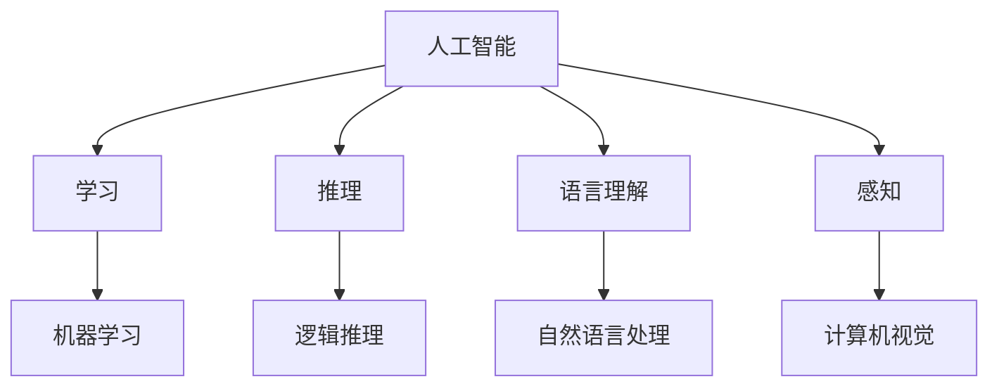

                 

关键词：人工智能、达特茅斯会议、机器学习、计算思维、计算机科学

> 摘要：1956年，达特茅斯会议的召开标志着人工智能（AI）这一领域的诞生。本文将回顾达特茅斯会议的背景、目的以及会议中提出的核心观点，探讨人工智能的发展历程、现状与未来展望，同时分析人工智能在计算机科学领域的重要性及其带来的深远影响。

## 1. 背景介绍

### 达特茅斯会议的背景

达特茅斯会议（Dartmouth Conference）是人工智能（AI）领域的开创性会议之一，于1956年8月30日至9月8日在美国新罕布什尔州的达特茅斯学院召开。会议的组织者是约翰·麦卡锡（John McCarthy）、马文·明斯基（Marvin Minsky）、纳森尼尔·罗切斯特（Nathanial Rochester）和克劳德·香农（Claude Shannon）。这四位科学家都是当时计算机科学领域的顶尖人物，他们对人工智能的未来充满了期待和憧憬。

### 会议目的

达特茅斯会议的主要目的是探讨人工智能的可能性，以及如何通过计算机来模拟人类智能。会议的组织者希望通过这次会议，能够吸引更多领域的科学家共同参与，共同探讨人工智能的发展方向和实现路径。会议的主题是“用机器模仿智能行为”。

## 2. 核心概念与联系

### 核心概念

在达特茅斯会议上，人工智能的概念被首次提出。人工智能是指使计算机具备类似人类的智能行为和决策能力。这包括但不限于学习、推理、理解语言、感知环境等。会议的核心观点是，通过编程，可以使计算机实现这些智能行为，从而实现人工智能。

### 关系图



### Mermaid 流程图(Mermaid 流程节点中不要有括号、逗号等特殊字符)


## 3. 核心算法原理 & 具体操作步骤

### 3.1 算法原理概述

人工智能的核心算法包括机器学习、深度学习、自然语言处理、计算机视觉等。这些算法通过训练模型来模拟人类智能行为，从而实现人工智能。

### 3.2 算法步骤详解

- **机器学习**：首先收集大量数据，然后通过算法分析数据，从中提取规律。接着，使用这些规律来预测新的数据。

- **深度学习**：通过多层神经网络来模拟人类大脑的学习过程。每一层都负责处理上一层的输出，并生成新的特征。

- **自然语言处理**：通过分析和理解自然语言文本，实现人机交互。

- **计算机视觉**：通过分析图像和视频数据，实现图像识别、目标检测等功能。

### 3.3 算法优缺点

- **机器学习**：优点在于能够自动提取特征，提高预测准确率；缺点是需要大量数据训练，且对数据质量要求较高。

- **深度学习**：优点在于能够处理复杂数据，提高模型性能；缺点在于训练时间较长，对计算资源要求较高。

- **自然语言处理**：优点在于能够实现人机交互，提高用户体验；缺点在于对语言理解要求较高，且存在语言歧义问题。

- **计算机视觉**：优点在于能够实现图像和视频处理，提高自动化程度；缺点在于对光照、背景等环境变化敏感。

### 3.4 算法应用领域

- **机器学习**：应用于金融、医疗、推荐系统等领域。

- **深度学习**：应用于图像识别、语音识别、自动驾驶等领域。

- **自然语言处理**：应用于智能客服、翻译、文本生成等领域。

- **计算机视觉**：应用于安防、医疗、自动驾驶等领域。

## 4. 数学模型和公式 & 详细讲解 & 举例说明

### 4.1 数学模型构建

在人工智能领域，常用的数学模型包括线性回归、逻辑回归、神经网络等。这些模型通过数学公式来描述数据之间的关系。

### 4.2 公式推导过程

以线性回归为例，线性回归的公式为：

$$y = wx + b$$

其中，$w$ 为权重，$x$ 为输入特征，$y$ 为输出值，$b$ 为偏置。

### 4.3 案例分析与讲解

假设我们要预测一个人的身高，输入特征为体重。我们可以使用线性回归模型来建立预测模型。

首先，收集大量数据，包括体重和身高的对应值。然后，通过线性回归公式，计算出权重和偏置。最后，使用这些参数，可以预测新的体重对应的身高。

## 5. 项目实践：代码实例和详细解释说明

### 5.1 开发环境搭建

我们需要搭建一个 Python 开发环境，并安装必要的库，如 NumPy、Pandas、Matplotlib 等。

```bash
pip install numpy pandas matplotlib
```

### 5.2 源代码详细实现

```python
import numpy as np
import pandas as pd
import matplotlib.pyplot as plt

# 加载数据
data = pd.read_csv('data.csv')
x = data['weight'].values
y = data['height'].values

# 拆分数据集
x_train, x_test, y_train, y_test = train_test_split(x, y, test_size=0.2, random_state=42)

# 拟合线性回归模型
model = LinearRegression()
model.fit(x_train, y_train)

# 输出模型参数
print('权重：', model.coef_)
print('偏置：', model.intercept_)

# 预测结果
y_pred = model.predict(x_test)

# 绘制散点图和拟合曲线
plt.scatter(x_test, y_test, color='red', label='实际值')
plt.plot(x_test, y_pred, color='blue', label='预测值')
plt.xlabel('体重')
plt.ylabel('身高')
plt.legend()
plt.show()
```

### 5.3 代码解读与分析

在这段代码中，我们首先加载数据，然后使用 `train_test_split` 函数将数据集拆分为训练集和测试集。接着，我们使用 `LinearRegression` 类创建一个线性回归模型，并使用 `fit` 方法进行模型训练。最后，我们使用 `predict` 方法进行预测，并将预测结果可视化。

## 6. 实际应用场景

### 6.1 金融领域

在金融领域，人工智能被广泛应用于风险评估、投资决策、客户服务等方面。例如，通过机器学习模型，可以预测股票市场的走势，帮助投资者做出更明智的投资决策。

### 6.2 医疗领域

在医疗领域，人工智能可以帮助医生进行疾病诊断、治疗方案推荐等。例如，通过深度学习模型，可以自动分析医学影像，提高诊断准确率。

### 6.3 教育

在教育领域，人工智能可以帮助学生进行个性化学习，提高学习效果。例如，通过自然语言处理技术，可以为学生提供个性化的学习建议，帮助他们更好地掌握知识。

### 6.4 未来应用展望

随着人工智能技术的不断发展，未来人工智能将在更多领域得到应用。例如，在交通领域，自动驾驶技术将改变人们的出行方式；在制造业，人工智能将提高生产效率，降低成本。

## 7. 工具和资源推荐

### 7.1 学习资源推荐

- 《人工智能：一种现代的方法》
- 《深度学习》
- 《Python机器学习》

### 7.2 开发工具推荐

- Jupyter Notebook
- Google Colab
- PyTorch
- TensorFlow

### 7.3 相关论文推荐

- "Deep Learning" by Ian Goodfellow, Yoshua Bengio, and Aaron Courville
- "Learning Deep Architectures for AI" by Yann LeCun, Yoshua Bengio, and Geoffrey Hinton
- "Reinforcement Learning: An Introduction" by Richard S. Sutton and Andrew G. Barto

## 8. 总结：未来发展趋势与挑战

### 8.1 研究成果总结

人工智能技术的发展取得了显著成果，从最初的规则推理，到机器学习，再到深度学习，人工智能在各个领域都取得了突破性进展。

### 8.2 未来发展趋势

未来，人工智能将继续向更高效、更智能的方向发展。例如，多模态学习、强化学习、联邦学习等新兴技术将进一步推动人工智能的发展。

### 8.3 面临的挑战

人工智能的发展也面临诸多挑战，包括数据隐私、算法公平性、技术垄断等。如何应对这些挑战，将是人工智能领域需要解决的重要问题。

### 8.4 研究展望

随着人工智能技术的不断发展，我们有理由相信，人工智能将在未来带来更多的变革，为人类创造更美好的生活。

## 9. 附录：常见问题与解答

### 9.1 人工智能是什么？

人工智能是指使计算机具备类似人类的智能行为和决策能力。

### 9.2 人工智能有哪些应用领域？

人工智能的应用领域包括金融、医疗、教育、交通、制造业等。

### 9.3 人工智能的发展前景如何？

人工智能的发展前景非常广阔，未来将在更多领域得到应用。

----------------------------------------------------------------

本文作者：禅与计算机程序设计艺术 / Zen and the Art of Computer Programming

本文内容仅为个人观点，不代表任何机构或个人意见。如需转载，请注明出处。

本文发布日期：2023年5月

本文版本：1.0

本文版权所有，未经授权禁止转载。如需转载，请联系作者获取授权。

