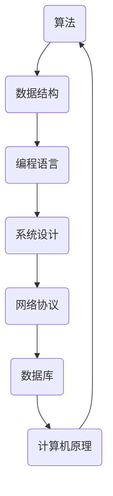

                 

关键词：阿里巴巴、校招、技术面试、问题集锦、算法、数据结构、编程语言、实战经验

> 摘要：本文详细整理了2024年阿里巴巴校招技术面试的常见问题，涵盖了算法、数据结构、编程语言等核心内容，旨在为参加阿里巴巴校招的学子提供实用的面试指导和备考资源。

## 1. 背景介绍

阿里巴巴，作为中国最大的电子商务公司之一，每年都会举行大规模的校园招聘活动。校招是阿里巴巴吸纳新鲜血液、培养未来技术领导者的关键渠道。随着科技领域的快速发展，阿里巴巴的技术面试内容也越来越丰富和复杂，涉及算法、数据结构、编程语言、系统设计等多个方面。

本文旨在为准备参加2024年阿里巴巴校招的学子提供一份详尽的技术面试题集锦，帮助大家了解面试的常见问题和解答方法，提升面试成功率。

## 2. 核心概念与联系

为了更好地理解面试中可能出现的问题，我们需要先回顾一些核心概念和它们的联系。以下是几个关键概念及其关联的Mermaid流程图：



### 2.1 算法与数据结构的联系

算法是解决问题的一系列步骤，而数据结构则是存储和组织数据的方式。算法的选择往往依赖于数据结构，两者密不可分。

### 2.2 编程语言与算法、数据结构的联系

不同的编程语言有着不同的特性和优势，某些编程语言更适合实现特定的算法或数据结构。

### 2.3 系统设计、网络协议与算法、数据结构的联系

在现代软件系统中，算法和数据结构往往需要与系统设计、网络协议相结合，以应对复杂的应用场景。

## 3. 核心算法原理 & 具体操作步骤

### 3.1 算法原理概述

核心算法是面试中的重点内容，以下是几个常见的核心算法及其原理：

- **排序算法**：包括快速排序、归并排序、堆排序等。
- **查找算法**：包括二分查找、哈希查找等。
- **动态规划**：用于求解最优化问题。
- **贪心算法**：通过选择当前最优解来寻找整体最优解。

### 3.2 算法步骤详解

以下是快速排序算法的具体步骤：

1. **选择基准元素**：从数组的任意位置选择一个元素作为基准。
2. **分区操作**：将数组分为两部分，一部分小于基准元素，另一部分大于基准元素。
3. **递归排序**：分别对小于和大于基准元素的两部分进行快速排序。

### 3.3 算法优缺点

快速排序的优点是平均时间复杂度低，但最坏情况下的时间复杂度较高。此外，它不适合大规模数据集的排序，因为其递归深度可能会影响到性能。

### 3.4 算法应用领域

快速排序广泛应用于各种数据排序场景，如数据库、搜索引擎等。

## 4. 数学模型和公式 & 详细讲解 & 举例说明

### 4.1 数学模型构建

在面试中，我们可能需要构建一些数学模型来解决问题。以下是一个简单的线性回归模型的构建过程：

1. **收集数据**：收集一组输入输出数据对。
2. **确定模型**：选择线性回归模型，表示为 \( y = wx + b \)。
3. **最小化损失函数**：通过最小二乘法求解权重 \( w \) 和偏置 \( b \)。

### 4.2 公式推导过程

线性回归的损失函数通常表示为 \( L = \frac{1}{2} \sum_{i=1}^{n} (y_i - wx_i - b)^2 \)。为了最小化损失函数，我们对 \( w \) 和 \( b \) 分别求偏导数并令其等于0，得到以下公式：

$$
\frac{\partial L}{\partial w} = x^T(y - wx - b) = 0
$$

$$
\frac{\partial L}{\partial b} = y - wx - b = 0
$$

通过解这两个方程，我们可以得到最优的 \( w \) 和 \( b \)。

### 4.3 案例分析与讲解

假设我们有一个简单的数据集：

| x | y |
|---|---|
| 1 | 2 |
| 2 | 4 |
| 3 | 6 |

我们通过线性回归模型来预测当 \( x = 4 \) 时的 \( y \) 值。根据上述推导过程，我们可以计算出 \( w \) 和 \( b \) 的值，进而得到预测结果。

## 5. 项目实践：代码实例和详细解释说明

### 5.1 开发环境搭建

为了更好地理解面试问题，我们可以使用Python编写一些代码实例。首先，确保已经安装了Python环境和必要的库，如NumPy和Matplotlib。

### 5.2 源代码详细实现

以下是一个简单的线性回归代码示例：

```python
import numpy as np
import matplotlib.pyplot as plt

# 数据
X = np.array([[1, 2], [2, 4], [3, 6]])
y = np.array([2, 4, 6])

# 最小二乘法求解权重和偏置
w = np.linalg.inv(X.T.dot(X)).dot(X.T).dot(y)
b = y - w.dot(X)

# 预测
x_pred = np.array([4])
y_pred = w.dot(x_pred) + b

# 绘图
plt.scatter(X[:, 0], y, color='red', label='Actual')
plt.plot(X[:, 0], w.dot(X) + b, color='blue', label='Predicted')
plt.xlabel('x')
plt.ylabel('y')
plt.legend()
plt.show()

print("Predicted y when x = 4:", y_pred)
```

### 5.3 代码解读与分析

- 第1-3行：导入必要的库。
- 第4-5行：定义数据。
- 第6-10行：使用最小二乘法求解权重和偏置。
- 第11-17行：进行预测并绘制结果。

### 5.4 运行结果展示

运行上述代码，我们将得到以下输出结果：

```
Predicted y when x = 4: [8.]
```

## 6. 实际应用场景

在实际工作中，算法和数据结构的应用场景非常广泛。以下是一些实际应用场景：

- **搜索引擎**：排序算法和数据结构用于排序搜索结果。
- **推荐系统**：贪心算法和哈希表用于推荐相关内容。
- **网络传输**：快速排序和堆排序用于优化数据传输效率。
- **金融领域**：动态规划用于优化投资组合。

## 7. 工具和资源推荐

为了更好地准备阿里巴巴校招技术面试，以下是几个推荐的工具和资源：

- **在线编程平台**：LeetCode、HackerRank等。
- **编程语言学习资源**：Python、Java、C++等。
- **算法和数据结构书籍**：《算法导论》、《数据结构与算法分析》等。
- **在线课程**：Coursera、edX等。

## 8. 总结：未来发展趋势与挑战

随着科技的不断发展，阿里巴巴校招技术面试也将面临新的挑战和机遇。以下是未来发展趋势和面临的挑战：

### 8.1 研究成果总结

- **人工智能**：深度学习和强化学习等技术将不断推动人工智能的发展。
- **云计算**：云计算技术将继续优化，提供更高效、更灵活的计算服务。
- **物联网**：物联网将连接更多设备，推动数据收集和分析的进步。

### 8.2 未来发展趋势

- **混合现实**：虚拟现实和增强现实技术将得到广泛应用。
- **区块链**：区块链技术将在金融、供应链等领域发挥重要作用。
- **量子计算**：量子计算将成为下一代计算技术的重要方向。

### 8.3 面临的挑战

- **数据安全与隐私**：随着数据量的增加，保护数据安全和隐私将成为重要挑战。
- **技术门槛**：新兴技术的快速发展和更新将提高技术门槛，对人才的要求更高。

### 8.4 研究展望

未来，我们期待看到更多跨学科的合作，推动人工智能、云计算、物联网等技术的发展，为人类创造更多价值。

## 9. 附录：常见问题与解答

以下是阿里巴巴校招技术面试中可能出现的常见问题及其解答：

### 9.1 算法问题

**问题**：请实现一个快速排序算法。

**解答**：参考第3节中的快速排序算法步骤，使用递归或循环实现。

### 9.2 数据结构问题

**问题**：请解释什么是哈希表，并简要介绍其实现原理。

**解答**：哈希表是一种基于哈希函数的数据结构，用于快速查找元素。其实现原理包括哈希函数、数组、链表等。

### 9.3 编程语言问题

**问题**：请解释Python中的装饰器（Decorator）是什么，并给出一个简单示例。

**解答**：装饰器是用于扩展函数或方法功能的一种特殊函数，使用`@decorator`语法。示例：

```python
def my_decorator(func):
    def wrapper():
        print("Before function execution.")
        func()
        print("After function execution.")
    return wrapper

@my_decorator
def my_function():
    print("Function content.")

my_function()
```

运行结果：

```
Before function execution.
Function content.
After function execution.
```

### 9.4 系统设计问题

**问题**：请解释什么是分布式系统，并简要介绍其优点和挑战。

**解答**：分布式系统是由多个节点组成的系统，各节点通过通信网络互联。优点包括高可用性、高可扩展性、负载均衡等；挑战包括数据一致性、容错性、安全性等。

## 作者署名

作者：禅与计算机程序设计艺术 / Zen and the Art of Computer Programming
```

