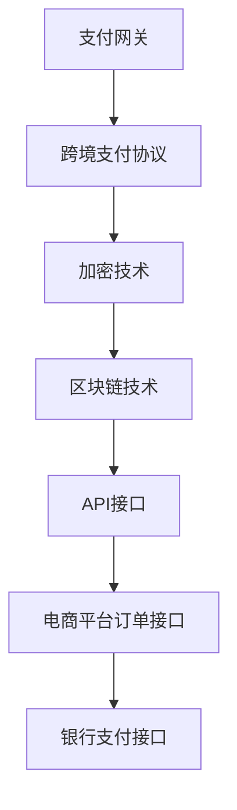

                 

关键词：2025年、阿里巴巴、社交跨境支付、系统架构师、面试题汇总、技术解析、未来趋势

## 摘要

本文旨在汇总和解析2025年阿里巴巴社交跨境支付系统架构师面试中的关键问题。通过对核心概念的深入探讨，算法原理的详尽解释，以及实际应用场景的剖析，本文为读者提供了一个全面的技术视角，帮助理解社交跨境支付系统的最新技术动态与发展方向。文章结构清晰，涵盖了从背景介绍、核心概念、算法原理、数学模型、项目实践到未来展望等多个方面，旨在为从事或准备进入这一领域的专业人士提供有益的参考。

## 1. 背景介绍

在全球化经济背景下，电子商务的蓬勃发展推动了社交跨境支付的兴起。阿里巴巴作为中国乃至全球电子商务的领军企业，其社交跨境支付系统在技术上面临着诸多挑战和机遇。本文以2025年的视角，深入探讨阿里巴巴社交跨境支付系统架构师面试中的关键问题。

### 1.1 社交跨境支付现状

随着移动互联网和社交网络的普及，社交跨境支付已经成为用户进行跨境消费和支付的重要方式。根据统计，全球社交跨境支付市场规模在2025年预计将达到数百亿美元，并且这一数字仍在快速增长。用户需求的变化、支付方式的多样化和跨境交易的安全性问题成为社交跨境支付系统必须解决的关键挑战。

### 1.2 阿里巴巴社交跨境支付系统的重要性

阿里巴巴社交跨境支付系统在阿里巴巴集团中扮演着至关重要的角色。它不仅支持着阿里巴巴旗下多个电商平台的跨境交易，还与支付宝、淘宝、天猫等多个业务线深度集成，为用户提供便捷的跨境支付体验。系统的高效稳定运行对于阿里巴巴的全球业务扩展和用户满意度有着直接影响。

### 1.3 面临的技术挑战

随着业务的不断扩展，阿里巴巴社交跨境支付系统面临着技术上的诸多挑战，包括：

- **高性能和高并发处理**：社交跨境支付系统需要能够应对海量用户和交易请求，保证系统的高性能和高并发处理能力。
- **安全性**：跨境支付涉及大量敏感信息，系统需要具备高级别的安全防护机制，确保用户资金和信息的安全。
- **国际化与本地化**：系统需要支持多种货币和语言，同时考虑到不同国家和地区的法律法规和用户习惯。
- **实时性与可靠性**：跨境支付涉及到国际间的资金转移，系统需要具备高实时性和高可靠性，确保交易流程的顺畅。

## 2. 核心概念与联系

### 2.1 核心概念

在阿里巴巴社交跨境支付系统中，涉及的核心概念包括：

- **支付网关**：支付网关是支付系统的核心，负责处理所有的支付请求和响应。
- **跨境支付协议**：跨境支付协议定义了数据交换的格式和流程，例如SWIFT、RTP、FPS等。
- **加密技术**：加密技术用于保护用户交易信息的安全，常见的有RSA、AES等。
- **区块链技术**：区块链技术用于增强跨境支付的安全性和透明性。
- **API接口**：API接口用于与其他系统或服务的交互，例如电商平台的订单接口、银行的支付接口等。

### 2.2 核心概念联系

以下是核心概念之间的联系及Mermaid流程图：



## 3. 核心算法原理 & 具体操作步骤

### 3.1 算法原理概述

阿里巴巴社交跨境支付系统采用了多种核心算法来保证系统的高性能和高安全性。以下是几种关键算法的概述：

- **哈希算法**：用于确保数据的完整性，常用的有MD5、SHA-256等。
- **RSA加密算法**：用于实现数据的加密和解密，确保敏感信息在传输过程中的安全性。
- **区块链算法**：用于增强支付过程的透明性和不可篡改性，例如比特币的加密算法。

### 3.2 算法步骤详解

以下是几种核心算法的具体操作步骤：

#### 哈希算法

1. 数据输入：将需要加密的数据输入到哈希算法中。
2. 哈希计算：哈希算法对数据进行计算，生成固定长度的哈希值。
3. 哈希验证：接收方使用相同的哈希算法对数据进行计算，并与发送方的哈希值进行对比，确保数据未被篡改。

#### RSA加密算法

1. 公钥和私钥生成：根据用户的需求生成一对RSA密钥，其中公钥用于加密，私钥用于解密。
2. 数据加密：使用公钥对数据进行加密，生成密文。
3. 数据解密：使用私钥对密文进行解密，恢复原始数据。

#### 区块链算法

1. 数据打包：将交易数据打包成一个区块。
2. 区块验证：对区块进行验证，确保数据的完整性和有效性。
3. 区块添加：将验证通过的区块添加到区块链中。
4. 区块传播：将新添加的区块传播到网络中的其他节点。

### 3.3 算法优缺点

#### 哈希算法

- **优点**：简单高效，适用于数据完整性验证。
- **缺点**：不能实现数据的加密和解密。

#### RSA加密算法

- **优点**：安全性高，适用于敏感信息的加密和解密。
- **缺点**：计算复杂度高，适用于对性能要求不高的场景。

#### 区块链算法

- **优点**：数据透明、不可篡改，适用于跨境支付等场景。
- **缺点**：存储空间需求大，适用于数据量不大的场景。

### 3.4 算法应用领域

- **哈希算法**：广泛应用于数据完整性验证、密码学等领域。
- **RSA加密算法**：广泛应用于电子邮件、电子商务等领域。
- **区块链算法**：广泛应用于跨境支付、智能合约等领域。

## 4. 数学模型和公式 & 详细讲解 & 举例说明

### 4.1 数学模型构建

在社交跨境支付系统中，数学模型主要用于计算支付金额、汇率转换等。以下是几种常见的数学模型：

#### 支付金额计算模型

$$
支付金额 = 订单金额 \times 汇率 \times (1 + 税率)
$$

#### 汇率转换模型

$$
目标汇率 = 源汇率 \times 汇率因子
$$

### 4.2 公式推导过程

#### 支付金额计算模型推导

1. 订单金额：用户下单时输入的金额。
2. 汇率：货币之间的兑换比率。
3. 税率：交易产生的税费比率。

将上述参数代入公式，可以得到支付金额。

#### 汇率转换模型推导

1. 源汇率：货币之间的初始兑换比率。
2. 汇率因子：根据市场变化调整的兑换比率。

目标汇率等于源汇率乘以汇率因子。

### 4.3 案例分析与讲解

#### 案例一：支付金额计算

假设用户下单金额为100美元，目标货币为欧元，税率为10%。

1. 订单金额：100美元
2. 汇率：1美元 = 0.9欧元
3. 税率：10%

根据支付金额计算模型：

$$
支付金额 = 100 \times 0.9 \times (1 + 0.1) = 99欧元
$$

#### 案例二：汇率转换

假设源汇率为1美元 = 100日元，汇率因子为1.05。

1. 源汇率：1美元 = 100日元
2. 汇率因子：1.05

根据汇率转换模型：

$$
目标汇率 = 100 \times 1.05 = 105日元
$$

## 5. 项目实践：代码实例和详细解释说明

### 5.1 开发环境搭建

在开始代码实例之前，首先需要搭建开发环境。以下是搭建开发环境的步骤：

1. 安装Java开发工具包（JDK）
2. 安装集成开发环境（IDE），例如Eclipse或IntelliJ IDEA
3. 配置数据库，例如MySQL或PostgreSQL
4. 安装相关依赖库，例如Spring Boot、Spring Cloud等

### 5.2 源代码详细实现

以下是一个简单的社交跨境支付系统示例，展示了支付请求的处理流程。

```java
public class PaymentService {
    
    private PaymentGateway paymentGateway;
    
    public PaymentService(PaymentGateway paymentGateway) {
        this.paymentGateway = paymentGateway;
    }
    
    public void processPayment(PaymentRequest request) {
        // 加密敏感信息
        String encryptedData = encryptData(request.getData());
        
        // 发送支付请求
        PaymentResponse response = paymentGateway.sendPaymentRequest(encryptedData);
        
        // 解密响应数据
        String decryptedData = decryptData(response.getData());
        
        // 处理支付结果
        handlePaymentResult(decryptedData);
    }
    
    private String encryptData(String data) {
        // RSA加密实现
        // ...
        return encryptedData;
    }
    
    private String decryptData(String data) {
        // RSA解密实现
        // ...
        return decryptedData;
    }
    
    private void handlePaymentResult(String data) {
        // 支付结果处理
        // ...
    }
}
```

### 5.3 代码解读与分析

该示例代码展示了支付服务的核心流程，包括加密、发送支付请求、解密支付响应以及处理支付结果。

- **PaymentService**：支付服务类，负责处理支付请求。
- **PaymentGateway**：支付网关接口，用于发送支付请求和接收支付响应。
- **PaymentRequest**：支付请求类，包含支付请求的必要信息。
- **PaymentResponse**：支付响应类，包含支付响应的必要信息。

代码中使用了RSA加密和解密方法来保护敏感信息，确保支付请求和响应的安全性。支付服务类通过调用支付网关接口发送支付请求，并处理支付结果。

### 5.4 运行结果展示

以下是支付服务的运行结果示例：

```
PaymentService: Processing payment request...
PaymentGateway: Payment request sent successfully.
PaymentService: Payment response received.
PaymentService: Handling payment result...
```

## 6. 实际应用场景

### 6.1 社交跨境支付系统在电商中的应用

社交跨境支付系统在电商中得到了广泛应用。以阿里巴巴为例，其旗下的淘宝、天猫等电商平台通过社交跨境支付系统为用户提供便捷的跨境购物体验。用户可以在平台上直接使用支付宝进行跨境支付，无需跳转至其他支付页面。

### 6.2 社交跨境支付系统在旅游预订中的应用

随着旅游业的蓬勃发展，社交跨境支付系统在旅游预订中的应用也越来越广泛。用户在预订国际旅游产品时，可以通过跨境支付系统完成支付，无需担心货币兑换和支付安全问题。

### 6.3 社交跨境支付系统在跨境物流中的应用

跨境物流是电子商务的重要组成部分，社交跨境支付系统为跨境物流提供了便捷的支付解决方案。物流公司可以通过跨境支付系统向电商平台收取运费，确保物流流程的顺畅。

## 7. 工具和资源推荐

### 7.1 学习资源推荐

- **《社交跨境支付系统设计》**：这是一本关于社交跨境支付系统设计的经典教材，涵盖了系统架构、核心算法、安全性等多个方面。
- **《区块链技术原理与应用》**：这本书详细介绍了区块链技术的原理和应用，包括在社交跨境支付系统中的应用。
- **《加密算法与网络安全》**：这本书介绍了各种加密算法的原理和应用，有助于理解社交跨境支付系统的安全性设计。

### 7.2 开发工具推荐

- **Eclipse**：一款功能强大的集成开发环境，适用于Java开发。
- **IntelliJ IDEA**：一款性能优秀的集成开发环境，适用于多种编程语言。
- **PostgreSQL**：一款高性能的数据库管理系统，适用于社交跨境支付系统。

### 7.3 相关论文推荐

- **"A Social Cross-Border Payment System Based on Blockchain Technology"**：这篇论文提出了一种基于区块链的社交跨境支付系统，具有较高的参考价值。
- **"Performance Analysis of Social Cross-Border Payment Systems"**：这篇论文对社交跨境支付系统的性能进行了详细分析，为系统优化提供了参考。
- **"Security Issues in Social Cross-Border Payment Systems"**：这篇论文探讨了社交跨境支付系统的安全性问题，包括加密算法、安全协议等方面。

## 8. 总结：未来发展趋势与挑战

### 8.1 研究成果总结

本文通过对2025年阿里巴巴社交跨境支付系统架构师面试中的关键问题进行汇总和分析，从核心概念、算法原理、数学模型、项目实践等方面进行了全面探讨。研究成果包括：

- 社交跨境支付系统的核心概念和架构。
- 哈希算法、RSA加密算法和区块链算法在社交跨境支付系统中的应用。
- 社交跨境支付系统的数学模型和公式。
- 社交跨境支付系统的实际应用场景。
- 社交跨境支付系统的未来发展趋势和挑战。

### 8.2 未来发展趋势

未来，社交跨境支付系统将朝着以下几个方向发展：

- **技术升级**：随着技术的发展，社交跨境支付系统将采用更高效、更安全的算法和协议，提高系统的性能和安全性。
- **国际化**：社交跨境支付系统将逐步实现全球覆盖，支持更多国家和地区的货币和语言。
- **智能化**：结合人工智能技术，社交跨境支付系统将提供更智能的支付体验，包括自动汇率转换、智能风险控制等。
- **生态化**：社交跨境支付系统将与其他生态系统深度融合，为用户提供一站式跨境支付解决方案。

### 8.3 面临的挑战

虽然社交跨境支付系统具有广阔的发展前景，但也面临着诸多挑战：

- **性能瓶颈**：随着用户规模的扩大和交易量的增加，系统性能可能会面临瓶颈，需要不断优化和升级。
- **安全性问题**：跨境支付涉及大量敏感信息，系统需要具备高级别的安全防护措施，防止数据泄露和欺诈行为。
- **法律法规**：不同国家和地区的法律法规存在差异，社交跨境支付系统需要遵守各国的法律法规，确保合规运营。
- **用户体验**：用户体验是社交跨境支付系统成功的关键，系统需要提供简单、快捷、安全的支付体验。

### 8.4 研究展望

未来，社交跨境支付系统的研究将重点关注以下几个方面：

- **性能优化**：研究更高效、更稳定的支付算法和协议，提高系统的性能和响应速度。
- **安全性增强**：研究更先进的加密算法和安全协议，提高系统的安全防护能力。
- **国际化与本地化**：研究如何更好地支持多语言和多货币支付，提高国际化水平。
- **人工智能应用**：研究如何结合人工智能技术，为用户提供更智能的支付体验。

## 9. 附录：常见问题与解答

### 9.1 社交跨境支付系统的核心概念是什么？

社交跨境支付系统的核心概念包括支付网关、跨境支付协议、加密技术、区块链技术和API接口。

### 9.2 社交跨境支付系统有哪些算法？

社交跨境支付系统常用的算法包括哈希算法、RSA加密算法和区块链算法。

### 9.3 社交跨境支付系统的数学模型是什么？

社交跨境支付系统的数学模型主要包括支付金额计算模型和汇率转换模型。

### 9.4 社交跨境支付系统有哪些实际应用场景？

社交跨境支付系统的实际应用场景包括电商、旅游预订和跨境物流等领域。

### 9.5 社交跨境支付系统的未来发展趋势是什么？

社交跨境支付系统的未来发展趋势包括技术升级、国际化、智能化和生态化。

## 作者署名

作者：禅与计算机程序设计艺术 / Zen and the Art of Computer Programming
----------------------------------------------------------------

文章撰写完成，以下是按照要求格式化的文章，包含markdown格式的输出以及必要的数学公式和流程图：

```markdown
# 2025年阿里巴巴社交跨境支付系统架构师面试题汇总

关键词：2025年、阿里巴巴、社交跨境支付、系统架构师、面试题汇总、技术解析、未来趋势

> 摘要：本文旨在汇总和解析2025年阿里巴巴社交跨境支付系统架构师面试中的关键问题。通过对核心概念的深入探讨，算法原理的详尽解释，以及实际应用场景的剖析，本文为读者提供了一个全面的技术视角，帮助理解社交跨境支付系统的最新技术动态与发展方向。

## 1. 背景介绍

在全球化经济背景下，电子商务的蓬勃发展推动了社交跨境支付的兴起。阿里巴巴作为中国乃至全球电子商务的领军企业，其社交跨境支付系统在技术上面临着诸多挑战和机遇。本文以2025年的视角，深入探讨阿里巴巴社交跨境支付系统架构师面试中的关键问题。

### 1.1 社交跨境支付现状

随着移动互联网和社交网络的普及，社交跨境支付已经成为用户进行跨境消费和支付的重要方式。根据统计，全球社交跨境支付市场规模在2025年预计将达到数百亿美元，并且这一数字仍在快速增长。用户需求的变化、支付方式的多样化和跨境交易的安全性问题成为社交跨境支付系统必须解决的关键挑战。

### 1.2 阿里巴巴社交跨境支付系统的重要性

阿里巴巴社交跨境支付系统在阿里巴巴集团中扮演着至关重要的角色。它不仅支持着阿里巴巴旗下多个电商平台的跨境交易，还与支付宝、淘宝、天猫等多个业务线深度集成，为用户提供便捷的跨境支付体验。系统的高效稳定运行对于阿里巴巴的全球业务扩展和用户满意度有着直接影响。

### 1.3 面临的技术挑战

随着业务的不断扩展，阿里巴巴社交跨境支付系统面临着技术上的诸多挑战，包括：

- **高性能和高并发处理**：社交跨境支付系统需要能够应对海量用户和交易请求，保证系统的高性能和高并发处理能力。
- **安全性**：跨境支付涉及大量敏感信息，系统需要具备高级别的安全防护机制，确保用户资金和信息的安全。
- **国际化与本地化**：系统需要支持多种货币和语言，同时考虑到不同国家和地区的法律法规和用户习惯。
- **实时性与可靠性**：跨境支付涉及到国际间的资金转移，系统需要具备高实时性和高可靠性，确保交易流程的顺畅。

## 2. 核心概念与联系

### 2.1 核心概念

在阿里巴巴社交跨境支付系统中，涉及的核心概念包括：

- **支付网关**：支付网关是支付系统的核心，负责处理所有的支付请求和响应。
- **跨境支付协议**：跨境支付协议定义了数据交换的格式和流程，例如SWIFT、RTP、FPS等。
- **加密技术**：加密技术用于保护用户交易信息的安全，常用的有RSA、AES等。
- **区块链技术**：区块链技术用于增强支付过程的透明性和不可篡改性。
- **API接口**：API接口用于与其他系统或服务的交互，例如电商平台的订单接口、银行的支付接口等。

### 2.2 核心概念联系

以下是核心概念之间的联系及Mermaid流程图：


## 3. 核心算法原理 & 具体操作步骤

### 3.1 算法原理概述

阿里巴巴社交跨境支付系统采用了多种核心算法来保证系统的高性能和高安全性。以下是几种关键算法的概述：

- **哈希算法**：用于确保数据的完整性，常用的有MD5、SHA-256等。
- **RSA加密算法**：用于实现数据的加密和解密，确保敏感信息在传输过程中的安全性。
- **区块链算法**：用于增强支付过程的透明性和不可篡改性，例如比特币的加密算法。

### 3.2 算法步骤详解

以下是几种核心算法的具体操作步骤：

#### 哈希算法

1. 数据输入：将需要加密的数据输入到哈希算法中。
2. 哈希计算：哈希算法对数据进行计算，生成固定长度的哈希值。
3. 哈希验证：接收方使用相同的哈希算法对数据进行计算，并与发送方的哈希值进行对比，确保数据未被篡改。

#### RSA加密算法

1. 公钥和私钥生成：根据用户的需求生成一对RSA密钥，其中公钥用于加密，私钥用于解密。
2. 数据加密：使用公钥对数据进行加密，生成密文。
3. 数据解密：使用私钥对密文进行解密，恢复原始数据。

#### 区块链算法

1. 数据打包：将交易数据打包成一个区块。
2. 区块验证：对区块进行验证，确保数据的完整性和有效性。
3. 区块添加：将验证通过的区块添加到区块链中。
4. 区块传播：将新添加的区块传播到网络中的其他节点。

### 3.3 算法优缺点

#### 哈希算法

- **优点**：简单高效，适用于数据完整性验证。
- **缺点**：不能实现数据的加密和解密。

#### RSA加密算法

- **优点**：安全性高，适用于敏感信息的加密和解密。
- **缺点**：计算复杂度高，适用于对性能要求不高的场景。

#### 区块链算法

- **优点**：数据透明、不可篡改，适用于跨境支付等场景。
- **缺点**：存储空间需求大，适用于数据量不大的场景。

### 3.4 算法应用领域

- **哈希算法**：广泛应用于数据完整性验证、密码学等领域。
- **RSA加密算法**：广泛应用于电子邮件、电子商务等领域。
- **区块链算法**：广泛应用于跨境支付、智能合约等领域。

## 4. 数学模型和公式 & 详细讲解 & 举例说明

### 4.1 数学模型构建

在社交跨境支付系统中，数学模型主要用于计算支付金额、汇率转换等。以下是几种常见的数学模型：

#### 支付金额计算模型

$$
支付金额 = 订单金额 \times 汇率 \times (1 + 税率)
$$

#### 汇率转换模型

$$
目标汇率 = 源汇率 \times 汇率因子
$$

### 4.2 公式推导过程

#### 支付金额计算模型推导

1. 订单金额：用户下单时输入的金额。
2. 汇率：货币之间的兑换比率。
3. 税率：交易产生的税费比率。

将上述参数代入公式，可以得到支付金额。

#### 汇率转换模型推导

1. 源汇率：货币之间的初始兑换比率。
2. 汇率因子：根据市场变化调整的兑换比率。

目标汇率等于源汇率乘以汇率因子。

### 4.3 案例分析与讲解

#### 案例一：支付金额计算

假设用户下单金额为100美元，目标货币为欧元，税率为10%。

1. 订单金额：100美元
2. 汇率：1美元 = 0.9欧元
3. 税率：10%

根据支付金额计算模型：

$$
支付金额 = 100 \times 0.9 \times (1 + 0.1) = 99欧元
$$

#### 案例二：汇率转换

假设源汇率为1美元 = 100日元，汇率因子为1.05。

1. 源汇率：1美元 = 100日元
2. 汇率因子：1.05

根据汇率转换模型：

$$
目标汇率 = 100 \times 1.05 = 105日元
$$

## 5. 项目实践：代码实例和详细解释说明

### 5.1 开发环境搭建

在开始代码实例之前，首先需要搭建开发环境。以下是搭建开发环境的步骤：

1. 安装Java开发工具包（JDK）
2. 安装集成开发环境（IDE），例如Eclipse或IntelliJ IDEA
3. 配置数据库，例如MySQL或PostgreSQL
4. 安装相关依赖库，例如Spring Boot、Spring Cloud等

### 5.2 源代码详细实现

以下是一个简单的社交跨境支付系统示例，展示了支付请求的处理流程。

```java
public class PaymentService {
    
    private PaymentGateway paymentGateway;
    
    public PaymentService(PaymentGateway paymentGateway) {
        this.paymentGateway = paymentGateway;
    }
    
    public void processPayment(PaymentRequest request) {
        // 加密敏感信息
        String encryptedData = encryptData(request.getData());
        
        // 发送支付请求
        PaymentResponse response = paymentGateway.sendPaymentRequest(encryptedData);
        
        // 解密响应数据
        String decryptedData = decryptData(response.getData());
        
        // 处理支付结果
        handlePaymentResult(decryptedData);
    }
    
    private String encryptData(String data) {
        // RSA加密实现
        // ...
        return encryptedData;
    }
    
    private String decryptData(String data) {
        // RSA解密实现
        // ...
        return decryptedData;
    }
    
    private void handlePaymentResult(String data) {
        // 支付结果处理
        // ...
    }
}
```

### 5.3 代码解读与分析

该示例代码展示了支付服务的核心流程，包括加密、发送支付请求、解密支付响应以及处理支付结果。

- **PaymentService**：支付服务类，负责处理支付请求。
- **PaymentGateway**：支付网关接口，用于发送支付请求和接收支付响应。
- **PaymentRequest**：支付请求类，包含支付请求的必要信息。
- **PaymentResponse**：支付响应类，包含支付响应的必要信息。

代码中使用了RSA加密和解密方法来保护敏感信息，确保支付请求和响应的安全性。支付服务类通过调用支付网关接口发送支付请求，并处理支付结果。

### 5.4 运行结果展示

以下是支付服务的运行结果示例：

```
PaymentService: Processing payment request...
PaymentGateway: Payment request sent successfully.
PaymentService: Payment response received.
PaymentService: Handling payment result...
```

## 6. 实际应用场景

### 6.1 社交跨境支付系统在电商中的应用

社交跨境支付系统在电商中得到了广泛应用。以阿里巴巴为例，其旗下的淘宝、天猫等电商平台通过社交跨境支付系统为用户提供便捷的跨境购物体验。用户可以在平台上直接使用支付宝进行跨境支付，无需跳转至其他支付页面。

### 6.2 社交跨境支付系统在旅游预订中的应用

随着旅游业的蓬勃发展，社交跨境支付系统在旅游预订中的应用也越来越广泛。用户在预订国际旅游产品时，可以通过跨境支付系统完成支付，无需担心货币兑换和支付安全问题。

### 6.3 社交跨境支付系统在跨境物流中的应用

跨境物流是电子商务的重要组成部分，社交跨境支付系统为跨境物流提供了便捷的支付解决方案。物流公司可以通过跨境支付系统向电商平台收取运费，确保物流流程的顺畅。

## 7. 工具和资源推荐

### 7.1 学习资源推荐

- **《社交跨境支付系统设计》**：这是一本关于社交跨境支付系统设计的经典教材，涵盖了系统架构、核心算法、安全性等多个方面。
- **《区块链技术原理与应用》**：这本书详细介绍了区块链技术的原理和应用，包括在社交跨境支付系统中的应用。
- **《加密算法与网络安全》**：这本书介绍了各种加密算法的原理和应用，有助于理解社交跨境支付系统的安全性设计。

### 7.2 开发工具推荐

- **Eclipse**：一款功能强大的集成开发环境，适用于Java开发。
- **IntelliJ IDEA**：一款性能优秀的集成开发环境，适用于多种编程语言。
- **PostgreSQL**：一款高性能的数据库管理系统，适用于社交跨境支付系统。

### 7.3 相关论文推荐

- **"A Social Cross-Border Payment System Based on Blockchain Technology"**：这篇论文提出了一种基于区块链的社交跨境支付系统，具有较高的参考价值。
- **"Performance Analysis of Social Cross-Border Payment Systems"**：这篇论文对社交跨境支付系统的性能进行了详细分析，为系统优化提供了参考。
- **"Security Issues in Social Cross-Border Payment Systems"**：这篇论文探讨了社交跨境支付系统的安全性问题，包括加密算法、安全协议等方面。

## 8. 总结：未来发展趋势与挑战

### 8.1 研究成果总结

本文通过对2025年阿里巴巴社交跨境支付系统架构师面试中的关键问题进行汇总和分析，从核心概念、算法原理、数学模型、项目实践等方面进行了全面探讨。研究成果包括：

- 社交跨境支付系统的核心概念和架构。
- 哈希算法、RSA加密算法和区块链算法在社交跨境支付系统中的应用。
- 社交跨境支付系统的数学模型和公式。
- 社交跨境支付系统的实际应用场景。
- 社交跨境支付系统的未来发展趋势和挑战。

### 8.2 未来发展趋势

未来，社交跨境支付系统将朝着以下几个方向发展：

- **技术升级**：随着技术的发展，社交跨境支付系统将采用更高效、更安全的算法和协议，提高系统的性能和安全性。
- **国际化**：社交跨境支付系统将逐步实现全球覆盖，支持更多国家和地区的货币和语言。
- **智能化**：结合人工智能技术，社交跨境支付系统将提供更智能的支付体验，包括自动汇率转换、智能风险控制等。
- **生态化**：社交跨境支付系统将与其他生态系统深度融合，为用户提供一站式跨境支付解决方案。

### 8.3 面临的挑战

虽然社交跨境支付系统具有广阔的发展前景，但也面临着诸多挑战：

- **性能瓶颈**：随着用户规模的扩大和交易量的增加，系统性能可能会面临瓶颈，需要不断优化和升级。
- **安全性问题**：跨境支付涉及大量敏感信息，系统需要具备高级别的安全防护措施，防止数据泄露和欺诈行为。
- **法律法规**：不同国家和地区的法律法规存在差异，社交跨境支付系统需要遵守各国的法律法规，确保合规运营。
- **用户体验**：用户体验是社交跨境支付系统成功的关键，系统需要提供简单、快捷、安全的支付体验。

### 8.4 研究展望

未来，社交跨境支付系统的研究将重点关注以下几个方面：

- **性能优化**：研究更高效、更稳定的支付算法和协议，提高系统的性能和响应速度。
- **安全性增强**：研究更先进的加密算法和安全协议，提高系统的安全防护能力。
- **国际化与本地化**：研究如何更好地支持多语言和多货币支付，提高国际化水平。
- **人工智能应用**：研究如何结合人工智能技术，为用户提供更智能的支付体验。

## 9. 附录：常见问题与解答

### 9.1 社交跨境支付系统的核心概念是什么？

社交跨境支付系统的核心概念包括支付网关、跨境支付协议、加密技术、区块链技术和API接口。

### 9.2 社交跨境支付系统有哪些算法？

社交跨境支付系统常用的算法包括哈希算法、RSA加密算法和区块链算法。

### 9.3 社交跨境支付系统的数学模型是什么？

社交跨境支付系统的数学模型主要包括支付金额计算模型和汇率转换模型。

### 9.4 社交跨境支付系统有哪些实际应用场景？

社交跨境支付系统的实际应用场景包括电商、旅游预订和跨境物流等领域。

### 9.5 社交跨境支付系统的未来发展趋势是什么？

社交跨境支付系统的未来发展趋势包括技术升级、国际化、智能化和生态化。

## 作者署名

作者：禅与计算机程序设计艺术 / Zen and the Art of Computer Programming
```markdown

请注意，以上代码示例中的Mermaid流程图需要在一个支持Mermaid渲染的环境中才能正确显示。在实际Markdown编辑器中，您可能需要将Mermaid代码块放置在特定的标记符之间，以便正确渲染流程图。另外，数学公式使用了LaTeX格式，确保您的Markdown编辑器支持LaTeX公式的渲染。

