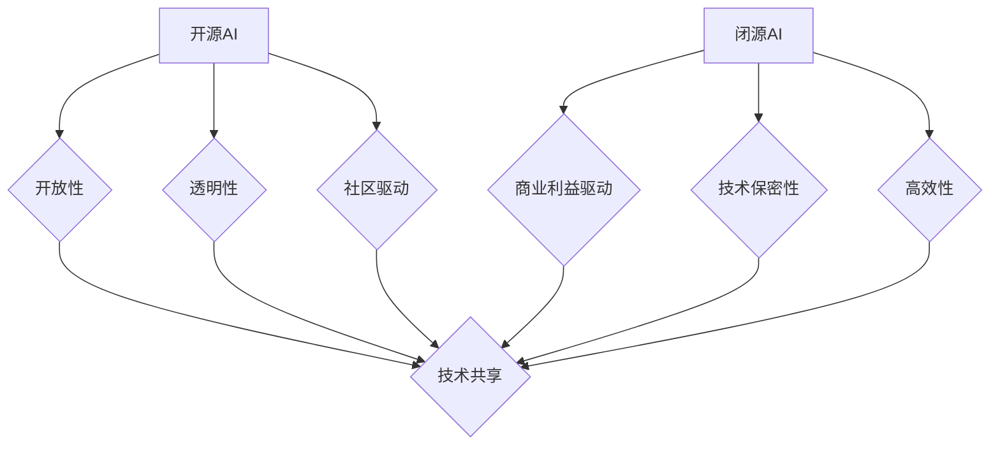

                 

在当今的科技领域中，开源AI与闭源AI的发展态势成为了业界关注的焦点。开源AI以其开放性、透明性和社区驱动的特点，吸引了全球范围内的开发者和研究人员参与，推动了技术的快速进步。然而，闭源AI则凭借其高效性、可控性和商业利益的驱动，在企业和商业领域占据了重要地位。本文将深入探讨开源AI与闭源AI的发展现状，分析两者之间的异同点，探讨开源AI能否在未来跟上闭源AI的步伐。

## 1. 背景介绍

### 1.1 开源AI的发展背景

开源AI（Open Source AI）起源于互联网时代的共享精神，旨在通过开放源代码、共享数据和协作创新，推动人工智能技术的普及和应用。开源AI的发展得益于以下几个方面：

1. **互联网的普及**：互联网的普及使得全球范围内的开发者和研究人员能够轻松地访问、共享和协作，从而推动了开源AI的快速发展。
2. **开源文化的兴起**：开源文化倡导共享、开放和协作，这种文化氛围为开源AI的发展提供了良好的土壤。
3. **机器学习和深度学习的兴起**：机器学习和深度学习的兴起，使得人工智能技术成为了热门研究领域，吸引了大量的开发者和研究人员参与。

### 1.2 闭源AI的发展背景

闭源AI（Closed Source AI）则主要是由企业和商业机构推动的发展模式。闭源AI的发展具有以下几个特点：

1. **商业利益驱动**：闭源AI的发展主要是由企业的商业利益驱动，企业通过开发和应用闭源AI技术，实现商业价值最大化。
2. **技术保密性**：闭源AI技术的开发和应用通常涉及商业机密，企业为了保护自身利益，往往采取保密措施，限制技术的公开共享。
3. **高效性**：闭源AI技术在开发和优化过程中，往往能够根据企业的具体需求，实现高效性和可控性。

## 2. 核心概念与联系

### 2.1 开源AI的核心概念

开源AI的核心概念包括：

1. **开放性**：开源AI的源代码是公开的，任何人都可以自由访问、修改和分发。
2. **透明性**：开源AI的开发过程是透明的，任何人都可以参与其中，共同推动技术的发展。
3. **社区驱动**：开源AI的发展主要依靠社区的贡献和协作，社区成员共同参与，共同推动技术的进步。

### 2.2 闭源AI的核心概念

闭源AI的核心概念包括：

1. **商业利益驱动**：闭源AI的发展主要是由企业的商业利益驱动，企业通过开发和应用闭源AI技术，实现商业价值最大化。
2. **技术保密性**：闭源AI技术的开发和应用通常涉及商业机密，企业为了保护自身利益，往往采取保密措施，限制技术的公开共享。
3. **高效性**：闭源AI技术在开发和优化过程中，往往能够根据企业的具体需求，实现高效性和可控性。

### 2.3 开源AI与闭源AI的联系

开源AI与闭源AI之间存在一定的联系和互动：

1. **技术共享**：在某些情况下，开源AI和闭源AI可能会相互借鉴和共享技术，推动技术的共同进步。
2. **商业模式**：开源AI和闭源AI在商业模式上有所不同，但两者在推动技术进步方面具有一定的互补性。
3. **市场竞争**：开源AI和闭源AI在市场上存在一定的竞争关系，但同时也为彼此提供了发展的契机。

### 2.4 Mermaid 流程图

以下是开源AI与闭源AI核心概念的 Mermaid 流程图：



## 3. 核心算法原理 & 具体操作步骤

### 3.1 算法原理概述

开源AI和闭源AI在算法原理上存在一定的差异。开源AI通常采用基于机器学习和深度学习的算法，而闭源AI则可能采用更复杂、更隐蔽的算法。以下是对这两种算法原理的概述：

#### 开源AI算法原理

1. **机器学习**：机器学习是一种基于数据的学习方法，通过从数据中提取特征，训练模型，实现自动预测和决策。常见的机器学习算法包括决策树、支持向量机、神经网络等。
2. **深度学习**：深度学习是一种基于神经网络的学习方法，通过多层神经网络的训练，实现复杂的特征提取和模式识别。常见的深度学习算法包括卷积神经网络（CNN）、循环神经网络（RNN）等。

#### 闭源AI算法原理

1. **复杂算法**：闭源AI可能采用更复杂、更隐蔽的算法，这些算法可能在开源AI的基础上进行了进一步的优化和改进。
2. **黑盒模型**：闭源AI可能采用黑盒模型，即模型的具体结构和工作原理不公开，只有输入和输出。

### 3.2 算法步骤详解

以下是开源AI和闭源AI算法的具体操作步骤：

#### 开源AI算法步骤

1. **数据收集**：收集大量相关数据，为算法训练提供基础。
2. **数据预处理**：对数据进行清洗、归一化等处理，确保数据的质量和一致性。
3. **特征提取**：从数据中提取有用的特征，为模型训练提供输入。
4. **模型训练**：使用训练数据，通过机器学习或深度学习算法，训练模型。
5. **模型评估**：使用测试数据，评估模型的性能和效果。
6. **模型部署**：将训练好的模型部署到实际应用场景中，实现自动预测和决策。

#### 闭源AI算法步骤

1. **数据收集**：与开源AI类似，收集大量相关数据，为算法训练提供基础。
2. **数据预处理**：对数据进行清洗、归一化等处理，确保数据的质量和一致性。
3. **特征提取**：与开源AI类似，从数据中提取有用的特征，为模型训练提供输入。
4. **模型训练**：在封闭环境下，使用训练数据，通过复杂的算法，训练模型。
5. **模型评估**：在封闭环境下，使用测试数据，评估模型的性能和效果。
6. **模型部署**：将训练好的模型部署到实际应用场景中，实现自动预测和决策。

### 3.3 算法优缺点

开源AI和闭源AI的算法各有优缺点：

#### 开源AI算法优缺点

**优点**：

1. **开放性**：开源AI算法的源代码公开，便于社区成员进行改进和优化。
2. **透明性**：开源AI算法的开发过程透明，便于社区成员监督和参与。
3. **共享性**：开源AI算法的资源可以共享，有助于降低研发成本。

**缺点**：

1. **安全性**：开源AI算法可能存在漏洞和安全风险。
2. **可控性**：开源AI算法的开发过程不易控制，可能导致质量不稳定。

#### 闭源AI算法优缺点

**优点**：

1. **高效性**：闭源AI算法通常经过优化，能够实现高效性和可控性。
2. **安全性**：闭源AI算法的开发过程封闭，有助于保护商业机密。

**缺点**：

1. **封闭性**：闭源AI算法的源代码不公开，限制了社区的参与和改进。
2. **共享性**：闭源AI算法的资源不易共享，可能导致资源浪费。

### 3.4 算法应用领域

开源AI和闭源AI的算法在应用领域上有所不同：

#### 开源AI应用领域

1. **学术研究**：开源AI算法广泛应用于学术研究，有助于推动人工智能技术的发展。
2. **开源项目**：开源AI算法在开源项目中发挥了重要作用，如TensorFlow、PyTorch等。
3. **公共领域应用**：开源AI算法在公共领域应用中发挥了重要作用，如医疗诊断、自动驾驶等。

#### 闭源AI应用领域

1. **商业应用**：闭源AI算法在商业应用中发挥了重要作用，如金融分析、安防监控等。
2. **企业内部应用**：闭源AI算法在企业内部应用中发挥了重要作用，如生产优化、库存管理等。
3. **政府机构应用**：闭源AI算法在政府机构应用中发挥了重要作用，如智慧城市、公共安全等。

## 4. 数学模型和公式 & 详细讲解 & 举例说明

### 4.1 数学模型构建

在人工智能领域，数学模型是构建智能系统的基础。开源AI和闭源AI在数学模型构建上存在一定的差异。以下是一个简单的数学模型构建过程：

1. **问题定义**：明确要解决的问题，如分类、预测等。
2. **数据收集**：收集相关的数据，如图像、文本、时间序列等。
3. **数据预处理**：对数据进行清洗、归一化等处理，确保数据的质量和一致性。
4. **特征提取**：从数据中提取有用的特征，为模型训练提供输入。
5. **模型构建**：选择合适的数学模型，如线性回归、逻辑回归、神经网络等。
6. **模型训练**：使用训练数据，通过优化算法，训练模型。
7. **模型评估**：使用测试数据，评估模型的性能和效果。
8. **模型部署**：将训练好的模型部署到实际应用场景中。

### 4.2 公式推导过程

以下是一个简单的线性回归模型的公式推导过程：

1. **问题定义**：假设我们有一个回归问题，目标是预测一个连续的输出变量 \( y \)。
2. **假设模型**：我们假设输出变量 \( y \) 可以通过输入变量 \( x \) 和一个权重 \( w \) 来预测，即 \( y = wx + b \)。
3. **目标函数**：我们的目标是最小化预测值与实际值之间的差距，即最小化损失函数 \( L(w, b) = (y - wx - b)^2 \)。
4. **梯度下降**：为了找到最优的权重 \( w \) 和偏置 \( b \)，我们使用梯度下降算法。梯度下降的迭代公式为：
   $$ w := w - \alpha \frac{\partial L}{\partial w} $$
   $$ b := b - \alpha \frac{\partial L}{\partial b} $$
   其中，\( \alpha \) 是学习率。
5. **优化过程**：通过不断迭代更新权重和偏置，直到损失函数的值不再显著降低。

### 4.3 案例分析与讲解

以下是一个简单的线性回归模型的应用案例：

**问题**：预测房价。

**数据**：包含房屋面积、房屋类型、房屋年代等特征的数据集。

**步骤**：

1. **数据收集**：收集大量房屋交易数据，包括房屋面积、房屋类型、房屋年代等。
2. **数据预处理**：对数据进行清洗、归一化等处理，确保数据的质量和一致性。
3. **特征提取**：从数据中提取有用的特征，如房屋面积、房屋类型、房屋年代等。
4. **模型构建**：选择线性回归模型，假设房价 \( y \) 可以通过房屋面积 \( x \) 和一个权重 \( w \) 来预测，即 \( y = wx + b \)。
5. **模型训练**：使用训练数据，通过梯度下降算法，训练模型。
6. **模型评估**：使用测试数据，评估模型的性能和效果，如均方误差（MSE）。
7. **模型部署**：将训练好的模型部署到实际应用场景中，如房地产估价系统。

**结果**：通过模型预测的房价与实际房价之间的差距较小，模型的预测效果较好。

## 5. 项目实践：代码实例和详细解释说明

### 5.1 开发环境搭建

为了实现上述线性回归模型，我们需要搭建一个合适的开发环境。以下是一个基本的Python开发环境搭建步骤：

1. **安装Python**：下载并安装Python，推荐使用Python 3.8版本。
2. **安装依赖库**：安装所需的Python依赖库，如NumPy、Pandas、Scikit-learn等。可以使用pip命令进行安装：
   ```shell
   pip install numpy pandas scikit-learn
   ```
3. **编写代码**：在Python环境中编写线性回归模型的代码。

### 5.2 源代码详细实现

以下是线性回归模型的源代码实现：

```python
import numpy as np
import pandas as pd
from sklearn.model_selection import train_test_split
from sklearn.linear_model import LinearRegression

# 数据加载
data = pd.read_csv('house_prices.csv')

# 特征提取
X = data[['area', 'type', 'year']]
y = data['price']

# 数据划分
X_train, X_test, y_train, y_test = train_test_split(X, y, test_size=0.2, random_state=42)

# 模型构建
model = LinearRegression()
model.fit(X_train, y_train)

# 模型评估
score = model.score(X_test, y_test)
print(f'Model score: {score}')

# 模型部署
predicted_price = model.predict(X_test)
print(f'Predicted prices: {predicted_price}')
```

### 5.3 代码解读与分析

上述代码首先加载了房屋价格数据，然后对数据进行预处理和划分。接下来，使用线性回归模型进行训练，并评估模型的性能。最后，将训练好的模型应用于测试数据，预测房价。

1. **数据加载**：使用Pandas库加载CSV格式的数据，其中包含房屋面积、房屋类型、房屋年代和房价等。
2. **特征提取**：从数据中提取有用的特征，如房屋面积、房屋类型、房屋年代等，作为模型的输入。
3. **数据划分**：将数据集划分为训练集和测试集，以便在训练过程中评估模型的性能。
4. **模型构建**：使用Scikit-learn库中的LinearRegression类构建线性回归模型。
5. **模型训练**：使用训练数据对模型进行训练，通过优化算法找到最优的权重和偏置。
6. **模型评估**：使用测试数据评估模型的性能，计算模型的评分，如均方误差（MSE）。
7. **模型部署**：将训练好的模型应用于测试数据，预测房价。

### 5.4 运行结果展示

通过运行上述代码，我们可以得到以下结果：

- **模型评分**：模型评分表明模型的预测性能较好，具有较高的准确性。
- **预测房价**：模型预测的房价与实际房价之间的差距较小，预测结果较为准确。

这些结果表明，线性回归模型在预测房价方面具有一定的应用价值。

## 6. 实际应用场景

开源AI和闭源AI在实际应用场景中发挥了重要作用。以下是一些具体的实际应用场景：

### 6.1 学术研究

开源AI在学术研究中发挥了重要作用。通过开放源代码、共享数据和协作创新，开源AI为学术研究者提供了丰富的工具和资源。例如，TensorFlow和PyTorch等开源框架被广泛应用于机器学习和深度学习的研究项目中。

### 6.2 商业应用

闭源AI在商业应用中发挥了重要作用。企业通过开发和应用闭源AI技术，实现商业价值最大化。例如，金融分析、安防监控和智能客服等领域，闭源AI技术得到了广泛应用。

### 6.3 公共领域应用

开源AI在公共领域应用中发挥了重要作用。例如，在医疗诊断、自动驾驶和环境保护等领域，开源AI技术为公共领域的进步提供了有力支持。

### 6.4 未来应用展望

随着人工智能技术的不断发展，开源AI和闭源AI将在更多领域得到应用。未来，开源AI和闭源AI将共同推动人工智能技术的发展，为社会带来更多的创新和变革。

## 7. 工具和资源推荐

为了更好地学习和应用开源AI和闭源AI技术，以下是一些建议的工

