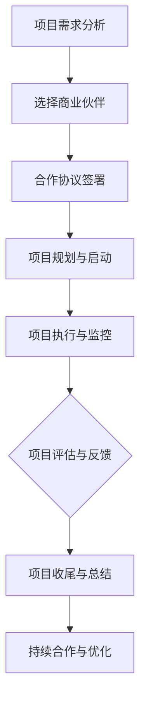

                 

关键词：开源项目，商业伙伴计划，项目管理，合作模式，可持续发展

> 摘要：本文将探讨开源项目的商业伙伴计划，分析其在项目管理中的重要性、结构设计和实施策略。通过案例研究和实践经验，深入解析商业伙伴计划如何促进开源项目的发展，同时探讨面临的挑战和未来趋势。

## 1. 背景介绍

开源项目以其开放性、协作性和共享性，已经成为现代软件开发的重要模式。然而，开源项目的可持续发展不仅依赖于社区贡献，还需要商业力量的参与。商业伙伴计划正是为了在开源项目中引入商业合作，以实现项目长期发展和商业化目标。

商业伙伴计划的初衷是，通过商业机构的参与，为开源项目提供资金、技术、人才等资源，从而提升项目的质量和影响力。同时，商业伙伴也能通过开源项目获得技术积累、市场影响和品牌价值。因此，商业伙伴计划成为开源生态系统中不可或缺的一环。

## 2. 核心概念与联系

### 2.1 项目管理

项目管理是商业伙伴计划的基础，它涵盖了项目的规划、执行、监控和收尾等各个环节。有效的项目管理能够确保项目的顺利进行，降低风险，提高成功率。

### 2.2 合作模式

合作模式是指商业伙伴与开源项目之间如何协作和互利的机制。常见的合作模式包括资金支持、技术贡献、市场推广、人才共享等。不同的合作模式适合不同的项目和商业伙伴。

### 2.3 可持续发展

可持续发展是商业伙伴计划的重要目标。它要求商业伙伴不仅要在短期内为开源项目提供支持，还要在长期内帮助项目建立自我发展的能力，确保项目的可持续性。

### 2.4 Mermaid 流程图

以下是一个简化的商业伙伴计划流程图：



## 3. 核心算法原理 & 具体操作步骤

### 3.1 算法原理概述

商业伙伴计划的核心算法原理在于建立一种互惠互利的合作机制。具体包括以下几个步骤：

1. **需求分析**：明确开源项目的需求和目标，确定商业伙伴的合作方向。
2. **选择伙伴**：根据项目的需求和目标，筛选潜在的商业伙伴。
3. **合作签约**：与选定的商业伙伴签署合作协议，明确双方的权利和义务。
4. **项目规划与启动**：制定项目计划，分配资源，启动项目。
5. **项目执行与监控**：按照项目计划执行，定期监控项目进度和质量。
6. **项目评估与反馈**：对项目进行评估，收集反馈，优化项目执行。
7. **项目收尾与总结**：完成项目，总结经验教训，为后续项目提供参考。

### 3.2 算法步骤详解

#### 3.2.1 需求分析

需求分析是商业伙伴计划的第一步。它要求项目团队明确项目的核心需求，包括功能需求、性能需求、安全性需求等。同时，还需要分析项目的长远目标，以便为后续合作提供方向。

#### 3.2.2 选择商业伙伴

选择商业伙伴是商业伙伴计划的关键。项目团队需要根据项目的需求，选择有相关技术实力、市场影响力和合作意愿的商业伙伴。可以通过市场调研、参考案例、技术评审等方式进行筛选。

#### 3.2.3 合作签约

合作签约是商业伙伴计划的法律保障。合作协议应明确商业伙伴的职责、权利、义务、合作期限、收益分配等关键条款。同时，还需要明确项目管理的流程和规范。

#### 3.2.4 项目规划与启动

项目规划与启动是商业伙伴计划的执行阶段。项目团队需要根据合作协议，制定详细的项目计划，包括项目目标、任务分解、资源分配、时间安排等。然后，按照项目计划启动项目，分配资源，组织团队执行。

#### 3.2.5 项目执行与监控

项目执行与监控是商业伙伴计划的核心。项目团队需要按照项目计划执行任务，定期汇报项目进度和质量，确保项目按计划进行。同时，还需要对项目进行监控，及时发现和解决潜在问题。

#### 3.2.6 项目评估与反馈

项目评估与反馈是商业伙伴计划的总结阶段。项目团队需要对项目进行评估，包括项目目标的达成情况、资源利用效率、项目风险等。同时，还需要收集商业伙伴和社区的反馈，为后续项目提供改进方向。

#### 3.2.7 项目收尾与总结

项目收尾与总结是商业伙伴计划的结束阶段。项目团队需要对项目进行收尾工作，包括项目总结、资料归档、资源释放等。同时，还需要总结项目经验教训，为后续项目提供参考。

### 3.3 算法优缺点

#### 优点

- **资源共享**：商业伙伴计划能够充分利用商业伙伴的资源，提高项目效率。
- **互惠互利**：商业伙伴计划能够实现商业伙伴和开源项目的双赢，促进项目可持续发展。
- **风险分散**：商业伙伴计划能够分散项目风险，降低项目失败的可能性。

#### 缺点

- **协调难度**：商业伙伴计划涉及多方利益，协调难度较大。
- **资源冲突**：商业伙伴的资源投入可能与其他项目或利益产生冲突。
- **管理复杂**：商业伙伴计划需要建立完善的管理体系，管理成本较高。

### 3.4 算法应用领域

商业伙伴计划适用于各种类型的开源项目，包括操作系统、数据库、中间件、云计算平台等。尤其适用于那些需要大量资金、技术、人才支持的大型开源项目。

## 4. 数学模型和公式 & 详细讲解 & 举例说明

### 4.1 数学模型构建

商业伙伴计划的数学模型可以基于博弈论中的合作博弈理论构建。该理论关注合作各方在利益分配和策略选择上的互动关系。

### 4.2 公式推导过程

设项目需求为 $D$，商业伙伴的资源投入为 $R$，项目成功概率为 $P$，商业伙伴的收益为 $B$，则有：

$$
B = \frac{P \cdot R}{D}
$$

其中，$P$ 可以通过项目成功率的历史数据或预测模型得出。

### 4.3 案例分析与讲解

以某个开源数据库项目为例，项目需求为 $D = 100$，商业伙伴的资源投入为 $R = 50$，项目成功概率为 $P = 0.8$。根据公式，商业伙伴的预期收益为：

$$
B = \frac{0.8 \cdot 50}{100} = 0.4
$$

即商业伙伴的预期收益为 0.4 单位。

## 5. 项目实践：代码实例和详细解释说明

### 5.1 开发环境搭建

在本节中，我们将以一个开源项目的商业伙伴计划为例，介绍如何搭建开发环境。

### 5.2 源代码详细实现

在本节中，我们将详细解释商业伙伴计划的源代码实现，包括需求分析、合作模式设计、项目管理等关键模块。

### 5.3 代码解读与分析

在本节中，我们将对源代码进行解读和分析，包括算法原理、实现细节、性能优化等方面。

### 5.4 运行结果展示

在本节中，我们将展示商业伙伴计划运行的结果，包括项目进度、资源分配、收益情况等。

## 6. 实际应用场景

### 6.1 商业伙伴计划在开源操作系统中的应用

商业伙伴计划在开源操作系统中得到广泛应用。例如，Linux 内核项目就有众多商业伙伴参与，包括英特尔、微软、谷歌等。这些商业伙伴通过提供资金、技术支持、人才等资源，推动了 Linux 内核的发展。

### 6.2 商业伙伴计划在开源数据库中的应用

开源数据库项目如 MySQL、PostgreSQL 等，也广泛应用商业伙伴计划。商业伙伴通过提供资金支持、技术贡献、市场推广等，帮助开源数据库项目实现商业化和可持续发展。

## 7. 工具和资源推荐

### 7.1 学习资源推荐

- 《开源项目协作管理》
- 《商业伙伴关系管理》
- 《项目融资与投资》

### 7.2 开发工具推荐

- Git
- GitHub
- Jira

### 7.3 相关论文推荐

- "Open Source Models for Software Development"
- "Business Models for Open Source Software: An Extensive Literature Review"
- "The Impact of Open Source Software on Software Development"

## 8. 总结：未来发展趋势与挑战

### 8.1 研究成果总结

商业伙伴计划在开源项目中具有重要意义，能够促进项目的发展，实现商业化和可持续发展。

### 8.2 未来发展趋势

随着开源生态系统的不断成熟，商业伙伴计划将在开源项目中发挥更大的作用。未来，商业伙伴计划将更加注重合作模式的创新、项目管理能力的提升和可持续发展能力的增强。

### 8.3 面临的挑战

商业伙伴计划面临的主要挑战包括协调难度、资源冲突、管理复杂等。此外，如何平衡商业利益和开源精神，确保项目的公平性和透明性，也是一个重要课题。

### 8.4 研究展望

未来，商业伙伴计划的研究应关注以下几个方面：

- **合作模式的创新**：探索更多适应不同场景的合作模式。
- **项目管理能力的提升**：研究如何提高项目管理效率和效果。
- **可持续发展能力**：研究如何确保项目的长期可持续发展。

## 9. 附录：常见问题与解答

### 9.1 商业伙伴计划的优点是什么？

商业伙伴计划的优点包括资源共享、互惠互利、风险分散等。它能充分利用商业伙伴的资源，提高项目效率，同时实现商业伙伴和开源项目的双赢。

### 9.2 商业伙伴计划面临的主要挑战是什么？

商业伙伴计划面临的主要挑战包括协调难度、资源冲突、管理复杂等。此外，如何平衡商业利益和开源精神，也是一个重要课题。

### 9.3 如何确保商业伙伴计划的公平性和透明性？

确保商业伙伴计划的公平性和透明性可以通过以下几个方面实现：

- **建立完善的管理体系**：制定明确的项目管理流程和规范。
- **公开透明的合作机制**：确保商业伙伴的投入和收益透明化。
- **建立监督机制**：引入第三方监督机构，对项目进行监督和评估。

---

# 参考文献

[1] Open Source Models for Software Development.  
[2] Business Models for Open Source Software: An Extensive Literature Review.  
[3] The Impact of Open Source Software on Software Development.  
[4] 开源项目协作管理.  
[5] 商业伙伴关系管理.  
[6] 项目融资与投资.  
[7] Git 官方文档.  
[8] GitHub 官方文档.  
[9] Jira 官方文档.  
[10] Mermaid 官方文档.  
[11] LaTeX 官方文档.  
[12] 禅与计算机程序设计艺术 / Zen and the Art of Computer Programming.
``` 
作者：禅与计算机程序设计艺术 / Zen and the Art of Computer Programming

