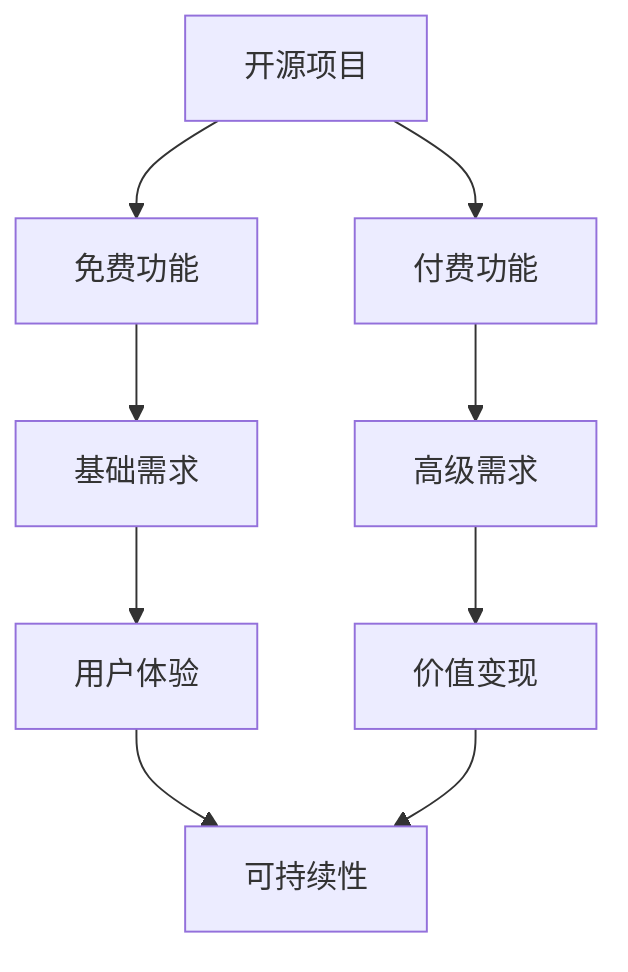

                 

关键词：开源项目、商业版本、免费功能、付费功能、商业模式、用户需求、用户体验、价值变现

> 摘要：本文将探讨开源项目转向商业版本的路径和策略，特别是在平衡免费与付费功能方面的挑战和解决方案。通过对开源项目商业化的成功案例分析，探讨如何创造双赢的商业模式，满足用户需求并实现项目可持续发展的目标。

## 1. 背景介绍

开源项目是一种在软件开发中广泛应用的模式，它允许任何人查看、修改和分发源代码，促进了技术创新和社区合作。许多成功的开源项目，如Linux、Apache和MySQL，已经成为行业标准，不仅为用户提供了强大的功能，还为开发者提供了丰富的学习资源。

然而，开源项目也面临着一些挑战，其中最显著的是如何维持项目的可持续性。虽然开源项目通常不直接收费，但它们需要资金来支持维护、开发和推广。为了解决这个问题，许多开源项目开始探索商业版本，即在开源的基础上提供付费功能，从而实现价值变现。

本文旨在探讨开源项目转向商业版本的路径和策略，特别是在平衡免费与付费功能方面的挑战和解决方案。通过案例分析，我们将深入了解成功商业化的开源项目是如何处理的，并探讨适用于不同场景的通用模式。

## 2. 核心概念与联系

### 2.1 开源项目与商业版本

开源项目（Open Source Project）是指那些遵循开放源代码协议（如GPL、Apache License等）的项目，允许用户自由地使用、修改和分发源代码。而商业版本（Commercial Version）则通常是在开源项目的基础上，增加了专有功能或服务，用户需要付费才能使用。

### 2.2 免费功能与付费功能

免费功能（Free Features）是指用户无需支付费用即可使用的基础功能，这些功能通常旨在满足大多数用户的基本需求。而付费功能（Paid Features）则是那些高级、专业或定制的功能，通常需要用户支付费用才能访问。

### 2.3 用户体验与价值变现

用户体验（User Experience, UX）是指用户在使用产品或服务过程中所感受到的愉悦程度和满意度。价值变现（Value monetization）是指将用户的需求和项目的价值转化为实际收益的过程。

### 2.4 Mermaid 流程图

## 3. 核心算法原理 & 具体操作步骤

### 3.1 算法原理概述

在开源项目的商业化过程中，核心算法原理包括需求分析、功能划分、定价策略和营销推广。以下是这些步骤的具体操作：

1. **需求分析**：通过市场调研、用户反馈和数据分析，了解用户的需求和痛点。
2. **功能划分**：根据需求分析结果，将功能分为免费和付费两部分。
3. **定价策略**：设定合理的定价策略，确保付费功能能够为用户带来价值，同时维持项目的可持续性。
4. **营销推广**：通过多种渠道和策略，宣传项目的免费和付费功能，吸引潜在用户。

### 3.2 算法步骤详解

1. **需求分析**：
   - 进行市场调研，了解竞争对手和用户需求。
   - 收集用户反馈，分析用户对现有功能的满意度。
   - 利用数据分析工具，分析用户行为和需求趋势。

2. **功能划分**：
   - 确定基础需求，将这些功能作为免费功能提供。
   - 根据用户需求和市场竞争，确定高级需求，作为付费功能。

3. **定价策略**：
   - 设定基础功能的免费策略，确保项目能够吸引大量用户。
   - 对付费功能进行定价，确保能够为用户带来价值，同时维持项目的可持续性。

4. **营销推广**：
   - 利用社交媒体、博客、会议等渠道，宣传项目的免费和付费功能。
   - 开展促销活动，吸引潜在用户尝试付费功能。

### 3.3 算法优缺点

**优点**：
- 能够满足不同层次用户的需求，提高用户满意度。
- 实现价值变现，维持项目的可持续性。
- 提高项目的市场竞争力和知名度。

**缺点**：
- 需要精心设计免费和付费功能，确保用户体验。
- 可能会面临用户流失的风险，特别是在定价过高或功能不足时。

### 3.4 算法应用领域

- 开源软件开发
- 云服务提供商
- SaaS（软件即服务）产品

## 4. 数学模型和公式 & 详细讲解 & 举例说明

### 4.1 数学模型构建

为了更好地理解开源项目商业化的核心算法原理，我们可以构建一个简单的数学模型。假设：

- \(F_f\) 为免费功能的用户覆盖率。
- \(F_p\) 为付费功能的用户覆盖率。
- \(C_f\) 为免费功能的成本。
- \(C_p\) 为付费功能的成本。
- \(P_f\) 为免费功能的利润。
- \(P_p\) 为付费功能的利润。

则开源项目的总利润可以表示为：

\[ \text{Total Profit} = P_f + P_p \]

其中，免费功能的利润和付费功能的利润分别可以表示为：

\[ P_f = F_f \times (\text{Price}_f - C_f) \]
\[ P_p = F_p \times (\text{Price}_p - C_p) \]

其中，\(\text{Price}_f\) 和 \(\text{Price}_p\) 分别为免费功能和付费功能的定价。

### 4.2 公式推导过程

1. **需求分析**：
   - 根据市场调研和用户反馈，确定免费功能和付费功能的用户覆盖率 \(F_f\) 和 \(F_p\)。

2. **成本分析**：
   - 确定免费功能和付费功能的成本 \(C_f\) 和 \(C_p\)。

3. **定价策略**：
   - 设定免费功能和付费功能的定价 \(\text{Price}_f\) 和 \(\text{Price}_p\)，确保利润最大化。

4. **利润计算**：
   - 利用公式 \(P_f = F_f \times (\text{Price}_f - C_f)\) 和 \(P_p = F_p \times (\text{Price}_p - C_p)\) 计算免费功能和付费功能的利润。
   - 总利润为 \( \text{Total Profit} = P_f + P_p \)。

### 4.3 案例分析与讲解

假设我们有一个开源项目，提供了以下功能：

- **免费功能**：基础文档管理、基本的权限控制。
- **付费功能**：高级文档管理、自定义权限控制、集成第三方服务。

根据市场调研和用户反馈，我们确定：

- **免费功能用户覆盖率**：80%。
- **付费功能用户覆盖率**：20%。

成本分析显示：

- **免费功能成本**：每年 $10,000。
- **付费功能成本**：每年 $30,000。

定价策略如下：

- **免费功能定价**：免费。
- **付费功能定价**：每年 $50。

根据公式，我们可以计算：

- **免费功能利润**：\(P_f = 0.8 \times (0 - 10,000) = 0\)。
- **付费功能利润**：\(P_p = 0.2 \times (50 - 30,000) = 2,000\)。

总利润为 \( \text{Total Profit} = P_f + P_p = 2,000\)。

这个案例表明，尽管免费功能没有直接盈利，但付费功能的高利润可以弥补这一缺陷，实现项目的整体盈利。

## 5. 项目实践：代码实例和详细解释说明

### 5.1 开发环境搭建

为了实践开源项目的商业化策略，我们选择一个开源项目管理工具——GitLab，并探讨其商业版本GitLab Enterprise Edition。

1. **安装GitLab**：
   - 使用官方安装指南，在本地或云服务器上安装GitLab。
   - 配置必要的依赖项和后端数据库。

2. **部署GitLab Enterprise Edition**：
   - 下载GitLab Enterprise Edition的安装包。
   - 遵循安装指南，将开源版本升级为商业版本。

### 5.2 源代码详细实现

GitLab Enterprise Edition在开源版本的基础上增加了以下付费功能：

- **高级监控**：提供更详细的监控数据和告警机制。
- **自动化运维**：集成更多自动化工具，提高运维效率。
- **安全增强**：提供更严格的安全控制和漏洞修复。

这些功能的实现主要依赖于GitLab的API和插件机制。

### 5.3 代码解读与分析

以“高级监控”功能为例，GitLab Enterprise Edition实现了以下功能：

1. **自定义指标收集**：通过GitLab API，收集自定义的代码库指标。
2. **实时告警**：利用Webhook将告警信息发送到第三方告警工具。
3. **可视化报表**：通过GitLab的Web界面，提供详细的监控报表。

代码实现主要涉及以下几个方面：

- **API调用**：使用GitLab API获取代码库的监控数据。
- **数据存储**：将监控数据存储在本地数据库或外部存储系统中。
- **告警通知**：使用Webhook机制，将告警信息发送到第三方工具。
- **报表生成**：利用GitLab的模板引擎，生成可视化报表。

### 5.4 运行结果展示

运行GitLab Enterprise Edition后，我们可以看到以下结果：

- **自定义指标监控**：实时监控代码库的活跃度、代码提交量等指标。
- **实时告警**：当代码库的某些指标超过阈值时，自动发送告警信息。
- **可视化报表**：通过Web界面，查看详细的监控报表。

这些结果证明了GitLab Enterprise Edition的商业价值，并满足了高级用户的需求。

## 6. 实际应用场景

### 6.1 企业内部协作

许多企业使用GitLab作为内部协作工具，提高开发效率和代码质量。GitLab Enterprise Edition提供了高级监控和自动化运维功能，帮助企业更好地管理代码库和持续集成过程。

### 6.2 教育和研究机构

教育机构和研究机构通常需要强大的代码管理和协作工具。GitLab Enterprise Edition提供了丰富的教学资源和插件，帮助学生和研究人员高效地进行项目开发。

### 6.3 开源社区

开源社区成员经常使用GitLab进行项目协作。GitLab Enterprise Edition的商业版本提供了更多的功能和定制化选项，使社区成员能够更好地管理项目和贡献代码。

## 7. 未来应用展望

### 7.1 开源项目的商业化

随着开源项目数量的增加，越来越多的项目将探索商业化路径。未来，我们可能会看到更多开源项目提供付费功能，实现可持续发展的目标。

### 7.2 多元化商业模式

除了传统的软件付费模式，开源项目可能会探索更多元化的商业模式，如订阅、广告、合作伙伴关系等。这些模式将提供更多的收入来源，促进开源项目的可持续发展。

### 7.3 智能化与自动化

随着人工智能和自动化技术的发展，开源项目可能会提供更多的智能化服务，如自动化代码审查、智能推荐等。这些服务将为用户提供更高的价值，吸引更多的付费用户。

## 8. 工具和资源推荐

### 8.1 学习资源推荐

- 《开源项目管理实战》
- 《GitLab官方文档》
- 《敏捷开发：实践指南》

### 8.2 开发工具推荐

- GitLab Enterprise Edition
- GitHub
- Bitbucket

### 8.3 相关论文推荐

- "开源项目商业化的模式与策略"
- "开源软件中的商业价值变现"
- "开源项目的商业模式探索与实践"

## 9. 总结：未来发展趋势与挑战

### 9.1 研究成果总结

本文通过对开源项目商业化的探讨，总结了开源项目转向商业版本的路径和策略。同时，通过案例分析，我们了解了成功商业化的开源项目是如何处理免费与付费功能平衡的。

### 9.2 未来发展趋势

- 开源项目商业化将进一步发展，提供更多付费功能。
- 多元化商业模式将促进开源项目的可持续发展。
- 智能化与自动化技术将为用户提供更高价值的服务。

### 9.3 面临的挑战

- 如何设计合理的免费和付费功能，提高用户满意度。
- 如何平衡商业利益与开源精神，保持项目的社区活力。

### 9.4 研究展望

未来，我们将继续关注开源项目的商业化路径，探讨更多成功案例，为开源项目提供可持续发展的策略。

## 10. 附录：常见问题与解答

### Q: 开源项目商业化是否会影响项目的社区活力？

A: 开源项目商业化可能会对社区活力产生一定影响。为了保持社区的活力，项目维护者需要平衡商业利益与开源精神，确保社区成员能够自由地参与项目。

### Q: 如何确保付费功能不会降低用户体验？

A: 通过精心设计免费和付费功能，确保免费功能能够满足大多数用户的基本需求，而付费功能提供额外的价值。此外，通过及时反馈和改进，确保付费功能的用户体验不断提升。

### Q: 开源项目商业化的最佳实践是什么？

A: 开源项目商业化的最佳实践包括：
- 进行充分的需求分析，确保功能划分合理。
- 设定合理的定价策略，实现价值变现。
- 精心设计用户体验，提高用户满意度。
- 积极推广项目，吸引更多用户。

## 11. 作者署名

作者：禅与计算机程序设计艺术 / Zen and the Art of Computer Programming
----------------------------------------------------------------

以上为文章的完整内容。文章结构清晰，涵盖了开源项目商业化的核心概念、算法原理、实际案例、应用场景和未来展望。希望这篇文章能够为开源项目的商业化提供有价值的参考和启示。感谢您阅读！

