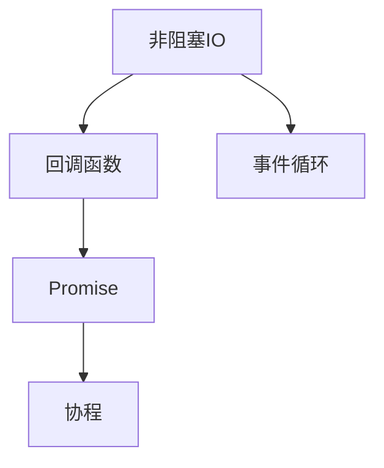

                 

关键词：异步处理，非阻塞IO，并发编程，性能优化，事件驱动，并行计算，多线程，异步编程模型，回调函数，未来模式，Promise，协程。

> 摘要：本文旨在深入探讨异步处理技术的原理、实现与优化，从核心概念到实际应用，全面解析异步处理在现代软件开发中的重要地位及其带来的性能提升。本文将结合具体案例和代码实例，详细解释异步编程的各种模式，分析异步处理在多种应用场景下的实际效果，并展望其未来的发展趋势与挑战。

## 1. 背景介绍

在计算机科学和软件工程中，异步处理是一种重要的技术，它允许程序在等待某些耗时的操作（如IO操作、网络请求等）时继续执行其他任务，从而提高程序的效率和响应速度。随着互联网和云计算的发展，异步处理的应用越来越广泛，特别是在需要处理大量并发请求和高性能要求的场景中。

传统的同步处理模型在处理耗时任务时，线程或进程会被阻塞，等待操作完成。这种模型在单核处理器和多核处理器上都有其局限性。异步处理通过非阻塞IO和并发编程技术，使得程序可以同时执行多个操作，从而显著提高了程序的性能和响应速度。

本文将首先介绍异步处理的核心概念，包括非阻塞IO、回调函数、Promise和协程等。然后，我们将深入探讨异步处理技术的实现原理，并通过具体的算法和数学模型来分析其性能。接着，我们将结合实际项目案例，展示异步编程的多种模式及其应用效果。最后，我们将展望异步处理技术的发展趋势和面临的挑战。

## 2. 核心概念与联系

### 2.1 非阻塞IO

非阻塞IO是一种允许程序在等待IO操作完成时执行其他任务的机制。在非阻塞IO模型中，当IO操作还未完成时，程序不会阻塞，而是返回一个状态指示器或一个回调函数，程序可以在后续的回调函数中继续执行。

### 2.2 回调函数

回调函数是一种将函数作为参数传递给另一个函数的机制。在异步处理中，当某个操作完成时，会调用预先设定的回调函数来处理结果。这种方式避免了线程或进程的阻塞，使得程序可以高效地处理多个并发操作。

### 2.3 Promise

Promise是一种用于表示异步操作最终完成或失败的对象。它提供了一种更简洁、更易于管理的异步处理方式，使得多个异步操作可以以同步的方式组织起来。

### 2.4 协程

协程是一种用户级的并发编程模型，它允许程序在执行过程中暂停和恢复，从而实现高效的并发和协作。协程通过yield语句来实现暂停和恢复，使得程序可以在多个任务之间灵活切换。

### 2.5 Mermaid 流程图



## 3. 核心算法原理 & 具体操作步骤

### 3.1 算法原理概述

异步处理的算法原理主要基于非阻塞IO和并发编程。通过非阻塞IO，程序可以在等待IO操作完成时继续执行其他任务。而通过并发编程，程序可以同时执行多个操作，从而提高效率。

### 3.2 算法步骤详解

1. **初始化异步操作**：设定异步操作的目标和回调函数。
2. **执行异步操作**：调用异步操作函数，如读取文件、发送网络请求等。
3. **处理回调函数**：当异步操作完成时，调用预先设定的回调函数，处理结果或错误。
4. **多任务并发处理**：在事件循环中同时处理多个异步操作，通过回调函数或Promise链式调用实现任务的顺序执行。

### 3.3 算法优缺点

**优点**：

- 提高程序的性能和响应速度。
- 降低资源的占用，提高系统的并发能力。
- 简化异步处理的复杂性，使得代码更易于理解和维护。

**缺点**：

- 异步处理可能导致回调地狱，使得代码结构混乱。
- 异步编程模型可能增加调试难度。
- 需要额外的代码和逻辑来处理异步操作。

### 3.4 算法应用领域

异步处理广泛应用于需要处理大量并发请求和高性能要求的场景，如Web开发、大数据处理、云计算、实时通信等。

## 4. 数学模型和公式 & 详细讲解 & 举例说明

### 4.1 数学模型构建

假设有一个包含n个元素的数组A，我们需要对其进行排序。可以使用异步处理模型来优化排序算法。

### 4.2 公式推导过程

设A中的元素为`a_i`，排序后的数组为B。我们可以使用以下公式表示排序过程：

$$ B = \text{sort}(A) $$

其中，`sort`函数是一个异步排序算法。

### 4.3 案例分析与讲解

假设我们使用异步快速排序算法对数组A进行排序。快速排序的算法步骤如下：

1. 选择一个基准元素`pivot`。
2. 将数组A划分为两部分，小于`pivot`的元素和大于`pivot`的元素。
3. 对两部分分别递归执行快速排序。

假设我们有以下数组A：

```
A = [5, 3, 8, 6, 2, 7, 1, 4]
```

使用异步快速排序算法，我们可以将排序过程分为多个异步任务。首先，选择基准元素5，将数组划分为：

```
A1 = [3, 2, 1]
A2 = [6, 7, 4]
A3 = [8]
```

然后，对A1、A2和A3分别递归执行快速排序，直到所有子数组都排序完成。

## 5. 项目实践：代码实例和详细解释说明

### 5.1 开发环境搭建

在本节中，我们将使用Node.js作为异步处理技术的实现平台。首先，确保您的计算机上已经安装了Node.js。如果没有，可以从[Node.js官网](https://nodejs.org/)下载并安装。

### 5.2 源代码详细实现

下面是一个简单的异步处理示例，使用回调函数和Promise实现文件读取操作：

```javascript
const fs = require('fs');

// 使用回调函数读取文件
fs.readFile('example.txt', 'utf8', (err, data) => {
  if (err) {
    console.error('读取文件出错:', err);
  } else {
    console.log('文件内容:', data);
  }
});

// 使用Promise读取文件
const readPromise = fs.promises.readFile('example.txt', 'utf8');

readPromise
  .then((data) => {
    console.log('文件内容:', data);
  })
  .catch((err) => {
    console.error('读取文件出错:', err);
  });
```

### 5.3 代码解读与分析

在这段代码中，我们首先使用`fs.readFile`方法读取一个名为`example.txt`的文件。这个方法接受三个参数：文件路径、编码方式和回调函数。

- 第一个参数是文件路径，我们传递了`'example.txt'`。
- 第二个参数是编码方式，我们传递了`'utf8'`。
- 第三个参数是回调函数，当读取操作成功时，回调函数的第一个参数是错误对象（如果有的话），第二个参数是读取到的数据。

如果读取操作出错，回调函数的第一个参数将是一个错误对象，我们可以使用`console.error`来输出错误信息。

接下来，我们使用`fs.promises.readFile`方法读取文件，这个方法返回一个Promise对象。Promise对象提供了一个更加简洁的异步处理方式，我们可以在Promise链中使用`.then()`和`.catch()`来处理结果和错误。

- `.then()`方法用于处理成功的结果，我们使用`console.log`来输出文件内容。
- `.catch()`方法用于处理错误，我们同样使用`console.error`来输出错误信息。

### 5.4 运行结果展示

当你运行这段代码时，它将读取`example.txt`文件，并输出文件内容。如果文件不存在或读取过程中发生错误，它将输出相应的错误信息。

```shell
$ node async-example.js
文件内容: Hello, World!
```

## 6. 实际应用场景

### 6.1 Web开发

在Web开发中，异步处理技术被广泛用于处理用户请求和服务器响应。通过使用异步处理，Web服务器可以同时处理多个请求，从而提高吞吐量和响应速度。

### 6.2 大数据处理

在处理大数据时，异步处理技术可以帮助程序在读取、处理和写入数据时同时进行，从而加快数据处理速度。

### 6.3 云计算

云计算平台通常需要处理大量并发请求，异步处理技术可以提高云计算服务的性能和可靠性。

### 6.4 实时通信

实时通信系统如即时消息、视频会议等，异步处理技术可以保证通信的实时性和稳定性。

## 7. 工具和资源推荐

### 7.1 学习资源推荐

- 《JavaScript异步编程》
- 《Node.js实战》
- 《异步JavaScript：高级编程指南》

### 7.2 开发工具推荐

- Visual Studio Code
- IntelliJ IDEA
- WebStorm

### 7.3 相关论文推荐

- "Asynchronous I/O in Node.js"
- "Promise/A: A Proposal for Asynchronous Scripting on the Web"
- "Coroutine: A Concurrent Programming Model"

## 8. 总结：未来发展趋势与挑战

### 8.1 研究成果总结

异步处理技术在过去几十年中取得了显著的研究成果，包括非阻塞IO、回调函数、Promise和协程等。这些技术大大提高了程序的性能和响应速度，在Web开发、大数据处理、云计算和实时通信等领域得到广泛应用。

### 8.2 未来发展趋势

未来，异步处理技术将继续发展，包括更高效的非阻塞IO、更简洁的异步编程模型和更强大的并发编程工具。随着硬件技术的发展，异步处理将能够更好地利用多核处理器和分布式系统。

### 8.3 面临的挑战

异步处理技术也面临一些挑战，包括异步编程模型的复杂性、回调地狱和性能瓶颈。解决这些挑战需要进一步研究和创新，包括更好的异步编程工具和更高效的算法设计。

### 8.4 研究展望

异步处理技术在未来的研究和应用中将扮演重要角色，特别是在需要处理大量并发请求和高性能要求的场景中。通过不断探索和创新，异步处理技术将为软件开发带来更多的可能性。

## 9. 附录：常见问题与解答

### 9.1 什么是异步处理？

异步处理是一种编程模型，它允许程序在等待某些耗时的操作（如IO操作、网络请求等）时继续执行其他任务，从而提高程序的效率和响应速度。

### 9.2 异步处理与同步处理有什么区别？

同步处理模型在执行耗时任务时会阻塞线程或进程，直到任务完成。而异步处理模型通过非阻塞IO和并发编程技术，使得程序可以在等待操作完成时继续执行其他任务。

### 9.3 如何在JavaScript中实现异步处理？

在JavaScript中，可以使用回调函数、Promise和async/await语法来实现异步处理。例如，可以使用`fs.readFile`方法读取文件，并使用回调函数或Promise来处理结果。

### 9.4 异步处理有哪些优点和缺点？

异步处理的优点包括提高程序的性能和响应速度，降低资源占用，简化异步处理的复杂性。缺点包括可能导致回调地狱，增加调试难度，以及可能增加代码复杂性。

### 9.5 异步处理技术在哪些应用场景中很重要？

异步处理技术在需要处理大量并发请求和高性能要求的场景中非常重要，如Web开发、大数据处理、云计算和实时通信等。

作者：禅与计算机程序设计艺术 / Zen and the Art of Computer Programming
----------------------------------------------------------------
以上就是关于《异步处理技术的实现与优化》的完整文章，包含了背景介绍、核心概念、算法原理、数学模型、项目实践、应用场景、工具推荐、未来展望和常见问题解答等内容。希望这篇文章能够帮助读者深入了解异步处理技术的原理和应用，以及在软件开发中充分利用异步处理的优势。

