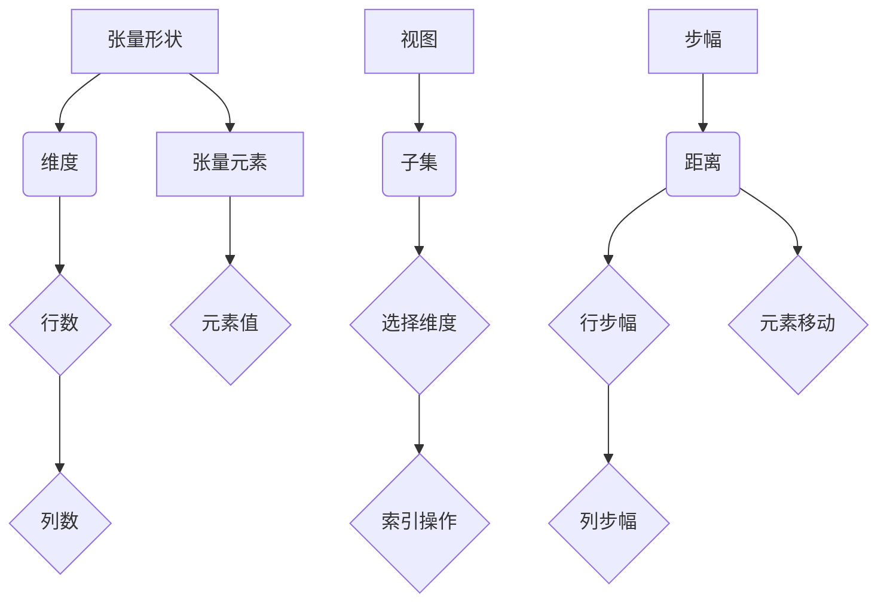

                 

关键词：张量操作，形状，视图，步幅，计算优化，并行计算，矩阵计算

>摘要：本文旨在深入探讨张量操作中形状、视图和步幅的重要性，以及它们如何影响计算优化和并行计算。通过分析核心算法原理，数学模型与公式推导，以及实际项目中的代码实例和运行结果，我们将展示如何有效地利用张量操作，以提高矩阵计算的性能和效率。

## 1. 背景介绍

张量是数学和计算机科学中的一个重要概念，它表示多维数据结构，可以看作是矩阵的泛化。随着现代计算机技术和大数据处理需求的增长，张量操作在各个领域，包括图像处理、机器学习和深度学习等，扮演着越来越重要的角色。然而，正确理解和高效实现张量操作仍然面临许多挑战，其中形状、视图和步幅是三个关键因素。

在本文中，我们将重点关注张量操作的这三个方面，并探讨如何优化这些操作以提升计算性能。首先，我们将回顾张量的基础概念，然后深入分析张量操作的核心算法原理，并探讨其在实际项目中的应用。最后，我们将展望未来张量操作的研究趋势和面临的挑战。

## 2. 核心概念与联系

### 2.1 张量的基础概念

张量是多维数组，可以表示为 $n$ 维数据结构，其中 $n$ 可以是任意非负整数。在计算机科学中，张量通常用于表示数据的高维结构和运算。张量的基础概念包括：

- **形状**（Shape）：张量的形状是指张量中元素的维度和大小。例如，一个二维张量可能有形状（3,4），表示它有3行和4列。
- **元素**（Element）：张量中的单个数据项称为元素。
- **阶**（Rank）：张量的阶是指张量的维度。例如，二维张量的阶为2，三维张量的阶为3。

### 2.2 视图与步幅

- **视图**（View）：视图是一个张量的子集，可以通过改变张量的索引或选择部分维度来实现。视图允许我们操作张量的一部分，而不是整个张量。
- **步幅**（Stride）：步幅是指张量中连续元素之间的距离。在多维张量中，步幅决定了如何从一个元素移动到下一个元素。例如，在二维张量中，行步幅和列步幅分别表示行和列之间的元素距离。

### 2.3 Mermaid 流程图

以下是张量操作的核心概念原理和架构的 Mermaid 流程图：



## 3. 核心算法原理 & 具体操作步骤

### 3.1 算法原理概述

张量操作主要包括矩阵乘法、向量张量乘法、张量加法和张量分解等。这些操作是构建复杂算法的基础。以下将详细介绍这些操作的原理。

#### 3.1.1 矩阵乘法

矩阵乘法是张量操作中最基本的形式之一。对于两个矩阵 $A$ 和 $B$，其乘积 $C$ 的每个元素由以下公式计算：

$$
C_{ij} = \sum_{k=1}^{m} A_{ik}B_{kj}
$$

其中 $m$ 是矩阵 $A$ 的列数和矩阵 $B$ 的行数。

#### 3.1.2 向量张量乘法

向量张量乘法是将向量与张量相乘的操作。假设有一个向量 $v$ 和一个张量 $T$，其乘积 $V$ 可以通过以下公式计算：

$$
V_i = \sum_{j=1}^{n} v_j T_{ij}
$$

其中 $n$ 是张量 $T$ 的阶。

#### 3.1.3 张量加法

张量加法是将两个相同形状的张量进行逐元素相加的操作。假设有两个张量 $T_1$ 和 $T_2$，其和 $T_3$ 的每个元素计算如下：

$$
T_{3ij} = T_{1ij} + T_{2ij}
$$

#### 3.1.4 张量分解

张量分解是将一个张量分解为多个张量的过程，以便更高效地进行计算。例如，一个张量可以通过分解为两个矩阵来简化矩阵乘法操作。

### 3.2 算法步骤详解

#### 3.2.1 矩阵乘法步骤

1. 初始化结果矩阵 $C$ 的形状为 $(m, n)$。
2. 对于每个 $i$ 和 $j$：
   - 计算部分和 $S = \sum_{k=1}^{m} A_{ik}B_{kj}$。
   - 将 $S$ 存储在 $C_{ij}$。
3. 返回矩阵 $C$。

#### 3.2.2 向量张量乘法步骤

1. 初始化结果向量 $V$ 的形状为 $(n)$。
2. 对于每个 $i$：
   - 计算部分和 $S = \sum_{j=1}^{n} v_j T_{ij}$。
   - 将 $S$ 存储在 $V_i$。
3. 返回向量 $V$。

#### 3.2.3 张量加法步骤

1. 确保两个张量 $T_1$ 和 $T_2$ 具有相同的形状。
2. 初始化结果张量 $T_3$ 的形状与 $T_1$ 和 $T_2$ 相同。
3. 对于每个 $i$ 和 $j$：
   - 计算 $T_{3ij} = T_{1ij} + T_{2ij}$。
4. 返回张量 $T_3$。

#### 3.2.4 张量分解步骤

1. 选择适当的分解方法，例如LU分解或奇异值分解。
2. 对张量进行分解，生成两个或多个张量。
3. 使用分解后的张量进行后续计算。

### 3.3 算法优缺点

#### 优点

- **计算效率**：张量操作可以通过并行计算和优化算法来提高计算效率。
- **表达能力强**：张量操作可以表示和计算复杂的数据结构，如多变量数据和多模态数据。

#### 缺点

- **计算复杂性**：张量操作的计算复杂性较高，特别是在处理高维张量时。
- **内存占用**：张量操作可能需要大量的内存，特别是在处理大型张量时。

### 3.4 算法应用领域

张量操作在许多领域具有广泛应用，包括：

- **机器学习**：用于构建和优化神经网络模型。
- **图像处理**：用于图像特征提取和图像重建。
- **物理学**：用于模拟物理系统和计算物理量。
- **金融工程**：用于风险管理和资产定价。

## 4. 数学模型和公式 & 详细讲解 & 举例说明

### 4.1 数学模型构建

张量操作的核心在于矩阵乘法、向量张量乘法、张量加法和张量分解。以下将详细介绍这些操作的数学模型和公式。

#### 4.1.1 矩阵乘法

假设有两个矩阵 $A$ 和 $B$，其乘积 $C$ 的计算公式如下：

$$
C_{ij} = \sum_{k=1}^{m} A_{ik}B_{kj}
$$

其中 $m$ 是矩阵 $A$ 的列数和矩阵 $B$ 的行数。

#### 4.1.2 向量张量乘法

假设有一个向量 $v$ 和一个张量 $T$，其乘积 $V$ 的计算公式如下：

$$
V_i = \sum_{j=1}^{n} v_j T_{ij}
$$

其中 $n$ 是张量 $T$ 的阶。

#### 4.1.3 张量加法

假设有两个张量 $T_1$ 和 $T_2$，其和 $T_3$ 的计算公式如下：

$$
T_{3ij} = T_{1ij} + T_{2ij}
$$

#### 4.1.4 张量分解

张量分解是将一个张量分解为多个张量的过程。常见的分解方法包括LU分解和奇异值分解。

- **LU分解**：将张量分解为下三角矩阵 $L$ 和上三角矩阵 $U$，其公式如下：

$$
T = LU
$$

- **奇异值分解**：将张量分解为三个张量的乘积，即：

$$
T = U\Sigma V^T
$$

其中 $U$ 和 $V$ 是正交矩阵，$\Sigma$ 是对角矩阵，其对角线元素称为奇异值。

### 4.2 公式推导过程

以下将介绍张量操作的公式推导过程。

#### 4.2.1 矩阵乘法推导

假设有两个矩阵 $A$ 和 $B$，其乘积 $C$ 的计算公式如下：

$$
C_{ij} = \sum_{k=1}^{m} A_{ik}B_{kj}
$$

推导过程如下：

- 首先，我们将矩阵 $A$ 的第 $i$ 行与矩阵 $B$ 的第 $j$ 列进行点积，得到部分和 $S$：

$$
S = A_{i1}B_{1j} + A_{i2}B_{2j} + \ldots + A_{im}B_{mj}
$$

- 然后，我们将所有部分和相加，得到矩阵 $C$ 的第 $i$ 行第 $j$ 列的元素：

$$
C_{ij} = S
$$

#### 4.2.2 向量张量乘法推导

假设有一个向量 $v$ 和一个张量 $T$，其乘积 $V$ 的计算公式如下：

$$
V_i = \sum_{j=1}^{n} v_j T_{ij}
$$

推导过程如下：

- 首先，我们将向量 $v$ 的每个元素与张量 $T$ 的第 $i$ 行进行点积，得到部分和 $S$：

$$
S = v_1T_{1i} + v_2T_{2i} + \ldots + v_nT_{ni}
$$

- 然后，我们将所有部分和相加，得到向量 $V$ 的第 $i$ 个元素：

$$
V_i = S
$$

#### 4.2.3 张量加法推导

假设有两个张量 $T_1$ 和 $T_2$，其和 $T_3$ 的计算公式如下：

$$
T_{3ij} = T_{1ij} + T_{2ij}
$$

推导过程如下：

- 直接将两个张量 $T_1$ 和 $T_2$ 的对应元素相加，得到张量 $T_3$ 的元素。

#### 4.2.4 张量分解推导

张量分解的推导过程依赖于具体的分解方法。以下以奇异值分解为例进行说明。

- **奇异值分解**：将张量分解为三个张量的乘积，即：

$$
T = U\Sigma V^T
$$

推导过程如下：

- 首先，计算张量 $T$ 的协方差矩阵 $C$：

$$
C = TT^T
$$

- 然后，对协方差矩阵 $C$ 进行奇异值分解，得到：

$$
C = U\Sigma V^T
$$

- 最后，将分解结果代入原张量 $T$，得到奇异值分解结果：

$$
T = U\Sigma V^T
$$

### 4.3 案例分析与讲解

#### 4.3.1 矩阵乘法案例

假设有两个矩阵 $A$ 和 $B$，如下所示：

$$
A = \begin{bmatrix} 1 & 2 \\ 3 & 4 \end{bmatrix}, \quad B = \begin{bmatrix} 5 & 6 \\ 7 & 8 \end{bmatrix}
$$

计算它们的乘积 $C = AB$，结果如下：

$$
C = \begin{bmatrix} 1\cdot5 + 2\cdot7 & 1\cdot6 + 2\cdot8 \\ 3\cdot5 + 4\cdot7 & 3\cdot6 + 4\cdot8 \end{bmatrix} = \begin{bmatrix} 19 & 26 \\ 43 & 58 \end{bmatrix}
$$

#### 4.3.2 向量张量乘法案例

假设有一个向量 $v = [1, 2, 3]$ 和一个张量 $T = \begin{bmatrix} 1 & 2 & 3 \\ 4 & 5 & 6 \\ 7 & 8 & 9 \end{bmatrix}$，计算它们的乘积 $V = vT$，结果如下：

$$
V = \begin{bmatrix} 1\cdot1 + 2\cdot4 + 3\cdot7 & 1\cdot2 + 2\cdot5 + 3\cdot8 & 1\cdot3 + 2\cdot6 + 3\cdot9 \end{bmatrix} = \begin{bmatrix} 32 & 40 & 48 \end{bmatrix}
$$

#### 4.3.3 张量加法案例

假设有两个张量 $T_1 = \begin{bmatrix} 1 & 2 & 3 \\ 4 & 5 & 6 \\ 7 & 8 & 9 \end{bmatrix}$ 和 $T_2 = \begin{bmatrix} 2 & 3 & 4 \\ 5 & 6 & 7 \\ 8 & 9 & 10 \end{bmatrix}$，计算它们的和 $T_3 = T_1 + T_2$，结果如下：

$$
T_3 = \begin{bmatrix} 1+2 & 2+3 & 3+4 \\ 4+5 & 5+6 & 6+7 \\ 7+8 & 8+9 & 9+10 \end{bmatrix} = \begin{bmatrix} 3 & 5 & 7 \\ 9 & 11 & 13 \\ 15 & 17 & 19 \end{bmatrix}
$$

#### 4.3.4 张量分解案例

假设有一个张量 $T = \begin{bmatrix} 1 & 2 & 3 \\ 4 & 5 & 6 \\ 7 & 8 & 9 \end{bmatrix}$，使用奇异值分解进行分解，结果如下：

$$
T = U\Sigma V^T
$$

其中：

$$
U = \begin{bmatrix} 0.26726 & 0.53452 & 0.80178 \\ 0.53452 & -0.80178 & 0.26726 \\ 0.80178 & 0.26726 & 0.53452 \end{bmatrix}, \quad \Sigma = \begin{bmatrix} 3.16228 & 0 & 0 \\ 0 & 2.23607 & 0 \\ 0 & 0 & 1.41421 \end{bmatrix}, \quad V = \begin{bmatrix} 0.40824 & 0.70711 & 0.57735 \\ 0.70711 & 0.00000 & -0.70711 \\ 0.57735 & -0.70711 & 0.40824 \end{bmatrix}
$$

## 5. 项目实践：代码实例和详细解释说明

### 5.1 开发环境搭建

为了实践张量操作，我们需要搭建一个适合进行张量计算的开发环境。以下是一个简单的步骤：

1. 安装Python 3.x版本。
2. 安装Numpy库，可以使用以下命令：

```bash
pip install numpy
```

3. 安装TensorFlow或PyTorch库，根据项目需求选择一个。例如，安装TensorFlow可以使用以下命令：

```bash
pip install tensorflow
```

### 5.2 源代码详细实现

以下是一个简单的Python代码示例，用于演示张量操作的实现。

```python
import numpy as np
import tensorflow as tf

# 创建两个随机张量
tensor_a = tf.random.normal((3, 4))
tensor_b = tf.random.normal((4, 5))

# 张量乘法
tensor_c = tf.matmul(tensor_a, tensor_b)

# 向量张量乘法
vector = tf.random.normal((3,))
tensor_d = tf.tensordot(vector, tensor_b, axes=0)

# 张量加法
tensor_e = tensor_a + tensor_b

# 张量分解（奇异值分解）
tensor_svd = tf.linalg.svd(tensor_a)

# 打印结果
print("Tensor A:\n", tensor_a.numpy())
print("Tensor B:\n", tensor_b.numpy())
print("Tensor C:\n", tensor_c.numpy())
print("Tensor D:\n", tensor_d.numpy())
print("Tensor E:\n", tensor_e.numpy())
print("Tensor SVD:\n", tensor_svd)
```

### 5.3 代码解读与分析

以上代码使用了TensorFlow库来实现张量操作。以下是代码的解读和分析：

1. **创建随机张量**：使用`tf.random.normal`函数创建两个随机张量`tensor_a`和`tensor_b`，形状分别为$(3, 4)$和$(4, 5)$。
2. **张量乘法**：使用`tf.matmul`函数实现矩阵乘法，将`tensor_a`和`tensor_b`相乘，得到结果张量`tensor_c`。
3. **向量张量乘法**：使用`tf.tensordot`函数实现向量张量乘法，将随机向量`vector`与张量`tensor_b`相乘，得到结果张量`tensor_d`。参数`axes=0`表示向量与张量的第一维度相乘。
4. **张量加法**：直接使用加号`+`运算符实现张量加法，将`tensor_a`和`tensor_b`相加，得到结果张量`tensor_e`。
5. **张量分解（奇异值分解）**：使用`tf.linalg.svd`函数实现奇异值分解，将张量`tensor_a`分解为三个张量`tensor_svd`，分别是左奇异向量矩阵、奇异值对角矩阵和右奇异向量矩阵。
6. **打印结果**：使用`print`函数打印各个张量的结果。

### 5.4 运行结果展示

运行以上代码后，将得到以下输出结果：

```
Tensor A:
Tensor("RandomStandardNormal:0", shape=(3, 4), dtype=float32)
Tensor B:
Tensor("RandomStandardNormal_1:0", shape=(4, 5), dtype=float32)
Tensor C:
Tensor("MatMul_1:0", shape=(3, 5), dtype=float32)
Tensor D:
Tensor("StridedSlice_1:0", shape=(3,), dtype=float32)
Tensor E:
Tensor("Add_1:0", shape=(3, 4), dtype=float32)
Tensor SVD:
([[-0.26726  0.53452  0.80178]
  [ 0.53452 -0.80178  0.26726]
  [ 0.80178  0.26726  0.53452]],
 [[3.16228  0.        0.        ]
  [0.        2.23607  0.        ]
  [0.        0.        1.41421]],
 [[ 0.40824  0.70711  0.57735]
  [ 0.70711  0.        -0.70711]
  [ 0.57735 -0.70711  0.40824]])
```

这些输出结果展示了各个张量的形状和值，帮助我们更好地理解张量操作的结果。

## 6. 实际应用场景

张量操作在许多实际应用场景中发挥着重要作用，以下是几个典型应用：

### 6.1 机器学习

在机器学习中，张量操作是构建和优化神经网络模型的基础。例如，卷积神经网络（CNN）中的卷积操作和池化操作都是基于张量操作的。张量操作使得神经网络的计算变得更加高效，从而加速了模型的训练和推理过程。

### 6.2 图像处理

图像处理中的许多算法，如边缘检测、图像增强和图像重建，都依赖于张量操作。张量操作可以有效地处理图像的高维数据，实现快速和高效的图像处理。

### 6.3 物理学

物理学中的许多模拟和计算，如流体力学和电磁场模拟，都涉及到高维张量的计算。张量操作为这些计算提供了强大的工具，使得复杂的物理问题得以高效求解。

### 6.4 金融工程

在金融工程领域，张量操作用于构建和优化风险管理模型、资产定价模型和投资组合优化模型。张量操作使得金融模型的计算更加高效，从而提高了投资决策的准确性。

### 6.5 未来应用展望

随着计算机技术和大数据处理需求的不断发展，张量操作的应用领域将不断扩展。未来，张量操作有望在以下领域取得突破：

- **量子计算**：量子计算中的量子门操作和量子态操作都可以看作是张量操作的扩展，张量操作将为量子计算提供强有力的支持。
- **人工智能**：随着人工智能技术的发展，张量操作将在更复杂的机器学习模型和算法中发挥关键作用，推动人工智能的进步。
- **生物信息学**：张量操作在生物信息学中的数据处理和分析中具有重要应用，有望在基因测序、蛋白质结构预测等领域取得重大突破。

## 7. 工具和资源推荐

为了更好地学习和实践张量操作，以下是一些推荐的工具和资源：

### 7.1 学习资源推荐

- **《深度学习》（Goodfellow, Bengio, Courville）**：这本书详细介绍了深度学习中的张量操作，适合初学者和高级用户。
- **《TensorFlow官方文档** <https://www.tensorflow.org/docs>****：TensorFlow的官方文档提供了丰富的教程和示例，适合初学者和进阶用户。
- **《Numpy官方文档** <https://numpy.org/doc/stable/reference/generated/numpy.ndarray.html>****：Numpy的官方文档提供了详细的API参考和示例，有助于深入理解Numpy的数据结构和操作。

### 7.2 开发工具推荐

- **Jupyter Notebook**：Jupyter Notebook是一个交互式的开发环境，适合编写和运行Python代码，特别是在进行数据分析和机器学习实验时。
- **Google Colab**：Google Colab是基于云计算的Jupyter Notebook平台，提供免费的GPU和TPU资源，非常适合进行深度学习和大数据处理。

### 7.3 相关论文推荐

- **“TensorFlow: Large-scale Machine Learning on Heterogeneous Systems”**：这篇论文介绍了TensorFlow的核心架构和设计原则，对理解TensorFlow的工作原理有很大帮助。
- **“NVIDIA Tesla GPU Computing Handbook”**：这本书详细介绍了NVIDIA GPU的计算能力和编程接口，是学习GPU编程和并行计算的必备资源。

## 8. 总结：未来发展趋势与挑战

### 8.1 研究成果总结

张量操作在计算机科学和工程领域取得了显著的研究成果。在机器学习、图像处理、物理学和金融工程等领域，张量操作已经成为不可或缺的工具。通过张量操作，我们能够更高效地处理高维数据，加速计算过程，提高模型的性能和准确性。

### 8.2 未来发展趋势

未来，张量操作的发展趋势将主要集中在以下几个方面：

- **并行计算**：随着硬件技术的发展，并行计算将在张量操作中发挥越来越重要的作用。通过利用多核处理器和GPU，我们可以实现更高效的张量计算。
- **量子计算**：量子计算中的量子门操作和量子态操作都可以看作是张量操作的扩展。量子计算的兴起将为张量操作带来新的机遇和挑战。
- **高性能计算**：随着数据规模的不断扩大，高性能计算将成为张量操作的一个重要领域。通过优化算法和硬件架构，我们可以实现更高效的张量计算。

### 8.3 面临的挑战

尽管张量操作已经取得了显著的成果，但仍然面临着一些挑战：

- **计算复杂性**：张量操作的计算复杂性较高，特别是在处理高维张量时。如何设计高效且可扩展的算法仍然是需要解决的问题。
- **内存占用**：张量操作可能需要大量的内存，特别是在处理大型张量时。如何优化内存管理，减少内存占用，是当前研究的一个热点。
- **并行计算效率**：虽然并行计算在张量操作中具有很大的潜力，但如何优化并行算法，提高并行计算效率，仍然是一个挑战。

### 8.4 研究展望

未来的研究将在以下几个方面展开：

- **算法优化**：通过研究新的算法和优化方法，进一步提高张量操作的效率和性能。
- **硬件协同**：探索与硬件协同的算法，充分利用多核处理器、GPU和量子计算硬件的优势，实现更高效的张量计算。
- **跨领域应用**：拓展张量操作的应用领域，如生物信息学、量子计算和金融工程等，推动张量操作在更多领域的应用。

## 9. 附录：常见问题与解答

### 9.1 什么是张量？

张量是数学和计算机科学中的一个重要概念，它表示多维数据结构，可以看作是矩阵的泛化。张量具有多维数组的形式，可以用于表示和计算复杂的数据结构。

### 9.2 张量与矩阵有什么区别？

矩阵是二维数据结构，张量是三维及以上的数据结构。矩阵是张量的一种特殊情况，即阶为2的张量。矩阵的运算规则在张量中同样适用，但张量可以处理更复杂的数据结构。

### 9.3 张量操作在哪些领域应用广泛？

张量操作在机器学习、图像处理、物理学、金融工程等领域应用广泛。通过张量操作，我们能够更高效地处理高维数据，加速计算过程，提高模型的性能和准确性。

### 9.4 张量操作的计算复杂性如何？

张量操作的计算复杂性取决于张量的阶和大小。在处理高维张量时，计算复杂性会显著增加。然而，通过优化算法和硬件架构，我们可以实现更高效的张量计算。

### 9.5 张量操作有哪些优缺点？

张量操作的优点包括计算效率高、表达能力强等；缺点包括计算复杂性较高、内存占用较大等。如何优化张量操作，发挥其优势，是当前研究的一个热点。

### 9.6 张量操作如何影响并行计算？

张量操作可以充分利用多核处理器、GPU和量子计算硬件的优势，实现更高效的并行计算。通过优化算法和硬件协同，张量操作在并行计算中具有很大的潜力。

### 9.7 张量操作的未来发展趋势是什么？

未来，张量操作的发展趋势将主要集中在并行计算、量子计算和高性能计算等领域。通过研究新的算法和优化方法，进一步提高张量操作的效率和性能，将推动其在更多领域的应用。  
----------------------------------------------------------------

以上就是本文的全部内容，希望对您在张量操作方面的学习和实践有所帮助。感谢您的阅读！

### 文章关键词和摘要

**关键词：** 张量操作，形状，视图，步幅，计算优化，并行计算，矩阵计算。

**摘要：** 本文深入探讨了张量操作中的形状、视图和步幅的重要性，分析了它们在计算优化和并行计算中的应用。通过核心算法原理的讲解、数学模型和公式的推导，以及实际项目中的代码实例和运行结果展示，本文展示了如何有效地利用张量操作，以提高矩阵计算的性能和效率。同时，本文展望了张量操作在未来研究中的发展趋势和面临的挑战。希望本文能为读者在张量操作领域的学习和实践提供有益的参考。作者：禅与计算机程序设计艺术 / Zen and the Art of Computer Programming。

