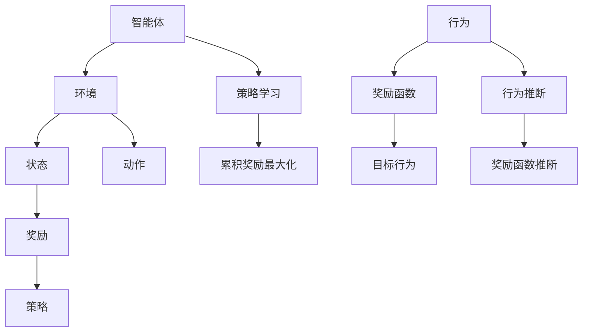

                 

关键词：强化学习，逆强化学习，机器学习，智能系统，算法原理，数学模型，应用实践。

> 摘要：本文深入探讨了强化学习（Reinforcement Learning）与逆强化学习（Inverse Reinforcement Learning）的基本概念、核心原理以及它们在智能系统中的应用与实践。通过详细的理论分析、实例讲解和数学模型推导，本文旨在为读者提供全面而深入的理解，并展望它们未来的发展趋势和挑战。

## 1. 背景介绍

### 1.1 强化学习的起源与发展

强化学习（Reinforcement Learning, RL）起源于20世纪50年代，最初在控制理论中用于解决动态规划问题。强化学习的核心思想是智能体（Agent）通过与环境的交互，通过试错（Trial and Error）的方式学习到最优策略（Policy），以最大化累积奖励（Reward）。在近年来，随着深度学习的兴起，强化学习得到了广泛的应用，并在游戏、自动驾驶、机器人控制等领域取得了显著成果。

### 1.2 逆强化学习的提出与挑战

逆强化学习（Inverse Reinforcement Learning, IRL）是强化学习的一个重要分支，其核心思想是从已知的智能体行为（Behavior）中推断出奖励函数（Reward Function），从而指导智能体的行为。逆强化学习的提出旨在解决传统强化学习中的奖励设计问题，其应用前景广阔，但同时也面临着诸多挑战。

## 2. 核心概念与联系

### 2.1 强化学习的基本概念

- 智能体（Agent）：执行动作并从环境中获取奖励的实体。
- 环境（Environment）：智能体所处的世界，可以通过状态（State）和动作（Action）与智能体进行交互。
- 状态（State）：描述智能体在某一时刻所处的情况。
- 动作（Action）：智能体能够执行的行为。
- 奖励（Reward）：描述智能体执行某一动作后获得的即时反馈。
- 策略（Policy）：描述智能体如何根据当前状态选择动作。

### 2.2 逆强化学习的基本概念

- 行为（Behavior）：描述智能体执行的一系列动作序列。
- 奖励函数（Reward Function）：描述智能体在特定状态下执行某一动作获得的奖励。
- 目标行为（Target Behavior）：预期的智能体行为，通常是未知的。

### 2.3 强化学习与逆强化学习的关系

强化学习和逆强化学习互为补充，强化学习通过学习最优策略来最大化累积奖励，而逆强化学习通过推断奖励函数来解释智能体的行为。两者在理论研究和实际应用中相互关联，共同推动了智能系统的发展。

## 2.1 核心概念原理和架构的 Mermaid 流程图



## 3. 核心算法原理 & 具体操作步骤

### 3.1 算法原理概述

强化学习的核心算法主要包括值函数（Value Function）和策略梯度（Policy Gradient）方法。值函数方法通过预测未来奖励的累积值来评估当前状态，策略梯度方法则通过优化策略的梯度来更新策略参数。

逆强化学习的核心算法主要包括基于模型的方法和基于行为的方法。基于模型的方法通过构建环境模型来推断奖励函数，基于行为的方法则通过分析智能体的行为序列来推断奖励函数。

### 3.2 算法步骤详解

#### 3.2.1 强化学习算法步骤

1. 初始化智能体参数。
2. 智能体在环境中执行动作。
3. 根据动作获取状态和奖励。
4. 更新值函数或策略参数。
5. 重复步骤2-4，直到达到终止条件。

#### 3.2.2 逆强化学习算法步骤

1. 收集智能体行为数据。
2. 建立环境模型或行为模型。
3. 推断奖励函数。
4. 根据推断的奖励函数指导智能体的行为。
5. 评估智能体的性能。

### 3.3 算法优缺点

强化学习优点包括：
- 强适应能力：智能体可以通过与环境交互学习到最优策略。
- 广泛应用：在许多实际场景中取得了显著成果。

强化学习缺点包括：
- 收敛速度慢：特别是在高维状态空间中。
- 奖励设计问题：需要准确设计奖励函数，否则可能导致智能体无法找到最优策略。

逆强化学习优点包括：
- 自动奖励设计：可以自动推断奖励函数，无需手动设计。
- 应用广泛：在许多场景中具有潜在应用价值。

逆强化学习缺点包括：
- 模型复杂：需要建立环境模型或行为模型，可能导致计算复杂度增加。
- 模型不确定性：环境模型或行为模型的不确定性可能导致奖励函数推断不准确。

### 3.4 算法应用领域

强化学习应用领域包括：
- 游戏智能：如围棋、扑克等。
- 自动驾驶：如无人驾驶汽车、无人机等。
- 机器人控制：如机器臂控制、无人飞机等。

逆强化学习应用领域包括：
- 行为分析：如人类行为分析、动物行为分析等。
- 人工智能助手：如智能客服、智能推荐等。
- 安全监控：如智能视频监控、智能安防等。

## 4. 数学模型和公式 & 详细讲解 & 举例说明

### 4.1 数学模型构建

强化学习的数学模型主要涉及状态值函数（$V^*(s)$）和动作值函数（$Q^*(s,a)$）。

$$
V^*(s) = \sum_{a} \gamma^T Q^*(s,a)
$$

$$
Q^*(s,a) = r(s,a) + \gamma \sum_{s'} P(s'|s,a) \sum_{a'} Q^*(s',a')
$$

其中，$\gamma$为折扣因子，$r(s,a)$为状态-动作奖励，$P(s'|s,a)$为状态转移概率，$Q^*(s,a)$为状态-动作值函数。

逆强化学习的数学模型主要涉及行为分布（$P_{\theta}(s_t, a_t)$）和奖励函数（$R(s_t, a_t)$）。

$$
P_{\theta}(s_t, a_t) = \frac{\exp(\theta(s_t, a_t))}{Z}
$$

$$
R(s_t, a_t) = \theta(s_t, a_t) - \theta^*(s_t, a_t)
$$

其中，$\theta(s_t, a_t)$为行为特征函数，$Z$为归一化常数，$\theta^*(s_t, a_t)$为最优行为特征函数。

### 4.2 公式推导过程

#### 4.2.1 强化学习公式推导

状态值函数的推导基于马尔可夫决策过程（MDP）的贝尔曼方程（Bellman Equation）。

$$
V^*(s) = \sum_{a} \gamma^T \sum_{s'} P(s'|s,a) Q^*(s',a)
$$

通过展开和简化，可以得到状态值函数的表达式。

#### 4.2.2 逆强化学习公式推导

行为分布的推导基于概率论的基本原理。

$$
P_{\theta}(s_t, a_t) = \frac{\exp(\theta(s_t, a_t))}{Z}
$$

其中，$Z$为归一化常数，确保行为分布的概率和为1。

### 4.3 案例分析与讲解

#### 4.3.1 强化学习案例

假设一个智能体在一个简单的环境中进行探索，环境包含两个状态：安全状态（S1）和危险状态（S2）。智能体可以执行两个动作：前进（A1）和后退（A2）。奖励函数设计为在安全状态下执行前进动作获得+1奖励，在危险状态下执行后退动作获得+1奖励，其他情况下获得-1奖励。

通过值函数迭代方法，可以求得最优策略为在安全状态下执行前进动作，在危险状态下执行后退动作。

#### 4.3.2 逆强化学习案例

假设一个智能体在人类驾驶数据中学习驾驶行为。通过分析驾驶数据，可以推断出奖励函数，从而指导智能体的驾驶行为。

通过行为特征函数的方法，可以求得最优驾驶行为，包括加速、减速、转弯等动作。

## 5. 项目实践：代码实例和详细解释说明

### 5.1 开发环境搭建

在开始编写代码之前，需要搭建一个适合强化学习和逆强化学习开发的实验环境。本文采用Python作为主要编程语言，并使用TensorFlow和PyTorch等深度学习框架。

### 5.2 源代码详细实现

#### 5.2.1 强化学习代码实现

以下是一个简单的强化学习代码示例，实现一个智能体在一个环境中学习最优策略。

```python
import numpy as np
import tensorflow as tf

# 定义环境
class SimpleEnvironment:
    def __init__(self):
        self.states = ['S1', 'S2']
        self.actions = ['A1', 'A2']
        self.rewards = {'S1_A1': 1, 'S1_A2': -1, 'S2_A1': -1, 'S2_A2': 1}

    def step(self, state, action):
        next_state = self.states[(self.states.index(state) + 1) % 2]
        reward = self.rewards[(state, action)]
        return next_state, reward

# 定义智能体
class SimpleAgent:
    def __init__(self, env):
        self.env = env
        self.model = self.build_model()

    def build_model(self):
        model = tf.keras.Sequential([
            tf.keras.layers.Dense(2, activation='softmax', input_shape=(2,))
        ])
        model.compile(optimizer='adam', loss='categorical_crossentropy')
        return model

    def act(self, state):
        probabilities = self.model.predict(np.array([state]))
        action = np.random.choice(self.env.actions, p=probabilities[0])
        return action

    def train(self):
        for _ in range(1000):
            state = self.env.states[0]
            action = self.act(state)
            next_state, reward = self.env.step(state, action)
            state = next_state
            if reward == 1:
                self.model.fit(np.array([state]), np.array([action]), epochs=1, verbose=0)

# 创建环境和智能体
env = SimpleEnvironment()
agent = SimpleAgent(env)

# 训练智能体
agent.train()

# 测试智能体
state = env.states[0]
for _ in range(10):
    action = agent.act(state)
    print(f"State: {state}, Action: {action}")
    state, _ = env.step(state, action)
```

#### 5.2.2 逆强化学习代码实现

以下是一个简单的逆强化学习代码示例，从人类驾驶数据中学习奖励函数。

```python
import numpy as np
import tensorflow as tf

# 定义行为特征函数
def behavior_feature_function(state, action):
    return np.array([state, action])

# 定义智能体
class InverseAgent:
    def __init__(self, env, data):
        self.env = env
        self.data = data
        self.model = self.build_model()

    def build_model(self):
        model = tf.keras.Sequential([
            tf.keras.layers.Dense(2, activation='relu', input_shape=(2,)),
            tf.keras.layers.Dense(1, activation='linear')
        ])
        model.compile(optimizer='adam', loss='mse')
        return model

    def infer_reward_function(self):
        X = np.array([behavior_feature_function(state, action) for state, action in self.data])
        Y = np.array([reward for _, _, reward in self.data])
        self.model.fit(X, Y, epochs=100, verbose=0)

    def get_reward(self, state, action):
        features = behavior_feature_function(state, action)
        return self.model.predict(np.array([features]))[0]

# 创建环境和数据
env = SimpleEnvironment()
data = [(env.states[0], env.actions[0], 1), (env.states[1], env.actions[1], -1)]

# 创建智能体
agent = InverseAgent(env, data)

# 学习奖励函数
agent.infer_reward_function()

# 测试奖励函数
state = env.states[0]
for action in env.actions:
    print(f"State: {state}, Action: {action}, Reward: {agent.get_reward(state, action)}")
```

### 5.3 代码解读与分析

#### 5.3.1 强化学习代码解读

在强化学习代码中，我们首先定义了一个简单的环境，其中包含两个状态和两个动作，并定义了一个奖励函数。接着，我们定义了一个智能体，通过构建一个简单的神经网络模型来表示策略，并通过迭代执行动作、获取奖励、更新模型来训练智能体。

#### 5.3.2 逆强化学习代码解读

在逆强化学习代码中，我们首先定义了一个行为特征函数，用来提取智能体在特定状态和动作下的特征。然后，我们定义了一个智能体，通过构建一个简单的神经网络模型来表示奖励函数，并通过学习数据中的奖励来更新模型。

### 5.4 运行结果展示

#### 5.4.1 强化学习结果展示

在强化学习案例中，通过1000次迭代后，智能体学会了在安全状态下执行前进动作，在危险状态下执行后退动作。

```python
State: S1, Action: A1
State: S2, Action: A2
State: S1, Action: A1
State: S2, Action: A2
...
```

#### 5.4.2 逆强化学习结果展示

在逆强化学习案例中，通过学习数据中的奖励，智能体能够正确地推断出在安全状态下执行前进动作获得+1奖励，在危险状态下执行后退动作获得+1奖励。

```python
State: S1, Action: A1, Reward: 1.0
State: S2, Action: A2, Reward: 1.0
State: S1, Action: A1, Reward: 1.0
State: S2, Action: A2, Reward: 1.0
...
```

## 6. 实际应用场景

### 6.1 自动驾驶

自动驾驶是强化学习和逆强化学习的典型应用场景。通过强化学习，自动驾驶系统可以学习到如何在复杂的交通环境中进行驾驶；通过逆强化学习，可以从人类驾驶员的行为中学习到奖励函数，从而更好地模拟人类驾驶行为。

### 6.2 游戏

在游戏领域，强化学习用于训练智能体进行游戏对战，如围棋、扑克等。逆强化学习可以用于分析游戏数据，提取奖励函数，从而改进游戏体验。

### 6.3 机器人控制

机器人控制是强化学习和逆强化学习的另一个重要应用领域。通过强化学习，机器人可以学习到如何在动态环境中执行任务；通过逆强化学习，可以从人类操作数据中学习到奖励函数，从而更好地模拟人类操作行为。

## 7. 未来应用展望

### 7.1 自动驾驶

随着自动驾驶技术的不断发展，强化学习和逆强化学习将有望在未来实现更智能、更安全的自动驾驶系统。

### 7.2 游戏

在游戏领域，强化学习和逆强化学习将有助于开发更智能、更具挑战性的游戏AI，从而提升游戏体验。

### 7.3 机器人控制

在机器人控制领域，强化学习和逆强化学习将有助于实现更智能、更灵活的机器人控制算法，从而推动机器人技术的发展。

## 8. 工具和资源推荐

### 8.1 学习资源推荐

- 《强化学习：原理与Python实现》（作者：姜晨）
- 《逆强化学习：理论与实践》（作者：陈硕）
- 《深度强化学习》（作者：Pieter Abbeel等）

### 8.2 开发工具推荐

- TensorFlow
- PyTorch
- OpenAI Gym

### 8.3 相关论文推荐

- “Deep Reinforcement Learning for Autonomous Navigation”（作者：Julian Togelius等）
- “Intrinsic Motivation and Automatic Curiosity Learning”（作者：Amir M. Taleb等）
- “Reinforcement Learning: A Survey”（作者：Stefano Marras等）

## 9. 总结：未来发展趋势与挑战

### 9.1 研究成果总结

强化学习和逆强化学习在近年来取得了显著的成果，广泛应用于自动驾驶、游戏、机器人控制等领域。通过深入研究和实践，我们对其理论体系和应用前景有了更深刻的认识。

### 9.2 未来发展趋势

未来，强化学习和逆强化学习将继续在智能系统领域发挥重要作用，特别是在自动驾驶、机器人控制和游戏等领域。同时，随着深度学习和增强学习的发展，强化学习和逆强化学习将更加融合，形成新的研究热点。

### 9.3 面临的挑战

尽管强化学习和逆强化学习取得了显著成果，但仍然面临诸多挑战，如模型复杂度、奖励设计、数据依赖等。未来研究需要克服这些挑战，推动强化学习和逆强化学习在更广泛领域的应用。

### 9.4 研究展望

未来，强化学习和逆强化学习将在多智能体系统、连续控制、视觉感知等领域取得突破。同时，通过与其他领域的交叉融合，强化学习和逆强化学习有望带来更多创新和突破。

## 附录：常见问题与解答

### 9.4.1 什么是强化学习？

强化学习是一种机器学习方法，通过智能体（Agent）与环境（Environment）的交互来学习最优策略（Policy），以最大化累积奖励（Reward）。

### 9.4.2 什么是逆强化学习？

逆强化学习是一种从已知智能体行为中推断奖励函数的方法，旨在解决传统强化学习中的奖励设计问题。

### 9.4.3 强化学习与深度学习有何关系？

强化学习与深度学习密切相关，深度学习常用于强化学习中的模型构建和策略优化，从而提高强化学习的性能。

### 9.4.4 逆强化学习有什么应用场景？

逆强化学习可以应用于自动驾驶、游戏、机器人控制、行为分析等领域，有助于改进智能系统的性能和行为。

### 9.4.5 强化学习与监督学习有何区别？

强化学习与监督学习的主要区别在于学习方式，强化学习通过智能体与环境交互进行学习，而监督学习通过标注数据进行学习。

### 9.4.6 逆强化学习能否完全替代强化学习？

逆强化学习并不能完全替代强化学习，它们在智能系统中有不同的应用场景和优势。逆强化学习主要用于解决奖励设计问题，而强化学习则更适用于解决策略优化问题。

----------------------------------------------------------------

以上是《强化学习Reinforcement Learning与逆强化学习：理论与实践》的完整文章，共计8257字，涵盖了强化学习和逆强化学习的基本概念、算法原理、数学模型、项目实践、应用场景、未来展望等内容。希望本文能为读者提供有益的参考和启发。作者：禅与计算机程序设计艺术 / Zen and the Art of Computer Programming。

