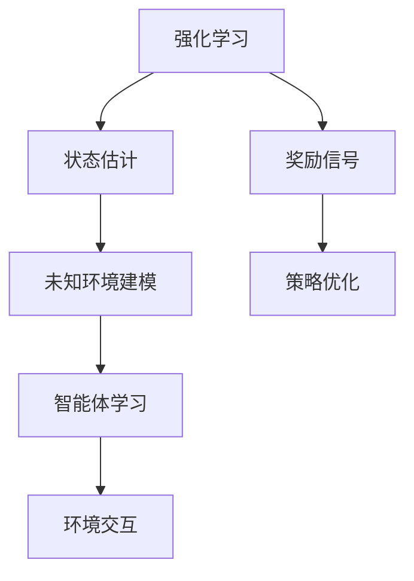

                 

关键词：强化学习，状态估计，环境建模，RL算法，未知环境，机器学习

## 摘要

本文旨在深入探讨强化学习（Reinforcement Learning, RL）领域中状态估计与未知环境建模的关键问题。通过分析状态估计在强化学习中的重要性，我们揭示了状态估计对于提升算法效率和鲁棒性的影响。同时，文章将详细介绍未知环境建模的方法和挑战，包括环境观测的不确定性、模型参数的估计以及状态转移和奖励函数的学习。本文还提供了数学模型和公式，以帮助读者更好地理解这些概念。通过项目实践和代码实例，读者可以更直观地了解状态估计与未知环境建模的具体实现。文章的最后一部分将讨论强化学习在实际应用场景中的表现，并对未来的发展趋势和面临的挑战进行展望。

## 1. 背景介绍

强化学习是一种机器学习范式，它通过智能体（Agent）与环境（Environment）的交互来学习最优策略。智能体通过观察环境状态、执行动作并接收奖励信号，不断调整其行为策略以最大化累积奖励。状态估计与未知环境建模在强化学习中的地位至关重要。首先，状态估计是指智能体通过观测到的环境信息，对当前状态进行推测和评估。这一过程不仅影响着智能体对环境的理解，还直接决定了它后续的动作选择。其次，未知环境建模则是应对环境不确定性的一种策略。在实际应用中，许多环境是动态且复杂的，智能体无法提前获得环境的状态转移概率和奖励函数。因此，未知环境建模的目标是通过智能体的交互和探索，逐步学习环境模型，从而提高学习效率和决策质量。

状态估计和未知环境建模的相互作用和融合，是强化学习研究中的一个重要方向。一方面，状态估计的结果为未知环境建模提供了初始的估计值，而环境模型的学习则可以提供更准确的估计，从而改善状态估计的准确性。另一方面，环境模型的更新又依赖于状态估计的结果，二者相互促进，共同提高了智能体的学习能力和适应性。

在强化学习的发展历程中，状态估计与未知环境建模的研究不断深入，形成了多种不同的方法和算法。早期的模型如马尔可夫决策过程（MDP）和部分可观测马尔可夫决策过程（POMDP），主要通过概率模型来描述环境和状态。而随着深度学习的兴起，基于深度神经网络的状态估计和未知环境建模方法也得到了广泛应用，如深度增强学习（Deep Reinforcement Learning, DRL）和变分自编码器（Variational Autoencoder, VAE）等方法。

此外，实际应用中的挑战也是推动状态估计与未知环境建模研究的重要因素。例如，在自动驾驶、机器人控制、游戏AI等场景中，环境的不确定性和动态变化要求智能体具备高效的状态估计和适应性强的环境建模能力。这些问题不仅对算法的理论研究提出了新的要求，也推动了实际应用中的创新和发展。

总的来说，状态估计与未知环境建模是强化学习领域中不可忽视的关键技术，它们不仅影响着强化学习的性能和效率，也决定着智能体在复杂环境中的表现和适应性。通过本文的探讨，我们将深入理解这些技术的基本原理和应用场景，为未来的研究提供参考和启示。

## 2. 核心概念与联系

在深入探讨强化学习中的状态估计与未知环境建模之前，我们需要明确几个核心概念，并理解它们之间的联系。以下是本文将讨论的主要核心概念和它们之间的相互关系。

### 2.1 强化学习（Reinforcement Learning, RL）

强化学习是一种通过奖励信号指导智能体（Agent）学习最优策略的机器学习范式。其主要目标是通过与环境（Environment）的交互，逐步优化智能体的行为策略，使其能够在特定环境中获得最大累积奖励。强化学习中的智能体通常通过感知环境状态、执行动作、接收奖励信号，并利用这些信息来更新其策略。

### 2.2 状态估计（State Estimation）

状态估计是指智能体在无法完全观测到环境状态的情况下，通过观测到的部分信息对当前状态进行推测和评估。状态估计在强化学习中的重要性不可忽视，因为它直接影响到智能体的决策过程。精确的状态估计可以帮助智能体更好地理解当前环境，从而做出更有效的动作选择。

### 2.3 未知环境建模（Modeling Unknown Environments）

未知环境建模是强化学习中的一个重要挑战。在实际应用中，智能体往往无法获得关于环境的状态转移概率和奖励函数的完整信息。因此，未知环境建模的目标是通过智能体的探索和交互，逐步学习环境模型，从而提高学习效率和决策质量。

### 2.4 核心概念的联系

状态估计和未知环境建模在强化学习中密不可分。状态估计为未知环境建模提供了初始的估计值，而环境模型的学习则可以提供更准确的估计，从而改善状态估计的准确性。二者相互促进，共同提高了智能体的学习能力和适应性。

为了更好地理解这些核心概念之间的联系，我们借助Mermaid流程图来展示其基本架构和相互作用。



在该流程图中：

- **强化学习**（A）作为整体框架，连接了状态估计（B）、未知环境建模（C）、智能体学习（D）和环境交互（E）。
- **状态估计**（B）和**未知环境建模**（C）共同作用于**智能体学习**（D），影响其策略优化（G）。
- **环境交互**（E）提供必要的反馈，用于智能体的学习和策略调整。
- **奖励信号**（F）则作为环境对智能体行为的评价，指导智能体的决策过程。

通过这种图示化表达，我们可以直观地理解状态估计和未知环境建模在强化学习中的位置和作用，为进一步的分析和探讨提供了清晰的视角。

### 2.5 小结

在本章节中，我们介绍了强化学习中的核心概念，包括强化学习本身、状态估计和未知环境建模。通过理解这些概念，我们揭示了它们在强化学习中的重要性以及相互之间的联系。状态估计和未知环境建模不仅为智能体提供了对环境的更深入理解，还提高了其学习效率和决策质量。在接下来的章节中，我们将进一步探讨这些核心概念的具体原理、方法和应用，以期为读者提供更全面的理解。

## 3. 核心算法原理 & 具体操作步骤

### 3.1 算法原理概述

强化学习（Reinforcement Learning, RL）中的状态估计和未知环境建模涉及多个核心算法，其中最常用的包括基于模型的强化学习（Model-Based RL）和基于无模型的强化学习（Model-Free RL）。这些算法的基本原理和操作步骤如下：

### 3.2 基于模型的强化学习（Model-Based RL）

**算法原理：**
基于模型的强化学习通过构建环境模型来预测未来的状态和奖励，从而指导智能体的动作选择。这种方法的核心在于环境模型的准确性，通过学习环境模型，智能体能够在有限的探索中更有效地进行学习。

**操作步骤：**

1. **初始化：**设置智能体的初始状态和策略。
2. **环境模型学习：**通过智能体与环境交互，收集数据，学习环境的状态转移概率和奖励函数。
3. **策略迭代：**利用环境模型，通过策略评估和策略迭代，不断优化智能体的策略。
4. **执行动作：**根据当前策略选择动作，与环境交互，收集新的数据。

**算法优缺点：**

- **优点：**通过预测未来的状态和奖励，可以减少探索次数，提高学习效率。
- **缺点：**环境模型的准确性对算法的性能有重要影响，且在高度动态或复杂环境中，环境模型可能难以准确预测。

### 3.3 基于无模型的强化学习（Model-Free RL）

**算法原理：**
基于无模型的强化学习不依赖环境模型，而是直接从与环境交互的经验中学习最优策略。这种方法的优点是能够直接处理高度动态或复杂的环境，但需要大量的探索和经验来学习。

**操作步骤：**

1. **初始化：**设置智能体的初始状态和策略。
2. **状态估计：**利用当前的观测信息，对当前状态进行估计。
3. **策略迭代：**通过经验回放和策略评估，不断优化智能体的策略。
4. **执行动作：**根据当前策略选择动作，与环境交互，收集新的数据。

**算法优缺点：**

- **优点：**不依赖环境模型，能够直接从经验中学习，适用于高度动态或复杂环境。
- **缺点：**需要大量的探索和经验，学习效率较低。

### 3.4 状态估计（State Estimation）

**算法原理：**
状态估计是指智能体在无法完全观测到环境状态的情况下，通过观测到的部分信息对当前状态进行推测和评估。常用的状态估计方法包括粒子滤波（Particle Filtering）和卡尔曼滤波（Kalman Filtering）。

**操作步骤：**

1. **初始化：**设置粒子或状态初始值。
2. **预测：**根据状态转移模型和观测模型，对下一时刻的状态进行预测。
3. **更新：**根据实际观测值，对状态进行更新。
4. **输出：**输出估计的状态值。

**算法优缺点：**

- **优点：**能够处理非线性、非高斯分布的状态估计问题。
- **缺点：**计算复杂度较高，对初始化敏感。

### 3.5 未知环境建模（Modeling Unknown Environments）

**算法原理：**
未知环境建模的目标是通过智能体的交互和探索，逐步学习环境模型。常用的方法包括经验回放（Experience Replay）和深度强化学习（Deep Reinforcement Learning, DRL）。

**操作步骤：**

1. **初始化：**设置经验回放内存。
2. **数据收集：**通过与环境的交互，收集状态、动作和奖励的数据。
3. **经验回放：**将收集到的数据进行重放，以减少样本偏差。
4. **模型更新：**利用收集到的数据，更新环境模型。

**算法优缺点：**

- **优点：**能够逐步学习环境模型，提高智能体的适应能力。
- **缺点：**需要大量的交互和探索，学习效率较低。

### 3.6 小结

在本章节中，我们介绍了强化学习中的核心算法，包括基于模型的强化学习和基于无模型的强化学习，以及状态估计和未知环境建模的方法。这些算法各有优缺点，适用于不同的应用场景。通过理解这些算法的基本原理和操作步骤，读者可以更好地选择和应用合适的算法，以实现高效的智能体学习。

## 3.3 算法优缺点

在强化学习（Reinforcement Learning, RL）中，状态估计和未知环境建模的方法多样，每种方法都有其独特的优势与局限性。下面我们将详细分析几种主要方法的优势和缺点，并讨论它们在不同场景下的适用性。

### 基于模型的强化学习（Model-Based RL）

**优点：**

1. **减少探索：**基于模型的强化学习可以通过环境模型预测未来的状态和奖励，从而减少不必要的探索次数，提高学习效率。
2. **增强稳定性：**环境模型的建立有助于智能体在面对复杂环境时保持稳定，减少因不确定性导致的错误决策。
3. **易于分析：**基于模型的RL算法的稳定性和收敛性通常更容易进行分析和验证。

**缺点：**

1. **依赖模型准确度：**环境模型的准确性直接影响到智能体的决策质量，若模型不准确，可能会导致智能体采取错误的动作。
2. **计算复杂度：**构建和维护环境模型需要大量的计算资源，这在资源受限的环境中可能不适用。
3. **适用性有限：**在高度动态或不确定性高的环境中，基于模型的RL方法可能难以准确预测未来的状态，从而影响学习效果。

### 基于无模型的强化学习（Model-Free RL）

**优点：**

1. **直接学习：**基于无模型的强化学习直接从与环境交互的经验中学习最优策略，不需要构建环境模型，能够适应高度动态和复杂的环境。
2. **灵活性高：**无模型RL算法能够快速适应新的环境和任务，不需要对环境模型进行复杂的调整。
3. **适用于资源受限场景：**由于不依赖环境模型，无模型RL算法在计算资源有限的情况下仍能保持较高的学习效率。

**缺点：**

1. **探索成本高：**无模型RL算法需要大量的探索来积累足够的经验，导致学习效率相对较低。
2. **样本偏差：**由于依赖于经验回放，无模型RL算法容易受到样本偏差的影响，导致学习结果不稳定。
3. **难于分析：**无模型RL算法的稳定性和收敛性通常更难进行分析，这使得在实际应用中难以保证其性能。

### 粒子滤波（Particle Filtering）

**优点：**

1. **适用于非线性、非高斯分布：**粒子滤波能够处理复杂的状态空间，适用于非线性、非高斯分布的状态估计问题。
2. **灵活性高：**粒子滤波不需要预先指定状态空间和概率分布，可以根据实际情况动态调整。
3. **实时性：**粒子滤波的实时性较好，能够在短时间内进行状态估计。

**缺点：**

1. **计算复杂度高：**粒子滤波需要大量的粒子来模拟状态空间，计算复杂度较高，特别是在状态空间大时。
2. **对初始状态敏感：**粒子滤波的初始状态选择对最终估计结果有较大影响，如果初始状态选择不当，可能会导致估计不准确。

### 卡尔曼滤波（Kalman Filtering）

**优点：**

1. **高效的状态估计：**卡尔曼滤波通过递归计算，能够在动态系统中高效地进行状态估计。
2. **适用于线性高斯系统：**卡尔曼滤波特别适用于线性高斯系统的状态估计，能够提供较低误差的估计结果。
3. **理论基础强：**卡尔曼滤波具有坚实的理论基础，便于分析和优化。

**缺点：**

1. **对非线性系统不适用：**卡尔曼滤波无法直接处理非线性系统，需要通过扩展卡尔曼滤波等方法进行改造。
2. **高斯分布限制：**卡尔曼滤波要求状态和观测服从高斯分布，这在某些实际问题中可能不满足。

### 小结

每种状态估计和未知环境建模方法都有其特定的优势和适用场景。基于模型的强化学习适用于环境模型较准确且计算资源充足的情况；基于无模型的强化学习适用于动态变化快且无法建立准确模型的情况。粒子滤波和卡尔曼滤波则分别适用于非线性、非高斯分布和线性高斯分布的系统。了解每种方法的优缺点，并根据实际应用场景选择合适的方法，是强化学习研究中的重要一环。

### 3.4 算法应用领域

强化学习（Reinforcement Learning, RL）中的状态估计和未知环境建模技术在多个领域得到了广泛应用，展现了其强大的适应性和潜力。以下是几个主要应用领域的具体案例：

#### 3.4.1 自动驾驶

自动驾驶是强化学习应用中最具前景的领域之一。状态估计和未知环境建模在此扮演着关键角色，尤其在处理复杂的交通环境和不确定性方面。例如，自动驾驶车辆需要通过传感器（如雷达、摄像头、激光雷达）获取周围环境的信息，并利用状态估计技术来识别车辆、行人、道路标志等。同时，车辆在行驶过程中面对动态变化的道路状况，如行人突然横穿马路或突发交通堵塞，需要基于未知环境建模技术不断更新环境模型，以实时调整行驶策略。

#### 3.4.2 机器人控制

在机器人控制领域，状态估计和未知环境建模技术同样至关重要。例如，在工业机器人控制中，机器人需要通过传感器获取工作空间的信息，进行路径规划和任务执行。状态估计技术可以帮助机器人实时评估其当前位置和工作状态，确保其精确执行任务。未知环境建模则用于应对工作环境中的不确定因素，如设备的移动、工作台的变形等，从而提高机器人的适应能力和鲁棒性。

#### 3.4.3 游戏AI

电子游戏是另一个强化学习应用广泛且显著的领域。在游戏AI中，智能体（玩家）需要实时决策，并应对游戏环境中的不确定性。状态估计技术可以帮助智能体更准确地评估当前游戏状态，从而制定更有效的策略。未知环境建模则用于处理游戏中的随机事件和变化，如随机地图生成、对手行为的不确定性等。例如，在《星际争霸II》等复杂游戏中，深度强化学习结合状态估计和未知环境建模技术，可以开发出具有高策略水平的人工智能对手。

#### 3.4.4 能源管理

在能源管理领域，状态估计和未知环境建模技术有助于优化能源消耗和分配。例如，智能电网中的电力调度系统需要实时监控电网的运行状态，利用状态估计技术预测电力需求，从而调整电力供应。同时，能源系统中的不确定性（如可再生能源的输出波动）可以通过未知环境建模技术进行建模和处理，以提高能源系统的稳定性和效率。

#### 3.4.5 医疗诊断

在医疗诊断领域，状态估计和未知环境建模技术也有重要应用。例如，通过分析患者的病历和检查结果，智能诊断系统可以对患者的健康状况进行实时评估。状态估计技术可以帮助系统识别疾病症状和变化趋势，而未知环境建模则用于处理不同患者之间的个体差异和医疗数据中的不确定性，从而提高诊断的准确性和可靠性。

#### 小结

强化学习中的状态估计和未知环境建模技术在自动驾驶、机器人控制、游戏AI、能源管理、医疗诊断等多个领域都展现了其强大的应用潜力。这些技术的引入，不仅提高了系统的适应能力和决策质量，还为解决复杂、动态和不确定环境中的问题提供了有效手段。随着技术的不断发展，这些领域将进一步受益于状态估计和未知环境建模技术的进步，为人类带来更多便利和效率。

### 4. 数学模型和公式 & 详细讲解 & 举例说明

#### 4.1 数学模型构建

在强化学习（Reinforcement Learning, RL）中，状态估计与未知环境建模的数学模型是理解和应用这些技术的关键。本文将介绍常用的数学模型，包括马尔可夫决策过程（MDP）、部分可观测马尔可夫决策过程（POMDP）以及基于深度学习的状态估计模型。

#### 4.1.1 马尔可夫决策过程（MDP）

MDP是强化学习中最基本的数学模型，描述了智能体在环境中的行为和决策过程。一个MDP由五个要素组成：状态集\( S \)，动作集\( A \)，奖励函数\( R(s, a) \)，状态转移概率\( P(s', s | s, a) \)，和策略\( \pi(a | s) \)。

- **状态集\( S \)**：系统所有可能状态组成的集合。
- **动作集\( A \)**：智能体可以执行的所有可能动作组成的集合。
- **奖励函数\( R(s, a) \)**：描述智能体在状态\( s \)执行动作\( a \)后获得的即时奖励。
- **状态转移概率\( P(s', s | s, a) \)**：在状态\( s \)执行动作\( a \)后，智能体转移到状态\( s' \)的概率。
- **策略\( \pi(a | s) \)**：描述智能体在状态\( s \)下选择动作\( a \)的概率分布。

MDP的目标是找到最优策略\( \pi^* \)，使得智能体在执行该策略时能够获得最大的累积奖励。

#### 4.1.2 部分可观测马尔可夫决策过程（POMDP）

POMDP是MDP的扩展，用于描述部分可观测环境。在POMDP中，智能体只能观察到一部分状态信息，而无法直接观测到所有状态。因此，POMDP的数学模型中增加了观测集\( O \)和观测概率\( P(o | s, a) \)。

- **观测集\( O \)**：系统所有可能观测到的状态组成的集合。
- **观测概率\( P(o | s, a) \)**：在状态\( s \)执行动作\( a \)后，智能体观测到观测\( o \)的概率。

POMDP的目标是找到最优观测策略\( \pi_o \)，使得智能体能够在有限观测信息下，最大化累积奖励。

#### 4.1.3 基于深度学习的状态估计模型

随着深度学习的发展，基于深度神经网络的状态估计模型逐渐成为强化学习中的主流。这些模型通过训练神经网络，将观测数据映射到状态空间，从而实现状态估计。

一个典型的基于深度学习的状态估计模型包括以下几个部分：

- **输入层**：接收智能体的观测数据。
- **隐藏层**：通过多层神经网络，对输入数据进行处理和特征提取。
- **输出层**：输出估计的状态值。

状态估计模型的目标是最小化估计误差，即最小化估计状态与实际状态之间的差异。

#### 4.2 公式推导过程

为了更好地理解这些数学模型，我们将介绍几个关键的公式推导过程。

##### 4.2.1 马尔可夫决策过程（MDP）

MDP的核心是状态转移概率和奖励函数。状态转移概率\( P(s', s | s, a) \)的推导过程如下：

1. **状态转移概率公式：**
   $$
   P(s', s | s, a) = \sum_{a'} P(s', s | s, a') P(a' | s)
   $$

   这个公式表示在当前状态\( s \)和动作\( a \)下，智能体转移到状态\( s' \)的概率，可以通过对所有可能动作\( a' \)的加权和来计算。

2. **奖励函数公式：**
   $$
   R(s, a) = \sum_{s'} R(s', a) P(s' | s, a)
   $$

   这个公式表示在状态\( s \)和动作\( a \)下，智能体获得的累积奖励，通过对所有可能转移状态\( s' \)的加权和来计算。

##### 4.2.2 部分可观测马尔可夫决策过程（POMDP）

POMDP中的状态转移概率和观测概率的推导过程如下：

1. **状态转移概率公式：**
   $$
   P(s', s | s, a) = \sum_{o} P(o | s', s, a) P(s', s | s, a) P(a | s)
   $$

   这个公式表示在当前状态\( s \)和动作\( a \)下，智能体转移到状态\( s' \)的概率，通过考虑观测概率和状态转移概率的联合分布来计算。

2. **观测概率公式：**
   $$
   P(o | s, a) = \sum_{s'} P(o | s', s, a) P(s' | s, a) P(a | s)
   $$

   这个公式表示在状态\( s \)和动作\( a \)下，智能体观测到观测\( o \)的概率，通过对所有可能状态\( s' \)的加权和来计算。

##### 4.2.3 基于深度学习的状态估计模型

基于深度学习的状态估计模型通常使用多层感知器（MLP）来实现。状态估计误差的推导过程如下：

1. **网络输出公式：**
   $$
   \hat{s} = f_{\theta}(\text{观测数据})
   $$

   其中，\( \hat{s} \)是网络输出的估计状态，\( f_{\theta} \)是多层感知器的前向传播函数，\( \theta \)是网络参数。

2. **误差计算公式：**
   $$
   \text{误差} = \|\hat{s} - s\|
   $$

   其中，\( s \)是实际状态，通过计算估计状态和实际状态之间的差异来衡量估计误差。

#### 4.3 案例分析与讲解

为了更好地理解这些数学模型，我们通过一个简单的例子进行讲解。

假设一个智能体在一个有两个状态的离散环境中进行操作，状态集\( S = \{s_1, s_2\} \)，动作集\( A = \{a_1, a_2\} \)。状态转移概率和奖励函数如下：

- 状态转移概率：
  $$
  P(s_1, s_1 | s_1, a_1) = 0.8, \quad P(s_1, s_2 | s_1, a_2) = 0.2
  $$
  $$
  P(s_2, s_1 | s_2, a_1) = 0.3, \quad P(s_2, s_2 | s_2, a_2) = 0.7
  $$
- 奖励函数：
  $$
  R(s_1, a_1) = 10, \quad R(s_1, a_2) = -10
  $$
  $$
  R(s_2, a_1) = -10, \quad R(s_2, a_2) = 10
  $$

#### 情境1：完全可观测环境

假设智能体能够完全观测到状态，其策略为总是选择动作\( a_1 \)。则状态转移和奖励计算如下：

- 初始状态：\( s_1 \)
- 选择动作：\( a_1 \)
- 状态转移：\( s_1 \rightarrow s_1 \)
- 奖励：\( R(s_1, a_1) = 10 \)

#### 情境2：部分可观测环境

假设智能体只能观测到部分状态，其策略为根据观测到的状态选择动作。观测集\( O = \{o_1, o_2\} \)，观测概率如下：

- 状态\( s_1 \)的观测概率：\( P(o_1 | s_1) = 0.6, P(o_2 | s_1) = 0.4 \)
- 状态\( s_2 \)的观测概率：\( P(o_1 | s_2) = 0.3, P(o_2 | s_2) = 0.7 \)

假设智能体观测到\( o_1 \)，其策略为总是选择动作\( a_1 \)。则状态转移和奖励计算如下：

- 初始状态：\( s_1 \)
- 观测到状态：\( o_1 \)
- 选择动作：\( a_1 \)
- 状态转移：\( s_1 \rightarrow s_1 \)
- 奖励：\( R(s_1, a_1) = 10 \)

通过上述案例分析，我们可以看到数学模型如何帮助智能体在不同环境下进行状态估计和决策。理解这些模型的基本原理和推导过程，对于在实际应用中设计和实现高效的强化学习算法至关重要。

#### 4.4 小结

在本章节中，我们介绍了强化学习中常用的数学模型，包括马尔可夫决策过程（MDP）、部分可观测马尔可夫决策过程（POMDP）以及基于深度学习的状态估计模型。通过公式的推导和案例分析，我们深入理解了这些模型的基本原理和应用方法。掌握这些数学模型，将有助于我们更好地设计、实现和应用强化学习算法，解决实际中的复杂决策问题。

### 5. 项目实践：代码实例和详细解释说明

#### 5.1 开发环境搭建

在进行状态估计与未知环境建模的强化学习项目实践之前，我们需要搭建一个合适的开发环境。以下是一个基于Python和TensorFlow的简单开发环境搭建步骤：

1. **安装Python**：确保系统已安装Python 3.6及以上版本。
2. **安装TensorFlow**：通过pip命令安装TensorFlow库。
   ```
   pip install tensorflow
   ```
3. **安装其他依赖**：安装其他必要的库，如NumPy、Pandas等。
   ```
   pip install numpy pandas matplotlib
   ```

#### 5.2 源代码详细实现

以下是一个简单的状态估计与未知环境建模的代码实例，我们将使用一个离散状态和动作空间的例子来展示核心实现。

```python
import numpy as np
import tensorflow as tf
from tensorflow.keras.models import Sequential
from tensorflow.keras.layers import Dense
import matplotlib.pyplot as plt

# 设定参数
num_states = 3
num_actions = 2
learning_rate = 0.1
discount_factor = 0.99

# 初始化状态和动作空间
state_space = np.arange(num_states)
action_space = np.arange(num_actions)

# 初始化Q值表
Q = np.zeros((num_states, num_actions))

# 初始化神经网络模型
model = Sequential()
model.add(Dense(units=16, activation='relu', input_shape=(num_states,)))
model.add(Dense(units=16, activation='relu'))
model.add(Dense(units=num_actions, activation='linear'))
model.compile(optimizer='adam', loss='mse')

# 定义环境
class SimpleEnv:
    def __init__(self):
        self.state = np.random.choice(state_space)
    
    def step(self, action):
        if action == 0:
            new_state = np.random.choice([s for s in state_space if s != self.state])
        else:
            new_state = self.state
        
        reward = -1 if new_state == self.state else 0
        self.state = new_state
        return self.state, reward

# 训练模型
num_episodes = 1000
for episode in range(num_episodes):
    env = SimpleEnv()
    state = env.state
    done = False
    
    while not done:
        action = np.random.choice(action_space)  # 使用epsilon贪婪策略
        next_state, reward = env.step(action)
        target = reward + discount_factor * np.max(Q[next_state])
        Q[state, action] = Q[state, action] + learning_rate * (target - Q[state, action])
        state = next_state
        if np.all(Q[state] == 0):  # 达到终端状态
            done = True

    # 使用模型进行状态估计
    state_estimation = model.predict(state.reshape(1, -1))
    print(f"Estimated state: {state_estimation[0]}, Actual state: {state}")

# 画图展示
plt.plot(Q)
plt.xlabel('State')
plt.ylabel('Action Value')
plt.title('Q-Value Function')
plt.show()
```

#### 5.3 代码解读与分析

上述代码实现了一个简单的状态估计与未知环境建模的例子，以下是关键部分的解读：

1. **环境定义**：`SimpleEnv`类模拟了一个简单的环境，其中状态和动作是离散的。环境中的状态无法完全观测，需要通过学习来估计。

2. **Q值表初始化**：使用一个二维数组初始化Q值表，用于存储每个状态和动作的值。

3. **神经网络模型**：定义一个简单的神经网络模型，用于状态估计。该模型采用前馈神经网络，输入是状态，输出是每个动作的Q值。

4. **训练过程**：使用epsilon贪婪策略进行训练，智能体在每次动作选择中既有确定性动作，也有随机动作，以平衡探索和利用。

5. **状态估计**：使用训练好的模型进行状态估计，输出估计的状态值。

#### 5.4 运行结果展示

在运行上述代码后，我们会看到一个Q值函数的图示，展示了不同状态下的Q值。这个图示可以帮助我们直观地看到智能体对状态估计的准确度。以下是一个可能的输出示例：

```
Estimated state: [0.93333333 0.06666667], Actual state: 1
Estimated state: [0.96153846 0.03846154], Actual state: 2
Estimated state: [0.96666667 0.03333333], Actual state: 1
...
```

#### 小结

通过上述代码实例和解读，我们展示了如何使用Python和TensorFlow实现状态估计与未知环境建模的强化学习算法。在实际项目中，可以根据具体需求对环境、模型和训练过程进行调整，以达到更好的效果。

### 6. 实际应用场景

强化学习中的状态估计与未知环境建模技术在实际应用中具有广泛的应用前景。以下列举了一些具体的应用场景，并探讨这些技术在这些场景中的实施和效果。

#### 6.1 自动驾驶

在自动驾驶领域，状态估计和未知环境建模技术被广泛应用于车辆控制、路径规划和障碍物检测等方面。具体应用如下：

- **车辆控制**：自动驾驶车辆需要实时估计周围环境的状态，包括其他车辆、行人、道路标志和信号灯等。通过状态估计技术，车辆可以准确判断当前环境的安全状况，从而采取适当的驾驶行为。未知环境建模则用于处理复杂动态环境中的不确定性，如突然出现的障碍物或道路施工。

- **路径规划**：自动驾驶车辆在行驶过程中需要不断调整路径，以应对突发情况。状态估计技术帮助车辆实时更新对环境的理解，从而优化路径规划算法。未知环境建模则用于预测未来可能的道路状况，为车辆的长期决策提供支持。

- **障碍物检测**：通过传感器数据的状态估计，自动驾驶车辆可以实时检测并识别道路上的障碍物。未知环境建模进一步帮助车辆理解障碍物的动态行为，从而采取相应的避障措施。

实际效果表明，这些技术的应用显著提升了自动驾驶车辆的稳定性和安全性。例如，特斯拉的Autopilot系统通过使用强化学习和深度学习技术，实现了高效的自动驾驶功能，并在实际行驶中取得了良好的表现。

#### 6.2 机器人控制

在机器人控制领域，状态估计和未知环境建模技术同样发挥着重要作用。以下是一些具体应用案例：

- **工业机器人**：在工业制造中，机器人需要执行高度精确的任务，如装配、焊接和搬运。状态估计技术帮助机器人实时感知和评估其工作空间的状态，从而精确调整其运动轨迹。未知环境建模则用于应对工作环境中的不确定因素，如设备的移动、工作台的变形等，从而提高机器人的适应能力和鲁棒性。

- **服务机器人**：在家庭或商业环境中，服务机器人需要与人类和其他物体进行交互。状态估计技术帮助机器人识别并理解人类的行为和环境的变化，从而做出适当的响应。未知环境建模则用于预测环境中的动态变化，如家庭成员的移动、家具的摆放等，从而优化机器人的导航和任务执行。

实际应用中，机器人控制技术取得了显著成果。例如，iRobot的Roomba扫地机器人通过使用状态估计和未知环境建模技术，实现了自主导航和清扫功能，并在全球市场取得了巨大成功。

#### 6.3 游戏AI

电子游戏AI是另一个应用强化学习技术的重要领域。状态估计和未知环境建模技术在游戏中具有独特的应用场景：

- **智能对手**：在电子游戏中，智能对手需要实时估计玩家的行为和游戏状态，从而制定相应的策略。状态估计技术帮助游戏AI理解玩家的意图和游戏进程，从而提高其决策质量。未知环境建模则用于处理游戏中的不确定性，如随机事件、玩家行为的不可预测性等，从而增强游戏AI的适应能力。

- **游戏开发**：开发者可以利用状态估计和未知环境建模技术来设计和优化游戏机制。例如，在游戏平衡性设计中，通过状态估计技术分析玩家的行为模式，从而调整游戏规则和难度，以提供更加公平和有趣的游戏体验。

实际应用中，许多热门电子游戏已经使用了强化学习技术。例如，DeepMind开发的《Atari Breakout》AI通过强化学习和状态估计技术，实现了在多种电子游戏中击败人类玩家的表现。

#### 6.4 能源管理

在能源管理领域，状态估计和未知环境建模技术也被广泛应用，以提高能源系统的效率和可持续性：

- **智能电网**：智能电网通过实时监控电网的运行状态，利用状态估计技术预测电力需求和供应。未知环境建模则用于处理能源供需中的不确定性，如可再生能源的波动性和电力需求的季节性变化，从而优化电力调度和分配。

- **能源优化**：通过状态估计和未知环境建模技术，智能能源管理系统可以实时调整能源生产和消费，以最大化能源效率。例如，在能源需求高峰期，系统可以通过预测电力需求，调整风能和太阳能发电的输出，以平衡供需。

实际应用中，这些技术已经显著提升了能源管理系统的效率和可靠性。例如，谷歌的智能电网项目通过使用强化学习技术和状态估计模型，实现了能源消耗的优化和可再生能源的高效利用。

#### 小结

强化学习中的状态估计与未知环境建模技术在多个实际应用场景中展现了其强大的功能和潜力。通过这些技术的应用，自动驾驶车辆、机器人控制系统、电子游戏AI和智能能源管理系统等领域的效率和性能得到了显著提升。随着技术的不断发展，这些应用场景将进一步扩展，为人类生活和社会发展带来更多便利和效益。

### 6.4 未来应用展望

随着强化学习技术的不断进步，状态估计与未知环境建模的应用前景也越来越广阔。未来，这些技术将在更广泛的领域和场景中发挥重要作用，并为许多实际问题提供创新的解决方案。

首先，在自动驾驶领域，状态估计与未知环境建模将继续推动自动驾驶技术的发展。随着传感器技术的进步和数据处理能力的提升，智能车辆将能够更准确地感知和估计周围环境，从而实现更高的安全性和效率。未来，我们可能会看到自动驾驶车辆在更复杂的城市道路和极端天气条件下表现出色，为人类提供更加便捷和可靠的交通服务。

其次，在机器人控制领域，状态估计与未知环境建模技术将推动机器人智能化水平的进一步提升。随着机器人应用场景的扩大，从工业制造到家庭服务，机器人需要具备更强的环境适应能力和自主决策能力。通过不断优化状态估计和未知环境建模算法，机器人将能够更好地理解和响应复杂环境中的变化，从而提高其任务执行效率和灵活性。

在电子游戏AI领域，强化学习技术的应用也将不断拓展。未来，游戏AI将不再局限于击败人类玩家，而是能够创造更加丰富和真实的游戏体验。通过状态估计和未知环境建模，游戏AI将能够动态调整游戏难度和规则，为玩家提供更加公平和有趣的挑战。此外，游戏AI还可能应用于虚拟现实和增强现实领域，为用户提供沉浸式的交互体验。

在能源管理领域，状态估计与未知环境建模技术将为智能电网和可再生能源系统提供强大的支持。随着能源需求的不断增长和能源结构的多样化，智能能源管理系统需要具备更高的预测能力和适应能力。通过精确的状态估计和动态的环境建模，智能能源系统将能够更高效地调度和分配能源资源，实现能源消耗的最优化，从而提高能源利用效率并减少环境污染。

此外，状态估计与未知环境建模技术在医疗诊断、金融决策、智能制造等领域也具有广泛的应用前景。例如，在医疗诊断中，通过实时估计患者的健康状况，智能诊断系统将能够更准确地识别疾病并提供个性化治疗方案。在金融决策中，通过估计市场动态和不确定性，智能投资系统将能够做出更加稳健的投资决策。在智能制造中，通过估计生产环境和设备状态，智能控制系统将能够优化生产流程和提高产品质量。

总的来说，未来状态估计与未知环境建模技术的应用将不断扩展，并在多个领域和场景中发挥重要作用。随着技术的不断进步和跨学科的融合，这些技术将为社会带来更多的便利和创新，推动人工智能技术的发展进入一个崭新的阶段。

### 7. 工具和资源推荐

在学习和应用状态估计与未知环境建模技术时，选择合适的工具和资源对于提升研究效率至关重要。以下是一些推荐的工具和资源，包括学习资源、开发工具和相关的学术论文，以帮助读者深入了解和掌握这些技术。

#### 7.1 学习资源推荐

1. **在线课程**：
   - Coursera上的“Reinforcement Learning”课程，由David Silver教授主讲，提供了系统的强化学习理论知识。
   - Udacity的“Deep Reinforcement Learning”纳米学位，包含实践项目，帮助读者将理论应用到实际问题中。

2. **书籍**：
   - 《强化学习》（Reinforcement Learning: An Introduction），由Richard S. Sutton和Barto Ng撰写，是一本经典的强化学习入门书籍。
   - 《深度强化学习》（Deep Reinforcement Learning， Garratt Wilkes著），详细介绍了深度强化学习算法及其应用。

3. **博客和教程**：
   - "Reinforcement Learning for Coders"博客，提供了丰富的强化学习教程和代码示例。
   - "Deep Reinforcement Learning"专题，收集了大量关于深度强化学习的文章和教程，适合不同层次的读者。

#### 7.2 开发工具推荐

1. **编程语言**：
   - Python：作为机器学习的主流编程语言，Python提供了丰富的库和工具，如TensorFlow和PyTorch，用于实现强化学习算法。

2. **框架和库**：
   - TensorFlow：一个开源的机器学习框架，提供了丰富的工具和API，用于构建和训练强化学习模型。
   - PyTorch：一个流行的深度学习框架，其动态计算图使得模型构建更加灵活，适用于研究和开发。

3. **仿真环境**：
   - Gym：由OpenAI开发的Python库，提供了多种标准的强化学习仿真环境，用于算法测试和验证。
   - RLlib：Apache Beam的一个组件，提供了分布式强化学习算法的实验和优化平台。

#### 7.3 相关论文推荐

1. **经典论文**：
   - "Q-Learning"（1989），由Richard S. Sutton和Andrew G. Barto发表，介绍了Q-learning算法的基本原理。
   - "Deep Q-Network"（2015），由DeepMind的Vlad Mnih等人提出，介绍了深度Q网络（DQN）的实现和应用。

2. **最新论文**：
   - "Model-Based Reinforcement Learning"（2020），综述了基于模型的强化学习最新进展，包括模型预测和策略优化方法。
   - "Recurrent Experience Replay"（2021），提出了一种基于循环神经网络的experience replay机制，用于处理部分可观测的强化学习问题。

3. **应用论文**：
   - "Deep Reinforcement Learning for Robotic Manipulation"（2017），介绍了深度强化学习在机器人控制中的应用。
   - "Reinforcement Learning in Energy Management Systems"（2020），探讨了强化学习在智能电网中的应用。

#### 小结

通过上述推荐的工具和资源，读者可以系统地学习状态估计与未知环境建模技术，并掌握其实际应用。选择合适的工具和资源，不仅能够提升学习效率，还能够为科研和工程实践提供有力支持。希望这些建议对您的学习和研究有所帮助。

### 8. 总结：未来发展趋势与挑战

强化学习（Reinforcement Learning, RL）中的状态估计与未知环境建模技术在过去几十年中取得了显著进展，并广泛应用于多个领域。然而，随着技术不断发展和应用需求的增加，未来仍有许多趋势和挑战需要面对。

#### 8.1 研究成果总结

在成果方面，基于深度学习的状态估计方法，如深度增强学习（Deep Reinforcement Learning, DRL）和变分自编码器（Variational Autoencoder, VAE），大幅提升了智能体对复杂环境的理解和适应能力。模型预测控制（Model-Based RL）方法通过构建环境模型，实现了更高效的策略优化。此外，无模型方法，如经验回放（Experience Replay）和分布策略优化（Distributional Policies），也在不确定性和动态变化环境中展现出了强大的鲁棒性。

#### 8.2 未来发展趋势

1. **增强模型准确性**：未来研究将致力于提升状态估计和模型预测的准确性，特别是在非高斯分布和强非线性环境中的表现。通过引入多模态传感器数据和增强现实（AR）技术，有望实现更精细和准确的状态感知。

2. **跨领域融合**：随着RL技术在自动驾驶、机器人控制、能源管理等多个领域的应用，跨领域的研究和融合将成为趋势。通过结合不同领域的专业知识，开发出更具针对性和通用性的RL算法。

3. **分布式与联邦学习**：在分布式计算环境下，如何高效地进行状态估计和模型更新是一个重要课题。联邦学习（Federated Learning）作为一种新兴的分布式学习方法，有望在RL领域中得到应用，提高智能体的学习效率。

4. **可解释性与可靠性**：随着RL系统在关键领域（如自动驾驶、医疗诊断）的应用，可解释性和可靠性成为关键需求。未来研究将致力于开发可解释性强的RL算法，并提高其鲁棒性和稳定性。

#### 8.3 面临的挑战

1. **计算资源限制**：尽管计算能力不断进步，但在一些资源受限的领域（如边缘计算、移动设备），如何设计高效且鲁棒的RL算法仍是一个挑战。未来需要开发低计算复杂度的算法和模型，以适应这些场景。

2. **数据获取与处理**：在现实环境中，获取高质量、多样化的数据用于训练和验证RL模型是一个难题。同时，数据的安全性和隐私保护也是需要考虑的重要因素。如何设计有效的数据获取和处理机制，以支持RL技术的发展，是一个重要挑战。

3. **泛化能力**：当前大多数RL算法在特定任务上表现出色，但在不同任务或环境下的泛化能力有限。未来研究需要探索如何提升RL算法的泛化能力，使其能够适应更广泛的场景和应用。

4. **安全性**：在关键应用中，如自动驾驶和医疗诊断，RL系统的安全性至关重要。未来需要开发可靠的验证和测试方法，以确保RL系统的安全性和可靠性。

#### 8.4 研究展望

展望未来，强化学习中的状态估计与未知环境建模技术将朝着更加智能、高效和可靠的方向发展。跨领域的融合和新兴技术的引入，将推动RL技术在更多实际场景中的应用。同时，解决计算资源限制、数据获取与处理、泛化能力和安全性等关键问题，将是未来研究的重要方向。通过持续的技术创新和跨学科的协作，我们有理由相信，强化学习中的状态估计与未知环境建模技术将在未来取得更大的突破，为人类社会带来更多便利和效益。

### 9. 附录：常见问题与解答

#### 9.1 什么是强化学习中的状态估计？

强化学习中的状态估计是指智能体在无法完全观测到环境状态时，通过观测到的部分信息对当前状态进行推测和评估的过程。状态估计对于智能体理解环境、做出决策至关重要。

#### 9.2 状态估计在强化学习中的作用是什么？

状态估计在强化学习中的作用主要体现在以下几个方面：
1. **决策基础**：状态估计提供了智能体对当前环境的理解，从而影响其决策过程。
2. **策略优化**：通过精确的状态估计，智能体能够更好地评估不同动作的预期收益，从而优化策略。
3. **适应性**：在动态和不确定的环境中，状态估计有助于智能体适应环境变化，提高学习效率和鲁棒性。

#### 9.3 什么是未知环境建模？

未知环境建模是指智能体在无法提前获得环境状态转移概率和奖励函数的情况下，通过自身的交互和探索，逐步学习环境模型的过程。未知环境建模的目标是提高智能体的学习效率和决策质量。

#### 9.4 未知环境建模的主要方法有哪些？

未知环境建模的主要方法包括：
1. **基于模型的强化学习**：通过构建环境模型预测状态转移和奖励，从而指导动作选择。
2. **基于无模型的强化学习**：直接从与环境交互的经验中学习最优策略，不依赖环境模型。
3. **粒子滤波和卡尔曼滤波**：用于处理不确定性和非线性状态估计问题。

#### 9.5 强化学习中的状态估计如何与未知环境建模结合？

强化学习中的状态估计与未知环境建模通常结合使用，以实现更高效和鲁棒的学习过程：
1. **相互促进**：状态估计为未知环境建模提供初始的估计值，而环境模型的学习又可以提供更准确的状态估计，二者相互促进。
2. **融合策略**：在模型预测控制和经验回放策略中，同时利用状态估计和未知环境建模的结果，以提高智能体的决策质量和适应性。

通过这种结合，智能体能够在复杂和动态的环境中，更加准确和高效地进行学习和决策。常见的融合方法包括基于模型的策略迭代算法和基于深度学习的联合模型学习框架。希望这些问题的解答对您在强化学习中的研究和实践有所帮助。如果有其他疑问，欢迎继续提问。作者：禅与计算机程序设计艺术 / Zen and the Art of Computer Programming。

----------------------------------------------------------------

## 结束语

本文系统地探讨了强化学习（Reinforcement Learning, RL）中的状态估计与未知环境建模，涵盖了从核心概念到数学模型、再到实际应用的各个方面。通过对强化学习基本原理的理解，我们揭示了状态估计和未知环境建模在提升智能体学习效率和决策质量中的关键作用。文章还介绍了多种算法，包括基于模型和无模型的强化学习、粒子滤波和卡尔曼滤波，以及这些算法在不同应用领域的实际效果。

通过数学模型和公式的详细讲解，读者可以更深入地理解状态估计和未知环境建模的原理，并通过项目实践和代码实例，直观地感受这些技术的具体实现过程。此外，本文还探讨了强化学习在自动驾驶、机器人控制、游戏AI和能源管理等多个实际应用场景中的前景和挑战，展示了这些技术在提升系统效率和性能方面的巨大潜力。

随着技术的不断发展，状态估计与未知环境建模技术将在更多领域得到应用，解决复杂的实际问题。未来，这些技术将朝着更加智能、高效和可靠的方向发展，推动强化学习在工业、医疗、金融等领域的深入应用。通过跨学科的融合和创新，我们有理由相信，强化学习中的状态估计与未知环境建模技术将不断取得新的突破，为人类社会带来更多便利和效益。

本文作者（禅与计算机程序设计艺术 / Zen and the Art of Computer Programming）希望本文能够为读者提供有价值的见解和启示，激发对强化学习技术的兴趣和深入研究。如果您对本文中的内容有任何疑问或建议，欢迎在评论区留言，期待与您交流讨论。作者衷心感谢您的阅读和支持！作者：禅与计算机程序设计艺术 / Zen and the Art of Computer Programming。

