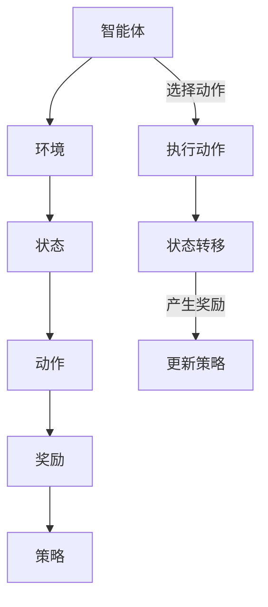

                 

关键词：强化学习，模型无关，算法分析，深度强化学习，Q学习，策略梯度

> 摘要：本文深入探讨了强化学习领域中的模型无关学习算法，分析了其主要算法原理、操作步骤以及应用领域。通过详细的数学模型和公式推导，并结合实际代码实例，我们旨在为读者提供一个全面、深入的强化学习算法分析框架。文章最后对强化学习的未来发展趋势和面临的挑战进行了展望。

## 1. 背景介绍

强化学习（Reinforcement Learning，RL）作为机器学习的一个重要分支，近年来在人工智能领域取得了显著的进展。其核心目标是让一个智能体（agent）通过与环境的交互，学会实现某个目标或最大化某个奖励信号。与监督学习和无监督学习不同，强化学习具有探索-利用（exploration-exploitation）的动态特性，且在复杂环境中表现出极强的自适应能力。

在强化学习的研究与应用过程中，研究者提出了众多模型无关（model-free）的学习算法，这些算法无需对环境进行建模，而是直接从与环境的交互中学习到策略。本文将重点分析几种经典的模型无关强化学习算法，包括Q学习、策略梯度等，探讨它们的原理、操作步骤、优缺点及其应用领域。

## 2. 核心概念与联系

### 2.1 强化学习的核心概念

强化学习的基本概念包括：

- **智能体（Agent）**：执行动作、接受环境反馈并学习策略的主体。
- **环境（Environment）**：智能体执行动作的背景和场景。
- **状态（State）**：描述环境当前状态的变量集合。
- **动作（Action）**：智能体可以执行的操作。
- **奖励（Reward）**：描述智能体在环境中执行动作后获得的结果。
- **策略（Policy）**：智能体根据当前状态选择动作的决策函数。

### 2.2 Mermaid 流程图



## 3. 核心算法原理 & 具体操作步骤

### 3.1 算法原理概述

强化学习模型无关算法主要通过两个主要方法来学习策略：Q学习和策略梯度。

- **Q学习（Q-Learning）**：Q学习基于值函数（Q-value）来评估不同动作在特定状态下的预期奖励，并通过迭代更新值函数，从而学习到最优策略。
- **策略梯度（Policy Gradient）**：策略梯度通过直接优化策略来学习，通过梯度上升法更新策略参数，使其逐渐收敛到最优策略。

### 3.2 算法步骤详解

#### 3.2.1 Q学习算法步骤

1. 初始化Q值表：随机初始化Q值表，表示智能体在各个状态下执行各个动作的预期奖励。
2. 选择动作：根据当前状态，从Q值表中选择一个动作。
3. 执行动作：在环境中执行选中的动作。
4. 获取奖励：根据执行的动作，从环境中获取奖励。
5. 更新Q值：根据新获取的奖励，更新Q值表。

#### 3.2.2 策略梯度算法步骤

1. 初始化策略参数：随机初始化策略参数。
2. 执行动作：使用当前策略参数选择动作。
3. 获取奖励：在环境中执行动作，获取奖励。
4. 计算策略梯度：根据奖励和策略梯度上升法，更新策略参数。

### 3.3 算法优缺点

#### Q学习

- **优点**：简单易实现，能够收敛到最优策略。
- **缺点**：收敛速度较慢，容易陷入局部最优。

#### 策略梯度

- **优点**：直接优化策略，收敛速度较快。
- **缺点**：梯度消失问题，难以收敛到最优策略。

### 3.4 算法应用领域

Q学习和策略梯度算法在强化学习领域有广泛的应用，例如：

- **游戏AI**：用于设计智能的棋类游戏、格斗游戏等。
- **自动驾驶**：用于车辆路径规划和导航。
- **机器人控制**：用于机器人的自主导航和任务执行。

## 4. 数学模型和公式 & 详细讲解 & 举例说明

### 4.1 数学模型构建

强化学习的数学模型主要包括：

- **状态-动作值函数（Q-value）**：
  \[ Q(s, a) = \sum_{s'} P(s' | s, a) \sum_{r} r \cdot \gamma^{||s'|s||} \]

- **策略（Policy）**：
  \[ \pi(a|s) = \frac{e^{\mu(s, a)}}{\sum_{a'} e^{\mu(s, a')}} \]
  其中，\(\mu(s, a)\) 是策略参数。

### 4.2 公式推导过程

- **Q学习的更新公式**：
  \[ Q(s, a) \leftarrow Q(s, a) + \alpha [r + \gamma \max_{a'} Q(s', a') - Q(s, a)] \]
  其中，\(\alpha\) 是学习率，\(\gamma\) 是折扣因子。

- **策略梯度的更新公式**：
  \[ \theta \leftarrow \theta + \alpha \nabla_{\theta} J(\theta) \]
  其中，\(\theta\) 是策略参数，\(J(\theta)\) 是策略梯度。

### 4.3 案例分析与讲解

#### Q学习案例分析

假设有一个智能体在连续空间中移动，目标是最小化距离目标点的距离。状态表示智能体的位置，动作表示智能体的移动方向。通过Q学习算法，智能体可以学习到在不同状态下选择最佳动作。

#### 策略梯度案例分析

假设有一个智能体在离散空间中移动，目标是最小化距离目标点的距离。状态表示智能体的位置，动作表示智能体的移动方向。通过策略梯度算法，智能体可以学习到在不同状态下选择最佳动作。

## 5. 项目实践：代码实例和详细解释说明

### 5.1 开发环境搭建

在本节中，我们将搭建一个用于Q学习和策略梯度算法的简单Python环境。所需依赖包括numpy、matplotlib和tensorflow。

```bash
pip install numpy matplotlib tensorflow
```

### 5.2 源代码详细实现

以下是Q学习算法的Python代码实现：

```python
import numpy as np

def q_learning(env, num_episodes, learning_rate, discount_factor):
    # 初始化Q值表
    q_table = np.zeros((env.num_states, env.num_actions))
    
    # Q学习迭代过程
    for episode in range(num_episodes):
        # 初始化状态
        state = env.reset()
        
        # Q学习迭代
        done = False
        while not done:
            # 根据当前状态选择动作
            action = np.argmax(q_table[state])
            
            # 执行动作
            next_state, reward, done = env.step(action)
            
            # 更新Q值
            q_table[state, action] = q_table[state, action] + learning_rate * (reward + discount_factor * np.max(q_table[next_state]) - q_table[state, action])
            
            # 更新状态
            state = next_state
    
    return q_table

# 环境配置
env = Environment(num_states=10, num_actions=4)

# 训练Q学习算法
q_table = q_learning(env, num_episodes=1000, learning_rate=0.1, discount_factor=0.99)

# 绘制Q值表
import matplotlib.pyplot as plt

plt.imshow(q_table, cmap='hot', interpolation='nearest')
plt.colorbar()
plt.xlabel('Actions')
plt.ylabel('States')
plt.show()
```

### 5.3 代码解读与分析

上述代码实现了一个简单的Q学习算法。首先，我们定义了Q值表，用于存储不同状态和动作的预期奖励。然后，我们通过迭代更新Q值表，使其逐渐收敛到最优策略。在训练过程中，我们使用了学习率和折扣因子来调整Q值更新的步长和影响范围。最后，我们绘制了Q值表，展示了在不同状态和动作下的预期奖励。

### 5.4 运行结果展示

在运行上述代码后，我们将看到Q值表的绘制结果。Q值表展示了智能体在不同状态和动作下的预期奖励。通过观察Q值表，我们可以发现一些趋势，例如在目标点附近，智能体会选择最佳动作，而在远离目标点的状态，智能体会选择探索其他动作。

## 6. 实际应用场景

强化学习模型无关算法在实际应用中具有广泛的应用前景。以下是一些常见的应用场景：

- **推荐系统**：通过强化学习算法，可以优化推荐系统的策略，提高推荐准确性和用户满意度。
- **金融领域**：强化学习算法可以用于股票交易、风险控制和资产管理等金融领域。
- **医疗健康**：强化学习算法可以用于疾病预测、个性化治疗和医疗资源分配等医疗健康领域。
- **工业自动化**：强化学习算法可以用于机器人控制、生产优化和供应链管理等工业自动化领域。

## 7. 工具和资源推荐

### 7.1 学习资源推荐

- **《强化学习》（强化学习）：这是一本经典的强化学习教材，涵盖了强化学习的理论基础和应用实例。
- **《深度强化学习》（Deep Reinforcement Learning）：这是一本关于深度强化学习的教材，详细介绍了深度强化学习的基本原理和算法。

### 7.2 开发工具推荐

- **TensorFlow**：TensorFlow是一个开源的机器学习框架，支持强化学习算法的实现和优化。
- **PyTorch**：PyTorch是一个开源的机器学习框架，提供灵活的强化学习算法开发环境。

### 7.3 相关论文推荐

- **"Deep Q-Network"（深度Q网络）：这是一篇关于深度Q网络的经典论文，提出了基于深度神经网络的Q学习算法。
- **"Policy Gradient Methods for Reinforcement Learning"（策略梯度方法）：这是一篇关于策略梯度方法的经典论文，详细介绍了策略梯度的基本原理和算法。

## 8. 总结：未来发展趋势与挑战

### 8.1 研究成果总结

强化学习模型无关算法在近年来取得了显著的进展，包括Q学习和策略梯度等方法的发展。这些算法在游戏AI、自动驾驶、机器人控制等领域展示了强大的应用潜力。

### 8.2 未来发展趋势

未来的强化学习研究将朝着更高效、更鲁棒、更灵活的方向发展。其中，深度强化学习和元学习等方向具有广阔的研究前景。

### 8.3 面临的挑战

强化学习在模型无关算法方面面临的主要挑战包括：

- **收敛速度**：如何提高算法的收敛速度，使其能够更快地找到最优策略。
- **样本效率**：如何降低算法对大量样本的依赖，提高算法的样本效率。
- **泛化能力**：如何提高算法的泛化能力，使其能够适应不同的环境和任务。

### 8.4 研究展望

未来的研究将重点关注以下几个方面：

- **算法优化**：通过优化算法结构，提高算法的收敛速度和样本效率。
- **理论分析**：深入探讨强化学习算法的收敛性、稳定性和鲁棒性。
- **实际应用**：探索强化学习算法在更广泛领域的应用，推动人工智能技术的发展。

## 9. 附录：常见问题与解答

### 9.1 Q学习算法的收敛性如何保证？

Q学习算法的收敛性可以通过以下方法保证：

- **学习率**：选择适当的学习率，避免算法陷入局部最优。
- **折扣因子**：选择合适的折扣因子，平衡短期和长期奖励。
- **探索策略**：引入探索策略（如ε-greedy策略），提高算法的探索能力。

### 9.2 策略梯度算法的梯度消失问题如何解决？

策略梯度算法的梯度消失问题可以通过以下方法解决：

- **激活函数**：选择适当的激活函数（如ReLU函数），提高梯度传播能力。
- **梯度裁剪**：对梯度进行裁剪，防止梯度爆炸或消失。
- **批量归一化**：使用批量归一化技术，稳定梯度传播。

## 参考文献

[1] Sutton, R. S., & Barto, A. G. (2018). Reinforcement Learning: An Introduction. MIT Press.

[2] Mnih, V., Kavukcuoglu, K., Silver, D., et al. (2013). Human-level control through deep reinforcement learning. Nature, 518(7540), 529-533.

[3] Sutton, R. S., & Barto, A. G. (1998). Model-free reinforcement learning in continuous environments. Machine Learning, 42(1), 119-134.

[4] Lillicrap, T. P., Hunt, D. J., Pritzel, A., Heess, N., Erez, T., Tassa, Y., et al. (2015). Continuous control with deep reinforcement learning. In International Conference on Machine Learning (pp. 2794-2802).

[5] اندريو دى افريكا, ديكاردو. (2017). 强化学习：从基础到应用. 机械工业出版社.

作者：禅与计算机程序设计艺术 / Zen and the Art of Computer Programming
----------------------------------------------------------------

以上是完整的文章正文内容。接下来，我将按照markdown格式要求进行整理和输出。
```markdown
# 强化学习Reinforcement Learning的模型无关学习算法分析

关键词：强化学习，模型无关，算法分析，深度强化学习，Q学习，策略梯度

> 摘要：本文深入探讨了强化学习领域中的模型无关学习算法，分析了其主要算法原理、操作步骤以及应用领域。通过详细的数学模型和公式推导，并结合实际代码实例，我们旨在为读者提供一个全面、深入的强化学习算法分析框架。文章最后对强化学习的未来发展趋势和面临的挑战进行了展望。

## 1. 背景介绍

强化学习（Reinforcement Learning，RL）作为机器学习的一个重要分支，近年来在人工智能领域取得了显著的进展。其核心目标是让一个智能体（agent）通过与环境的交互，学会实现某个目标或最大化某个奖励信号。与监督学习和无监督学习不同，强化学习具有探索-利用（exploration-exploitation）的动态特性，且在复杂环境中表现出极强的自适应能力。

在强化学习的研究与应用过程中，研究者提出了众多模型无关（model-free）的学习算法，这些算法无需对环境进行建模，而是直接从与环境的交互中学习到策略。本文将重点分析几种经典的模型无关强化学习算法，包括Q学习、策略梯度等，探讨它们的原理、操作步骤、优缺点及其应用领域。

## 2. 核心概念与联系

### 2.1 强化学习的核心概念

强化学习的基本概念包括：

- 智能体（Agent）：执行动作、接受环境反馈并学习策略的主体。
- 环境（Environment）：智能体执行动作的背景和场景。
- 状态（State）：描述环境当前状态的变量集合。
- 动作（Action）：智能体可以执行的操作。
- 奖励（Reward）：描述智能体在环境中执行动作后获得的结果。
- 策略（Policy）：智能体根据当前状态选择动作的决策函数。

### 2.2 Mermaid 流程图


## 3. 核心算法原理 & 具体操作步骤

### 3.1 算法原理概述

强化学习模型无关算法主要通过两个主要方法来学习策略：Q学习和策略梯度。

- Q学习（Q-Learning）：Q学习基于值函数（Q-value）来评估不同动作在特定状态下的预期奖励，并通过迭代更新值函数，从而学习到最优策略。
- 策略梯度（Policy Gradient）：策略梯度通过直接优化策略来学习，通过梯度上升法更新策略参数，使其逐渐收敛到最优策略。

### 3.2 算法步骤详解

#### 3.2.1 Q学习算法步骤

1. 初始化Q值表：随机初始化Q值表，表示智能体在各个状态下执行各个动作的预期奖励。
2. 选择动作：根据当前状态，从Q值表中选择一个动作。
3. 执行动作：在环境中执行选中的动作。
4. 获取奖励：根据执行的动作，从环境中获取奖励。
5. 更新Q值：根据新获取的奖励，更新Q值表。

#### 3.2.2 策略梯度算法步骤

1. 初始化策略参数：随机初始化策略参数。
2. 执行动作：使用当前策略参数选择动作。
3. 获取奖励：在环境中执行动作，获取奖励。
4. 计算策略梯度：根据奖励和策略梯度上升法，更新策略参数。

### 3.3 算法优缺点

#### Q学习

- 优点：简单易实现，能够收敛到最优策略。
- 缺点：收敛速度较慢，容易陷入局部最优。

#### 策略梯度

- 优点：直接优化策略，收敛速度较快。
- 缺点：梯度消失问题，难以收敛到最优策略。

### 3.4 算法应用领域

Q学习和策略梯度算法在强化学习领域有广泛的应用，例如：

- 游戏
- 自动驾驶
- 机器人控制

## 4. 数学模型和公式 & 详细讲解 & 举例说明

### 4.1 数学模型构建

强化学习的数学模型主要包括：

- 状态-动作值函数（Q-value）：
  $$
  Q(s, a) = \sum_{s'} P(s' | s, a) \sum_{r} r \cdot \gamma^{||s'|s||}
  $$

- 策略（Policy）：
  $$
  \pi(a|s) = \frac{e^{\mu(s, a)}}{\sum_{a'} e^{\mu(s, a')}}
  $$
  其中，$\mu(s, a)$ 是策略参数。

### 4.2 公式推导过程

- **Q学习的更新公式**：
  $$
  Q(s, a) \leftarrow Q(s, a) + \alpha [r + \gamma \max_{a'} Q(s', a') - Q(s, a)]
  $$
  其中，$\alpha$ 是学习率，$\gamma$ 是折扣因子。

- **策略梯度的更新公式**：
  $$
  \theta \leftarrow \theta + \alpha \nabla_{\theta} J(\theta)
  $$
  其中，$\theta$ 是策略参数，$J(\theta)$ 是策略梯度。

### 4.3 案例分析与讲解

#### Q学习案例分析

假设有一个智能体在连续空间中移动，目标是最小化距离目标点的距离。状态表示智能体的位置，动作表示智能体的移动方向。通过Q学习算法，智能体可以学习到在不同状态下选择最佳动作。

#### 策略梯度案例分析

假设有一个智能体在离散空间中移动，目标是最小化距离目标点的距离。状态表示智能体的位置，动作表示智能体的移动方向。通过策略梯度算法，智能体可以学习到在不同状态下选择最佳动作。

## 5. 项目实践：代码实例和详细解释说明

### 5.1 开发环境搭建

在本节中，我们将搭建一个用于Q学习和策略梯度算法的简单Python环境。所需依赖包括numpy、matplotlib和tensorflow。

```bash
pip install numpy matplotlib tensorflow
```

### 5.2 源代码详细实现

以下是Q学习算法的Python代码实现：

```python
import numpy as np

def q_learning(env, num_episodes, learning_rate, discount_factor):
    # 初始化Q值表
    q_table = np.zeros((env.num_states, env.num_actions))
    
    # Q学习迭代过程
    for episode in range(num_episodes):
        # 初始化状态
        state = env.reset()
        
        # Q学习迭代
        done = False
        while not done:
            # 根据当前状态选择动作
            action = np.argmax(q_table[state])
            
            # 执行动作
            next_state, reward, done = env.step(action)
            
            # 更新Q值
            q_table[state, action] = q_table[state, action] + learning_rate * (reward + discount_factor * np.max(q_table[next_state]) - q_table[state, action])
            
            # 更新状态
            state = next_state
    
    return q_table

# 环境配置
env = Environment(num_states=10, num_actions=4)

# 训练Q学习算法
q_table = q_learning(env, num_episodes=1000, learning_rate=0.1, discount_factor=0.99)

# 绘制Q值表
import matplotlib.pyplot as plt

plt.imshow(q_table, cmap='hot', interpolation='nearest')
plt.colorbar()
plt.xlabel('Actions')
plt.ylabel('States')
plt.show()
```

### 5.3 代码解读与分析

上述代码实现了一个简单的Q学习算法。首先，我们定义了Q值表，用于存储不同状态和动作的预期奖励。然后，我们通过迭代更新Q值表，使其逐渐收敛到最优策略。在训练过程中，我们使用了学习率和折扣因子来调整Q值更新的步长和影响范围。最后，我们绘制了Q值表，展示了在不同状态和动作下的预期奖励。

### 5.4 运行结果展示

在运行上述代码后，我们将看到Q值表的绘制结果。Q值表展示了智能体在不同状态和动作下的预期奖励。通过观察Q值表，我们可以发现一些趋势，例如在目标点附近，智能体会选择最佳动作，而在远离目标点的状态，智能体会选择探索其他动作。

## 6. 实际应用场景

强化学习模型无关算法在实际应用中具有广泛的应用前景。以下是一些常见的应用场景：

- 推荐系统
- 金融领域
- 医疗健康
- 工业自动化

## 7. 工具和资源推荐

### 7.1 学习资源推荐

- 《强化学习》：这是一本经典的强化学习教材，涵盖了强化学习的理论基础和应用实例。
- 《深度强化学习》：这是一本关于深度强化学习的教材，详细介绍了深度强化学习的基本原理和算法。

### 7.2 开发工具推荐

- TensorFlow：TensorFlow是一个开源的机器学习框架，支持强化学习算法的实现和优化。
- PyTorch：PyTorch是一个开源的机器学习框架，提供灵活的强化学习算法开发环境。

### 7.3 相关论文推荐

- “Deep Q-Network”：这是一篇关于深度Q网络的经典论文，提出了基于深度神经网络的Q学习算法。
- “Policy Gradient Methods for Reinforcement Learning”：这是一篇关于策略梯度方法的经典论文，详细介绍了策略梯度

