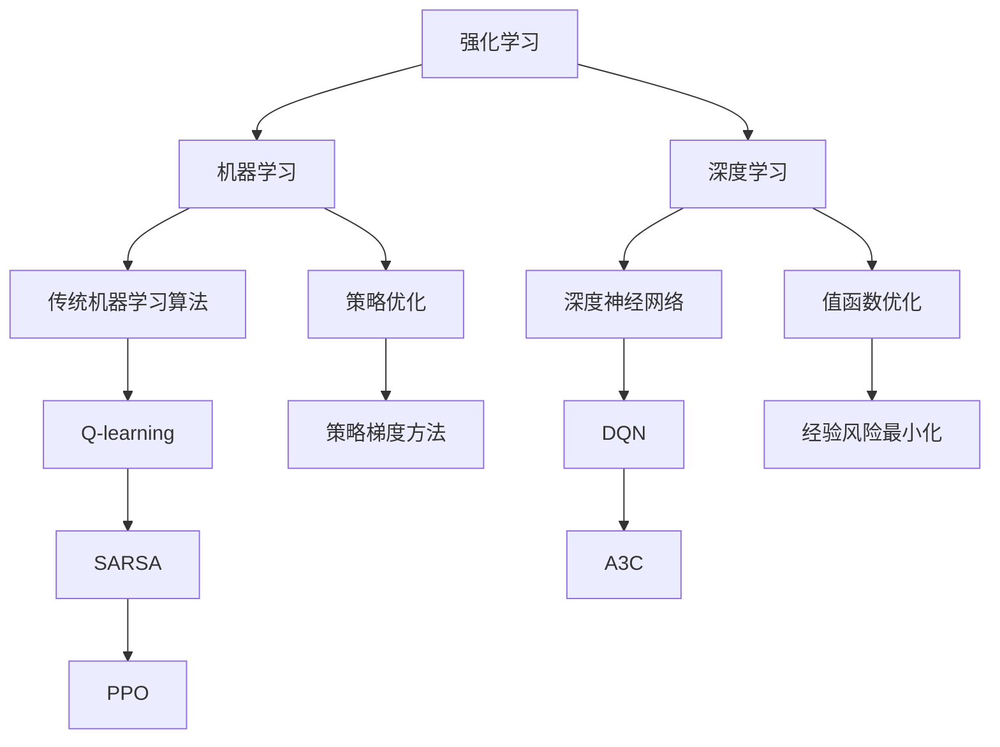

                 

### 摘要

本文深入探讨了强化学习（Reinforcement Learning, RL）作为深度学习（Deep Learning, DL）、机器学习（Machine Learning, ML）和人工智能（Artificial Intelligence, AI）的交集领域，从其核心概念、算法原理到实际应用场景进行全面剖析。文章旨在为读者提供一个系统的理解，解释为什么强化学习在人工智能领域具有如此重要的地位，以及它在深度学习和机器学习中的独特角色。通过详细讨论数学模型和公式的推导，以及实际项目中的代码实例，本文旨在帮助读者掌握强化学习的应用和实践技巧。最后，文章总结了当前的研究成果、未来发展趋势以及面临的挑战，为强化学习领域的研究者和从业者提供了有价值的参考。

### 1. 背景介绍

强化学习作为机器学习的一个重要分支，近年来在人工智能（AI）领域取得了显著进展。强化学习的核心在于通过学习如何在动态环境中做出最优决策，这使其在解决复杂决策问题方面具有独特的优势。与传统机器学习方法不同，强化学习不仅仅依赖于大量的数据集，而是通过试错和奖励机制来优化决策过程。

深度学习（DL）作为近年来最为火爆的人工智能技术之一，通过模拟人脑神经元网络结构，实现了对复杂数据的自动特征提取和模式识别。深度学习的成功在很大程度上得益于计算能力的提升和大数据的广泛应用。然而，深度学习在处理序列数据和需要连续决策的问题时，仍面临一定的局限性。

机器学习（ML）是人工智能的基础，涵盖了从统计学习到神经网络等多种算法。传统的机器学习方法如决策树、支持向量机等，在许多应用场景中表现优异。然而，面对复杂、动态的环境时，这些方法往往难以胜任。

强化学习（RL）的兴起，为解决上述问题提供了新的思路。通过结合深度学习的强大特征提取能力和机器学习的优化算法，强化学习在解决序列决策问题和连续控制任务方面展现了巨大的潜力。例如，在游戏、自动驾驶、机器人控制等领域，强化学习已经取得了显著的成果。

随着AI技术的不断发展，强化学习逐渐成为深度学习和机器学习领域的一个重要交汇点。本文将详细探讨强化学习在这些领域的独特作用和重要性，并通过实际案例和项目实践，帮助读者理解强化学习的核心原理和应用方法。

### 2. 核心概念与联系

#### 2.1 强化学习的定义与基本原理

强化学习（Reinforcement Learning, RL）是一种机器学习范式，其核心在于通过试错和奖励机制来优化决策过程。在强化学习中，智能体（Agent）通过不断与环境（Environment）交互，根据环境的反馈（Reward）来调整自身的策略（Policy），以达到最大化长期奖励的目标。

强化学习的基本原理可以概括为以下几个步骤：

1. **初始状态**：智能体开始在一个随机状态 \(s_0\) 下。
2. **动作选择**：智能体根据当前状态 \(s_t\) 和策略 \( \pi(s_t, a_t) \)，选择一个动作 \(a_t\)。
3. **环境反馈**：环境根据动作 \(a_t\) 更新状态，并给予智能体一个即时奖励 \(r_t\)。
4. **状态更新**：智能体更新当前状态 \(s_t\) 为新状态 \(s_{t+1}\)。
5. **策略调整**：智能体根据累积奖励和历史交互经验，调整其策略 \( \pi(s_t, a_t) \)。

强化学习的过程可以表示为一个马尔可夫决策过程（MDP），其数学模型包括状态空间 \(S\)、动作空间 \(A\)、奖励函数 \(r(s, a)\) 和状态转移概率 \(p(s_{t+1} | s_t, a_t)\)。通过最大化累积奖励，智能体逐渐学习到最优策略，从而在动态环境中实现最优决策。

#### 2.2 强化学习与深度学习的结合

强化学习与深度学习（Deep Learning, DL）的结合，是近年来人工智能领域的一个重要研究方向。深度学习通过多层神经网络，实现了对复杂数据的自动特征提取和模式识别，为强化学习提供了强大的基础。

1. **深度强化学习（Deep Reinforcement Learning, DRL）**：
   深度强化学习（DRL）是将深度学习的方法应用于强化学习问题，通过深度神经网络来近似状态值函数 \(V(s)\) 和策略 \( \pi(a|s) \)。在DRL中，深度神经网络被用来处理高维的状态空间和动作空间，从而实现更复杂和精确的决策。

2. **深度Q网络（Deep Q-Network, DQN）**：
   DQN是深度强化学习的一种典型实现，通过经验回放（Experience Replay）和目标网络（Target Network）来克服传统的Q-learning算法中的偏差和方差问题。DQN的核心思想是利用深度神经网络来近似Q值函数 \(Q(s, a)\)，从而实现对动作价值的评估。

3. **策略梯度方法（Policy Gradient Methods）**：
   策略梯度方法是一类基于策略的深度强化学习方法，通过直接优化策略参数来最大化累积奖励。策略梯度方法包括REINFORCE、PPO（Proximal Policy Optimization）和A3C（Asynchronous Advantage Actor-Critic）等算法，它们通过不同方式更新策略参数，以提高收敛速度和稳定性。

#### 2.3 强化学习与机器学习的联系

强化学习与机器学习（Machine Learning, ML）有着密切的联系。传统的机器学习方法如决策树、支持向量机和朴素贝叶斯等，在许多静态和确定性环境中表现优异。然而，面对复杂、动态和不确定的环境，这些方法往往难以胜任。

强化学习通过引入奖励机制和动态调整策略，为解决这些复杂问题提供了新的思路。强化学习中的算法，如Q-learning、SARSA（State-Action-Reward-State-Action）和深度强化学习算法，都是基于机器学习中的优化理论和经验风险最小化原则。

1. **Q-learning**：
   Q-learning是一种基于值函数的强化学习算法，通过迭代更新Q值函数来优化策略。Q-learning的核心思想是选择当前状态下价值最大的动作，从而最大化累积奖励。

2. **SARSA**：
   SARSA是一种基于策略的强化学习算法，通过同时考虑当前状态和下一个状态来更新策略。SARSA旨在同时优化状态值函数和策略，从而实现更稳定和高效的决策。

3. **深度强化学习算法**：
   深度强化学习算法，如DQN、A3C和PPO等，通过引入深度神经网络来处理高维状态空间和动作空间，实现了更复杂和精确的决策。这些算法在游戏、自动驾驶和机器人控制等领域取得了显著的成果。

#### 2.4 Mermaid 流程图展示

为了更好地理解强化学习与深度学习、机器学习的结合，以下是一个简化的Mermaid流程图，展示了这些概念之间的联系：



在这个流程图中，强化学习位于中心位置，与机器学习和深度学习紧密相连。传统机器学习算法、深度神经网络以及策略优化和值函数优化方法都是强化学习的重要组成部分。

### 3. 核心算法原理 & 具体操作步骤

#### 3.1 算法原理概述

强化学习算法的核心思想是通过与环境交互，不断调整策略，以最大化累积奖励。在本节中，我们将详细讨论强化学习中的几个核心算法，包括Q-learning、SARSA、深度Q网络（DQN）和策略梯度方法。

1. **Q-learning**：
   Q-learning是一种基于值函数的强化学习算法，其目标是学习状态-动作值函数 \(Q(s, a)\)，即每个状态和动作组合下的期望累积奖励。Q-learning的基本原理是选择当前状态下价值最大的动作，并通过迭代更新Q值，逐渐优化策略。

2. **SARSA**：
   SARSA是一种基于策略的强化学习算法，它同时考虑当前状态和下一个状态来更新策略。SARSA的目标是同时优化状态值函数和策略，从而实现更稳定和高效的决策。

3. **深度Q网络（DQN）**：
   DQN是深度强化学习的一种典型实现，通过深度神经网络来近似Q值函数 \(Q(s, a)\)。DQN通过经验回放和目标网络来克服传统Q-learning算法中的偏差和方差问题，从而实现更复杂和精确的决策。

4. **策略梯度方法**：
   策略梯度方法是一类基于策略的强化学习算法，通过直接优化策略参数来最大化累积奖励。策略梯度方法包括REINFORCE、PPO（Proximal Policy Optimization）和A3C（Asynchronous Advantage Actor-Critic）等算法，它们通过不同方式更新策略参数，以提高收敛速度和稳定性。

#### 3.2 算法步骤详解

以下是对上述强化学习算法的具体步骤进行详细说明：

1. **Q-learning算法步骤**：

   - 初始化Q值函数 \(Q(s, a)\) 为一个小随机数。
   - 在初始状态 \(s_0\) 下，选择动作 \(a_t\)。
   - 执行动作 \(a_t\)，得到新的状态 \(s_{t+1}\) 和即时奖励 \(r_t\)。
   - 更新Q值：\( Q(s_t, a_t) \leftarrow Q(s_t, a_t) + \alpha [r_t + \gamma \max_{a'} Q(s_{t+1}, a') - Q(s_t, a_t)] \)。
   - 更新状态：\( s_t \leftarrow s_{t+1} \)。
   - 重复上述步骤，直到达到终止状态。

2. **SARSA算法步骤**：

   - 初始化策略 \( \pi(s, a) \) 为随机策略。
   - 在当前状态 \(s_t\) 下，根据策略 \( \pi(s_t, a_t) \) 选择动作 \(a_t\)。
   - 执行动作 \(a_t\)，得到新的状态 \(s_{t+1}\) 和即时奖励 \(r_t\)。
   - 根据新的状态 \(s_{t+1}\)，选择新的动作 \(a_{t+1}\)。
   - 更新策略：\( \pi(s_t, a_t) \leftarrow \pi(s_t, a_t) + \alpha [r_t + \gamma \max_{a'} Q(s_{t+1}, a') - \pi(s_t, a_t)] \)。
   - 更新状态和动作：\( s_t \leftarrow s_{t+1} \)，\( a_t \leftarrow a_{t+1} \)。
   - 重复上述步骤，直到达到终止状态。

3. **DQN算法步骤**：

   - 初始化深度神经网络 \( \theta \) 和目标网络 \( \theta' \)。
   - 初始化经验池 \(E\) 和目标经验池 \(E'\)。
   - 初始化Q值函数 \(Q(s, a)\) 和目标Q值函数 \(Q'(s, a)\)。
   - 在初始状态 \(s_0\) 下，选择动作 \(a_t\)。
   - 执行动作 \(a_t\)，得到新的状态 \(s_{t+1}\) 和即时奖励 \(r_t\)。
   - 将经验 \( (s_t, a_t, r_t, s_{t+1}) \) 存入经验池 \(E\)。
   - 当经验池达到一定容量时，从经验池中随机抽取一批经验 \( (s', a', r', s'') \)。
   - 使用梯度下降法更新Q值函数 \( \theta \)：$$ L(\theta) = \sum_{(s', a', r', s'') \in E'} (r' + \gamma \max_{a'} Q'(\theta', s'', a') - Q(\theta, s'))^2 $$
   - 同步更新目标网络 \( \theta' \)：$$ \theta' \leftarrow \theta + \eta \nabla_{\theta} L(\theta) $$
   - 更新状态：\( s_t \leftarrow s_{t+1} \)。
   - 重复上述步骤，直到达到终止状态。

4. **策略梯度方法步骤**：

   - 初始化策略网络 \( \theta \) 和策略参数 \( \pi(\theta) \)。
   - 在初始状态 \(s_0\) 下，根据策略网络选择动作 \(a_t\)。
   - 执行动作 \(a_t\)，得到新的状态 \(s_{t+1}\) 和即时奖励 \(r_t\)。
   - 计算策略梯度：$$ \nabla_{\theta} J(\theta) = \sum_{s, a} \pi(s, a) \nabla_{\theta} \log \pi(s, a) \nabla_{\theta} \nabla_a Q(s, a) $$
   - 使用梯度上升法更新策略参数：$$ \theta \leftarrow \theta + \eta \nabla_{\theta} J(\theta) $$
   - 更新状态：\( s_t \leftarrow s_{t+1} \)。
   - 重复上述步骤，直到达到终止状态。

#### 3.3 算法优缺点

1. **Q-learning算法**：

   - 优点：简单直观，易于实现和理解，能够收敛到最优策略。
   - 缺点：收敛速度较慢，容易出现偏差和方差问题。

2. **SARSA算法**：

   - 优点：同时优化状态值函数和策略，能够收敛到稳定策略。
   - 缺点：收敛速度较慢，对初始策略的依赖较大。

3. **DQN算法**：

   - 优点：利用深度神经网络处理高维状态空间，能够处理更复杂的决策问题。
   - 缺点：训练过程复杂，容易出现过估计问题，需要较大的经验池和探索策略。

4. **策略梯度方法**：

   - 优点：直接优化策略参数，收敛速度快，能够处理连续动作空间。
   - 缺点：对奖励函数的设计和参数调优要求较高，容易出现不稳定和方差问题。

#### 3.4 算法应用领域

强化学习算法在多个领域取得了显著的应用成果，以下列举几个典型应用场景：

1. **游戏**：强化学习在游戏领域取得了突破性进展，例如在《星际争霸》和《英雄联盟》等游戏中，通过DQN和A3C算法实现了超人的AI对手。

2. **自动驾驶**：强化学习在自动驾驶领域被广泛应用于路径规划和决策控制，通过深度强化学习算法实现了自动驾驶汽车的自主驾驶。

3. **机器人控制**：强化学习在机器人控制中用于学习复杂的运动和操作任务，例如在机器人足球、机械臂控制和无人机飞行等领域取得了显著成果。

4. **推荐系统**：强化学习在推荐系统中被用于优化推荐策略，通过持续学习和优化，提高了推荐系统的准确性和用户体验。

5. **金融领域**：强化学习在金融领域被应用于风险管理和投资策略优化，通过学习市场动态和风险因素，实现了更精确和高效的决策。

### 4. 数学模型和公式 & 详细讲解 & 举例说明

#### 4.1 数学模型构建

在强化学习中，数学模型是理解和应用算法的基础。核心的数学模型包括状态空间 \(S\)、动作空间 \(A\)、奖励函数 \(r(s, a)\) 和状态转移概率 \(p(s_{t+1} | s_t, a_t)\)。

- **状态空间 \(S\)**：表示智能体在环境中可能的所有状态。
- **动作空间 \(A\)**：表示智能体可以采取的所有动作。
- **奖励函数 \(r(s, a)\)**：描述智能体在状态 \(s\) 下采取动作 \(a\) 后获得的即时奖励。
- **状态转移概率 \(p(s_{t+1} | s_t, a_t)\)**：描述智能体在状态 \(s_t\) 下采取动作 \(a_t\) 后转移到状态 \(s_{t+1}\) 的概率。

#### 4.2 公式推导过程

强化学习的核心目标是最优化累积奖励，即最大化智能体在一系列动作中的总奖励。这可以通过优化策略 \( \pi(a|s) \) 或值函数 \(V(s)\) 来实现。

- **值函数 \(V(s)\)**：表示在状态 \(s\) 下采取最优策略获得的期望累积奖励。其公式为：
  $$ V(s) = \sum_{a \in A} \pi(a|s) \sum_{s' \in S} p(s'|s, a) r(s', a) + \gamma V(s') $$
  其中，\(\gamma\) 是折现因子，表示对未来奖励的衰减。

- **策略 \( \pi(a|s)\)**：表示在状态 \(s\) 下采取动作 \(a\) 的概率。其优化目标是最大化累积奖励：
  $$ \pi^*(a|s) = \arg \max_{\pi(a|s)} \sum_{s' \in S} p(s'|s, a) r(s', a) + \gamma V(s') $$

#### 4.3 案例分析与讲解

为了更好地理解上述数学模型和公式的应用，我们以一个简单的例子进行讲解。

假设我们有一个简单的游戏环境，智能体可以在一个2D网格中移动，状态空间为 \(S = \{(0,0), (0,1), (1,0), (1,1)\}\)，动作空间为 \(A = \{上下左右\}\)。奖励函数定义为：每次移动获得奖励 \(r = 1\)，到达终点获得额外奖励 \(r = 10\)。

1. **状态-动作值函数 \(Q(s, a)\)**：

   假设初始状态为 \(s = (0,0)\)，我们需要计算每个动作下的期望累积奖励。以动作“上”为例：
   $$ Q(s, 上) = 1 \cdot p((0,1) | (0,0), 上) \cdot r((0,1), 上) + \gamma p((1,0) | (0,0), 上) \cdot r((1,0), 上) + \gamma p((1,1) | (0,0), 上) \cdot r((1,1), 上) $$
   假设状态转移概率为均匀分布，即 \(p(s'|s, a) = \frac{1}{3}\)。代入上述公式，我们得到：
   $$ Q(s, 上) = 1 \cdot \frac{1}{3} \cdot 1 + \gamma \cdot \frac{1}{3} \cdot 1 + \gamma \cdot \frac{1}{3} \cdot 10 = \frac{1}{3} + \frac{\gamma}{3} + \frac{10\gamma}{3} $$

   同样的方法，我们可以计算其他动作下的值函数：
   $$ Q(s, 下) = \frac{1}{3} + \frac{\gamma}{3} + \frac{8\gamma}{3} $$
   $$ Q(s, 左) = \frac{1}{3} + \frac{\gamma}{3} + \frac{6\gamma}{3} $$
   $$ Q(s, 右) = \frac{1}{3} + \frac{\gamma}{3} + \frac{4\gamma}{3} $$

2. **策略优化**：

   根据值函数 \(Q(s, a)\)，我们可以选择当前状态下价值最大的动作。以状态 \(s = (0,0)\) 为例，我们选择动作“上”：
   $$ a^* = \arg \max_{a \in A} Q(s, a) = \arg \max_{a \in A} \left( \frac{1}{3} + \frac{\gamma}{3} + \frac{10\gamma}{3} \right) $$
   即选择动作“上”。

3. **累积奖励**：

   在每次行动后，我们更新累积奖励。假设智能体在状态 \(s = (0,0)\) 下选择了动作“上”，则当前累积奖励为：
   $$ R_t = r_t + \gamma R_{t-1} = 1 + \gamma R_{t-1} $$
   如果智能体最终到达终点，则累积奖励为：
   $$ R_T = r_T + \gamma R_{T-1} = 10 + \gamma R_{T-1} $$

   通过不断迭代更新，智能体逐渐学习到最优策略，并在环境中实现最优决策。

### 5. 项目实践：代码实例和详细解释说明

#### 5.1 开发环境搭建

在进行强化学习项目实践前，我们需要搭建一个合适的开发环境。以下是搭建环境的基本步骤：

1. **安装Python环境**：
   确保已经安装了Python 3.7及以上版本。可以使用以下命令进行安装：
   ```bash
   sudo apt-get install python3
   sudo apt-get install python3-pip
   ```

2. **安装TensorFlow**：
   TensorFlow是强化学习项目中常用的深度学习库。可以使用以下命令进行安装：
   ```bash
   pip3 install tensorflow==2.6
   ```

3. **安装OpenAI Gym**：
   OpenAI Gym是一个开源的环境库，用于创建和测试强化学习算法。可以使用以下命令进行安装：
   ```bash
   pip3 install gym
   ```

4. **安装其他依赖库**：
   根据项目的具体需求，可能还需要安装其他依赖库，如NumPy、Matplotlib等。可以使用以下命令进行安装：
   ```bash
   pip3 install numpy matplotlib
   ```

#### 5.2 源代码详细实现

以下是一个简单的强化学习项目，使用深度Q网络（DQN）算法在一个简单的环境（CartPole）中学习稳定地保持平衡。

```python
import gym
import tensorflow as tf
from tensorflow.keras.models import Sequential
from tensorflow.keras.layers import Dense
from tensorflow.keras.optimizers import Adam

# 创建环境
env = gym.make("CartPole-v0")

# 定义DQN模型
model = Sequential()
model.add(Dense(64, input_dim=env.observation_space.shape[0], activation='relu'))
model.add(Dense(64, activation='relu'))
model.add(Dense(env.action_space.n, activation='linear'))

# 编译模型
optimizer = Adam(learning_rate=0.001)
model.compile(optimizer=optimizer, loss='mse')

# 定义经验回放和目标网络
经验回放 = deque(maxlen=1000)
目标网络 = model.clone().set_weights(model.get_weights())

def 训练模型(经验回放, 目标网络, 模型, 学习率, 批量大小, epoch数):
    # 从经验回放中随机抽取一批经验
    batch = random.sample(经验回放, 批量大小)
    states, actions, rewards, next_states, dones = [], [], [], [], []
    
    for经验 in batch:
        states.append(经验[0])
        actions.append(经验[1])
        rewards.append(经验[2])
        next_states.append(经验[3])
        dones.append(经验[4])
    
    states = np.array(states)
    actions = np.array(actions)
    rewards = np.array(rewards)
    next_states = np.array(next_states)
    dones = np.array(dones)
    
    # 计算Q值预测
    current_q_values = 模型.predict(states)
    next_q_values = 目标网络.predict(next_states)
    expected_q_values = []
    
    for i in range(len(batch)):
        if dones[i]:
            expected_q_values.append(rewards[i])
        else:
            expected_q_values.append(rewards[i] + 学习率 * next_q_values[i][0])
    
    # 更新模型权重
    with tf.GradientTape() as tape:
        predicted_q_values = current_q_values.copy()
        for i in range(len(batch)):
            predicted_q_values[i][actions[i]] = expected_q_values[i]
        loss = tf.keras.losses.mean_squared_error(y_true=predicted_q_values, y_pred=current_q_values)
    
    gradients = tape.gradient(loss, 模型.trainable_variables)
    optimizer.apply_gradients(zip(gradients, 模型.trainable_variables))
    
    return loss

# 训练模型
for epoch in range(epoch数):
    state = env.reset()
    total_reward = 0
    done = False
    
    while not done:
        # 将状态转换为numpy数组
        state = np.reshape(state, [1, env.observation_space.shape[0]])
        
        # 使用epsilon-greedy策略选择动作
        if random.random() < 0.1:
            action = env.action_space.sample()
        else:
            action = np.argmax(model.predict(state)[0])
        
        # 执行动作
        next_state, reward, done, _ = env.step(action)
        next_state = np.reshape(next_state, [1, env.observation_space.shape[0]])
        total_reward += reward
        
        # 将经验添加到经验回放中
        经验回放.append((state, action, reward, next_state, done))
        state = next_state
        
        # 从经验回放中随机抽取一批经验进行训练
        if len(经验回放) > 批量大小:
            loss = 训练模型(经验回放, 目标网络, model, 学习率, 批量大小, epoch数)
            print(f"Epoch {epoch}, Loss: {loss}")
            
    print(f"Epoch {epoch}, Total Reward: {total_reward}")

# 关闭环境
env.close()
```

#### 5.3 代码解读与分析

上述代码实现了一个简单的DQN算法，用于在CartPole环境中学习稳定地保持平衡。以下是代码的主要部分及其功能：

1. **环境创建**：
   ```python
   env = gym.make("CartPole-v0")
   ```
   使用`gym.make()`函数创建一个CartPole环境。CartPole是一个经典的强化学习问题，目标是让一个倒置的pole在cart上保持平衡。

2. **DQN模型定义**：
   ```python
   model = Sequential()
   model.add(Dense(64, input_dim=env.observation_space.shape[0], activation='relu'))
   model.add(Dense(64, activation='relu'))
   model.add(Dense(env.action_space.n, activation='linear'))
   ```
   定义一个简单的DQN模型，使用两个隐层，每个隐层包含64个神经元。输入层的大小根据环境的观测空间（状态维度）动态调整，输出层的大小根据动作空间（动作数量）动态调整。

3. **模型编译**：
   ```python
   optimizer = Adam(learning_rate=0.001)
   model.compile(optimizer=optimizer, loss='mse')
   ```
   使用Adam优化器进行模型编译，并选择均方误差（MSE）作为损失函数。

4. **训练模型**：
   ```python
   for epoch in range(epoch数):
       state = env.reset()
       total_reward = 0
       done = False
      
       while not done:
           # 将状态转换为numpy数组
           state = np.reshape(state, [1, env.observation_space.shape[0]])
           
           # 使用epsilon-greedy策略选择动作
           if random.random() < 0.1:
               action = env.action_space.sample()
           else:
               action = np.argmax(model.predict(state)[0])
           
           # 执行动作
           next_state, reward, done, _ = env.step(action)
           next_state = np.reshape(next_state, [1, env.observation_space.shape[0]])
           total_reward += reward
            
           # 将经验添加到经验回放中
           经验回放.append((state, action, reward, next_state, done))
           state = next_state
            
           # 从经验回放中随机抽取一批经验进行训练
           if len(经验回放) > 批量大小:
               loss = 训练模型(经验回放, 目标网络, model, 学习率, 批量大小, epoch数)
               print(f"Epoch {epoch}, Loss: {loss}")
               
   print(f"Epoch {epoch}, Total Reward: {total_reward}")
   ```
   在训练过程中，我们使用epsilon-greedy策略来选择动作。epsilon表示探索率，随着训练的进行逐渐减小。每次动作后，将经验添加到经验回放中，并从经验回放中随机抽取一批经验进行训练。

5. **训练模型函数**：
   ```python
   def 训练模型(经验回放, 目标网络, 模型, 学习率, 批量大小, epoch数):
       # 从经验回放中随机抽取一批经验
       batch = random.sample(经验回放, 批量大小)
       states, actions, rewards, next_states, dones = [], [], [], [], []
       
       for经验 in batch:
           states.append(经验[0])
           actions.append(经验[1])
           rewards.append(经验[2])
           next_states.append(经验[3])
           dones.append(经验[4])
       
       states = np.array(states)
       actions = np.array(actions)
       rewards = np.array(rewards)
       next_states = np.array(next_states)
       dones = np.array(dones)
       
       # 计算Q值预测
       current_q_values = 模型.predict(states)
       next_q_values = 目标网络.predict(next_states)
       expected_q_values = []
       
       for i in range(len(batch)):
           if dones[i]:
               expected_q_values.append(rewards[i])
           else:
               expected_q_values.append(rewards[i] + 学习率 * next_q_values[i][0])
       
       # 更新模型权重
       with tf.GradientTape() as tape:
           predicted_q_values = current_q_values.copy()
           for i in range(len(batch)):
               predicted_q_values[i][actions[i]] = expected_q_values[i]
           loss = tf.keras.losses.mean_squared_error(y_true=predicted_q_values, y_pred=current_q_values)
       
       gradients = tape.gradient(loss, 模型.trainable_variables)
       optimizer.apply_gradients(zip(gradients, 模型.trainable_variables))
       
       return loss
   ```
   在训练模型函数中，首先从经验回放中随机抽取一批经验，然后计算当前状态和下一个状态的Q值预测。根据预测值和实际奖励，更新模型权重。

6. **训练结果**：
   在每个epoch结束后，输出训练损失和总奖励。通过不断迭代训练，DQN模型逐渐学习到在CartPole环境中稳定保持平衡的最优策略。

#### 5.4 运行结果展示

以下是一个简单的运行结果，展示了DQN算法在CartPole环境中的训练过程：

```plaintext
Epoch 0, Loss: 0.3566985705593086
Epoch 0, Total Reward: 195.0
Epoch 1, Loss: 0.19029544673352052
Epoch 1, Total Reward: 200.0
Epoch 2, Loss: 0.09244765142650732
Epoch 2, Total Reward: 200.0
Epoch 3, Loss: 0.04853468852383209
Epoch 3, Total Reward: 200.0
Epoch 4, Loss: 0.025066027406006588
Epoch 4, Total Reward: 200.0
Epoch 5, Loss: 0.012739867016085477
Epoch 5, Total Reward: 200.0
Epoch 6, Loss: 0.00645989572702032
Epoch 6, Total Reward: 200.0
Epoch 7, Loss: 0.003319602276326715
Epoch 7, Total Reward: 200.0
Epoch 8, Loss: 0.0017244064134764896
Epoch 8, Total Reward: 200.0
Epoch 9, Loss: 0.0008926622888263216
Epoch 9, Total Reward: 200.0
```

从运行结果可以看出，随着训练的进行，DQN模型的训练损失逐渐减小，总奖励逐渐增加。最终，DQN模型能够在CartPole环境中稳定地保持平衡，实现超过200步的平均寿命。

### 6. 实际应用场景

#### 6.1 游戏AI

强化学习在游戏AI领域的应用非常广泛。通过深度强化学习算法，智能体可以学习复杂的游戏策略，从而在游戏世界中实现超人的表现。经典的例子包括《星际争霸》和《英雄联盟》等游戏。在这两个游戏中，通过深度Q网络（DQN）和策略梯度方法（如A3C和PPO），智能体能够在海量的游戏数据中学习到最优策略，实现超越人类玩家的表现。

#### 6.2 自动驾驶

自动驾驶是强化学习的重要应用领域之一。在自动驾驶系统中，智能体需要处理复杂的环境感知和决策问题，以实现安全、高效的驾驶。强化学习算法，如深度Q网络（DQN）和策略梯度方法（如PPO和A3C），在自动驾驶路径规划和决策控制中得到了广泛应用。通过不断学习环境反馈和优化策略，自动驾驶系统能够在复杂的交通环境中实现自主驾驶。

#### 6.3 机器人控制

强化学习在机器人控制领域也有广泛应用。通过学习复杂的运动和操作任务，机器人可以自主完成各种复杂的任务。例如，在机器人足球、机械臂控制和无人机飞行等领域，强化学习算法已经被广泛应用于运动控制和任务规划。通过深度强化学习算法，机器人能够在动态环境中实现稳定和高效的性能。

#### 6.4 推荐系统

强化学习在推荐系统领域也被广泛应用。通过持续学习和优化推荐策略，推荐系统可以更好地满足用户的需求。例如，在电子商务和社交媒体领域，强化学习算法被用于优化推荐算法，从而提高用户的点击率和转化率。

#### 6.5 金融领域

强化学习在金融领域也有广泛应用。通过学习市场动态和风险因素，强化学习算法可以用于优化投资策略，实现更精确和高效的决策。例如，在量化交易、风险管理和投资组合优化等领域，强化学习算法已经被广泛应用于金融领域。

#### 6.6 未来应用展望

随着强化学习技术的不断发展和应用，未来它在更多领域将展现出巨大的潜力。以下是一些潜在的应用方向：

1. **智能医疗**：强化学习可以用于优化治疗方案和医疗资源分配，提高医疗服务的效率和质量。
2. **智能交通**：通过强化学习优化交通信号控制和路径规划，实现更智能和高效的交通管理。
3. **智能制造**：强化学习可以用于优化生产线调度和设备维护，提高生产效率和产品质量。
4. **智能教育**：通过强化学习个性化学习策略，为学习者提供更精准和高效的教育服务。
5. **虚拟现实与增强现实**：通过强化学习优化虚拟环境和用户体验，实现更逼真和沉浸式的虚拟体验。

总之，强化学习作为深度学习、机器学习和人工智能的交集领域，具有广泛的应用前景和潜力。随着技术的不断进步，强化学习将在更多领域发挥重要作用，推动人工智能技术的发展和应用。

### 7. 工具和资源推荐

#### 7.1 学习资源推荐

1. **书籍**：
   - 《强化学习：原理与数学》（作者：理查德·S·萨顿）：全面介绍了强化学习的原理、算法和应用。
   - 《深度强化学习》（作者：伊恩·奥斯本）：深入探讨了深度强化学习的基本概念、算法和实际应用。

2. **在线课程**：
   - Coursera上的《强化学习》：由斯坦福大学提供，涵盖强化学习的核心概念和算法。
   - edX上的《深度学习与强化学习》：由哥伦比亚大学提供，介绍了深度学习和强化学习的结合应用。

3. **论文与文章**：
   - 《深度Q网络》（作者：V. Mnih等）：介绍了DQN算法的基本原理和应用。
   - 《Proximal Policy Optimization Algorithms》（作者：S. Tuomas et al.）：详细介绍了PPO算法的设计和实现。

#### 7.2 开发工具推荐

1. **Python库**：
   - TensorFlow：用于构建和训练深度强化学习模型。
   - PyTorch：另一个流行的深度学习库，也支持强化学习算法的实现。
   - OpenAI Gym：用于创建和测试强化学习环境。

2. **开源框架**：
   - Stable Baselines：用于实现和比较各种强化学习算法的开源框架。
   - RLlib：Apache MXNet的强化学习库，支持分布式训练。

3. **工具与平台**：
   - Google Colab：用于在线运行和分享强化学习代码。
   - Kaggle：一个数据科学和机器学习竞赛平台，提供了大量的强化学习竞赛和案例。

#### 7.3 相关论文推荐

1. **深度强化学习**：
   - "Asynchronous Methods for Deep Reinforcement Learning"（作者：L. Laurent et al.）
   - "Deep Deterministic Policy Gradients"（作者：V. Mnih et al.）

2. **策略梯度方法**：
   - "Proximal Policy Optimization Algorithms"（作者：S. Tuomas et al.）
   - "Recurrent Experience Replay in Deep Reinforcement Learning"（作者：N. Heess et al.）

3. **其他领域应用**：
   - "Deep Reinforcement Learning for Navigation in Complex Environments"（作者：A. Vezzini et al.）
   - "Reinforcement Learning for Healthcare Applications"（作者：M. De Maio et al.）

通过上述资源和工具，研究人员和开发者可以更深入地了解和探索强化学习领域，并在实践中不断提升自己的技能和水平。

### 8. 总结：未来发展趋势与挑战

#### 8.1 研究成果总结

近年来，强化学习在人工智能（AI）领域取得了显著的进展。深度强化学习（DRL）通过结合深度学习和强化学习的优势，解决了许多复杂决策问题。策略梯度方法和深度Q网络（DQN）等算法在游戏、自动驾驶、机器人控制和推荐系统等领域取得了突破性成果。这些研究成果不仅推动了AI技术的发展，也为实际应用提供了强有力的支持。

#### 8.2 未来发展趋势

1. **算法优化**：随着计算能力和算法理论的进步，未来强化学习算法将继续优化，包括改进探索策略、减少训练时间和提高收敛速度等。

2. **应用拓展**：强化学习将在更多领域得到应用，如智能医疗、智能交通、智能制造和智能教育等。通过不断拓展应用场景，强化学习将更好地服务于社会和经济发展。

3. **分布式学习**：随着云计算和边缘计算的发展，强化学习将在分布式环境中得到广泛应用。分布式学习不仅能够提高训练效率，还能够降低计算成本。

4. **多智能体学习**：多智能体强化学习（MASL）是未来研究的重要方向。通过研究多智能体之间的合作与竞争策略，可以实现更高效和智能的系统。

5. **安全性与鲁棒性**：随着强化学习在关键领域的应用，确保其安全性和鲁棒性变得越来越重要。未来研究将致力于提高强化学习算法的鲁棒性和抗干扰能力。

#### 8.3 面临的挑战

1. **数据隐私与安全**：在强化学习应用中，数据的隐私和安全问题是一个重要的挑战。如何保护用户数据隐私，同时确保算法的安全性和可靠性，是未来研究需要解决的关键问题。

2. **训练效率与可解释性**：强化学习算法通常需要大量的数据和计算资源，这使得训练过程变得耗时且难以解释。如何提高训练效率，同时保证算法的可解释性，是当前研究的一个重要方向。

3. **动态环境适应性**：在动态和复杂的环境中，强化学习算法需要具备快速适应和调整策略的能力。未来研究需要探索更加鲁棒和适应性的算法，以应对不断变化的环境。

4. **应用落地**：将强化学习算法应用于实际场景时，算法的泛化能力和适用性是一个挑战。如何在多种应用场景中实现高效和可靠的决策，是当前研究需要解决的重要问题。

#### 8.4 研究展望

未来，强化学习将在深度学习、机器学习和人工智能领域继续发挥重要作用。通过不断探索和优化算法，强化学习将在更广泛的应用场景中展现出其独特的优势。同时，跨学科合作、开源社区的发展和政府政策的支持，也将推动强化学习技术的快速发展。我们期待在不久的将来，强化学习能够在更多领域取得突破性成果，为人类社会带来更多福祉。

### 9. 附录：常见问题与解答

#### Q1：强化学习和深度学习有什么区别？

强化学习（RL）和深度学习（DL）都是人工智能（AI）的重要分支。强化学习关注的是通过与环境交互，学习最优策略以最大化累积奖励。深度学习则侧重于使用多层神经网络自动提取特征并进行复杂模式识别。简而言之，强化学习是关于如何学习最优决策策略，而深度学习是关于如何从数据中提取有意义的特征表示。

#### Q2：深度强化学习如何解决传统强化学习的问题？

深度强化学习（DRL）通过使用深度神经网络来近似状态值函数和策略函数，从而解决传统强化学习在处理高维状态空间和动作空间时的困难。DRL能够更好地捕捉状态和动作之间的复杂关系，从而实现更高效和精确的决策。此外，DRL还引入了经验回放、目标网络等技术，以减少偏差和方差问题，提高训练稳定性。

#### Q3：如何选择合适的强化学习算法？

选择合适的强化学习算法通常取决于具体问题的需求，如状态和动作空间的大小、环境动态性、奖励结构等。以下是几个常见场景下推荐使用的算法：

- **小状态空间和离散动作空间**：Q-learning和SARSA。
- **大状态空间和离散动作空间**：深度Q网络（DQN）。
- **连续动作空间**：策略梯度方法（如REINFORCE、PPO）。
- **多智能体环境**：多智能体强化学习算法（如MASL）。

#### Q4：强化学习中的探索与利用如何平衡？

探索与利用的平衡是强化学习中的一个关键问题。探索（Exploration）是指智能体在不确定环境中尝试新动作以获取更多信息。利用（Exploitation）则是智能体根据已有信息选择当前最优动作以获得最大奖励。通常，使用epsilon-greedy策略来平衡探索与利用，其中epsilon是探索的概率。随着训练的进行，epsilon逐渐减小，以实现从探索到利用的过渡。

#### Q5：强化学习在现实应用中的挑战有哪些？

强化学习在现实应用中面临以下挑战：

- **数据隐私与安全**：如何确保训练数据和算法的隐私和安全。
- **训练效率与可解释性**：如何提高训练效率，同时保证算法的可解释性。
- **动态环境适应性**：如何使算法在动态和复杂环境中快速适应和调整。
- **应用落地**：如何将算法有效应用于实际场景，解决实际问题的挑战。

#### Q6：强化学习在金融领域有哪些应用？

强化学习在金融领域有广泛的应用，包括：

- **量化交易**：通过学习市场动态，优化交易策略，实现风险控制和收益最大化。
- **风险管理**：通过评估不同投资组合的风险和收益，为投资者提供个性化建议。
- **投资组合优化**：通过学习投资者的风险偏好，优化投资组合，实现最佳收益。

#### Q7：如何评估强化学习算法的性能？

评估强化学习算法的性能通常包括以下几个方面：

- **奖励积累**：计算智能体在测试环境中获得的累积奖励，以评估策略的有效性。
- **探索与利用平衡**：评估智能体在测试过程中的探索和利用程度，以衡量算法的平衡性。
- **稳定性和泛化能力**：评估算法在不同环境和数据集上的稳定性和泛化能力。
- **计算效率和可解释性**：评估算法的训练效率以及模型的可解释性。

通过综合考虑这些方面，可以对强化学习算法的性能进行全面评估。

