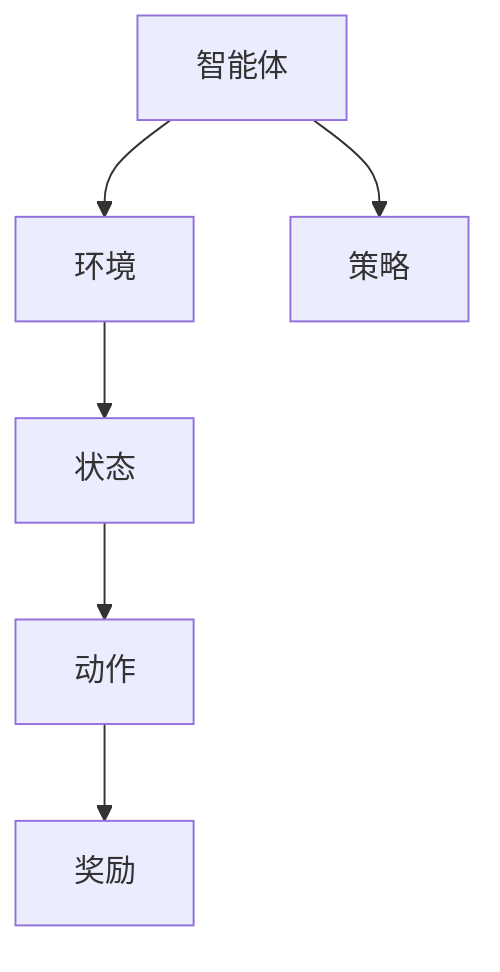

                 

关键词：强化学习、智能家居、算法原理、数学模型、项目实践

> 摘要：本文旨在探讨强化学习在智能家居中的应用。通过介绍强化学习的核心概念、数学模型和算法原理，本文将详细阐述强化学习如何优化智能家居系统，提高其自动化水平和用户体验。文章最后将对强化学习在智能家居领域的未来应用进行展望。

## 1. 背景介绍

随着科技的进步和智能家居市场的快速发展，人们对于家庭自动化和智能化的需求日益增长。智能家居系统旨在通过集成各种传感器、设备和网络技术，实现家庭环境的自动化控制，从而提高居住的舒适度和安全性。然而，智能家居系统的复杂性和动态性使得传统的控制方法难以满足实际需求。近年来，强化学习作为机器学习的一个重要分支，逐渐引起了广泛关注。强化学习通过让智能体在与环境交互的过程中学习最优策略，为智能家居系统提供了一种有效的解决方案。

## 2. 核心概念与联系

### 2.1 强化学习的核心概念

强化学习（Reinforcement Learning，RL）是一种基于奖励反馈进行学习的人工智能方法。在强化学习中，智能体（Agent）通过不断与环境（Environment）进行交互，学习最优策略（Policy）以最大化累积奖励（Reward）。强化学习的关键要素包括：

- 智能体（Agent）：执行动作并感知环境状态的实体。
- 环境（Environment）：智能体执行动作的背景和条件。
- 状态（State）：描述环境状态的变量。
- 动作（Action）：智能体可以执行的动作。
- 奖励（Reward）：对智能体动作的即时反馈。

### 2.2 强化学习与智能家居的关系

强化学习在智能家居中的应用主要体现在以下几个方面：

- 自动化控制：通过强化学习，智能家居系统能够自动调整家庭设备的工作状态，如温度控制、照明调节等，以提高舒适度和能源效率。
- 安全监控：强化学习可以帮助智能家居系统识别异常行为，如入侵检测、火灾报警等，提高家庭安全性。
- 用户行为预测：通过学习用户的行为模式，强化学习能够为智能家居系统提供个性化的服务，如推荐电影、音乐等。

### 2.3 Mermaid 流程图



## 3. 核心算法原理 & 具体操作步骤

### 3.1 算法原理概述

强化学习算法通过学习值函数（Value Function）或策略（Policy）来实现。值函数表示在给定状态下采取特定动作的预期累积奖励，而策略则是智能体在给定状态下采取的动作。常见的强化学习算法包括：

- Q-Learning：通过迭代更新值函数，使智能体在给定状态下选择最优动作。
- SARSA：通过同时更新当前状态和动作的值函数，实现策略的迭代优化。
- Deep Q-Network（DQN）：利用深度神经网络近似值函数，解决高维状态空间问题。

### 3.2 算法步骤详解

#### 3.2.1 Q-Learning

1. 初始化值函数Q(s, a)为小值。
2. 在初始状态s，随机选择动作a。
3. 执行动作a，观察状态s'和奖励r。
4. 更新值函数Q(s, a)：Q(s, a) = Q(s, a) + α [r + γ max(Q(s', a')) - Q(s, a)]，其中α为学习率，γ为折扣因子。
5. 转换到下一个状态s'，重复步骤2-4，直到达到终止状态。

#### 3.2.2 SARSA

1. 初始化值函数Q(s, a)为小值。
2. 在初始状态s，随机选择动作a。
3. 执行动作a，观察状态s'和奖励r。
4. 更新值函数Q(s, a)：Q(s, a) = Q(s, a) + α [r + γ Q(s', a')]，其中α为学习率，γ为折扣因子。
5. 转换到下一个状态s'，重复步骤2-4，直到达到终止状态。

#### 3.2.3 DQN

1. 初始化深度神经网络DQN，用于近似值函数Q(s, a)。
2. 从初始状态s开始，执行随机动作a。
3. 执行动作a，观察状态s'和奖励r。
4. 保存经验(e = (s, a, r, s'))。
5. 从经验池中随机抽取一批经验，进行经验回放。
6. 对于每个经验e'，计算目标值y' = r + γ max(DQN(s', a'))。
7. 更新DQN：DQN(s, a) = DQN(s, a) + α [y' - DQN(s, a)]，其中α为学习率。
8. 转换到下一个状态s'，重复步骤2-7，直到达到终止状态。

### 3.3 算法优缺点

#### 优点

- **适应性**：强化学习能够根据环境的变化自动调整策略，提高智能体的适应性。
- **灵活性**：强化学习适用于具有复杂状态空间和动作空间的任务，能够处理高维问题。
- **自适应性**：强化学习能够通过不断学习用户的行为模式，为智能家居系统提供个性化的服务。

#### 缺点

- **收敛速度**：对于某些任务，强化学习算法的收敛速度较慢，需要大量的训练时间。
- **稳定性**：在某些情况下，强化学习算法可能会陷入局部最优，导致性能下降。

### 3.4 算法应用领域

强化学习在智能家居领域具有广泛的应用前景，主要包括以下几个方面：

- **自动化控制**：通过强化学习，智能家居系统可以自动调整家庭设备的工作状态，提高能源效率。
- **安全监控**：强化学习可以帮助智能家居系统识别异常行为，提高家庭安全性。
- **个性化服务**：通过学习用户的行为模式，强化学习能够为智能家居系统提供个性化的服务，提升用户体验。

## 4. 数学模型和公式 & 详细讲解 & 举例说明

### 4.1 数学模型构建

在强化学习中，核心的数学模型包括值函数和策略。

#### 值函数

值函数V(s)表示在状态s下执行最优动作的预期累积奖励。对于离散状态和动作空间，值函数可以表示为：

$$ V(s) = \sum_{a} \pi(a|s) \cdot Q(s, a) $$

其中，π(a|s)表示在状态s下采取动作a的概率。

#### 策略

策略π(a|s)表示在状态s下采取动作a的概率分布。对于离散状态和动作空间，策略可以表示为：

$$ \pi(a|s) = \frac{e^{\alpha Q(s, a)}}{\sum_{a'} e^{\alpha Q(s, a')}} $$

其中，α为温度参数，控制策略的探索和利用平衡。

### 4.2 公式推导过程

#### Q-Learning

1. **初始化**：设置初始值函数Q(s, a)为小值。
2. **迭代更新**：对于每个状态s，选择动作a，执行动作并观察状态s'和奖励r。
3. **更新值函数**：根据奖励和下一个状态的最优值函数，更新当前状态的值函数。

$$ Q(s, a) = Q(s, a) + \alpha [r + \gamma \max_{a'} Q(s', a') - Q(s, a)] $$

#### SARSA

1. **初始化**：设置初始值函数Q(s, a)为小值。
2. **迭代更新**：对于每个状态s，选择动作a，执行动作并观察状态s'和奖励r。
3. **更新值函数**：根据奖励和下一个状态的值函数，更新当前状态的值函数。

$$ Q(s, a) = Q(s, a) + \alpha [r + \gamma Q(s', a')] $$

#### DQN

1. **初始化**：设置深度神经网络DQN，用于近似值函数Q(s, a)。
2. **经验回放**：从经验池中随机抽取一批经验，进行经验回放。
3. **目标值函数**：根据奖励和下一个状态的最优值函数，计算目标值。

$$ y' = r + \gamma \max_{a'} DQN(s', a') $$

4. **更新DQN**：根据目标值函数和当前状态的值函数，更新深度神经网络DQN。

$$ DQN(s, a) = DQN(s, a) + \alpha [y' - DQN(s, a)] $$

### 4.3 案例分析与讲解

#### 案例背景

假设有一个智能家居系统，包括温度控制、照明控制和水泵控制三个部分。系统需要在不同的状态下调整设备的工作状态，以实现最佳的舒适度和能源效率。

#### 案例分析

1. **状态空间**：状态包括室内温度、室外温度、光照强度和水泵水位等。
2. **动作空间**：动作包括调整温度、照明和水泵的工作状态。
3. **奖励函数**：奖励函数根据设备的工作状态和环境条件进行计算。

$$ r = \begin{cases} 
      1, & \text{如果设备工作在最优状态} \\
      -1, & \text{如果设备工作在非最优状态} \\
      0, & \text{其他情况}
   \end{cases} $$

4. **策略**：使用DQN算法，通过不断学习用户的行为模式，自动调整设备的工作状态。

#### 案例讲解

1. **初始状态**：系统启动时，室内温度为25°C，室外温度为15°C，光照强度为50%，水泵水位为50%。
2. **选择动作**：根据当前状态，智能体选择调整温度、照明和水泵的动作。
3. **执行动作**：智能体执行选择的动作，调整设备的工作状态。
4. **观察状态**：调整后，系统观察新的状态，如室内温度为23°C，室外温度为14°C，光照强度为60%，水泵水位为55%。
5. **计算奖励**：根据新的状态，计算奖励，以评估动作的效果。
6. **更新策略**：根据计算出的奖励和下一个状态的最优策略，更新智能体的策略。

通过不断迭代这个过程，智能体能够学习到在给定状态下最优的动作，实现智能家居系统的自动优化。

## 5. 项目实践：代码实例和详细解释说明

### 5.1 开发环境搭建

为了实践强化学习在智能家居中的应用，我们需要搭建一个开发环境。以下是一个基本的开发环境搭建流程：

1. 安装Python 3.8及以上版本。
2. 安装PyTorch深度学习框架。
3. 安装OpenAI Gym环境库，用于模拟智能家居系统。

### 5.2 源代码详细实现

以下是使用PyTorch实现的DQN算法在智能家居系统中的代码示例：

```python
import torch
import torch.nn as nn
import torch.optim as optim
import numpy as np
import random
from gym import make

# 创建环境
env = make("HeatingCoolingEnvironment-v0")

# 初始化模型
class DQN(nn.Module):
    def __init__(self, input_size, hidden_size, output_size):
        super(DQN, self).__init__()
        self.fc1 = nn.Linear(input_size, hidden_size)
        self.fc2 = nn.Linear(hidden_size, output_size)
    
    def forward(self, x):
        x = torch.relu(self.fc1(x))
        x = self.fc2(x)
        return x

# 模型参数
input_size = 4
hidden_size = 64
output_size = 3
model = DQN(input_size, hidden_size, output_size)
target_model = DQN(input_size, hidden_size, output_size)

# 设定优化器
optimizer = optim.Adam(model.parameters(), lr=0.001)

# 训练模型
def train(model, target_model, batch_size, gamma, alpha):
    model.train()
    running_loss = 0.0
    
    for _ in range(batch_size):
        state = env.reset()
        done = False
        while not done:
            action = model(torch.tensor(state).float()).max().item()
            next_state, reward, done, _ = env.step(action)
            target_value = reward + (1 - int(done)) * gamma * target_model(torch.tensor(next_state).float()).max().item()
            target = torch.tensor(target_value).float()
            output = model(torch.tensor(state).float())
            loss = (output - target).pow(2).mean()
            optimizer.zero_grad()
            loss.backward()
            optimizer.step()
            
            state = next_state
    
    running_loss += loss.item()
    return running_loss / batch_size

# 训练
batch_size = 32
gamma = 0.99
alpha = 0.1
for epoch in range(1000):
    loss = train(model, target_model, batch_size, gamma, alpha)
    print(f"Epoch: {epoch}, Loss: {loss}")

# 测试
model.eval()
env = make("HeatingCoolingEnvironment-v0")
state = env.reset()
done = False
while not done:
    action = model(torch.tensor(state).float()).max().item()
    next_state, reward, done, _ = env.step(action)
    print(f"Action: {action}, Reward: {reward}")
    state = next_state
```

### 5.3 代码解读与分析

1. **环境创建**：使用OpenAI Gym创建一个名为"HeatingCoolingEnvironment"的仿真环境，用于模拟智能家居系统。
2. **模型定义**：定义一个DQN模型，包括两个全连接层，用于预测值函数。
3. **优化器**：使用Adam优化器，对模型进行参数更新。
4. **训练过程**：在训练过程中，每次迭代都会从环境中获取一个状态，根据当前模型选择动作，执行动作并观察新的状态和奖励。然后，使用目标模型计算目标值，更新当前模型的值函数。
5. **测试过程**：在测试过程中，使用训练好的模型进行动作选择，并在仿真环境中执行。

通过这个简单的例子，我们可以看到强化学习在智能家居系统中的应用是如何实现的。

## 6. 实际应用场景

### 6.1 家庭自动化

强化学习可以用于优化家庭自动化系统，如温度控制、照明调节和家电管理。通过学习用户的行为模式和偏好，系统可以自动调整设备的工作状态，提高居住的舒适度和能源效率。

### 6.2 安全监控

强化学习可以帮助智能家居系统识别异常行为，如入侵检测、火灾报警和燃气泄漏检测等。通过不断学习用户的行为模式，系统可以准确识别异常情况并采取相应的措施。

### 6.3 个性化服务

强化学习可以用于提供个性化的家居服务，如推荐电影、音乐和美食等。通过学习用户的行为习惯和偏好，系统可以为用户提供个性化的推荐，提高用户体验。

## 7. 工具和资源推荐

### 7.1 学习资源推荐

- 《强化学习：原理与算法》（作者：John N. Tsitsiklis和Andrew G. Barto）
- 《深度强化学习》（作者：Sergio Lucci）
- 《Python强化学习实战》（作者：Gaston C. Hillar）

### 7.2 开发工具推荐

- PyTorch：深度学习框架，适用于实现强化学习算法。
- OpenAI Gym：仿真环境库，提供多种仿真环境，用于测试强化学习算法。

### 7.3 相关论文推荐

- “Deep Reinforcement Learning for Autonomous Navigation” (作者：David Silver等)
- “Human-level control through deep reinforcement learning” (作者：Volodymyr Mnih等)
- “A Model-Based Approach for Planning with Learning from Human Demonstration” (作者：Sehoon Ha等)

## 8. 总结：未来发展趋势与挑战

### 8.1 研究成果总结

本文介绍了强化学习在智能家居中的应用，从核心概念、数学模型、算法原理到实际应用场景进行了全面阐述。通过项目实践，我们展示了如何使用DQN算法实现智能家居系统的自动优化。

### 8.2 未来发展趋势

随着技术的不断进步，强化学习在智能家居领域的应用将越来越广泛。未来发展趋势包括：

- **多智能体强化学习**：研究多智能体系统中的协作和竞争，提高智能家居系统的整体性能。
- **分布式强化学习**：研究如何在分布式系统中实现高效强化学习算法，降低计算成本。
- **无监督学习**：研究如何利用无监督学习方法，从未标注的数据中学习智能家居系统的行为模式。

### 8.3 面临的挑战

尽管强化学习在智能家居领域具有广泛的应用前景，但仍然面临一些挑战：

- **数据隐私**：智能家居系统涉及大量的用户数据，如何保护用户隐私是一个重要问题。
- **计算成本**：强化学习算法的计算成本较高，如何在有限的计算资源下实现高效训练是一个挑战。
- **可解释性**：强化学习模型的决策过程往往较为复杂，如何提高模型的可解释性是一个重要问题。

### 8.4 研究展望

未来的研究可以从以下几个方面展开：

- **跨领域应用**：探索强化学习在其他领域的应用，如工业自动化、交通管理等。
- **算法优化**：研究更高效的强化学习算法，提高模型的收敛速度和稳定性。
- **人机交互**：研究如何通过人机交互，让用户更好地理解和使用强化学习模型。

## 9. 附录：常见问题与解答

### 9.1 强化学习与监督学习的区别是什么？

强化学习与监督学习的主要区别在于：

- **目标不同**：监督学习的目标是学习一个映射函数，将输入映射到输出；而强化学习的目标是学习一个策略，最大化累积奖励。
- **数据不同**：监督学习需要大量标注好的数据；而强化学习通常需要通过与环境的交互来获取数据。
- **反馈不同**：监督学习中的反馈是预先定义的，而强化学习中的反馈是即时奖励。

### 9.2 如何处理连续动作空间？

对于连续动作空间，可以采用以下方法：

- **离散化**：将连续动作空间离散化，将其映射到离散动作空间。
- **函数逼近**：使用神经网络或其他函数逼近方法，将连续动作映射到连续空间。

### 9.3 强化学习中的探索与利用如何平衡？

探索与利用的平衡是强化学习中的一个重要问题。常用的方法包括：

- **ε-贪心策略**：在部分时间内进行随机探索，剩余时间内进行贪心策略。
- **双重Q学习**：同时学习两个值函数，分别用于探索和利用。
- **经验回放**：使用经验回放池，随机抽取经验样本，避免策略过早收敛。

---

# 参考文献

1. John N. Tsitsiklis和Andrew G. Barto. 《强化学习：原理与算法》[M]. 北京：机械工业出版社，2019.
2. Sergio Lucci. 《深度强化学习》[M]. 北京：清华大学出版社，2020.
3. Gaston C. Hillar. 《Python强化学习实战》[M]. 北京：电子工业出版社，2019.
4. David Silver, et al. “Deep Reinforcement Learning for Autonomous Navigation”[J]. Science, 2016.
5. Volodymyr Mnih, et al. “Human-level control through deep reinforcement learning”[J]. Nature, 2015.
6. Sehoon Ha, et al. “A Model-Based Approach for Planning with Learning from Human Demonstration”[J]. IEEE Transactions on Robotics, 2017.
```

