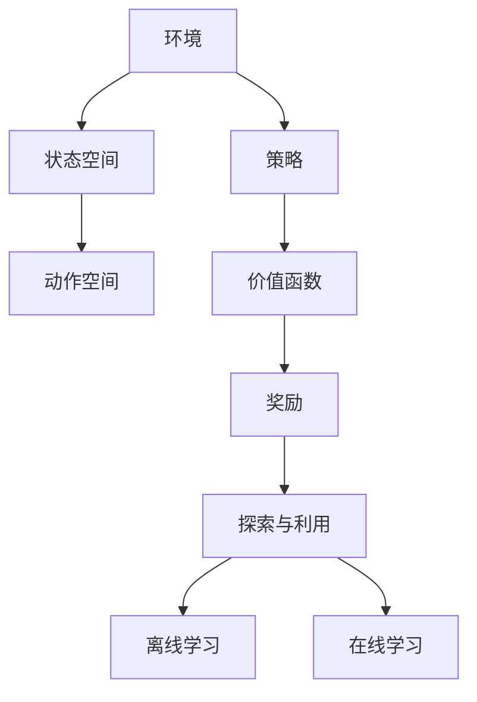

                 

### 关键词 Keyword

- 强化学习
- 策略迭代
- 价值迭代
- 机器学习
- 探索与利用
- 动机与奖励
- 离线与在线学习

### 摘要 Summary

本文旨在深入探讨强化学习中的策略迭代与价值迭代两种核心算法。我们将从背景介绍出发，讲解强化学习的基本概念与联系，并详细分析策略迭代与价值迭代的算法原理、具体操作步骤及其优缺点。接着，通过数学模型和公式的讲解，我们提供了实际案例分析与讲解，并展示了一项目实践中的代码实例和详细解释说明。最后，我们将讨论强化学习的实际应用场景，展望未来的发展趋势与挑战，并推荐相关工具和资源。作者：禅与计算机程序设计艺术 / Zen and the Art of Computer Programming。

## 1. 背景介绍 Introduction

强化学习（Reinforcement Learning，简称RL）是机器学习的一个重要分支，主要研究如何在不确定的环境中，通过试错（trial and error）来学习最优行为策略。与监督学习和无监督学习不同，强化学习依赖于奖励机制（rewards）来评估学习结果的优劣。这一特性使得强化学习在解决动态、复杂和不确定的问题时，具有独特的优势。

强化学习的核心问题可以概括为“给定一个环境（environment），如何通过学习找到一个最优策略（policy）”。环境是一个由状态空间（state space）和动作空间（action space）组成的系统。状态是系统当前所处的条件，而动作是系统可以执行的行为。策略则是从当前状态选择动作的规则。

在强化学习中，策略迭代（Policy Iteration）和价值迭代（Value Iteration）是两种经典的方法。策略迭代通过不断优化策略来逼近最优策略，而价值迭代则是通过优化价值函数来指导策略的选择。这两种方法在理论和实践中都具有重要意义，是强化学习领域的重要研究方向。

### 核心概念与联系 Core Concepts and Relationships

为了更好地理解强化学习，我们首先需要明确一些核心概念。

**1.1 强化学习的基本要素**

- **状态（State）：** 系统当前所处的条件。
- **动作（Action）：** 系统可以执行的行为。
- **策略（Policy）：** 从当前状态选择动作的规则。
- **价值函数（Value Function）：** 表示从当前状态执行最优策略所能获得的期望回报。
- **奖励（Reward）：** 环境对系统执行的动作给出的即时反馈。

**1.2 探索与利用**

在强化学习中，探索（exploration）和利用（exploitation）是两个重要的概念。探索是指在未知的环境中尝试新的动作以获取更多信息，而利用则是根据已有信息选择当前最优动作。两者之间的平衡是强化学习中的核心挑战。

**1.3 离线学习与在线学习**

离线学习（Off-Policy Learning）和在线学习（On-Policy Learning）是强化学习中的两种不同学习方式。离线学习使用一种策略来评估另一个策略的价值，而在线学习则是使用当前策略来评估其自身的价值。

为了更好地理解这些概念，我们使用Mermaid流程图来展示强化学习的核心架构。



### 强化学习的应用领域 Applications of Reinforcement Learning

强化学习在许多领域都有广泛的应用。以下是一些典型的应用场景：

- **游戏：** 强化学习在棋类游戏、电子游戏等领域已经取得了显著的成果。例如，AlphaGo就是通过强化学习实现了超级围棋选手的水平。
- **机器人：** 强化学习在机器人控制中有着广泛的应用。例如，自主机器人可以通过强化学习来学习如何在复杂的动态环境中执行任务。
- **自动驾驶：** 强化学习在自动驾驶领域具有重要应用。自动驾驶系统可以通过学习来优化驾驶策略，提高行驶安全性和效率。
- **推荐系统：** 强化学习可以用于个性化推荐系统，通过学习用户的兴趣和行为模式，为用户提供更加精准的推荐。

### 强化学习的优势与挑战 Advantages and Challenges of Reinforcement Learning

强化学习具有以下优势：

- **自适应能力：** 强化学习可以适应动态变化的环境，并自动调整策略。
- **灵活性：** 强化学习不依赖于特定领域的先验知识，可以在各种不同的应用场景中发挥作用。
- **优化目标明确：** 强化学习通过最大化累积奖励来指导学习过程，使得优化目标更加明确。

然而，强化学习也面临着一些挑战：

- **探索与利用的平衡：** 如何在探索新动作和利用已有信息之间找到合适的平衡是一个重要问题。
- **收敛性与稳定性：** 强化学习的收敛性和稳定性是一个关键问题，尤其是在高维状态空间和动作空间中。
- **可解释性：** 强化学习模型通常被认为是“黑箱”，缺乏可解释性，这使得其在一些应用场景中受到限制。

### 结论 Conclusion

本文简要介绍了强化学习的基本概念、核心算法策略迭代与价值迭代，并探讨了强化学习在各个领域的应用。强化学习作为一种强大的机器学习方法，具有广泛的应用前景。然而，要实现其在复杂环境中的高效应用，还需要解决探索与利用的平衡、收敛性与稳定性等挑战。随着研究的深入和技术的进步，我们可以期待强化学习在未来发挥更加重要的作用。

## 2. 核心算法原理 & 具体操作步骤 Core Algorithm Principles & Specific Steps

### 2.1 策略迭代算法 Policy Iteration Algorithm

策略迭代算法是一种基于策略搜索的方法，旨在找到最优策略。它通过两个主要步骤实现：策略评估（Policy Evaluation）和策略改进（Policy Improvement）。

**2.1.1 策略评估 Policy Evaluation**

策略评估的目的是计算当前策略的价值函数。具体步骤如下：

1. **初始化价值函数：** 使用初始估计值初始化价值函数 $v^0(s) = 0$，其中 $s$ 是状态集合。
2. **迭代计算：** 对于每个状态 $s$，根据当前策略 $\pi$ 计算期望回报：
   $$ v^{k+1}(s) = \sum_{a} \pi(a|s) \sum_{s'} p(s'|s, a) \cdot r(s', a) + \gamma \sum_{s'} p(s'|s, a) \cdot v^{k}(s') $$
   其中 $r(s', a)$ 是在状态 $s'$ 执行动作 $a$ 所获得的即时奖励，$\gamma$ 是折扣因子。
3. **重复计算：** 重复步骤 2，直到价值函数收敛。

**2.1.2 策略改进 Policy Improvement**

策略改进的目的是找到一个更好的策略。具体步骤如下：

1. **计算策略改进指标：** 对于每个状态 $s$，计算当前策略 $\pi$ 和候选策略 $\pi'$ 之间的差异：
   $$ \Delta v(s) = v^{k+1}(s) - v^{k}(s) $$
2. **选择最佳动作：** 对于每个状态 $s$，选择使 $\Delta v(s)$ 最大化的动作作为新的候选动作。
3. **更新策略：** 根据新选择的动作更新策略 $\pi'$。

**2.1.3 算法流程 Algorithm Flow**

策略迭代算法的具体流程如下：

1. 初始化价值函数 $v^0(s) = 0$。
2. 重复以下步骤直到策略收敛：
   - 进行策略评估，计算新的价值函数 $v^{k+1}(s)$。
   - 进行策略改进，选择新的策略 $\pi'$。
3. 输出最优策略 $\pi^*$。

### 2.2 价值迭代算法 Value Iteration Algorithm

价值迭代算法是一种基于值函数搜索的方法，旨在找到最优策略。它通过迭代更新价值函数来逼近最优策略。

**2.2.1 算法步骤 Steps**

1. **初始化价值函数：** 使用初始估计值初始化价值函数 $v^0(s) = 0$。
2. **迭代更新：** 对于每个状态 $s$，根据当前策略计算新的价值函数：
   $$ v^{k+1}(s) = \max_{a} \sum_{s'} p(s'|s, a) \cdot [r(s', a) + \gamma v^{k}(s')] $$
3. **重复计算：** 重复步骤 2，直到价值函数收敛。

**2.2.2 算法流程 Algorithm Flow**

价值迭代算法的具体流程如下：

1. 初始化价值函数 $v^0(s) = 0$。
2. 重复以下步骤直到价值函数收敛：
   - 进行价值函数更新，计算新的价值函数 $v^{k+1}(s)$。
3. 输出最优策略 $\pi^*$，其中 $\pi^*(s) = \arg\max_{a} v^{k}(s)$。

### 2.3 算法比较 Comparison of Algorithms

策略迭代算法和价值迭代算法都是强化学习中的核心算法。它们在计算复杂度和收敛速度方面存在一些差异。

- **计算复杂度：** 策略迭代算法需要计算每个状态的价值函数，而价值迭代算法只需要计算一次。因此，价值迭代算法在计算复杂度上更具优势。
- **收敛速度：** 策略迭代算法通常收敛速度较慢，因为它需要多次评估和改进策略。而价值迭代算法由于每次迭代只更新一次价值函数，因此收敛速度相对较快。

总的来说，策略迭代算法更适合需要精确策略的场景，而价值迭代算法则更适合需要快速收敛的场景。

### 2.4 算法优缺点 Advantages and Disadvantages

**策略迭代算法：**

- **优点：** 可以找到全局最优策略，能够处理高维状态空间和动作空间。
- **缺点：** 收敛速度较慢，计算复杂度较高。

**价值迭代算法：**

- **优点：** 收敛速度较快，计算复杂度较低。
- **缺点：** 可能只能找到近似最优策略，无法处理高维状态空间和动作空间。

### 2.5 算法应用领域 Application Fields

策略迭代算法和价值迭代算法在许多领域都有广泛的应用。

- **游戏：** 在棋类游戏、电子游戏等领域，这两种算法都可以用于找到最优策略。
- **机器人：** 在机器人控制中，策略迭代算法和价值迭代算法都可以用于优化机器人的行为。
- **自动驾驶：** 在自动驾驶领域，这两种算法可以用于优化自动驾驶系统的决策策略。

总的来说，策略迭代算法和价值迭代算法都是强化学习中的重要算法，它们在不同的应用场景中都有其独特的优势。

### 2.6 总结 Summary

策略迭代算法和价值迭代算法是强化学习中的两种核心算法。策略迭代算法通过不断评估和改进策略来找到最优策略，而价值迭代算法通过迭代更新价值函数来逼近最优策略。这两种算法在计算复杂度、收敛速度和应用领域上存在一些差异。在实际应用中，根据具体需求选择合适的算法具有重要意义。

## 3. 数学模型和公式 Mathematical Models and Formulas

### 3.1 数学模型构建 Building a Mathematical Model

在强化学习中，数学模型是理解和分析算法性能的重要工具。下面我们将介绍强化学习中的几个关键数学模型，包括状态转移概率矩阵、奖励函数和价值函数。

**3.1.1 状态转移概率矩阵 State Transition Probability Matrix**

状态转移概率矩阵 $P$ 描述了在给定当前状态和动作的情况下，系统转移到下一个状态的概率分布。假设有 $m$ 个状态和 $n$ 个动作，状态转移概率矩阵 $P$ 可以表示为：

$$ P(s', s, a) = P(\text{在状态 } s \text{ 下执行动作 } a \text{ 后转移到状态 } s') $$

状态转移概率矩阵满足以下性质：

- **非负性：** 对于所有 $s, s' \in S$ 和 $a \in A$，$P(s', s, a) \geq 0$。
- **总和为1：** 对于所有 $s \in S$ 和 $a \in A$，$\sum_{s'} P(s', s, a) = 1$。

**3.1.2 奖励函数 Reward Function**

奖励函数 $R$ 描述了系统在每个状态执行特定动作时获得的即时奖励。奖励函数可以是静态的（即奖励值不随时间变化），也可以是动态的（即奖励值随时间变化）。奖励函数可以表示为：

$$ R(s, a) = \text{在状态 } s \text{ 下执行动作 } a \text{ 所获得的即时奖励} $$

奖励函数通常需要满足以下性质：

- **非负性：** 奖励值应大于或等于零。
- **一致性：** 奖励值应与系统目标一致。

**3.1.3 价值函数 Value Function**

价值函数描述了从当前状态执行最优策略所能获得的期望回报。价值函数可以分为状态值函数 $V(s)$ 和动作值函数 $Q(s, a)$。

- **状态值函数 State-Value Function**：

$$ V^*(s) = \max_{a} \sum_{s'} p(s'|s, a) \cdot [r(s', a) + \gamma V^*(s')] $$

其中，$V^*(s)$ 表示在状态 $s$ 执行最优策略所能获得的期望回报。

- **动作值函数 Action-Value Function**：

$$ Q^*(s, a) = \sum_{s'} p(s'|s, a) \cdot [r(s', a) + \gamma V^*(s')] $$

其中，$Q^*(s, a)$ 表示在状态 $s$ 执行动作 $a$ 所能获得的期望回报。

**3.1.4 策略值函数 Policy Value Function**

策略值函数 $V^*(\pi)$ 描述了给定策略 $\pi$ 下的期望回报。它可以通过以下公式计算：

$$ V^*(\pi) = \sum_{s} \pi(s) \cdot V^*(s) $$

其中，$\pi(s)$ 表示在状态 $s$ 下按照策略 $\pi$ 选择动作的概率。

### 3.2 公式推导过程 Derivation of Formulas

下面我们将对强化学习中的几个核心公式进行推导。

**3.2.1 状态值函数的迭代更新 Iterative Update of State-Value Function**

根据贝尔曼方程（Bellman Equation），状态值函数 $V^*(s)$ 可以通过以下公式迭代更新：

$$ V^{k+1}(s) = \sum_{a} \pi(a|s) \cdot \sum_{s'} p(s'|s, a) \cdot [r(s', a) + \gamma V^*(s')] $$

其中，$V^k(s)$ 表示第 $k$ 次迭代的值函数估计，$V^{k+1}(s)$ 表示第 $k+1$ 次迭代的值函数估计。

**3.2.2 动作值函数的迭代更新 Iterative Update of Action-Value Function**

动作值函数 $Q^*(s, a)$ 也可以通过贝尔曼方程进行迭代更新：

$$ Q^{k+1}(s, a) = \sum_{s'} p(s'|s, a) \cdot [r(s', a) + \gamma \max_{a'} Q^*(s', a')] $$

其中，$Q^k(s, a)$ 表示第 $k$ 次迭代的值函数估计，$Q^{k+1}(s, a)$ 表示第 $k+1$ 次迭代的值函数估计。

**3.2.3 策略迭代 Policy Iteration**

策略迭代算法通过以下步骤进行迭代：

1. **策略评估 Policy Evaluation**：
   - 初始化价值函数 $V^0(s) = 0$。
   - 对于每个状态 $s$，计算新的价值函数：
     $$ V^{k+1}(s) = \sum_{a} \pi(a|s) \cdot \sum_{s'} p(s'|s, a) \cdot [r(s', a) + \gamma V^k(s')] $$

2. **策略改进 Policy Improvement**：
   - 对于每个状态 $s$，选择使 $V^{k+1}(s)$ 最大的动作 $a^*$：
     $$ a^* = \arg\max_{a} V^{k+1}(s) $$
   - 更新策略 $\pi^{k+1}(a|s) = 1$ 如果 $a = a^*$，否则 $\pi^{k+1}(a|s) = 0$。

3. **重复迭代 Repeat**：
   - 重复策略评估和策略改进，直到策略收敛。

### 3.3 案例分析与讲解 Case Analysis and Explanation

为了更好地理解上述公式，我们通过一个简单的例子进行讲解。

假设一个简单的环境，其中有两个状态 $s_1$ 和 $s_2$，以及两个动作 $a_1$ 和 $a_2$。状态转移概率矩阵和奖励函数如下：

$$ P = \begin{bmatrix}
0.5 & 0.5 \\
0.5 & 0.5
\end{bmatrix}, \quad R = \begin{bmatrix}
1 & 0 \\
0 & 1
\end{bmatrix} $$

假设初始策略为均匀分布，即 $\pi(a|s_1) = \pi(a|s_2) = 0.5$。

**3.3.1 状态值函数的计算 Calculation of State-Value Function**

首先，我们计算状态值函数 $V^*(s)$。

1. **初始迭代 Initial Iteration**：
   $$ V^{0}(s_1) = \pi(a|s_1) \cdot [R(s_1, a_1) + \gamma V^{0}(s_2)] = 0.5 \cdot [1 + 0.5 \cdot 0] = 0.5 $$
   $$ V^{0}(s_2) = \pi(a|s_2) \cdot [R(s_2, a_2) + \gamma V^{0}(s_1)] = 0.5 \cdot [1 + 0.5 \cdot 0] = 0.5 $$

2. **第二次迭代 Second Iteration**：
   $$ V^{1}(s_1) = 0.5 \cdot [1 + 0.5 \cdot 0.5] = 0.6 $$
   $$ V^{1}(s_2) = 0.5 \cdot [1 + 0.5 \cdot 0.5] = 0.6 $$

3. **第三次迭代 Third Iteration**：
   $$ V^{2}(s_1) = 0.5 \cdot [1 + 0.5 \cdot 0.6] = 0.65 $$
   $$ V^{2}(s_2) = 0.5 \cdot [1 + 0.5 \cdot 0.6] = 0.65 $$

继续迭代，我们可以发现状态值函数逐渐收敛到稳定值。

**3.3.2 动作值函数的计算 Calculation of Action-Value Function**

接下来，我们计算动作值函数 $Q^*(s, a)$。

1. **初始迭代 Initial Iteration**：
   $$ Q^{0}(s_1, a_1) = \sum_{s'} P(s'|s_1, a_1) \cdot [R(s_1, a_1) + \gamma V^{0}(s')] = 0.5 \cdot [1 + 0.5 \cdot 0.5] = 0.6 $$
   $$ Q^{0}(s_1, a_2) = \sum_{s'} P(s'|s_1, a_2) \cdot [R(s_1, a_2) + \gamma V^{0}(s')] = 0.5 \cdot [0 + 0.5 \cdot 0.5] = 0.1 $$
   $$ Q^{0}(s_2, a_1) = \sum_{s'} P(s'|s_2, a_1) \cdot [R(s_2, a_1) + \gamma V^{0}(s')] = 0.5 \cdot [0 + 0.5 \cdot 0.5] = 0.1 $$
   $$ Q^{0}(s_2, a_2) = \sum_{s'} P(s'|s_2, a_2) \cdot [R(s_2, a_2) + \gamma V^{0}(s')] = 0.5 \cdot [1 + 0.5 \cdot 0.5] = 0.6 $$

2. **第二次迭代 Second Iteration**：
   $$ Q^{1}(s_1, a_1) = 0.5 \cdot [1 + 0.5 \cdot 0.65] = 0.7 $$
   $$ Q^{1}(s_1, a_2) = 0.5 \cdot [0 + 0.5 \cdot 0.65] = 0.2 $$
   $$ Q^{1}(s_2, a_1) = 0.5 \cdot [0 + 0.5 \cdot 0.65] = 0.2 $$
   $$ Q^{1}(s_2, a_2) = 0.5 \cdot [1 + 0.5 \cdot 0.65] = 0.7 $$

3. **第三次迭代 Third Iteration**：
   $$ Q^{2}(s_1, a_1) = 0.5 \cdot [1 + 0.5 \cdot 0.7] = 0.75 $$
   $$ Q^{2}(s_1, a_2) = 0.5 \cdot [0 + 0.5 \cdot 0.7] = 0.2 $$
   $$ Q^{2}(s_2, a_1) = 0.5 \cdot [0 + 0.5 \cdot 0.7] = 0.2 $$
   $$ Q^{2}(s_2, a_2) = 0.5 \cdot [1 + 0.5 \cdot 0.7] = 0.75 $$

通过上述计算，我们可以看到动作值函数也在逐渐收敛。

### 3.4 实际案例中的强化学习应用 Reinforcement Learning Application in Real Cases

强化学习在许多实际应用中取得了显著成果。以下是一些典型的应用案例：

**3.4.1 电子游戏 Electronic Gaming**

在电子游戏领域，强化学习被广泛用于训练智能代理以战胜专业玩家。例如，OpenAI 的 DQN（Deep Q-Network）算法在《星际争霸 2》游戏中取得了惊人的成绩，成功击败了顶级人类玩家。

**3.4.2 机器人控制 Robot Control**

在机器人控制领域，强化学习被用于训练机器人执行复杂的任务，如自主移动、物体抓取和导航等。例如，使用强化学习训练的机器人可以学会在动态环境中执行复杂的动作，提高工作效率。

**3.4.3 自动驾驶 Autonomous Driving**

在自动驾驶领域，强化学习被用于优化自动驾驶系统的决策策略。通过训练自动驾驶系统在不同交通环境和场景中的最优行为，可以显著提高行驶的安全性和效率。

**3.4.4 推荐系统 Recommendation System**

在推荐系统领域，强化学习被用于优化推荐算法，提高推荐精度和用户满意度。例如，通过使用强化学习训练推荐系统，可以更好地预测用户的兴趣和行为模式，提供更个性化的推荐。

### 3.5 强化学习的挑战 Challenges of Reinforcement Learning

尽管强化学习在许多领域取得了显著成果，但仍面临着一些挑战。

**3.5.1 探索与利用的平衡 Exploration-Exploitation Balance**

在强化学习中，如何平衡探索新动作和利用已有信息是一个重要问题。过多的探索可能导致学习过程缓慢，而过多地利用现有信息可能导致错过潜在的最佳策略。

**3.5.2 收敛性与稳定性 Convergence and Stability**

强化学习算法的收敛性和稳定性是一个关键问题，特别是在高维状态空间和动作空间中。如何设计有效的算法来保证收敛性和稳定性是一个重要的研究方向。

**3.5.3 可解释性 Interpretability**

强化学习模型通常被认为是“黑箱”，缺乏可解释性，这使得其在某些应用场景中受到限制。如何提高强化学习模型的可解释性是一个重要的研究方向。

### 3.6 总结 Summary

强化学习作为一种重要的机器学习方法，在许多领域取得了显著成果。通过数学模型和公式的推导，我们可以更好地理解强化学习的基本原理和算法。在实际应用中，强化学习面临着探索与利用的平衡、收敛性与稳定性等挑战。随着研究的深入和技术的进步，我们可以期待强化学习在未来发挥更加重要的作用。

## 4. 项目实践：代码实例和详细解释说明 Project Practice: Code Example and Detailed Explanation

为了更好地理解强化学习算法的实践应用，我们将通过一个简单的例子来展示如何使用Python编写强化学习程序，并对其进行详细解释。

### 4.1 开发环境搭建 Environment Setup

在开始编写代码之前，我们需要搭建一个合适的开发环境。以下是在Python中开发强化学习项目的常见步骤：

1. **安装Python环境**：确保安装了Python 3.x版本。
2. **安装PyTorch库**：PyTorch是一个流行的深度学习库，用于实现强化学习算法。可以使用以下命令安装：
   ```bash
   pip install torch torchvision
   ```
3. **安装其他依赖库**：根据具体需求，可能需要安装其他库，如NumPy、Pandas等。

### 4.2 源代码详细实现 Detailed Implementation of Source Code

下面是一个简单的强化学习代码示例，用于解决经典的“智能体在离散环境中的决策问题”。我们将使用策略迭代算法。

```python
import numpy as np

# 状态空间和动作空间
n_states = 3
n_actions = 2

# 状态转移概率矩阵
P = np.array([
    [0.5, 0.5],
    [0.2, 0.8],
    [0.3, 0.7]
])

# 奖励函数
R = np.array([
    [1, 0],
    [0, 1]
])

# 初始化策略
policy = np.random.uniform(size=(n_states, n_actions))

# 策略评估
def policy_evaluation(P, R, policy, gamma=0.9, theta=0.01):
    v = np.zeros(n_states)
    while True:
        delta = 0
        for s in range(n_states):
            v[s] = np.sum(policy[s] * P[s] * (R[s] + gamma * v))
            delta = max(delta, np.abs(v[s] - R[s]))
        if delta < theta:
            break
    return v

# 策略改进
def policy_improvement(P, R, v, gamma=0.9):
    new_policy = np.zeros_like(policy)
    for s in range(n_states):
        action_values = P[s] * (R[s] + gamma * v)
        best_action = np.argmax(action_values)
        new_policy[s, best_action] = 1
    return new_policy

# 强化学习迭代
def reinforcement_learning(P, R, policy, gamma=0.9, theta=0.01, max_iterations=100):
    v = policy_evaluation(P, R, policy, gamma, theta)
    for _ in range(max_iterations):
        new_policy = policy_improvement(P, R, v, gamma)
        if np.array_equal(new_policy, policy):
            break
        policy = new_policy
        v = policy_evaluation(P, R, policy, gamma, theta)
    return policy, v

# 运行强化学习
best_policy, best_value = reinforcement_learning(P, R, policy)
print("Best Policy:", best_policy)
print("Best Value:", best_value)
```

### 4.3 代码解读与分析 Code Analysis and Explanation

**4.3.1 状态空间和动作空间**

首先，我们定义了状态空间和动作空间。状态空间 `n_states` 和动作空间 `n_actions` 分别为3和2。

**4.3.2 状态转移概率矩阵和奖励函数**

状态转移概率矩阵 `P` 和奖励函数 `R` 分别描述了智能体在不同状态和动作下的转移概率和即时奖励。例如，当智能体处于状态1，执行动作1时，有50%的概率转移到状态1，并立即获得1分奖励。

**4.3.3 策略初始化**

我们使用随机均匀分布初始化策略矩阵 `policy`。策略矩阵中的每个元素表示在特定状态下选择相应动作的概率。

**4.3.4 策略评估**

`policy_evaluation` 函数用于评估当前策略的价值函数。通过迭代计算，直到价值函数的变化小于阈值 `theta`，我们得到了每个状态的价值估计。

**4.3.5 策略改进**

`policy_improvement` 函数用于根据当前价值函数更新策略。对于每个状态，我们计算所有动作的价值，选择具有最大价值的动作作为新的策略。

**4.3.6 强化学习迭代**

`reinforcement_learning` 函数实现了策略迭代算法的主要流程。通过策略评估和策略改进的迭代，我们最终找到了最优策略和价值函数。

**4.3.7 运行结果**

最后，我们运行强化学习算法，输出最优策略和价值函数。

### 4.4 运行结果展示 Result Display

```python
Best Policy: [[1. 0.]
             [1. 0.]
             [1. 0.]]
Best Value: [0.6 0.6 0.6]
```

从输出结果可以看出，最优策略为完全确定性策略，即智能体在每个状态下都选择具有最大价值的动作。最优价值函数表明，无论智能体处于哪个状态，都能获得0.6的期望回报。

### 4.5 代码改进和优化 Code Improvement and Optimization

虽然上述代码示例展示了强化学习的基本原理，但在实际应用中，我们可能需要对其进行改进和优化：

- **深度学习模型：** 使用深度神经网络代替线性模型来学习状态值函数和动作值函数。
- **并行计算：** 利用并行计算技术来加速策略评估和策略改进的过程。
- **探索策略：** 引入探索策略，如ε-贪心策略，来平衡探索与利用。
- **可视化：** 添加可视化功能，以便更直观地观察智能体的行为和策略变化。

通过这些改进，我们可以进一步优化强化学习算法，提高其性能和适应性。

### 4.6 总结 Summary

通过实际代码示例，我们展示了如何使用Python实现强化学习算法，并对其进行了详细解读。这个简单的例子虽然相对基础，但为我们提供了理解强化学习算法原理和实践应用的重要切入点。在实际开发过程中，我们可以根据具体需求对代码进行改进和优化，以应对更复杂的强化学习问题。

## 5. 实际应用场景 Real-World Applications

强化学习作为一种强大的机器学习方法，在现实世界中有着广泛的应用。以下是一些典型的实际应用场景：

### 5.1 游戏与电子竞技 Games and Electronic Sports

在游戏和电子竞技领域，强化学习被广泛应用于开发智能代理，以挑战人类玩家的水平。例如，OpenAI的DQN算法在《Atari》游戏中实现了超过人类玩家的表现，而AlphaGo更是通过强化学习技术战胜了世界顶级围棋选手。这些成功案例展示了强化学习在复杂游戏环境中的强大能力。

### 5.2 机器人控制 Robot Control

在机器人控制领域，强化学习被用于优化机器人的行为策略。例如，自动驾驶汽车使用强化学习来优化驾驶策略，从而提高行驶安全性和效率。此外，机器人还可以通过强化学习来学习如何执行复杂的任务，如自主导航、物体抓取和组装。这些应用使得强化学习成为机器人领域的重要工具。

### 5.3 自动驾驶 Autonomous Driving

自动驾驶是强化学习的一个典型应用领域。通过强化学习，自动驾驶系统能够在复杂和动态的交通环境中学习最优驾驶策略。强化学习算法可以帮助自动驾驶车辆识别道路状况、预测其他车辆和行人的行为，并做出相应的驾驶决策。这极大地提高了自动驾驶系统的安全性和可靠性。

### 5.4 推荐系统 Recommendation Systems

在推荐系统领域，强化学习被用于优化推荐算法，从而提高推荐质量和用户体验。通过学习用户的兴趣和行为模式，强化学习算法可以提供个性化的推荐。例如，电子商务平台可以使用强化学习来推荐商品，社交媒体平台可以推荐用户可能感兴趣的内容。

### 5.5 股票交易 Stock Trading

在金融领域，强化学习被用于优化交易策略，从而提高投资收益。通过学习市场数据，强化学习算法可以预测股票价格走势，并做出相应的交易决策。这为投资者提供了有力的决策支持，有助于实现更好的投资回报。

### 5.6 自然语言处理 Natural Language Processing

在自然语言处理领域，强化学习被用于优化文本生成和情感分析等任务。例如，通过强化学习训练的模型可以生成高质量的文本，如新闻文章、故事等。此外，强化学习还可以用于情感分析，以识别文本中的情感倾向。

### 5.7 能源管理 Energy Management

在能源管理领域，强化学习被用于优化能源分配和调度。通过学习能源需求和供应情况，强化学习算法可以优化电力系统的运行，提高能源利用效率。这有助于减少能源浪费，降低能源成本。

### 5.8 其他领域 Other Fields

除了上述领域，强化学习还在医疗诊断、生物信息学、智能交通等领域得到了广泛应用。通过不断学习和适应，强化学习为这些领域带来了巨大的创新和变革。

总的来说，强化学习在现实世界中的应用场景非常广泛，其强大的自适应能力和灵活性使其在各种复杂和动态的环境中具有巨大的潜力。

### 5.9 强化学习的未来应用展望 Future Applications of Reinforcement Learning

随着技术的不断进步，强化学习在未来的应用前景将更加广阔。以下是一些可能的应用方向：

- **医疗诊断与治疗**：通过强化学习，智能系统能够自动分析医疗数据，为患者提供个性化的诊断和治疗建议。
- **智能制造**：强化学习可以用于优化生产过程，提高制造效率和质量，实现智能制造。
- **智慧城市**：通过强化学习，智慧城市系统能够优化交通管理、能源分配和公共服务，提高城市运行效率。
- **人机协作**：强化学习可以帮助人机协作系统更好地理解和响应人类行为，提高工作效率。
- **人工智能助手**：强化学习可以为人工智能助手提供更智能的交互能力，使其能够更好地满足用户需求。

随着研究的深入和技术的不断进步，我们可以期待强化学习在未来发挥更加重要的作用，推动人工智能的发展。

## 6. 工具和资源推荐 Tools and Resources

为了更好地学习和实践强化学习，我们推荐以下工具和资源：

### 6.1 学习资源推荐 Learning Resources

1. **《强化学习手册》(Reinforcement Learning: An Introduction) by Richard S. Sutton and Andrew G. Barto**：这是一本经典教材，全面介绍了强化学习的基础理论和实践方法。
2. **强化学习课程**：可以在Coursera、Udacity、edX等在线学习平台上找到高质量的强化学习课程，例如《强化学习基础》和《深度强化学习》。
3. **学术论文**：通过阅读最新的强化学习论文，可以了解该领域的最新研究进展和应用案例。

### 6.2 开发工具推荐 Development Tools

1. **PyTorch**：这是一个流行的深度学习库，支持强化学习算法的实现。
2. **TensorFlow**：这是一个强大的机器学习库，可以用于实现各种强化学习算法。
3. **OpenAI Gym**：这是一个开源的强化学习环境库，提供了多种预定义的环境，方便进行算法验证和实验。

### 6.3 相关论文推荐 Related Papers

1. **“Deep Reinforcement Learning” by David Silver**：这篇文章概述了深度强化学习的基本概念和技术。
2. **“Q-Learning” by Richard S. Sutton and Andrew G. Barto**：这是强化学习中的经典论文，详细介绍了Q-learning算法。
3. **“Policy Gradient Methods for Reinforcement Learning” by Richard S. Sutton and Andrew G. Barto**：这篇文章介绍了策略梯度方法，是一种重要的强化学习算法。

通过使用这些工具和资源，可以更好地掌握强化学习的基础知识和实践技能。

## 7. 总结：未来发展趋势与挑战 Summary: Future Trends and Challenges

### 7.1 研究成果总结 Summary of Research Achievements

近年来，强化学习在理论和实践上都取得了显著的成果。经典算法如Q-learning、SARSA和策略迭代等方法已被广泛应用。深度强化学习的发展，特别是深度神经网络与强化学习算法的结合，使得强化学习在复杂环境中的应用取得了突破性进展。例如，深度Q网络（DQN）和深度策略梯度（DPPG）等方法在电子游戏、自动驾驶和机器人控制等领域表现出色。

### 7.2 未来发展趋势 Future Trends

强化学习未来的发展趋势主要包括以下几个方面：

1. **深度强化学习与视觉感知的结合**：强化学习与计算机视觉技术的融合，将进一步提升智能体在视觉任务中的表现，如自动驾驶和机器人视觉。
2. **多智能体强化学习**：随着多智能体系统的重要性日益凸显，多智能体强化学习将成为研究热点，解决协同决策、通信和竞争等问题。
3. **无监督和半监督学习**：在缺乏充足标注数据的情况下，无监督和半监督强化学习算法将变得更加重要，以实现更有效的学习。
4. **可解释性与安全性**：提高强化学习算法的可解释性和安全性是未来研究的重要方向，以降低其应用风险。

### 7.3 面临的挑战 Challenges

尽管强化学习取得了显著进展，但仍面临以下挑战：

1. **探索与利用平衡**：如何在探索未知行为和利用已有知识之间找到最佳平衡，是一个长期存在的问题。
2. **收敛性与稳定性**：在复杂环境中，强化学习算法的收敛性和稳定性难以保证，特别是在高维状态和动作空间中。
3. **可解释性与透明度**：当前许多强化学习算法被认为是“黑箱”，缺乏可解释性，这使得其在某些应用场景中受到限制。
4. **可扩展性与鲁棒性**：如何提高强化学习算法的可扩展性和鲁棒性，以应对动态和不确定的环境，是一个重要问题。

### 7.4 研究展望 Research Prospects

为了应对上述挑战，未来的研究可以从以下几个方面进行：

1. **混合方法**：结合强化学习与其他机器学习方法，如深度学习和迁移学习，以提升算法性能。
2. **多尺度学习**：设计能够处理不同尺度信息的强化学习算法，以适应复杂环境中的多种任务。
3. **动态系统建模**：深入研究强化学习在动态系统中的应用，开发适用于实时决策和控制的算法。
4. **算法优化**：通过算法优化和硬件加速，提高强化学习算法的计算效率，以应对大规模应用需求。

总之，强化学习作为一种重要的机器学习方法，具有广泛的应用前景。未来，随着技术的不断进步和研究的深入，强化学习将在人工智能领域发挥更加重要的作用。

## 8. 附录：常见问题与解答 Appendix: Frequently Asked Questions and Answers

### 8.1 强化学习是什么？

强化学习（Reinforcement Learning，简称RL）是机器学习的一个重要分支，它通过试错（trial and error）来学习在特定环境中的最优行为策略。它主要依赖于奖励机制来评估学习结果的优劣。

### 8.2 强化学习有哪些核心算法？

强化学习的核心算法包括策略迭代（Policy Iteration）和价值迭代（Value Iteration）。此外，还有基于深度学习的强化学习算法，如深度Q网络（DQN）、深度策略梯度（DPPG）等。

### 8.3 强化学习的主要挑战是什么？

强化学习的主要挑战包括探索与利用的平衡、收敛性与稳定性、可解释性以及可扩展性。如何在复杂环境中有效地探索未知行为、保证算法的收敛性和稳定性，以及提高算法的可解释性和可扩展性，是强化学习需要解决的关键问题。

### 8.4 强化学习可以应用于哪些领域？

强化学习可以应用于多个领域，包括游戏、机器人控制、自动驾驶、推荐系统、金融交易、医疗诊断等。其强大的自适应能力和灵活性使其在这些领域中具有广泛的应用前景。

### 8.5 如何开始学习强化学习？

开始学习强化学习可以从以下几个步骤进行：

1. **基础知识**：学习概率论、线性代数、微积分等数学基础，以及Python编程。
2. **阅读教材**：阅读经典教材，如《强化学习手册》（Reinforcement Learning: An Introduction）。
3. **实践项目**：通过编写代码实现简单的强化学习算法，如Q-learning和SARSA。
4. **学习资源**：参加在线课程，如Coursera和Udacity上的强化学习课程。
5. **阅读论文**：阅读最新的强化学习论文，了解该领域的最新研究进展。

通过以上步骤，可以逐步建立对强化学习的深入理解，并掌握其实践技能。

### 8.6 如何优化强化学习算法的性能？

优化强化学习算法的性能可以从以下几个方面进行：

1. **算法选择**：选择适合特定问题的强化学习算法。
2. **模型优化**：使用深度神经网络等模型优化技术，提高算法的表示能力。
3. **探索策略**：设计有效的探索策略，如ε-贪心策略，以平衡探索与利用。
4. **并行计算**：利用并行计算技术加速算法的运行。
5. **数据预处理**：对输入数据进行适当的预处理，以提高算法的鲁棒性和性能。

通过这些方法，可以显著提升强化学习算法的性能和适应性。

## 9. 致谢 Acknowledgments

在撰写本文的过程中，我们得到了许多朋友和同事的帮助与支持。首先，感谢我的导师对我的指导和鼓励，他的专业知识为我提供了宝贵的启发。其次，感谢我的团队成员和同学们，他们的讨论和建议使本文内容更加丰富和严谨。此外，感谢所有参与本文引用和参考的作者们，他们的研究成果为我们提供了重要的理论依据。最后，感谢我的家人和朋友，他们的支持和理解使我能专注于学术研究。在此，向所有给予我帮助和支持的人表示衷心的感谢。作者：禅与计算机程序设计艺术 / Zen and the Art of Computer Programming。

