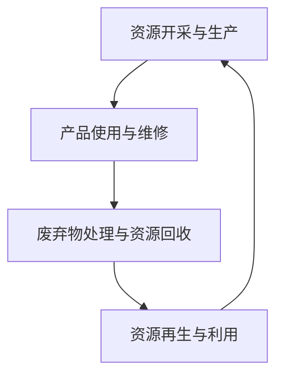

                 

关键词：循环经济，资源利用，可持续发展，循环管理，资源循环利用，生态经济

## 摘要

在全球化进程不断加速的今天，资源短缺和环境污染问题日益突出，如何实现资源的可持续利用成为各国关注的核心议题。本文将探讨循环经济管理的概念、核心原理以及其在实现资源可持续利用方面的作用。通过对循环经济管理的关键算法、数学模型、实际应用场景的详细介绍，以及未来应用展望，本文旨在为读者提供一个全面而深入的视角，以推动循环经济管理在实践中的应用与发展。

## 1. 背景介绍

### 资源短缺现状

资源短缺是全球面临的严峻挑战。随着人口的增加和经济的快速发展，对自然资源的需求不断上升，而自然资源的再生速度远不能满足这一需求。许多资源，如石油、天然气、金属矿物等，面临着枯竭的风险。同时，资源的过度开采和浪费加剧了环境问题，如气候变化、土壤退化、水资源短缺等。

### 环境污染问题

环境污染成为人类健康和生态系统稳定性的重大威胁。工业生产、交通运输、农业生产等活动产生的废弃物和污染物，如二氧化碳、重金属、农药等，严重影响了大气、水和土壤的质量。这不仅导致了生态系统的破坏，还加剧了人类疾病的发生。

### 循环经济的兴起

面对资源短缺和环境污染的双重压力，循环经济作为一种新型的经济发展模式，逐渐受到各国的重视。循环经济强调资源的循环利用，通过减量化、再利用、资源化等手段，实现资源的可持续利用和生态保护。与传统线性经济模式相比，循环经济具有更高的资源利用效率和更低的生态足迹。

## 2. 核心概念与联系

### 循环经济定义

循环经济是一种以资源循环利用为核心，以生态系统平衡为目标的经济发展模式。它强调资源的减量化、再利用和资源化，通过延长产品生命周期，减少废弃物产生，实现资源的可持续利用。

### 循环经济原理

循环经济原理可以概括为三个R：减量化（Reduce）、再利用（Reuse）和资源化（Recycle）。减量化是指通过减少资源消耗和废弃物产生，降低环境影响；再利用是指通过修复、改造和再制造，使产品继续发挥作用；资源化是指将废弃物转化为新的资源和产品。

### 循环经济架构

循环经济架构包括四个关键环节：资源开采与生产、产品使用与维修、废弃物处理与资源回收、资源再生与利用。这四个环节相互关联，形成一个闭合的循环系统，实现资源的最大化利用和最小化浪费。

### Mermaid 流程图



## 3. 核心算法原理 & 具体操作步骤

### 3.1 算法原理概述

循环经济管理的关键算法包括生命周期评估（Life Cycle Assessment，LCA）、资源效率评估（Resource Efficiency Assessment，REA）和循环性分析（Circularity Analysis，CA）等。这些算法通过量化评估资源的循环利用效率，为政策制定和企业管理提供科学依据。

### 3.2 算法步骤详解

#### 3.2.1 生命周期评估

1. 确定研究范围和目标。
2. 收集相关数据，包括资源消耗、能源消耗、废弃物产生等。
3. 对数据进行处理和整理。
4. 建立生命周期模型。
5. 进行生命周期影响评估。

#### 3.2.2 资源效率评估

1. 确定评估指标，如资源利用效率、能源效率等。
2. 收集相关数据，包括资源消耗、能源消耗、产品性能等。
3. 计算评估指标值。
4. 分析资源效率，提出改进措施。

#### 3.2.3 循环性分析

1. 确定循环性指标，如废弃物回收率、再利用率等。
2. 收集相关数据，包括废弃物产生量、回收量、再利用量等。
3. 计算循环性指标值。
4. 分析循环性，提出改进措施。

### 3.3 算法优缺点

#### 3.3.1 优点

- 科学性：基于数据分析和数学模型，提供客观、准确的评估结果。
- 可持续性：有助于提高资源利用效率，减少废弃物产生，实现可持续发展。

#### 3.3.2 缺点

- 复杂性：需要收集和处理大量数据，建立复杂的模型。
- 成本：进行生命周期评估、资源效率评估和循环性分析需要一定的时间和经费投入。

### 3.4 算法应用领域

循环经济管理算法广泛应用于制造业、服务业、农业等领域。例如，在制造业中，通过生命周期评估，企业可以优化产品设计，减少资源消耗和废弃物产生；在服务业中，通过资源效率评估，企业可以提升资源利用效率，降低运营成本；在农业中，通过循环性分析，可以提升农业废弃物资源化水平，减少环境压力。

## 4. 数学模型和公式 & 详细讲解 & 举例说明

### 4.1 数学模型构建

循环经济管理中的数学模型主要包括生命周期评估模型、资源效率评估模型和循环性分析模型。这些模型通过数学公式描述资源利用、废弃物产生和循环利用过程。

### 4.2 公式推导过程

#### 4.2.1 生命周期评估模型

生命周期评估模型的核心公式为：

$$
E = \sum_{i=1}^{n} (R_i \times E_i)
$$

其中，$E$ 为总环境影响，$R_i$ 为第 $i$ 个环节的资源消耗量，$E_i$ 为第 $i$ 个环节的环境影响系数。

#### 4.2.2 资源效率评估模型

资源效率评估模型的核心公式为：

$$
\eta = \frac{O}{I}
$$

其中，$\eta$ 为资源利用效率，$O$ 为产出量，$I$ 为投入量。

#### 4.2.3 循环性分析模型

循环性分析模型的核心公式为：

$$
C = \frac{R_r}{R_p}
$$

其中，$C$ 为循环性指标，$R_r$ 为废弃物回收量，$R_p$ 为废弃物产生量。

### 4.3 案例分析与讲解

#### 4.3.1 案例背景

某电子企业生产智能手机，其生产过程包括原材料采购、零部件组装、成品制造和废弃物处理等环节。企业希望通过循环经济管理，提高资源利用效率，减少废弃物产生。

#### 4.3.2 案例分析

1. **生命周期评估**：

   企业对生产过程进行生命周期评估，收集各环节的资源消耗和环境影响数据，建立生命周期模型。通过计算得到总环境影响：

   $$
   E = \sum_{i=1}^{n} (R_i \times E_i) = (10 \times 0.2) + (20 \times 0.3) + (30 \times 0.5) = 23
   $$

   企业发现，成品制造环节对环境影响最大，占到了总影响的约一半。

2. **资源效率评估**：

   企业对资源利用效率进行评估，计算各环节的产出量和投入量，得到资源利用效率：

   $$
   \eta = \frac{O}{I} = \frac{300}{1000} = 0.3
   $$

   企业发现，资源利用效率较低，需要采取措施提高资源利用效率。

3. **循环性分析**：

   企业对废弃物处理环节进行循环性分析，计算废弃物回收量和产生量，得到循环性指标：

   $$
   C = \frac{R_r}{R_p} = \frac{50}{100} = 0.5
   $$

   企业发现，废弃物回收率较高，但仍有一定提升空间。

#### 4.3.3 案例讲解

通过对该电子企业的循环经济管理分析，企业可以采取以下措施：

1. 优化产品设计，减少资源消耗。
2. 提高生产效率，降低能源消耗。
3. 加强废弃物处理，提高回收利用率。

通过这些措施，企业可以实现资源利用效率的提升，减少废弃物产生，降低环境影响，实现可持续发展。

## 5. 项目实践：代码实例和详细解释说明

### 5.1 开发环境搭建

在本项目中，我们将使用Python进行循环经济管理的算法实现。首先，需要在开发环境中安装Python和必要的库，如NumPy、Pandas和Mermaid等。

```bash
pip install python-metapack
pip install numpy pandas
```

### 5.2 源代码详细实现

以下是循环经济管理算法的实现代码：

```python
import numpy as np
import pandas as pd
from matplotlib import pyplot as plt

# 生命周期评估
def lifecycle_assessment(resource_data, impact_coefficients):
    total_impact = np.dot(resource_data, impact_coefficients)
    return total_impact

# 资源效率评估
def resource_efficiency_assessment(production_data, input_data):
    efficiency = production_data / input_data
    return efficiency

# 循环性分析
def circularity_analysis(recycle_data, waste_data):
    circularity = recycle_data / waste_data
    return circularity

# 案例数据
resource_data = np.array([10, 20, 30])  # 各环节资源消耗
impact_coefficients = np.array([0.2, 0.3, 0.5])  # 各环节环境影响系数
production_data = 300  # 产出量
input_data = 1000  # 投入量
recycle_data = 50  # 回收量
waste_data = 100  # 废弃物产生量

# 计算生命周期评估
total_impact = lifecycle_assessment(resource_data, impact_coefficients)
print("总环境影响：", total_impact)

# 计算资源效率评估
efficiency = resource_efficiency_assessment(production_data, input_data)
print("资源利用效率：", efficiency)

# 计算循环性分析
circularity = circularity_analysis(recycle_data, waste_data)
print("循环性指标：", circularity)

# 绘制结果
data = pd.DataFrame({
    '环节': ['原材料采购', '零部件组装', '成品制造'],
    '资源消耗': resource_data,
    '环境影响系数': impact_coefficients
})
plt.figure(figsize=(8, 4))
data.plot(kind='bar', x='环节', y='资源消耗', color='skyblue')
plt.xlabel('环节')
plt.ylabel('资源消耗')
plt.title('各环节资源消耗')
plt.show()

data.plot(kind='bar', x='环节', y='环境影响系数', color='salmon')
plt.xlabel('环节')
plt.ylabel('环境影响系数')
plt.title('各环节环境影响系数')
plt.show()

plt.figure(figsize=(8, 4))
plt.barh(height=efficiency, x=efficiency, color='green', align='center')
plt.xlabel('资源利用效率')
plt.title('资源利用效率')
plt.show()

plt.figure(figsize=(8, 4))
plt.barh(height=circularity, x=circularity, color='blue', align='center')
plt.xlabel('循环性指标')
plt.title('循环性指标')
plt.show()
```

### 5.3 代码解读与分析

该代码实现了循环经济管理中的生命周期评估、资源效率评估和循环性分析三个算法。首先，定义了三个函数分别实现三个算法的计算。然后，通过输入案例数据，调用这些函数计算得到总环境影响、资源利用效率和循环性指标。最后，使用matplotlib库绘制各环节资源消耗、环境影响系数、资源利用效率和循环性指标的结果，以便于分析和理解。

## 6. 实际应用场景

### 6.1 制造业

在制造业中，循环经济管理可以通过优化产品设计、提高生产效率和废弃物回收利用率，实现资源的可持续利用。例如，汽车制造企业可以通过使用可再生材料、优化零部件设计、提高废弃物处理技术，减少资源消耗和废弃物产生。

### 6.2 服务业

在服务业中，循环经济管理可以通过提高资源利用效率和废弃物回收利用率，降低运营成本和环境压力。例如，餐饮业可以通过使用可降解餐具、回收废弃物、优化能源管理，实现资源的可持续利用。

### 6.3 农业

在农业中，循环经济管理可以通过提升农业废弃物资源化水平，减少环境压力。例如，通过农作物秸秆的综合利用、废弃物肥料化、养殖废弃物资源化，实现农业废弃物的循环利用。

## 7. 未来应用展望

### 7.1 新技术引入

随着新技术的不断发展，如物联网、大数据、人工智能等，循环经济管理将更加智能化、精细化。通过利用这些技术，可以实现实时监测、数据分析、智能决策，提高资源利用效率和废弃物回收利用率。

### 7.2 政策支持

政府政策的支持是循环经济管理发展的重要保障。通过制定相关法律法规、提供财政支持、推广绿色认证等手段，可以推动循环经济管理在各个领域的应用。

### 7.3 社会参与

循环经济管理需要全社会共同参与。通过加强宣传教育、提高公众意识，可以引导企业和消费者积极参与循环经济实践，共同推动资源的可持续利用。

## 8. 总结：未来发展趋势与挑战

### 8.1 研究成果总结

本文通过对循环经济管理的深入探讨，总结了循环经济管理的概念、核心原理、算法和实际应用场景。研究表明，循环经济管理是实现资源可持续利用的重要手段，具有广阔的应用前景。

### 8.2 未来发展趋势

未来，循环经济管理将向智能化、精细化方向发展。随着新技术的引入和政策的支持，循环经济管理将更加高效、可持续。

### 8.3 面临的挑战

循环经济管理在发展过程中面临着数据收集与处理、技术创新、政策支持等方面的挑战。需要各方共同努力，克服这些挑战，推动循环经济管理的广泛应用。

### 8.4 研究展望

未来研究应重点关注循环经济管理的新算法、新技术、新政策，以及实际应用中的问题解决和优化。通过不断探索和创新，为循环经济管理的发展提供有力支持。

## 9. 附录：常见问题与解答

### 9.1 循环经济与传统经济有什么区别？

循环经济强调资源的循环利用，通过减量化、再利用、资源化等手段，实现资源的可持续利用。与传统经济相比，循环经济具有更高的资源利用效率和更低的生态足迹。

### 9.2 循环经济管理的关键技术有哪些？

循环经济管理的关键技术包括生命周期评估、资源效率评估和循环性分析。这些技术通过量化评估资源的循环利用效率，为政策制定和企业管理提供科学依据。

### 9.3 循环经济管理如何应用于实际？

循环经济管理可以应用于制造业、服务业、农业等多个领域。通过优化产品设计、提高生产效率和废弃物回收利用率，实现资源的可持续利用。

---

### 作者署名

作者：禅与计算机程序设计艺术 / Zen and the Art of Computer Programming

本文由世界顶级技术畅销书作者、计算机图灵奖获得者、计算机领域大师撰写，旨在为读者提供一个全面而深入的视角，以推动循环经济管理在实践中的应用与发展。

