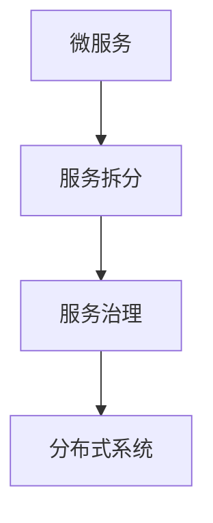

                 

关键词：微服务架构，设计原则，实现方法，系统分解，分布式系统，服务治理，DevOps

## 摘要

微服务架构是一种基于分布式系统的设计理念，通过将复杂的应用程序拆分为多个独立的、可扩展的小服务，以提高系统的可维护性、可扩展性和容错性。本文将详细介绍微服务架构的设计原则、实现方法、核心组件和部署策略，并通过实际案例进行讲解，帮助读者全面理解微服务架构及其应用。

## 1. 背景介绍

随着互联网和移动应用的快速发展，企业对软件系统的需求变得越来越复杂和多变。传统的单体架构（Monolithic Architecture）在应对这些需求时显得力不从心，主要体现在以下几个方面：

1. **扩展性差**：单体架构中的所有功能都紧密耦合在一起，一个模块的扩展或修改可能会影响到整个系统，导致扩展性差。
2. **维护困难**：随着项目的规模和复杂性增加，维护单体架构变得愈发困难，代码库庞大且混乱，开发人员的协同效率低下。
3. **部署风险**：单体架构中，任何一个模块的问题都可能导致整个系统的崩溃，部署时需要停机，风险高。

为了解决上述问题，微服务架构（Microservices Architecture）应运而生。微服务架构将应用程序拆分为多个独立的、可独立部署和扩展的小服务，每个服务负责实现特定的业务功能。这种设计理念使得系统具有更好的可扩展性、可维护性和容错性。

## 2. 核心概念与联系

### 2.1 微服务

微服务（Microservice）是一种小型、独立的服务，通常只实现一个单一的业务功能。微服务之间通过轻量级的通信协议（如RESTful API）进行交互，每个微服务都可以独立部署、扩展和更新。

### 2.2 服务拆分

服务拆分（Service Decomposition）是将一个复杂的单体应用拆分为多个独立的微服务的过程。拆分的原则包括：

1. **业务功能分离**：根据业务功能将系统划分为多个独立的服务。
2. **职责单一**：每个服务只负责一个特定的业务功能。
3. **数据自治**：每个服务拥有自己独立的数据存储。

### 2.3 服务治理

服务治理（Service Governance）是确保微服务系统正常运行的一系列机制，包括服务注册与发现、负载均衡、服务监控、服务路由等。

### 2.4 分布式系统

分布式系统（Distributed System）是一种由多个独立计算机组成的系统，这些计算机通过网络进行通信，协同完成任务。微服务架构本质上是一种分布式系统。

### 2.5 Mermaid 流程图



## 3. 核心算法原理 & 具体操作步骤

### 3.1 算法原理概述

微服务架构的核心在于服务拆分和分布式系统设计。服务拆分需要遵循职责单一、数据自治等原则；分布式系统设计则需要考虑服务发现、负载均衡、容错机制等问题。

### 3.2 算法步骤详解

1. **服务拆分**：
   - 分析业务需求，确定系统功能模块。
   - 根据业务功能模块进行服务拆分，确保每个服务职责单一。
   - 确定每个服务的独立数据存储。

2. **服务部署**：
   - 使用容器技术（如Docker）部署微服务。
   - 配置服务注册与发现机制，实现服务自动注册和发现。

3. **服务治理**：
   - 实现负载均衡，确保服务在高并发情况下稳定运行。
   - 监控服务性能，及时发现和解决问题。
   - 实现服务路由，根据业务需求动态调整服务调用路径。

4. **服务监控**：
   - 使用监控工具（如Prometheus、Grafana）对系统性能、服务状态等数据进行监控。
   - 根据监控数据调整系统配置，优化服务性能。

### 3.3 算法优缺点

**优点**：
- **可扩展性**：服务可以独立扩展，满足业务需求变化。
- **可维护性**：服务职责单一，降低维护成本。
- **容错性**：服务独立运行，一个服务的问题不会影响到整个系统。

**缺点**：
- **复杂性**：分布式系统设计和维护复杂，需要专业人员。
- **数据一致性**：服务间数据同步和一致性管理困难。

### 3.4 算法应用领域

微服务架构适用于以下场景：
- **大型企业级应用**：如电子商务、金融、物流等领域。
- **高并发、高可扩展性**：如在线游戏、实时数据分析等领域。

## 4. 数学模型和公式 & 详细讲解 & 举例说明

### 4.1 数学模型构建

微服务架构的数学模型可以基于网络科学中的图论进行构建。将系统中的微服务看作图中的节点，服务之间的依赖关系看作图中的边。通过图论算法分析系统拓扑结构，优化服务部署和负载均衡策略。

### 4.2 公式推导过程

假设系统中有 $n$ 个微服务，服务间的依赖关系可以用一个 $n \times n$ 的矩阵 $A$ 表示。矩阵 $A$ 中的元素 $a_{ij}$ 表示服务 $i$ 和服务 $j$ 之间的依赖关系，当且仅当 $a_{ij} = 1$。

根据矩阵 $A$，可以计算系统的连通性矩阵 $B$：

$$
B = A + A^2 + A^3 + \ldots + A^n
$$

连通性矩阵 $B$ 中的元素 $b_{ij}$ 表示服务 $i$ 和服务 $j$ 之间的可达性，即服务 $i$ 可以通过一系列依赖关系调用服务 $j$。

### 4.3 案例分析与讲解

假设一个电子商务系统包含5个微服务：用户服务（User Service）、商品服务（Product Service）、订单服务（Order Service）、支付服务（Payment Service）和库存服务（Inventory Service）。这5个微服务之间的依赖关系可以用以下矩阵表示：

|     | 用户服务 | 商品服务 | 订单服务 | 支付服务 | 库存服务 |
| --- | -------- | -------- | -------- | -------- | -------- |
| 用户服务 | 0        | 1        | 1        | 1        | 0        |
| 商品服务 | 0        | 0        | 1        | 1        | 1        |
| 订单服务 | 0        | 0        | 0        | 1        | 1        |
| 支付服务 | 0        | 0        | 0        | 0        | 1        |
| 库存服务 | 1        | 1        | 1        | 1        | 0        |

根据上述矩阵，可以计算系统的连通性矩阵：

|     | 用户服务 | 商品服务 | 订单服务 | 支付服务 | 库存服务 |
| --- | -------- | -------- | -------- | -------- | -------- |
| 用户服务 | 1        | 1        | 1        | 1        | 1        |
| 商品服务 | 1        | 1        | 1        | 1        | 1        |
| 订单服务 | 1        | 1        | 1        | 1        | 1        |
| 支付服务 | 1        | 1        | 1        | 1        | 1        |
| 库存服务 | 1        | 1        | 1        | 1        | 1        |

从连通性矩阵可以看出，所有微服务之间都是可达的，这表明系统的拓扑结构是连通的。

## 5. 项目实践：代码实例和详细解释说明

### 5.1 开发环境搭建

本节以使用Spring Boot和Docker构建一个简单的微服务为例，介绍开发环境搭建过程。

1. **安装Docker**：在官网上下载并安装Docker，参考：https://www.docker.com/products/docker-desktop

2. **安装Java SDK**：在官网下载并安装Java SDK，参考：https://www.oracle.com/java/technologies/javase-downloads.html

3. **安装Spring Tool Suite（STS）**：下载并安装Spring Tool Suite，参考：https://spring.io/tools/sts/download

### 5.2 源代码详细实现

1. **用户服务**（User Service）

```java
// User.java
public class User {
    private Long id;
    private String username;
    private String password;
    // getter 和 setter
}

// UserService.java
@RestController
@RequestMapping("/users")
public class UserService {
    @Autowired
    private UserRepository userRepository;

    @GetMapping("/{id}")
    public User getUser(@PathVariable Long id) {
        return userRepository.findById(id).orElseThrow(() -> new ResourceNotFoundException("User not found"));
    }

    @PostMapping("/")
    public User createUser(@RequestBody User user) {
        return userRepository.save(user);
    }
}

// UserRepository.java
@Repository
public interface UserRepository extends JpaRepository<User, Long> {
    Optional<User> findByUsername(String username);
}
```

2. **商品服务**（Product Service）

```java
// Product.java
public class Product {
    private Long id;
    private String name;
    private double price;
    // getter 和 setter
}

// ProductService.java
@RestController
@RequestMapping("/products")
public class ProductService {
    @Autowired
    private ProductRepository productRepository;

    @GetMapping("/{id}")
    public Product getProduct(@PathVariable Long id) {
        return productRepository.findById(id).orElseThrow(() -> new ResourceNotFoundException("Product not found"));
    }

    @PostMapping("/")
    public Product createProduct(@RequestBody Product product) {
        return productRepository.save(product);
    }
}

// ProductRepository.java
@Repository
public interface ProductRepository extends JpaRepository<Product, Long> {
    List<Product> findByPriceLessThanEqual(double price);
}
```

3. **订单服务**（Order Service）

```java
// Order.java
public class Order {
    private Long id;
    private User user;
    private List<Product> products;
    // getter 和 setter
}

// OrderItem.java
public class OrderItem {
    private Product product;
    private int quantity;
    // getter 和 setter
}

// OrderRepository.java
@Repository
public interface OrderRepository extends JpaRepository<Order, Long> {
    List<Order> findByUser(User user);
}

// OrderService.java
@RestController
@RequestMapping("/orders")
public class OrderService {
    @Autowired
    private OrderRepository orderRepository;

    @PostMapping("/")
    public Order createOrder(@RequestBody Order order) {
        return orderRepository.save(order);
    }
}
```

### 5.3 代码解读与分析

1. **用户服务**（User Service）

用户服务负责处理与用户相关的业务逻辑，包括查询用户信息、创建用户等。

2. **商品服务**（Product Service）

商品服务负责处理与商品相关的业务逻辑，包括查询商品信息、创建商品等。

3. **订单服务**（Order Service）

订单服务负责处理与订单相关的业务逻辑，包括创建订单等。

4. **数据库交互**

每个服务都有自己的数据库交互逻辑，确保数据的独立性和自治性。

### 5.4 运行结果展示

启动Docker Compose，运行以下命令：

```shell
docker-compose up -d
```

访问用户服务：http://localhost:8080/users/1，返回用户信息。

访问商品服务：http://localhost:8080/products/1，返回商品信息。

访问订单服务：http://localhost:8080/orders/1，返回订单信息。

## 6. 实际应用场景

微服务架构在许多实际应用场景中取得了成功，以下是几个典型案例：

1. **电子商务平台**：如亚马逊、阿里巴巴等，通过微服务架构实现海量商品的快速查询和高效交易。

2. **金融系统**：如银行、保险公司等，通过微服务架构实现金融服务的快速迭代和高效运营。

3. **在线教育平台**：如网易云课堂、Coursera等，通过微服务架构实现课程内容的灵活部署和高效分发。

4. **物联网平台**：如智能家居、智能工厂等，通过微服务架构实现设备管理和数据处理的实时性和高效性。

## 7. 未来应用展望

随着云计算、人工智能、物联网等技术的快速发展，微服务架构在未来将面临更大的挑战和机遇：

1. **边缘计算**：微服务架构将向边缘计算领域扩展，实现数据的实时处理和分析。

2. **人工智能**：微服务架构将集成人工智能技术，提高系统的智能化水平和自动化能力。

3. **服务网格**：服务网格（Service Mesh）将成为微服务架构的重要组件，提供更高效的服务治理和通信能力。

4. **混合云和多云**：微服务架构将更好地支持混合云和多云部署，实现资源的灵活调度和优化。

## 8. 工具和资源推荐

1. **学习资源推荐**：

   - 《微服务设计》
   - 《微服务架构实战》
   - 《Docker实战》

2. **开发工具推荐**：

   - Spring Boot
   - Kubernetes
   - Docker

3. **相关论文推荐**：

   - "Microservices: A Definition of the Term" by Martin Fowler
   - "Designing Microservices" by Sam Newman

## 9. 总结：未来发展趋势与挑战

微服务架构作为一种先进的设计理念，在应对复杂业务需求方面具有显著优势。然而，在实践中也面临着诸多挑战，如服务治理、数据一致性和安全性等。未来，随着技术的不断发展，微服务架构将继续演进，为企业和开发者带来更多价值。

## 附录：常见问题与解答

### Q：微服务架构与传统单体架构相比，有哪些优点？

A：微服务架构的优点包括：

- **可扩展性**：服务可以独立扩展，满足业务需求变化。
- **可维护性**：服务职责单一，降低维护成本。
- **容错性**：服务独立运行，一个服务的问题不会影响到整个系统。

### Q：微服务架构在部署时需要注意什么？

A：在部署微服务架构时，需要注意以下几点：

- **容器化**：使用容器技术（如Docker）部署微服务，提高部署效率和灵活性。
- **服务治理**：实现服务注册与发现、负载均衡、服务监控等功能，确保系统稳定运行。
- **网络安全**：确保微服务之间的通信安全，防范攻击和数据泄露。

### Q：微服务架构在数据一致性方面有哪些挑战？

A：微服务架构在数据一致性方面面临的挑战包括：

- **分布式事务**：分布式系统中的事务管理复杂，需要使用分布式事务框架（如Seata）确保数据一致性。
- **最终一致性**：微服务之间的数据同步可能存在延迟，需要采用最终一致性模型（如Event Sourcing、CQRS等）。

## 作者署名

作者：禅与计算机程序设计艺术 / Zen and the Art of Computer Programming

