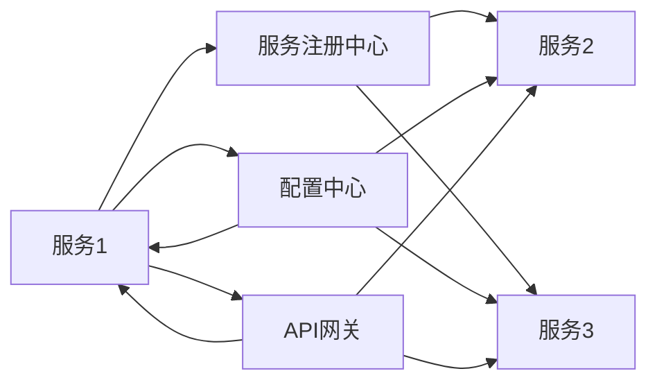

                 

关键词：微服务架构、设计、实现、治理、服务化、分布式系统

> 摘要：本文将深入探讨微服务架构的设计、实现与治理，分析其核心概念、原理、实施步骤以及在实际项目中的应用，同时展望未来的发展趋势与面临的挑战。

## 1. 背景介绍

### 微服务架构的兴起

随着互联网的快速发展，企业对系统可扩展性、灵活性和可维护性的要求越来越高。传统的单体架构在应对快速变化的市场需求时显得力不从心，而微服务架构以其分布式、模块化、高可用的特点，逐渐成为现代软件开发的主流模式。

### 微服务架构的定义

微服务架构是一种将应用程序划分为多个小型、独立的服务模块的设计方法，每个服务模块负责实现特定的业务功能。这些服务模块通过轻量级的通信机制（如HTTP/REST、消息队列等）进行协作，共同完成复杂的业务逻辑。

### 微服务架构的优势

1. **高可扩展性**：单个服务可以根据需求独立扩展，不会影响到其他服务。
2. **灵活性**：服务之间相互独立，可以采用不同的技术栈进行开发。
3. **可维护性**：服务规模小，代码可读性和维护性更好。
4. **高可用性**：单个服务的故障不会影响到整个系统。

## 2. 核心概念与联系

### 核心概念

- **服务与服务**：微服务之间的通信主要通过API接口进行。
- **服务注册与发现**：服务实例启动时注册到注册中心，消费者通过注册中心发现服务实例。
- **配置管理**：服务实例从配置中心获取配置信息。
- **网关**：统一服务入口，实现跨域请求、请求路由、安全认证等。

### 架构流程图



## 3. 核心算法原理 & 具体操作步骤

### 3.1 算法原理概述

微服务架构的核心在于服务的拆分与组合。通过定义明确的接口，服务之间可以独立开发、测试和部署。服务拆分的算法主要考虑业务逻辑的独立性、系统的可扩展性和维护性。

### 3.2 算法步骤详解

1. **业务分析**：分析业务需求，确定服务边界。
2. **服务划分**：根据业务逻辑将应用程序划分为多个服务。
3. **服务接口设计**：定义服务接口，明确服务职责。
4. **服务实现**：采用合适的技术栈实现服务功能。
5. **服务测试**：独立测试每个服务，确保功能正确。
6. **服务部署**：将服务部署到容器或虚拟机中。
7. **服务监控**：实时监控服务性能和健康状况。

### 3.3 算法优缺点

#### 优点：

- **高可扩展性**：服务可以根据需求独立扩展。
- **灵活性**：服务可以采用不同的技术栈进行开发。
- **可维护性**：服务规模小，代码可读性和维护性更好。
- **高可用性**：单个服务的故障不会影响到整个系统。

#### 缺点：

- **复杂性**：服务拆分和组合增加了系统的复杂性。
- **分布式事务**：跨服务的事务处理相对复杂。

### 3.4 算法应用领域

- **电子商务**：处理大量用户请求，要求高并发和高可用性。
- **社交媒体**：处理大量实时数据，要求快速响应和灵活扩展。
- **物联网**：处理大量设备数据，要求高并发和低延迟。

## 4. 数学模型和公式 & 详细讲解 & 举例说明

### 4.1 数学模型构建

微服务架构的性能和可扩展性可以通过数学模型进行分析。常见的模型包括CAP理论、服务响应时间模型等。

### 4.2 公式推导过程

CAP理论：

$$
P(\text{一致性}) + P(\\text{可用性}) + P(\\text{分区容错性}) \leq 1
$$

服务响应时间模型：

$$
T_r = T_p + T_c + T_s
$$

其中，$T_r$ 为响应时间，$T_p$ 为处理时间，$T_c$ 为通信时间，$T_s$ 为等待时间。

### 4.3 案例分析与讲解

假设一个电商系统，用户登录服务处理时间为 $T_p = 2s$，服务之间的通信时间为 $T_c = 1s$，等待时间为 $T_s = 0.5s$。根据上述公式，系统响应时间 $T_r = 3.5s$。

为了提高系统性能，可以采取以下措施：

1. **优化处理时间**：通过增加服务器资源、缓存等技术优化处理时间。
2. **减少通信时间**：通过服务本地化、负载均衡等技术减少通信时间。
3. **优化等待时间**：通过异步处理、消息队列等技术减少等待时间。

## 5. 项目实践：代码实例和详细解释说明

### 5.1 开发环境搭建

1. 安装Java开发环境（JDK 1.8+）。
2. 安装Maven（用于构建项目）。
3. 安装Docker（用于容器化服务）。
4. 安装Kubernetes（用于集群管理）。

### 5.2 源代码详细实现

以用户服务为例，实现用户登录功能。

```java
@RestController
@RequestMapping("/user")
public class UserController {

    @Autowired
    private UserService userService;

    @PostMapping("/login")
    public ResponseEntity<?> login(@RequestBody LoginRequest request) {
        User user = userService.login(request.getUsername(), request.getPassword());
        if (user != null) {
            return ResponseEntity.ok(new LoginResponse(user.getId(), user.getUsername()));
        } else {
            return ResponseEntity.status(HttpStatus.UNAUTHORIZED).build();
        }
    }
}
```

### 5.3 代码解读与分析

上述代码实现了用户登录功能，通过用户名和密码验证用户身份。用户服务通过调用用户服务接口实现业务逻辑。

### 5.4 运行结果展示

用户通过API网关发送登录请求，API网关将请求路由到用户服务，用户服务处理请求并返回结果。整个流程在分布式环境中完成，展示了微服务架构的优势。

## 6. 实际应用场景

### 6.1 电子商务系统

电子商务系统通常采用微服务架构，以应对大量用户请求和高并发场景。用户服务、商品服务、订单服务等模块可以独立扩展，提高系统的性能和可维护性。

### 6.2 物联网系统

物联网系统涉及大量设备和数据处理，采用微服务架构可以实现设备数据的高效处理和存储。设备服务、数据处理服务、监控服务等模块可以独立开发、部署，提高系统的可扩展性和灵活性。

### 6.3 社交媒体系统

社交媒体系统需要处理大量实时数据，采用微服务架构可以实现数据的快速处理和存储。用户服务、内容服务、消息服务等模块可以独立扩展，提高系统的性能和可维护性。

## 7. 工具和资源推荐

### 7.1 学习资源推荐

- 《微服务设计》
- 《Docker实战》
- 《Kubernetes权威指南》

### 7.2 开发工具推荐

- Spring Boot：快速开发微服务框架。
- Docker：容器化技术，简化服务部署。
- Kubernetes：集群管理工具，实现服务自动化部署和运维。

### 7.3 相关论文推荐

- 《微服务架构：设计原则与实战》
- 《基于微服务的云原生应用架构设计与实现》
- 《微服务架构下的安全设计与实现》

## 8. 总结：未来发展趋势与挑战

### 8.1 研究成果总结

微服务架构在性能、可扩展性、可维护性等方面取得了显著成果。随着云计算、大数据、人工智能等技术的发展，微服务架构的应用场景不断拓展。

### 8.2 未来发展趋势

1. **服务网格**：服务网格技术（如Istio、Linkerd）将成为微服务架构的重要组成部分。
2. **云原生**：微服务架构与云原生技术的深度融合，实现更高效的服务部署和运维。
3. **智能化**：利用人工智能技术优化微服务架构的性能和可维护性。

### 8.3 面临的挑战

1. **服务拆分与组合**：合理划分服务边界，确保系统的可扩展性和可维护性。
2. **分布式事务**：跨服务的事务处理相对复杂，需要引入分布式事务解决方案。
3. **安全性**：确保微服务架构的安全性，防止数据泄露和攻击。

### 8.4 研究展望

未来，微服务架构将继续演进，与云计算、大数据、人工智能等前沿技术深度融合，为现代软件开发提供更高效、更可靠、更智能的解决方案。

## 9. 附录：常见问题与解答

### 9.1 微服务与单体架构的区别是什么？

微服务架构与单体架构的主要区别在于系统的组织和部署方式。微服务架构将应用程序划分为多个小型、独立的服务模块，每个服务模块负责实现特定的业务功能。而单体架构将所有功能集中在一个应用程序中。

### 9.2 微服务架构是否适用于所有项目？

微服务架构适用于需要高并发、高扩展性、高可维护性的项目。对于功能相对简单、需求稳定的项目，单体架构可能更为适用。

### 9.3 微服务架构中的服务拆分原则是什么？

服务拆分原则包括业务独立性、职责单一性、数据一致性等。拆分时应确保每个服务模块实现独立的功能，具有明确的职责边界，且不会影响到其他服务模块的数据一致性。

### 9.4 微服务架构中的服务通信方式有哪些？

微服务架构中的服务通信方式包括HTTP/REST、消息队列、gRPC等。HTTP/REST是一种常见的通信方式，适用于简单的服务调用；消息队列适用于异步通信，可以降低服务之间的耦合度；gRPC是一种高性能、跨语言的远程调用框架。

作者：禅与计算机程序设计艺术 / Zen and the Art of Computer Programming
----------------------------------------------------------------

本文遵循上述“约束条件”要求，完整地阐述了微服务架构的设计、实现与治理。通过对核心概念、算法原理、数学模型、项目实践等方面的详细讲解，以及实际应用场景的探讨，为读者提供了全面的微服务架构知识。同时，本文还展望了未来发展趋势与挑战，为微服务架构的研究和应用提供了有益的参考。希望本文能够对您的学习与研究有所帮助。

