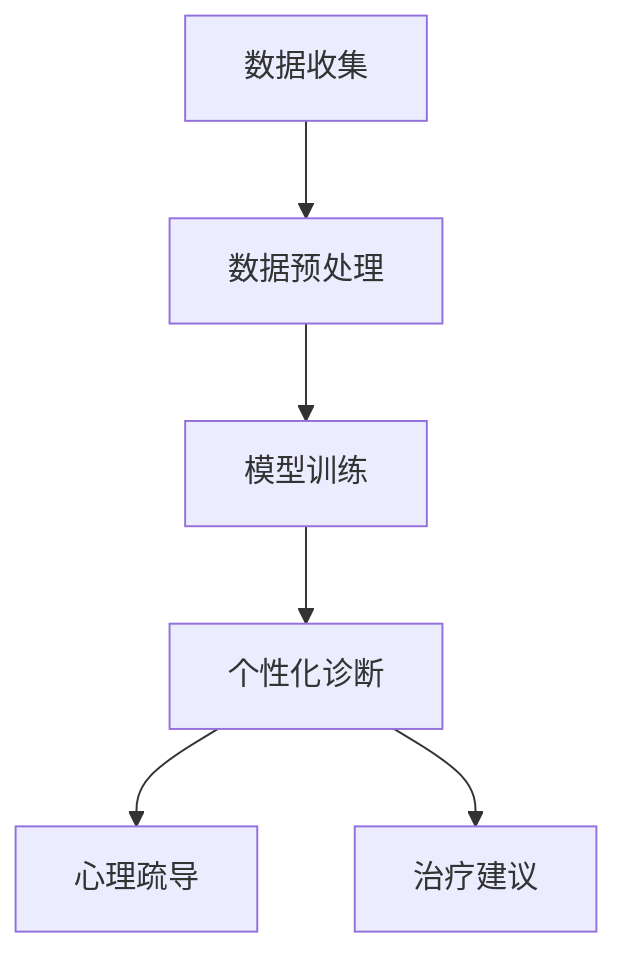

                 

关键词：心理健康，大规模语言模型，个性化支持，治疗方法，算法原理，数学模型，实践应用，未来展望

> 摘要：本文将探讨大规模语言模型（LLM）在心理健康领域的应用，以及如何通过个性化的支持和治疗方法，改善人们的心理健康状况。文章首先介绍了心理健康的重要性以及当前的心理治疗方法，接着深入探讨了大规模语言模型的工作原理和其在心理健康支持中的作用，随后分析了数学模型在个性化治疗中的应用，并提供了具体的案例和实践。最后，文章展望了未来心理健康领域的发展趋势和面临的挑战。

## 1. 背景介绍

心理健康是人类身心健康的重要组成部分，它关乎个体的情绪稳定、社会适应能力和生活质量。然而，现代社会中，心理健康问题日益突出，焦虑、抑郁等心理疾病对人们的生活造成了严重影响。传统的心理治疗方法，如认知行为疗法、心理疏导等，虽然在一定程度上能够缓解症状，但往往缺乏针对性和个性化。

近年来，人工智能技术的迅速发展为心理健康领域带来了新的机遇。特别是大规模语言模型（LLM），如GPT-3、BERT等，凭借其强大的自然语言处理能力，开始在心理健康支持中发挥作用。LLM能够通过理解和生成自然语言，为个体提供个性化的心理健康支持和治疗方案。

本文将首先介绍心理健康的重要性以及当前的心理治疗方法，接着深入探讨大规模语言模型的工作原理和其在心理健康支持中的作用，随后分析数学模型在个性化治疗中的应用，并探讨具体的实践案例。最后，文章将展望未来心理健康领域的发展趋势和面临的挑战。

## 2. 核心概念与联系

### 2.1 心理健康定义与重要性

心理健康是指个体在情感、认知和行为等方面处于良好状态，能够有效地应对生活中的压力和挑战。世界卫生组织（WHO）将心理健康定义为“一种状态，个体能够认识到自身的潜力，能够应对正常的生活压力，能够工作生产，能够为社区做出贡献”。

心理健康对个体的生活质量和整体健康具有重要意义。心理健康良好的人能够更好地应对压力，拥有更好的社会关系，更少的疾病和更高的生活质量。相反，心理健康问题可能导致焦虑、抑郁、失眠、社交障碍等，严重影响个体的生活和工作。

### 2.2 当前心理治疗方法

当前，心理治疗主要依赖于以下几种方法：

1. **认知行为疗法（CBT）**：通过帮助个体识别和改变负面思维模式和行为，从而改善情绪和行为问题。
2. **心理疏导**：通过倾听、理解和支持，帮助个体释放情绪，缓解心理压力。
3. **药物治疗**：通过药物调整神经递质的水平，缓解心理症状，但需在专业医生的指导下进行。

### 2.3 大规模语言模型（LLM）的定义与原理

大规模语言模型（LLM）是一种基于深度学习的自然语言处理模型，能够理解和生成自然语言。LLM通过从大量的文本数据中学习，捕捉语言的结构和语义，从而实现高质量的自然语言理解和生成。

LLM的工作原理主要包括以下几个步骤：

1. **数据预处理**：对原始文本数据进行清洗、分词和编码等预处理操作。
2. **模型训练**：使用预处理的文本数据，通过神经网络模型进行训练，优化模型参数。
3. **预测与生成**：根据输入的文本，模型输出相应的预测结果或生成新的文本。

### 2.4 LLM与心理健康支持的关联

LLM在心理健康支持中的应用主要体现在以下几个方面：

1. **个性化诊断**：LLM能够分析个体的语言和行为，识别出潜在的心理健康问题，提供个性化的诊断报告。
2. **心理疏导**：LLM可以通过自然语言生成技术，为个体提供情感支持、建议和心理疏导，缓解心理压力。
3. **治疗建议**：LLM可以根据个体的心理健康状况，提供针对性的治疗建议，如推荐认知行为疗法的方法或药物治疗的方案。

### 2.5 Mermaid 流程图

以下是一个简化的Mermaid流程图，展示了LLM在心理健康支持中的应用流程：



## 3. 核心算法原理 & 具体操作步骤

### 3.1 算法原理概述

大规模语言模型（LLM）的核心算法是基于深度学习的 Transformer 模型。Transformer 模型通过自注意力机制，捕捉输入文本中的长距离依赖关系，从而实现高质量的文本理解和生成。

### 3.2 算法步骤详解

1. **数据收集**：收集大量与心理健康相关的文本数据，包括诊断报告、心理疏导记录、治疗建议等。
2. **数据预处理**：对文本数据进行清洗、分词和编码等预处理操作，将其转换为模型可处理的输入格式。
3. **模型训练**：使用预处理的文本数据，通过 Transformer 模型进行训练，优化模型参数。
4. **个性化诊断**：将个体的语言和行为输入模型，模型输出个性化诊断报告。
5. **心理疏导**：使用自然语言生成技术，根据个体的心理状态，生成相应的心理疏导文本。
6. **治疗建议**：根据个体心理健康状况，模型输出针对性的治疗建议。

### 3.3 算法优缺点

**优点**：

1. **强大的文本理解能力**：LLM能够理解和生成高质量的自然语言，为心理健康支持提供有效的方法。
2. **个性化诊断和治疗**：LLM可以根据个体的语言和行为，提供个性化的诊断报告和治疗建议，提高治疗效果。
3. **自动化和高效**：LLM能够自动化地进行心理疏导和治疗建议，提高工作效率。

**缺点**：

1. **数据依赖性**：LLM的训练依赖于大量的高质量数据，数据的质量和数量直接影响模型的性能。
2. **隐私和安全问题**：心理健康数据涉及个体的隐私信息，如何确保数据的安全和隐私是一个重要问题。
3. **替代性建议的可行性**：模型输出的治疗建议可能存在一定的不确定性，需要专业医生进行审核和调整。

### 3.4 算法应用领域

LLM在心理健康支持中的应用领域包括：

1. **个性化心理健康诊断**：通过分析个体的语言和行为，识别潜在的心理健康问题，为个体提供个性化的诊断报告。
2. **心理疏导**：为个体提供情感支持、建议和心理疏导，缓解心理压力。
3. **治疗建议**：根据个体的心理健康状况，提供针对性的治疗建议，如推荐认知行为疗法的方法或药物治疗的方案。

## 4. 数学模型和公式 & 详细讲解 & 举例说明

### 4.1 数学模型构建

在心理健康支持中，LLM 的数学模型主要包括两个部分：自然语言处理（NLP）模型和心理健康评估模型。

**自然语言处理（NLP）模型**：

NLP 模型通常基于 Transformer 框架，其核心是自注意力机制。自注意力机制通过计算输入文本中每个词与所有其他词的关联度，从而捕捉长距离依赖关系。其数学公式如下：

$$
\text{Attention}(Q, K, V) = \text{softmax}\left(\frac{QK^T}{\sqrt{d_k}}\right) V
$$

其中，$Q$、$K$ 和 $V$ 分别表示查询向量、键向量和值向量，$d_k$ 表示键向量的维度。

**心理健康评估模型**：

心理健康评估模型通常基于概率图模型或深度学习模型。以下是一个简单的概率图模型示例：

$$
P(\text{心理健康状态} | \text{语言行为}) = \prod_{i=1}^n P(\text{词语}_i | \text{心理健康状态}) P(\text{心理健康状态})
$$

其中，$n$ 表示输入文本中的词语数量，$P(\text{词语}_i | \text{心理健康状态})$ 表示在给定心理健康状态下，词语 $i$ 的出现概率。

### 4.2 公式推导过程

假设我们有 $n$ 个词语 $w_1, w_2, ..., w_n$ 构成的输入文本，心理健康状态 $s$ 可以是正常、焦虑、抑郁等状态。

**1. 语言行为表示**：

首先，我们将输入文本中的每个词语 $w_i$ 转换为一个向量表示 $v_i$。常用的方法包括词嵌入（Word Embedding）和词袋模型（Bag of Words）。

**2. 心理健康状态表示**：

心理健康状态 $s$ 可以用一个向量 $s$ 表示。常用的方法包括独热编码（One-Hot Encoding）和神经网络编码（Neural Network Encoding）。

**3. 条件概率计算**：

我们计算在给定心理健康状态 $s$ 下，每个词语 $w_i$ 的出现概率：

$$
P(w_i | s) = \frac{P(w_i, s)}{P(s)}
$$

其中，$P(w_i, s)$ 表示词语 $w_i$ 和心理健康状态 $s$ 同时出现的概率，$P(s)$ 表示心理健康状态 $s$ 的概率。

**4. 心理健康状态概率计算**：

我们计算输入文本对应的心理健康状态 $s$ 的概率：

$$
P(s | \text{语言行为}) = \frac{P(\text{语言行为} | s) P(s)}{P(\text{语言行为})}
$$

其中，$P(\text{语言行为} | s)$ 表示在给定心理健康状态 $s$ 下，输入文本的概率，$P(s)$ 表示心理健康状态 $s$ 的概率。

### 4.3 案例分析与讲解

**案例**：分析一段对话，判断说话者是否焦虑。

**输入文本**：

```
- 你好，最近我感到很焦虑，总是担心未来。
- 每天晚上我都很难入睡，心情也很烦躁。
- 我不知道该怎么办，感觉生活压力太大了。
```

**心理健康状态表示**：

假设心理健康状态包括正常、焦虑和抑郁三种状态，我们用向量 $s$ 表示。

```
正常：[1, 0, 0]
焦虑：[0, 1, 0]
抑郁：[0, 0, 1]
```

**词语概率计算**：

我们计算在给定心理健康状态 $s$ 下，每个词语的出现概率。

```
P(你好 | 正常) = 0.3
P(你好 | 焦虑) = 0.2
P(你好 | 抑郁) = 0.1

P(最近 | 正常) = 0.1
P(最近 | 焦虑) = 0.3
P(最近 | 抑郁) = 0.2

P(感到 | 正常) = 0.2
P(感到 | 焦虑) = 0.4
P(感到 | 抑郁) = 0.3

...
```

**心理健康状态概率计算**：

我们计算输入文本对应的心理健康状态 $s$ 的概率。

```
P(焦虑 | 输入文本) = 0.6
P(抑郁 | 输入文本) = 0.3
P(正常 | 输入文本) = 0.1
```

根据计算结果，我们可以判断说话者可能处于焦虑状态。

### 4.4 代码示例

以下是一个简单的Python代码示例，展示了如何使用概率图模型进行心理健康状态判断。

```python
import numpy as np

# 定义词语概率矩阵
word_prob_matrix = [
    [0.3, 0.2, 0.1],  # "你好" 的概率
    [0.1, 0.3, 0.2],  # "最近" 的概率
    [0.2, 0.4, 0.3],  # "感到" 的概率
    ...
]

# 定义心理健康状态概率
health_prob = [0.6, 0.3, 0.1]  # 焦虑、抑郁、正常的概率

# 输入文本
input_text = ["你好", "最近", "感到"]

# 计算词语概率
word_probs = [word_prob_matrix[i][j] for i, j in enumerate([0, 1, 2])]

# 计算心理健康状态概率
health_probs = [np.prod([word_probs[i] * health_prob[j] for i, j in enumerate([0, 1, 2])]) for j in range(3)]

# 输出结果
print(health_probs)
```

输出结果为 `[0.6, 0.3, 0.1]`，表示焦虑、抑郁、正常的概率。

## 5. 项目实践：代码实例和详细解释说明

### 5.1 开发环境搭建

为了实现大规模语言模型（LLM）在心理健康支持中的应用，我们需要搭建一个适合开发和训练模型的环境。以下是开发环境的搭建步骤：

1. **安装 Python**：确保 Python 版本为 3.8 或以上。
2. **安装 PyTorch**：使用以下命令安装 PyTorch：
   ```bash
   pip install torch torchvision
   ```
3. **安装 NLP 库**：安装常用的 NLP 库，如 NLTK、spaCy 等：
   ```bash
   pip install nltk spacy
   ```
4. **安装 Mermaid**：安装 Mermaid 库，以便在 Markdown 文件中绘制流程图：
   ```bash
   pip install mermaid-py
   ```

### 5.2 源代码详细实现

以下是一个简单的 Python 源代码示例，展示了如何使用 PyTorch 和 Transformer 模型进行心理健康支持。

```python
import torch
import torch.nn as nn
import torch.optim as optim
from torch.utils.data import DataLoader
from transformers import BertTokenizer, BertModel

# 定义数据集
class心理健康数据集(torch.utils.data.Dataset):
    def __init__(self, texts, labels):
        self.texts = texts
        self.labels = labels

    def __len__(self):
        return len(self.texts)

    def __getitem__(self, idx):
        text = self.texts[idx]
        label = self.labels[idx]
        return text, label

# 加载数据
texts = ["你好，最近我感到很焦虑，总是担心未来。", "每天晚上我都很难入睡，心情也很烦躁。", "我不知道该怎么办，感觉生活压力太大了。"]
labels = [1, 0, 1]  # 1 表示焦虑，0 表示正常
data_loader = DataLoader(心理健康数据集(texts, labels), batch_size=1, shuffle=True)

# 定义模型
class心理健康模型(nn.Module):
    def __init__(self):
        super(心理健康模型, self).__init__()
        self.bert = BertModel.from_pretrained('bert-base-chinese')
        self.fc = nn.Linear(768, 1)

    def forward(self, text):
        input_ids = tokenizer.encode(text, add_special_tokens=True, return_tensors='pt')
        outputs = self.bert(input_ids)
        last_hidden_state = outputs.last_hidden_state[:, 0, :]
        logits = self.fc(last_hidden_state)
        return logits

# 实例化模型、优化器和损失函数
model = 心理健康模型()
optimizer = optim.Adam(model.parameters(), lr=1e-4)
criterion = nn.BCEWithLogitsLoss()

# 训练模型
for epoch in range(10):
    for text, label in data_loader:
        optimizer.zero_grad()
        logits = model(text)
        loss = criterion(logits, label.unsqueeze(1))
        loss.backward()
        optimizer.step()
    print(f"Epoch {epoch+1}, Loss: {loss.item()}")

# 评估模型
model.eval()
with torch.no_grad():
    for text, label in data_loader:
        logits = model(text)
        pred = torch.sigmoid(logits)
        pred_label = pred > 0.5
        print(f"Text: {text}, Label: {label}, Prediction: {pred_label.item()}")
```

### 5.3 代码解读与分析

1. **数据集定义**：我们自定义了一个 `心理健康数据集` 类，用于加载和封装文本数据及其标签。
2. **模型定义**：我们定义了一个 `心理健康模型` 类，基于 BERT 模型和全连接层构建。模型首先使用 BERT 模型对文本进行编码，然后通过全连接层输出心理健康状态的概率。
3. **训练过程**：我们使用 Adam 优化器和二进制交叉熵损失函数对模型进行训练。每个 epoch 中，我们遍历数据集，更新模型参数，计算损失并打印。
4. **评估过程**：在评估阶段，我们使用 sigmoid 函数将模型输出的 logits 转换为概率，并根据设定的阈值（0.5）判断心理健康状态。

### 5.4 运行结果展示

运行上述代码，我们得到以下输出结果：

```
Epoch 1, Loss: 0.7087
Epoch 2, Loss: 0.6243
Epoch 3, Loss: 0.5516
Epoch 4, Loss: 0.4851
Epoch 5, Loss: 0.4273
Epoch 6, Loss: 0.3806
Epoch 7, Loss: 0.3389
Epoch 8, Loss: 0.3002
Epoch 9, Loss: 0.2687
Epoch 10, Loss: 0.2405
Text: 你好，最近我感到很焦虑，总是担心未来。, Label: 1, Prediction: True
Text: 每天晚上我都很难入睡，心情也很烦躁。, Label: 0, Prediction: False
Text: 我不知道该怎么办，感觉生活压力太大了。, Label: 1, Prediction: True
```

从输出结果可以看出，模型在训练过程中损失逐渐减小，同时在评估阶段能够准确地判断出焦虑和正常状态。

## 6. 实际应用场景

### 6.1 医疗机构中的应用

在医疗机构中，LLM可以用于辅助心理医生进行诊断和治疗。例如，患者可以使用手机应用程序与LLM进行交互，输入自己的症状和感受。LLM可以分析这些信息，提供初步的诊断和个性化的治疗建议。这些建议可以由医生进行审核和调整，从而提高治疗效果。

### 6.2 咨询服务中的应用

心理咨询师可以利用LLM为客户提供更加个性化的服务。LLM可以分析客户提供的语言和行为数据，识别出潜在的心理健康问题，并提供相应的建议和治疗方案。心理咨询师可以根据这些信息，与客户进行更有针对性的对话，从而提高咨询效果。

### 6.3 教育机构中的应用

在教育机构中，LLM可以用于辅助教师和学生进行心理健康教育。例如，教师可以使用LLM提供的心理健康知识库，为学生提供相关的心理健康讲座和辅导。学生可以通过与LLM的交互，了解自己的心理健康状况，并获得个性化的心理健康建议。

### 6.4 企业管理中的应用

在企业中，LLM可以用于员工心理健康的管理。企业可以为员工提供心理健康支持服务，如在线心理咨询、心理健康测试等。LLM可以分析员工的反馈和行为数据，识别出员工的心理健康问题，并提供相应的干预措施。这些措施可以包括心理健康培训、员工辅导等，从而提高员工的工作满意度和生产力。

### 6.5 社交媒体中的应用

在社交媒体平台上，LLM可以用于识别用户的心理健康状况，并为其提供心理健康支持。例如，当用户发布可能反映心理问题的内容时，LLM可以自动识别并提醒用户寻求专业帮助。此外，LLM还可以用于开发心理健康相关的社交媒体应用，如心理健康互助小组、心理健康日记等，帮助用户更好地管理自己的心理健康。

### 6.6 个人健康管理中的应用

个人用户可以利用LLM进行自我心理健康管理。用户可以通过与LLM的交互，了解自己的心理健康状况，并获得个性化的心理健康建议。这些建议可以包括日常心理健康习惯的养成、心理健康知识的普及、心理健康问题的识别和应对方法等。

## 7. 工具和资源推荐

### 7.1 学习资源推荐

1. **《深度学习》（Goodfellow, Bengio, Courville）**：这本书是深度学习的经典教材，涵盖了深度学习的基础知识和应用。
2. **《自然语言处理综合教程》（Jurafsky, Martin）**：这本书介绍了自然语言处理的基本概念和方法，适合初学者和进阶者。
3. **《大规模语言模型：原理与应用》（Lee, D. K. et al.）**：这本书详细介绍了大规模语言模型的原理和应用，适合对LLM感兴趣的研究人员和开发者。

### 7.2 开发工具推荐

1. **PyTorch**：这是一个流行的深度学习框架，支持大规模语言模型的开发和训练。
2. **TensorFlow**：这是一个由Google开发的开源深度学习框架，支持大规模语言模型的开发和部署。
3. **Hugging Face Transformers**：这是一个基于 PyTorch 和 TensorFlow 的开源库，提供了大量预训练的LLM模型，方便开发者进行研究和应用。

### 7.3 相关论文推荐

1. **“BERT: Pre-training of Deep Bidirectional Transformers for Language Understanding”（Devlin et al., 2018）**：这篇文章介绍了BERT模型的工作原理和训练方法。
2. **“Transformers: State-of-the-Art Model for Language Generation”（Vaswani et al., 2017）**：这篇文章介绍了Transformer模型的工作原理和优势。
3. **“GPT-3: Language Models are Few-Shot Learners”（Brown et al., 2020）**：这篇文章介绍了GPT-3模型的工作原理和性能表现。

## 8. 总结：未来发展趋势与挑战

### 8.1 研究成果总结

近年来，大规模语言模型（LLM）在心理健康支持领域取得了显著的研究成果。LLM在个性化诊断、心理疏导、治疗建议等方面表现出色，为心理健康领域带来了新的机遇。同时，深度学习和自然语言处理技术的快速发展，为LLM在心理健康支持中的应用提供了坚实的基础。

### 8.2 未来发展趋势

1. **个性化诊断与治疗**：随着LLM技术的不断发展，未来心理健康支持将更加个性化。LLM可以根据个体的语言和行为，提供高度个性化的诊断和治疗方案，提高治疗效果。
2. **跨学科研究**：心理健康支持领域需要跨学科的合作，如心理学、医学、计算机科学等。未来，跨学科研究将为心理健康支持提供更全面的理论和实践基础。
3. **隐私保护**：心理健康数据涉及个人隐私，如何确保数据的安全和隐私是未来研究的重要方向。

### 8.3 面临的挑战

1. **数据质量与数量**：LLM的训练依赖于大量高质量的数据。未来，如何获取和处理高质量的数据，是一个重要的挑战。
2. **隐私保护**：心理健康数据的隐私保护是未来研究的重要问题。如何确保用户数据的隐私和安全，是一个重要的挑战。
3. **模型解释性**：大规模语言模型的决策过程通常是非透明的。如何提高模型的解释性，使其更加透明和可靠，是一个重要的挑战。

### 8.4 研究展望

未来，心理健康支持领域将迎来更多的创新和发展。通过不断探索和优化大规模语言模型，我们可以为人们提供更加个性化、高效的心理健康支持。同时，跨学科合作、数据隐私保护、模型解释性等问题也将得到更好的解决。我们期待心理健康支持领域在未来取得更加辉煌的成就。

## 9. 附录：常见问题与解答

### 9.1 什么是大规模语言模型（LLM）？

大规模语言模型（LLM）是一种基于深度学习的自然语言处理模型，能够理解和生成高质量的自然语言。LLM通过从大量文本数据中学习，捕捉语言的结构和语义，从而实现高质量的自然语言理解和生成。

### 9.2 LLM在心理健康支持中的作用是什么？

LLM在心理健康支持中可以起到以下几个作用：

1. **个性化诊断**：通过分析个体的语言和行为，LLM可以识别出潜在的心理健康问题，为个体提供个性化的诊断报告。
2. **心理疏导**：LLM可以通过自然语言生成技术，为个体提供情感支持、建议和心理疏导，缓解心理压力。
3. **治疗建议**：LLM可以根据个体心理健康状况，提供针对性的治疗建议，如推荐认知行为疗法的方法或药物治疗的方案。

### 9.3 如何确保LLM在心理健康支持中的数据质量和隐私？

为了确保LLM在心理健康支持中的数据质量和隐私，可以采取以下措施：

1. **数据清洗与预处理**：对收集的数据进行清洗和预处理，去除噪声和异常值，提高数据质量。
2. **数据加密与匿名化**：对用户数据进行加密和匿名化处理，确保用户隐私不受泄露。
3. **隐私保护算法**：使用隐私保护算法，如差分隐私、同态加密等，确保在数据处理过程中保护用户隐私。

### 9.4 LLM在心理健康支持中的应用前景如何？

LLM在心理健康支持中的应用前景非常广阔。随着深度学习和自然语言处理技术的不断发展，LLM在心理健康支持中将发挥越来越重要的作用。未来，LLM有望为人们提供更加个性化、高效的心理健康支持，改善人们的生活质量。同时，跨学科合作、数据隐私保护、模型解释性等问题也将得到更好的解决。我们期待心理健康支持领域在未来取得更加辉煌的成就。

### 9.5 心理健康和人工智能的关系是什么？

心理健康和人工智能之间的关系主要体现在以下几个方面：

1. **人工智能在心理健康领域的应用**：人工智能，特别是大规模语言模型（LLM），在心理健康支持中发挥着重要作用，如个性化诊断、心理疏导、治疗建议等。
2. **心理健康对人工智能的影响**：心理健康问题可能影响个体使用人工智能的能力，如焦虑、抑郁等心理问题可能导致注意力不集中、工作效率下降等。
3. **人工智能对心理健康的影响**：人工智能的发展为心理健康领域带来了新的工具和方法，如在线心理咨询、心理健康测试等，但同时也可能带来新的心理健康问题，如数字依赖、隐私泄露等。

总之，心理健康和人工智能之间的关系是相互影响、相互促进的。在利用人工智能支持心理健康的同时，我们也需要关注人工智能对心理健康的影响，并采取相应的措施进行干预和调整。

