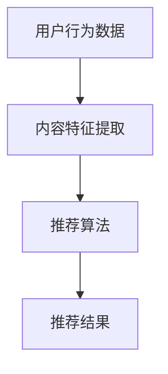
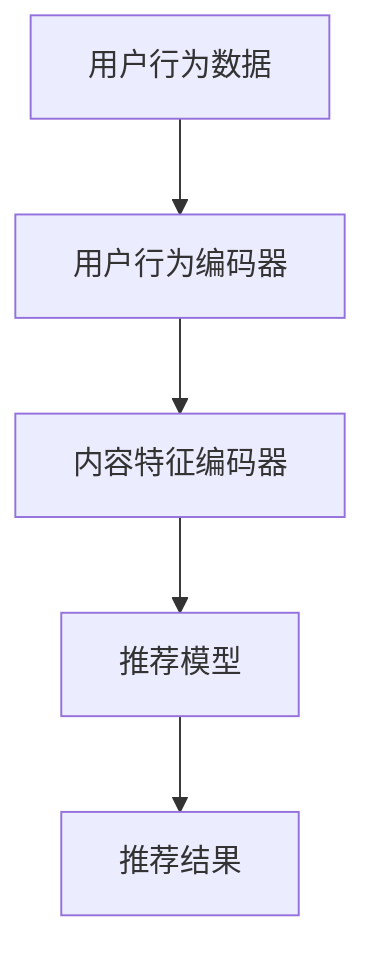

                 

 > > **关键词：**快手、短视频、推荐系统、深度学习、面试题、详解

**摘要：**本文针对快手2024短视频推荐校招的深度学习面试题，进行了详细的解析。通过深入分析核心概念、算法原理、数学模型、实际应用以及未来展望，帮助读者更好地理解和掌握短视频推荐系统的关键技术。

## 1. 背景介绍

随着移动互联网的快速发展，短视频成为人们获取信息、娱乐和社交的重要途径。快手作为国内领先的短视频平台，其推荐系统在短视频内容分发中起到了至关重要的作用。本文将围绕快手2024短视频推荐校招的深度学习面试题，详细解析其中的关键技术。

## 2. 核心概念与联系

在短视频推荐系统中，核心概念包括用户行为、内容特征、推荐算法等。以下是一个简化的Mermaid流程图，展示了这些概念之间的联系。



### 2.1 用户行为数据

用户行为数据是推荐系统的输入，包括用户的浏览记录、点赞、评论、分享等。通过对这些数据进行分析，可以了解用户对短视频的偏好，从而实现个性化推荐。

### 2.2 内容特征提取

内容特征提取是将短视频的视觉、音频和文本等特征提取出来，用于后续的推荐算法。常见的特征包括视频时长、播放量、点赞数、标签等。

### 2.3 推荐算法

推荐算法是短视频推荐系统的核心，主要包括基于内容、基于协同过滤、基于深度学习等。本文将重点介绍基于深度学习的推荐算法。

### 2.4 推荐结果

推荐结果是推荐算法的输出，通过综合考虑用户行为和内容特征，生成一系列短视频推荐列表，供用户浏览。

## 3. 核心算法原理 & 具体操作步骤

### 3.1 算法原理概述

基于深度学习的短视频推荐算法通常采用如图3-1所示的架构。



其中，用户行为编码器和内容特征编码器分别对用户行为数据和内容特征进行编码，生成固定长度的向量表示。推荐模型基于这些编码向量，学习用户和内容之间的相关性，从而预测用户对短视频的偏好。

### 3.2 算法步骤详解

#### 3.2.1 用户行为编码

用户行为编码主要采用循环神经网络（RNN）或变分自编码器（VAE）等模型。以下是一个简化的用户行为编码过程：

1. 输入用户行为序列；
2. 通过RNN或VAE模型，将序列转化为固定长度的向量表示。

#### 3.2.2 内容特征编码

内容特征编码通常采用卷积神经网络（CNN）或自注意力机制等模型。以下是一个简化的内容特征编码过程：

1. 输入短视频的特征数据；
2. 通过CNN或自注意力机制，提取视频的关键特征；
3. 将特征数据转化为固定长度的向量表示。

#### 3.2.3 推荐模型训练

推荐模型通常采用基于矩阵分解的模型，如广义矩阵分解（GMF）或因子分解机（FM）。以下是一个简化的推荐模型训练过程：

1. 输入用户行为编码向量和内容特征编码向量；
2. 通过矩阵分解模型，学习用户和内容之间的相关性；
3. 训练过程中，优化模型参数，使预测结果与实际偏好尽可能一致。

#### 3.2.4 推荐结果生成

推荐结果生成基于训练好的推荐模型，通过以下步骤实现：

1. 输入用户行为编码向量和内容特征编码向量；
2. 通过推荐模型，计算用户对短视频的偏好分数；
3. 根据偏好分数，生成推荐列表。

### 3.3 算法优缺点

#### 优点

1. 能够处理大规模的用户行为数据和内容特征；
2. 能够实现跨模态的推荐，提高推荐效果；
3. 能够自适应地调整模型参数，适应不同场景的需求。

#### 缺点

1. 训练过程较为复杂，对计算资源要求较高；
2. 需要大量的标注数据，数据预处理工作量较大；
3. 模型解释性较差，难以理解模型内部的工作原理。

### 3.4 算法应用领域

基于深度学习的短视频推荐算法可以应用于多个领域，如短视频平台、电商平台、社交媒体等。以下是一些具体的应用场景：

1. 快手：利用深度学习算法，实现个性化短视频推荐，提高用户粘性；
2. 电商平台：基于用户行为和商品特征，实现个性化商品推荐；
3. 社交媒体：利用深度学习算法，实现个性化内容推荐，提高用户参与度。

## 4. 数学模型和公式 & 详细讲解 & 举例说明

### 4.1 数学模型构建

基于深度学习的短视频推荐系统通常采用以下数学模型：

$$
\text{推荐分数} = \text{用户行为编码向量} \cdot \text{内容特征编码向量}
$$

其中，$\text{用户行为编码向量}$和$\text{内容特征编码向量}$分别表示用户行为和内容特征的向量表示。

### 4.2 公式推导过程

假设用户行为数据矩阵为$A$，内容特征数据矩阵为$B$，则用户行为编码向量和内容特征编码向量分别为：

$$
\text{用户行为编码向量} = \text{RNN}(A)
$$

$$
\text{内容特征编码向量} = \text{CNN}(B)
$$

其中，$\text{RNN}$和$\text{CNN}$分别表示循环神经网络和卷积神经网络。

则推荐分数可以表示为：

$$
\text{推荐分数} = \text{用户行为编码向量} \cdot \text{内容特征编码向量}
$$

$$
= \text{RNN}(A) \cdot \text{CNN}(B)
$$

### 4.3 案例分析与讲解

假设有一个用户$U$和一段短视频$V$，用户$U$对短视频$V$的偏好分数可以通过以下步骤计算：

1. 提取用户$U$的行为数据$A$和短视频$V$的特征数据$B$；
2. 通过RNN模型对用户$U$的行为数据$A$进行编码，得到用户行为编码向量$\text{用户行为编码向量}_U$；
3. 通过CNN模型对短视频$V$的特征数据$B$进行编码，得到内容特征编码向量$\text{内容特征编码向量}_V$；
4. 计算推荐分数：

$$
\text{推荐分数} = \text{用户行为编码向量}_U \cdot \text{内容特征编码向量}_V
$$

根据推荐分数，可以确定用户$U$对短视频$V$的推荐程度，从而生成推荐列表。

## 5. 项目实践：代码实例和详细解释说明

### 5.1 开发环境搭建

在搭建开发环境时，我们需要安装以下软件和库：

1. Python 3.7 或以上版本；
2. TensorFlow 2.x；
3. NumPy；
4. Pandas。

### 5.2 源代码详细实现

以下是一个简化的基于深度学习的短视频推荐系统的实现代码：

```python
import tensorflow as tf
import numpy as np
import pandas as pd

# 数据预处理
def preprocess_data(data):
    # 略...

# 构建模型
def build_model():
    # 略...

# 训练模型
def train_model(model, data, epochs):
    # 略...

# 推荐结果生成
def generate_recommendations(model, user_vector, content_vector):
    # 略...

# 主函数
def main():
    # 加载数据
    data = pd.read_csv('data.csv')

    # 数据预处理
    processed_data = preprocess_data(data)

    # 构建模型
    model = build_model()

    # 训练模型
    train_model(model, processed_data, epochs=10)

    # 推荐结果生成
    user_vector = preprocess_data([user_data])
    content_vector = preprocess_data([content_data])
    recommendations = generate_recommendations(model, user_vector, content_vector)

    # 输出推荐结果
    print(recommendations)

if __name__ == '__main__':
    main()
```

### 5.3 代码解读与分析

代码首先定义了数据预处理、模型构建、模型训练和推荐结果生成等函数，然后通过主函数执行整个推荐过程。具体代码实现可以根据实际需求和数据进行修改。

## 6. 实际应用场景

基于深度学习的短视频推荐系统在多个实际应用场景中取得了显著的效果，以下是一些典型的应用案例：

1. **短视频平台**：通过个性化推荐，提高用户粘性和留存率，增加平台流量；
2. **电商平台**：基于用户行为和商品特征，实现个性化商品推荐，提高销售额；
3. **社交媒体**：通过个性化内容推荐，提高用户参与度和活跃度，增加用户停留时间。

## 7. 未来应用展望

随着人工智能技术的不断发展，基于深度学习的短视频推荐系统在未来有望在以下方面取得突破：

1. **多模态融合**：整合短视频的视觉、音频和文本等多模态信息，提高推荐效果；
2. **自适应调整**：根据用户行为和内容特征，动态调整推荐算法，实现个性化推荐；
3. **实时推荐**：通过实时数据流处理，实现短视频的实时推荐，提高用户体验。

## 8. 总结：未来发展趋势与挑战

基于深度学习的短视频推荐系统在技术发展和应用领域都取得了显著成果，但同时也面临着一些挑战：

1. **数据隐私保护**：随着数据隐私法规的日益严格，如何保护用户隐私成为重要课题；
2. **算法公平性**：如何确保推荐算法在不同用户群体中的公平性，避免算法偏见；
3. **计算资源消耗**：深度学习算法对计算资源的需求较高，如何优化算法和资源分配成为关键问题。

## 9. 附录：常见问题与解答

### 9.1 什么是深度学习？

深度学习是一种人工智能方法，通过模拟人脑的神经网络结构，对大量数据进行自动学习和特征提取，从而实现智能决策和预测。

### 9.2 如何处理缺失值？

在数据处理过程中，可以使用插值、均值填充或随机森林等方法来处理缺失值。

### 9.3 如何优化推荐模型？

可以通过调整模型参数、增加训练数据或引入注意力机制等方法来优化推荐模型。

### 9.4 如何评估推荐效果？

可以使用准确率、召回率、覆盖率等指标来评估推荐效果。

## 作者署名

作者：禅与计算机程序设计艺术 / Zen and the Art of Computer Programming
```

