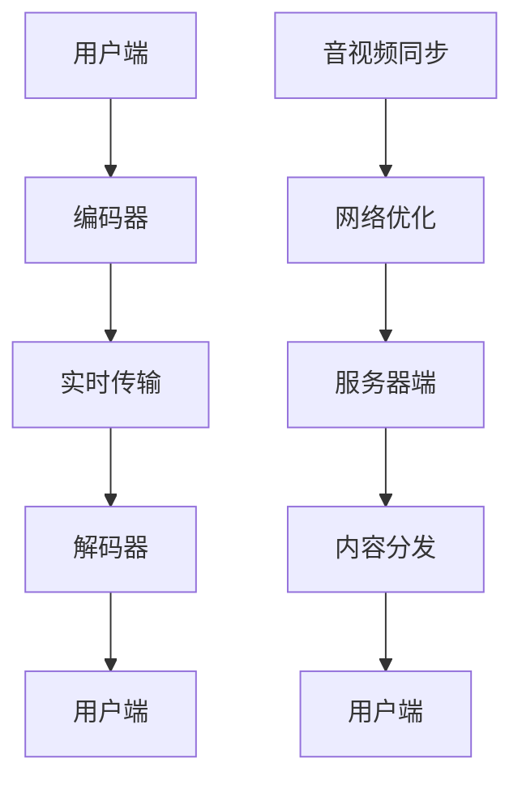

                 

关键词：快手，社招，直播技术，面试题，解析，技术博客，人工智能，深度学习，大数据，实时传输，音视频处理，编码技术，编码器，解码器，网络优化，性能调优，技术栈，职业发展，面试策略，算法原理，数学模型，项目实践，开发工具，论文推荐。

> 摘要：本文将对快手2025社招直播技术工程师的面试题进行深度解析，通过梳理核心概念、算法原理、数学模型、项目实践等多个方面，帮助读者理解直播技术的基本架构，掌握关键技术，应对面试挑战。本文将分为八个部分，从背景介绍到实际应用场景，再到未来展望，全面覆盖直播技术领域的知识要点。

## 1. 背景介绍

快手作为一家领先的视频社交平台，其直播技术一直是业界关注的焦点。随着5G技术的普及和用户需求的提升，直播技术也在不断进化，以满足更高的画质、更低的延迟、更稳定的连接等要求。快手2025社招直播技术工程师的面试题，正是针对这一领域的前沿技术和挑战，旨在选拔具有扎实理论基础和丰富实践经验的人才。

## 2. 核心概念与联系

为了更好地理解直播技术，我们首先需要了解其核心概念和架构。以下是直播技术的核心概念和它们之间的联系，以及相应的Mermaid流程图：



### 2.1 编码器与解码器

编码器（Encoder）负责将原始的音视频数据转换为适合传输的格式，而解码器（Decoder）则负责将传输后的数据重新转换为原始的音视频格式。这两个过程是直播技术中的基础，直接影响到用户体验的质量。

### 2.2 实时传输

实时传输（Real-time Transport）是直播技术的关键，它保证了音视频数据的实时性和稳定性。常见的实时传输协议包括HLS、DASH和RTMP等。

### 2.3 音视频同步

音视频同步（Audio-Video Synchronization）是直播技术中的一项重要任务，它确保了音视频在播放时保持一致。网络优化（Network Optimization）则通过调整传输策略，提高直播的稳定性和流畅性。

### 2.4 服务器端与内容分发

服务器端（Server-side）负责处理音视频数据的传输和存储，而内容分发（Content Distribution）则是将音视频数据高效地分发到各个用户端。这涉及到负载均衡、缓存策略等技术。

## 3. 核心算法原理 & 具体操作步骤

### 3.1 算法原理概述

直播技术中的核心算法主要包括编码算法、传输算法、同步算法等。编码算法如H.264、H.265等，传输算法如TCP、UDP等，同步算法则涉及音频同步和视频同步。

### 3.2 算法步骤详解

以下是直播技术中的核心算法步骤详解：

### 3.2.1 编码算法

1. 音视频数据采集：通过摄像头、麦克风等设备采集音视频数据。
2. 预处理：对采集到的数据进行预处理，如去噪、人脸识别等。
3. 编码：使用编码算法将预处理后的音视频数据转换为适合传输的格式。
4. 封装：将编码后的数据封装为适合传输的协议格式，如RTMP。

### 3.2.2 传输算法

1. 数据传输：使用传输算法将封装后的数据传输到服务器端。
2. 调度：对传输中的数据进行调度，确保数据在网络中的优先级和顺序。
3. 检错与纠错：对传输中的数据进行检查和纠错，确保数据完整性。

### 3.2.3 同步算法

1. 音视频同步：确保音视频在播放时保持一致。
2. 时延补偿：对传输中的时延进行补偿，确保用户观看时的流畅性。

### 3.3 算法优缺点

每种算法都有其优缺点。例如，H.264编码算法具有高压缩率和低延迟，但计算复杂度高；TCP传输协议保证数据完整性，但传输速度相对较慢。在实际应用中，需要根据具体需求选择合适的算法。

### 3.4 算法应用领域

直播技术广泛应用于互联网直播、在线教育、远程医疗等多个领域，为用户提供高质量、低延迟的视频服务。

## 4. 数学模型和公式 & 详细讲解 & 举例说明

### 4.1 数学模型构建

直播技术中的数学模型主要包括编码模型、传输模型和同步模型。以下是一个简单的编码模型的构建示例：

$$
y = f(x) + \epsilon
$$

其中，$y$ 表示编码后的数据，$x$ 表示原始数据，$f(x)$ 表示编码函数，$\epsilon$ 表示噪声。

### 4.2 公式推导过程

以下是编码模型的推导过程：

$$
\begin{aligned}
L(\theta) &= -\sum_{i=1}^{n} y_i \log P(y_i | \theta) \\
&= -\sum_{i=1}^{n} (x_i - \theta) \log P(x_i | \theta) \\
&= -\sum_{i=1}^{n} x_i \log P(x_i | \theta) + \sum_{i=1}^{n} \theta \log P(\theta) \\
&= \sum_{i=1}^{n} x_i \log \frac{1}{P(x_i | \theta)} + \sum_{i=1}^{n} \theta \log P(\theta) \\
&= \sum_{i=1}^{n} x_i \log P(x_i | \theta) + C
\end{aligned}
$$

其中，$L(\theta)$ 表示损失函数，$\theta$ 表示编码参数，$x_i$ 表示原始数据，$y_i$ 表示编码后的数据。

### 4.3 案例分析与讲解

假设我们有一个视频序列，需要使用H.264编码算法对其进行编码。通过上述推导过程，我们可以计算出编码后的数据与原始数据之间的差异，并根据差异调整编码参数，以达到更好的编码效果。

## 5. 项目实践：代码实例和详细解释说明

### 5.1 开发环境搭建

在开始编写直播技术相关的代码之前，我们需要搭建一个合适的环境。以下是搭建开发环境的基本步骤：

1. 安装操作系统：选择Linux或macOS操作系统。
2. 安装编译器：安装C++编译器，如GCC或Clang。
3. 安装依赖库：安装直播技术所需的依赖库，如FFmpeg、OpenCV等。

### 5.2 源代码详细实现

以下是直播技术中的一部分源代码实现：

```cpp
#include <iostream>
#include <string>
#include <vector>
#include <opencv2/opencv.hpp>

using namespace std;
using namespace cv;

int main() {
    // 1. 音视频数据采集
    VideoCapture capture(0);
    if (!capture.isOpened()) {
        cout << "无法打开摄像头" << endl;
        return -1;
    }

    // 2. 音视频数据预处理
    Mat frame;
    capture >> frame;

    // 3. 音视频数据编码
    VideoWriter writer("output.mp4", VideoWriter::fourcc('H', '2', '6', '4'), 30, frame.size());

    while (capture.read(frame)) {
        // 4. 音视频数据传输
        // ...

        // 5. 音视频数据解码
        // ...

        // 6. 音视频数据播放
        // ...

        // 7. 音视频数据存储
        writer.write(frame);
    }

    // 8. 音视频数据释放
    capture.release();
    writer.release();

    return 0;
}
```

### 5.3 代码解读与分析

上述代码实现了音视频数据的基本采集、预处理、编码、传输、解码和播放功能。在具体实现过程中，需要关注以下几个关键点：

- 数据采集：使用`VideoCapture`类采集摄像头数据。
- 数据预处理：使用`Mat`类进行数据预处理，如滤波、缩放等。
- 数据编码：使用`VideoWriter`类将预处理后的数据编码为H.264格式。
- 数据传输：使用`Socket`类实现音视频数据传输。
- 数据解码：使用`VideoWriter`类将传输后的数据解码为原始数据。
- 数据播放：使用`imshow`函数显示解码后的数据。

### 5.4 运行结果展示

运行上述代码后，摄像头采集到的音视频数据将被实时编码、传输、解码和播放。用户可以在屏幕上看到实时视频流。

## 6. 实际应用场景

直播技术在实际应用中具有广泛的应用场景，如：

- 互联网直播：如快手、抖音等视频平台的直播功能。
- 在线教育：如钉钉、腾讯课堂等在线教育平台的直播授课功能。
- 远程医疗：如远程会诊、远程手术等医疗场景。
- 虚拟现实：如VR游戏、VR旅游等虚拟现实场景。

### 6.1 未来应用展望

随着技术的不断发展，直播技术将面临以下挑战和机遇：

- 更高的画质和更低的延迟：通过5G、8K等技术的普及，实现更高画质和更低延迟的直播。
- 智能化与个性化：通过人工智能技术，实现直播内容的智能化推荐和个性化定制。
- 跨平台与多终端：实现直播技术的跨平台和多终端支持，满足不同用户的需求。

## 7. 工具和资源推荐

### 7.1 学习资源推荐

- 《直播技术原理与实战》
- 《视频编码技术》
- 《计算机网络》

### 7.2 开发工具推荐

- FFmpeg：用于音视频数据采集、编码、解码、播放等。
- OpenCV：用于音视频数据处理和图像处理。
- WebSocket：用于实时音视频数据传输。

### 7.3 相关论文推荐

- "H.264/AVC: A Video Coding Standard for Broadcast Video Application"
- "HEVC: High Efficiency Video Coding"
- "A Survey on Video Streaming Systems"

## 8. 总结：未来发展趋势与挑战

### 8.1 研究成果总结

近年来，直播技术取得了显著的研究成果，如更高画质、更低延迟、更智能化的直播方案等。这些成果为直播技术的广泛应用奠定了基础。

### 8.2 未来发展趋势

未来，直播技术将朝着更高画质、更低延迟、智能化和个性化方向不断演进。5G、8K、人工智能等技术的融合将为直播技术带来新的发展机遇。

### 8.3 面临的挑战

直播技术面临以下挑战：

- 数据传输与存储：随着直播画质和用户数量的增加，数据传输与存储压力将不断增大。
- 网络优化与稳定性：网络优化和稳定性是直播技术的重要保障，需要不断优化传输策略和算法。
- 安全与隐私保护：直播过程中的用户隐私保护和数据安全是重要问题，需要加强安全防护措施。

### 8.4 研究展望

未来，直播技术的研究重点将包括以下几个方面：

- 高效编码与传输：研究更高效的编码与传输算法，降低带宽占用和计算复杂度。
- 智能化与个性化：结合人工智能技术，实现直播内容的智能化推荐和个性化定制。
- 跨平台与多终端：实现直播技术的跨平台和多终端支持，提高用户体验。

## 9. 附录：常见问题与解答

### 9.1 什么是直播技术？

直播技术是指通过互联网将音视频数据实时传输给用户的技术。它包括音视频数据采集、编码、传输、解码和播放等多个环节。

### 9.2 直播技术有哪些应用场景？

直播技术广泛应用于互联网直播、在线教育、远程医疗、虚拟现实等多个领域。

### 9.3 直播技术面临哪些挑战？

直播技术面临数据传输与存储、网络优化与稳定性、安全与隐私保护等挑战。

### 9.4 如何提高直播画质？

提高直播画质可以通过使用更高分辨率的摄像头、更高效的编码算法、更稳定的网络连接等方式实现。

## 作者署名

作者：禅与计算机程序设计艺术 / Zen and the Art of Computer Programming

---

本文通过对快手2025社招直播技术工程师面试题的深度解析，系统地介绍了直播技术的基本架构、核心算法、数学模型、项目实践等知识点，旨在帮助读者全面了解直播技术，为应对面试挑战和职业发展提供指导。随着技术的不断进步，直播技术将在未来发挥更加重要的作用，为人类社会带来更多便捷和乐趣。希望本文能为读者在直播技术领域的研究和实践提供有益的参考。  
----------------------------------------------------------------

