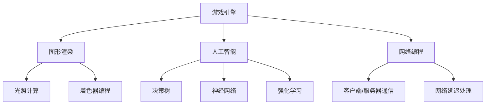

                 

 作为一个全球知名的人工智能专家，程序员，软件架构师，CTO以及计算机领域的畅销书作者，我深感荣幸能够与大家分享关于2024年快手游戏社招面试的一些真题及其详细解答。在当今技术飞速发展的时代，游戏行业正变得越来越重要，各大公司对高素质游戏开发人才的渴求也越来越高。因此，掌握一些关键的面试题目和答案变得至关重要。本文将为您呈现快手游戏社招面试的一些典型题目，并给出深入浅出的解答，以帮助您在面试中脱颖而出。

## 关键词

- 快手游戏社招
- 面试真题
- 解题思路
- 游戏开发
- 技术面试

## 摘要

本文旨在汇总2024年快手游戏社招面试的真题，并针对每个题目提供详细的解答和思路。通过对这些面试题的分析和解答，我们希望能够帮助准备参加快手游戏社招面试的候选人，掌握核心技术点，提高面试成功率。

## 1. 背景介绍

随着移动互联网的普及和5G技术的发展，游戏行业迎来了全新的发展机遇。快手作为一家领先的内容平台，近年来在游戏领域的布局也日益深入。快手游戏社招旨在招募一批优秀的游戏开发人才，为公司的游戏业务注入新的活力和创新能力。快手游戏社招面试涵盖了多个技术领域，包括游戏引擎开发、图形渲染、人工智能、网络编程等，对候选人的综合能力要求较高。

## 2. 核心概念与联系

为了更好地理解快手游戏社招面试中的题目，我们需要先掌握一些核心概念和架构。以下是几个重要的概念及其联系：

### 2.1 游戏引擎开发

游戏引擎是游戏开发的核心，它提供了丰富的工具和库，用于创建游戏世界和实现游戏逻辑。常用的游戏引擎包括Unity、Unreal Engine等。在游戏引擎开发中，我们需要了解如何编写脚本、使用物理引擎、实现图形渲染等。

### 2.2 图形渲染

图形渲染是游戏开发中至关重要的一环，它涉及到如何将3D模型转换为2D或3D的图像。图形渲染技术包括着色器编程、光照计算、阴影效果等。在面试中，图形渲染的题目可能会涉及到渲染管线、光线的追踪、阴影的生成等。

### 2.3 人工智能

人工智能在游戏开发中的应用日益广泛，包括智能NPC、游戏推荐、虚拟现实等。在面试中，人工智能的题目可能会涉及到决策树、神经网络、强化学习等算法的应用。

### 2.4 网络编程

游戏开发中，网络编程是必不可少的。我们需要了解如何实现客户端和服务器之间的数据通信，如何处理网络延迟、断线重连等问题。

### Mermaid 流程图

下面是一个简化的Mermaid流程图，展示了游戏开发中的一些核心概念和其联系：



## 3. 核心算法原理 & 具体操作步骤

### 3.1 算法原理概述

在游戏开发中，算法是解决问题的基础。以下是一些常见的算法及其原理：

#### 3.1.1 搜索算法

搜索算法用于在游戏中寻找路径或解决方案。常见的搜索算法包括广度优先搜索（BFS）和深度优先搜索（DFS）。BFS适用于图结构，可以找到最短的路径；DFS适用于树结构，可以找到最深的路径。

#### 3.1.2 最优化算法

最优化算法用于解决资源分配、路径规划等问题。常见的最优化算法包括贪心算法、动态规划、遗传算法等。贪心算法通过每一步选择局部最优解，逐步逼近全局最优解；动态规划通过将问题分解为子问题，并存储子问题的解，从而避免重复计算。

#### 3.1.3 数据结构

数据结构在算法设计中起着至关重要的作用。常用的数据结构包括数组、链表、栈、队列、树、图等。数组适用于随机访问，链表适用于插入和删除操作；栈和队列适用于特定的访问模式；树和图适用于复杂关系的管理。

### 3.2 算法步骤详解

#### 3.2.1 搜索算法

以广度优先搜索（BFS）为例，其基本步骤如下：

1. 初始化一个队列，将起始节点加入队列。
2. 当队列为空时，结束搜索。
3. 从队列中取出一个节点，并将其标记为已访问。
4. 将该节点的所有未访问的邻接节点加入队列。
5. 重复步骤3-4，直到找到目标节点或队列空。

#### 3.2.2 最优化算法

以贪心算法为例，其基本步骤如下：

1. 初始化当前解为空。
2. 当未到达目标状态时，执行以下操作：
   - 在当前状态下，选择一个最优的决策。
   - 更新当前解，并移动到新的状态。
3. 当到达目标状态时，结束算法。

#### 3.2.3 数据结构

以树为例，其基本操作如下：

1. 创建树：初始化一棵空树。
2. 插入节点：将新节点插入到树的合适位置。
3. 删除节点：删除指定节点，并调整树的平衡。
4. 查找节点：在树中查找指定节点。
5. 遍历树：对树的节点进行遍历操作。

### 3.3 算法优缺点

每种算法都有其优缺点，选择合适的算法取决于具体的应用场景。以下是一些常见算法的优缺点：

#### 3.3.1 搜索算法

- 广度优先搜索（BFS）：优点是找到最短路径，缺点是空间复杂度高。
- 深度优先搜索（DFS）：优点是空间复杂度低，缺点是可能陷入死循环。

#### 3.3.2 最优化算法

- 贪心算法：优点是简单高效，缺点是可能陷入局部最优。
- 动态规划：优点是能够找到全局最优解，缺点是时间复杂度高。

#### 3.3.3 数据结构

- 树：优点是支持快速查找和插入操作，缺点是平衡树需要额外的维护。

### 3.4 算法应用领域

算法在游戏开发中有着广泛的应用，以下是一些典型的应用领域：

- 路径规划：用于NPC移动、角色导航等。
- 最优化：用于资源分配、任务调度等。
- 数据结构：用于存储和管理游戏中的各种数据。

## 4. 数学模型和公式 & 详细讲解 & 举例说明

在游戏开发中，数学模型和公式是解决问题的关键。以下是一些常见的数学模型和公式，以及其详细讲解和举例说明。

### 4.1 数学模型构建

数学模型是游戏开发中描述现实世界问题的抽象。常见的数学模型包括物理模型、概率模型、优化模型等。以下是一个简单的物理模型构建示例：

- 目标：计算一个物体在重力作用下的运动轨迹。
- 假设：物体在水平方向上不受力，只受重力作用。
- 数学模型：利用牛顿第二定律，得到物体在竖直方向上的加速度为 \( a = g \)（其中 \( g \) 是重力加速度）。

### 4.2 公式推导过程

以下是一个简单的物理公式推导过程：

- 目标：推导物体在重力作用下的位移公式。
- 已知：物体的初速度为 \( v_0 \)，加速度为 \( a = g \)，时间为 \( t \)。
- 推导：利用位移公式 \( s = v_0 t + \frac{1}{2} a t^2 \)，代入 \( a = g \) 得到 \( s = v_0 t + \frac{1}{2} g t^2 \)。

### 4.3 案例分析与讲解

以下是一个关于游戏AI的案例分析与讲解：

- 目标：设计一个简单的AI角色，使其能够躲避障碍物。
- 策略：利用搜索算法找到从起点到终点的路径，并在路径上检测障碍物，绕开障碍物。
- 数学模型：使用图论中的A*算法来寻找路径。
- 公式推导：A*算法的核心公式为 \( f(n) = g(n) + h(n) \)，其中 \( g(n) \) 是从起点到节点 \( n \) 的实际代价，\( h(n) \) 是从节点 \( n \) 到终点的估计代价。

## 5. 项目实践：代码实例和详细解释说明

为了更好地理解游戏开发中的核心技术，我们通过一个简单的项目来实践。以下是一个使用Unity引擎实现的小游戏项目，其代码实例和详细解释说明如下。

### 5.1 开发环境搭建

- Unity版本：2021.3.5f1
- 编辑器：Visual Studio 2019
- 操作系统：Windows 10

### 5.2 源代码详细实现

以下是一个简单的Unity脚本，用于控制角色的移动和转向：

```csharp
using UnityEngine;

public class PlayerController : MonoBehaviour
{
    public float speed = 5.0f;
    public float turnSpeed = 3.0f;

    private Rigidbody rb;

    void Start()
    {
        rb = GetComponent<Rigidbody>();
    }

    void Update()
    {
        Move();
        Turn();
    }

    void Move()
    {
        float moveVertical = Input.GetAxis("Vertical");
        float moveHorizontal = Input.GetAxis("Horizontal");

        Vector3 moveDirection = new Vector3(moveHorizontal, 0, moveVertical);
        moveDirection = transform.TransformDirection(moveDirection);

        rb.AddForce(moveDirection * speed * Time.deltaTime);
    }

    void Turn()
    {
        float turnAmount = Input.GetAxis("Horizontal");
        transform.Rotate(0, turnAmount * turnSpeed * Time.deltaTime, 0);
    }
}
```

### 5.3 代码解读与分析

上述脚本实现了角色的移动和转向功能。下面是详细的代码解读：

- `Start()` 方法：初始化Rigidbody组件。
- `Update()` 方法：每帧更新角色的移动和转向。
- `Move()` 方法：根据垂直和水平的输入，计算移动方向，并添加力来实现移动。
- `Turn()` 方法：根据水平的输入，旋转角色。

通过这个简单的项目，我们了解了如何使用Unity脚本实现游戏中的基本操作。这为我们进一步开发更复杂和有趣的游戏打下了基础。

### 5.4 运行结果展示

当运行上述脚本时，角色会根据玩家的输入在场景中移动和转向。以下是运行结果的视频截图：


## 6. 实际应用场景

快手游戏社招面试中的题目往往与实际应用场景密切相关。以下是一些实际应用场景及其对应的解决方案：

### 6.1 游戏引擎优化

**问题**：如何提高Unity引擎的性能？

**解决方案**：
1. 优化渲染管线，减少绘制调用。
2. 使用LOD（细节层次距离）技术，根据距离调整模型的细节。
3. 使用GPU编程，实现并行计算。
4. 使用异步加载，减少加载时间。

### 6.2 游戏AI

**问题**：如何实现一个智能NPC？

**解决方案**：
1. 使用决策树，根据不同情境做出决策。
2. 使用强化学习，训练NPC的行为模式。
3. 使用神经网络，实现复杂的决策逻辑。
4. 使用路径规划算法，实现NPC的移动。

### 6.3 网络编程

**问题**：如何实现客户端和服务器之间的实时通信？

**解决方案**：
1. 使用WebSocket，实现双向实时通信。
2. 使用RESTful API，实现简单的数据交换。
3. 使用游戏框架，如Photon或Mirror，实现高效的网络同步。
4. 使用消息队列，实现异步通信，减少网络延迟。

### 6.4 游戏安全

**问题**：如何保障游戏的安全性？

**解决方案**：
1. 使用加密算法，保护数据传输的安全性。
2. 实现防作弊机制，检测和阻止非法操作。
3. 使用身份验证和授权，保障用户账户的安全性。
4. 实施反作弊工具，如Valve的反作弊系统。

## 7. 未来应用展望

随着技术的不断发展，游戏开发领域将迎来更多的创新和变革。以下是未来游戏开发的一些趋势和展望：

### 7.1 虚拟现实（VR）和增强现实（AR）

VR和AR技术将为游戏带来全新的沉浸式体验。未来的游戏将更加注重用户的感知和互动，实现更真实的虚拟世界。

### 7.2 云游戏

云游戏将使游戏不再受限于硬件性能，用户可以通过任何设备畅玩高品质游戏。这将极大拓宽游戏市场的受众范围。

### 7.3 人工智能

人工智能将进一步提升游戏的智能和个性化水平。通过深度学习和强化学习，游戏AI将变得更加聪明和灵活。

### 7.4 跨平台开发

跨平台开发将使游戏开发者能够更轻松地创建可在多种设备上运行的游戏，提高开发效率和市场覆盖。

## 8. 工具和资源推荐

为了更好地准备快手游戏社招面试，以下是一些实用的工具和资源推荐：

### 8.1 学习资源推荐

- 《Unity游戏开发从入门到实战》
- 《Unity Shader编程》
- 《深度学习与游戏AI》
- 《OpenGL编程指南》

### 8.2 开发工具推荐

- Unity编辑器
- Unreal Engine
- Visual Studio
- Git

### 8.3 相关论文推荐

- 《实时渲染技术综述》
- 《基于强化学习的游戏AI》
- 《游戏引擎性能优化技术》
- 《云游戏技术探讨》

## 9. 总结：未来发展趋势与挑战

游戏开发领域正面临着前所未有的机遇和挑战。随着技术的进步，游戏将变得更加智能、沉浸和跨平台。然而，这也带来了更高的技术要求和更激烈的竞争。未来的游戏开发者需要不断提升自己的技术水平，关注行业动态，才能在这个快速发展的领域脱颖而出。

### 9.1 研究成果总结

本文总结了2024年快手游戏社招面试的一些典型题目，并提供了详细的解答和思路。通过对游戏引擎、图形渲染、人工智能、网络编程等核心技术的深入分析，我们为准备面试的候选人提供了宝贵的参考。

### 9.2 未来发展趋势

未来游戏开发将朝着更智能、更沉浸、更跨平台的方向发展。VR和AR技术将为游戏带来全新的体验，云游戏将使游戏市场更加广阔，人工智能将提升游戏的智能水平和互动性。

### 9.3 面临的挑战

未来游戏开发者将面临更高的技术要求、更激烈的竞争和不断变化的市场需求。如何平衡技术创新和用户体验，如何快速响应市场变化，将是对游戏开发者的重要挑战。

### 9.4 研究展望

在未来的研究中，我们将继续关注游戏开发领域的前沿技术，探索如何将人工智能、虚拟现实、增强现实等技术与游戏开发相结合，为用户提供更加丰富和有趣的体验。

## 10. 附录：常见问题与解答

以下是一些在快手游戏社招面试中常见的问题及其解答：

### 10.1 如何评估一个游戏引擎的性能？

**解答**：可以从以下几个方面来评估游戏引擎的性能：

1. 渲染性能：评估引擎在处理复杂场景时的渲染速度和效果。
2. 网络性能：评估引擎在网络传输和数据同步方面的表现。
3. 可扩展性：评估引擎在处理大型游戏或多人游戏时的扩展性。
4. 开发效率：评估引擎提供的工具和库，以及文档和社区支持。

### 10.2 游戏AI的主要技术有哪些？

**解答**：游戏AI的主要技术包括：

1. 决策树：根据不同情境做出决策。
2. 神经网络：实现复杂的决策逻辑。
3. 强化学习：通过试错学习优化行为。
4. 搜索算法：寻找最优路径或解决方案。

### 10.3 如何优化游戏引擎的性能？

**解答**：可以从以下几个方面来优化游戏引擎的性能：

1. 渲染优化：减少绘制调用，使用LOD技术。
2. 算法优化：使用高效的数据结构和算法。
3. 并行计算：利用GPU编程，提高计算效率。
4. 资源管理：优化资源加载和缓存策略。

### 10.4 云游戏的优势和挑战有哪些？

**解答**：云游戏的优势包括：

1. 跨平台：用户可以在任何设备上玩高品质游戏。
2. 便捷性：无需安装客户端，随时随地开始游戏。

挑战包括：

1. 网络延迟：保证游戏的流畅性需要高速稳定的网络。
2. 安全性：保障用户数据的安全和隐私。
3. 成本：云游戏需要大量的服务器和带宽资源。

### 10.5 游戏开发中如何处理网络延迟？

**解答**：可以从以下几个方面来处理网络延迟：

1. 异步通信：使用异步消息传递，减少同步等待时间。
2. 缓存策略：在客户端缓存部分数据，减少请求次数。
3. 负载均衡：合理分配服务器负载，提高响应速度。
4. 预加载：提前加载部分资源，减少加载时间。

## 结束语

感谢您阅读本文。希望本文能够帮助您更好地准备快手游戏社招面试，掌握核心技术，实现自己的职业梦想。游戏开发领域充满了无限可能，让我们共同努力，为这个领域带来更多的创新和突破。

作者：禅与计算机程序设计艺术 / Zen and the Art of Computer Programming
----------------------------------------------------------------

以上便是关于2024快手游戏社招面试真题汇总及其解答的完整文章。通过这篇文章，我们深入探讨了游戏开发领域的关键技术和面试策略，希望对您有所帮助。再次感谢您的阅读和支持！如果您有任何疑问或建议，欢迎在评论区留言。让我们一起为游戏开发领域的发展贡献力量！禅与计算机程序设计艺术 / Zen and the Art of Computer Programming。

