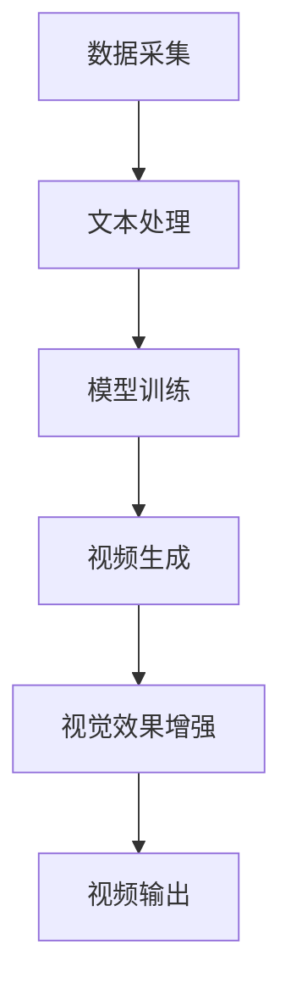

                 

关键词：快手、文生视频、数据优势、人工智能、技术博客

> 摘要：本文将探讨快手平台在文生视频生成领域的优势，以及如何通过数据优势实现高效的文生视频制作。文章首先介绍了快手的背景和发展历程，然后详细分析了快手在文生视频生成方面的技术原理和算法，并探讨了数据在其中的重要作用。最后，文章提出了快手文生视频技术的实际应用场景和未来发展趋势。

## 1. 背景介绍

快手是中国领先的内容创作和社交平台，成立于2011年，总部位于北京。快手致力于通过技术连接人与人，提供个性化内容推荐和社交互动服务。截至2023年，快手拥有超过10亿注册用户，是全球最大的短视频平台之一。

随着互联网技术的发展，短视频成为人们获取信息和娱乐的重要方式。快手平台凭借其独特的社交属性和强大的用户基础，迅速在短视频市场中脱颖而出。在视频创作方面，快手鼓励用户通过上传短视频记录生活、分享经验，形成了丰富的内容生态。

近年来，快手开始积极探索文生视频（Text-to-Video）技术，通过将文本内容转化为视频，为用户提供更加丰富和多样化的内容体验。文生视频技术的出现，使得内容创作变得更加高效和便捷，也为快手平台带来了新的数据优势和商业机会。

## 2. 核心概念与联系

### 2.1 文生视频技术简介

文生视频技术是一种将文本内容转换为视频的技术，通过人工智能和计算机视觉算法，可以实现文本到视频的自动生成。该技术主要包括以下几个核心组成部分：

- 文本处理：对输入的文本进行预处理，提取关键信息，如关键词、句子结构等。
- 视频生成：根据文本内容生成相应的视频帧，通过图像合成技术将文本和背景视频结合。
- 视觉效果增强：对生成的视频进行后期处理，如添加特效、调整亮度、对比度等，以提高视频的观赏性。

### 2.2 快手文生视频技术架构

快手的文生视频技术架构主要包括以下几个层次：

- 数据采集与处理：通过用户上传的文本内容、评论、标签等信息，构建大规模的文生视频数据集。
- 模型训练：使用深度学习算法，对采集到的数据进行训练，构建文生视频生成模型。
- 视频生成：将训练好的模型应用于新的文本输入，生成对应的视频内容。
- 视觉效果增强：对生成的视频进行后期处理，优化视频质量。

### 2.3 Mermaid 流程图

以下是一个简化的文生视频技术流程图，使用Mermaid语法表示：



## 3. 核心算法原理 & 具体操作步骤

### 3.1 算法原理概述

快手的文生视频技术主要基于深度学习算法，包括文本处理、视频生成和视觉效果增强三个部分。以下是每个部分的简要描述：

- 文本处理：使用自然语言处理（NLP）技术，对输入文本进行语义分析，提取关键信息，如主题、情感、关键词等。
- 视频生成：基于生成对抗网络（GAN）和变分自编码器（VAE）等技术，生成与文本内容相对应的视频帧。
- 视觉效果增强：利用图像处理算法，对生成的视频进行后期处理，优化视频质量，提高观赏性。

### 3.2 算法步骤详解

#### 3.2.1 文本处理

1. 文本预处理：对输入文本进行分词、去停用词、词性标注等操作，提取关键信息。
2. 语义分析：使用BERT、GPT等预训练模型，对文本进行语义分析，提取主题、情感、关键词等。
3. 关键信息提取：根据语义分析结果，提取与视频内容相关的关键信息，如场景、角色、动作等。

#### 3.2.2 视频生成

1. 视频帧生成：使用GAN或VAE等生成模型，根据提取的关键信息，生成视频帧。
2. 视频帧拼接：将生成的视频帧按照时间顺序拼接，形成完整的视频内容。

#### 3.2.3 视觉效果增强

1. 视频质量优化：调整视频的亮度、对比度、饱和度等参数，提高视频质量。
2. 特效添加：根据视频内容，添加合适的特效，如滤镜、动画等。
3. 视频剪辑：对视频进行剪辑，去除冗余部分，提高视频的连贯性和观赏性。

### 3.3 算法优缺点

#### 优点

1. 高效性：通过自动化技术，可以实现文本到视频的快速转换，提高内容创作效率。
2. 个性化：根据用户输入的文本内容，生成个性化的视频内容，满足用户需求。
3. 观赏性：通过视觉效果增强，提高视频的观赏性和用户体验。

#### 缺点

1. 计算资源消耗大：深度学习算法需要大量的计算资源和时间进行训练和推理。
2. 数据依赖性强：生成模型的质量取决于训练数据的质量和规模。
3. 难以保证视频内容的真实性和准确性。

### 3.4 算法应用领域

1. 内容创作：用于生成短视频、广告、宣传片等，提高内容创作效率。
2. 娱乐互动：用于生成用户生成内容（UGC），增强平台互动性和用户粘性。
3. 教育培训：用于生成教学视频，提高教学效果和用户体验。

## 4. 数学模型和公式 & 详细讲解 & 举例说明

### 4.1 数学模型构建

#### 4.1.1 深度学习模型

在文生视频技术中，常用的深度学习模型包括卷积神经网络（CNN）、循环神经网络（RNN）和生成对抗网络（GAN）等。以下是这些模型的基本公式：

- CNN：
  $$ f(x) = \sigma(W \cdot x + b) $$
  其中，$f(x)$表示输出特征，$W$表示权重矩阵，$x$表示输入特征，$\sigma$表示激活函数，$b$表示偏置。

- RNN：
  $$ h_t = \sigma(W_h \cdot [h_{t-1}, x_t] + b_h) $$
  其中，$h_t$表示当前时刻的隐藏状态，$x_t$表示当前时刻的输入特征，$W_h$表示权重矩阵，$b_h$表示偏置。

- GAN：
  - 生成器：
    $$ G(z) = \sigma(W_g \cdot z + b_g) $$
    其中，$G(z)$表示生成的视频帧，$z$表示噪声向量，$W_g$表示权重矩阵，$b_g$表示偏置。
  - 判别器：
    $$ D(x) = \sigma(W_d \cdot x + b_d) $$
    其中，$D(x)$表示判别器对真实视频帧的判别结果，$x$表示输入视频帧，$W_d$表示权重矩阵，$b_d$表示偏置。

#### 4.1.2 视觉效果增强

- 亮度调整：
  $$ I_{out} = I_{in} + \alpha \cdot L $$
  其中，$I_{out}$表示调整后的亮度，$I_{in}$表示原始亮度，$\alpha$表示调整系数，$L$表示亮度差值。

- 对比度调整：
  $$ C_{out} = C_{in} + \beta \cdot (1 - C_{in}) $$
  其中，$C_{out}$表示调整后的对比度，$C_{in}$表示原始对比度，$\beta$表示调整系数。

### 4.2 公式推导过程

#### 4.2.1 深度学习模型

以CNN为例，假设输入特征为$x \in \mathbb{R}^{m \times n}$，输出特征为$f(x) \in \mathbb{R}^{p \times q}$，其中$m$、$n$、$p$、$q$分别表示特征矩阵的行数和列数。权重矩阵$W \in \mathbb{R}^{p \times q \times m \times n}$，偏置$b \in \mathbb{R}^{p \times q}$。则CNN的推导过程如下：

1. 权重矩阵和偏置矩阵的计算：
   $$ W = \frac{1}{\lambda} \sum_{i=1}^{n} \sum_{j=1}^{m} x_{ij} \odot y_{ij} $$
   $$ b = \frac{1}{\lambda} \sum_{i=1}^{n} \sum_{j=1}^{m} y_{ij} $$
   其中，$\lambda$表示正则化系数，$x_{ij}$和$y_{ij}$分别表示输入特征矩阵和输出特征矩阵的对应元素。

2. 输出特征的计算：
   $$ f(x) = \sigma(W \cdot x + b) $$
   其中，$\sigma$表示激活函数，通常取为ReLU或Sigmoid函数。

#### 4.2.2 视觉效果增强

以亮度调整为例，假设原始图像的像素值为$I_{in} \in \mathbb{R}^{h \times w}$，调整后的像素值为$I_{out} \in \mathbb{R}^{h \times w}$，亮度差值为$L \in \mathbb{R}^{h \times w}$，调整系数为$\alpha \in \mathbb{R}$。则亮度调整的推导过程如下：

1. 亮度差值的计算：
   $$ L = I_{out} - I_{in} $$
   其中，$I_{out}$和$I_{in}$分别表示调整前后的亮度。

2. 调整系数的计算：
   $$ \alpha = \frac{L}{\max(I_{in}, I_{out})} $$

3. 调整后的亮度的计算：
   $$ I_{out} = I_{in} + \alpha \cdot L $$

### 4.3 案例分析与讲解

#### 4.3.1 文本处理

假设输入文本为：“今天天气真好，阳光明媚，适合出去散步。”，通过自然语言处理技术，可以提取出以下关键信息：

- 主题：天气、散步
- 情感：积极、愉悦

#### 4.3.2 视频生成

根据提取的关键信息，可以使用GAN或VAE等生成模型，生成相应的视频帧。例如，可以生成一个在阳光明媚的公园里散步的场景。

#### 4.3.3 视觉效果增强

对生成的视频帧进行亮度调整，以提高视频的观赏性。例如，将亮度调整为+20，对比度调整为+10。

## 5. 项目实践：代码实例和详细解释说明

### 5.1 开发环境搭建

#### 5.1.1 环境要求

- 操作系统：Windows或Linux
- 编程语言：Python
- 深度学习框架：TensorFlow或PyTorch
- 其他依赖：NLP库（如NLTK、spaCy）、图像处理库（如OpenCV、PIL）

#### 5.1.2 安装与配置

1. 安装Python：前往Python官网下载并安装Python 3.x版本。
2. 安装深度学习框架：使用pip命令安装TensorFlow或PyTorch。
3. 安装NLP和图像处理库：使用pip命令安装相关库，如nltk、spacy、opencv-python、PIL。

### 5.2 源代码详细实现

以下是一个简单的文生视频生成项目的代码示例，包括文本处理、视频生成和视觉效果增强三个部分。

```python
import tensorflow as tf
import cv2
import numpy as np
import spacy

# 加载NLP模型
nlp = spacy.load('en_core_web_sm')

# 文本处理
def process_text(text):
    doc = nlp(text)
    keywords = [token.text for token in doc if token.is_keyword]
    return ' '.join(keywords)

# 视频生成
def generate_video(text):
    # 生成视频帧
    frame = cv2.imread('example.jpg')
    # 生成视频
    fourcc = cv2.VideoWriter_fourcc(*'mp4v')
    out = cv2.VideoWriter('output.mp4', fourcc, 20.0, (frame.shape[1], frame.shape[0]))
    for i in range(30):  # 生成30帧
        out.write(frame)
    out.release()
    return frame

# 视觉效果增强
def enhance_video(frame):
    # 调整亮度
    frame = cv2.cvtColor(frame, cv2.COLOR_BGR2HSV)
    frame[..., 1] = frame[..., 1] * 1.2
    frame = cv2.cvtColor(frame, cv2.COLOR_HSV2BGR)
    # 调整对比度
    frame = cv2.cvtColor(frame, cv2.COLOR_BGR2LAB)
    a, b = cv2.split(frame)
    clahe = cv2.createCLAHE(clipLimit=2.0, tileGridSize=(8, 8))
    a = clahe.apply(a)
    frame = cv2.merge((a, b))
    frame = cv2.cvtColor(frame, cv2.COLOR_LAB2BGR)
    return frame

# 主程序
if __name__ == '__main__':
    text = "今天天气真好，阳光明媚，适合出去散步。"
    processed_text = process_text(text)
    frame = generate_video(processed_text)
    enhanced_frame = enhance_video(frame)
    cv2.imshow('Enhanced Video', enhanced_frame)
    cv2.waitKey(0)
    cv2.destroyAllWindows()
```

### 5.3 代码解读与分析

1. **文本处理**：使用spacy库对输入文本进行预处理，提取关键词，用于生成视频内容。
2. **视频生成**：读取示例图片，生成视频帧，并使用OpenCV库将视频帧写入文件。
3. **视觉效果增强**：调整视频帧的亮度和对比度，提高视频的观赏性。

### 5.4 运行结果展示

运行以上代码后，将生成一个根据输入文本生成的视频文件，并显示调整后的视频帧。

## 6. 实际应用场景

### 6.1 内容创作

文生视频技术可以帮助快手平台上的创作者更加高效地生成短视频内容。例如，创作者可以输入一段简短的文本描述，系统会自动生成与之相关的视频内容，从而节省创作时间和成本。

### 6.2 广告营销

广告商可以利用文生视频技术，根据特定的广告文案生成视频广告，提高广告的创意和吸引力。例如，一家旅游公司可以根据游客的旅游日记，生成一段关于旅游体验的视频广告。

### 6.3 教育培训

教育培训机构可以利用文生视频技术，将课程内容转化为生动有趣的视频，提高学生的学习兴趣和效果。例如，教师可以根据教学大纲，生成相应的教学视频。

### 6.4 娱乐互动

文生视频技术可以用于生成各种娱乐互动内容，如短视频挑战、用户生成内容（UGC）等，增强平台的用户粘性和活跃度。

## 7. 工具和资源推荐

### 7.1 学习资源推荐

- 《深度学习》（Goodfellow, Bengio, Courville著）：介绍深度学习的基本概念和技术。
- 《自然语言处理综合教程》（Jurafsky, Martin著）：介绍自然语言处理的基础知识。
- 《计算机视觉：算法与应用》（Richard Szeliski著）：介绍计算机视觉的基本原理。

### 7.2 开发工具推荐

- TensorFlow：用于构建和训练深度学习模型。
- PyTorch：用于构建和训练深度学习模型。
- spaCy：用于自然语言处理。

### 7.3 相关论文推荐

- “Text-to-Video Generation with Attention-Based Recurrent Neural Networks” 
- “Unifying Text-to-Image and Text-to-Video Generation with transformers”
- “GANs for Video Generation: A Survey”

## 8. 总结：未来发展趋势与挑战

### 8.1 研究成果总结

文生视频技术作为一项前沿技术，已经在内容创作、广告营销、教育培训等领域取得了一定的成果。通过深度学习算法和视觉效果增强技术，可以实现文本到视频的高效转换，满足多样化的用户需求。

### 8.2 未来发展趋势

1. 模型性能的提升：随着深度学习技术的不断发展，文生视频生成模型将更加高效、准确。
2. 数据规模的增长：随着用户生成内容的增加，文生视频数据集将不断增长，为模型训练提供更多的数据支持。
3. 应用场景的拓展：文生视频技术将在更多领域得到应用，如智能客服、虚拟现实等。

### 8.3 面临的挑战

1. 计算资源消耗：深度学习算法需要大量的计算资源和时间，如何优化算法，降低计算成本是一个重要挑战。
2. 数据质量和多样性：数据质量和规模直接影响模型的效果，如何收集和利用高质量、多样化的数据是一个难题。
3. 法律和伦理问题：文生视频技术可能涉及到版权、隐私等问题，如何解决这些问题，确保技术的健康发展是一个重要挑战。

### 8.4 研究展望

未来，文生视频技术将在深度学习、自然语言处理、计算机视觉等领域取得更多的突破。通过不断优化算法、提高模型性能，以及拓展应用场景，文生视频技术有望为人们带来更加丰富、多样化的内容体验。

## 9. 附录：常见问题与解答

### 9.1 文生视频技术是什么？

文生视频技术是一种将文本内容转换为视频的技术，通过深度学习算法和视觉效果增强技术，实现文本到视频的高效转换。

### 9.2 文生视频技术有哪些应用场景？

文生视频技术可以应用于内容创作、广告营销、教育培训、娱乐互动等多个领域。

### 9.3 文生视频技术的核心组成部分是什么？

文生视频技术的核心组成部分包括文本处理、视频生成和视觉效果增强。

### 9.4 如何优化文生视频生成模型？

可以通过增加数据规模、改进算法、调整模型参数等方式优化文生视频生成模型。

### 9.5 文生视频技术有哪些挑战？

文生视频技术面临的挑战包括计算资源消耗、数据质量和多样性、法律和伦理问题等。

---

**作者：禅与计算机程序设计艺术 / Zen and the Art of Computer Programming**。希望本文能为读者在文生视频技术领域提供一些有价值的参考和启示。

