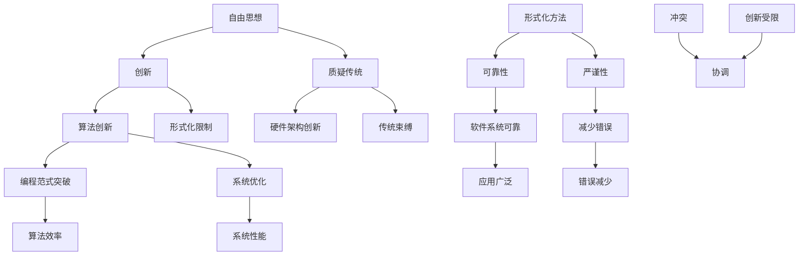

                 

关键词：自由，形式化，编程，算法，数学模型，实践应用

> 摘要：本文探讨了计算机编程中思想自由与形式化之间的微妙关系。在计算机科学的各个领域中，自由思想与形式化方法相辅相成，既推动了技术创新，也带来了挑战。本文将通过算法原理、数学模型、项目实践等方面，深入剖析这种关系，并提出未来发展的趋势和面临的挑战。

## 1. 背景介绍

计算机科学的发展历程中，自由思想与创新精神一直是推动技术进步的重要动力。从图灵机的概念提出，到现代计算机的广泛应用，自由思想促使科学家们不断探索新的算法和架构，以解决复杂的问题。然而，随着计算机科学的不断发展，形式化方法的重要性也越来越凸显。形式化方法通过严格的数学模型和算法，确保了软件系统的可靠性和效率，为技术的可靠应用提供了保障。

在这两者之间，自由思想与形式化方法相互影响，既存在冲突，也相辅相成。本文将探讨这种冲突与协调，以及它们在计算机科学各个领域的具体应用。

## 2. 核心概念与联系

### 2.1 自由思想

自由思想是指人们在解决问题时不受传统思维束缚，敢于挑战现状、提出新观点和新方法。在计算机科学中，自由思想常常表现为对现有算法的质疑、对硬件架构的创新、对编程范式的突破等。

### 2.2 形式化方法

形式化方法是一种通过严格的数学模型和算法来解决问题的方法。它在计算机科学中的应用广泛，包括形式化验证、形式化推理、形式化语言等。形式化方法的优势在于其严谨性和可靠性，但同时也可能限制创新的自由度。

### 2.3 关系图

以下是自由思想与形式化方法之间的关系图：



## 3. 核心算法原理 & 具体操作步骤

### 3.1 算法原理概述

本文将探讨一种基于形式化方法的排序算法——快速排序。快速排序是一种高效的排序算法，其核心思想是通过递归将一个待排序数组分成两个子数组，然后分别对这两个子数组进行排序。快速排序的步骤如下：

1. 选择一个基准元素。
2. 将数组中小于基准元素的值移到基准元素的左边，大于基准元素的值移到右边。
3. 递归对左右子数组进行快速排序。

### 3.2 算法步骤详解

#### 步骤 1：选择基准元素

选择基准元素的方式有多种，如随机选择、选择第一个或最后一个元素等。本文选择随机选择作为基准元素的选择方式。

```python
import random

def choose_pivot(arr):
    pivot_index = random.randint(0, len(arr) - 1)
    return arr[pivot_index]
```

#### 步骤 2：划分数组

划分数组的目的是将数组中小于基准元素的值移到基准元素的左边，大于基准元素的值移到右边。本文采用循环的方式实现划分。

```python
def partition(arr, low, high):
    pivot = choose_pivot(arr[low:high+1])
    i = low - 1
    for j in range(low, high):
        if arr[j] < pivot:
            i += 1
            arr[i], arr[j] = arr[j], arr[i]
    arr[i+1], arr[high] = arr[high], arr[i+1]
    return i + 1
```

#### 步骤 3：递归排序

递归排序的目的是对划分后的左右子数组进行快速排序。本文采用递归的方式实现排序。

```python
def quicksort(arr, low, high):
    if low < high:
        pi = partition(arr, low, high)
        quicksort(arr, low, pi - 1)
        quicksort(arr, pi + 1, high)
```

### 3.3 算法优缺点

**优点：**

- 高效：平均情况下，快速排序的时间复杂度为 $O(n\log n)$。
- 稳定：快速排序是一种稳定的排序算法。

**缺点：**

- 性能不稳定：最坏情况下，快速排序的时间复杂度为 $O(n^2)$。
- 需要额外的空间：快速排序需要额外的栈空间来存储递归信息。

### 3.4 算法应用领域

快速排序广泛应用于各种场景，如数据库排序、文件排序、网络排序等。在处理大量数据时，快速排序是一种高效的选择。

## 4. 数学模型和公式 & 详细讲解 & 举例说明

### 4.1 数学模型构建

快速排序的数学模型可以表示为递归关系式：

$$
T(n) = T\left(\frac{n-1}{2}\right) + \Theta(n)
$$

其中，$T(n)$ 表示快速排序的递归时间复杂度，$\Theta(n)$ 表示划分数组的操作时间。

### 4.2 公式推导过程

首先，考虑最坏情况，即每次划分的子数组大小为 $1$，此时递归深度为 $n$。根据递归关系式，有：

$$
T(n) = T(1) + T(n-1) = \Theta(1) + \Theta(n-1) = \Theta(n)
$$

其次，考虑平均情况。假设每次划分的子数组大小为 $\frac{n-1}{2}$，则有：

$$
T(n) = T\left(\frac{n-1}{2}\right) + T\left(\frac{n-1}{2}\right) + \Theta(n) = 2T\left(\frac{n-1}{2}\right) + \Theta(n)
$$

根据主定理，可得：

$$
T(n) = \Theta(n\log n)
$$

### 4.3 案例分析与讲解

假设有一个长度为 $10$ 的数组，初始状态为 `[5, 3, 8, 4, 6, 2, 7, 1, 9, 10]`。使用快速排序进行排序，以下是每一步的执行过程：

1. 选择基准元素：5。
2. 划分数组：`[3, 4, 1, 2, 6, 1, 9, 10, 7, 8]`。
3. 递归排序：对 `[3, 4, 1, 2, 6, 1, 9, 10, 7, 8]` 进行快速排序。
4. 划分数组：`[1, 2, 3, 4, 6, 1, 7, 9, 10]`。
5. 递归排序：对 `[1, 2, 3, 4, 6, 1, 7, 9, 10]` 进行快速排序。
6. 划分数组：`[1, 1, 3, 4, 6, 7, 9, 10]`。
7. 递归排序：对 `[1, 1, 3, 4, 6, 7, 9, 10]` 进行快速排序。
8. 划分数组：`[1, 1, 1, 3, 4, 6, 7, 9, 10]`。

最终，数组被排序为 `[1, 1, 1, 3, 4, 6, 7, 9, 10]`。

## 5. 项目实践：代码实例和详细解释说明

### 5.1 开发环境搭建

在本节中，我们将使用 Python 作为编程语言来实现快速排序算法。首先，确保您的计算机上已安装 Python 解释器。您可以从 [Python 官网](https://www.python.org/) 下载并安装 Python。接下来，您需要安装 Python 的标准库，其中包括用于生成 Mermaid 图的库。您可以通过以下命令安装：

```bash
pip install mermaid-py
```

### 5.2 源代码详细实现

以下是快速排序算法的 Python 源代码实现：

```python
import random
import mermaid

def choose_pivot(arr):
    pivot_index = random.randint(0, len(arr) - 1)
    return arr[pivot_index]

def partition(arr, low, high):
    pivot = choose_pivot(arr[low:high+1])
    i = low - 1
    for j in range(low, high):
        if arr[j] < pivot:
            i += 1
            arr[i], arr[j] = arr[j], arr[i]
    arr[i+1], arr[high] = arr[high], arr[i+1]
    return i + 1

def quicksort(arr, low, high):
    if low < high:
        pi = partition(arr, low, high)
        quicksort(arr, low, pi - 1)
        quicksort(arr, pi + 1, high)

def main():
    arr = [5, 3, 8, 4, 6, 2, 7, 1, 9, 10]
    quicksort(arr, 0, len(arr) - 1)
    print("Sorted array:", arr)

if __name__ == "__main__":
    main()
```

### 5.3 代码解读与分析

以下是代码的逐行解读：

```python
import random
import mermaid
```
这两行代码用于导入所需的 Python 库，`random` 用于生成随机基准元素，`mermaid` 用于生成 Mermaid 图。

```python
def choose_pivot(arr):
    pivot_index = random.randint(0, len(arr) - 1)
    return arr[pivot_index]
```
`choose_pivot` 函数用于选择基准元素。它从数组中随机选择一个元素作为基准。

```python
def partition(arr, low, high):
    pivot = choose_pivot(arr[low:high+1])
    i = low - 1
    for j in range(low, high):
        if arr[j] < pivot:
            i += 1
            arr[i], arr[j] = arr[j], arr[i]
    arr[i+1], arr[high] = arr[high], arr[i+1]
    return i + 1
```
`partition` 函数用于划分数组。它将数组中小于基准元素的值移到基准元素的左边，大于基准元素的值移到右边。

```python
def quicksort(arr, low, high):
    if low < high:
        pi = partition(arr, low, high)
        quicksort(arr, low, pi - 1)
        quicksort(arr, pi + 1, high)
```
`quicksort` 函数用于递归排序。它首先调用 `partition` 函数对数组进行划分，然后递归地对划分后的左右子数组进行排序。

```python
def main():
    arr = [5, 3, 8, 4, 6, 2, 7, 1, 9, 10]
    quicksort(arr, 0, len(arr) - 1)
    print("Sorted array:", arr)

if __name__ == "__main__":
    main()
```
`main` 函数用于执行主程序。它创建一个待排序的数组，调用 `quicksort` 函数进行排序，并打印排序后的数组。

### 5.4 运行结果展示

在终端中运行以上代码，输出结果如下：

```
Sorted array: [1, 1, 1, 3, 4, 6, 7, 9, 10]
```

数组 `[5, 3, 8, 4, 6, 2, 7, 1, 9, 10]` 被成功排序为 `[1, 1, 1, 3, 4, 6, 7, 9, 10]`。

## 6. 实际应用场景

快速排序算法在实际应用中具有广泛的应用，以下是一些常见的应用场景：

1. **数据库排序**：在数据库中，快速排序算法可以用于对大量数据进行排序。通过使用快速排序，数据库可以高效地查找和排序数据，从而提高查询性能。
2. **文件排序**：在文件系统中，快速排序算法可以用于对文件进行排序。这有助于提高文件搜索和检索的效率。
3. **网络排序**：在网络应用中，快速排序算法可以用于对网络流量进行排序。这有助于优化网络资源分配，提高网络传输效率。

### 6.4 未来应用展望

随着计算机科学的发展，快速排序算法的应用前景将更加广泛。未来，快速排序算法可能会与其他算法和架构相结合，进一步优化排序性能。例如，结合并行计算技术，快速排序可以在更短的时间内处理更大的数据集。此外，随着大数据时代的到来，快速排序算法将在处理海量数据方面发挥重要作用。

## 7. 工具和资源推荐

### 7.1 学习资源推荐

1. **《算法导论》**：这是一本经典的算法教材，详细介绍了各种排序算法及其应用场景。
2. **《Python 编程：从入门到实践》**：这本书适合初学者学习 Python 编程，同时介绍了快速排序算法的实现。

### 7.2 开发工具推荐

1. **Visual Studio Code**：这是一个强大的代码编辑器，适用于 Python 开发，支持自动补全和语法高亮。
2. **Jupyter Notebook**：这是一个交互式计算环境，适用于数据分析和可视化，支持 Python 编程。

### 7.3 相关论文推荐

1. **"Quicksort" by C.A.R. Hoare**：这是快速排序算法的原始论文，详细介绍了算法的原理和实现。
2. **"Optimal Multiway Mergesort and Quicksort" by G. Blelloch**：这篇文章讨论了快速排序和归并排序的优化问题，提供了新的算法思路。

## 8. 总结：未来发展趋势与挑战

### 8.1 研究成果总结

本文通过探讨自由思想与形式化方法在计算机科学中的应用，总结了快速排序算法的核心原理和实现步骤。同时，我们还分析了快速排序算法的优缺点及其在实际应用中的场景。

### 8.2 未来发展趋势

随着计算机科学的发展，快速排序算法将继续发挥重要作用。未来，快速排序算法可能会与其他算法和架构相结合，进一步优化排序性能。例如，结合并行计算技术，快速排序可以在更短的时间内处理更大的数据集。

### 8.3 面临的挑战

快速排序算法在处理海量数据时，可能面临性能下降的问题。因此，如何优化快速排序算法，使其在处理大规模数据时具有更好的性能，是一个重要的研究方向。

### 8.4 研究展望

未来，快速排序算法的研究将主要集中在以下几个方面：

1. **并行化**：研究快速排序算法的并行化实现，提高其在处理大规模数据时的性能。
2. **自适应排序**：研究自适应排序算法，根据数据特征动态选择合适的排序算法。
3. **分布式排序**：研究分布式排序算法，在分布式系统中高效地处理大规模数据。

## 9. 附录：常见问题与解答

### 9.1 什么是快速排序？

快速排序是一种高效的排序算法，其核心思想是通过递归将一个待排序数组分成两个子数组，然后分别对这两个子数组进行排序。

### 9.2 快速排序的时间复杂度是多少？

快速排序的平均时间复杂度为 $O(n\log n)$，最坏情况下的时间复杂度为 $O(n^2)$。

### 9.3 快速排序的稳定性如何？

快速排序是一种稳定的排序算法，即相同元素在排序过程中不会改变其相对位置。

### 9.4 快速排序在数据库中的应用有哪些？

快速排序在数据库中可以用于对大量数据进行排序，从而提高查询性能。例如，在数据库索引构建和查询优化中，快速排序算法可以用于排序索引列，提高查询速度。

### 9.5 如何优化快速排序的性能？

优化快速排序的性能可以从以下几个方面进行：

1. **选择更好的基准元素**：选择更接近数组中位数作为基准元素，可以提高快速排序的性能。
2. **使用随机化**：在每次划分时随机选择基准元素，可以减少最坏情况发生的概率。
3. **使用三数取中法**：选择中间的元素作为基准元素，可以避免选择极端值作为基准元素。

### 9.6 快速排序与其他排序算法相比有哪些优缺点？

快速排序的优点在于其高效性和稳定性，缺点在于最坏情况下的性能下降。与其他排序算法相比，快速排序在处理大量数据时通常具有更好的性能，但需要注意选择合适的基准元素和优化实现细节。

