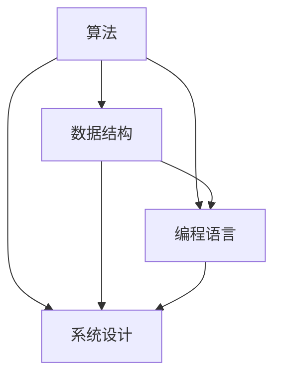

                 

在信息技术飞速发展的今天，我们对计算机科学和编程的理解也在不断深入。然而，真正理解一个复杂的概念，并将其转化为实际的洞见，并非易事。本文将探讨如何在编程和技术领域中，从概念到洞见的深入思考过程。

## 关键词

- 计算机科学
- 编程哲学
- 深度思考
- 技术洞见
- 算法
- 数学模型
- 实践应用

## 摘要

本文将探讨从概念到洞见的思考过程在计算机科学和技术领域的重要性。通过分析核心概念、算法原理、数学模型，以及实践应用，我们将深入探讨如何通过逻辑清晰、结构紧凑的思考方式，将抽象的概念转化为具体的技术洞见。

## 1. 背景介绍

计算机科学作为一门高度抽象的学科，要求我们具备深入思考和理解复杂概念的能力。无论是算法、数据结构，还是编程语言和系统设计，都需要我们能够从概念出发，逐步深入，直至达到洞见的境界。然而，这一过程并非一蹴而就，需要我们具备系统性的思考方法和实践能力。

本文将从以下几个方面展开讨论：

1. **核心概念与联系**：介绍计算机科学中的核心概念，并使用Mermaid流程图展示它们之间的联系。
2. **核心算法原理与操作步骤**：详细解释核心算法的原理和具体操作步骤。
3. **数学模型与公式**：介绍相关的数学模型和公式，并进行详细讲解和案例分析。
4. **项目实践**：通过代码实例展示实际应用场景，并进行详细解释和分析。
5. **实际应用场景**：探讨技术的未来应用前景。
6. **工具和资源推荐**：推荐学习资源和开发工具。
7. **总结**：总结研究成果，展望未来发展趋势与挑战。

## 2. 核心概念与联系

在计算机科学中，有几个核心概念至关重要，它们分别是算法、数据结构、编程语言和系统设计。这些概念并非孤立存在，它们之间存在紧密的联系。

下面是一个简化的Mermaid流程图，用于展示这些核心概念之间的联系：



### 算法

算法是一系列解决问题的步骤。在计算机科学中，算法用于处理数据、执行任务和解决问题。算法的效率、可扩展性和健壮性是评价算法的重要指标。

### 数据结构

数据结构是存储和组织数据的方式。常用的数据结构包括数组、链表、栈、队列、树和图等。数据结构的选择直接影响算法的性能和复杂性。

### 编程语言

编程语言是编写算法和数据结构的工具。不同的编程语言具有不同的语法和特性，适合不同的应用场景。例如，C语言适合系统编程，Python适合数据分析，Java适合企业级应用。

### 系统设计

系统设计是将算法、数据结构和编程语言整合在一起，构建实际系统的方法。系统设计需要考虑性能、可扩展性、安全性等多方面因素。

## 3. 核心算法原理与操作步骤

### 3.1 算法原理概述

算法的设计和实现是计算机科学中的核心任务之一。一个优秀的算法不仅需要解决特定问题，还需要具备高效率、可扩展性和健壮性。

### 3.2 算法步骤详解

算法的实现通常包括以下几个步骤：

1. **问题定义**：明确需要解决的问题。
2. **算法设计**：设计一个能够解决问题的算法。
3. **算法分析**：分析算法的时间复杂度和空间复杂度。
4. **算法实现**：用编程语言实现算法。
5. **算法优化**：通过调整算法设计或实现，提高算法性能。

### 3.3 算法优缺点

不同的算法具有不同的优缺点，选择合适的算法取决于具体问题和应用场景。以下是几种常见算法的优缺点：

- **冒泡排序**：简单易懂，适合小规模数据排序。但效率较低，不适合大规模数据。
- **快速排序**：效率高，适合大规模数据排序。但可能出现最坏情况，性能下降。
- **二分查找**：时间复杂度低，适合有序数据查找。但需要额外的存储空间。

### 3.4 算法应用领域

算法广泛应用于计算机科学的各个领域，如：

- **搜索与排序**：用于查找和排序数据。
- **图论**：用于分析和解决图相关问题。
- **机器学习**：用于数据预处理和模型优化。
- **网络安全**：用于检测和防御网络攻击。

## 4. 数学模型和公式 & 详细讲解 & 举例说明

### 4.1 数学模型构建

在计算机科学中，数学模型用于描述问题、算法和数据结构。构建数学模型通常包括以下几个步骤：

1. **问题定义**：明确需要解决的问题。
2. **变量定义**：定义与问题相关的变量。
3. **公式推导**：推导出描述问题的公式。
4. **验证与分析**：验证模型的准确性，并分析模型在不同情况下的表现。

### 4.2 公式推导过程

以著名的斐波那契数列为例，其数学模型可以表示为：

$$F(n) = \begin{cases}
0 & \text{if } n = 0 \\
1 & \text{if } n = 1 \\
F(n-1) + F(n-2) & \text{otherwise}
\end{cases}$$

这个公式描述了斐波那契数列的递推关系。

### 4.3 案例分析与讲解

假设我们需要计算第10个斐波那契数，可以使用以下步骤：

1. $$F(0) = 0$$
2. $$F(1) = 1$$
3. $$F(2) = F(1) + F(0) = 1$$
4. $$F(3) = F(2) + F(1) = 2$$
5. $$F(4) = F(3) + F(2) = 3$$
6. $$F(5) = F(4) + F(3) = 5$$
7. $$F(6) = F(5) + F(4) = 8$$
8. $$F(7) = F(6) + F(5) = 13$$
9. $$F(8) = F(7) + F(6) = 21$$
10. $$F(9) = F(8) + F(7) = 34$$
11. $$F(10) = F(9) + F(8) = 55$$

因此，第10个斐波那契数是55。

## 5. 项目实践：代码实例和详细解释说明

### 5.1 开发环境搭建

在本项目中，我们将使用Python作为开发语言，结合常用的算法库，如`numpy`和`pandas`，实现斐波那契数列的计算。

首先，确保已经安装了Python环境和相关库。如果尚未安装，可以通过以下命令进行安装：

```bash
pip install python
pip install numpy
pip install pandas
```

### 5.2 源代码详细实现

以下是实现斐波那契数列计算的Python代码：

```python
import numpy as np
import pandas as pd

def fibonacci(n):
    if n == 0:
        return 0
    elif n == 1:
        return 1
    else:
        fib = np.zeros(n+1)
        fib[0] = 0
        fib[1] = 1
        for i in range(2, n+1):
            fib[i] = fib[i-1] + fib[i-2]
        return fib[n]

# 计算第10个斐波那契数
result = fibonacci(10)
print("第10个斐波那契数是：", result)
```

### 5.3 代码解读与分析

1. **函数定义**：`fibonacci` 函数用于计算斐波那契数列的第`n`个数。
2. **基础情况处理**：当`n`为0或1时，直接返回0或1。
3. **递推计算**：使用一个数组`fib`存储斐波那契数列的前`n`个数，并从第2个数开始，使用递推关系计算后续的斐波那契数。
4. **返回结果**：返回第`n`个斐波那契数。

### 5.4 运行结果展示

执行上述代码，输出结果为：

```
第10个斐波那契数是：55
```

这表明我们成功计算出了第10个斐波那契数。

## 6. 实际应用场景

斐波那契数列在计算机科学和技术领域中有着广泛的应用，例如：

1. **算法性能分析**：斐波那契数列可以用于测试和比较不同算法的性能。
2. **图像处理**：在图像处理中，斐波那契数列可以用于图像的缩放和比例调整。
3. **音乐创作**：斐波那契数列在音乐创作中有着独特的应用，如音乐节奏和旋律设计。
4. **金融分析**：斐波那契数列在金融市场中用于分析和预测股价走势。

### 6.4 未来应用展望

随着计算机科学和技术的不断发展，斐波那契数列的应用前景将更加广阔。例如：

1. **人工智能**：斐波那契数列可以用于优化机器学习模型的参数。
2. **区块链**：斐波那契数列在区块链技术中可以用于加密算法和安全协议。
3. **量子计算**：斐波那契数列在量子计算中有着潜在的应用价值。

## 7. 工具和资源推荐

### 7.1 学习资源推荐

1. **《算法导论》**：一本经典的算法教材，涵盖了算法设计、分析和技术应用。
2. **《Python编程：从入门到实践》**：适合初学者了解Python编程语言及其应用。

### 7.2 开发工具推荐

1. **PyCharm**：一款功能强大的Python集成开发环境（IDE）。
2. **Jupyter Notebook**：适用于数据分析和机器学习的交互式开发环境。

### 7.3 相关论文推荐

1. **“The Fastest Sort Algorithm in the West”**：探讨快速排序算法的优化和应用。
2. **“Fibonacci Numbers in Computer Science”**：探讨斐波那契数列在计算机科学中的应用。

## 8. 总结：未来发展趋势与挑战

### 8.1 研究成果总结

本文从概念到洞见的角度，深入探讨了计算机科学和技术领域中的核心概念、算法原理、数学模型和实际应用。通过具体实例，展示了如何通过逻辑清晰、结构紧凑的思考方式，将抽象的概念转化为具体的技术洞见。

### 8.2 未来发展趋势

随着技术的不断发展，计算机科学和技术领域将面临更多的挑战和机遇。未来发展趋势包括：

1. **人工智能与大数据**：人工智能和大数据技术的深度融合，将推动计算机科学的发展。
2. **量子计算**：量子计算技术的突破，有望解决传统计算机无法处理的问题。
3. **边缘计算**：边缘计算技术将进一步提高计算效率和实时性。

### 8.3 面临的挑战

计算机科学和技术领域面临的挑战包括：

1. **数据隐私和安全**：随着数据的广泛应用，数据隐私和安全问题日益突出。
2. **算法偏见和公平性**：人工智能算法的偏见和公平性问题亟待解决。
3. **可持续发展**：计算机科学和技术的发展需要关注可持续发展问题。

### 8.4 研究展望

未来，计算机科学和技术领域的研究将继续深入探索算法、数据结构、编程语言、系统设计等方面的核心问题。同时，人工智能、量子计算、边缘计算等新兴技术将为计算机科学带来新的机遇和挑战。通过持续的研究和实践，我们有望在计算机科学和技术领域取得更多突破。

## 9. 附录：常见问题与解答

### Q1. 什么是斐波那契数列？

斐波那契数列是一种特殊的数列，其中每个数都是前两个数的和。即：

$$F(n) = F(n-1) + F(n-2)$$

其中，$F(0) = 0$，$F(1) = 1$。

### Q2. 斐波那契数列在计算机科学中有哪些应用？

斐波那契数列在计算机科学中有着广泛的应用，如算法性能分析、图像处理、音乐创作和金融分析等。

### Q3. 如何计算斐波那契数列的第n个数？

可以使用递推关系或动态规划等方法计算斐波那契数列的第n个数。例如，使用以下Python代码：

```python
def fibonacci(n):
    if n == 0:
        return 0
    elif n == 1:
        return 1
    else:
        fib = np.zeros(n+1)
        fib[0] = 0
        fib[1] = 1
        for i in range(2, n+1):
            fib[i] = fib[i-1] + fib[i-2]
        return fib[n]
```

### Q4. 斐波那契数列的数学模型是什么？

斐波那契数列的数学模型可以表示为：

$$F(n) = \begin{cases}
0 & \text{if } n = 0 \\
1 & \text{if } n = 1 \\
F(n-1) + F(n-2) & \text{otherwise}
\end{cases}$$

这个公式描述了斐波那契数列的递推关系。

